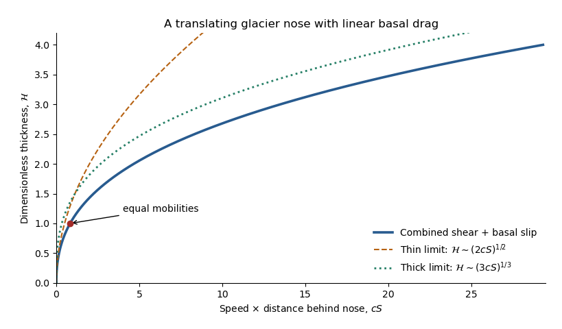

<h1 id="3/solution">Solution</h1>

↑ **Parent:** [3](../3.md)

Take $z$ upward from the horizontal bed and measure $x$ away from an [ice divide](../../../../../ice-divide.md). In the [shallow-ice approximation](../../../../../shallow-ice-approximation.md), the [hydrostatic pressure](../../../../../hydrostatic-pressure.md) is $p=p_a+\rho g(h-z)$ and the horizontal balance for a [Newtonian fluid](../../../../../newtonian-fluid.md) is

$$
\mu u_{zz}=p_x=\rho g h_x.
$$

The upper [stress-free boundary condition](../../../../../stress-free-boundary-condition.md) gives $u_z(h)=0$. The resisting basal traction is $-\mu\beta u_b$, so the fluid-side [shear stress](../../../../../shear-stress.md) satisfies $\mu u_z(0)=\mu\beta u_b$. This is a [Navier slip boundary condition](../../../../../navier-slip-boundary-condition.md) with [slip length](../../../../../slip-length.md) $\ell_s=1/\beta$. Integrating twice gives

$$
\boxed{u(z)=-\frac{\rho g}{\mu}h_x\left(\frac h\beta+hz-\frac{z^2}{2}\right),\qquad
u_b=-\frac{\rho g}{\mu\beta}h h_x.}
$$

The first term is the uniform [basal sliding](../../../../../basal-sliding.md) contribution, while the quadratic term is internal viscous deformation. Both are positive where the thickness decreases downstream.

The [shallow-ice flux with linear basal drag](../../../../../shallow-ice-flux-with-linear-basal-drag.md) is

$$
\boxed{q=\int_0^h u\,dz=-\frac{\rho g}{\mu}\left(\frac{h^3}{3}+\frac{h^2}{\beta}\right)h_x,\qquad
h_t=\frac{\rho g}{\mu}\partial_x\left[\left(\frac{h^3}{3}+\frac{h^2}{\beta}\right)h_x\right].}
$$

No [ice accumulation](../../../../../ice-accumulation.md) or [ice ablation](../../../../../ice-ablation.md) appears. For a symmetric [glacier](../../../../../glacier.md), work on one half, $0\le x\le x_N(t)$, with $q(0,t)=0$, $h(x_N,t)=0$ and no outgoing [volume flux](../../../../../volumetric-flow-rate.md). Its conserved half-volume per unit width is $V_g=\int_0^{x_N}h\,dx$; the full [glacier](../../../../../glacier.md) has volume $2V_g$. This specifies the volume convention rather than silently supplying an unspecified value. For a general finite release on the whole line, the late [similarity solution](../../../../../similarity-solution.md) is centred on its conserved centre of mass and uses half its total volume for $V_g$.

The internal-shear and [linear basal drag law](../../../../../linear-basal-drag-law.md) mobilities are equal at $H_*=3/\beta$. Suitable vertical, horizontal and temporal scales are

$$
\boxed{H_* =\frac3\beta,\qquad L_* =\frac{V_g}{H_*}=\frac{\beta V_g}{3},\qquad
T_* =\frac{3\mu L_*^2}{\rho gH_*^3}=\frac{\mu\beta^5V_g^2}{81\rho g}.}
$$

Write $h=H_*\mathcal H$, $x=L_*X$, $t=T_*\tau$. Then

$$
\boxed{\mathcal H_\tau=\partial_X[(\mathcal H^3+\mathcal H^2)\mathcal H_X],\qquad
\int_0^{X_N}\mathcal H\,dX=1.}
$$

The initial typical thickness is $\mathcal H\simeq10$, the initial extent is of order $L_*/10$, and its shear-controlled spreading time is of order $T_*/10^5$. The [shallow-ice approximation](../../../../../shallow-ice-approximation.md) also requires small aspect ratio: in particular the initial thickness and extent must satisfy approximately $100H_*/L_*\ll1$. The equations model the broad shallow bulk; the very tip can require physics beyond that approximation.

The two limiting equations are [porous medium equations](../../../../../porous-medium-equation.md) of the form $\mathcal H_\tau=(\mathcal H^n\mathcal H_X)_X$, with $n=3$ for a thick shear-dominated [glacier](../../../../../glacier.md) and $n=2$ for a thin sliding-dominated [glacier](../../../../../glacier.md). [Volume conservation](../../../../../volume-conservation.md) and balance of the time derivative give exponent $\alpha=1/(n+2)$. Set $\mathcal H=\tau^{-\alpha}f(\eta)$, $\eta=X\tau^{-\alpha}$. One integration, using zero [volume flux](../../../../../volumetric-flow-rate.md) at the [ice divide](../../../../../ice-divide.md), gives $f^n f'=-\alpha\eta f$, hence

$$
f(\eta)=\left[c_n(\eta_n^2-\eta^2)\right]^{1/n},\qquad c_n=\frac{n}{2(n+2)}.
$$

The [planar volume-conserving nonlinear-diffusion similarity](../../../../../planar-volume-conserving-nonlinear-diffusion-similarity.md) is therefore

$$
\boxed{\mathcal H_n(X,\tau)=\left[\frac{c_n}{\tau}\left(\eta_n^2\tau^{2/(n+2)}-X^2\right)\right]_+^{1/n},\qquad
X_N=\eta_n\tau^{1/(n+2)}.}
$$

The [Beta function](../../../../../beta-function.md) fixes its constants:

$$
I_n=\int_0^1(1-s^2)^{1/n}\,ds=\frac12B\!\left(\frac12,1+\frac1n\right),\qquad
\eta_n=\left(c_n^{-1/n}/I_n\right)^{n/(n+2)}.
$$

Consequently the explicit early shear and late sliding limits are

$$
\boxed{\begin{aligned}
\mathcal H_\mathrm{early}&=\left[\frac{3}{10\tau}\left(\eta_3^2\tau^{2/5}-X^2\right)\right]_+^{1/3},&\eta_3&\simeq1.41124,\\
\mathcal H_\mathrm{late}&=\frac1{2\sqrt\tau}\left[\eta_2^2\tau^{1/2}-X^2\right]_+^{1/2},&\eta_2&=\sqrt{8/\pi}.
\end{aligned}}
$$

Their centre depths are $A_3\tau^{-1/5}$ with $A_3\simeq0.842252$, and $A_2\tau^{-1/4}$ with $A_2=\sqrt{2/\pi}$. Thus the early extent grows as $t^{1/5}$ and the late extent as $t^{1/4}$. These are asymptotic regime profiles; they solve the respective limiting equations, not the full sum of both mobilities. For arbitrary finite-width initial data they are appropriate after the corresponding spatial relaxation, with a virtual time origin depending on that data.

The [shear-to-slip transition in a shallow ice current](../../../../../shear-to-slip-transition-in-a-shallow-ice-current.md) occurs at thickness of order $H_*$. Using equality at the centre of the early [similarity solution](../../../../../similarity-solution.md) gives

$$
\boxed{\tau_\mathrm{tr}\simeq A_3^5=\frac{3}{10I_3^2}\simeq0.42385.}
$$

If the initial profile is already approximated by that early [similarity solution](../../../../../similarity-solution.md) and its centre depth is 10, the virtual age is $\tau_0=A_3^5/10^5\simeq4.2385\times10^{-6}$, and the elapsed estimate is $\tau_\mathrm{tr}-\tau_0$. Other reasonable definitions of typical thickness change the order-one coefficient; the initial thickness alone does not uniquely determine an exact transition time or an exact initial profile. The robust nondimensional estimate is **a transition time of order one in the $T_*$ scale**.

Finally, let a local nose translate steadily at positive speed $v$ and write $s=x_N-x\ge0$. This is a local [traveling nose of a glacier with linear basal drag](../../../../../traveling-nose-of-a-glacier-with-linear-basal-drag.md); the speed of the globally spreading [glacier](../../../../../glacier.md) changes slowly with time. The local [mass conservation](../../../../../mass-conservation.md) equation integrates to $q=vh$, since both $q$ and $h$ vanish at the front. Therefore

$$
v=\frac{\rho g}{\mu}\left(\frac{h^2}{3}+\frac h\beta\right)\frac{dh}{ds},\qquad
\boxed{s=\frac{\rho g}{\mu v}\left(\frac{h^3}{9}+\frac{h^2}{2\beta}\right).}
$$

**[Figure 2](#3/image-combined-basal-slip-and-internal-shear-glacier-nose-with-square-root-and-cube-root-limits). Combined basal-slip and internal-shear glacier nose, with square-root and cube-root limits**.

The right side is strictly increasing, giving a unique positive thickness at every $s>0$. With $S=X_N-X$ and $c=dX_N/d\tau$, the same relation reads $cS=\mathcal H^3/3+\mathcal H^2/2$. Its limiting profiles are

$$
\boxed{h\sim\left(\frac{2\mu\beta v s}{\rho g}\right)^{1/2}\quad(h\ll3/\beta),\qquad
h\sim\left(\frac{9\mu v s}{\rho g}\right)^{1/3}\quad(h\gg3/\beta).}
$$

The square-root tip reflects [basal sliding](../../../../../basal-sliding.md); the cube-root thicker region reflects internal viscous deformation. Even during the early thick regime, the very nose is thin and has the square-root inner form. At late times that sliding balance governs nearly the whole profile. The dimensionless crossover thickness is $\mathcal H=1$ and its distance is $S=5/(6c)$; the early thick cube-root outer profile matches this smaller sliding region. The diverging geometric slope at the idealized tip also marks the local limit of the long-wave [shallow-ice approximation](../../../../../shallow-ice-approximation.md).

## ↑ Ancestors (10)

1. [3](../3.md)
2. [Paper 332](../../paper-332-split.md)
3. [Iii](../../split.md)
4. [2016](../../../split.md)
5. [Past exam of the mathematics course of the University of Cambridge](../../../../split.md)
6. [Mathematics course of the University of Cambridge](../../../../../mathematics-course-of-the-university-of-cambridge.md)
7. [Course of the University of Cambridge](../../../../../course-of-the-university-of-cambridge.md)
8. [University of Cambridge](../../../../../university-of-cambridge-split.md)
9. [List of universities](../../../../../list-of-universities.md)
10. [Codex Wiki](../../../../../split.md)
