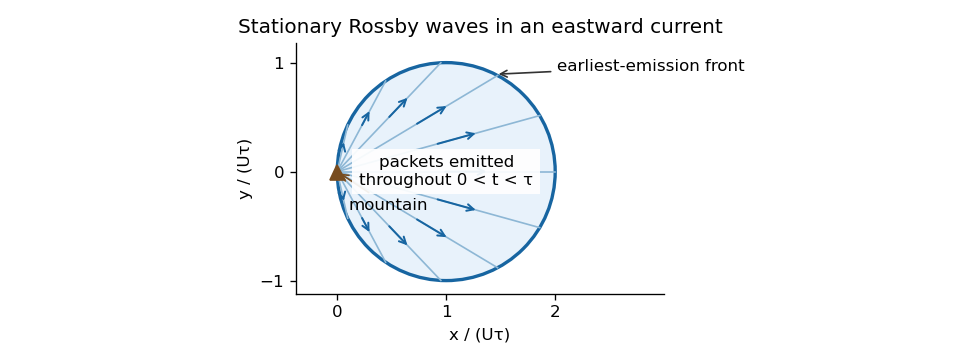

<h1 id="3/iv/solution">Solution</h1>

↑ **Parent:** [Iv](../iv.md)

Take $\beta>0$, a uniform eastward $U>0$, and the nondivergent [Barotropic Rossby wave](../../../../../../barotropic-rossby-wave.md) model. Its [dispersion relation](../../../../../../dispersion-relation.md) is $\omega=Uk-\beta k/(k^2+l^2)$. A stationary wave with $k\ne0$ has

$$
\boxed{K^2=k^2+l^2=\frac\beta U,\qquad \lambda=\frac{2\pi}{K}=2\pi\sqrt{\frac U\beta}.}
$$

The directional component wavelengths are $2\pi/|k|$ and $2\pi/|l|$ when nonzero. Differentiating the full [dispersion relation](../../../../../../dispersion-relation.md) before imposing stationarity gives its ground-frame [group velocity](../../../../../../group-velocity.md):

$$
\mathbf c_g=\left(U+\frac{\beta(k^2-l^2)}{K^4},\frac{2\beta kl}{K^4}\right)=\boxed{\frac{2U}{K^2}(k^2,kl)}.
$$

Writing $k=K\cos\theta$, $l=K\sin\theta$ shows $\mathbf c_g=U(1+\cos2\theta,\sin2\theta)$. Therefore the [stationary Rossby-wave ray envelope](../../../../../../stationary-rossby-wave-ray-envelope.md) at time $\tau$, for [wave packets](../../../../../../wave-packet.md) emitted from a localized mountain throughout $0<t<\tau$, is the disk

$$
\boxed{(x-U\tau)^2+y^2\le(U\tau)^2,\qquad x\ge0.}
$$

The circle is the front of the earliest emissions; later emissions fill ray segments back to the source. The sketch represents the geometrical [wave packet](../../../../../../wave-packet.md) envelope, not compact support of the full balanced near field. All propagating [wave packet](../../../../../../wave-packet.md) energy lies downstream in this model.

**[Figure 1](#3/iv/image-downstream-ray-envelope-of-stationary-barotropic-rossby-waves-emitted-by-a-mountain-between-zero-and-the-observation-time). Downstream ray envelope of stationary barotropic Rossby waves emitted by a mountain between zero and the observation time**.

If the finite-depth free-surface model of the preceding part is retained consistently, its basic surface slope adds $U/R_D^2$ to the potential-vorticity gradient. Stationarity still gives $K^2=\beta/U$ and the same wavelength, but the [group velocity](../../../../../../group-velocity.md) is reduced by $\gamma=K^2/(K^2+R_D^{-2})$; the disk center and radius become $\gamma U\tau$. This tends to the plotted nondivergent result as $R_D\to\infty$.

**A westward wind has no nontrivial stationary propagating planetary Rossby-wave train in this model:** $U<0$ would require $K^2=\beta/U<0$. Its advective phase motion and intrinsic westward [Rossby wave](../../../../../../rossby-wave.md) phase motion cannot cancel. A local forced, evanescent response and time-dependent disturbances can still occur. The degenerate $k=0$ limit is not a propagating wave train from an isolated mountain.

## ↑ Ancestors (11)

1. [Iv](../iv.md)
2. [3](../../3.md)
3. [Paper 333](../../../paper-333-split.md)
4. [Iii](../../../split.md)
5. [2016](../../../../split.md)
6. [Past exam of the mathematics course of the University of Cambridge](../../../../../split.md)
7. [Mathematics course of the University of Cambridge](../../../../../../mathematics-course-of-the-university-of-cambridge.md)
8. [Course of the University of Cambridge](../../../../../../course-of-the-university-of-cambridge.md)
9. [University of Cambridge](../../../../../../university-of-cambridge-split.md)
10. [List of universities](../../../../../../list-of-universities.md)
11. [Codex Wiki](../../../../../../split.md)
