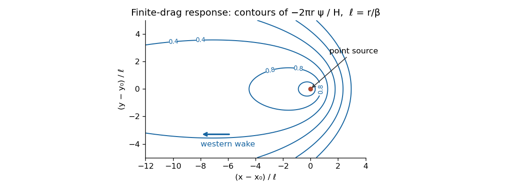

<h1 id="4/iv/solution">Solution</h1>

↑ **Parent:** [Iv](../iv.md)

Put $X=x-x_0$, $Y=y-y_0$ and take $\beta,r,H>0$. The constant-depth [ocean transport streamfunction](../../../../../../ocean-transport-streamfunction.md) equation is

$$
r\nabla_h^2\psi+\beta\psi_x=H\delta(X)\delta(Y).
$$

It is a steady [advection-diffusion equation](../../../../../../advection-diffusion-equation.md) for the transport response, with westward [pseudovelocity](../../../../../../topographic-potential-vorticity-pseudovelocity.md). For an unbounded domain the [point-forced Sverdrup–drag Green function](../../../../../../point-forced-sverdrup-drag-green-function.md) can make its contours precise. Set $a=\beta/(2r)$ and $\psi=e^{-aX}\phi$. Then

$$
(\nabla_h^2-a^2)\phi=\frac Hr\delta(X)\delta(Y),\qquad \boxed{\psi=-\frac{H}{2\pi r}e^{-aX}K_0\left(a\sqrt{X^2+Y^2}\right),}
$$

where $K_0$ is the [Modified Bessel function of the second kind](../../../../../../modified-bessel-function-of-the-second-kind.md). This optional explicit expression is used only to produce the requested sketch; no weak-drag assumption is imposed.

**[Figure 2](#4/iv/image-streamfunction-contours-around-a-point-wind-curl-source-with-finite-bottom-drag-showing-a-long-western-wake-and-a-short-eastern-response). Streamfunction contours around a point wind-curl source with finite bottom drag, showing a long western wake and a short eastern response**.

Near the source the logarithmic singularity produces almost circular contours. At distances large compared with $\ell=r/\beta$, $K_0(aR)\sim\sqrt{\pi/(2aR)}e^{-aR}$, so the response is proportional to $e^{-a(R+X)}/\sqrt R$. It decays exponentially eastward, but only algebraically on the western axis; its broad western wake has transverse width of order $\sqrt{\ell|X|}$. **Contours are stretched westward**, with closed finite-level contours around the source and sharper eastern gradients. Larger drag broadens the scale $\ell$ and makes any fixed nearby view more nearly circular. For $r=0$ the elliptic smoothing disappears; for $\beta=0$ the infinite-plane response is logarithmic up to a gauge and cannot be fixed by a zero-at-infinity condition.

## ↑ Ancestors (11)

1. [Iv](../iv.md)
2. [4](../../4.md)
3. [Paper 333](../../../paper-333-split.md)
4. [Iii](../../../split.md)
5. [2016](../../../../split.md)
6. [Past exam of the mathematics course of the University of Cambridge](../../../../../split.md)
7. [Mathematics course of the University of Cambridge](../../../../../../mathematics-course-of-the-university-of-cambridge.md)
8. [Course of the University of Cambridge](../../../../../../course-of-the-university-of-cambridge.md)
9. [University of Cambridge](../../../../../../university-of-cambridge-split.md)
10. [List of universities](../../../../../../list-of-universities.md)
11. [Codex Wiki](../../../../../../split.md)
