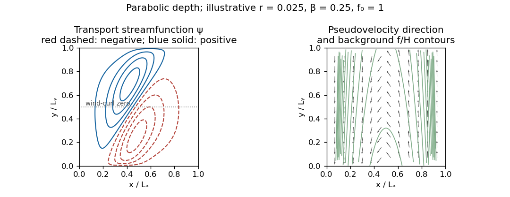

<h1 id="4/v/solution">Solution</h1>

↑ **Parent:** [V](../v.md)

Write the parabolic depth as $H(x)=a x(L_x-x)$ with $a>0$, and use $f=f_0+\beta y$, $\beta>0$. The [topographic potential-vorticity pseudovelocity](../../../../../../topographic-potential-vorticity-pseudovelocity.md) is

$$
\boxed{\widetilde u_x=-\frac\beta{a x(L_x-x)},\qquad \widetilde u_y=-\frac{(f_0+\beta y)(L_x-2x)}{a x^2(L_x-x)^2}.}
$$

It is westward everywhere in the interior. In the Northern Hemisphere it is also southward on the western slope and northward on the eastern slope. Its characteristics are the background [potential vorticity](../../../../../../potential-vorticity.md) contours

$$
\boxed{y=\frac{Qa}{\beta}x(L_x-x)-\frac{f_0}{\beta},\qquad Q=f/H,}
$$

which bend towards the south on approaching either shallow side. Along these characteristics forcing accumulates into a transport response and drag spreads it across neighboring characteristics. The actual current follows contours of $\psi$, not contours of this [pseudovelocity](../../../../../../topographic-potential-vorticity-pseudovelocity.md) in a forced region.

**[Figure 3](#4/v/image-illustrative-wind-driven-streamfunction-contours-and-westward-topographic-pseudovelocity-in-a-basin-with-parabolic-depth-and-no-normal-boundary-transport). Illustrative wind-driven streamfunction contours and westward topographic pseudovelocity in a basin with parabolic depth and no normal boundary transport**.

The sketch uses an explicit illustrative positive drag, a single connected impermeable boundary with $\psi=0$, $H=4x(1-x)$, and $f=1+0.25y$ in normalized coordinates, with small forcing amplitude $F_0=10^{-3}$; linearity makes its value affect amplitudes rather than contour shapes. Solid and dashed contours distinguish the two signs of $\psi$; arrows indicate the [pseudovelocity](../../../../../../topographic-potential-vorticity-pseudovelocity.md), not the real current. The positive lower-half wind curl tends to drive cyclonic circulation and the negative upper-half wind curl anticyclonic circulation; topographic steering bends the gyres, so their dividing contour need not coincide with the forcing's zero line. The plot is an example, not a uniquely specified circulation: the question supplies neither a drag magnitude nor full boundary data.

The westward propagation of transport information explains the connection with [western boundary currents](../../../../../../western-boundary-current.md): a broad wind-driven interior generally needs a narrow western return region to satisfy the impermeable boundary condition. For constant depth the characteristic direction is purely westward and the [Stommel boundary layer](../../../../../../stommel-boundary-layer.md) width is $r/\beta$ for this drag normalization. Here strong depth gradients also steer the return along slopes and can make topographic boundary currents important; a conventional flat-bottom western-current profile does not follow unchanged. **The equation becomes singular where $H=0$.** The drawn shore limits impose zero transport; a physically resolved shoreline would need a positive-depth cutoff or a separate near-shore model, and the small-[Rossby number](../../../../../../rossby-number.md) approximation need not remain uniform there.

## ↑ Ancestors (11)

1. [V](../v.md)
2. [4](../../4.md)
3. [Paper 333](../../../paper-333-split.md)
4. [Iii](../../../split.md)
5. [2016](../../../../split.md)
6. [Past exam of the mathematics course of the University of Cambridge](../../../../../split.md)
7. [Mathematics course of the University of Cambridge](../../../../../../mathematics-course-of-the-university-of-cambridge.md)
8. [Course of the University of Cambridge](../../../../../../course-of-the-university-of-cambridge.md)
9. [University of Cambridge](../../../../../../university-of-cambridge-split.md)
10. [List of universities](../../../../../../list-of-universities.md)
11. [Codex Wiki](../../../../../../split.md)
