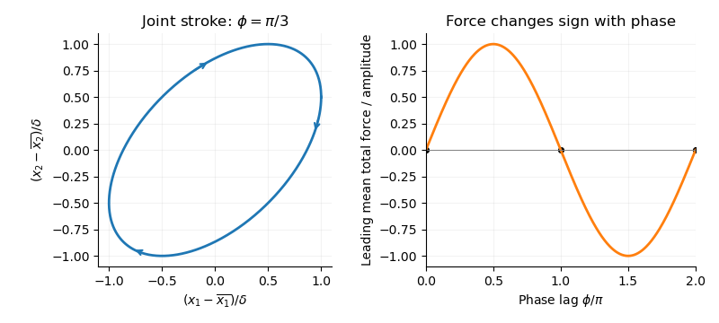

<h1 id="1/solution">Solution</h1>

↑ **Parent:** [1](../1.md)

Let $\mu$ be the [dynamic viscosity](../../../../../dynamic-viscosity.md), $u_i=\dot x_i$, and $F_i$ the signed force exerted by sphere $i$ on the fluid. For negligible sphere inertia, this also equals the externally or internally applied force on that sphere; its hydrodynamic force is $-F_i$. The [Stokes drag law](../../../../../stokes-s-law.md) and the axial velocity of a [Stokeslet](../../../../../stokeslet.md) give the leading [hydrodynamic mobility matrix](../../../../../hydrodynamic-mobility-matrix.md)

$$
\begin{pmatrix}u_1\\u_2\end{pmatrix}
=\begin{pmatrix}m_1&h(\ell)\\h(\ell)&m_2\end{pmatrix}
\begin{pmatrix}F_1\\F_2\end{pmatrix},\qquad
m_i=\frac1{6\pi\mu a_i},\quad h(\ell)=\frac1{4\pi\mu\ell}.
$$

The factor $1/(4\pi\mu\ell)$ follows from $(I+\hat{\mathbf r}\hat{\mathbf r})\mathbf F/(8\pi\mu\ell)$ when $\mathbf F$ is parallel to the line of centres. The [longitudinal two-sphere mobility](../../../../../longitudinal-two-sphere-mobility.md) retains the first interaction in $a_i/\ell$; finite-size and repeated-reflection corrections are higher order.

For the linked [force-free](../../../../../force-free.md) pair, $F_2=-F_1$. Put $X=(x_1+x_2)/2$ and $S_m=m_1+m_2$. Then

$$
\dot\ell=(2h-S_m)F_1,\qquad
\dot X=\frac{m_1-m_2}{2}F_1,
$$

so

$$
\boxed{\dot X=-\frac{m_1-m_2}{2[S_m-2h(\ell)]}\,\dot\ell}.
$$

The coefficient depends only on the current separation. For any period $T$, $\ell(T)=\ell(0)$, and therefore

$$
X(T)-X(0)=\oint -\frac{m_1-m_2}{2[S_m-2h(\ell)]}\,d\ell=\boxed{0}.
$$

This is a closed integral of a single-valued function of one real shape coordinate. Since $x_1=X-\ell/2$ and $x_2=X+\ell/2$, both spheres also have zero net displacement. Equal radii make $\dot X=0$ instantaneously; unequal radii generally permit oscillatory translation, but still no mean motion. This explicit [force-free two-sphere stroke](../../../../../force-free-two-sphere-stroke.md) is the [scallop theorem](../../../../../scallop-theorem.md): a single-parameter reciprocal deformation in a [Newtonian fluid](../../../../../newtonian-fluid.md) at zero inertia cannot produce net free swimming. The timing of extension and contraction cannot change that conclusion, because [Stokes flow](../../../../../stokes-flow-split.md) has no inertial memory.

For the externally prescribed pair, put $q=\omega t$, $\zeta_i=1/m_i=6\pi\mu a_i$, and

$$
d(t)=\ell(t)-\ell_0=\delta[\cos(q+\phi)-\cos q],\qquad
u_1=-\delta\omega\sin q,\quad u_2=-\delta\omega\sin(q+\phi).
$$

Invert the [hydrodynamic mobility matrix](../../../../../hydrodynamic-mobility-matrix.md):

$$
F_1=\frac{m_2u_1-hu_2}{m_1m_2-h^2}
=\zeta_1u_1-\zeta_1\zeta_2hu_2+\zeta_1^2\zeta_2h^2u_1+\cdots.
$$

In a large-$\ell_0$ expansion with $a_i,\delta$ fixed,

$$
h=\frac1{4\pi\mu}\left(\frac1{\ell_0}-\frac d{\ell_0^2}\right)+O(\ell_0^{-3}).
$$

The isolated-drag term and the constant-$h$ interaction have zero mean. The order-$\ell_0^{-2}$ term from $h^2u_1$ also has zero mean, since its coefficient is constant at that order. Meanwhile,

$$
\langle d u_2\rangle_t=\frac{\delta^2\omega}{2}\sin\phi.
$$

Consequently the [externally driven two-sphere pump](../../../../../externally-driven-two-sphere-pump.md) has the following [phase-dependent mean force of an externally driven sphere pair](../../../../../phase-dependent-mean-force-of-an-externally-driven-sphere-pair.md):

$$
\boxed{\langle F_1\rangle_t=\frac{\zeta_1\zeta_2\delta^2\omega}{8\pi\mu\ell_0^2}\sin\phi
=\frac{9\pi\mu a_1a_2\delta^2\omega}{2\ell_0^2}\sin\phi+O(\ell_0^{-3})}.
$$

Here $\langle\cdot\rangle_t$ denotes averaging over one period. The analogous calculation gives $\langle d u_1\rangle_t=\delta^2\omega\sin\phi/2$, so **$\langle F_2\rangle_t=\langle F_1\rangle_t$ at leading order**, and

$$
\boxed{\langle F_1+F_2\rangle_t=\frac{9\pi\mu a_1a_2\delta^2\omega}{\ell_0^2}\sin\phi+O(\ell_0^{-3})}.
$$

Thus the mean fluid forcing is nonzero except at **$\phi=0$ or $\pi$ modulo $2\pi$**. The sign changes when the phase lag is reversed. Those exceptional strokes are reciprocal: the position-space loop collapses to a line, and their mean force vanishes by reversibility, not just by this leading expansion.

**[Figure 1](#1/image-an-externally-driven-two-sphere-stroke-with-phase-lag-pi-over-three-encloses-a-position-space-loop-and-its-leading-mean-fluid-force-varies-as-the-sine-of-the-phase-lag). An externally driven two-sphere stroke with phase lag pi over three encloses a position-space loop, and its leading mean fluid force varies as the sine of the phase lag**.

There is no contradiction with the [scallop theorem](../../../../../scallop-theorem.md). The externally imposed motion is not [force-free](../../../../../force-free.md), and the actuators prescribe two phase-shifted motions; their combined motion is not reciprocal for a generic phase. The spheres return to their prescribed positions while transferring a mean force to the fluid. This is pumping by external forcing, rather than propulsion of the freely linked one-shape-coordinate system.

The asymptotic calculation requires $\delta/\ell_0\ll1$ and persistent large separation. The [minimum separation of phase-shifted sphere oscillations](../../../../../minimum-separation-of-phase-shifted-sphere-oscillations.md) is

$$
\min_t\ell(t)=\ell_0-2\delta|\sin(\phi/2)|.
$$

The printed condition $\ell_0\geq\delta$ alone does not guarantee nonoverlap or the stipulated far-separated regime. The prescribed trajectories must additionally keep this minimum well above both radii. This is a compatibility qualification on the data, not a change of the phase-dependent force calculation.

## ↑ Ancestors (10)

1. [1](../1.md)
2. [Paper 334](../../paper-334-split.md)
3. [Iii](../../split.md)
4. [2016](../../../split.md)
5. [Past exam of the mathematics course of the University of Cambridge](../../../../split.md)
6. [Mathematics course of the University of Cambridge](../../../../../mathematics-course-of-the-university-of-cambridge.md)
7. [Course of the University of Cambridge](../../../../../course-of-the-university-of-cambridge.md)
8. [University of Cambridge](../../../../../university-of-cambridge-split.md)
9. [List of universities](../../../../../list-of-universities.md)
10. [Codex Wiki](../../../../../split.md)
