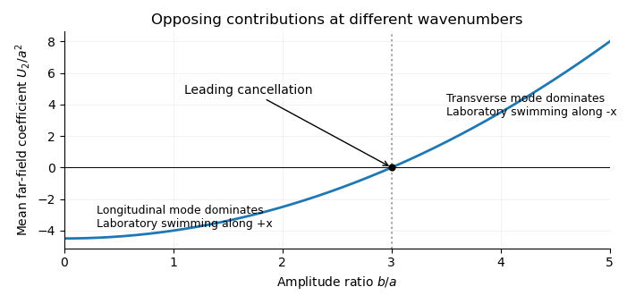

<h1 id="2/solution">Solution</h1>

↑ **Parent:** [2](../2.md)

Use $u=\partial_y\psi$ and $v=-\partial_x\psi$ in the frame translating with the sheet. At each instant, the incompressible [Stokes equations](../../../../../stokes-equation.md) are

$$
-\nabla p+\mu\nabla^2\mathbf u=0,\qquad\nabla\cdot\mathbf u=0.
$$

Taking their curl gives the [biharmonic stream function for planar Stokes flow](../../../../../biharmonic-stream-function-for-planar-stokes-flow.md):

$$
\boxed{\nabla^4\psi=0}
$$

in the fluid above the actual sheet. The [no-slip boundary condition](../../../../../no-slip-boundary-condition.md) is imposed on material points, whose label is $x$ and whose actual horizontal position is $x_s$. With $q=x-t$,

$$
\psi_y(x_s,y_s,t)=-3\epsilon a\cos3q,\qquad
\psi_x(x_s,y_s,t)=\epsilon b\cos q.
$$

The second sign follows from $v=\partial_t y_s=-\epsilon b\cos q$. Far above the sheet,

$$
\psi_y\to U,\qquad\psi_x\to0,
$$

with bounded velocity and no imposed mean pressure gradient. The positive far-field velocity arises because the sheet moves with laboratory velocity $-U\mathbf e_x$. All fields are $2\pi$-periodic in $x$; an additive function of time in $\psi$ is a harmless gauge. These conditions formulate the [Taylor swimming sheet](../../../../../taylor-swimming-sheet.md) problem with both types of travelling deformation.

Expand $U=\epsilon U_1+\epsilon^2U_2+\cdots$ and $\psi=\epsilon\psi_1+\epsilon^2\psi_2+\cdots$. At first order the boundary can be evaluated at $y=0$:

$$
\nabla^4\psi_1=0,\qquad
\psi_{1y}(x,0,t)=-3a\cos3q,\qquad
\psi_{1x}(x,0,t)=b\cos q.
$$

The far-field conditions are $\psi_{1y}\to U_1$ and $\psi_{1x}\to0$. For a nonzero [Fourier mode](../../../../../fourier-mode.md) of wavenumber $k$, bounded velocity selects $(E+Gy)e^{-ky}e^{ikq}$; the exponentially growing modes are excluded. Matching the modes $k=1$ and $k=3$ gives

$$
\boxed{\psi_1=b(1+y)e^{-y}\sin q-3ay e^{-3y}\cos3q}.
$$

An additive gauge has been set to zero. The first term is a [transverse mode of a Taylor swimming sheet](../../../../../transverse-mode-of-a-taylor-swimming-sheet.md), and the second is a [longitudinal mode of a Taylor swimming sheet](../../../../../longitudinal-mode-of-a-taylor-swimming-sheet.md). Their velocities decay at infinity. The mean first-order boundary velocity is zero, and the bounded zero [Fourier mode](../../../../../fourier-mode.md) is a constant plus a multiple of $y$, so **$U_1=0$**.

For the second-order [Taylor-expanded no-slip boundary condition](../../../../../taylor-expanded-no-slip-boundary-condition.md), the first-order displacement is

$$
\boldsymbol\xi=(a\sin3q,b\sin q).
$$

There is no explicit second-order material velocity in the prescribed motion. Hence, with all first-order derivatives evaluated at $(x,0,t)$,

$$
\nabla^4\psi_2=0,\qquad
u_2=-\boldsymbol\xi\cdot\nabla u_1,\qquad
v_2=-\boldsymbol\xi\cdot\nabla v_1,
$$

where $u_j=\psi_{jy}$ and $v_j=-\psi_{jx}$. Differentiation of the first-order solution gives

$$
u_{1x}=9a\sin3q,\quad u_{1y}=18a\cos3q-b\sin q,\quad
v_{1x}=b\sin q,\quad v_{1y}=-9a\sin3q
$$

on the flat reference boundary. Therefore

$$
\boxed{u_2(x,0,t)=-9a^2\sin^23q-18ab\sin q\cos3q+b^2\sin^2q,\qquad
v_2(x,0,t)=8ab\sin q\sin3q}.
$$

The boundary conditions for the [streamfunction](../../../../../stream-function.md) are $\psi_{2y}=u_2$ and $\psi_{2x}=-v_2$. Their far-field counterparts are $\psi_{2y}\to U_2$ and $\psi_{2x}\to0$.

Products of the two distinct first-order [Fourier modes](../../../../../fourier-mode.md) generate only the nonzero wavenumbers $2,4,6$, as well as a mean. Thus the bounded general solution compatible with these data has the form

$$
\boxed{\psi_2=C_0(t)+U_2y+\operatorname{Re}\left\{\sum_{k\in\{2,4,6\}}(E_k+G_ky)e^{-ky}e^{ikq}\right\}}.
$$

The discarded zero-mode terms $y^2,y^3$ would give unbounded velocity, and the discarded nonzero modes grow exponentially. The [zero-mean normal velocity in periodic half-space Stokes flow](../../../../../zero-mean-normal-velocity-in-periodic-half-space-stokes-flow.md) is consistent with a bounded periodic flow and no far-field vertical flux. For example, integrating $\psi_{2x}=-v_2$ along the boundary yields

$$
\psi_2(x,0,t)=-2ab\sin2q+ab\sin4q+C_0(t).
$$

This fixes the $E_k$; the nonconstant part of $u_2$ fixes $G_k-kE_k$. All coefficients are thereby determined, but none is needed to find the mean swimming speed.

Indeed, [mean boundary velocity determines Taylor-sheet swimming speed](../../../../../mean-boundary-velocity-determines-taylor-sheet-swimming-speed.md). The mean [Fourier mode](../../../../../fourier-mode.md) of $\psi_2$ is $C_0+U_2y$, so its horizontal velocity is the same at the boundary and infinity. [Fourier orthogonality of sheet swimming modes](../../../../../fourier-orthogonality-of-sheet-swimming-modes.md) removes the mixed product, giving

$$
\boxed{U_2=\langle u_2(x,0,t)\rangle_x=\frac{b^2-9a^2}{2},\qquad
U=\frac{\epsilon^2}{2}(b^2-9a^2)+O(\epsilon^3)}.
$$

Here $\langle\cdot\rangle_x$ is the average over one spatial period; a temporal average gives the same answer for these travelling waves. The laboratory swimming velocity is $-U\mathbf e_x$. The transverse wave drives motion opposite to its direction of propagation, whereas the longitudinal wave drives it in the propagation direction. Their wavenumbers enter quadratically. Thus **$b/a=3$ cancels the swimming speed at order $\epsilon^2$**. This [different-wavenumber cancellation in sheet swimming](../../../../../different-wavenumber-cancellation-in-sheet-swimming.md) is not a claim that all higher-order swimming terms vanish.

**[Figure 2](#2/image-the-leading-sheet-swimming-coefficient-scaled-by-a-squared-changes-sign-at-b-over-a-equal-to-three-where-longitudinal-and-transverse-contributions-cancel). The leading sheet swimming coefficient scaled by a squared changes sign at b over a equal to three, where longitudinal and transverse contributions cancel**.

## ↑ Ancestors (10)

1. [2](../2.md)
2. [Paper 334](../../paper-334-split.md)
3. [Iii](../../split.md)
4. [2016](../../../split.md)
5. [Past exam of the mathematics course of the University of Cambridge](../../../../split.md)
6. [Mathematics course of the University of Cambridge](../../../../../mathematics-course-of-the-university-of-cambridge.md)
7. [Course of the University of Cambridge](../../../../../course-of-the-university-of-cambridge.md)
8. [University of Cambridge](../../../../../university-of-cambridge-split.md)
9. [List of universities](../../../../../list-of-universities.md)
10. [Codex Wiki](../../../../../split.md)
