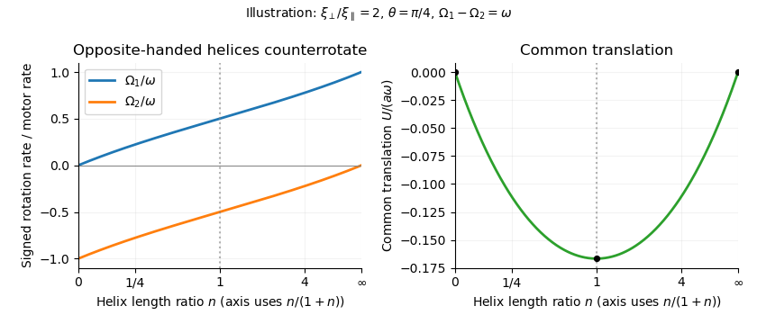

<h1 id="4/solution">Solution</h1>

↑ **Parent:** [4](../4.md)

Use the same [resistive-force theory](../../../../../resistive-force-theory.md) convention as before: the force density is the fluid's force on the filament. Let $\varphi$ be the usual cylindrical azimuth. Choose the orientation of a left-handed [helix](../../../../../helix.md) so that, as $z$ increases, $\varphi$ decreases. With $s=\sin\theta$, $c=\cos\theta$,

$$
\mathbf t=c\mathbf e_z-s\mathbf e_\varphi,\qquad
\mathbf u=U\mathbf e_z+a\Omega\mathbf e_\varphi,\qquad
\mathbf u\cdot\mathbf t=Uc-a\Omega s.
$$

Reversing the orientation of the tangent leaves the local drag tensor unchanged. Define $k=\xi_\perp-\xi_\parallel$. From [resistive-force theory](../../../../../resistive-force-theory.md), the relevant force-density components are

$$
f_z=-(\xi_\parallel c^2+\xi_\perp s^2)U-ka sc\,\Omega,
$$

$$
f_\varphi=-k sc\,U-a(\xi_\perp c^2+\xi_\parallel s^2)\Omega.
$$

These scalar axial and azimuthal components are uniform along the [helix](../../../../../helix.md). Integration over its contour length $\ell$, and use of the axial torque density $af_\varphi$, give the [axial resistance matrix of a slender helix](../../../../../axial-resistance-matrix-of-a-slender-helix.md):

$$
\boxed{A=\ell(\xi_\parallel\cos^2\theta+\xi_\perp\sin^2\theta),\qquad
B=C=\ell a(\xi_\perp-\xi_\parallel)\sin\theta\cos\theta,}
$$

$$
\boxed{D=\ell a^2(\xi_\perp\cos^2\theta+\xi_\parallel\sin^2\theta)}.
$$

Thus **$B=C$**, as also required by the [Lorentz reciprocal theorem](../../../../../lorentz-reciprocal-theorem-for-stokes-flow.md). The signs here belong to $(F,L)^T=-\begin{pmatrix}A&B\\B&D\end{pmatrix}(U,\Omega)^T$, with $F,L$ forces and moments on the helix. The [handedness reversal of helical hydrodynamic resistance](../../../../../handedness-reversal-of-helical-hydrodynamic-resistance.md) reverses $B,C$ but leaves $A,D$ unchanged. If the positive rotation direction or handedness convention is reversed, the coupling sign reverses with it.

As a check on physical admissibility, the [determinant of helical resistance in resistive-force theory](../../../../../determinant-of-helical-resistance-in-resistive-force-theory.md) is

$$
\boxed{AD-B^2=\ell^2a^2\xi_\parallel\xi_\perp>0}.
$$

Together with $A,D>0$, this makes the [hydrodynamic resistance matrix](../../../../../hydrodynamic-resistance-matrix.md) positive definite and the viscous power loss $AU^2+2BU\Omega+D\Omega^2$ positive. Isotropic local drag would have $B=0$, so rotating a helix would not propel it in this approximation.

For the pair, use a local additive [resistive-force theory](../../../../../resistive-force-theory.md) model: both helices have the same drag coefficients, and inter-helix [hydrodynamic interactions](../../../../../hydrodynamic-interaction.md) and unresolved end effects are omitted. The right-handed helix has resistance entries $(nA,-nB,-nB,nD)$. Define the signed motor motion by

$$
\boxed{\Omega_1-\Omega_2=\omega}.
$$

The printed relative rotation specifies a magnitude rather than which helix rotates relative to which. Choosing $\Omega_2-\Omega_1=\omega$ instead reverses all signed speeds below.

The common translation speed $U$ and zero total force and torque obey

$$
(1+n)AU+B\Omega_1-nB\Omega_2=0,
$$

$$
(1-n)BU+D\Omega_1+nD\Omega_2=0.
$$

Internal motor forces and torques cancel in these totals. Introduce

$$
\mathcal D=AD(1+n)^2-B^2(1-n)^2
=(AD-B^2)(1+n)^2+4nB^2>0.
$$

Solving the three linear equations yields the [opposite-handed counterrotating helical swimmer](../../../../../opposite-handed-counterrotating-helical-swimmer.md):

$$
\boxed{U=-\frac{2nBD}{\mathcal D}\,\omega,}
$$

$$
\boxed{\Omega_1=\frac{n[AD(1+n)+B^2(1-n)]}{\mathcal D}\,\omega,\qquad
\Omega_2=-\frac{AD(1+n)-B^2(1-n)}{\mathcal D}\,\omega}.
$$

For $n>0$, $\xi_\perp>\xi_\parallel$ and $\omega>0$, $B>0$, so $U<0$, $\Omega_1>0$ and $\Omega_2<0$. The opposite-handed helices counterrotate but contribute thrust in the same axial direction. The formula satisfies the specified relative rotation without identifying either laboratory rotation rate with the motor rate.

At **$n=0$**, the second helix supplies no hydrodynamic resistance. The remaining helix must have $F=L=0$, and invertibility of its [hydrodynamic resistance matrix](../../../../../hydrodynamic-resistance-matrix.md) forces **$U=\Omega_1=0$**. Formally $\Omega_2=-\omega$ is the rotation of a zero-resistance motor shaft or vanishing second rotor; there is no physical finite second helix to propel or to provide a reaction torque. This is the [vanishing reaction rotor in a helical swimmer](../../../../../vanishing-reaction-rotor-in-a-helical-swimmer.md).

At **$n=1$**, equal-length opposite-handed helices have

$$
\boxed{\Omega_1=\omega/2,\qquad\Omega_2=-\omega/2,\qquad U=-\frac B{2A}\omega}.
$$

The translation-generated axial torques cancel between the two helices, and equal counterrotation balances the rotational torques. Their propulsive forces add, rather than cancel, because handedness and rotation both reverse. These are [equal-length opposite-handed helices](../../../../../equal-length-opposite-handed-helices.md).

For **$n\to\infty$**, the [large reaction helix limit](../../../../../large-reaction-helix-limit.md) is

$$
\boxed{U\sim-\frac{2BD}{AD-B^2}\frac\omega n\to0,\qquad
\Omega_1\to\omega,\qquad
\Omega_2\sim-\frac{AD+B^2}{AD-B^2}\frac\omega n\to0}.
$$

The increasingly long second helix nearly anchors the whole assembly: its very small translation and rotation suffice to balance the finite force and torque generated by the first helix. The first helix rotates at almost the full motor rate, but moving the large resistive second helix makes the common translation tend to zero. These are idealized limits of the additive local model, rather than a resolution of short-helix end effects or infinitely extended interacting filaments.

**[Figure 3](#4/image-counterrotation-rates-and-common-translation-versus-the-right-to-left-helix-length-ratio-showing-no-propulsion-at-zero-or-infinite-ratio-and-symmetric-counterrotation-for-equal-lengths). Counterrotation rates and common translation versus the right-to-left helix length ratio, showing no propulsion at zero or infinite ratio and symmetric counterrotation for equal lengths**.

## ↑ Ancestors (10)

1. [4](../4.md)
2. [Paper 334](../../paper-334-split.md)
3. [Iii](../../split.md)
4. [2016](../../../split.md)
5. [Past exam of the mathematics course of the University of Cambridge](../../../../split.md)
6. [Mathematics course of the University of Cambridge](../../../../../mathematics-course-of-the-university-of-cambridge.md)
7. [Course of the University of Cambridge](../../../../../course-of-the-university-of-cambridge.md)
8. [University of Cambridge](../../../../../university-of-cambridge-split.md)
9. [List of universities](../../../../../list-of-universities.md)
10. [Codex Wiki](../../../../../split.md)
