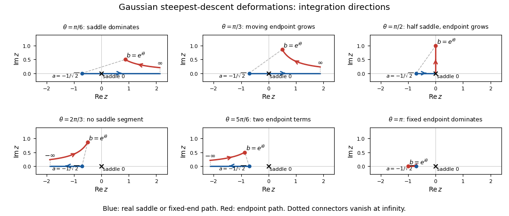

<h1 id="1/b/ii/solution">Solution</h1>

↑ **Parent:** [Ii](../ii.md)

Let $b=e^{i\theta}$ and use the [method of steepest descents](../../../../../../../method-of-steepest-descent.md) with phase $\Phi(z)=-z^2$. For $z=x+iy$, $\operatorname{Re}\Phi=y^2-x^2$ and $\operatorname{Im}\Phi=-2xy$. The simple [saddle point](../../../../../../../saddle-point.md) is $z=0$: the real axis is its descending path and the imaginary axis its ascending path. The [quadratic complex endpoint descent path](../../../../../../../quadratic-complex-endpoint-descent-path.md) from $b$ satisfies $\operatorname{Im}(z^2)=\sin2\theta$ and can be parametrized by

$$
z(s)^2=b^2+s,\qquad s\geq0,
$$

with the square-root branch chosen continuously from $b$. Increasing $s$ reduces the real part of the exponent by $\lambda s$.

For $0\leq\theta<\pi/2$, that endpoint path goes to positive real infinity. Deform the original contour into the real path from $-d$ through the [saddle point](../../../../../../../saddle-point.md) towards $+\infty$, followed backwards along the endpoint descent path to $b$. The integrand is an [entire function](../../../../../../../entire-function.md), so finite contour deformations are legitimate; connecting arcs in the far decaying sector vanish. If $T_b$ denotes the oriented integral from $b$ to that infinity, this gives

$$
f=\sqrt{\frac\pi\lambda}-T_d-T_b,\qquad T_d\sim\frac{e^{-\lambda/2}}{\sqrt2\lambda},\qquad T_b\sim\frac{e^{-\lambda b^2}}{2\lambda b}.
$$

The last expression follows by setting $z^2=b^2+s$: $dz/ds=1/(2z)$, so the endpoint integral is $e^{-\lambda b^2}\int_0^\infty e^{-\lambda s}/[2z(s)]ds$. This derives its phase and orientation directly.

For $\pi/2<\theta\leq\pi$, the descent path from $b$ goes to negative real infinity. Deform from $-d$ towards that infinity and then backwards along this endpoint path to $b$. There is no [saddle point](../../../../../../../saddle-point.md) segment, and

$$
f=-T_d-T_b,\qquad T_b\sim\frac{e^{-\lambda b^2}}{2\lambda b}
$$

uses the same formula with the negative square-root branch. At $\theta=\pi/2$ the contour can run from $-d$ to zero and then up the imaginary axis. It gives a half-Gaussian contribution and the dominant imaginary endpoint term $i e^\lambda/(2\lambda)$. The change in the subdominant [saddle point](../../../../../../../saddle-point.md) contribution is a [Stokes phenomenon](../../../../../../../stokes-phenomenon.md); it does not change the leading endpoint term on either side of that angle.

The [Gaussian saddle and endpoint dominance by angle](../../../../../../../gaussian-saddle-and-endpoint-dominance-by-angle.md) follows by comparing exponential sizes and gives **all fixed-angle leading behaviours**:

$$
\boxed{f(\theta,\lambda)\sim\begin{cases}
\sqrt{\pi/\lambda},&0\leq\theta\leq\pi/4,\\[2pt]
-\dfrac{e^{-\lambda e^{2i\theta}}}{2\lambda e^{i\theta}},&\pi/4<\theta<5\pi/6,\\[5pt]
-\dfrac{e^{-\lambda/2}}{\lambda}\left[\dfrac1{\sqrt2}+\dfrac{e^{i\sqrt3\lambda/2}}{2e^{5\pi i/6}}\right],&\theta=5\pi/6,\\[5pt]
-\dfrac{e^{-\lambda/2}}{\sqrt2\lambda},&5\pi/6<\theta\leq\pi.
\end{cases}}
$$

At $\theta=\pi/4$, the endpoint term has magnitude $O(\lambda^{-1})$, so the [saddle point](../../../../../../../saddle-point.md) term of order $\lambda^{-1/2}$ still dominates. In the middle interval the endpoint term grows exponentially for $\pi/4<\theta<3\pi/4$, is oscillatory of order $\lambda^{-1}$ at $3\pi/4$, and decays exponentially for $3\pi/4<\theta<5\pi/6$. On the latter interval it nevertheless decays more slowly than the fixed-endpoint term. Equality of their exponential rates means $\cos2\theta=1/2$ on the left half-plane, hence $\theta=5\pi/6$. At that angle both terms are required; their coefficient magnitudes are unequal, so their sum has no complete destructive cancellation.

These fixed-angle [asymptotic expansions](../../../../../../../asymptotic-expansion.md) are not uniform if $\theta$ is allowed to vary with $\lambda$ near a dominance transition. The endpoint/saddle balance near $\pi/4$ involves $\lambda(\theta-\pi/4)=O(\log\lambda)$; the two-endpoint competition near $5\pi/6$ has an angular scale $O(\lambda^{-1})$.

The following sketches show the contour orientations, the [saddle point](../../../../../../../saddle-point.md) and both endpoints. The hyperbolic endpoint paths are followed backwards when returning from infinity to $b$; the dotted far-end connectors indicate the vanishing connecting arc.

**[Figure 1](#1/b/ii/image-steepest-descent-contour-deformations-for-the-gaussian-integral-at-six-endpoint-angles-with-saddle-and-endpoint-paths-and-integration-directions). Steepest-descent contour deformations for the Gaussian integral at six endpoint angles, with saddle and endpoint paths and integration directions**.

## ↑ Ancestors (12)

1. [Ii](../ii.md)
2. [B](../../b.md)
3. [1](../../../1.md)
4. [Paper 336](../../../../paper-336-split.md)
5. [Iii](../../../../split.md)
6. [2016](../../../../../split.md)
7. [Past exam of the mathematics course of the University of Cambridge](../../../../../../split.md)
8. [Mathematics course of the University of Cambridge](../../../../../../../mathematics-course-of-the-university-of-cambridge.md)
9. [Course of the University of Cambridge](../../../../../../../course-of-the-university-of-cambridge.md)
10. [University of Cambridge](../../../../../../../university-of-cambridge-split.md)
11. [List of universities](../../../../../../../list-of-universities.md)
12. [Codex Wiki](../../../../../../../split.md)
