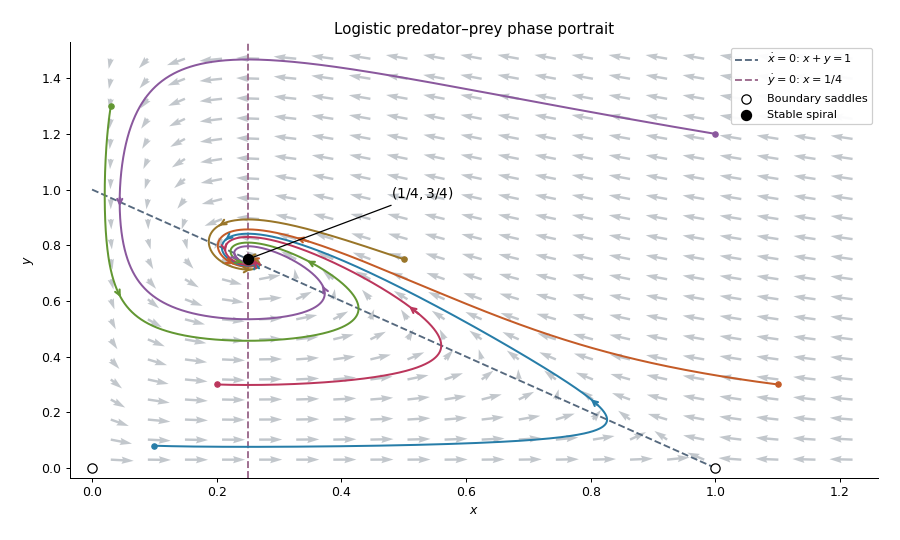

<h1 id="6c/a/solution">Solution</h1>

↑ **Parent:** [A](../a.md)

Use the complete system in the PDF: the TeX omits $\dot y=y(4x-1)/8$. Both coordinate axes are invariant, and the [equilibrium points](../../../../../../equilibrium-point-of-a-dynamical-system.md) are $(0,0)$, $(1,0)$ and $(1/4,3/4)$. The [Jacobian matrix](../../../../../../jacobian-matrix.md) is

$$
J(x,y)=\begin{pmatrix}1-2x-y&-x\\y/2&(4x-1)/8\end{pmatrix}.
$$

At $(0,0)$ its [eigenvalues](../../../../../../eigenvalue.md) are $1,-1/8$, and at $(1,0)$ they are $-1,3/8$: both points are [saddle equilibria](../../../../../../saddle-equilibrium.md). At the coexistence point,

$$
J_* =\begin{pmatrix}-1/4&-1/4\\3/8&0\end{pmatrix},\qquad
\boxed{\lambda_\pm=\frac{-1\pm i\sqrt5}{8}.}
$$

Thus the interior point is a [stable spiral](../../../../../../stable-spiral.md). The nontrivial [nullclines](../../../../../../nullcline.md) are $x+y=1$ and $x=1/4$: $x$ increases below the first and decreases above it, while $y$ increases to the right of the second and decreases to the left. The rotation near coexistence is counterclockwise.

**[Figure 1](#6c/a/image-trajectories-of-a-predator-prey-system). Trajectories of a predator-prey system**.

A local [linearization](../../../../../../linearization.md) by itself does not prove that every interior solution has the same limit. For this [logistic predator-prey model](../../../../../../logistic-predator-prey-model.md), let $x_*=1/4,y_*=3/4$ and use the [Lyapunov function](../../../../../../lyapunov-function.md)

$$
V=x-x_*-x_*\log(x/x_*)
+2\bigl[y-y_*-y_*\log(y/y_*)\bigr].
$$

The inequality $u-1-\log u\geq0$ makes $V$ nonnegative, with equality only at coexistence. Its sublevel sets are compact inside the positive quadrant, because $V$ diverges both at the axes and at infinity. Direct differentiation cancels the predator-prey cross terms and gives

$$
\dot V=-(x-x_*)^2\leq0.
$$

On $\{\dot V=0\}$ one has $x=x_*$, and remaining there requires $\dot x=-x_*(y-y_*)=0$. The largest invariant subset is therefore the coexistence point. The [LaSalle invariance principle](../../../../../../lasalle-s-invariance-principle.md) proves

$$
\boxed{(x(t),y(t))\longrightarrow(1/4,3/4)
\quad\text{for every }x(0)>0,\ y(0)>0.}
$$

On $x=0$, $y$ decays as $e^{-t/8}$ toward the origin. On $y=0$, the [logistic differential equation](../../../../../../logistic-differential-equation.md) takes every $x(0)>0$ to one. The origin itself stays fixed. These boundary trajectories are the exceptions to the interior convergence statement.

## ↑ Ancestors (11)

1. [A](../a.md)
2. [6C](../../6c.md)
3. [Paper 2](../../../paper-2-split.md)
4. [Ia](../../../split.md)
5. [2017](../../../../split.md)
6. [Past exam of the mathematics course of the University of Cambridge](../../../../../split.md)
7. [Mathematics course of the University of Cambridge](../../../../../../mathematics-course-of-the-university-of-cambridge.md)
8. [Course of the University of Cambridge](../../../../../../course-of-the-university-of-cambridge.md)
9. [University of Cambridge](../../../../../../university-of-cambridge-split.md)
10. [List of universities](../../../../../../list-of-universities.md)
11. [Codex Wiki](../../../../../../split.md)
