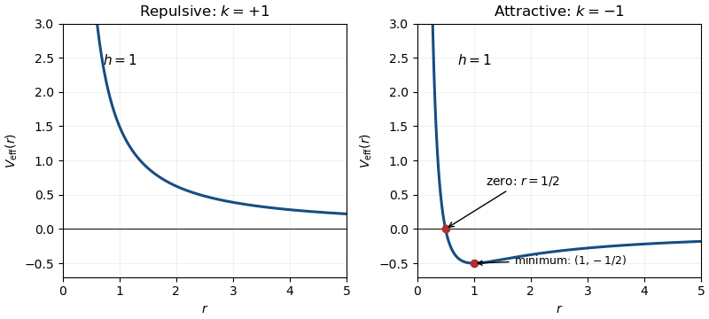
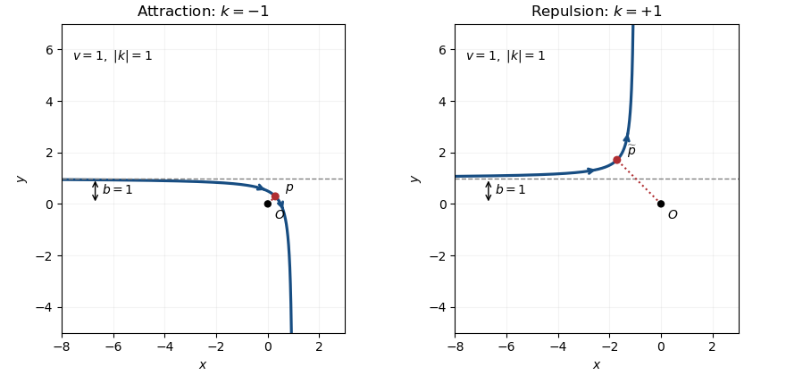
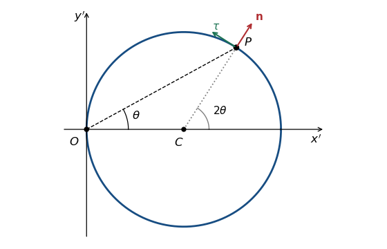

# Paper 4

↑ **Parent:** [Ia](../ia.md)

[https://www.maths.cam.ac.uk/undergrad/pastpapers/files/2017/paperia_4_1.pdf](https://www.maths.cam.ac.uk/undergrad/pastpapers/files/2017/paperia_4_1.pdf)

**Table of contents**

- [1D](#1d)
  - [a](#1d/a)
    - [Solution](#1d/a/solution)
  - [b](#1d/b)
    - [Solution](#1d/b/solution)
- [2D](#2d)
  - [a](#2d/a)
    - [Solution](#2d/a/solution)
  - [b](#2d/b)
    - [i](#2d/b/i)
      - [Solution](#2d/b/i/solution)
    - [ii](#2d/b/ii)
      - [Solution](#2d/b/ii/solution)
- [3A](#3a)
  - [Solution](#3a/solution)
- [4A](#4a)
  - [Solution](#4a/solution)
- [5D](#5d)
  - [a](#5d/a)
    - [Solution](#5d/a/solution)
  - [b](#5d/b)
    - [Solution](#5d/b/solution)
  - [c](#5d/c)
    - [Solution](#5d/c/solution)
- [6D](#6d)
  - [a](#6d/a)
    - [Solution](#6d/a/solution)
  - [b](#6d/b)
    - [Solution](#6d/b/solution)
  - [c](#6d/c)
    - [Solution](#6d/c/solution)
  - [d](#6d/d)
    - [Solution](#6d/d/solution)
- [7D](#7d)
  - [a](#7d/a)
    - [Solution](#7d/a/solution)
  - [b](#7d/b)
    - [Solution](#7d/b/solution)
- [8D](#8d)
  - [a](#8d/a)
    - [Solution](#8d/a/solution)
  - [b](#8d/b)
    - [Solution](#8d/b/solution)
- [9A](#9a)
  - [a](#9a/a)
    - [Solution](#9a/a/solution)
  - [b](#9a/b)
    - [Solution](#9a/b/solution)
- [10A](#10a)
  - [a](#10a/a)
    - [Solution](#10a/a/solution)
  - [b](#10a/b)
    - [i](#10a/b/i)
      - [Solution](#10a/b/i/solution)
    - [ii](#10a/b/ii)
      - [Solution](#10a/b/ii/solution)
    - [iii](#10a/b/iii)
      - [Solution](#10a/b/iii/solution)
- [11A](#11a)
  - [a](#11a/a)
    - [Solution](#11a/a/solution)
  - [b](#11a/b)
    - [i](#11a/b/i)
      - [Solution](#11a/b/i/solution)
    - [ii](#11a/b/ii)
      - [Solution](#11a/b/ii/solution)
    - [iii](#11a/b/iii)
      - [Solution](#11a/b/iii/solution)
- [12A](#12a)
  - [a](#12a/a)
    - [Solution](#12a/a/solution)
  - [b](#12a/b)
    - [Solution](#12a/b/solution)

## 1D

↑ **Parent:** [Paper 4](paper-4.md)

<h3 id="1d/a">a</h3>

↑ **Parent:** [1D](#1d)

<h4 id="1d/a/solution">Solution</h4>

↑ **Parent:** [A](#1d/a)

Reduce $z$ using [modular congruence](../../../number-theory.md#modular-congruence): its [residue class](../../../number-theory.md#residue-class) modulo $3$ is $0$, $1$, or $-1$. A [square number](../../../number-theory.md#square-number) therefore has [residue class](../../../number-theory.md#residue-class) $0$ or $1$, and raising either residue to the positive [integer](../../../number-theory.md#integer) power $n$ leaves it unchanged. Consequently

$$
\boxed{z^{2n}\equiv\begin{cases}0\pmod3,&3\mid z,\\1\pmod3,&3\nmid z.\end{cases}}
$$

The exponent in the original PDF is $2n$; the polynomial identities in the converted TeX are a transcription error. The argument uses $n\ge1$; it does not assign $0^0$ a value.

<h3 id="1d/b">b</h3>

↑ **Parent:** [1D](#1d)

<h4 id="1d/b/solution">Solution</h4>

↑ **Parent:** [B](#1d/b)

For a [Pythagorean triple](../../../geometry-and-topology.md#pythagorean-triple), each [square number](../../../number-theory.md#square-number) is $0$ or $1$ modulo $3$. If neither $x$ nor $y$ were divisible by $3$, [modular congruence](../../../number-theory.md#modular-congruence) would give $z^2\equiv1+1\equiv2\pmod3$, impossible for a [square number](../../../number-theory.md#square-number). Thus **at least one of $x,y$ is divisible by $3$**; both can be divisible, as in $(9,12,15)$.

An [odd number](../../../number-theory.md#odd-number) has [square number](../../../number-theory.md#square-number) congruent to $1$ modulo $4$, whereas an [even number](../../../number-theory.md#even-number) has [square number](../../../number-theory.md#square-number) congruent to $0$. If both $x$ and $y$ were [odd numbers](../../../number-theory.md#odd-number), their sum of [square numbers](../../../number-theory.md#square-number) would again be $2$ modulo $4$, which no [square number](../../../number-theory.md#square-number) can be. Hence **$x$ and $y$ cannot both be odd**. They can both be even; the conclusion does not require the [Pythagorean triple](../../../geometry-and-topology.md#pythagorean-triple) to be primitive.

## 2D

↑ **Parent:** [Paper 4](paper-4.md)

<h3 id="2d/a">a</h3>

↑ **Parent:** [2D](#2d)

<h4 id="2d/a/solution">Solution</h4>

↑ **Parent:** [A](#2d/a)

A [binary relation](../../../set-theory.md#binary-relation) on a [set](../../../set.md) $S$ is a [subset](../../../set.md#subset) $R\subseteq S\times S$ of its [Cartesian product](../../../set-theory.md#cartesian-product); $xRy$ means $(x,y)\in R$. It is an [equivalence relation](../../../set-theory.md#equivalence-relation) when it is a [reflexive relation](../../../set-theory.md#reflexive-relation), a [symmetric relation](../../../set-theory.md#symmetric-relation), and a [transitive relation](../../../set-theory.md#transitive-relation):

$$
\boxed{\begin{aligned}&xRx&&\text{for every }x\in S,\\&xRy\Longrightarrow yRx&&\text{for every }x,y\in S,\\&xRy\ \text{and}\ yRz\Longrightarrow xRz&&\text{for every }x,y,z\in S.\end{aligned}}
$$

An [equivalence relation](../../../set-theory.md#equivalence-relation) partitions $S$ into [equivalence classes](../../../set-theory.md#equivalence-class): two elements belong to the same class exactly when they are related.

<h3 id="2d/b">b</h3>

↑ **Parent:** [2D](#2d)

<h4 id="2d/b/i">i</h4>

↑ **Parent:** [B](#2d/b)

<h5 id="2d/b/i/solution">Solution</h5>

↑ **Parent:** [I](#2d/b/i)

The first condition concerns the domains: their [symmetric difference](../../../set.md#symmetric-difference) $A\mathbin\triangle B$ must be a [finite set](../../../set.md#finite-set). The original PDF prints this condition and the agreement condition together; the converted TeX omits both. The two existing solution scopes are used here to prove the domain and value parts of the single [equivalence relation](../../../set-theory.md#equivalence-relation) assertion.

Domain agreement is a [reflexive relation](../../../set-theory.md#reflexive-relation) because $A\mathbin\triangle A=\varnothing$, and a [symmetric relation](../../../set-theory.md#symmetric-relation) because $A\mathbin\triangle B=B\mathbin\triangle A$. For the [transitive relation](../../../set-theory.md#transitive-relation) property, membership can differ between $A$ and $C$ only if it differs between $A$ and $B$ or between $B$ and $C$. Thus

$$
\boxed{A\mathbin\triangle C\subseteq(A\mathbin\triangle B)\cup(B\mathbin\triangle C).}
$$

A [set union](../../../set.md#set-union) of two [finite sets](../../../set.md#finite-set) is finite, so the domain condition passes through a chain of related pairs. This is the domain part of [equivalence of partial functions modulo finite changes](../../../set-theory.md#equivalence-of-partial-functions-modulo-finite-changes).

<h4 id="2d/b/ii">ii</h4>

↑ **Parent:** [B](#2d/b)

<h5 id="2d/b/ii/solution">Solution</h5>

↑ **Parent:** [Ii](#2d/b/ii)

For the value condition, a [function](../../../function.md) agrees with itself outside the empty exceptional [set](../../../set.md), proving the [reflexive relation](../../../set-theory.md#reflexive-relation) property. Interchanging the two [functions](../../../function.md) preserves equality, so the same exceptional [finite set](../../../set.md#finite-set) proves the [symmetric relation](../../../set-theory.md#symmetric-relation) property.

Suppose $(A,f)$ is related to $(B,g)$ and $(B,g)$ to $(C,h)$, with exceptional [finite sets](../../../set.md#finite-set) $F_{AB}$ and $F_{BC}$. Points of $A\cap C$ might be absent from $B$, so merely taking $F_{AB}\cup F_{BC}$ would miss a real issue. Use instead

$$
F_{AC}=(A\cap C)\cap\bigl(F_{AB}\cup F_{BC}\cup(A\setminus B)\bigr).
$$

This is a [finite set](../../../set.md#finite-set) contained in $A\cap C$: the first two terms are finite by hypothesis and $A\setminus B\subseteq A\mathbin\triangle B$ is finite by the domain condition. If $x\in(A\cap C)\setminus F_{AC}$, then $x\in B$ and neither original exception occurs, so $f(x)=g(x)=h(x)$. The domain condition is also preserved, as proved in the preceding scope. Thus the full relation is a [transitive relation](../../../set-theory.md#transitive-relation), and

$$
\boxed{\mathcal R\text{ is an equivalence relation on }\Sigma.}
$$

Finite domains cause no problem: one may take the whole [intersection](../../../set.md#set-intersection) as the exceptional [set](../../../set.md). Both conditions are needed for [equivalence of partial functions modulo finite changes](../../../set-theory.md#equivalence-of-partial-functions-modulo-finite-changes).

## 3A

↑ **Parent:** [Paper 4](paper-4.md)

<h3 id="3a/solution">Solution</h3>

↑ **Parent:** [3A](#3a)

Assume the particle [masses](../../../classical-mechanics.md#mass) $m_i$ are fixed and their total [mass](../../../classical-mechanics.md#mass) $M=\sum_i m_i$ is positive. The [centre of mass](../../../classical-mechanics.md#center-of-mass) and the relative [position](../../../classical-mechanics.md#position) vectors are

$$
\boxed{\mathbf R=\frac1M\sum_i m_i\mathbf x_i,\qquad\mathbf y_i=\mathbf x_i-\mathbf R.}
$$

Their weighted sum is zero, so [differentiation](../../../calculus.md#differentiation) gives $\sum_i m_i\dot{\mathbf y}_i=0$. Expanding the [kinetic energy](../../../classical-mechanics.md#kinetic-energy) with $\dot{\mathbf x}_i=\dot{\mathbf R}+\dot{\mathbf y}_i$ makes the mixed term vanish:

$$
T=\frac12\sum_i m_i\bigl(|\dot{\mathbf R}|^2+2\dot{\mathbf R}\cdot\dot{\mathbf y}_i+|\dot{\mathbf y}_i|^2\bigr)
=\boxed{\frac12M|\dot{\mathbf R}|^2+\frac12\sum_i m_i|\dot{\mathbf y}_i|^2}.
$$

This [kinetic-energy decomposition about the centre of mass](../../../classical-mechanics.md#kinetic-energy-decomposition-about-the-centre-of-mass) separates translation from internal motion without assuming any particular [force](../../../classical-mechanics.md#force) law.

For the [rigid body](../../../classical-mechanics.md#rigid-body-dynamics), its relative [velocity](../../../classical-mechanics.md#velocity) is $\dot{\mathbf y}_i=\omega\mathbf n\times\mathbf y_i$. The [cross product](../../../vector-space.md#cross-product) identity for a [unit vector](../../../vector-space.md#unit-vector) gives $|\mathbf n\times\mathbf y_i|^2=|\mathbf y_i|^2-(\mathbf n\cdot\mathbf y_i)^2$, the squared perpendicular distance to the rotation axis. Hence the [moment of inertia](../../../classical-mechanics.md#moment-of-inertia) of the particle is $I_i=m_i[|\mathbf y_i|^2-(\mathbf n\cdot\mathbf y_i)^2]$, and summing the [rotational kinetic energy](../../../classical-mechanics.md#rotational-kinetic-energy) yields

$$
\boxed{T=\frac12M|\dot{\mathbf R}|^2+\frac12I\omega^2,\qquad I=\sum_i I_i.}
$$

## 4A

↑ **Parent:** [Paper 4](paper-4.md)

<h3 id="4a/solution">Solution</h3>

↑ **Parent:** [4A](#4a)

The dimensions are $[m]=\mathsf M$, $[\alpha]=\mathsf M\mathsf T^{-1}$, $[u_0]=\mathsf L\mathsf T^{-1}$, and $[g]=\mathsf L\mathsf T^{-2}$. Under the stated model, $m,\alpha,u_0,g$ are the only parameters determining the ascent [time](../../../classical-mechanics.md#time-in-physics). If $m^p\alpha^q u_0^r g^s$ is dimensionless, then $p+q=0$, $r+s=0$, and $-q-r-2s=0$, leaving one independent [dimensionless variable](../../../mathematics.md#dimensionless-variable). One convenient choice is

$$
\boxed{\lambda=\frac{\alpha u_0}{mg},\qquad T=\frac m\alpha f(\lambda).}
$$

Thus [dimensional analysis](../../../physics.md#dimensional-analysis) fixes the form, but [Newton's second law](../../../classical-mechanics.md#newton-s-second-law) must determine the [function](../../../function.md) $f$.

Take upward [velocity](../../../classical-mechanics.md#velocity) as positive. Throughout ascent, [Newton's second law](../../../classical-mechanics.md#newton-s-second-law) with [linear drag](../../../fluid-mechanics.md#linear-drag) gives $m\dot v=-mg-\alpha v$. An [integrating factor](../../../differential-equation.md#integrating-factor) or direct solution of this [linear ordinary differential equation](../../../differential-equation.md#linear-ordinary-differential-equation) gives

$$
v(t)=\left(u_0+\frac{mg}{\alpha}\right)e^{-\alpha t/m}-\frac{mg}{\alpha}.
$$

The first zero of this [velocity](../../../classical-mechanics.md#velocity) is the highest point, so

$$
\boxed{f(\lambda)=\log(1+\lambda),\qquad T=\frac m\alpha\log\left(1+\frac{\alpha u_0}{mg}\right).}
$$

This [vertical ascent under linear drag](../../../fluid-mechanics.md#vertical-ascent-under-linear-drag) has $T<u_0/g$ for $u_0>0$, since $\log(1+\lambda)<\lambda$. The limit $\alpha\to0$ recovers the no-drag ascent [time](../../../classical-mechanics.md#time-in-physics) $u_0/g$; $u_0=0$ gives $T=0$.

## 5D

↑ **Parent:** [Paper 4](paper-4.md)

<h3 id="5d/a">a</h3>

↑ **Parent:** [5D](#5d)

<h4 id="5d/a/solution">Solution</h4>

↑ **Parent:** [A](#5d/a)

The [Fermat-Euler theorem](../../../number-theory.md#euler-s-theorem) states that for an [integer](../../../number-theory.md#integer) $a$ and a positive [integer](../../../number-theory.md#integer) $n$ with $\gcd(a,n)=1$,

$$
\boxed{a^{\varphi(n)}\equiv1\pmod n,}
$$

where the [Euler totient function](../../../number-theory.md#euler-totient-function) $\varphi(n)$ counts the [residue classes](../../../number-theory.md#residue-class) coprime to $n$. For $n\ge2$, choose a [reduced residue system](../../../number-theory.md#reduced-residue-system) $r_1,\ldots,r_{\varphi(n)}$. Multiplication by the [unit modulo n](../../../number-theory.md#unit-modulo-n) $a$ preserves coprimality and is injective on these [residue classes](../../../number-theory.md#residue-class): $ar_i\equiv ar_j\pmod n$ implies $r_i\equiv r_j\pmod n$, because $a$ has a [multiplicative inverse](../../../arithmetic.md#multiplicative-inverse) modulo $n$. It therefore permutes the [reduced residue system](../../../number-theory.md#reduced-residue-system), giving

$$
a^{\varphi(n)}\prod_i r_i\equiv\prod_i r_i\pmod n.
$$

The product is also a [unit modulo n](../../../number-theory.md#unit-modulo-n), so it can be cancelled. This proves the [Fermat-Euler theorem](../../../number-theory.md#euler-s-theorem). For $n=1$ every [modular congruence](../../../number-theory.md#modular-congruence) is automatic; one may use $\varphi(1)=1$.

For a [prime number](../../../number-theory.md#prime-number) $p$, the [Euler totient function](../../../number-theory.md#euler-totient-function) has value $\varphi(p)=p-1$. Thus $a^{p-1}\equiv1\pmod p$ whenever $p\nmid a$. Multiplying by $a$, and treating $p\mid a$ separately, gives the all-integer version of [Fermat's little theorem](../../../number-theory.md#fermat-little-theorem):

$$
\boxed{a^p\equiv a\pmod p\quad\text{for every integer }a.}
$$

Finally, [Wilson theorem](../../../number-theory.md#wilson-s-theorem) states that for every [prime number](../../../number-theory.md#prime-number) $p$, $\boxed{(p-1)!\equiv-1\pmod p}$. Its converse is also true: an [integer](../../../number-theory.md#integer) $n>1$ is prime exactly when $(n-1)!\equiv-1\pmod n$. For the converse, any proper divisor $1<d<n$ would divide both $(n-1)!$ and $n$, contradicting that congruence.

<h3 id="5d/b">b</h3>

↑ **Parent:** [5D](#5d)

<h4 id="5d/b/solution">Solution</h4>

↑ **Parent:** [B](#5d/b)

Suppose $X^2\equiv-1\pmod p$. Then $X$ is a [unit modulo n](../../../number-theory.md#unit-modulo-n) for modulus $p$, and [Fermat's little theorem](../../../number-theory.md#fermat-little-theorem) implies

$$
1\equiv X^{p-1}=(X^2)^{(p-1)/2}\equiv(-1)^{(p-1)/2}\pmod p.
$$

Since $p$ is an odd [prime number](../../../number-theory.md#prime-number), $1$ and $-1$ are distinct [residue classes](../../../number-theory.md#residue-class). Therefore $(p-1)/2$ is even, and $p\equiv1\pmod4$.

Conversely, put $q=(p-1)/2$. Pair each [integer](../../../number-theory.md#integer) $j\in\{1,\ldots,q\}$ with $p-j$ in the [factorial](../../../combinatorics.md#factorial). [Wilson theorem](../../../number-theory.md#wilson-s-theorem) yields

$$
-1\equiv(p-1)!=\prod_{j=1}^q j(p-j)\equiv(-1)^q(q!)^2\pmod p.
$$

When $p\equiv1\pmod4$, $q$ is even, so $X=q!$ satisfies $X^2\equiv-1\pmod p$. This proves the [first supplementary law for quadratic reciprocity](../../../number-theory.md#first-supplementary-law-for-quadratic-reciprocity) without assuming a primitive root. Hence

$$
\boxed{X^2\equiv-1\pmod p\text{ is solvable exactly when }p\equiv1\pmod4.}
$$

The two solutions are $q!$ and $-q!$ modulo $p$: their difference is nonzero, and factoring $X^2-Y^2$ shows that a degree-two [polynomial](../../../polynomial.md) over the [field](../../../algebra.md#field) of residues modulo $p$ has no further roots.

<h3 id="5d/c">c</h3>

↑ **Parent:** [5D](#5d)

<h4 id="5d/c/solution">Solution</h4>

↑ **Parent:** [C](#5d/c)

Split the [factorial](../../../combinatorics.md#factorial) at $h$, using $k=p-1-h$:

$$
(p-1)!=h!\prod_{j=h+1}^{p-1}j\equiv h!\prod_{t=1}^{k}(-t)=(-1)^k h!k!\pmod p.
$$

By [Wilson theorem](../../../number-theory.md#wilson-s-theorem), this is $-1$. Therefore $h!k!\equiv(-1)^{k+1}\pmod p$. If the [prime number](../../../number-theory.md#prime-number) $p$ is odd, then $h+k=p-1$ is even, so $(-1)^k=(-1)^h$ and

$$
\boxed{h!k!+(-1)^h\equiv0\pmod p.}
$$

For $p=2$, the signs $1$ and $-1$ are identical modulo $2$, and the two possibilities $(h,k)=(0,1),(1,0)$ also give the same result. The [empty product](../../../arithmetic.md#empty-product) convention $0!=1$ includes the endpoint cases. This is the [complementary factorial congruence](../../../number-theory.md#complementary-factorial-congruence).

## 6D

↑ **Parent:** [Paper 4](paper-4.md)

<h3 id="6d/a">a</h3>

↑ **Parent:** [6D](#6d)

<h4 id="6d/a/solution">Solution</h4>

↑ **Parent:** [A](#6d/a)

A [set](../../../set.md) $A$ is a [countable set](../../../set-theory.md#countable-set) if there exists an [injective function](../../../algebra.md#injective-function) $A\to\mathbb N$, with $\mathbb N=\{0,1,2,\ldots\}$. Equivalently, it is a [finite set](../../../set.md#finite-set) or has a [bijection](../../../function.md#bijection) with $\mathbb N$. An infinite [countable set](../../../set-theory.md#countable-set) is called a [countably infinite set](../../../set-theory.md#countably-infinite-set).

The empty [set](../../../set.md) is included: the empty [function](../../../function.md) into $\mathbb N$ is injective. This convention distinguishes “countable” from “countably infinite” and will also cover the finite threshold [sets](../../../set.md) in the last part.

<h3 id="6d/b">b</h3>

↑ **Parent:** [6D](#6d)

<h4 id="6d/b/solution">Solution</h4>

↑ **Parent:** [B](#6d/b)

Use the [well-order](../../../set.md#well-order) of the [natural numbers](../../../arithmetic.md#natural-number) to list $A$ in increasing order. Define recursively

$$
f(0)=\min A,\qquad f(n+1)=\min\bigl(A\setminus\{f(0),\ldots,f(n)\}\bigr).
$$

The remaining [set](../../../set.md) is nonempty because $A$ is infinite and only a [finite set](../../../set.md#finite-set) has been removed. Each chosen value is larger than the preceding one, so $f$ is an [injective function](../../../algebra.md#injective-function).

To prove it is a [surjective function](../../../algebra.md#surjective-function), fix $a\in A$. If $a$ were never selected, every selected minimum would be at most $a$. This would put infinitely many distinct values into the [finite set](../../../set.md#finite-set) $\{0,\ldots,a\}$, a contradiction. Hence

$$
\boxed{f:\mathbb N\longrightarrow A\text{ is a bijection}.}
$$

The [increasing enumeration of an infinite subset of natural numbers](../../../set-theory.md#increasing-enumeration-of-an-infinite-subset-of-natural-numbers) uses no arbitrary choice: each next element is the uniquely determined minimum.

<h3 id="6d/c">c</h3>

↑ **Parent:** [6D](#6d)

<h4 id="6d/c/solution">Solution</h4>

↑ **Parent:** [C](#6d/c)

For each positive [integer](../../../number-theory.md#integer) $n$, the positive elements of $A_n$ form an infinite [set](../../../set.md), and the preceding increasing enumeration gives a [bijection](../../../function.md#bijection) $f_n:\mathbb N\to A_n$ on these positive elements. The positive [integers](../../../number-theory.md#integer) have a unique decomposition $10^{n-1}q$ with $10\nmid q$, so these [sets](../../../set.md) are disjoint and exhaust the positive [integers](../../../number-theory.md#integer).

The printed [natural numbers](../../../arithmetic.md#natural-number) include $0$. The trailing-zero count of the representation of $0$ is not needed: shift the positive partition down by one and put

$$
\boxed{g(i,j)=f_{i+1}(j)-1,\qquad i,j\in\mathbb N.}
$$

Uniqueness of the trailing-zero count proves the [injective function](../../../algebra.md#injective-function) property, and the decomposition of $N+1$ proves the [surjective function](../../../algebra.md#surjective-function) property. An explicit [decimal trailing-zero pairing function](../../../foundations-of-mathematics.md#decimal-trailing-zero-pairing-function), using the increasing enumeration from the previous part, is

$$
\boxed{g(i,j)=10^i\left(j+1+\left\lfloor\frac j9\right\rfloor\right)-1.}
$$

Indeed, the bracket enumerates $1,2,\ldots,9,11,12,\ldots$, exactly the positive [integers](../../../number-theory.md#integer) not divisible by $10$. This handles both the positive index $n$ and the element $0$ without silently changing the PDF's convention.

To enumerate the [rational numbers](../../../number-theory.md#rational-number), first enumerate the [integers](../../../number-theory.md#integer) by $e(0)=0$, $e(2r-1)=r$, $e(2r)=-r$ for $r\ge1$. The [function](../../../function.md) $(i,j)\mapsto e(i)/(j+1)$ maps $\mathbb N^2$ onto $\mathbb Q$, and composing with $g^{-1}$ gives a [surjective function](../../../algebra.md#surjective-function) from $\mathbb N$. Choosing the first index representing each [rational number](../../../number-theory.md#rational-number) gives an [injective function](../../../algebra.md#injective-function) $\mathbb Q\to\mathbb N$. Thus **$\mathbb Q$ is countably infinite**; its infinitude follows because it contains all [integers](../../../number-theory.md#integer).

<h3 id="6d/d">d</h3>

↑ **Parent:** [6D](#6d)

<h4 id="6d/d/solution">Solution</h4>

↑ **Parent:** [D](#6d/d)

For each positive [integer](../../../number-theory.md#integer) $n$, consider the threshold [set](../../../set.md) $A^{(n)}=\{a\in A:a\ge1/n\}$. If it were infinite, one could choose recursively a [sequence](../../../real-analysis.md#sequence) of distinct elements from it. Every arithmetic average of that [sequence](../../../real-analysis.md#sequence) would be at least $1/n$, contradicting the assumed limit zero. Hence every $A^{(n)}$ is a [finite set](../../../set.md#finite-set).

Every positive [real number](../../../arithmetic.md#real-number) $a$ exceeds $1/n$ for some $n$, by the [Archimedean property](../../../arithmetic.md#archimedean-property). Therefore

$$
A=\bigcup_{n=1}^{\infty}A^{(n)}.
$$

A [countable union of countable sets](../../../set-theory.md#countable-union-of-countable-sets) is countable, so $\boxed{A\text{ is countable}}$. In fact, under the stipulated infinitude, $A$ is a [countably infinite set](../../../set-theory.md#countably-infinite-set). Positivity matters: it ensures that these thresholds cover $A$. This is [countability from vanishing averages of distinct sequences](../../../set-theory.md#countability-from-vanishing-averages-of-distinct-sequences); ordinary [Cesaro convergence of a sequence](../../../measure-theory.md#cesaro-convergence-of-a-sequence) of one chosen enumeration would not suffice to control the whole [set](../../../set.md).

## 7D

↑ **Parent:** [Paper 4](paper-4.md)

<h3 id="7d/a">a</h3>

↑ **Parent:** [7D](#7d)

<h4 id="7d/a/solution">Solution</h4>

↑ **Parent:** [A](#7d/a)

For $n\ge2$, use the [binomial coefficient](../../../combinatorics.md#binomial-coefficient) identity $(n/k)\binom{n-1}{k-1}=\binom nk$. It reduces the left side to $\binom{n-1}{k-1}(k/n)^{m-1}$. Put $t=(k-1)/(n-1)$. Then $k/n=((n-1)t+1)/n$, and the [binomial theorem](../../../combinatorics.md#binomial-theorem) gives

$$
\left(\frac kn\right)^{m-1}=\sum_{\ell=0}^{m-1}\binom{m-1}{\ell}\frac{(n-1)^{m-1-\ell}}{n^{m-1}}t^{m-1-\ell}.
$$

Thus the required coefficients are

$$
\boxed{a_{n,m,\ell}=\binom{m-1}{\ell}\frac{(n-1)^{m-1-\ell}}{n^{m-1}},\qquad0\le\ell\le m-1.}
$$

For $m=1$ the sum has the single coefficient $a_{n,1,0}=1$. For $k=1$, the power $t^0$ denotes the constant [monomial](../../../polynomial.md#monomial) $1$.

The original PDF allows $n=1$, but its displayed ratio $(k-1)/(n-1)$ is then $0/0$. Literally that expression is undefined. The meaningful endpoint identity is obtained before normalization:

$$
\binom nk\left(\frac kn\right)^m=\binom{n-1}{k-1}\frac1{n^{m-1}}\sum_{\ell=0}^{m-1}\binom{m-1}{\ell}(k-1)^{m-1-\ell}.
$$

This [polynomial](../../../polynomial.md) identity is valid at $n=k=1$, giving $1$ on both sides. The normalized formula and the [Bernstein monomial recurrence](../../../functional-analysis.md#bernstein-monomial-recurrence) below are used only for $n\ge2$.

<h3 id="7d/b">b</h3>

↑ **Parent:** [7D](#7d)

<h4 id="7d/b/solution">Solution</h4>

↑ **Parent:** [B](#7d/b)

For the constant [monomial](../../../polynomial.md#monomial) $f_0=1$, the [binomial theorem](../../../combinatorics.md#binomial-theorem) gives $B_n(f_0)(x)=(x+1-x)^n=1$. For $f_1$, the [binomial coefficient](../../../combinatorics.md#binomial-coefficient) identity $k\binom nk=n\binom{n-1}{k-1}$ gives

$$
B_n(f_1)(x)=x\sum_{j=0}^{n-1}\binom{n-1}{j}x^j(1-x)^{n-1-j}=x.
$$

Thus $\boxed{B_n(f_0)=1,\quad B_n(f_1)=x}$, including $x=0,1$ by evaluation of the [polynomials](../../../polynomial.md).

For $m\ge1$ and $n\ge2$, substitute the preceding coefficient identity into the [Bernstein polynomial](../../../functional-analysis.md#bernstein-polynomial) sum and write $j=k-1$. This yields the [Bernstein monomial recurrence](../../../functional-analysis.md#bernstein-monomial-recurrence)

$$
B_n(f_m)(x)=x\sum_{\ell=0}^{m-1}a_{n,m,\ell}\,B_{n-1}(f_{m-1-\ell})(x).
$$

The coefficients are nonnegative and sum to $1$; $a_{n,m,0}=((n-1)/n)^{m-1}\to1$ and the others tend to zero. The weights in any [Bernstein polynomial](../../../functional-analysis.md#bernstein-polynomial) sum are nonnegative and sum to $1$, so $0\le B_n(f_j)(x)\le1$. Induction on $m$ therefore gives $B_n(f_m)(x)\to x\,x^{m-1}=x^m$: the $\ell=0$ term has that limit and the other finitely many terms vanish. In fact, the same estimate in the [supremum norm](../../../functional-analysis.md#supremum-norm) proves [uniform convergence](../../../real-analysis.md#uniform-convergence) on $[0,1]$.

As an independent quantitative bound, take a [binomial distribution](../../../discrete-probability-distribution.md#binomial-distribution) variable $K$ with parameters $(n,x)$. Then $B_n(f_m)(x)=\mathbb E[(K/n)^m]$. On $[0,1]$, factoring the difference of powers gives $|t^m-x^m|\le m|t-x|$; the [Cauchy-Schwarz inequality](../../../probability-and-statistics.md#cauchy-schwarz-inequality) and the [variance](../../../variance.md) of $K/n$ give

$$
\boxed{|B_n(f_m)(x)-x^m|\le m\sqrt{\frac{x(1-x)}n}\le\frac m{2\sqrt n}.}
$$

For $m=0$ the error is exactly zero. Finally the requested sum equals $2^m B_{2n}(f_m)(1/2)$, so

$$
\boxed{\lim_{n\to\infty}\frac1{4^n}\sum_{k=0}^{2n}\left(\frac kn\right)^m\binom{2n}{k}=2^m(1/2)^m=1.}
$$

## 8D

↑ **Parent:** [Paper 4](paper-4.md)

<h3 id="8d/a">a</h3>

↑ **Parent:** [8D](#8d)

<h4 id="8d/a/solution">Solution</h4>

↑ **Parent:** [A](#8d/a)

A [sequence](../../../real-analysis.md#sequence) $(a_k)$ converges to $a\in\mathbb R$ when for every $\varepsilon>0$ there is $N$ such that $|a_k-a|<\varepsilon$ for all $k\ge N$. A [series](../../../real-analysis.md#series-mathematics) $\sum_{k=1}^{\infty}a_k$ converges to a finite $S$ when its [partial sums](../../../real-analysis.md#partial-sum) $s_n=\sum_{k=1}^n a_k$ converge to $S$.

If the [series](../../../real-analysis.md#series-mathematics) converges, then $a_n=s_n-s_{n-1}\to S-S=0$, so **its terms tend to zero**. The converse is false: the [harmonic series](../../../real-analysis.md#harmonic-series) has terms tending to zero but diverges.

For the arithmetic averages, suppose $a_k\to a$. Fix $\varepsilon>0$ and choose $K$ so $|a_k-a|<\varepsilon/2$ for $k\ge K$. The finite initial contribution $C=\sum_{k=1}^{K-1}|a_k-a|$ is fixed, and

$$
\left|\frac1n\sum_{k=1}^na_k-a\right|\le\frac Cn+\frac1n\sum_{k=K}^n|a_k-a|\le\frac Cn+\frac\varepsilon2.
$$

For sufficiently large $n$, $C/n<\varepsilon/2$, proving

$$
\boxed{\frac1n\sum_{k=1}^na_k\longrightarrow a.}
$$

This is the [Cesaro theorem for convergent sequences](../../../real-analysis.md#cesaro-theorem-for-convergent-sequences). Its hypothesis concerns a [convergent sequence](../../../real-analysis.md#convergent-sequence); the corresponding [series](../../../real-analysis.md#series-mathematics) need not be a [convergent series](../../../real-analysis.md#convergent-series).

<h3 id="8d/b">b</h3>

↑ **Parent:** [8D](#8d)

<h4 id="8d/b/solution">Solution</h4>

↑ **Parent:** [B](#8d/b)

The [arithmetic-geometric mean inequality](../../../mathematical-optimization.md#arithmetic-geometric-mean-inequality) gives $a_k+1/a_k\ge2$, so $u_n\ge2n\to+\infty$. Hence **$(u_n)$ has no finite limit**.

For the example, take $\boxed{a_k=1+2^{-k}}$. Every term is positive and different from $1$, and

$$
0<a_k-\frac1{a_k}=\frac{2^{-k}(2+2^{-k})}{1+2^{-k}}<2^{1-k}.
$$

The bounding [geometric series](../../../real-analysis.md#geometric-series) converges, so the [comparison test for series](../../../real-analysis.md#comparison-test-for-series) proves that the [partial sums](../../../real-analysis.md#partial-sum) $v_n$ converge.

In general, if $v_n$ converges, the necessary condition for a [convergent series](../../../real-analysis.md#convergent-series) gives $d_k=a_k-1/a_k=v_k-v_{k-1}\to0$. Since $a_k>0$,

$$
a_k+\frac1{a_k}=\sqrt{\left(a_k-\frac1{a_k}\right)^2+4}=\sqrt{d_k^2+4}\longrightarrow2.
$$

Apply the [Cesaro theorem for convergent sequences](../../../real-analysis.md#cesaro-theorem-for-convergent-sequences) to these summands:

$$
\boxed{\frac{u_n}{n}\longrightarrow2.}
$$

Equivalently, $a_k=(d_k+\sqrt{d_k^2+4})/2\to1$. The [series](../../../real-analysis.md#series-mathematics) of the differences may converge while the [series](../../../real-analysis.md#series-mathematics) of the positive sums still diverges linearly.

## 9A

↑ **Parent:** [Paper 4](paper-4.md)

<h3 id="9a/a">a</h3>

↑ **Parent:** [9A](#9a)

<h4 id="9a/a/solution">Solution</h4>

↑ **Parent:** [A](#9a/a)

Use [momentum conservation](../../../classical-mechanics.md#momentum-conservation) and [conservation of energy](../../../physics.md#conservation-of-energy) in the laboratory [inertial frame](../../../physics.md#inertial-frame). The [photon](../../../quantum-mechanics.md#photon) has [momentum](../../../classical-mechanics.md#momentum) magnitude $E/c$, while the outgoing [Electron](../../../physics.md#electron) satisfies the [relativistic energy-momentum relation](../../../special-relativity.md#energy-momentum-relation). Its total [energy](../../../classical-mechanics.md#energy) and [momentum](../../../classical-mechanics.md#momentum) obey

$$
E_e=mc^2+E_1-E_2,\qquad c^2|\mathbf p_e|^2=E_1^2+E_2^2-2E_1E_2\cos\theta.
$$

Substitute these into $E_e^2=m^2c^4+c^2|\mathbf p_e|^2$. Cancelling $m^2c^4$ and $(E_1-E_2)^2$ gives $mc^2(E_1-E_2)=E_1E_2(1-\cos\theta)$. Both photon [energies](../../../classical-mechanics.md#energy) are positive, so division yields

$$
\boxed{\frac1{E_2}-\frac1{E_1}=\frac{1-\cos\theta}{mc^2},\qquad E_2=\frac{E_1}{1+(E_1/mc^2)(1-\cos\theta)}.}
$$

This is [Compton scattering](../../../physics.md#compton-scattering). The energies include the [Electron](../../../physics.md#electron)'s [rest energy](../../../special-relativity.md#rest-energy); using only its [kinetic energy](../../../classical-mechanics.md#kinetic-energy) in the mass-shell equation would give the wrong result. The outgoing [photon](../../../quantum-mechanics.md#photon) has unchanged [energy](../../../classical-mechanics.md#energy) at $\theta=0$ and smaller [energy](../../../classical-mechanics.md#energy) for a nonzero scattering angle.

<h3 id="9a/b">b</h3>

↑ **Parent:** [9A](#9a)

<h4 id="9a/b/solution">Solution</h4>

↑ **Parent:** [B](#9a/b)

Let $\mathbf p_1$ and $\mathbf p_2$ be the incoming and proton [momenta](../../../classical-mechanics.md#momentum). The other incoming atom is at rest, so its total [energy](../../../classical-mechanics.md#energy) is $m_1c^2$. By [four-momentum conservation](../../../special-relativity.md#four-momentum-conservation), the tritium atom has

$$
E_3=E_1+m_1c^2-E_2,\qquad\mathbf p_3=\mathbf p_1-\mathbf p_2.
$$

The specified perpendicular emission gives $\mathbf p_1\cdot\mathbf p_2=0$. Therefore the [relativistic energy-momentum relation](../../../special-relativity.md#energy-momentum-relation) implies

$$
\begin{aligned}
m_3^2c^4&=(E_1+m_1c^2-E_2)^2-c^2(|\mathbf p_1|^2+|\mathbf p_2|^2)\\
&=(E_1+m_1c^2-E_2)^2-(E_1^2-m_1^2c^4)-(E_2^2-m_2^2c^4)\\
&=m_2^2c^4+2(m_1c^2+E_1)(m_1c^2-E_2).
\end{aligned}
$$

Dividing by $c^4$ gives

$$
\boxed{m_3^2=m_2^2+2\left(m_1+\frac{E_1}{c^2}\right)\left(m_1-\frac{E_2}{c^2}\right).}
$$

Here $E_1,E_2$ are total [energies](../../../classical-mechanics.md#energy), not just [kinetic energies](../../../classical-mechanics.md#kinetic-energy). This identity is conditional on the collision admitting the stated emission: the calculated energies must satisfy the positive-energy mass-shell conditions, in particular $E_2\ge m_2c^2$ and $E_3\ge m_3c^2$. No nonrelativistic approximation has been used.

## 10A

↑ **Parent:** [Paper 4](paper-4.md)

<h3 id="10a/a">a</h3>

↑ **Parent:** [10A](#10a)

<h4 id="10a/a/solution">Solution</h4>

↑ **Parent:** [A](#10a/a)

A [central force](../../../physics.md#central-force) has no component in the angular direction. The angular component of the [acceleration in polar coordinates](../../../classical-mechanics.md#acceleration-in-polar-coordinates) therefore gives $2\dot r\dot\theta+r\ddot\theta=0$, or

$$
\frac d{dt}(r^2\dot\theta)=0.
$$

For unit [mass](../../../classical-mechanics.md#mass), $h=r^2\dot\theta$ is the signed [angular momentum](../../../classical-mechanics.md#angular-momentum) perpendicular to the orbital plane, so its magnitude $|h|$ is conserved. Equivalently, the [torque](../../../classical-mechanics.md#torque) $\mathbf r\times\mathbf F$ vanishes, which also fixes that plane.

The given [potential energy](../../../classical-mechanics.md#potential-energy) is $k/r$, whose radial [force](../../../classical-mechanics.md#force) is $k/r^2$: positive $k$ is repulsive and negative $k$ attractive. The [kinetic energy](../../../classical-mechanics.md#kinetic-energy) in [polar coordinates](../../../calculus.md#polar-coordinates) is $(\dot r^2+r^2\dot\theta^2)/2$, so [conservation of energy](../../../physics.md#conservation-of-energy) gives

$$
\boxed{E=\frac12\dot r^2+V_{\rm eff}(r),\qquad V_{\rm eff}(r)=\frac{h^2}{2r^2}+\frac kr.}
$$

For $h\ne0$ and $k>0$, the [effective potential](../../../physics.md#effective-potential) is positive, strictly decreasing from $+\infty$ to $0$, and has no stationary point. For $k=-\kappa<0$, it still tends to $+\infty$ at zero, crosses zero at $r=h^2/(2\kappa)$, and has its unique minimum at

$$
\boxed{r_c=\frac{h^2}{\kappa},\qquad V_{\rm eff}(r_c)=-\frac{\kappa^2}{2h^2}.}
$$

It then approaches zero from below. The minimum corresponds to a stable [circular orbit](../../../classical-mechanics.md#circular-orbit). If $h=0$, the centrifugal barrier disappears; the attractive [effective potential](../../../physics.md#effective-potential) is simply $-\kappa/r$ and has no minimum.

**[Figure 1](#10a/a/image-effective-potentials-and-turning-points-of-central-force-orbits). Effective potentials and turning points of central-force orbits**. Effective potentials with unit angular momentum and k equal to plus or minus one. The attractive minimum and zero are marked.

<h3 id="10a/b">b</h3>

↑ **Parent:** [10A](#10a)

<h4 id="10a/b/i">i</h4>

↑ **Parent:** [B](#10a/b)

<h5 id="10a/b/i/solution">Solution</h5>

↑ **Parent:** [I](#10a/b/i)

Interpret projection from very far away as the asymptotic incoming state at $r\to\infty$. For $v>0$ and [impact parameter](../../../classical-mechanics.md#impact-parameter) $b>0$, [conservation of energy](../../../physics.md#conservation-of-energy) and [conservation of angular momentum](../../../classical-mechanics.md#conservation-of-angular-momentum) give $E=v^2/2$ and $|h|=bv$. At the closest approach the radial [velocity](../../../classical-mechanics.md#velocity) vanishes. With $k=-\kappa<0$, the [central-force radial turning point](../../../classical-mechanics.md#central-force-radial-turning-point) equation is

$$
\frac12v^2=\frac{b^2v^2}{2p^2}-\frac\kappa p,\qquad v^2p^2+2\kappa p-b^2v^2=0.
$$

Only the positive root is physical. Put $q=\kappa/v^2$. The [pericentre distance](../../../classical-mechanics.md#pericentre-distance) and the purely tangential [speed](../../../classical-mechanics.md#speed) there are

$$
\boxed{p=\sqrt{b^2+q^2}-q,\qquad u=\frac{bv}{p}=\frac v b\left(\sqrt{b^2+q^2}+q\right).}
$$

Thus $p<b$ and $u>v$: attraction bends the path inward and increases the [speed](../../../classical-mechanics.md#speed). With positive [energy](../../../classical-mechanics.md#energy), the [Kepler orbit](../../../classical-mechanics.md#kepler-orbit) is a [hyperbola](../../../geometry-and-topology.md#hyperbola). Measured from the pericentre direction, its [polar coordinates](../../../calculus.md#polar-coordinates) satisfy $r=h^2/[\kappa(1+e\cos\phi)]$ with $e=\sqrt{1+b^2v^4/\kappa^2}>1$.

**[Figure 2](#10a/b/i/image-central-force-scattering-trajectories). Central-force scattering trajectories**. Attractive and repulsive inverse-square scattering with the same incoming speed, impact parameter, and force magnitude. The incoming asymptote and closest approach are marked.

The [hyperbola](../../../geometry-and-topology.md#hyperbola) shown has a nonzero [impact parameter](../../../classical-mechanics.md#impact-parameter). For $b=0$, the attractive radial orbit instead reaches the singular origin; there is no regular turning point with a finite closest-approach [speed](../../../classical-mechanics.md#speed).

<h4 id="10a/b/ii">ii</h4>

↑ **Parent:** [B](#10a/b)

<h5 id="10a/b/ii/solution">Solution</h5>

↑ **Parent:** [Ii](#10a/b/ii)

For $k=\kappa>0$, the same asymptotic data give $E=v^2/2$ and $|h|=bv$. At the [central-force radial turning point](../../../classical-mechanics.md#central-force-radial-turning-point),

$$
\frac12v^2=\frac{b^2v^2}{2\widetilde p^2}+\frac\kappa{\widetilde p},\qquad v^2\widetilde p^2-2\kappa\widetilde p-b^2v^2=0.
$$

The positive root and the tangential [speed](../../../classical-mechanics.md#speed), again with $q=\kappa/v^2$, are

$$
\boxed{\widetilde p=\sqrt{b^2+q^2}+q,\qquad\widetilde u=\frac{bv}{\widetilde p}=\frac v b\left(\sqrt{b^2+q^2}-q\right).}
$$

For $b>0$, $\widetilde p>b$ and $\widetilde u<v$. The [repulsive inverse-square force](../../../classical-mechanics.md#repulsive-inverse-square-force) bends the trajectory away from the origin, as in the right-hand sketch. Its [polar equation of a repulsive inverse-square orbit](../../../classical-mechanics.md#polar-equation-of-a-repulsive-inverse-square-orbit) is $r=h^2/[\kappa(e\cos\phi-1)]$, with $e=\sqrt{1+b^2v^4/\kappa^2}>1$ and $\phi$ measured from closest approach.

For $b=0$, the regular radial turning point is $\widetilde p=2\kappa/v^2$ and its [speed](../../../classical-mechanics.md#speed) is zero; the particle reverses direction there. The formula $bv/\widetilde p$ still gives zero, while its rationalized form containing $1/b$ should be interpreted only by a limit.

<h4 id="10a/b/iii">iii</h4>

↑ **Parent:** [B](#10a/b)

<h5 id="10a/b/iii/solution">Solution</h5>

↑ **Parent:** [Iii](#10a/b/iii)

For equal $|k|=\kappa$ in the two cases, their closest distances are conjugate roots expressed with the same $q=\kappa/v^2$. Consequently

$$
\boxed{p\widetilde p=(\sqrt{b^2+q^2}-q)(\sqrt{b^2+q^2}+q)=b^2.}
$$

At either [central-force radial turning point](../../../classical-mechanics.md#central-force-radial-turning-point), the [velocity](../../../classical-mechanics.md#velocity) is tangential and [conservation of angular momentum](../../../classical-mechanics.md#conservation-of-angular-momentum) gives $pu=\widetilde p\widetilde u=bv$. Thus

$$
\boxed{u\widetilde u=\frac{b^2v^2}{p\widetilde p}=v^2.}
$$

These [attractive and repulsive inverse-square closest approaches](../../../classical-mechanics.md#attractive-and-repulsive-inverse-square-closest-approaches) pair a shorter, faster attractive passage with a longer, slower repulsive one. The speed-product conclusion assumes $b>0$; at $b=0$, the attractive orbit hits the singular centre with unbounded [speed](../../../classical-mechanics.md#speed), so the formal product with the repulsive zero [speed](../../../classical-mechanics.md#speed) is not defined.

## 11A

↑ **Parent:** [Paper 4](paper-4.md)

<h3 id="11a/a">a</h3>

↑ **Parent:** [11A](#11a)

<h4 id="11a/a/solution">Solution</h4>

↑ **Parent:** [A](#11a/a)

The [rotating-frame derivative formula](../../../physics.md#rotating-frame-derivative-formula) is $(d\mathbf A/dt)_S=(d\mathbf A/dt)_{S'}+\boldsymbol\omega\times\mathbf A$. Applying it twice to the [position](../../../classical-mechanics.md#position) vector, with constant [angular velocity](../../../classical-mechanics.md#angular-velocity), gives

$$
\mathbf a_S=\mathbf a_{S'}+2\boldsymbol\omega\times\mathbf v_{S'}+\boldsymbol\omega\times(\boldsymbol\omega\times\mathbf r).
$$

Solving for $\mathbf a_{S'}$ identifies the displayed terms: its left side is the [acceleration](../../../classical-mechanics.md#acceleration) relative to the [rotating reference frame](../../../physics.md#rotating-reference-frame), the first right-hand term is the inertial [acceleration](../../../classical-mechanics.md#acceleration), $-2\boldsymbol\omega\times\mathbf v_{S'}$ is the [Coriolis acceleration](../../../physics.md#coriolis-acceleration), and $-\boldsymbol\omega\times(\boldsymbol\omega\times\mathbf r)$ is the outward [centrifugal acceleration](../../../physics.md#centrifugal-acceleration).

For a particle of [mass](../../../classical-mechanics.md#mass) $m$, replace $\mathbf a_S$ by the actual [force](../../../classical-mechanics.md#force) divided by $m$ using [Newton's second law](../../../classical-mechanics.md#newton-s-second-law). The remaining terms then appear as apparent [forces](../../../classical-mechanics.md#force) in $S'$. There is no [Euler acceleration](../../../physics.md#euler-acceleration) because $\boldsymbol\omega$ is constant and no translational acceleration term because the common origin is fixed in the [inertial frame](../../../physics.md#inertial-frame).

<h3 id="11a/b">b</h3>

↑ **Parent:** [11A](#11a)

<h4 id="11a/b/i">i</h4>

↑ **Parent:** [B](#11a/b)

<h5 id="11a/b/i/solution">Solution</h5>

↑ **Parent:** [I](#11a/b/i)

The original PDF measures $\theta$ at the rim point $O$, from the positive $x'$-axis to $OP$; it is not the angle at the centre of the circle. The converted TeX omits this entire subpart. In rotating [Cartesian coordinate system](../../../linear-algebra.md#cartesian-coordinate-system), the centre is $(a,0)$, and the nonzero intersection of the ray $\mathbf r=\rho(\cos\theta,\sin\theta)$ with $(x'-a)^2+y'^2=a^2$ has $\rho=2a\cos\theta$. Therefore

$$
\boxed{\mathbf r=2a\cos\theta(\cos\theta,\sin\theta,0)=a(1+\cos2\theta,\sin2\theta,0).}
$$

The second form stays regular even at the rim point $O$, where the polar radius is zero. Define the outward [unit normal](../../../differential-geometry.md#unit-normal) from the centre and the increasing-angle [unit tangent vector](../../../differential-geometry.md#unit-tangent-vector) by

$$
\mathbf n=(\cos2\theta,\sin2\theta,0),\qquad\boldsymbol\tau=(-\sin2\theta,\cos2\theta,0).
$$

The first two [derivatives](../../../calculus.md#derivative) in the [rotating reference frame](../../../physics.md#rotating-reference-frame) are $\mathbf v'=2a\dot\theta\boldsymbol\tau$ and $\mathbf a'=2a\ddot\theta\boldsymbol\tau-4a\dot\theta^2\mathbf n$. These describe a [bead on a horizontal hoop rotating about its rim](../../../physics.md#bead-on-a-horizontal-hoop-rotating-about-its-rim).

**[Figure 3](#11a/b/i/image-the-geometry-of-a-sliding-hoop-and-its-contact-point). The geometry of a sliding hoop and its contact point**. Original constructed geometry of the horizontal hoop: theta is at the rim pivot, and the central angle is twice theta.

<h4 id="11a/b/ii">ii</h4>

↑ **Parent:** [B](#11a/b)

<h5 id="11a/b/ii/solution">Solution</h5>

↑ **Parent:** [Ii](#11a/b/ii)

Because the contact is frictionless, the horizontal [normal force](../../../classical-mechanics.md#normal-force) is $\mathbf F_h=N\mathbf n$, with $N$ a signed outward component. Any vertical contact component balances [Newtonian gravity](../../../classical-mechanics.md#gravitational-acceleration) and does not enter the horizontal equations. With $\boldsymbol\omega=\omega\widehat{\mathbf z}$, the [rotating reference frame](../../../physics.md#rotating-reference-frame) equation gives

$$
\mathbf a'=N\mathbf n-2\omega\widehat{\mathbf z}\times(2a\dot\theta\boldsymbol\tau)+\omega^2\mathbf r.
$$

Since $\widehat{\mathbf z}\times\boldsymbol\tau=-\mathbf n$, $\mathbf r\cdot\mathbf n=2a\cos^2\theta$, and $\mathbf r\cdot\boldsymbol\tau=-a\sin2\theta$, its normal and tangential components are

$$
-4a\dot\theta^2=N+4a\omega\dot\theta+2a\omega^2\cos^2\theta,\qquad2a\ddot\theta=-a\omega^2\sin2\theta.
$$

Hence the requested horizontal [force](../../../classical-mechanics.md#force) vector is

$$
\boxed{\mathbf F_h=-2a\bigl(2\dot\theta^2+2\omega\dot\theta+\omega^2\cos^2\theta\bigr)(\cos2\theta,\sin2\theta,0).}
$$

Its magnitude is the absolute value of the scalar coefficient. That coefficient need not always be negative: the constraint can exert either sign of [normal force](../../../classical-mechanics.md#normal-force), depending on the bead's relative [velocity](../../../classical-mechanics.md#velocity). The tangential equation, which does not contain the reaction, is $\boxed{\ddot\theta=-(\omega^2/2)\sin2\theta}$.

<h4 id="11a/b/iii">iii</h4>

↑ **Parent:** [B](#11a/b)

<h5 id="11a/b/iii/solution">Solution</h5>

↑ **Parent:** [Iii](#11a/b/iii)

For nonzero $\omega$, the [equilibrium points](../../../dynamical-systems.md#equilibrium-point-of-a-dynamical-system) satisfy $\sin2\theta=0$. The [equilibrium point](../../../dynamical-systems.md#equilibrium-point-of-a-dynamical-system) $\theta=0$ is stable: it puts the bead at the point farthest from the rotation axis. Writing $\theta=\eta$ small in the tangential [ordinary differential equation](../../../differential-equation.md#ordinary-differential-equation) gives

$$
\ddot\eta=-\omega^2\eta+O(\eta^3),\qquad\boxed{\Omega_{\rm osc}=|\omega|,\quad f_{\rm osc}=\frac{|\omega|}{2\pi}.}
$$

Thus the [small oscillation](../../../classical-mechanics.md#small-oscillation) is [simple harmonic motion](../../../classical-mechanics.md#simple-harmonic-motion), with [angular frequency](../../../classical-mechanics.md#angular-frequency) $|\omega|$ and ordinary [frequency](../../../physics.md#frequency) $|\omega|/(2\pi)$.

The endpoints $\theta=\pm\pi/2$ represent the same rim point $O$. A perturbation there instead satisfies $\ddot\eta=+\omega^2\eta$ and is unstable. Equivalently, the [centrifugal potential](../../../physics.md#centrifugal-potential) along the hoop is $-\tfrac12\omega^2|\mathbf r|^2=-2a^2\omega^2\cos^2\theta$, whose minimum is at zero and maximum at $O$. If $\omega=0$, every bead position with zero relative [velocity](../../../classical-mechanics.md#velocity) is an [equilibrium point](../../../dynamical-systems.md#equilibrium-point-of-a-dynamical-system), but perturbing that [velocity](../../../classical-mechanics.md#velocity) produces unrestored drift; there is no nonzero restoring [frequency](../../../physics.md#frequency).

## 12A

↑ **Parent:** [Paper 4](paper-4.md)

<h3 id="12a/a">a</h3>

↑ **Parent:** [12A](#12a)

<h4 id="12a/a/solution">Solution</h4>

↑ **Parent:** [A](#12a/a)

Write the total remaining rocket [mass](../../../classical-mechanics.md#mass) as $\mathcal M=M+m(t)$, with $\dot m=-\alpha$. Over an interval $dt$, an exhaust [mass](../../../classical-mechanics.md#mass) $dm_e=\alpha\,dt$ is expelled backwards with inertial [velocity](../../../classical-mechanics.md#velocity) $v-u$ to first order. Applying [momentum conservation](../../../classical-mechanics.md#momentum-conservation) to the rocket and this exhaust gives

$$
\mathcal M v=(\mathcal M-dm_e)(v+dv)+dm_e(v-u)+o(dt).
$$

Cancellation and division by $dt$ give the [rocket equation](../../../classical-mechanics.md#rocket-equation)

$$
\boxed{(M+m)\frac{dv}{dt}=\alpha u.}
$$

With $M>0$, $m(t)=m_0-\alpha t$, and $0\le t\le m_0/\alpha$, integration gives

$$
v(t)-v_0=u\log\frac{M+m_0}{M+m(t)}.
$$

At burnout,

$$
\boxed{v_{\rm final}=v_0+u\log\left(1+\frac{m_0}{M}\right).}
$$

The logarithm depends on the [mass](../../../classical-mechanics.md#mass) ratio, not on the burn rate. This follows from [momentum conservation](../../../classical-mechanics.md#momentum-conservation) of the complete rocket–exhaust system; applying a constant-mass equation directly to the rocket alone would omit the momentum carried away.

<h3 id="12a/b">b</h3>

↑ **Parent:** [12A](#12a)

<h4 id="12a/b/solution">Solution</h4>

↑ **Parent:** [B](#12a/b)

For $0\le k<1$, the first burn reduces the total [mass](../../../classical-mechanics.md#mass) from $M+m_0$ to $M+(1-k)m_0$. The [rocket equation](../../../classical-mechanics.md#rocket-equation) therefore gives

$$
v_1=u\log\frac{M+m_0}{M+(1-k)m_0}.
$$

Detachment exerts negligible impulse, so the surviving second stage keeps [velocity](../../../classical-mechanics.md#velocity) $v_1$. Its initial and final [masses](../../../classical-mechanics.md#mass) are $(1-k)(M+m_0)$ and $(1-k)M$, respectively. A second application of the [rocket equation](../../../classical-mechanics.md#rocket-equation) gives

$$
\boxed{v_2=u\log\frac{M+m_0}{M+(1-k)m_0}+u\log\left(1+\frac{m_0}{M}\right).}
$$

For the single-stage comparison from rest, $v_{\rm single}=u\log(1+m_0/M)$. Hence

$$
\boxed{v_2-v_{\rm single}=u\log\frac{M+m_0}{M+(1-k)m_0}\ge0.}
$$

Equality holds at $k=0$; for positive fuel and exhaust speed it is strict when $0<k<1$. This [two-stage rocket with proportional fuel and body masses](../../../classical-mechanics.md#two-stage-rocket-with-proportional-fuel-and-body-masses) gains speed by discarding inert body [mass](../../../classical-mechanics.md#mass) before the last burn.

As $k\to1^-$ the expression tends to $2u\log(1+m_0/M)$, but the surviving second-stage [mass](../../../classical-mechanics.md#mass) also tends to zero. At exactly $k=1$ there is no second stage, so its final [speed](../../../classical-mechanics.md#speed) is undefined and that limiting formula cannot be assigned to it. The first stage alone reaches the single-stage burnout [speed](../../../classical-mechanics.md#speed) before detachment. If $m_0=0$, neither design gains speed.

## ↑ Ancestors (8)

1. [Ia](../ia.md)
2. [2017](../../2017.md)
3. [Past exam of the mathematics course of the University of Cambridge](../../../past-exam-of-the-mathematics-course-of-the-university-of-cambridge.md)
4. [Mathematics course of the University of Cambridge](../../../university-of-cambridge.md#mathematics-course-of-the-university-of-cambridge)
5. [Course of the University of Cambridge](../../../university-of-cambridge.md#course-of-the-university-of-cambridge)
6. [University of Cambridge](../../../university-of-cambridge.md)
7. [List of universities](../../../README.md#list-of-universities)
8. [Codex Wiki](../../../README.md)
