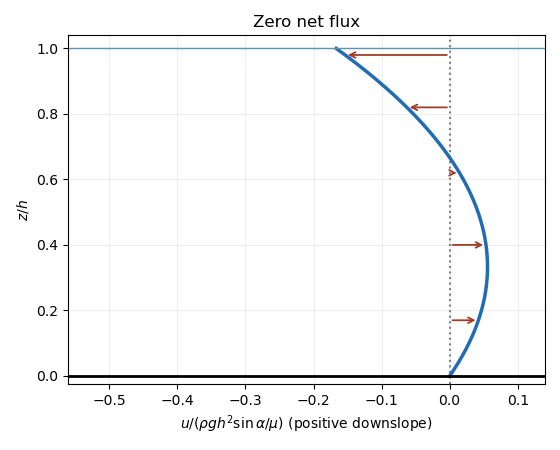

# Paper 1

↑ **Parent:** [Ib](../ib.md)

[https://www.maths.cam.ac.uk/undergrad/pastpapers/files/2017/paperib_1_0.pdf](https://www.maths.cam.ac.uk/undergrad/pastpapers/files/2017/paperib_1_0.pdf)

**Table of contents**

- [1F](#1f)
  - [i](#1f/i)
    - [Solution](#1f/i/solution)
  - [ii](#1f/ii)
    - [Solution](#1f/ii/solution)
  - [iii](#1f/iii)
    - [Solution](#1f/iii/solution)
- [2A](#2a)
  - [Solution](#2a/solution)
- [3G](#3g)
  - [Solution](#3g/solution)
- [4D](#4d)
  - [Solution](#4d/solution)
- [5D](#5d)
  - [i](#5d/i)
    - [Solution](#5d/i/solution)
  - [ii](#5d/ii)
    - [Solution](#5d/ii/solution)
- [6C](#6c)
  - [Solution](#6c/solution)
- [7H](#7h)
  - [a](#7h/a)
    - [Solution](#7h/a/solution)
  - [b](#7h/b)
    - [Solution](#7h/b/solution)
- [8H](#8h)
  - [Solution](#8h/solution)
- [9F](#9f)
  - [i](#9f/i)
    - [Solution](#9f/i/solution)
  - [ii](#9f/ii)
    - [Solution](#9f/ii/solution)
  - [iii](#9f/iii)
    - [Solution](#9f/iii/solution)
  - [iv](#9f/iv)
    - [Solution](#9f/iv/solution)
  - [v](#9f/v)
    - [Solution](#9f/v/solution)
- [10E](#10e)
  - [a](#10e/a)
    - [Solution](#10e/a/solution)
  - [b](#10e/b)
    - [Solution](#10e/b/solution)
  - [c](#10e/c)
    - [Solution](#10e/c/solution)
- [11G](#11g)
  - [i](#11g/i)
    - [Solution](#11g/i/solution)
  - [ii](#11g/ii)
    - [Solution](#11g/ii/solution)
  - [iii](#11g/iii)
    - [Solution](#11g/iii/solution)
- [12E](#12e)
  - [a](#12e/a)
    - [Solution](#12e/a/solution)
  - [b](#12e/b)
    - [Solution](#12e/b/solution)
- [13A](#13a)
  - [a](#13a/a)
    - [Solution](#13a/a/solution)
  - [b](#13a/b)
    - [i](#13a/b/i)
      - [Solution](#13a/b/i/solution)
    - [ii](#13a/b/ii)
      - [Solution](#13a/b/ii/solution)
    - [iii](#13a/b/iii)
      - [Solution](#13a/b/iii/solution)
- [14B](#14b)
  - [a](#14b/a)
    - [i](#14b/a/i)
      - [Solution](#14b/a/i/solution)
    - [ii](#14b/a/ii)
      - [Solution](#14b/a/ii/solution)
  - [b](#14b/b)
    - [Solution](#14b/b/solution)
- [15B](#15b)
  - [a](#15b/a)
    - [Solution](#15b/a/solution)
  - [b](#15b/b)
    - [Solution](#15b/b/solution)
- [16C](#16c)
  - [Solution](#16c/solution)
- [17D](#17d)
  - [a](#17d/a)
    - [Solution](#17d/a/solution)
  - [b](#17d/b)
    - [Solution](#17d/b/solution)
  - [c](#17d/c)
    - [Solution](#17d/c/solution)
  - [d](#17d/d)
    - [Solution](#17d/d/solution)
- [18C](#18c)
  - [Solution](#18c/solution)
- [19H](#19h)
  - [a](#19h/a)
    - [Solution](#19h/a/solution)
  - [b](#19h/b)
    - [Solution](#19h/b/solution)
- [20H](#20h)
  - [Solution](#20h/solution)

## 1F

↑ **Parent:** [Paper 1](paper-1.md)

<h3 id="1f/i">i</h3>

↑ **Parent:** [1F](#1f)

<h4 id="1f/i/solution">Solution</h4>

↑ **Parent:** [I](#1f/i)

The [Steinitz exchange lemma](../../../vector-space.md#steinitz-exchange-lemma) says that if $w_1,\ldots,w_m$ span a [vector space](../../../vector-space.md) and $v_1,\ldots,v_r$ are [linearly independent](../../../vector-space.md#linear-independence), then $r\le m$, and after reordering the $w_j$, the family $v_1,\ldots,v_r,w_{r+1},\ldots,w_m$ still spans. Here is a proof. Suppose the first $k-1$ replacements have been made. Express $v_k$ in that spanning family. Some coefficient of a remaining $w_j$ must be nonzero, since otherwise $v_k$ belongs to the [span](../../../vector-space.md#linear-span) of $v_1,\ldots,v_{k-1}$, contrary to [linear independence](../../../vector-space.md#linear-independence). Solve for that $w_j$ and replace it by $v_k$; this preserves spanning. If $r>m$, the first $m$ replacements leave a spanning family $v_1,\ldots,v_m$, contradicting [linear independence](../../../vector-space.md#linear-independence) of the first $m+1$ vectors. This proves both assertions.

Now suppose $S$ is [linearly independent](../../../vector-space.md#linear-independence) and spans $\mathbb R^n$. Express each member of the [standard basis](../../../vector-space.md#standard-basis) using finitely many members of $S$, and let $S_0$ be the finite union of those members. Then $S_0$ spans. No element of $S\setminus S_0$ can exist, since it would be a [linear combination](../../../vector-space.md#linear-combination) of $S_0$ and violate [linear independence](../../../vector-space.md#linear-independence). Thus $S$ is finite. Applying the [Steinitz exchange lemma](../../../vector-space.md#steinitz-exchange-lemma) in both directions to $S$ and the [standard basis](../../../vector-space.md#standard-basis) gives $|S|\le n$ and $n\le |S|$. Hence $\boxed{|S|=n}$.

<h3 id="1f/ii">ii</h3>

↑ **Parent:** [1F](#1f)

<h4 id="1f/ii/solution">Solution</h4>

↑ **Parent:** [Ii](#1f/ii)

If $S$ is [linearly independent](../../../vector-space.md#linear-independence) and has $n$ elements, apply the [Steinitz exchange lemma](../../../vector-space.md#steinitz-exchange-lemma) with $S$ as the independent family and the [standard basis](../../../vector-space.md#standard-basis) as the spanning family. All $n$ members of the [standard basis](../../../vector-space.md#standard-basis) are replaced, leaving $S$ itself spanning. Thus $\boxed{\operatorname{span}S=\mathbb R^n}$, so $S$ is a [basis](../../../vector-space.md#basis).

<h3 id="1f/iii">iii</h3>

↑ **Parent:** [1F](#1f)

<h4 id="1f/iii/solution">Solution</h4>

↑ **Parent:** [Iii](#1f/iii)

If $S$ spans and has $n$ elements but is [linearly dependent](../../../vector-space.md#linear-dependence), a nontrivial [linear combination](../../../vector-space.md#linear-combination) equal to zero lets us remove one member without changing the [span](../../../vector-space.md#linear-span). This produces $n-1$ spanning vectors, whereas the [standard basis](../../../vector-space.md#standard-basis) contains $n$ [linearly independent](../../../vector-space.md#linear-independence) vectors, contradicting the [Steinitz exchange lemma](../../../vector-space.md#steinitz-exchange-lemma). Therefore $\boxed{S\text{ is linearly independent}}$. Together the three deductions establish that any two of the three properties imply the third. For $n=0$, the only independent or zero-element family is the empty [basis](../../../vector-space.md#basis), and the same conclusions hold.

Relative to the given [basis](../../../vector-space.md#basis) $e_1,e_2$, the proposed vectors are the columns of

$$
M=\begin{pmatrix}\lambda&1\\1&\lambda\end{pmatrix},\qquad \det M=\lambda^2-1.
$$

The [determinant](../../../linear-algebra.md#determinant) is nonzero exactly when the columns form a [basis](../../../vector-space.md#basis). Thus $\boxed{\lambda\ne\pm1}$. At $\lambda=1$ the vectors coincide, and at $\lambda=-1$ they are negatives of one another.

## 2A

↑ **Parent:** [Paper 1](paper-1.md)

<h3 id="2a/solution">Solution</h3>

↑ **Parent:** [2A](#2a)

For [complex differentiability at a point](../../../complex-analysis.md#complex-differentiability-at-a-point), the derivative must have the same value along real and imaginary increments. Along real increments it equals $u_x+iv_x$, while along imaginary increments it equals $(u_y+iv_y)/i=v_y-iu_y$. Equating real and imaginary parts gives the [Cauchy-Riemann equations](../../../analysis.md#cauchy-riemann-equations)

$$
\boxed{u_x=v_y,\qquad u_y=-v_x}.
$$

For the given real part,

$$
u_x=\frac{y^2-x^2}{(x^2+y^2)^2},\qquad u_y=\frac{-2xy}{(x^2+y^2)^2}.
$$

Integrating the [Cauchy-Riemann equations](../../../analysis.md#cauchy-riemann-equations) gives a [harmonic conjugate](../../../partial-differential-equation.md#harmonic-conjugate)

$$
\boxed{v(x,y)=-\frac{y}{x^2+y^2}+C,\quad F(z)=\frac1z+iC,\quad \mathcal D=\mathbb C\setminus\{0\}},\qquad C\in\mathbb R.
$$

This [open set](../../../topology.md#open-set) is open and connected; $F$ is [holomorphic](../../../complex-analysis.md#complex-differentiability-at-a-point) there with derivative $-z^{-2}$. The origin must be excluded because the real part is undefined there. On this connected [open set](../../../topology.md#open-set), any other [harmonic conjugate](../../../partial-differential-equation.md#harmonic-conjugate) differs by a real constant: the [Cauchy-Riemann equations](../../../analysis.md#cauchy-riemann-equations) make both partial derivatives of the difference zero.

## 3G

↑ **Parent:** [Paper 1](paper-1.md)

<h3 id="3g/solution">Solution</h3>

↑ **Parent:** [3G](#3g)

In the curvature $-1$ normalization, the [hyperbolic triangle area](../../../geometry-and-topology.md#hyperbolic-triangle-area) is its angle defect:

$$
\boxed{\operatorname{area}(T)=\pi-\alpha-\beta-\gamma}.
$$

Join one vertex of a convex geodesic polygon to its nonadjacent vertices. This gives $n-2$ [hyperbolic triangles](../../../geometry-and-topology.md#hyperbolic-triangle) with disjoint interiors. Their angles at every polygon vertex sum to that vertex's interior angle. Adding the [hyperbolic triangle areas](../../../geometry-and-topology.md#hyperbolic-triangle-area) therefore gives the [hyperbolic polygon area](../../../geometry-and-topology.md#hyperbolic-polygon-area)

$$
\boxed{A=(n-2)\pi-\sum_{j=1}^n\alpha_j}.
$$

For a [regular hyperbolic polygon with prescribed area](../../../geometry-and-topology.md#regular-hyperbolic-polygon-with-prescribed-area), place $n$ equally spaced vertices on a [hyperbolic circle](../../../geometry-and-topology.md#hyperbolic-circle) of radius $R>0$ and join consecutive vertices by [geodesics](../../../riemannian-geometry.md#geodesic). Rotations through $2\pi/n$ and reflections in radial lines show that this is a convex regular polygon. The triangle from its centre to a vertex and the midpoint of an adjacent side is right angled, with angles $\pi/n$, $\alpha(R)/2$, and $\pi/2$, and hypotenuse $R$. The angle form of the [hyperbolic law of cosines](../../../geometry-and-topology.md#hyperbolic-law-of-cosines) gives

$$
\cosh R=\cot(\pi/n)\cot(\alpha(R)/2),\qquad \alpha(R)=2\arctan\!\left(\frac{\cot(\pi/n)}{\cosh R}\right).
$$

Consequently $A(R)=(n-2)\pi-n\alpha(R)$ is continuous and strictly increasing. As $R\downarrow0$, $\alpha(R)\to\pi-2\pi/n$, so $A(R)\to0$; as $R\to\infty$, $\alpha(R)\to0$, so $A(R)\to(n-2)\pi$. The [intermediate value theorem](../../../calculus.md#intermediate-value-theorem) proves existence for every permitted $A$. Indeed the required radius is

$$
\boxed{R=\operatorname{arcosh}\!\left[\frac{\cot(\pi/n)}{\tan(((n-2)\pi-A)/(2n))}\right]}.
$$

The argument also proves uniqueness of the radius in this construction; neither endpoint area is attained by a nondegenerate finite-radius polygon.

## 4D

↑ **Parent:** [Paper 1](paper-1.md)

<h3 id="4d/solution">Solution</h3>

↑ **Parent:** [4D](#4d)

Take a smooth [variation](../../../calculus-of-variations.md#variation) $u_\varepsilon=u+\varepsilon\phi$ with $\phi=0$ on the boundary. Assume enough differentiability for the following operations, for example a smooth bounded [open set](../../../topology.md#open-set), $u\in C^2$, and a twice continuously differentiable integrand. Differentiation under the [integral](../../../calculus.md#integral) gives

$$
\left.\frac{dI[u_\varepsilon]}{d\varepsilon}\right|_{0}=\int_{\mathcal D}(L_u\phi+L_{u_x}\phi_x+L_{u_y}\phi_y)\,dx\,dy.
$$

By [integration by parts](../../../calculus.md#integration-by-parts), the boundary term vanishes and the [first variation](../../../calculus-of-variations.md#first-variation) is

$$
\int_{\mathcal D}\left(L_u-\partial_xL_{u_x}-\partial_yL_{u_y}\right)\phi\,dx\,dy.
$$

Stationarity for every such [variation](../../../calculus-of-variations.md#variation), including every compactly supported smooth one, and the [fundamental lemma of the calculus of variations](../../../calculus-of-variations.md#fundamental-lemma-of-the-calculus-of-variations) give the [Euler-Lagrange equation](../../../analysis.md#euler-lagrange-equation)

$$
\boxed{L_u-\partial_xL_{u_x}-\partial_yL_{u_y}=0}.
$$

For the quadratic integrand, $L_u=2k^2u$, $L_{u_x}=2u_x$, and $L_{u_y}=2u_y$. Thus

$$
\boxed{u_{xx}+u_{yy}=k^2u}
$$

with the prescribed [Dirichlet boundary condition](../../../differential-equation.md#dirichlet-boundary-condition). For real $k$, a stationary function is also the unique minimizer, if it exists: for any nonzero admissible $\phi$, the linear term vanishes and $I[u+\phi]-I[u]=\int_{\mathcal D}(|\nabla\phi|^2+k^2\phi^2)>0$. This last positivity uses the zero boundary values; it also holds at $k=0$.

## 5D

↑ **Parent:** [Paper 1](paper-1.md)

<h3 id="5d/i">i</h3>

↑ **Parent:** [5D](#5d)

<h4 id="5d/i/solution">Solution</h4>

↑ **Parent:** [I](#5d/i)

The [divergence](../../../calculus.md#divergence) and scalar [vorticity](../../../fluid-mechanics.md#vorticity) are

$$
\nabla\cdot\mathbf u=\partial_x(2xy)+\partial_y(x^2+y^2)=4y,\qquad \partial_xu_y-\partial_yu_x=2x-2x=0.
$$

Thus the flow is **irrotational but not incompressible** on the plane. A [velocity potential](../../../fluid-mechanics.md#velocity-potential) satisfying $\mathbf u=\nabla\phi$ is

$$
\boxed{\phi=x^2y+\frac{y^3}{3}+C}.
$$

Indeed its two partial derivatives are the two velocity components. A usual two-dimensional [stream function](../../../fluid-mechanics.md#stream-function) would satisfy $u_x=\psi_y$, $u_y=-\psi_x$ and hence have identically zero [divergence](../../../calculus.md#divergence). No such [stream function](../../../fluid-mechanics.md#stream-function) exists on an open region where this [divergence](../../../calculus.md#divergence) is not identically zero; the line $y=0$ is not a two-dimensional flow domain.

<h3 id="5d/ii">ii</h3>

↑ **Parent:** [5D](#5d)

<h4 id="5d/ii/solution">Solution</h4>

↑ **Parent:** [Ii](#5d/ii)

Here both the [divergence](../../../calculus.md#divergence) and [vorticity](../../../fluid-mechanics.md#vorticity) vanish:

$$
\partial_x(-2y)+\partial_y(-2x)=0,\qquad \partial_x(-2x)-\partial_y(-2y)=-2+2=0.
$$

The flow is **incompressible and irrotational**. With $\mathbf u=\nabla\phi$ and $(u_x,u_y)=(\psi_y,-\psi_x)$,

$$
\boxed{\phi=-2xy+C,\qquad\psi=x^2-y^2+C'}.
$$

The [streamlines](../../../fluid-mechanics.md#streamline) are the [level sets](../../../topology.md#level-set) $x^2-y^2=\text{constant}$. To determine the arrows, put $r=x+y$ and $s=x-y$. A particle satisfies $\dot r=-2r$, $\dot s=2s$. Thus the [separatrix](../../../dynamical-systems.md#separatrix) $y=x$ approaches the stagnation point at the origin, whereas $y=-x$ leaves it; the other [streamlines](../../../fluid-mechanics.md#streamline) are hyperbolas following those asymptotes. The origin itself is a stationary particle.

**[Figure 1](#5d/ii/image-streamlines-and-directions-for-the-incompressible-irrotational-flow). Streamlines and directions for the incompressible irrotational flow**.

## 6C

↑ **Parent:** [Paper 1](paper-1.md)

<h3 id="6c/solution">Solution</h3>

↑ **Parent:** [6C](#6c)

The [Lagrange cardinal polynomials](../../../numerical-analysis.md#lagrange-cardinal-polynomial) are

$$
\ell_i(x)=\prod_{\substack{0\le j\le n\\j\ne i}}\frac{x-x_j}{x_i-x_j},\qquad \ell_i(x_j)=\delta_{ij}.
$$

Thus the [Lagrange interpolation polynomial](../../../numerical-analysis.md#lagrange-polynomial) is

$$
\boxed{p(x)=\sum_{i=0}^n f_i\ell_i(x)}.
$$

It has degree at most $n$ and takes the required values. Uniqueness follows because the difference of two such [polynomials](../../../polynomial.md) has $n+1$ distinct roots and degree at most $n$, so is zero. The source's phrase “degree $n$” must allow a smaller degree, for example when $f$ is constant.

Define the [divided difference](../../../numerical-analysis.md#divided-difference) recursively by $f[x_i]=f_i$ and

$$
f[x_0,\ldots,x_n]=\frac{f[x_1,\ldots,x_n]-f[x_0,\ldots,x_{n-1}]}{x_n-x_0}.
$$

Induction on this recursion, or comparison of the leading coefficient in the [Newton interpolation polynomial](../../../numerical-analysis.md#newton-polynomial), gives

$$
\boxed{f[x_0,\ldots,x_n]=\sum_{i=0}^n\frac{f_i}{\prod_{j\ne i}(x_i-x_j)}}.
$$

For completeness the induction works term by term: an interior term gets the coefficient $(1/(x_i-x_n)-1/(x_i-x_0))/(x_n-x_0)=1/((x_i-x_n)(x_i-x_0))$, multiplying the product over the other interior nodes; the two endpoint terms give the same formula. This is also the leading coefficient of $p$ directly from the cardinal formula, so $p^{(n)}=n!f[x_0,\ldots,x_n]$.

The function $f-p\in C^n[x_0,x_n]$ has $n+1$ distinct zeros. Repeated application of [Rolle theorem](../../../calculus.md#rolle-theorem) gives $\xi\in(x_0,x_n)$ with $(f-p)^{(n)}(\xi)=0$ when $n\ge1$. Hence

$$
\boxed{f[x_0,\ldots,x_n]=\frac{f^{(n)}(\xi)}{n!}}.
$$

For $n=0$, this is simply $f[x_0]=f(x_0)$ and we take $\xi=x_0$.

## 7H

↑ **Parent:** [Paper 1](paper-1.md)

<h3 id="7h/a">a</h3>

↑ **Parent:** [7H](#7h)

<h4 id="7h/a/solution">Solution</h4>

↑ **Parent:** [A](#7h/a)

The [Rao-Blackwell theorem](../../../probability-and-statistics.md#rao-blackwell-theorem) applies to an [estimator](../../../statistical-modelling.md#estimator) $Y$ with finite second moment and a [sufficient statistic](../../../probability-and-statistics.md#sufficient-statistic) $T$. The conditional [estimator](../../../statistical-modelling.md#estimator) $Y^*=\mathbb E_\theta[Y\mid T]$ can be chosen as a function of the observed $T$ that does not depend on the unknown parameter: this uses the parameter-independent conditional data distribution in the definition of [sufficient statistic](../../../probability-and-statistics.md#sufficient-statistic). The [tower property of conditional expectation](../../../measure-theory.md#law-of-total-expectation) gives $\mathbb E_\theta Y^*=\mathbb E_\theta Y$, so their [bias](../../../statistical-modelling.md#bias-of-an-estimator) agrees. The [law of total variance](../../../probability-theory.md#law-of-total-variance) gives

$$
\operatorname{Var}_\theta Y=\operatorname{Var}_\theta Y^*+\mathbb E_\theta\operatorname{Var}_\theta(Y\mid T).
$$

For any target $a(\theta)$ it follows that

$$
\boxed{\mathbb E_\theta[(Y^*-a(\theta))^2]\le\mathbb E_\theta[(Y-a(\theta))^2]}.
$$

Equality holds exactly when $Y=Y^*$ almost surely under that parameter value. This proves variance reduction and reduction of [mean squared error](../../../statistical-modelling.md#mean-squared-error), whether or not the original [estimator](../../../statistical-modelling.md#estimator) is an [unbiased estimator](../../../statistical-modelling.md#unbiased-estimator). More generally, [conditional Jensen inequality](../../../measure-theory.md#conditional-jensen-inequality) proves the corresponding inequality for any convex loss in the estimate, whenever the expectations exist.

<h3 id="7h/b">b</h3>

↑ **Parent:** [7H](#7h)

<h4 id="7h/b/solution">Solution</h4>

↑ **Parent:** [B](#7h/b)

Since $\mathbb P(X_1=0)=e^{-\lambda}$, the indicator $Y$ is an [unbiased estimator](../../../statistical-modelling.md#unbiased-estimator) of $\theta$. The joint [probability mass function](../../../probability-theory.md#probability-mass-function) is

$$
p_\lambda(x_1,\ldots,x_n)=e^{-n\lambda}\frac{\lambda^{\sum_i x_i}}{\prod_i x_i!}.
$$

The [Fisher-Neyman factorization theorem](../../../probability-and-statistics.md#fisher-neyman-factorization-theorem) therefore makes $T=\sum_iX_i$ a [sufficient statistic](../../../probability-and-statistics.md#sufficient-statistic). More explicitly, conditioning on $T=t$ gives a [multinomial distribution](../../../discrete-probability-distribution.md#multinomial-distribution) with $t$ trials and cell probabilities $1/n$, so $X_1\mid T=t$ has the [binomial distribution](../../../discrete-probability-distribution.md#binomial-distribution) $\operatorname{Bin}(t,1/n)$. Consequently conditioning by the [Rao-Blackwell theorem](../../../probability-and-statistics.md#rao-blackwell-theorem) gives

$$
\boxed{\mathbb E[Y\mid T]=\left(1-\frac1n\right)^T}.
$$

For $n=1$, interpret the value at $T=0$ as $1$ and at $T>0$ as $0$; thus the same expression uses $0^0=1$ in this probability convention. For $\lambda=0$ all observations and $T$ are zero almost surely. For $n>1$ and $\lambda>0$, the reduction in [variance](../../../variance.md) is strict: given $T=1$, the event $X_1=0$ still has a nondegenerate conditional probability. Directly, using the [probability generating function](../../../probability-theory.md#probability-generating-function) of $T\sim\operatorname{Poisson}(n\lambda)$, the new [variance](../../../variance.md) is $e^{-2\lambda}(e^{\lambda/n}-1)$.

## 8H

↑ **Parent:** [Paper 1](paper-1.md)

<h3 id="8h/solution">Solution</h3>

↑ **Parent:** [8H](#8h)

Introduce nonnegative slack variables $s_1,s_2$ and use the origin as the initial feasible [simplex basis](../../../mathematical-optimization.md#simplex-basis):

$$
s_1=10-x_1-x_2-2x_3,\qquad s_2=15-2x_1-x_2-3x_3,\qquad z=x_1+2x_2+x_3.
$$

In the [simplex method](../../../mathematical-optimization.md#simplex-method), let $x_2$ enter. The ratio test is $\min(10,15)=10$, so $s_1$ leaves. Solving the first constraint for $x_2$ yields the dictionary

$$
x_2=10-x_1-2x_3-s_1,\qquad s_2=5-x_1-x_3+s_1,\qquad z=20-x_1-3x_3-2s_1.
$$

All nonbasic variables are nonnegative and have negative reduced objective coefficients. Setting them to zero is feasible and optimal:

$$
\boxed{(x_1,x_2,x_3)=(0,10,0),\quad z_{\max}=20}.
$$

Subtracting $\Delta$ from both right-hand sides changes the same dictionary to

$$
x_2=10-\Delta-x_1-2x_3-s_1,\qquad s_2=5-x_1-x_3+s_1,\qquad z=20-2\Delta-x_1-3x_3-2s_1.
$$

It remains feasible throughout $0\le\Delta\le10$, including the degenerate endpoint $\Delta=10$, and the reduced coefficients are unchanged. Hence

$$
\boxed{z_{\max}(\Delta)=20-2\Delta,\quad(x_1,x_2,x_3)=(0,10-\Delta,0)}.
$$

As an independent optimality certificate, $z\le2(x_1+x_2+2x_3)\le2(10-\Delta)$, with equality at the stated point. Negative reduced coefficients also prove uniqueness of the optimal decision vector.

## 9F

↑ **Parent:** [Paper 1](paper-1.md)

<h3 id="9f/i">i</h3>

↑ **Parent:** [9F](#9f)

<h4 id="9f/i/solution">Solution</h4>

↑ **Parent:** [I](#9f/i)

**False.** A [left inverse](../../../function.md#left-inverse) would force $\alpha$ to be [injective](../../../algebra.md#injective-function): if $\alpha u=0$, then $u=\beta\alpha u=0$. Take the [surjective linear map](../../../vector-space.md#surjective-linear-map) $\alpha:\mathbb R^2\to\mathbb R$ given by $\alpha(x,y)=x$. Since $(0,1)$ belongs to its [kernel](../../../linear-algebra.md#kernel-of-a-linear-map), every composite $\beta\alpha$ annihilates $(0,1)$ and cannot be the [identity map](../../../function.md#identity-function) on $\mathbb R^2$.

<h3 id="9f/ii">ii</h3>

↑ **Parent:** [9F](#9f)

<h4 id="9f/ii/solution">Solution</h4>

↑ **Parent:** [Ii](#9f/ii)

**True.** Choose a [basis](../../../vector-space.md#basis) $v_1,\ldots,v_r$ of $V$. By [surjective function](../../../algebra.md#surjective-function), choose $u_i\in U$ with $\alpha u_i=v_i$. Define the [linear map](../../../vector-space.md#linear-map) $\beta$ by $\beta v_i=u_i$ and extend by [linearity](../../../vector-space.md#linearity). Then $\alpha\beta v_i=v_i$ on every [basis](../../../vector-space.md#basis) vector, and therefore

$$
\boxed{\alpha\beta=\operatorname{id}_V}.
$$

This constructs a [right inverse](../../../function.md#right-inverse) and does not require $\alpha$ to be [injective](../../../algebra.md#injective-function). If $V$ is the zero [vector space](../../../vector-space.md), the unique zero map is the required [right inverse](../../../function.md#right-inverse).

<h3 id="9f/iii">iii</h3>

↑ **Parent:** [9F](#9f)

<h4 id="9f/iii/solution">Solution</h4>

↑ **Parent:** [Iii](#9f/iii)

**True.** Use the lifted [basis](../../../vector-space.md#basis) $u_1,\ldots,u_r$ above and put $W=\operatorname{span}\{u_1,\ldots,u_r\}$. If $\sum c_i u_i=0$, applying $\alpha$ gives $\sum c_i v_i=0$, so all $c_i=0$. Thus the $u_i$ form a [basis](../../../vector-space.md#basis) of $W$, and $\alpha|_W$ takes this [basis](../../../vector-space.md#basis) to the [basis](../../../vector-space.md#basis) of $V$. It is a [linear isomorphism](../../../vector-space.md#linear-isomorphism).

In fact the [right inverse](../../../function.md#right-inverse) gives the stronger splitting

$$
\boxed{U=\ker\alpha\oplus W}.
$$

For every $u\in U$, write $u=(u-\beta\alpha u)+\beta\alpha u$; the first term is in the [kernel](../../../linear-algebra.md#kernel-of-a-linear-map) and the second in $W$. Their intersection is zero because $\alpha|_W$ is [injective](../../../algebra.md#injective-function). This is a [direct sum](../../../vector-space.md#direct-sum) decomposition.

<h3 id="9f/iv">iv</h3>

↑ **Parent:** [9F](#9f)

<h4 id="9f/iv/solution">Solution</h4>

↑ **Parent:** [Iv](#9f/iv)

**False.** Take $U=\mathbb R^2$, $V=\mathbb R$, $\alpha(x,y)=x+y$, $X=\operatorname{span}\{(1,0)\}$, and $Y=\operatorname{span}\{(0,1)\}$. Then $U=X\oplus Y$ is a [direct sum](../../../vector-space.md#direct-sum), but $\alpha(X)=\alpha(Y)=\mathbb R$, so their intersection is not zero. Their ordinary sum is $V$, as always follows from [surjective function](../../../algebra.md#surjective-function) and $U=X+Y$; the failure is precisely the [direct sum](../../../vector-space.md#direct-sum) assertion.

<h3 id="9f/v">v</h3>

↑ **Parent:** [9F](#9f)

<h4 id="9f/v/solution">Solution</h4>

↑ **Parent:** [V](#9f/v)

**False.** Take $\alpha(x,y)=x$, $X=\operatorname{span}\{(1,0)\}$, and $Y=\{0\}$. Then $V=\alpha(X)\oplus\alpha(Y)=\mathbb R\oplus\{0\}$, but $X+Y\ne U$ because $(0,1)$ is missing. Thus the premise does not force spanning. It need not force zero intersection either: with the same $\alpha$, take $X=U$ and $Y=\ker\alpha$. Their images still have a [direct sum](../../../vector-space.md#direct-sum), while $X\cap Y=Y\ne\{0\}$.

## 10E

↑ **Parent:** [Paper 1](paper-1.md)

<h3 id="10e/a">a</h3>

↑ **Parent:** [10E](#10e)

<h4 id="10e/a/solution">Solution</h4>

↑ **Parent:** [A](#10e/a)

The [Sylow theorems](../../../finite-group-theory.md#sylow-theorems) state that if a [finite group](../../../group.md#finite-group) has order $|G|=p^am$ with $p$ prime and $p\nmid m$, it has a [subgroup](../../../group.md#subgroup) of order $p^a$, called a [Sylow subgroup](../../../finite-group-theory.md#sylow-subgroup). Every [p-group](../../../finite-group-theory.md#p-group) subgroup is contained in a [Sylow subgroup](../../../finite-group-theory.md#sylow-subgroup), and all [Sylow subgroups](../../../finite-group-theory.md#sylow-subgroup) for the same prime are [conjugate subgroups](../../../group-theory.md#conjugate-subgroup). Their number satisfies

$$
\boxed{n_p\equiv1\pmod p,\qquad n_p\mid m}.
$$

More precisely $n_p=[G:N_G(P)]$ for a [Sylow subgroup](../../../finite-group-theory.md#sylow-subgroup) $P$, where $N_G(P)$ is its [normalizer](../../../group-theory.md#normalizer).

<h3 id="10e/b">b</h3>

↑ **Parent:** [10E](#10e)

<h4 id="10e/b/solution">Solution</h4>

↑ **Parent:** [B](#10e/b)

A [finite nonabelian simple group](../../../finite-group-theory.md#finite-nonabelian-simple-group) cannot be a [p-group](../../../finite-group-theory.md#p-group): a nontrivial finite [p-group](../../../finite-group-theory.md#p-group) has nontrivial [centre of a group](../../../group-theory.md#center-of-a-group), since its [class equation](../../../group-theory.md#class-equation) makes every noncentral conjugacy class size divisible by $p$, and hence makes the centre size a positive multiple of $p$. That centre is a [normal subgroup](../../../group-theory.md#normal-subgroup), so must be the whole group if $G$ is a [simple group](../../../finite-group-theory.md#simple-group), making it abelian; an abelian [simple group](../../../finite-group-theory.md#simple-group) has prime order. Therefore every [Sylow subgroup](../../../finite-group-theory.md#sylow-subgroup) here is nontrivial and proper. It cannot be normal, so $n_p>1$.

To obtain a [simple group embedding from Sylow conjugation](../../../finite-group-theory.md#simple-group-embedding-from-sylow-conjugation), the [conjugation action on Sylow subgroups](../../../finite-group-theory.md#conjugation-action-on-sylow-subgroups) gives a [group homomorphism](../../../group-theory.md#group-homomorphism) $\rho:G\to S_{n_p}$. This [group action](../../../group-theory.md#group-action) is transitive by the [Sylow theorems](../../../finite-group-theory.md#sylow-theorems) and is nontrivial since $n_p>1$. Its [kernel of a group homomorphism](../../../group-theory.md#kernel-of-a-group-homomorphism) is a [normal subgroup](../../../group-theory.md#normal-subgroup), so the defining property of a [simple group](../../../finite-group-theory.md#simple-group) makes the [kernel of a group homomorphism](../../../group-theory.md#kernel-of-a-group-homomorphism) trivial: $\rho$ is an embedding. Now compose with the [sign of a permutation](../../../finite-group-theory.md#sign-of-a-permutation) $S_{n_p}\to\{\pm1\}$. A nontrivial composite would again be [injective](../../../algebra.md#injective-function) because $G$ is a [simple group](../../../finite-group-theory.md#simple-group), embedding $G$ in a group of order two, impossible for a nonabelian group. Thus $\rho(G)$ lies in the [alternating group](../../../finite-group-theory.md#alternating-group) $A_{n_p}$. By [Lagrange's theorem](../../../group-theory.md#lagrange-s-theorem),

$$
\boxed{|G|\mid |A_{n_p}|=\frac{n_p!}{2}}.
$$

The argument only invokes the factorial formula once $n_p\ge2$; the impossible case $n_p=2$ itself is also excluded by the embedding.

<h3 id="10e/c">c</h3>

↑ **Parent:** [10E](#10e)

<h4 id="10e/c/solution">Solution</h4>

↑ **Parent:** [C](#10e/c)

For order $48=2^4\cdot3$, the [Sylow theorems](../../../finite-group-theory.md#sylow-theorems) give $n_2\mid3$ and $n_2\equiv1\pmod2$, hence $n_2=1$ or $3$. If $n_2=1$, the [Sylow subgroup](../../../finite-group-theory.md#sylow-subgroup) of order $16$ is a nontrivial proper [normal subgroup](../../../group-theory.md#normal-subgroup). If $G$ were simple in the other case, it would be nonabelian (a finite abelian [simple group](../../../finite-group-theory.md#simple-group) has prime order), and the preceding result would force $48\mid3!/2=3$, impossible. Thus **every group of order 48 is not simple**.

An example with no normal [Sylow subgroup](../../../finite-group-theory.md#sylow-subgroup) for $p=2$ is

$$
\boxed{G=S_4\times C_2}.
$$

In $S_4$, $P=\langle(1234),(13)\rangle$ is a [dihedral group](../../../finite-group-theory.md#dihedral-group) of order $8$: conjugation by $(13)$ inverts $(1234)$. Thus $P\times C_2$ has order $16$ and is a [Sylow subgroup](../../../finite-group-theory.md#sylow-subgroup) of $G$. The only transpositions in $P$ are $(13)$ and $(24)$; conjugating $(13)$ by $(23)$ gives $(12)\notin P$. Therefore $P$ and $P\times C_2$ are not normal. By conjugacy, no other [Sylow subgroup](../../../finite-group-theory.md#sylow-subgroup) for $p=2$ is normal either.

## 11G

↑ **Parent:** [Paper 1](paper-1.md)

<h3 id="11g/i">i</h3>

↑ **Parent:** [11G](#11g)

<h4 id="11g/i/solution">Solution</h4>

↑ **Parent:** [I](#11g/i)

A real function on a [metric space](../../../topological-analysis.md#metric-space) is [uniformly continuous](../../../topological-analysis.md#uniform-continuity) if for every $\varepsilon>0$ there is a $\delta>0$ such that, simultaneously for all $x,y$, $d(x,y)<\delta$ implies $|f(x)-f(y)|<\varepsilon$. For a continuous function on a finite closed interval $[a,b]$, suppose this fails. Then there are $\varepsilon_0>0$ and pairs $x_n,y_n$ with $|x_n-y_n|<1/n$ but $|f(x_n)-f(y_n)|\ge\varepsilon_0$. By [compactness](../../../topology.md#compact-space), some subsequence $x_{n_j}$ converges to $x\in[a,b]$; then $y_{n_j}\to x$ too. [Continuity](../../../calculus.md#continuous-function) contradicts the image separation. This proves the [Heine-Cantor theorem](../../../topological-analysis.md#heine-cantor-theorem) in this setting. Boundedness of the interval matters: $x^2$ on $[0,\infty)$ is a counterexample if “closed interval” includes unbounded intervals.

A function is [Lipschitz continuous](../../../real-analysis.md#lipschitz-continuity) if some finite $K\ge0$ satisfies $|f(x)-f(y)|\le Kd(x,y)$ for every pair. Choosing $\delta=\varepsilon/(K+1)$ proves [uniform continuity](../../../topological-analysis.md#uniform-continuity).

The first assertion is **false**. Take $f(x)=\sin(x^2)$, which is bounded and continuous, and

$$
x_n=\sqrt{2\pi n+\pi/2},\qquad y_n=\sqrt{2\pi n+3\pi/2}.
$$

Then $f(x_n)=1$, $f(y_n)=-1$, while $y_n-x_n=\pi/(y_n+x_n)\to0$. This violates [uniform continuity](../../../topological-analysis.md#uniform-continuity).

<h3 id="11g/ii">ii</h3>

↑ **Parent:** [11G](#11g)

<h4 id="11g/ii/solution">Solution</h4>

↑ **Parent:** [Ii](#11g/ii)

**True.** If $|f'(x)|\le K$ everywhere, the [mean value theorem](../../../calculus.md#mean-value-theorem) applied between any two distinct points gives

$$
|f(x)-f(y)|=|f'(\xi)||x-y|\le K|x-y|.
$$

Thus $f$ is [Lipschitz continuous](../../../real-analysis.md#lipschitz-continuity) and hence [uniformly continuous](../../../topological-analysis.md#uniform-continuity). No continuity of $f'$ is needed: differentiability of $f$ gives continuity on each finite closed interval and is exactly the hypothesis needed for the [mean value theorem](../../../calculus.md#mean-value-theorem) there.

<h3 id="11g/iii">iii</h3>

↑ **Parent:** [11G](#11g)

<h4 id="11g/iii/solution">Solution</h4>

↑ **Parent:** [Iii](#11g/iii)

**True.** Define $c_n(x)=\max(-n,\min(x,n))$ and $f_n=f\circ c_n$. The map $c_n$ is [Lipschitz continuous](../../../real-analysis.md#lipschitz-continuity) with constant one. The restriction of $f$ to $[-n,n]$ is [uniformly continuous](../../../topological-analysis.md#uniform-continuity) by the [Heine-Cantor theorem](../../../topological-analysis.md#heine-cantor-theorem); its modulus of continuity combined with $|c_n(x)-c_n(y)|\le|x-y|$ proves [uniform continuity](../../../topological-analysis.md#uniform-continuity) of $f_n$ on all of $\mathbb R$. For each fixed $x$, once $n\ge|x|$ we have $f_n(x)=f(x)$. Hence

$$
\boxed{f_n\longrightarrow f\text{ pointwise on }\mathbb R}.
$$

This [pointwise approximation by uniformly continuous functions](../../../topological-analysis.md#pointwise-approximation-by-uniformly-continuous-functions) even gives eventual equality on every fixed bounded interval. It need not give [uniform convergence](../../../real-analysis.md#uniform-convergence) on the whole line, as the bounded counterexample in part (i) already demonstrates.

## 12E

↑ **Parent:** [Paper 1](paper-1.md)

<h3 id="12e/a">a</h3>

↑ **Parent:** [12E](#12e)

<h4 id="12e/a/solution">Solution</h4>

↑ **Parent:** [A](#12e/a)

If a nonempty subset $S\subset\mathbb R$ is not an interval, there are $a,b\in S$ and $c\notin S$ with $a<c<b$. The disjoint nonempty relatively open sets $S\cap(-\infty,c)$ and $S\cap(c,\infty)$ form a separation, so $S$ is not [connected](../../../geometry-and-topology.md#connected-space).

Conversely, suppose an interval $I$ had a separation into relatively open nonempty sets $A,B$. Choose $a\in A,b\in B$, interchanging the names if necessary so $a<b$. Put $c=\sup(A\cap[a,b])$. Because $B$ contains a relative neighbourhood of $b$, $c<b$; because $A$ contains a relative neighbourhood of $a$, $c>a$. Also $c\in[a,b]\subset I$. If $c\in A$, relative openness supplies points of $A$ just above $c$, contradicting the [supremum](../../../real-analysis.md#supremum). If $c\in B$, a relative neighbourhood of $c$ excludes points of $A$ approaching $c$ from below, again contradicting the [supremum](../../../real-analysis.md#supremum). Thus every interval is [connected](../../../geometry-and-topology.md#connected-space), including a singleton and unbounded or open intervals.

Take

$$
\boxed{K=\{0\}\cup\{1/n:n\ge1\}}.
$$

It is closed, because its only accumulation point is $0$ and that point is included, and bounded. The [Heine-Borel theorem](../../../topology.md#heine-borel-theorem) makes it [compact](../../../topology.md#compact-space). The [connected components](../../../geometry-and-topology.md#connected-component) of its complement are precisely

$$
(-\infty,0),\quad(1,\infty),\quad\left(\frac1{n+1},\frac1n\right)\quad(n\ge1).
$$

Each is an interval and therefore [connected](../../../geometry-and-topology.md#connected-space); none can be enlarged inside the complement across one of the intervening points of $K$.

<h3 id="12e/b">b</h3>

↑ **Parent:** [12E](#12e)

<h4 id="12e/b/solution">Solution</h4>

↑ **Parent:** [B](#12e/b)

Let $a,b\in\mathbb R^2\setminus T$. If $a=b$, use the constant [path](../../../geometry-and-topology.md#continuous-path). Otherwise consider the countably many lines through $a$ and a point of $T$, and through $b$ and a point of $T$. Choose a line $L$ whose direction is not parallel to any of these lines; such a direction exists because there are uncountably many directions but only a [countable set](../../../set-theory.md#countable-set) of forbidden ones. Every forbidden line meets $L$ in at most one point. Choose $c\in L$ outside those countably many intersections and outside $\{a,b\}$.

Neither segment $[a,c]$ nor $[c,b]$ meets $T$: a forbidden point on either segment would put $c$ on the corresponding forbidden line. The piecewise linear [path](../../../geometry-and-topology.md#continuous-path)

$$
\gamma(t)=\begin{cases}a+2t(c-a),&0\le t\le1/2,\\c+(2t-1)(b-c),&1/2\le t\le1\end{cases}
$$

lies in the complement. This proves that the [plane minus a countable set is path connected](../../../geometry-and-topology.md#plane-minus-a-countable-set-is-path-connected).

If a [homeomorphism](../../../topology.md#homeomorphism) $h:\mathbb R^2\to\mathbb R$ existed, its restriction after removing a point $a$ would give a [homeomorphism](../../../topology.md#homeomorphism) between $\mathbb R^2\setminus\{a\}$ and $\mathbb R\setminus\{h(a)\}$. The first is a [path-connected space](../../../geometry-and-topology.md#path-connected-space) and therefore [connected](../../../geometry-and-topology.md#connected-space); the second consists of two separated intervals. Since [homeomorphisms](../../../topology.md#homeomorphism) preserve [connectedness](../../../geometry-and-topology.md#connected-space), $\boxed{\mathbb R^2\not\cong\mathbb R}$.

## 13A

↑ **Parent:** [Paper 1](paper-1.md)

<h3 id="13a/a">a</h3>

↑ **Parent:** [13A](#13a)

<h4 id="13a/a/solution">Solution</h4>

↑ **Parent:** [A](#13a/a)

Fix $\operatorname{Im}\lambda>-c$. Truncate $C_1$ at $\pm R-ic$ and close it with the upper semicircle centred at $-ic$, oriented counterclockwise. For large $R$ the only pole of the integrand inside is $z=\lambda$. Uniformly on the arc, $|z-\lambda|$ is comparable to $R$ and $f(z)=o(R^{-1})$, so the arc integral is $o(R^{-1})$ and tends to zero. The line integral is absolutely convergent at infinity for the same decay reason. The [Cauchy integral formula](../../../analysis.md#cauchy-integral-formula) gives

$$
\boxed{F(\lambda)=f(\lambda),\qquad\operatorname{Im}\lambda>-c}.
$$

The right-hand side is [holomorphic](../../../complex-analysis.md#complex-differentiability-at-a-point) on this open half-plane by the hypothesis, proving the required [holomorphic function](../../../complex-analysis.md#holomorphic-function). The contour never passes through $\lambda$ because its imaginary part is strictly above the line.

<h3 id="13a/b">b</h3>

↑ **Parent:** [13A](#13a)

<h4 id="13a/b/i">i</h4>

↑ **Parent:** [B](#13a/b)

<h5 id="13a/b/i/solution">Solution</h5>

↑ **Parent:** [I](#13a/b/i)

Write $r_+=\operatorname{Res}_{z=\alpha_+}g(z)$. For $\operatorname{Im}\lambda>-c$ and $\lambda\ne\alpha_+$, close $C_1$ upwards as before. The [residue theorem](../../../analysis.md#residue-theorem) includes the poles at $\lambda$ and $\alpha_+$, and the assumed decay in the upper region makes the arc contribution vanish. Thus

$$
H(\lambda)=g(\lambda)+\frac{r_+}{\alpha_+-\lambda}=g(\lambda)-\frac{r_+}{\lambda-\alpha_+}.
$$

It is essential to include the apparently exceptional point $\lambda=\alpha_+$. The [Laurent series](../../../analysis.md#laurent-series) there is $g(z)=r_+/(z-\alpha_+)+g_0(z)$ with $g_0$ [holomorphic](../../../complex-analysis.md#complex-differentiability-at-a-point). At that point the integrand is $r_+/(z-\alpha_+)^2+g_0(z)/(z-\alpha_+)$, whose [residue](../../../analysis.md#residue) is $g_0(\alpha_+)$. Hence

$$
\boxed{H(\lambda)=g(\lambda)-\frac{r_+}{\lambda-\alpha_+},\quad H(\alpha_+)=g_0(\alpha_+)}.
$$

The displayed difference is interpreted by its [removable singularity](../../../isolated-singularity.md#removable-singularity). It therefore defines a [holomorphic](../../../complex-analysis.md#complex-differentiability-at-a-point) function at every point of the required half-plane, including $\alpha_+$.

<h4 id="13a/b/ii">ii</h4>

↑ **Parent:** [B](#13a/b)

<h5 id="13a/b/ii/solution">Solution</h5>

↑ **Parent:** [Ii](#13a/b/ii)

For $\operatorname{Im}\lambda<c$, close $C_2$ upwards. The pole at $\lambda$ is outside this contour, while $\alpha_+$ is inside; the pole $\alpha_-$ is also outside. The [residue theorem](../../../analysis.md#residue-theorem) and the minus sign in the definition of $J$ give

$$
\boxed{J(\lambda)=-\frac{r_+}{\alpha_+-\lambda}=\frac{r_+}{\lambda-\alpha_+}}.
$$

This rational function is [holomorphic](../../../complex-analysis.md#complex-differentiability-at-a-point) throughout $\operatorname{Im}\lambda<c$, since its only pole lies above $c$. In particular the formula includes $\lambda=\alpha_-$: the original line-integrand has no singularity on $C_2$ there, and no evaluation of $g(\alpha_-)$ is needed. Closing downwards would require a decay hypothesis in the lower half-plane that has not been given; closing upwards avoids that unjustified step.

<h4 id="13a/b/iii">iii</h4>

↑ **Parent:** [B](#13a/b)

<h5 id="13a/b/iii/solution">Solution</h5>

↑ **Parent:** [Iii](#13a/b/iii)

In the open strip $-c<\operatorname{Im}\lambda<c$, neither pole of $g$ is present. The two evaluations therefore give

$$
\boxed{H(\lambda)+J(\lambda)=\left(g(\lambda)-\frac{r_+}{\lambda-\alpha_+}\right)+\frac{r_+}{\lambda-\alpha_+}=g(\lambda)}.
$$

Both summands are [holomorphic](../../../complex-analysis.md#complex-differentiability-at-a-point) on this strip. This is a [half-plane decomposition by Cauchy integrals](../../../analysis.md#half-plane-decomposition-by-cauchy-integrals); the pole subtraction in $H$ is what makes its extension [holomorphic](../../../complex-analysis.md#complex-differentiability-at-a-point) even at the upper pole of $g$.

## 14B

↑ **Parent:** [Paper 1](paper-1.md)

<h3 id="14b/a">a</h3>

↑ **Parent:** [14B](#14b)

<h4 id="14b/a/i">i</h4>

↑ **Parent:** [A](#14b/a)

<h5 id="14b/a/i/solution">Solution</h5>

↑ **Parent:** [I](#14b/a/i)

Use the [Fourier transform](../../../analysis.md#fourier-transform) convention $\widetilde h(k)=\int_{\mathbb R}e^{-ikx}h(x)\,dx$, with inverse $(2\pi)^{-1}\int_{\mathbb R}e^{ikx}\widetilde h(k)\,dk$. Splitting at the origin, with $a>0$ to ensure convergence, gives

$$
\widetilde h(k)=\int_{-\infty}^0e^{(a-ik)x}\,dx+\int_0^\infty e^{-(a+ik)x}\,dx=\frac1{a-ik}+\frac1{a+ik}.
$$

Thus

$$
\boxed{\widetilde h(k)=\frac{2a}{a^2+k^2}}.
$$

<h4 id="14b/a/ii">ii</h4>

↑ **Parent:** [A](#14b/a)

<h5 id="14b/a/ii/solution">Solution</h5>

↑ **Parent:** [Ii](#14b/a/ii)

The original PDF has forcing $e^{-|x|}$; the supplied TeX loses the absolute-value bars. Set $q=|\omega|$. First assume $q>0$ and $q\ne1$. The [Fourier transform of a derivative](../../../fourier-analysis.md#fourier-transform-of-a-derivative), obtained by [integration by parts](../../../calculus.md#integration-by-parts) with the boundary terms zero, is $\widetilde{u''}=-k^2\widetilde u$. Applying it and the preceding transform gives

$$
\boxed{\widetilde u(k)=\frac2{(k^2+1)(k^2+q^2)}}=\frac2{q^2-1}\left(\frac1{k^2+1}-\frac1{k^2+q^2}\right).
$$

Using the inverse [Fourier transform](../../../analysis.md#fourier-transform) pairs from part (i),

$$
\boxed{u(x)=\frac{e^{-|x|}-q^{-1}e^{-q|x|}}{q^2-1},\qquad q=|\omega|>0,\ q\ne1}.
$$

Both decay conditions hold. The first derivatives of the two exponential terms cancel at zero, so $u$ is continuously differentiable there; the second derivatives have matching limits and the [differential equation](../../../differential-equation.md) holds at zero as well as on both half-lines. For uniqueness, a difference solves the homogeneous equation. Decay gives $Ae^{-qx}$ on the positive half-line and $Be^{qx}$ on the negative half-line. Continuity gives $A=B$ and derivative continuity gives $-qA=qB$, forcing both to be zero.

The PDF's condition $\omega\ne\pm1$ also allows $\omega=0$, but **no decaying solution exists when $\omega=0$**. Indeed on $x>0$, $-u''=e^{-x}$ and decay forces $u=-e^{-x}$; on $x<0$, decay forces $u=-e^x$. Their one-sided derivatives at zero are $1$ and $-1$, which cannot match. The missing condition $\omega\ne0$ is therefore a genuine source omission, not a transcription repair. The transform expression at $q=0$ has a nonintegrable $k^{-2}$ singularity, consistently with this obstruction.

<h3 id="14b/b">b</h3>

↑ **Parent:** [14B](#14b)

<h4 id="14b/b/solution">Solution</h4>

↑ **Parent:** [B](#14b/b)

For smooth rapidly decaying initial data, apply the [Fourier transform](../../../analysis.md#fourier-transform) in $x$ and differentiate under the [integral](../../../calculus.md#integral). The [Fourier transform of a derivative](../../../fourier-analysis.md#fourier-transform-of-a-derivative) turns the [wave equation](../../../wave-equation.md) into

$$
\widetilde v_{tt}+k^2\widetilde v=0,\quad\widetilde v(k,0)=\widetilde f(k),\quad\widetilde v_t(k,0)=\widetilde g(k).
$$

Solving this constant-coefficient [ordinary differential equation](../../../differential-equation.md#ordinary-differential-equation) gives

$$
\boxed{\widetilde v(k,t)=\widetilde f(k)\cos kt+\widetilde g(k)\frac{\sin kt}{k}}.
$$

At $k=0$ the quotient means its continuous limit $t$, so $\widetilde v(0,t)=\widetilde f(0)+t\widetilde g(0)$.

Since $\cos kt=(e^{ikt}+e^{-ikt})/2$, the [Translation property of the Fourier transform](../../../fourier-analysis.md#translation-property-of-the-fourier-transform) inverts the first term as $(f(x+t)+f(x-t))/2$. Also $K_t(x)=\tfrac12\mathbf1_{[-t,t]}(x)$ has [Fourier transform](../../../analysis.md#fourier-transform) $\sin kt/k$, including its limiting value at zero. The [convolution theorem](../../../fourier-analysis.md#convolution-theorem) therefore inverts the second term as

$$
(K_t*g)(x)=\frac12\int_{-t}^t g(x-s)\,ds=\frac12\int_{x-t}^{x+t}g(\xi)\,d\xi.
$$

This proves the [D'Alembert formula](../../../wave-equation.md#d-alembert-s-formula)

$$
\boxed{v(x,t)=\frac{f(x-t)+f(x+t)}2+\frac12\int_{x-t}^{x+t}g(\xi)\,d\xi}.
$$

The formula itself extends beyond the rapidly decaying class: $f\in C^2$ and $g\in C^1$ suffice for a classical solution, verified by differentiation and the two initial conditions. The decay assumption above justifies the ordinary transform derivation without distributional qualifications.

## 15B

↑ **Parent:** [Paper 1](paper-1.md)

<h3 id="15b/a">a</h3>

↑ **Parent:** [15B](#15b)

<h4 id="15b/a/solution">Solution</h4>

↑ **Parent:** [A](#15b/a)

Define the [parity operator](../../../quantum-mechanics.md#parity-operator) by $(P\psi)(x)=\psi(-x)$. For the usual full-line [Hamiltonian operator](../../../quantum-mechanics.md#hamiltonian-quantum-mechanics), or any parity-invariant operator domain and boundary conditions, an even potential gives $HP=PH$: the second derivative is unchanged by reflection and $V(-x)=V(x)$. If $H\psi=E\psi$, then $H(P\psi)=E(P\psi)$. A [nondegenerate energy eigenvalue](../../../quantum-mechanics.md#nondegenerate-energy-eigenvalue) has a one-dimensional [eigenspace](../../../linear-operator-theory.md#eigenspace), so $P\psi=\sigma\psi$ for some scalar $\sigma$. Since $P^2=I$, $\sigma^2=1$. Hence

$$
\boxed{P\psi=\psi\text{ or }P\psi=-\psi}.
$$

Thus the stationary state has even or odd [parity](../../../quantum-mechanics.md#parity). The symmetry must include the operator domain: an even potential alone would not imply this conclusion with asymmetric boundary conditions.

<h3 id="15b/b">b</h3>

↑ **Parent:** [15B](#15b)

<h4 id="15b/b/solution">Solution</h4>

↑ **Parent:** [B](#15b/b)

A [bound state](../../../quantum-mechanics.md#bound-state) has $E<0$ and $\kappa=\sqrt{-2mE}/\hbar>0$, since outside the [delta potentials](../../../quantum-mechanics.md#delta-potential) a square-integrable solution must decay exponentially. The [wavefunction](../../../quantum-mechanics.md#wave-function) is continuous at each delta: a jump would produce a delta derivative in $\psi''$ with no matching term in the equation. Integrating the [Time-independent Schrödinger equation](../../../physics.md#time-independent-schrodinger-equation) across either $x_0=\pm a$ gives

$$
\boxed{\psi(x_0^+)=\psi(x_0^-),\quad\psi'(x_0^+)-\psi'(x_0^-)=-\frac{2m\lambda}{\hbar^2}\psi(x_0)}.
$$

The symmetry of the [symmetric double-delta potential](../../../quantum-mechanics.md#symmetric-double-delta-potential) permits even and odd solutions. Up to a nonzero normalization factor, the even candidate is $\cosh(\kappa x)$ for $|x|\le a$, and $\cosh(\kappa a)e^{-\kappa(|x|-a)}$ outside. Its derivative jump at $a$ gives

$$
\kappa(1+\tanh\kappa a)=\frac{2m\lambda}{\hbar^2}.
$$

The odd candidate is $\sinh(\kappa x)$ inside and $\operatorname{sgn}(x)\sinh(\kappa a)e^{-\kappa(|x|-a)}$ outside. Its jump gives

$$
\kappa(1+\coth\kappa a)=\frac{2m\lambda}{\hbar^2}.
$$

Parity ensures the jump at $-a$ as well. Put $t=\kappa a$ and $L=2m\lambda a/\hbar^2$. The continuous strictly increasing function $t(1+\tanh t)$ ranges from $0$ to infinity, so there is exactly one even [bound state](../../../quantum-mechanics.md#bound-state) for every $L>0$. The continuous strictly increasing function $t(1+\coth t)$ ranges from $1$ to infinity, so the [odd bound state of a symmetric double-delta potential](../../../quantum-mechanics.md#odd-bound-state-of-a-symmetric-double-delta-potential) exists if and only if $L>1$. Strict increase follows from the allowed monotonicity facts plus the strictly increasing term $t$. Therefore

$$
\boxed{\text{even: every }\lambda>0;\qquad\text{odd: }\lambda>\frac{\hbar^2}{2ma}},\qquad E=-\frac{\hbar^2\kappa^2}{2m}.
$$

At equality the odd limiting solution has $\kappa=0$ and is not square integrable, so it is not a [bound state](../../../quantum-mechanics.md#bound-state). No nonnegative energy can supply another full-line square-integrable state, since its exterior solutions are oscillatory or affine.

## 16C

↑ **Parent:** [Paper 1](paper-1.md)

<h3 id="16c/solution">Solution</h3>

↑ **Parent:** [16C](#16c)

In a source-free vacuum, [Maxwell equations](../../../electromagnetism.md#maxwell-equations) are

$$
\nabla\cdot\mathbf E=0,\quad\nabla\cdot\mathbf B=0,\quad\nabla\times\mathbf E=-\partial_t\mathbf B,\quad\nabla\times\mathbf B=\mu_0\epsilon_0\partial_t\mathbf E.
$$

Taking a [curl](../../../calculus.md#curl) of the last two equations and using $\nabla\times(\nabla\times\mathbf A)=\nabla(\nabla\cdot\mathbf A)-\nabla^2\mathbf A$ gives the [electromagnetic wave equations](../../../electromagnetism.md#electromagnetic-wave-equation)

$$
\boxed{\mathbf E_{tt}=c^2\nabla^2\mathbf E,\quad\mathbf B_{tt}=c^2\nabla^2\mathbf B,\quad c=\frac1{\sqrt{\mu_0\epsilon_0}}}.
$$

Substitution of the complex [plane wave](../../../quantum-mechanics.md#plane-wave) amplitudes into [Maxwell equations](../../../electromagnetism.md#maxwell-equations), then taking real parts, gives

$$
\mathbf k\cdot\mathbf e=\mathbf k\cdot\mathbf b=0,\qquad\mathbf k\times\mathbf e=\omega\mathbf b,\qquad\mathbf k\times\mathbf b=-\frac\omega{c^2}\mathbf e.
$$

For a nonzero propagating wave these imply the [dispersion relation](../../../wave-equation.md#dispersion-relation) $\boxed{\omega^2=c^2|\mathbf k|^2}$. Conversely choose any nonzero transverse complex $\mathbf e$ and set $\mathbf b=\mathbf k\times\mathbf e/\omega$ to obtain such a wave. The static uniform-field sector at $\omega=|\mathbf k|=0$ is separate from propagation.

At a [perfect conductor](../../../electromagnetism.md#perfect-conductor), the oscillatory boundary conditions are $\mathbf n\times\mathbf E=0$ and $\mathbf n\cdot\mathbf B=0$. Surface charge and surface current allow nonzero normal electric and tangential magnetic fields. The magnetic condition here concerns the time-dependent wave field; a perfect conductor can retain a pre-existing static magnetic field.

Let $R=I-2\mathbf n\mathbf n^T$ be the orthogonal reflection across the boundary plane, so $\det R=-1$. The proposed reflected amplitudes are $\mathbf k'=R\mathbf k$, $\mathbf e'=-R\mathbf e$, and $\mathbf b'=R\mathbf b$. For an orthogonal reflection, $(R\mathbf a)\times(R\mathbf d)=-R(\mathbf a\times\mathbf d)$. Hence

$$
\mathbf k'\times\mathbf e'=\omega\mathbf b',\qquad\mathbf k'\times\mathbf b'=-\frac\omega{c^2}\mathbf e',\qquad\mathbf k'\cdot\mathbf e'=\mathbf k'\cdot\mathbf b'=0.
$$

Also $|\mathbf k'|=|\mathbf k|$, so the reflected wave obeys the same [dispersion relation](../../../wave-equation.md#dispersion-relation). At $\mathbf n\cdot\mathbf x=0$, the incident and reflected phases coincide because $\mathbf k'-\mathbf k$ is parallel to $\mathbf n$. Their summed amplitudes satisfy

$$
\mathbf e+\mathbf e'=2(\mathbf n\cdot\mathbf e)\mathbf n,\qquad\mathbf b+\mathbf b'=2[\mathbf b-(\mathbf n\cdot\mathbf b)\mathbf n].
$$

The first has zero tangential part and the second zero normal part, proving both boundary conditions. Finally $\mathbf k'\cdot\mathbf n=-\mathbf k\cdot\mathbf n>0$, as required for reflection into the vacuum.

## 17D

↑ **Parent:** [Paper 1](paper-1.md)

<h3 id="17d/a">a</h3>

↑ **Parent:** [17D](#17d)

<h4 id="17d/a/solution">Solution</h4>

↑ **Parent:** [A](#17d/a)

Choose $x$ downslope along the rigid plane and $z$ normal to it into the fluid, with the wall at $z=0$ and the flat free surface at $z=h$. The gravitational [body force](../../../fluid-mechanics.md#body-force) per unit volume has components $(\rho g\sin\alpha,-\rho g\cos\alpha)$. The wind's tangential [traction](../../../continuum-mechanics.md#traction) on the top surface is $-S$ in the $x$ direction; the atmospheric normal [traction](../../../continuum-mechanics.md#traction) is $-p_{\rm atm}$ in the $z$ direction. At the wall there is [no-slip boundary condition](../../../viscous-fluid-flow.md#no-slip-boundary-condition), and the wall supplies the opposing normal force and a tangential [traction](../../../continuum-mechanics.md#traction) whose sign depends on the wind strength.

The velocity is parallel to the plane, $(u(z),0)$. Its [velocity profile](../../../viscous-fluid-flow.md#velocity-profile) is a concave quadratic, with $u(0)=0$ and negative slope at the free surface when $S>0$. The diagram uses moderate wind, for which the flow is still everywhere downslope. Stronger wind can reverse the upper portion, or the entire moving layer; the later cases quantify this.

**[Figure 2](#17d/a/image-coordinates-gravity-surface-tractions-and-a-moderate-wind-velocity-profile). Coordinates, gravity, surface tractions and a moderate-wind velocity profile**.

<h3 id="17d/b">b</h3>

↑ **Parent:** [17D](#17d)

<h4 id="17d/b/solution">Solution</h4>

↑ **Parent:** [B](#17d/b)

For an [inclined viscous film with opposing surface shear](../../../viscous-fluid-flow.md#inclined-viscous-film-with-opposing-surface-shear), the steady parallel velocity automatically satisfies the [continuity equation](../../../physics.md#continuity-equation) and the advective acceleration vanishes. The two components of the [Navier-Stokes equations](../../../viscous-fluid-flow.md#navier-stokes-equation) reduce to

$$
0=-p_x+\mu u''+\rho g\sin\alpha,\qquad0=-p_z-\rho g\cos\alpha.
$$

The uniform thickness and constant atmospheric pressure make $p_x=0$. The boundary conditions are

$$
u(0)=0,\qquad\mu u'(h)=-S,\qquad p(h)=p_{\rm atm}.
$$

These are respectively [no-slip boundary condition](../../../viscous-fluid-flow.md#no-slip-boundary-condition), imposed tangential [traction](../../../continuum-mechanics.md#traction) on the surface with outward normal $+\mathbf e_z$, and the normal stress condition on the flat free surface. The normal viscous stress is zero because the normal velocity vanishes. Integrating gives

$$
\boxed{u(z)=\frac{\rho g\sin\alpha}{\mu}\left(hz-\frac{z^2}{2}\right)-\frac S\mu z,\qquad p(z)=p_{\rm atm}+\rho g\cos\alpha(h-z)}.
$$

In particular $\mu u'(0)=\rho gh\sin\alpha-S$ is the downslope tangential [traction](../../../continuum-mechanics.md#traction) exerted by the fluid on the wall. The wall's tangential [traction](../../../continuum-mechanics.md#traction) on the fluid has the opposite sign, because the outward normal of the fluid at its bottom is $-\mathbf e_z$. This fixes the potentially confusing wall sign convention.

<h3 id="17d/c">c</h3>

↑ **Parent:** [17D](#17d)

<h4 id="17d/c/solution">Solution</h4>

↑ **Parent:** [C](#17d/c)

The [volume flux](../../../fluid-mechanics.md#volumetric-flow-rate) per unit transverse width is

$$
Q=\int_0^h u(z)\,dz=\frac{\rho g\sin\alpha}{3\mu}h^3-\frac{S}{2\mu}h^2.
$$

Thus

$$
\boxed{Q=0\iff S=\frac23\rho gh\sin\alpha}.
$$

Assume a genuinely inclined plane, $0<\alpha<\pi/2$. With $Z=z/h$ and $U=\rho gh^2\sin\alpha/\mu$, the zero-flux [velocity profile](../../../viscous-fluid-flow.md#velocity-profile) is $u/U=Z/3-Z^2/2$. It is positive for $0<Z<2/3$, zero at $Z=2/3$, and negative above that level. Its maximum is $U/18$ at $Z=1/3$, and its surface value is $-U/6$. Thus equal integrated downslope and upslope transports cancel, rather than the fluid being motionless.

**[Figure 3](#17d/c/image-zero-net-flux-with-downslope-flow-near-the-wall-and-upslope-flow-near-the-surface). Zero net flux with downslope flow near the wall and upslope flow near the surface**.

<h3 id="17d/d">d</h3>

↑ **Parent:** [17D](#17d)

<h4 id="17d/d/solution">Solution</h4>

↑ **Parent:** [D](#17d/d)

The wall [shear stress](../../../viscous-fluid-flow.md#shear-stress) vanishes when $\mu u'(0)=\rho gh\sin\alpha-S=0$. Therefore

$$
\boxed{S=\rho gh\sin\alpha,\qquad u(z)=-\frac{\rho g\sin\alpha}{2\mu}z^2}.
$$

For a genuinely inclined plane the entire moving layer now flows upslope. The profile touches zero at the wall with zero derivative and becomes increasingly negative towards the surface. In the plot with velocity horizontal and height vertical, the zero derivative $du/dz=0$ at the wall is represented by a vertical tangent. The resulting [volume flux](../../../fluid-mechanics.md#volumetric-flow-rate) is $-\rho gh^3\sin\alpha/(6\mu)$, so zero wall [shear stress](../../../viscous-fluid-flow.md#shear-stress) does not mean zero flux.

**[Figure 4](#17d/d/image-zero-wall-shear-and-an-entirely-upslope-velocity-profile). Zero wall shear and an entirely upslope velocity profile**.

## 18C

↑ **Parent:** [Paper 1](paper-1.md)

<h3 id="18c/solution">Solution</h3>

↑ **Parent:** [18C](#18c)

Assume $f$ is sufficiently smooth, for example $C^3$ near the exact trajectory. Write $f,f',f''$ at the current value, with $f'$ a [linear map](../../../vector-space.md#linear-map) and $f''$ a bilinear map when the [ordinary differential equation](../../../differential-equation.md#ordinary-differential-equation) is vector valued. [Taylor expansion](../../../calculus.md#taylor-expansion) of the stages gives

$$
\begin{aligned}
k_2&=f+ha_1f'f+\tfrac12h^2a_1^2f''[f,f]+O(h^3),\\
k_3&=f+h(a_2+a_3)f'f+h^2\left(a_1a_3(f')^2f+\tfrac12(a_2+a_3)^2f''[f,f]\right)+O(h^3).
\end{aligned}
$$

The exact flow has [Taylor expansion](../../../calculus.md#taylor-expansion)

$$
y(t+h)=y+hf+\frac{h^2}{2}f'f+\frac{h^3}{6}\left(f''[f,f]+(f')^2f\right)+O(h^4).
$$

Matching the terms through $h^3$ in the [Runge-Kutta method](../../../numerical-analysis.md#runge-kutta-method) gives the sufficient [third-order conditions for an explicit Runge-Kutta method](../../../numerical-analysis.md#third-order-conditions-for-an-explicit-runge-kutta-method)

$$
\boxed{\begin{aligned}b_1+b_2+b_3&=1,\\b_2a_1+b_3(a_2+a_3)&=\tfrac12,\\b_2a_1^2+b_3(a_2+a_3)^2&=\tfrac13,\\b_3a_1a_3&=\tfrac16.\end{aligned}}
$$

For scalar $f$, replace $f''[f,f]$ by $f''f^2$ and $(f')^2f$ by $(f')^2f$ in the scalar sense. The resulting local error is $O(h^4)$; under a local [Lipschitz continuity](../../../real-analysis.md#lipschitz-continuity) assumption and bounded derivatives on a finite time interval, the standard one-step error recurrence gives global error $O(h^3)$, hence third order.

On the linear test equation $y'=\lambda y$, putting $z=h\lambda$ gives the [stability function](../../../numerical-analysis.md#stability-function)

$$
R(z)=1+z+\frac{z^2}{2}+\frac{z^3}{6},\qquad R(-5/2)=-\frac{47}{48}.
$$

Thus $\boxed{|R(-5/2)|=47/48<1}$, so $-5/2$ lies inside the [linear stability domain](../../../numerical-analysis.md#linear-stability-domain). The four order conditions are compatible, for example $a_1=1/2,a_2=-1,a_3=2$ and $(b_1,b_2,b_3)=(1/6,2/3,1/6)$.

## 19H

↑ **Parent:** [Paper 1](paper-1.md)

<h3 id="19h/a">a</h3>

↑ **Parent:** [19H](#19h)

<h4 id="19h/a/solution">Solution</h4>

↑ **Parent:** [A](#19h/a)

A [sufficient statistic](../../../probability-and-statistics.md#sufficient-statistic) has a conditional distribution of the full data given its value that is independent of the unknown parameter. A [minimal sufficient statistic](../../../probability-and-statistics.md#minimal-sufficient-statistic) is sufficient and is a function of every other [sufficient statistic](../../../probability-and-statistics.md#sufficient-statistic), up to null sets. For a dominated family with common positive support, the [likelihood-ratio criterion for minimal sufficiency](../../../probability-and-statistics.md#likelihood-ratio-criterion-for-minimal-sufficiency) states that $T$ is minimal sufficient if $T(x)=T(y)$ holds exactly when $p_\theta(x)/p_\theta(y)$ is independent of $\theta$.

For $S=\sum_iX_i$, the joint [probability mass function](../../../probability-theory.md#probability-mass-function) is

$$
p_\theta(x)=\theta^{-n}(1-1/\theta)^{S-n},\qquad x_i\ge1.
$$

The [Fisher-Neyman factorization theorem](../../../probability-and-statistics.md#fisher-neyman-factorization-theorem) proves sufficiency of $S$. For two samples, the likelihood ratio is $(1-1/\theta)^{S(x)-S(y)}$, independent of $\theta>1$ exactly when their sums agree. Thus $S$ is minimal sufficient. Any one-to-one transformation of it is also minimal sufficient, so choose

$$
\boxed{T=\overline X=\frac Sn,\qquad\mathbb E_\theta T=\theta}.
$$

This chosen [estimator](../../../statistical-modelling.md#estimator) is an [unbiased estimator](../../../statistical-modelling.md#unbiased-estimator), since each observation has mean $\theta$. If instead the statistic is reported as $S$, its expectation is $n\theta$, and as an estimator of $\theta$ it has [bias](../../../statistical-modelling.md#bias-of-an-estimator) $(n-1)\theta$ (zero only when $n=1$). Being a [minimal sufficient statistic](../../../probability-and-statistics.md#minimal-sufficient-statistic) is unchanged by this rescaling; being an [unbiased estimator](../../../statistical-modelling.md#unbiased-estimator) is not.

<h3 id="19h/b">b</h3>

↑ **Parent:** [19H](#19h)

<h4 id="19h/b/solution">Solution</h4>

↑ **Parent:** [B](#19h/b)

For a target $a(\theta)$, the [bias](../../../statistical-modelling.md#bias-of-an-estimator) of an integrable [estimator](../../../statistical-modelling.md#estimator) $T$ is $\mathbb E_\theta T-a(\theta)$; it is an [unbiased estimator](../../../statistical-modelling.md#unbiased-estimator) if this is zero at every allowed parameter value. Here $Y$ has a [zero-truncated Poisson distribution](../../../discrete-probability-distribution.md#zero-truncated-poisson-distribution), $\theta>0$, and $p=1-e^{-\theta}\in(0,1)$. Write an estimator based only on $Y$ as $t(Y)$, assuming a finite expectation for every $\theta>0$. Unbiasedness requires

$$
\sum_{y=1}^\infty t(y)\frac{\theta^y}{y!}=(e^\theta-1)(1-e^{-\theta})=e^\theta+e^{-\theta}-2.
$$

Absolute integrability at every positive parameter ensures that the power series on the left converges absolutely on every complex disc. Uniqueness of coefficients in a [power series](../../../real-analysis.md#power-series) therefore gives $t(y)=0$ for odd $y$ and $t(y)=2$ for positive even $y$. Conversely these values give the displayed identity, so

$$
\boxed{T=2\mathbf1_{\{Y\text{ even}\}}}
$$

is the unique [unbiased estimator](../../../statistical-modelling.md#unbiased-estimator) of this form. The uniqueness claim concerns nonrandomized functions of $Y$; allowing external randomness would permit addition of independent mean-zero noise.

For this [parity estimator for a zero-truncated Poisson count](../../../discrete-probability-distribution.md#parity-estimator-for-a-zero-truncated-poisson-count), usefulness depends on the loss, but under [squared-error loss](../../../statistical-inference.md#squared-error-loss) it performs poorly despite being an [unbiased estimator](../../../statistical-modelling.md#unbiased-estimator). Since $\mathbb P(Y\text{ even})=p/2$, $\mathbb E T^2=2p$ and

$$
\operatorname{Var}T=2p-p^2=1-e^{-2\theta}.
$$

It takes the inadmissible value $2$ with positive probability, and its [variance](../../../variance.md) tends to one rather than zero as $\theta\to\infty$. Clipping to the parameter interval gives $T_c=\min(T,1)=\mathbf1_{\{Y\text{ even}\}}$. This has [bias](../../../statistical-modelling.md#bias-of-an-estimator) $-p/2$, but

$$
\mathbb E[(T_c-p)^2]=p/2<2p-p^2=\mathbb E[(T-p)^2],\qquad0<p<1.
$$

Thus a simple biased [estimator](../../../statistical-modelling.md#estimator) strictly improves its [mean squared error](../../../statistical-modelling.md#mean-squared-error) at every parameter value; uniqueness among unbiased estimators does not make it optimal for this loss.

## 20H

↑ **Parent:** [Paper 1](paper-1.md)

<h3 id="20h/solution">Solution</h3>

↑ **Parent:** [20H](#20h)

Assume the intended initial fortune satisfies $n\ge2$ and put $X_0=n$. Conditional on current fortune $i>1$, the next gift is uniform on $\{1,\ldots,i-1\}$ and independent of the previous choices. The remaining fortune is therefore uniform on that same set. At fortune $1$ the process stays there. Consequently the future conditional distribution depends only on the current fortune, proving the [Markov property](../../../markov-process.md#markov-property), and the [transition matrix](../../../markov-process.md#stochastic-matrix) on $\{1,\ldots,n\}$ is

$$
\boxed{P_{ij}=\begin{cases}1,&i=j=1,\\1/(i-1),&i>1,\ 1\le j<i,\\0,&\text{otherwise}.\end{cases}}
$$

The [uniform decreasing Markov chain](../../../markov-process.md#uniform-decreasing-markov-chain) has state $1$ as an [absorbing state](../../../markov-process.md#absorbing-state), and until absorption the fortune strictly decreases, so the [hitting time](../../../markov-process.md#first-passage-time) is at most $n-1$.

Let $e_i$ be the expected number of additional transitions to hit $1$, taking $e_1=0$. [First-step analysis](../../../analysis.md#first-step-analysis) gives

$$
e_i=1+\frac1{i-1}\sum_{j=1}^{i-1}e_j\quad(i\ge2).
$$

In particular $e_2=1$. For $i\ge3$, multiplying this recurrence by $i-1$ and the recurrence for $i-1$ by $i-2$, then subtracting, gives $(i-1)e_i=(i-1)e_{i-1}+1$. Hence $e_i-e_{i-1}=1/(i-1)$ for every $i\ge2$, and telescoping yields

$$
\boxed{\mathbb E_n\tau=e_n=\sum_{j=1}^{n-1}\frac1j=H_{n-1}}.
$$

The PDF defines $\tau$ using times $i\ge1$. If $n=1$ were included, that definition would give $\tau=1$ although the displayed empty sum is zero; the initial instruction to choose an integer between $1$ and $n-1$ also requires $n\ge2$. The result above uses that intended assumption. A hitting time allowing time zero would have expectation zero from state $1$, but that is a different definition.

## ↑ Ancestors (8)

1. [Ib](../ib.md)
2. [2017](../../2017.md)
3. [Past exam of the mathematics course of the University of Cambridge](../../../past-exam-of-the-mathematics-course-of-the-university-of-cambridge.md)
4. [Mathematics course of the University of Cambridge](../../../university-of-cambridge.md#mathematics-course-of-the-university-of-cambridge)
5. [Course of the University of Cambridge](../../../university-of-cambridge.md#course-of-the-university-of-cambridge)
6. [University of Cambridge](../../../university-of-cambridge.md)
7. [List of universities](../../../README.md#list-of-universities)
8. [Codex Wiki](../../../README.md)
