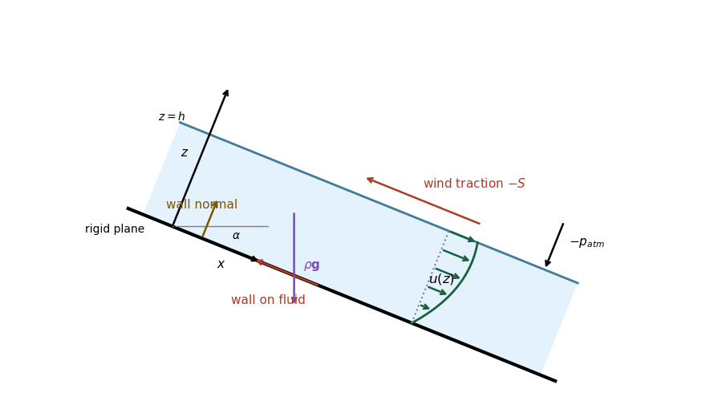

<h1 id="17d/a/solution">Solution</h1>

↑ **Parent:** [A](../a.md)

Choose $x$ downslope along the rigid plane and $z$ normal to it into the fluid, with the wall at $z=0$ and the flat free surface at $z=h$. The gravitational [body force](../../../../../../body-force.md) per unit volume has components $(\rho g\sin\alpha,-\rho g\cos\alpha)$. The wind's tangential [traction](../../../../../../traction.md) on the top surface is $-S$ in the $x$ direction; the atmospheric normal [traction](../../../../../../traction.md) is $-p_{\rm atm}$ in the $z$ direction. At the wall there is [no-slip boundary condition](../../../../../../no-slip-boundary-condition.md), and the wall supplies the opposing normal force and a tangential [traction](../../../../../../traction.md) whose sign depends on the wind strength.

The velocity is parallel to the plane, $(u(z),0)$. Its [velocity profile](../../../../../../velocity-profile.md) is a concave quadratic, with $u(0)=0$ and negative slope at the free surface when $S>0$. The diagram uses moderate wind, for which the flow is still everywhere downslope. Stronger wind can reverse the upper portion, or the entire moving layer; the later cases quantify this.

**[Figure 2](#17d/a/image-coordinates-gravity-surface-tractions-and-a-moderate-wind-velocity-profile). Coordinates, gravity, surface tractions and a moderate-wind velocity profile**.

## ↑ Ancestors (11)

1. [A](../a.md)
2. [17D](../../17d.md)
3. [Paper 1](../../../paper-1-split.md)
4. [Ib](../../../split.md)
5. [2017](../../../../split.md)
6. [Past exam of the mathematics course of the University of Cambridge](../../../../../split.md)
7. [Mathematics course of the University of Cambridge](../../../../../../mathematics-course-of-the-university-of-cambridge.md)
8. [Course of the University of Cambridge](../../../../../../course-of-the-university-of-cambridge.md)
9. [University of Cambridge](../../../../../../university-of-cambridge-split.md)
10. [List of universities](../../../../../../list-of-universities.md)
11. [Codex Wiki](../../../../../../split.md)
