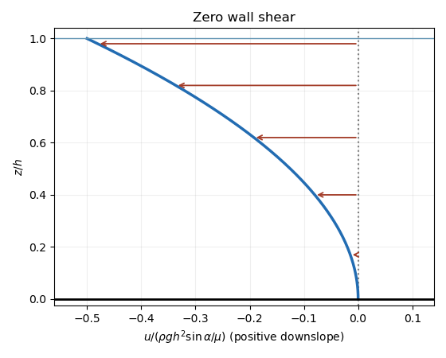

<h1 id="17d/d/solution">Solution</h1>

↑ **Parent:** [D](../d.md)

The wall [shear stress](../../../../../../shear-stress.md) vanishes when $\mu u'(0)=\rho gh\sin\alpha-S=0$. Therefore

$$
\boxed{S=\rho gh\sin\alpha,\qquad u(z)=-\frac{\rho g\sin\alpha}{2\mu}z^2}.
$$

For a genuinely inclined plane the entire moving layer now flows upslope. The profile touches zero at the wall with zero derivative and becomes increasingly negative towards the surface. In the plot with velocity horizontal and height vertical, the zero derivative $du/dz=0$ at the wall is represented by a vertical tangent. The resulting [volume flux](../../../../../../volumetric-flow-rate.md) is $-\rho gh^3\sin\alpha/(6\mu)$, so zero wall [shear stress](../../../../../../shear-stress.md) does not mean zero flux.

**[Figure 4](#17d/d/image-zero-wall-shear-and-an-entirely-upslope-velocity-profile). Zero wall shear and an entirely upslope velocity profile**.

## ↑ Ancestors (11)

1. [D](../d.md)
2. [17D](../../17d.md)
3. [Paper 1](../../../paper-1-split.md)
4. [Ib](../../../split.md)
5. [2017](../../../../split.md)
6. [Past exam of the mathematics course of the University of Cambridge](../../../../../split.md)
7. [Mathematics course of the University of Cambridge](../../../../../../mathematics-course-of-the-university-of-cambridge.md)
8. [Course of the University of Cambridge](../../../../../../course-of-the-university-of-cambridge.md)
9. [University of Cambridge](../../../../../../university-of-cambridge-split.md)
10. [List of universities](../../../../../../list-of-universities.md)
11. [Codex Wiki](../../../../../../split.md)
