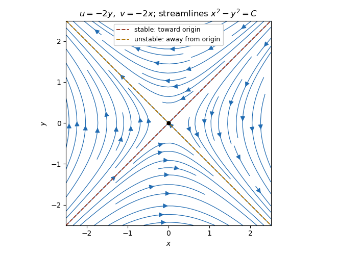

<h1 id="5d/ii/solution">Solution</h1>

↑ **Parent:** [Ii](../ii.md)

Here both the [divergence](../../../../../../divergence.md) and [vorticity](../../../../../../vorticity.md) vanish:

$$
\partial_x(-2y)+\partial_y(-2x)=0,\qquad \partial_x(-2x)-\partial_y(-2y)=-2+2=0.
$$

The flow is **incompressible and irrotational**. With $\mathbf u=\nabla\phi$ and $(u_x,u_y)=(\psi_y,-\psi_x)$,

$$
\boxed{\phi=-2xy+C,\qquad\psi=x^2-y^2+C'}.
$$

The [streamlines](../../../../../../streamline.md) are the [level sets](../../../../../../level-set.md) $x^2-y^2=\text{constant}$. To determine the arrows, put $r=x+y$ and $s=x-y$. A particle satisfies $\dot r=-2r$, $\dot s=2s$. Thus the [separatrix](../../../../../../separatrix.md) $y=x$ approaches the stagnation point at the origin, whereas $y=-x$ leaves it; the other [streamlines](../../../../../../streamline.md) are hyperbolas following those asymptotes. The origin itself is a stationary particle.

**[Figure 1](#5d/ii/image-streamlines-and-directions-for-the-incompressible-irrotational-flow). Streamlines and directions for the incompressible irrotational flow**.

## ↑ Ancestors (11)

1. [Ii](../ii.md)
2. [5D](../../5d.md)
3. [Paper 1](../../../paper-1-split.md)
4. [Ib](../../../split.md)
5. [2017](../../../../split.md)
6. [Past exam of the mathematics course of the University of Cambridge](../../../../../split.md)
7. [Mathematics course of the University of Cambridge](../../../../../../mathematics-course-of-the-university-of-cambridge.md)
8. [Course of the University of Cambridge](../../../../../../course-of-the-university-of-cambridge.md)
9. [University of Cambridge](../../../../../../university-of-cambridge-split.md)
10. [List of universities](../../../../../../list-of-universities.md)
11. [Codex Wiki](../../../../../../split.md)
