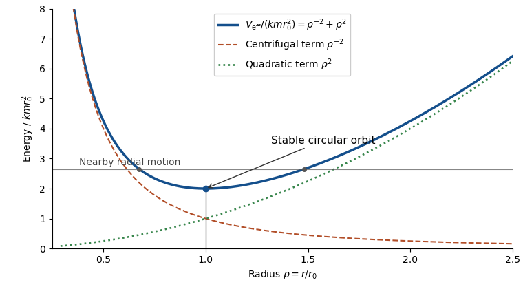

# Paper 2

↑ **Parent:** [Ib](../ib.md)

[https://www.maths.cam.ac.uk/undergrad/pastpapers/files/2017/paperib_2_2.pdf](https://www.maths.cam.ac.uk/undergrad/pastpapers/files/2017/paperib_2_2.pdf)

**Table of contents**

- [1F](#1f)
  - [Solution](#1f/solution)
- [2E](#2e)
  - [a](#2e/a)
    - [Solution](#2e/a/solution)
  - [b](#2e/b)
    - [i](#2e/b/i)
      - [Solution](#2e/b/i/solution)
    - [ii](#2e/b/ii)
      - [Solution](#2e/b/ii/solution)
- [3G](#3g)
  - [a](#3g/a)
    - [Solution](#3g/a/solution)
  - [b](#3g/b)
    - [Solution](#3g/b/solution)
- [4E](#4e)
  - [a](#4e/a)
    - [Solution](#4e/a/solution)
  - [b](#4e/b)
    - [Solution](#4e/b/solution)
- [5B](#5b)
  - [Solution](#5b/solution)
- [6C](#6c)
  - [Solution](#6c/solution)
- [7D](#7d)
  - [Solution](#7d/solution)
- [8H](#8h)
  - [a](#8h/a)
    - [Solution](#8h/a/solution)
  - [b](#8h/b)
    - [Solution](#8h/b/solution)
  - [c](#8h/c)
    - [Solution](#8h/c/solution)
- [9H](#9h)
  - [a](#9h/a)
    - [Solution](#9h/a/solution)
  - [b](#9h/b)
    - [Solution](#9h/b/solution)
- [10F](#10f)
  - [Solution](#10f/solution)
- [11E](#11e)
  - [a](#11e/a)
    - [Solution](#11e/a/solution)
  - [b](#11e/b)
    - [Solution](#11e/b/solution)
  - [c](#11e/c)
    - [Solution](#11e/c/solution)
- [12G](#12g)
  - [i](#12g/i)
    - [Solution](#12g/i/solution)
  - [ii](#12g/ii)
    - [Solution](#12g/ii/solution)
- [13A](#13a)
  - [Solution](#13a/solution)
- [14G](#14g)
  - [Solution](#14g/solution)
- [15D](#15d)
  - [Solution](#15d/solution)
- [16A](#16a)
  - [Solution](#16a/solution)
- [17B](#17b)
  - [a](#17b/a)
    - [Solution](#17b/a/solution)
  - [b](#17b/b)
    - [i](#17b/b/i)
      - [Solution](#17b/b/i/solution)
    - [ii](#17b/b/ii)
      - [Solution](#17b/b/ii/solution)
- [18C](#18c)
  - [Solution](#18c/solution)
- [19C](#19c)
  - [Solution](#19c/solution)
- [20H](#20h)
  - [a](#20h/a)
    - [Solution](#20h/a/solution)
  - [b](#20h/b)
    - [Solution](#20h/b/solution)
  - [c](#20h/c)
    - [Solution](#20h/c/solution)

## 1F

↑ **Parent:** [Paper 2](paper-2.md)

<h3 id="1f/solution">Solution</h3>

↑ **Parent:** [1F](#1f)

For a [linear map](../../../vector-space.md#linear-map) $\alpha:U\to V$ with $U$ a [finite-dimensional vector space](../../../vector-space.md#finite-dimensional-vector-space), the [rank-nullity theorem](../../../linear-algebra.md#rank-nullity-theorem) is

$$
\boxed{\dim U=\dim\ker\alpha+\dim\operatorname{im}\alpha.}
$$

Choose a [basis](../../../vector-space.md#basis) $u_1,\ldots,u_k$ of the [kernel of a linear map](../../../linear-algebra.md#kernel-of-a-linear-map) and extend it to a basis $u_1,\ldots,u_k,v_1,\ldots,v_r$ of $U$. The vectors $\alpha(v_j)$ span the [image of a linear map](../../../vector-space.md#image-of-a-linear-map), because the kernel basis contributes zero. If $\sum_j c_j\alpha(v_j)=0$, then $\sum_j c_jv_j$ belongs to the kernel and is a combination of the $u_i$; independence of the extended basis makes every $c_j=0$. Thus the image basis has $r$ elements and $\dim U=k+r$, proving the theorem.

For a rank-two map on $\mathbb R^3$, the [direct sum](../../../vector-space.md#direct-sum) occurs for $\alpha(x,y,z)=(x,y,0)$: its kernel is $\mathbb Re_3$ and its image is $\operatorname{span}(e_1,e_2)$. It fails for $\beta(x,y,z)=(y,z,0)$: the kernel is $\mathbb Re_1$, contained in the two-dimensional image $\operatorname{span}(e_1,e_2)$. The [rank-nullity theorem](../../../linear-algebra.md#rank-nullity-theorem) fixes the sum of the dimensions, but does not imply zero intersection.

## 2E

↑ **Parent:** [Paper 2](paper-2.md)

<h3 id="2e/a">a</h3>

↑ **Parent:** [2E](#2e)

<h4 id="2e/a/solution">Solution</h4>

↑ **Parent:** [A](#2e/a)

A [unique factorization domain](../../../algebra.md#unique-factorization-domain) is an [integral domain](../../../commutative-algebra.md#integral-domain) in which every nonzero nonunit is a finite product of [irreducible elements](../../../commutative-algebra.md#irreducible-element), uniquely up to reordering and multiplication of factors by a [unit in a ring](../../../algebra.md#unit-in-a-ring). A [principal ideal domain](../../../commutative-algebra.md#principal-ideal-domain) is an [integral domain](../../../commutative-algebra.md#integral-domain) in which every [ideal](../../../commutative-algebra.md#ideal) is generated by one element.

[Gauss lemma for polynomials](../../../commutative-algebra.md#gauss-lemma-for-polynomials) says that over a [unique factorization domain](../../../algebra.md#unique-factorization-domain) $D$, the product of two [primitive polynomials](../../../commutative-algebra.md#primitive-polynomial) is primitive, and the [polynomial content](../../../commutative-algebra.md#polynomial-content) satisfies $c(fg)=c(f)c(g)$ up to a unit. In particular a primitive polynomial of positive degree is irreducible over $D$ exactly when it is irreducible over the [fraction field](../../../commutative-algebra.md#field-of-fractions) of $D$. Consequently a [polynomial ring over a unique factorization domain](../../../commutative-algebra.md#polynomial-ring-over-a-unique-factorization-domain) is itself a [unique factorization domain](../../../algebra.md#unique-factorization-domain).

The [Eisenstein criterion](../../../commutative-algebra.md#eisenstein-criterion) says that if $f(X)=a_nX^n+\cdots+a_0\in D[X]$ has $n\ge1$ and there is a prime element $p$ with $p\nmid a_n$, $p\mid a_j$ for every $j<n$, and $p^2\nmid a_0$, then $f$ is irreducible over the [fraction field](../../../commutative-algebra.md#field-of-fractions). If $f$ is primitive, it is also irreducible in $D[X]$. Over $\mathbb Z$ one may take $p$ to be an ordinary prime number. The primitivity qualification prevents a nonunit constant content from being overlooked.

**The defining distinction is unique irreducible factorization versus generation of every ideal by one element.**

<h3 id="2e/b">b</h3>

↑ **Parent:** [2E](#2e)

<h4 id="2e/b/i">i</h4>

↑ **Parent:** [B](#2e/b)

<h5 id="2e/b/i/solution">Solution</h5>

↑ **Parent:** [I](#2e/b/i)

Take $\boxed{R=\mathbb Q[X]}$ and, for the next clause, its subring $S=\mathbb Z[X]$. Division with remainder makes $R$ a [Euclidean domain](../../../commutative-algebra.md#euclidean-domain), with the degree as Euclidean size for nonzero polynomials. For completeness, a nonzero [ideal](../../../commutative-algebra.md#ideal) of $R$ contains a polynomial $g$ of least degree; division of any member by $g$ leaves a smaller-degree remainder in the ideal, so that remainder must vanish. The ideal is therefore $(g)$; the zero ideal is already principal. Thus $R$ is a [principal ideal domain](../../../commutative-algebra.md#principal-ideal-domain).

<h4 id="2e/b/ii">ii</h4>

↑ **Parent:** [B](#2e/b)

<h5 id="2e/b/ii/solution">Solution</h5>

↑ **Parent:** [Ii](#2e/b/ii)

For the same pair, $\boxed{S=\mathbb Z[X]\subset\mathbb Q[X]}$. Since $\mathbb Z$ is a [unique factorization domain](../../../algebra.md#unique-factorization-domain), [Gauss lemma for polynomials](../../../commutative-algebra.md#gauss-lemma-for-polynomials) proves that $S$ is a [unique factorization domain](../../../algebra.md#unique-factorization-domain).

To prove that $S$ is not a [principal ideal domain](../../../commutative-algebra.md#principal-ideal-domain), consider the [ideal](../../../commutative-algebra.md#ideal) $I=(2,X)$. A generator $g$ would divide 2 and $X$. Divisibility of 2 forces $g$ to be a nonzero constant integer; divisibility of $X$ then forces that integer to divide its coefficient 1, so $g=\pm1$. This would make $I=S$. But evaluation at $X=0$ followed by reduction modulo 2 maps every element of $I$ to zero and maps 1 to one. Hence $1\notin I$, a contradiction. This is the [integer polynomial ring is not a principal ideal domain](../../../commutative-algebra.md#integer-polynomial-ring-is-not-a-principal-ideal-domain) example, with both clauses satisfied by a single inclusion.

## 3G

↑ **Parent:** [Paper 2](paper-2.md)

<h3 id="3g/a">a</h3>

↑ **Parent:** [3G](#3g)

<h4 id="3g/a/solution">Solution</h4>

↑ **Parent:** [A](#3g/a)

The [uniform convergence](../../../real-analysis.md#uniform-convergence) condition on a set $X$ is

$$
\boxed{\forall\epsilon>0\ \exists N\ \forall n\ge N\ \forall x\in X:\quad |f_n(x)-f(x)|<\epsilon.}
$$

The index $N$ is independent of $x$; this is stronger than [pointwise convergence](../../../real-analysis.md#pointwise-convergence).

Fix $x_0\in\mathbb R$ and $\epsilon>0$. Choose one $N$ such that $|f_N(x)-f(x)|<\epsilon/3$ for every $x$. The [continuity](../../../calculus.md#continuous-function) of $f_N$ at $x_0$ gives $\delta>0$ with $|f_N(x)-f_N(x_0)|<\epsilon/3$ whenever $|x-x_0|<\delta$. The [triangle inequality](../../../topological-analysis.md#triangle-inequality) then gives

$$
|f(x)-f(x_0)|\le |f(x)-f_N(x)|+|f_N(x)-f_N(x_0)|+|f_N(x_0)-f(x_0)|<\epsilon.
$$

Since $x_0$ was arbitrary, $\boxed{f\text{ is continuous on }\mathbb R}$, the [uniform limit theorem](../../../real-analysis.md#uniform-limit-theorem). Continuity of each approximant need not be uniform continuity.

<h3 id="3g/b">b</h3>

↑ **Parent:** [3G](#3g)

<h4 id="3g/b/solution">Solution</h4>

↑ **Parent:** [B](#3g/b)

**No: local uniform convergence need not be global uniform convergence.** For a bounded counterexample use the continuous functions $f_n(x)=\min(1,|x|/n)$ and $f(x)=0$. On any fixed interval $[-M,M]$, for $n>M$,

$$
\sup_{|x|\le M}|f_n(x)-f(x)|=M/n\longrightarrow0.
$$

Thus there is [locally uniform convergence](../../../real-analysis.md#locally-uniform-convergence) to zero. On all of $\mathbb R$, however, $\sup_x|f_n(x)-f(x)|=1$ for every $n$, so [uniform convergence](../../../real-analysis.md#uniform-convergence) fails. The cutoff needed to control the tails cannot be chosen independently of the interval.

## 4E

↑ **Parent:** [Paper 2](paper-2.md)

<h3 id="4e/a">a</h3>

↑ **Parent:** [4E](#4e)

<h4 id="4e/a/solution">Solution</h4>

↑ **Parent:** [A](#4e/a)

The [continuity](../../../calculus.md#continuous-function) condition at $x\in X$ between [metric spaces](../../../topological-analysis.md#metric-space) is

$$
\boxed{\forall\epsilon>0\ \exists\delta>0:\quad d(x,y)<\delta\Longrightarrow e(f(x),f(y))<\epsilon.}
$$

The function is continuous when this holds at every $x$.

If $f$ is continuous and $U\subseteq Y$ is an [open set](../../../topology.md#open-set), take $x\in f^{-1}(U)$. Some $\epsilon$-ball around $f(x)$ lies in $U$. Continuity gives a $\delta$-ball around $x$ mapped into that ball and hence contained in $f^{-1}(U)$. Thus $f^{-1}(U)$ is open, including the empty set, in the notation for the [image and preimage of a function](../../../set-theory.md#image-and-preimage-of-a-function).

Conversely, suppose every open set has open preimage. For fixed $x$ and $\epsilon>0$, the preimage of the open ball $B_e(f(x),\epsilon)$ is open and contains $x$, so contains some $B_d(x,\delta)$. This gives the displayed metric definition. Therefore $\boxed{f\text{ is continuous}\iff f^{-1}(U)\text{ is open for every open }U}$.

<h3 id="4e/b">b</h3>

↑ **Parent:** [4E](#4e)

<h4 id="4e/b/solution">Solution</h4>

↑ **Parent:** [B](#4e/b)

Let $X=\mathbb R$ with the usual metric and let $Y=\mathbb R$ with the [discrete metric](../../../topological-analysis.md#discrete-metric), and take $f(x)=x$. Every subset of $Y$ is an [open set](../../../topology.md#open-set), so the image of every open subset of $X$ is open: $f$ is an [open map](../../../calculus.md#open-map).

It is not continuous at any point. For $\epsilon=1/2$, every $\delta>0$ allows a distinct $y$ with $|y-x|<\delta$, but the distance between $f(y)$ and $f(x)$ in the discrete metric is 1. Equivalently, the preimage of the open singleton $\{x\}\subset Y$ is not open in $X$. Thus $\boxed{\text{an open map need not be continuous}}$ even between [metric spaces](../../../topological-analysis.md#metric-space).

## 5B

↑ **Parent:** [Paper 2](paper-2.md)

<h3 id="5b/solution">Solution</h3>

↑ **Parent:** [5B](#5b)

Oddness gives zero cosine coefficients. Integration by parts gives the sine [Fourier coefficients](../../../fourier-series.md#fourier-coefficient)

$$
b_n=\frac2\pi\int_0^\pi x\sin(nx)\,dx=\frac{2(-1)^{n+1}}n,
\qquad \boxed{x=2\sum_{n=1}^\infty\frac{(-1)^{n+1}}n\sin(nx)\quad(-\pi<x<\pi).}
$$

The [Fourier series](../../../fourier-series.md) of the piecewise smooth periodic extension converges to its value at interior continuity points. [Termwise integration](../../../mathematics.md#termwise-integration) from 0 to $x$ is valid: on the interval between these points, which stays inside $(-\pi,\pi)$, the partial sums of $\sum(-1)^{n+1}\sin(nt)$ are uniformly bounded by the geometric-sum formula, since $|1+e^{it}|$ is bounded away from zero. The [Dirichlet test](../../../real-analysis.md#dirichlet-test) therefore gives uniform convergence there. Integrating gives

$$
x^2=4\sum_{n=1}^\infty\frac{(-1)^{n+1}}{n^2}(1-\cos nx).
$$

The integrated series is absolutely and uniformly convergent. Consequently

$$
\boxed{a_n=\frac{4(-1)^n}{n^2}\ (n\ge1),\qquad a_0=8\sum_{n=1}^\infty\frac{(-1)^{n-1}}{n^2}.}
$$

Independently, the constant [Fourier coefficient](../../../fourier-series.md#fourier-coefficient) is $a_0=\pi^{-1}\int_{-\pi}^\pi x^2\,dx=2\pi^2/3$. Comparison yields

$$
\boxed{\sum_{n=1}^\infty\frac{(-1)^{n-1}}{n^2}=\frac{\pi^2}{12},\qquad x^2=\frac{\pi^2}{3}+4\sum_{n=1}^\infty\frac{(-1)^n}{n^2}\cos nx.}
$$

The original sine series is not uniformly convergent on the whole open interval; that stronger assertion is unnecessary for the justified integration.

## 6C

↑ **Parent:** [Paper 2](paper-2.md)

<h3 id="6c/solution">Solution</h3>

↑ **Parent:** [6C](#6c)

In electrostatics, [Gauss's law](../../../electromagnetism.md#gauss-s-law) is $\oint_{\partial\Omega}\mathbf E\cdot\mathbf n\,dS=Q_{\rm enclosed}/\epsilon_0$, or locally $\nabla\cdot\mathbf E=\rho_e/\epsilon_0$, where $\rho_e$ is charge density and $\epsilon_0$ is [vacuum permittivity](../../../electromagnetism.md#vacuum-permittivity). [Spherical symmetry](../../../geometry-and-topology.md#spherical-symmetry) makes the [electric field](../../../electromagnetism.md#electric-field) radial, and Gauss's law gives

$$
\boxed{\mathbf E(r)=\begin{cases}0,&r<a,\\ \dfrac{Q}{4\pi\epsilon_0r^2}\mathbf e_r,&a<r<b,\\0,&r>b.\end{cases}}
$$

Choose the additive constant of the [electrostatic potential](../../../electromagnetism.md#electric-potential) by $\phi(\infty)=0$. Using $\mathbf E=-\nabla\phi$ and continuity of potential across each charged shell gives

$$
\boxed{\phi(r)=\begin{cases}\dfrac{Q}{4\pi\epsilon_0}(1/a-1/b),&r<a,\\ \dfrac{Q}{4\pi\epsilon_0}(1/r-1/b),&a<r<b,\\0,&r>b.\end{cases}}
$$

The field jumps at the shell surfaces, so the displayed formulas are for the requested open regions. The potential difference of the [spherical capacitor](../../../electromagnetism.md#spherical-capacitor) is $\Delta\phi=Q(1/a-1/b)/(4\pi\epsilon_0)$. Thus its [capacitance](../../../electromagnetism.md#capacitance) and [electrostatic energy](../../../electromagnetism.md#electrostatic-energy) are

$$
\boxed{C=\frac{Q}{\Delta\phi}=\frac{4\pi\epsilon_0ab}{b-a},\qquad W=\frac{Q^2}{2C}.}
$$

The energy follows either by charging work $\int_0^Q q/C\,dq$, or directly from $W=(\epsilon_0/2)\int|\mathbf E|^2\,d^3x=Q^2(1/a-1/b)/(8\pi\epsilon_0)$.

## 7D

↑ **Parent:** [Paper 2](paper-2.md)

<h3 id="7d/solution">Solution</h3>

↑ **Parent:** [7D](#7d)

For constant fluid density $\rho$, steady [Euler equations for an inviscid fluid](../../../fluid-mechanics.md#euler-equations-for-an-inviscid-fluid) under a [conservative force](../../../classical-mechanics.md#conservative-force) per unit mass $-\nabla\Phi$ read $(\mathbf u\cdot\nabla)\mathbf u=-\nabla p/\rho-\nabla\Phi$. Here $\mathbf u$ is velocity, $p$ pressure and $\Phi$ potential per unit mass. Dotting with $\mathbf u$ gives

$$
\mathbf u\cdot\nabla\left(\frac12|\mathbf u|^2+\frac p\rho+\Phi\right)=0,
\qquad \boxed{\frac12|\mathbf u|^2+\frac p\rho+\Phi=\text{constant along each streamline}.}
$$

This is the [Bernoulli equation](../../../fluid-mechanics.md#bernoulli-equation). The constants can differ between [streamlines](../../../fluid-mechanics.md#streamline). If density varies, the same derivation for a [barotropic fluid](../../../fluid-mechanics.md#barotropic-fluid) replaces $p/\rho$ by $\int^p dp'/\rho(p')$; constant density is the appropriate water approximation here.

For the draining cone, the radius at height $h$ is $h$ and the horizontal area is $\pi h^2$. Both the free surface and the jet are at atmospheric pressure; their gravitational potential difference is approximately $gh$. The speed of the descending surface is smaller than the jet speed by the area ratio $\epsilon^2/h^2$, so it can be neglected when $h\gg\epsilon$. The [Bernoulli equation](../../../fluid-mechanics.md#bernoulli-equation) then gives [Torricelli's law](../../../fluid-mechanics.md#torricelli-s-law), $U\simeq\sqrt{2gh}$. [Conservation of mass](../../../continuum-mechanics.md#mass-conservation) gives

$$
\pi h^2\dot h\simeq-\pi\epsilon^2\sqrt{2gh},\qquad
h(t)^{5/2}\simeq h_0^{5/2}-\frac52\epsilon^2\sqrt{2g}\,t.
$$

Hence the leading [drainage time of a conical tank](../../../fluid-mechanics.md#drainage-time-of-a-conical-tank) is

$$
\boxed{T\simeq\frac{2h_0^{5/2}}{5\epsilon^2\sqrt{2g}}=\left(\frac{2h_0^5}{25\epsilon^4g}\right)^{1/2}.}
$$

Removing the tip places the aperture at height of order $\epsilon$, and the quasi-steady calculation fails in the last layer of that depth. Integrating down only to $h=O(\epsilon)$ changes the displayed leading time by relative order $(\epsilon/h_0)^{5/2}$; replacing the actual head $h-\epsilon$ by $h$ introduces a larger, but still vanishing, relative correction of order $\epsilon/h_0$. The formula is the ideal inviscid estimate under the question's stated approximation, not an exact law for the final transient or a real contracted jet.

## 8H

↑ **Parent:** [Paper 2](paper-2.md)

<h3 id="8h/a">a</h3>

↑ **Parent:** [8H](#8h)

<h4 id="8h/a/solution">Solution</h4>

↑ **Parent:** [A](#8h/a)

A $100\gamma\%$ [confidence interval](../../../statistical-inference.md#confidence-interval) is a pair of statistics $L(X)\le U(X)$ whose random interval satisfies

$$
\boxed{\mathbb P_\theta\{L(X)\le\theta\le U(X)\}\ge\gamma\quad\text{for every allowed }\theta.}
$$

An exact confidence interval has equality throughout. The probability refers to repeated sampling at a fixed unknown parameter; the endpoints are random before observation. It is not a posterior probability assigned to the parameter after seeing the data. Here $0<\gamma<1$.

<h3 id="8h/b">b</h3>

↑ **Parent:** [8H](#8h)

<h4 id="8h/b/solution">Solution</h4>

↑ **Parent:** [B](#8h/b)

The sample mean $\overline X$ has [normal distribution](../../../probability-theory.md#normal-distribution) $N(\mu,1/n)$ because the observations are independent with known variance 1. The [pivotal quantity](../../../probability-and-statistics.md#pivotal-quantity) $Z=\sqrt n(\overline X-\mu)$ has the [standard normal distribution](../../../probability-theory.md#standard-normal-distribution). Consequently

$$
\mathbb P_\mu\left\{-1.96\le\sqrt n(\overline X-\mu)\le1.96\right\}\simeq0.95,
$$

and inversion gives the [confidence interval](../../../statistical-inference.md#confidence-interval)

$$
\boxed{\left[\overline X-\frac{1.96}{\sqrt n},\ \overline X+\frac{1.96}{\sqrt n}\right].}
$$

Replacing 1.96 by the exact $0.975$ normal quantile gives exact 95% coverage; the printed numerical value gives the usual rounded interval. No variance estimation or Student distribution is needed.

<h3 id="8h/c">c</h3>

↑ **Parent:** [8H](#8h)

<h4 id="8h/c/solution">Solution</h4>

↑ **Parent:** [C](#8h/c)

Let $U_{(1)}=\min(U_1,U_2)$ and $U_{(2)}=\max(U_1,U_2)$ be the [order statistics](../../../probability-theory.md#order-statistic). For the symmetric [uniform distribution](../../../continuous-probability-distribution.md#continuous-uniform-distribution), each observation is above or below $\theta$ with probability $1/2$, independently. Thus

$$
\mathbb P_\theta\{U_{(1)}\le\theta\le U_{(2)}\}
=1-(1/2)^2-(1/2)^2=1/2.
$$

So $\boxed{[U_{(1)},U_{(2)}]}$ is an exact 50% [confidence interval](../../../statistical-inference.md#confidence-interval).

The observed interval $[10,11.5]$ contains values impossible under the sampling model. Both observations must lie within one unit of the parameter, so the interval of all compatible values is $[U_{(2)}-1,U_{(1)}+1]=[10.5,11]$. It contains the true parameter almost surely. A [support-restricted confidence interval for a uniform location parameter](../../../statistical-inference.md#support-restricted-confidence-interval-for-a-uniform-location-parameter) can therefore report

$$
\boxed{[10.5,11].}
$$

More precisely, the procedure $[U_{(1)},U_{(2)}]\cap[U_{(2)}-1,U_{(1)}+1]$ retains exact 50% unconditional coverage, since the second interval contains $\theta$ almost surely. The intersection is a nonempty interval for every sample in the model and equals $[10.5,11]$ for these data. Reporting the full compatible interval alone is also valid and has coverage one. On this sample's large-spread event it lies wholly between the observations; this does not turn the unconditional 50% procedure into a generally 100% procedure.

## 9H

↑ **Parent:** [Paper 2](paper-2.md)

<h3 id="9h/a">a</h3>

↑ **Parent:** [9H](#9h)

<h4 id="9h/a/solution">Solution</h4>

↑ **Parent:** [A](#9h/a)

For a vector equality constraint, take the [Lagrangian function in constrained optimization](../../../calculus-of-variations.md#lagrangian-function-in-constrained-optimization)

$$
\boxed{L(x,\lambda)=f(x)+\lambda^T(b-g(x)),\qquad x\in X,\quad\lambda\in\mathbb R^m.}
$$

The sign of the multiplier is a convention; equality multipliers are unrestricted. The [Lagrange sufficiency theorem](../../../mathematical-optimization.md#lagrange-sufficiency-theorem) says that if $x^*\in X$ is feasible and, for some $\lambda^*$, globally minimizes $L(\cdot,\lambda^*)$ over $X$, then $x^*$ globally minimizes the constrained objective.

Indeed for any feasible $x$, $f(x)=L(x,\lambda^*)\ge L(x^*,\lambda^*)=f(x^*)$. Thus $\boxed{x^*\text{ is a global primal minimizer}}$. The theorem requires a global Lagrangian minimum, not merely a stationary point. It needs neither differentiability nor convexity when stated in this form; those hypotheses can be used separately to establish the required minimum.

<h3 id="9h/b">b</h3>

↑ **Parent:** [9H](#9h)

<h4 id="9h/b/solution">Solution</h4>

↑ **Parent:** [B](#9h/b)

For the same multiplier convention, the [Lagrangian dual problem](../../../mathematical-optimization.md#lagrangian-dual-problem) is

$$
q(\lambda)=\inf_{x\in X}[f(x)+\lambda^T(b-g(x))],\qquad
\boxed{\sup_{\lambda\in\mathbb R^m}q(\lambda).}
$$

For every feasible $x$ and every $\lambda$, the equality constraint implies $q(\lambda)\le L(x,\lambda)=f(x)$. Taking first the infimum over feasible $x$ and then the supremum over $\lambda$ proves [weak duality](../../../mathematical-optimization.md#weak-duality):

$$
\boxed{d^*:=\sup_\lambda q(\lambda)\le p^*:=\inf_{x\in X,\ g(x)=b} f(x).}
$$

The inequalities remain meaningful with the usual extended-value conventions, including $q(\lambda)=-\infty$ when the Lagrangian is unbounded below. Equality of optimum values, or their attainment, does not follow from [weak duality](../../../mathematical-optimization.md#weak-duality). If the sufficient pair in part (a) exists, it attains equality, since $q(\lambda^*)=L(x^*,\lambda^*)=f(x^*)$.

## 10F

↑ **Parent:** [Paper 2](paper-2.md)

<h3 id="10f/solution">Solution</h3>

↑ **Parent:** [10F](#10f)

Put $A=\operatorname{im}\alpha$. The restriction $\beta|_A$ has image $\operatorname{im}(\beta\alpha)$ and kernel $A\cap\ker\beta$. By the [rank-nullity theorem](../../../linear-algebra.md#rank-nullity-theorem),

$$
r(\beta\alpha)=r(\alpha)-\dim(A\cap\ker\beta).
$$

Since its image is contained in $\operatorname{im}\beta$, this proves the upper bound. Also $\dim(A\cap\ker\beta)\le\dim\ker\beta=\dim V-r(\beta)$, giving the [rank inequality for a composition](../../../linear-algebra.md#rank-inequality-for-a-composition):

$$
\boxed{r(\alpha)+r(\beta)-\dim V\le r(\beta\alpha)\le\min(r(\alpha),r(\beta)).}
$$

Examples on $U=V=W=\mathbb R^2$ distinguish the inequalities. Taking $\alpha=\beta=I$ gives equality in both. Taking $\alpha=\operatorname{diag}(1,0)$ and $\beta=\operatorname{diag}(0,1)$ gives composition rank zero, strictly below the upper bound 1 and equal to the lower bound 0. Taking $\alpha=\beta=\operatorname{diag}(1,0)$ gives rank 1, strictly above the lower bound 0 and equal to the upper bound 1.

For the final [nilpotent linear map](../../../linear-operator-theory.md#nilpotent-linear-map), repeated application of the lower bound gives $r(\alpha^k)\ge2n-2k$. Since $\alpha^n=\alpha^{n-k}\alpha^k=0$, another application gives

$$
0\ge r(\alpha^{n-k})+r(\alpha^k)-2n
\ge2k+r(\alpha^k)-2n.
$$

The two bounds coincide, yielding

$$
\boxed{r(\alpha^k)=2n-2k\quad(1\le k\le n-1).}
$$

In fact the same formula includes $k=0,n$. For $n=1$ the requested index range is empty and the assumptions force $\alpha=0$.

## 11E

↑ **Parent:** [Paper 2](paper-2.md)

<h3 id="11e/a">a</h3>

↑ **Parent:** [11E](#11e)

<h4 id="11e/a/solution">Solution</h4>

↑ **Parent:** [A](#11e/a)

For [nilpotent elements](../../../commutative-algebra.md#nilpotent) $a,b$ of the [commutative ring](../../../commutative-algebra.md#commutative-ring), choose positive integers $r,s$ with $a^r=b^s=0$. The [binomial theorem](../../../combinatorics.md#binomial-theorem) gives

$$
(a+b)^{r+s-1}=\sum_{j=0}^{r+s-1}\binom{r+s-1}{j}a^jb^{r+s-1-j}=0:
$$

each term has either $j\ge r$ or $r+s-1-j\ge s$. Also $(-a)^r=0$, $0\in N$, and $(ta)^r=t^ra^r=0$ for every $t\in R$. Thus $N$ is an additive subgroup stable under multiplication by arbitrary ring elements:

$$
\boxed{N\text{ is an ideal of }R,\text{ its nilradical}.}
$$

Commutativity is essential to the simple binomial argument; an arbitrary sum of nilpotent elements in a noncommutative ring need not be nilpotent.

<h3 id="11e/b">b</h3>

↑ **Parent:** [11E](#11e)

<h4 id="11e/b/solution">Solution</h4>

↑ **Parent:** [B](#11e/b)

Consider all [ideals](../../../commutative-algebra.md#ideal) containing $I$ and disjoint from the nonempty [multiplicative subset](../../../commutative-algebra.md#multiplicatively-closed-set) $S$. This collection is nonempty because it contains $I$. The [ascending chain condition](../../../algebra.md#ascending-chain-condition) for the [Noetherian ring](../../../algebra.md#noetherian-ring) gives a maximal member $P$: otherwise repeatedly choosing a strictly larger member would give an infinite strictly ascending chain of ideals. Since $S$ is nonempty and $P$ misses it, $P\ne R$.

Suppose $ab\in P$ but $a,b\notin P$. Maximality implies that $P+(a)$ and $P+(b)$ both meet $S$, so write $s=p+ra\in S$ and $t=q+ub\in S$ with $p,q\in P$. Then

$$
st=pq+pub+qra+ruab\in P,
$$

while closure under products gives $st\in S$, a contradiction. Hence

$$
\boxed{P\supseteq I,\quad P\cap S=\varnothing,\quad P\text{ is prime}.}
$$

This proves the [prime ideal avoiding a multiplicative subset](../../../commutative-algebra.md#prime-ideal-avoiding-a-multiplicative-subset) result without needing $1\in S$. The assumptions themselves rule out $0\in S$, since every ideal contains zero.

<h3 id="11e/c">c</h3>

↑ **Parent:** [11E](#11e)

<h4 id="11e/c/solution">Solution</h4>

↑ **Parent:** [C](#11e/c)

A [nilpotent element](../../../commutative-algebra.md#nilpotent) belongs to every [prime ideal](../../../commutative-algebra.md#prime-ideal): if $a^r=0\in P$, repeated primality forces $a\in P$. Therefore $N\subseteq\bigcap_P P$.

Conversely, if $a\notin N$, none of its positive powers is zero. The [multiplicative subset](../../../commutative-algebra.md#multiplicatively-closed-set) $S=\{1,a,a^2,\ldots\}$ is disjoint from $(0)$. Part (b) supplies a [prime ideal](../../../commutative-algebra.md#prime-ideal) disjoint from $S$, hence not containing $a$. Thus $a$ is outside the intersection, proving the [nilradical as the intersection of prime ideals](../../../commutative-algebra.md#nilradical-as-the-intersection-of-prime-ideals) identity:

$$
\boxed{N=\bigcap_{P\text{ prime}}P.}
$$

In the zero ring there are no prime ideals; the empty intersection is interpreted as the whole ring, which is also its nilradical. For nonzero rings this argument proves existence of a prime ideal whenever a nonnilpotent element is available.

## 12G

↑ **Parent:** [Paper 2](paper-2.md)

<h3 id="12g/i">i</h3>

↑ **Parent:** [12G](#12g)

<h4 id="12g/i/solution">Solution</h4>

↑ **Parent:** [I](#12g/i)

The unheaded preliminary requests are addressed before the first example. A [norm](../../../functional-analysis.md#norm) is a function $p:V\to[0,\infty)$ satisfying $p(x)=0$ exactly for $x=0$, $p(ax)=|a|p(x)$, and $p(x+y)\le p(x)+p(y)$. Its induced metric is $d(x,y)=p(x-y)$. Translation $T_v$ preserves this distance, and scalar multiplication satisfies $d(ax,ay)=|a|d(x,y)$, so both are continuous; multiplication by zero is constant.

The [open unit ball](../../../functional-analysis.md#open-unit-ball) determines the norm uniquely through its [Minkowski functional](../../../topological-vector-space.md#minkowski-functional):

$$
p(x)=\inf\{t>0:x/t\in B\},
$$

because $x/t\in B$ is equivalent to $p(x)<t$. This also works for $x=0$.

Under the given radial and convexity hypotheses, set $p_B(0)=0$ and $p_B(v)=1/\lambda(v)$ for $v\ne0$. The finite symmetric segment along each line gives positivity, absolute homogeneity and $v\in B\iff p_B(v)<1$. If $s>p_B(x)$ and $t>p_B(y)$, then $x/s,y/t\in B$, and the stated convexity condition yields $(x+y)/(s+t)\in B$. Hence $p_B(x+y)<s+t$; taking $s\downarrow p_B(x)$ and $t\downarrow p_B(y)$ proves the [triangle inequality](../../../topological-analysis.md#triangle-inequality). Thus this is a [norm determined by a convex radial unit ball](../../../functional-analysis.md#norm-determined-by-a-convex-radial-unit-ball). The case $V=\{0\}$ is immediate.

For the coordinate box, the [Minkowski functional](../../../topological-vector-space.md#minkowski-functional) is the [supremum norm](../../../functional-analysis.md#supremum-norm):

$$
\boxed{\|(x_1,\ldots,x_n)\|_B=\max_i|x_i|.}
$$

Indeed $x/t\in B$ exactly when $t>\max_i|x_i|$.

<h3 id="12g/ii">ii</h3>

↑ **Parent:** [12G](#12g)

<h4 id="12g/ii/solution">Solution</h4>

↑ **Parent:** [Ii](#12g/ii)

The interior of the diamond is $B=\{(x_1,x_2):|x_1|+|x_2|<1\}$. Its [Minkowski functional](../../../topological-vector-space.md#minkowski-functional), or the uniqueness argument already proved, gives the [L1 norm](../../../functional-analysis.md#l1-norm):

$$
\boxed{\|(x_1,x_2)\|_B=|x_1|+|x_2|.}
$$

The final unheaded set $C$ cannot be an [open unit ball](../../../functional-analysis.md#open-unit-ball) of a [norm](../../../functional-analysis.md#norm), because every norm ball is [convex](../../../real-analysis.md#convex-function) by homogeneity and the [triangle inequality](../../../topological-analysis.md#triangle-inequality). Both $p=(9/10,0)$ and $q=(0,9/10)$ lie in $C$: their squared-distance expression is $101/100>1$. Their midpoint has that expression

$$
2(1-9/20)^2=121/200<1,
$$

so $(p+q)/2\notin C$. Thus $\boxed{\text{no norm has }C\text{ as its open unit ball}}$. The strict inequalities in the definition are respected by this explicit counterexample.

## 13A

↑ **Parent:** [Paper 2](paper-2.md)

<h3 id="13a/solution">Solution</h3>

↑ **Parent:** [13A](#13a)

The [residue theorem](../../../analysis.md#residue-theorem) states that a [meromorphic function](../../../isolated-singularity.md#meromorphic-function) with finitely many poles inside a positively oriented simple closed contour and none on it satisfies $\oint_C F(z)\,dz=2\pi i\sum\operatorname{Res}(F;a)$. The function must be holomorphic on a neighbourhood of the contour and its interior away from those poles.

Write $J=\int_0^\infty x^{1/2}\log x/(1+x^2)\,dx$ and $I=\int_0^\infty x^{1/2}/(1+x^2)\,dx$. Both integrals converge absolutely. Use the [principal complex logarithm](../../../analysis.md#principal-complex-logarithm) in the upper half-plane, with $z^{1/2}=e^{\log z/2}$, and an upper semicircle of radius $R>1$ indented above zero by a clockwise semicircle of radius $\epsilon<1$. The branch values on the negative real side are upper limits; equivalently use contours arbitrarily slightly above that side before taking a limit.

For $F(z)=z^{1/2}\log z/(1+z^2)$, the large arc is $O(R^{-1/2}\log R)$ and the small arc is $O(\epsilon^{3/2}|\log\epsilon|)$, so both vanish. On $z=-x$ approached from above, $z^{1/2}=i\sqrt x$ and $\log z=\log x+i\pi$. The oriented negative segment therefore contributes $iJ-\pi I$, and the positive segment contributes $J$. The only enclosed pole is $i$, with [residue](../../../analysis.md#residue)

$$
\operatorname{Res}(F;i)=\frac{e^{i\pi/4}(i\pi/2)}{2i}=\frac\pi4e^{i\pi/4}.
$$

Consequently

$$
(1+i)J-\pi I=2\pi i\operatorname{Res}(F;i)
=\frac{\pi^2}{2\sqrt2}(-1+i).
$$

Comparing imaginary and real parts yields the [upper-half-plane contour for square-root logarithmic integrals](../../../analysis.md#upper-half-plane-contour-for-square-root-logarithmic-integrals) evaluation:

$$
\boxed{\int_0^\infty\frac{x^{1/2}\log x}{1+x^2}\,dx=\frac{\pi^2}{2\sqrt2},\qquad
\int_0^\infty\frac{x^{1/2}}{1+x^2}\,dx=\frac\pi{\sqrt2}.}
$$

## 14G

↑ **Parent:** [Paper 2](paper-2.md)

<h3 id="14g/solution">Solution</h3>

↑ **Parent:** [14G](#14g)

For unit $u$, put $A=I-2uu^T$. Then $A^T=A$ and $A^2=I$, so $A$ is an [orthogonal matrix](../../../linear-algebra.md#orthogonal-matrix). The affine [reflection in a hyperplane](../../../linear-algebra.md#reflection-in-a-hyperplane) is $R(x)=Ax+2cu$. Hence $R(x)-R(y)=A(x-y)$ preserves the [Euclidean norm](../../../functional-analysis.md#euclidean-norm) and distance, and $R(x)=x$ whenever $u\cdot x=c$. Thus it is an [Euclidean isometry](../../../riemannian-geometry.md#euclidean-isometry) fixing the hyperplane pointwise.

For $p\ne q$, any reflection exchanging them must have normal parallel to $p-q$, and its fixed hyperplane must contain their midpoint. These requirements determine the perpendicular bisector uniquely:

$$
\boxed{u=\frac{p-q}{\|p-q\|},\qquad c=u\cdot\frac{p+q}{2},\qquad R(p)=q.}
$$

Changing both signs of $u,c$ leaves the same reflection. It belongs to the [orthogonal group](../../../linear-algebra.md#orthogonal-group) $O(n)$ exactly when its translation term vanishes, that is, $c=0$. Since $c=(\|p\|^2-\|q\|^2)/(2\|p-q\|)$,

$$
\boxed{R\in O(n)\iff\|p\|=\|q\|.}
$$

To prove the [finite reflection decomposition of a Euclidean isometry](../../../riemannian-geometry.md#finite-reflection-decomposition-of-a-euclidean-isometry), first note that a distance-preserving map $g$ fixing zero preserves inner products by the [polarization identity](../../../linear-algebra.md#polarization-identity). Its values on an orthonormal basis $e_i$ form an orthonormal basis, and $g(x)\cdot g(e_i)=x_i$ shows $g(x)=\sum_i x_i g(e_i)$. Thus $g$ is orthogonal.

Every [orthogonal transformation](../../../linear-algebra.md#orthogonal-transformation) is a product of at most $n$ linear reflections: if $g(e_1)\ne e_1$, reflect $g(e_1)$ to $e_1$ using the hyperplane normal $g(e_1)-e_1$, which passes through zero. The resulting orthogonal transformation fixes $e_1$, and its restriction to $e_1^\perp$ is handled inductively in dimension $n-1$. If $g(e_1)=e_1$, no initial reflection is necessary. Reflections on the complement extend by fixing $e_1$; the induction starts in dimension zero.

For an arbitrary isometry $f$, if $f(0)\ne0$, first reflect $f(0)$ to zero across its perpendicular bisector with zero. Composing this one affine reflection with $f$ gives an orthogonal transformation. If $f(0)=0$, skip the initial reflection. Therefore

$$
\boxed{f\text{ is a product of at most }n+1\text{ hyperplane reflections}.}
$$

The [glide reflection](../../../riemannian-geometry.md#glide-reflection) $(x,y)\mapsto(x+1,-y)$ cannot use fewer than three: its determinant sign is negative, excluding zero or two reflections, while absence of fixed points excludes a single reflection. Three suffice by reflecting successively in $x=0$, $x=1/2$, and $y=0$.

## 15D

↑ **Parent:** [Paper 2](paper-2.md)

<h3 id="15d/solution">Solution</h3>

↑ **Parent:** [15D](#15d)

The [principle of stationary action](../../../classical-mechanics.md#principle-of-stationary-action), also called Hamilton's principle, requires $\delta\int_{t_1}^{t_2}L\,dt=0$ for fixed-endpoint path variations. Here the original PDF has $\dot r^2$ in the radial kinetic energy; the TeX has lost that dot. With $m>0$ and $r>0$, the [Lagrangian](../../../calculus-of-variations.md#lagrangian) is

$$
L=\frac m2\dot r^2+\frac m2r^2\dot\phi^2-kmr^2.
$$

The [Euler-Lagrange equation](../../../analysis.md#euler-lagrange-equation) for each coordinate gives

$$
\boxed{\ddot r=r\dot\phi^2-2kr,\qquad\frac d{dt}(mr^2\dot\phi)=0.}
$$

The two conserved quantities are [angular momentum](../../../classical-mechanics.md#angular-momentum) $h=mr^2\dot\phi$ and energy $E=\frac m2\dot r^2+\frac m2r^2\dot\phi^2+kmr^2$. By [Noether's theorem](../../../calculus-of-variations.md#noether-conserved-quantity-for-a-mechanical-point-symmetry), they arise respectively from rotational invariance and time-translation invariance of the action. The coordinate $\phi$ is a [cyclic coordinate](../../../classical-mechanics.md#cyclic-coordinate), and $L$ has no explicit time dependence.

The [conjugate momentum](../../../classical-mechanics.md#canonical-momentum) for each coordinate is $p_r=m\dot r$, $p_\phi=mr^2\dot\phi$. The [Legendre transform](../../../convex-optimization.md#convex-conjugate) $H=p_r\dot r+p_\phi\dot\phi-L$ gives the [Hamiltonian](../../../classical-mechanics.md#hamiltonian)

$$
\boxed{H=\frac{p_r^2}{2m}+\frac{p_\phi^2}{2mr^2}+kmr^2.}
$$

[Hamilton's equations](../../../classical-mechanics.md#hamilton-s-equations) are

$$
\dot r=\frac{p_r}{m},\quad \dot\phi=\frac{p_\phi}{mr^2},\quad
\dot p_r=\frac{p_\phi^2}{mr^3}-2kmr,\quad \dot p_\phi=0.
$$

Setting $p_\phi=h$ yields $m\ddot r=-V_{\rm eff}'(r)$ with the [effective potential](../../../physics.md#effective-potential) $V_{\rm eff}=h^2/(2mr^2)+kmr^2$.

For $k>0$ and $h\ne0$, this potential tends to infinity both as $r\downarrow0$ and as $r\to\infty$, and has its unique stationary point at

$$
\boxed{r_0=\left(\frac{h^2}{2km^2}\right)^{1/4},\qquad V_{\rm eff}''(r_0)=8km>0.}
$$

The [effective potential stability criterion](../../../physics.md#effective-potential-stability-criterion) proves a stable [circular orbit in a quadratic central potential](../../../classical-mechanics.md#circular-orbit-in-a-quadratic-central-potential), with $|\dot\phi|=\sqrt{2k}$. For a small radial displacement $\eta$, $\ddot\eta+8k\eta=0$ to first order, so radial perturbations oscillate rather than grow. The diagram shows the centrifugal and quadratic contributions and their sum in dimensionless units:

**[Figure 1](#15d/image-the-effective-potential-for-a-central-force-orbit). The effective potential for a central-force orbit**.

The printed paper only says that $k$ is constant. Its claimed positive-radius stable circular orbit needs the additional attractive-force assumption $k>0$ and nonzero angular momentum. For $k<0$ there is no such minimum; for $k=0,h\ne0$ the effective potential is strictly decreasing. With $h=0,k>0$, the minimum is at the origin and is not a positive-radius circular orbit. These cases are not represented by the diagram.

## 16A

↑ **Parent:** [Paper 2](paper-2.md)

<h3 id="16a/solution">Solution</h3>

↑ **Parent:** [16A](#16a)

Put $\phi=R(r)\Theta(\theta)Z(z)$ in the [Laplace equation in cylindrical coordinates](../../../partial-differential-equation.md#laplace-equation-in-cylindrical-coordinates). [Separation of variables](../../../partial-differential-equation.md#separation-of-variables) first gives $\Theta''+m^2\Theta=0$; $2\pi$-periodicity forces $m=0,1,2,\ldots$, with angular factors $\cos m\theta,\sin m\theta$ (only the constant for $m=0$). Taking $Z''=\kappa^2Z$ gives

$$
r^2R''+rR'+(\kappa^2r^2-m^2)R=0.
$$

For $\kappa>0$ the separated modes are therefore

$$
\boxed{[A J_m(\kappa r)+B Y_m(\kappa r)]
[C e^{\kappa z}+D e^{-\kappa z}]
[E\cos m\theta+F\sin m\theta].}
$$

Here $J_m$ and $Y_m$ are the [Bessel function of the first kind](../../../analysis.md#bessel-function-of-the-first-kind) and the [Bessel function of the second kind](../../../analysis.md#bessel-function-of-the-second-kind). For the opposite sign $Z''=-\kappa^2 Z$, the modes instead involve $I_m(\kappa r),K_m(\kappa r)$, the [modified Bessel functions](../../../analysis.md#modified-bessel-function), paired with $\cos\kappa z,\sin\kappa z$. At zero separation constant use $Z=C+Dz$ and $R=Ar^m+Br^{-m}$ for $m\ge1$, or $R=A+B\log r$ for $m=0$. Superpositions over the integer angular orders and appropriate sums or integrals over the separation parameter give the general separated expansion; boundary conditions select its spectrum and coefficients. Regularity at the axis excludes $Y_m,K_m,r^{-m},\log r$ terms.

For the specified decaying side data, bounded separated modes use $e^{-\kappa z}J_m(\kappa r)$. A particular solution is

$$
\boxed{\phi_p=e^{-4z}\left[\frac{J_1(4r)}{J_1(4)}\cos\theta+\frac{J_2(4r)}{J_2(4)}\sin2\theta\right]
+2e^{-z}\frac{J_2(r)}{J_2(1)}\sin2\theta.}
$$

All three denominators are nonzero. Each term satisfies the radial [Bessel differential equation](../../../analysis.md#bessel-differential-equation), is regular at the axis and bounded for $0\le r\le1,z\ge0$, and substitution at $r=1$ gives the stated side values. The modes behave as $r^m$ at the axis, so their apparent angular dependence there causes no singularity.

There is an actual nonuniqueness in the printed problem: no values are specified at $z=0$. If $j_{0,1}$ is the first positive zero of $J_0$, then for every real $a$,

$$
\phi_p+a e^{-j_{0,1}z}J_0(j_{0,1}r)
$$

is another bounded solution with the same side values. It remains smooth at the axis and even decays as $z\to\infty$. This explicitly proves that [side boundary data do not determine a bounded harmonic function in a half-cylinder](../../../partial-differential-equation.md#side-boundary-data-do-not-determine-a-bounded-harmonic-function-in-a-half-cylinder). Thus the boxed expression supplies a bounded solution; the phrase “the bounded solution” is not justified without an additional base boundary condition. The PDF has $z\ge0$, whereas the TeX transcription displays $z>0$.

## 17B

↑ **Parent:** [Paper 2](paper-2.md)

<h3 id="17b/a">a</h3>

↑ **Parent:** [17B](#17b)

<h4 id="17b/a/solution">Solution</h4>

↑ **Parent:** [A](#17b/a)

For the [quantum harmonic oscillator](../../../quantum-mechanics.md#quantum-harmonic-oscillator), the [Time-independent Schrödinger equation](../../../physics.md#time-independent-schrodinger-equation) is

$$
-\frac{\hbar^2}{2m}\psi''+\frac12m\omega^2x^2\psi=E\psi,
$$

with $m,\omega,\hbar>0$. The given dimensionless coordinate yields $\psi_{\xi\xi}+(2E/(\hbar\omega)-\xi^2)\psi=0$. Substituting the Gaussian factor gives

$$
f''-2\xi f'+\left(\frac{2E}{\hbar\omega}-1\right)f=0.
$$

By the supplied normalizability fact, $f$ is a nonzero polynomial. If its degree is $n$, comparison of the leading coefficient forces $2E/(\hbar\omega)-1=2n$. Conversely, at this value the coefficient recurrence

$$
a_{j+2}=\frac{2j-2n}{(j+2)(j+1)}a_j
$$

produces a degree-$n$ polynomial with parity $n$: start with a nonzero constant for even $n$ or a nonzero linear coefficient for odd $n$, and the recurrence terminates at degree $n$. This is a multiple of the [Hermite polynomial](../../../numerical-analysis.md#hermite-polynomial). Its product with the Gaussian is square integrable and can be normalized. Therefore all and only the allowed energies are

$$
\boxed{E_n=\left(n+\frac12\right)\hbar\omega,\qquad n=0,1,2,\ldots.}
$$

<h3 id="17b/b">b</h3>

↑ **Parent:** [17B](#17b)

<h4 id="17b/b/i">i</h4>

↑ **Parent:** [B](#17b/b)

<h5 id="17b/b/i/solution">Solution</h5>

↑ **Parent:** [I](#17b/b/i)

Set $d=qE$. With the stated unit mass and oscillator frequency, complete the square:

$$
U_0+U_1=\frac{x^2}{2}-qEx=\frac{(x-d)^2}{2}-\frac{d^2}{2}.
$$

Translation by $d$ preserves the spectrum of the [quantum harmonic oscillator](../../../quantum-mechanics.md#quantum-harmonic-oscillator), and the last term is a constant energy shift. The [displaced quantum harmonic oscillator](../../../quantum-mechanics.md#displaced-quantum-harmonic-oscillator) therefore has

$$
\boxed{E_n=\hbar\left(n+\frac12\right)-\frac{q^2E^2}{2},\qquad n\ge0.}
$$

Its normalized eigenfunctions are the original oscillator eigenfunctions evaluated at $x-d$, in particular the [ground state](../../../quantum-mechanics.md#ground-state) is $(\pi\hbar)^{-1/4}e^{-(x-d)^2/(2\hbar)}$. The energy gaps remain $\hbar$.

<h4 id="17b/b/ii">ii</h4>

↑ **Parent:** [B](#17b/b)

<h5 id="17b/b/ii/solution">Solution</h5>

↑ **Parent:** [Ii](#17b/b/ii)

The [sudden approximation](../../../quantum-mechanics.md#sudden-approximation) keeps the wavefunction unchanged at the instant of switching: a finite step of potential creates no delta-function impulse in the [Schrödinger equation](../../../physics.md#schrodinger-equation). Just before switching the old [ground state](../../../quantum-mechanics.md#ground-state) differs from the printed real wavefunction only by an overall phase, which does not affect probabilities.

Let $\widetilde\psi_0(x)=(\pi\hbar)^{-1/4}e^{-(x-d)^2/(2\hbar)}$, $d=qE$, be the new ground state. Its overlap with the initial state is, up to that phase,

$$
A_0=(\pi\hbar)^{-1/2}\int_{-\infty}^\infty
e^{-[x^2+(x-d)^2]/(2\hbar)}\,dx.
$$

Since $x^2+(x-d)^2=2(x-d/2)^2+d^2/2$, the [Gaussian integral](../../../calculus.md#gaussian-integral) gives $A_0=e^{-d^2/(4\hbar)}$. The [Born rule](../../../quantum-mechanics.md#born-rule) and the [ground-state overlap after sudden oscillator displacement](../../../quantum-mechanics.md#ground-state-overlap-after-sudden-oscillator-displacement) thus give

$$
\boxed{P_0=|A_0|^2=e^{-q^2E^2/(2\hbar)}.}
$$

This is an overlap probability, not a claim that the original wavefunction instantaneously relaxes to the new ground state. It becomes one when $qE=0$.

## 18C

↑ **Parent:** [Paper 2](paper-2.md)

<h3 id="18c/solution">Solution</h3>

↑ **Parent:** [18C](#18c)

Specify the [Minkowski metric](../../../special-relativity.md#minkowski-metric) convention $\eta_{\mu\nu}=\eta^{\mu\nu}=\operatorname{diag}(1,-1,-1,-1)$, with $x^0=ct$ and $\partial_0=c^{-1}\partial_t$. For the [electromagnetic four-potential](../../../electromagnetism.md#electromagnetic-four-potential), $A_\mu=\eta_{\mu\nu}A^\nu=(\phi/c,-\mathbf A)$. The [electromagnetic field tensor](../../../electromagnetism.md#electromagnetic-field-tensor) is

$$
F_{\mu\nu}=\partial_\mu A_\nu-\partial_\nu A_\mu,\qquad
F^{\mu\nu}=\eta^{\mu\rho}\eta^{\nu\sigma}F_{\rho\sigma}.
$$

Using $\mathbf E=-\nabla\phi-\partial_t\mathbf A$ and $\mathbf B=\nabla\times\mathbf A$, its two component matrices are

$$
\boxed{F_{\mu\nu}=\begin{pmatrix}
0&E_x/c&E_y/c&E_z/c\\
-E_x/c&0&-B_z&B_y\\
-E_y/c&B_z&0&-B_x\\
-E_z/c&-B_y&B_x&0
\end{pmatrix},\quad
F^{\mu\nu}=\begin{pmatrix}
0&-E_x/c&-E_y/c&-E_z/c\\
E_x/c&0&-B_z&B_y\\
E_y/c&B_z&0&-B_x\\
E_z/c&-B_y&B_x&0
\end{pmatrix}.}
$$

Changing metric/sign conventions changes the component convention, so stating it is necessary. Under a [Lorentz transformation](../../../special-relativity.md#lorentz-transformation), the tensor law is $F'^{\mu\nu}(x')=\Lambda^\mu{}_{\rho}\Lambda^\nu{}_{\sigma}F^{\rho\sigma}(x)$. For the stated [Lorentz boost](../../../special-relativity.md#lorentz-boost), put $\beta=v/c$ and $\gamma=(1-\beta^2)^{-1/2}$:

$$
\Lambda=\begin{pmatrix}\gamma&-\gamma\beta&0&0\\-\gamma\beta&\gamma&0&0\\0&0&1&0\\0&0&0&1\end{pmatrix}.
$$

Multiplication $F'=\Lambda F\Lambda^T$ gives, for example, $F'^{02}=-\gamma E_y/c+\gamma\beta B_z$ and $F'^{12}=-\gamma B_z+\gamma\beta E_y/c$. Reading off all entries proves [Lorentz transformation of electromagnetic fields](../../../electromagnetism.md#lorentz-transformation-of-electromagnetic-fields):

$$
\boxed{\begin{aligned}
E'_x&=E_x,&E'_y&=\gamma(E_y-vB_z),&E'_z&=\gamma(E_z+vB_y),\\
B'_x&=B_x,&B'_y&=\gamma(B_y+vE_z/c^2),&B'_z&=\gamma(B_z-vE_y/c^2).
\end{aligned}}
$$

For the wire, the lab line charge is zero and the current is $I=nqu+(-nq)(-u)=2nqu$. At points off the wire, write $s^2=y^2+z^2>0$. [Gauss's law](../../../electromagnetism.md#gauss-s-law) and [Ampère's law](../../../electromagnetism.md#ampere-s-circuital-law) give

$$
\boxed{\mathbf E=0,\qquad\mathbf B=\frac{\mu_0I}{2\pi s^2}(0,-z,y)
=\frac{\mu_0nqu}{\pi s^2}(0,-z,y).}
$$

The boost leaves $y,z$ unchanged, so the field transformations give

$$
\boxed{\mathbf E'=-\frac{\gamma\mu_0nquv}{\pi(y^2+z^2)}(0,y,z).}
$$

Its physical source is the [relativistic charge density of counterstreaming beams](../../../electromagnetism.md#relativistic-charge-density-of-counterstreaming-beams). Their boosted number densities are $n'_+=\gamma n(1-vu/c^2)$ and $n'_- =\gamma n(1+vu/c^2)$, by transforming each charge-current four-vector. Thus $\lambda'=q(n'_+-n'_-)=-2\gamma nquv/c^2=-\gamma vI/c^2$. A line charge has radial field $\lambda'(0,y,z)/(2\pi\epsilon_0s^2)$; using $\mu_0\epsilon_0c^2=1$ reproduces the boxed field. Oppositely moving populations contract differently under the boost, so neutrality in one frame does not imply neutrality in the other. The ideal wire's fields are singular on its axis.

## 19C

↑ **Parent:** [Paper 2](paper-2.md)

<h3 id="19c/solution">Solution</h3>

↑ **Parent:** [19C](#19c)

The [linear least-squares problem](../../../linear-algebra.md#linear-least-squares-problem) is to minimize $\|Ax-b\|_2^2$ over $x\in\mathbb R^n$, allowing an overdetermined system to have a nonzero residual. For a full [QR decomposition](../../../linear-algebra.md#qr-decomposition), $Q$ is $m\times m$ orthogonal and $R$ is $m\times n$ with an upper-triangular top block. [Orthogonal transformations](../../../linear-algebra.md#orthogonal-transformation) preserve the [Euclidean norm](../../../functional-analysis.md#euclidean-norm), so

$$
\|Ax-b\|_2=\|Q^T(Ax-b)\|_2=\|Rx-Q^Tb\|_2.
$$

If $A$ has full column rank, the top triangular block is nonsingular; setting its residual to zero gives the unique minimizer, while the remaining residual is independent of $x$. Without full column rank, minimizers still exist but need not be unique.

For the specified matrix, one [Householder reflection](../../../linear-algebra.md#householder-transformation) already produces an upper-triangular matrix. Take $v=(-1,1,1,1)^T$, the difference between the first column and $2e_1$, and set

$$
H=I-\frac{2vv^T}{v^Tv}
=\frac12\begin{pmatrix}1&1&1&1\\1&1&-1&-1\\1&-1&1&-1\\1&-1&-1&1\end{pmatrix}.
$$

The formula gives $H^T=H$, $H^2=I$. Direct multiplication yields the [Householder QR decomposition](../../../numerical-analysis.md#householder-qr-decomposition)

$$
\boxed{Q=H,\qquad R=HA=\begin{pmatrix}2&4&2\\0&2&2\\0&0&2\\0&0&0\end{pmatrix},\qquad A=QR.}
$$

All subdiagonal entries in the remaining columns are already zero, so no further reflection is needed. For the supplied right-hand side, $Q^Tb=(2,0,2,-2)^T$. Back substitution gives $x_3=1$, $x_2=-1$, $x_1=2$, hence

$$
\boxed{x^*=(2,-1,1)^T,\qquad\min\|Ax-b\|_2^2=4.}
$$

The residual $Ax^*-b=(1,-1,-1,1)^T$ is orthogonal to every column of $A$, independently confirming the [normal equations](../../../statistical-modelling.md#normal-equation) $A^T(Ax^*-b)=0$.

## 20H

↑ **Parent:** [Paper 2](paper-2.md)

<h3 id="20h/a">a</h3>

↑ **Parent:** [20H](#20h)

<h4 id="20h/a/solution">Solution</h4>

↑ **Parent:** [A](#20h/a)

Let $S_k=\sum_{\ell=1}^kY_\ell$, $S_0=0$, be the epochs of the [renewal process](../../../probability-theory.md#renewal-process). The definition uses the next epoch at or after $n$, so $X_n=0$ at an epoch. If $X_n=i\ge1$, no renewal occurs before $n+i$ and necessarily $X_{n+1}=i-1$.

If $X_n=0$, time $n$ is a renewal epoch, and the next unused interarrival time is independent of the entire observed past with the original distribution. To justify the random index, condition on each possible number $k$ of renewals up to $n$: the event identifying $k$ depends only on $Y_1,\ldots,Y_k$, whereas $Y_{k+1}$ is independent of those variables. Summing over $k$ preserves that distribution and independence. Therefore the [residual lifetime Markov chain](../../../probability-theory.md#residual-lifetime-markov-chain) has [transition probabilities](../../../markov-process.md#transition-probability)

$$
\boxed{P(i,j)=\begin{cases}1,&i\ge1,\ j=i-1,\\ \mathbb P(Y_1=j+1),&i=0,\ j\ge0,\\0,&\text{otherwise}.\end{cases}}
$$

Its reachable state space is $E=\{j\ge0:\mathbb P(Y_1>j)>0\}$, either an initial finite segment or all nonnegative integers. The conditional next-step law depends only on $X_n$, proving the [Markov property](../../../markov-process.md#markov-property). Initially $X_0=0$. The reset is $Y-1$, rather than $Y$, because one unit of time has elapsed by the next step.

<h3 id="20h/b">b</h3>

↑ **Parent:** [20H](#20h)

<h4 id="20h/b/solution">Solution</h4>

↑ **Parent:** [B](#20h/b)

Starting at zero, the next renewal is at time $Y_1$, and there are no intervening renewals because $Y_1\ge1$. Thus the [first return time](../../../markov-process.md#first-return-time) obeys $T_0=Y_1$ in distribution, indeed under the original renewal construction. Its [mean recurrence time](../../../markov-process.md#mean-recurrence-time) is

$$
\boxed{\mathbb E_0T_0=\mathbb EY_1=\mu.}
$$

The chain returns to zero almost surely and has a finite expected return time, so zero is a [positive recurrent state](../../../markov-process.md#positive-recurrent-state). The assumption $\mu<\infty$ is what upgrades recurrence to positive recurrence.

<h3 id="20h/c">c</h3>

↑ **Parent:** [20H](#20h)

<h4 id="20h/c/solution">Solution</h4>

↑ **Parent:** [C](#20h/c)

Every reachable state $i$ reaches zero deterministically in $i$ steps. For $j\in E$, choose a supported lifetime $k>j$; zero can jump to $k-1$ and then count down to $j$. Thus the chain is an [irreducible Markov chain](../../../markov-process.md#irreducible-markov-chain) on $E$. Its positive-probability first return lengths are exactly the support of $Y_1$; all other return lengths are sums of such lengths. Their [greatest common divisor](../../../number-theory.md#greatest-common-divisor) is therefore one by assumption, so the chain is an [aperiodic Markov chain](../../../markov-process.md#aperiodic-markov-chain).

The [equilibrium residual-life distribution](../../../probability-theory.md#equilibrium-residual-life-distribution) is

$$
\pi_j=\frac{\mathbb P(Y_1>j)}\mu,\qquad j\in E.
$$

It is a probability distribution because the tail-sum identity gives $\sum_{j\ge0}\mathbb P(Y_1>j)=\mathbb EY_1=\mu$. With zero masses outside $E$,

$$
(\pi P)_j=\pi_{j+1}+\pi_0\mathbb P(Y_1=j+1)
=\frac{\mathbb P(Y_1>j+1)+\mathbb P(Y_1=j+1)}\mu=\pi_j,
$$

so it is a [stationary distribution](../../../markov-process.md#stationary-distribution). This also displays why finite mean is needed for normalization.

Use the [countable-state Markov chain convergence theorem](../../../markov-process.md#countable-state-markov-chain-convergence-theorem): an irreducible, aperiodic, positive recurrent discrete-time chain on a countable state space has a unique stationary distribution and $P^n(i,j)\to\pi_j$ for every pair of states. All hypotheses were verified, including positive recurrence in part (b). Since $X_0=0$ and $\mathbb P(Y_1>0)=1$,

$$
\boxed{\lim_{n\to\infty}\mathbb P(X_n=0)=\pi_0=\frac1\mu.}
$$

The finite-state convergence theorem alone would not suffice when the lifetimes are unbounded. The gcd hypothesis is also necessary for this ordinary limit: deterministic lifetime 2, for example, produces alternating renewal probabilities rather than convergence.

## ↑ Ancestors (8)

1. [Ib](../ib.md)
2. [2017](../../2017.md)
3. [Past exam of the mathematics course of the University of Cambridge](../../../past-exam-of-the-mathematics-course-of-the-university-of-cambridge.md)
4. [Mathematics course of the University of Cambridge](../../../university-of-cambridge.md#mathematics-course-of-the-university-of-cambridge)
5. [Course of the University of Cambridge](../../../university-of-cambridge.md#course-of-the-university-of-cambridge)
6. [University of Cambridge](../../../university-of-cambridge.md)
7. [List of universities](../../../README.md#list-of-universities)
8. [Codex Wiki](../../../README.md)
