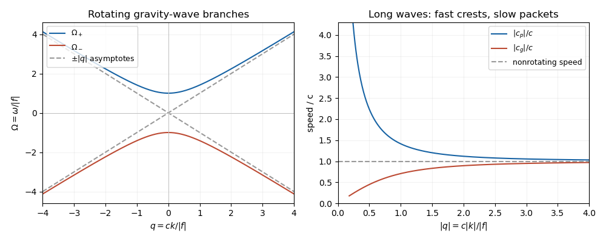

# Paper 4

↑ **Parent:** [Ib](../ib.md)

[https://www.maths.cam.ac.uk/undergrad/pastpapers/files/2017/paperib_4_1.pdf](https://www.maths.cam.ac.uk/undergrad/pastpapers/files/2017/paperib_4_1.pdf)

**Table of contents**

- [1F](#1f)
  - [Solution](#1f/solution)
- [2E](#2e)
  - [Solution](#2e/solution)
- [3G](#3g)
  - [Solution](#3g/solution)
- [4F](#4f)
  - [Solution](#4f/solution)
- [5A](#5a)
  - [i](#5a/i)
    - [Solution](#5a/i/solution)
  - [ii](#5a/ii)
    - [Solution](#5a/ii/solution)
  - [iii](#5a/iii)
    - [Solution](#5a/iii/solution)
- [6B](#6b)
  - [a](#6b/a)
    - [Solution](#6b/a/solution)
  - [b](#6b/b)
    - [Solution](#6b/b/solution)
- [7C](#7c)
  - [Solution](#7c/solution)
- [8C](#8c)
  - [Solution](#8c/solution)
- [9H](#9h)
  - [Solution](#9h/solution)
- [10F](#10f)
  - [Solution](#10f/solution)
- [11E](#11e)
  - [a](#11e/a)
    - [Solution](#11e/a/solution)
  - [b](#11e/b)
    - [Solution](#11e/b/solution)
- [12G](#12g)
  - [Solution](#12g/solution)
- [13E](#13e)
  - [a](#13e/a)
    - [Solution](#13e/a/solution)
  - [b](#13e/b)
    - [i](#13e/b/i)
      - [Solution](#13e/b/i/solution)
    - [ii](#13e/b/ii)
      - [Solution](#13e/b/ii/solution)
- [14A](#14a)
  - [Solution](#14a/solution)
- [15G](#15g)
  - [Solution](#15g/solution)
- [16D](#16d)
  - [Solution](#16d/solution)
- [17B](#17b)
  - [a](#17b/a)
    - [i](#17b/a/i)
      - [Solution](#17b/a/i/solution)
    - [ii](#17b/a/ii)
      - [Solution](#17b/a/ii/solution)
  - [b](#17b/b)
    - [Solution](#17b/b/solution)
- [18D](#18d)
  - [Solution](#18d/solution)
- [19H](#19h)
  - [a](#19h/a)
    - [Solution](#19h/a/solution)
  - [b](#19h/b)
    - [Solution](#19h/b/solution)
- [20H](#20h)
  - [a](#20h/a)
    - [Solution](#20h/a/solution)
  - [b](#20h/b)
    - [Solution](#20h/b/solution)
  - [c](#20h/c)
    - [Solution](#20h/c/solution)
  - [d](#20h/d)
    - [Solution](#20h/d/solution)

## 1F

↑ **Parent:** [Paper 4](paper-4.md)

<h3 id="1f/solution">Solution</h3>

↑ **Parent:** [1F](#1f)

For a [basis](../../../vector-space.md#basis) $v_1,\ldots,v_d$ of the [real vector space](../../../vector-space.md#real-vector-space) $V$, the [Gram-Schmidt process](../../../linear-algebra.md#gram-schmidt-process) constructs an [orthonormal basis](../../../linear-algebra.md#orthonormal-basis) successively:

$$
w_j=v_j-\sum_{i<j}\langle v_j,e_i\rangle e_i,\qquad e_j=\frac{w_j}{\sqrt{\langle w_j,w_j\rangle}}.
$$

The [inner product](../../../linear-algebra.md#inner-product) makes $w_j$ [orthogonal](../../../linear-algebra.md#orthogonal-vectors) to all earlier $e_i$. Moreover $w_j\ne0$, since otherwise $v_j$ would be a [linear combination](../../../vector-space.md#linear-combination) of its predecessors, contrary to [linear independence](../../../vector-space.md#linear-independence). Induction gives $\operatorname{span}(e_1,\ldots,e_j)=\operatorname{span}(v_1,\ldots,v_j)$. Starting with a [basis](../../../vector-space.md#basis) of a [linear subspace](../../../vector-space.md#vector-subspace) $U$ and extending it to a [basis](../../../vector-space.md#basis) of $V$ gives the same construction with the first $r=\dim U$ vectors spanning $U$.

The [orthogonal complement](../../../hilbert-space.md#orthogonal-complement) is $U^\perp=\{v\in V:\langle v,u\rangle=0\text{ for every }u\in U\}$. For every $v\in V$, set $u=\sum_{i=1}^r\langle v,e_i\rangle e_i$. Then $u\in U$ and $v-u\in U^\perp$. If $w\in U\cap U^\perp$, then $\langle w,w\rangle=0$, so $w=0$ by definiteness of the [inner product](../../../linear-algebra.md#inner-product). Thus the [direct sum](../../../vector-space.md#direct-sum) is

$$
\boxed{V=U\oplus U^\perp}.
$$

This also covers $U=0$ and $U=V$.

For the [polynomial](../../../polynomial.md) space, the form is immediately a [symmetric bilinear form](../../../linear-algebra.md#symmetric-bilinear-form), and $(f,f)=f(1)^2+f(2)^2+f(3)^2\geq0$. A nonzero [polynomial](../../../polynomial.md) of [degree of a polynomial](../../../polynomial.md#degree-of-a-polynomial) at most two cannot have three distinct [roots of a polynomial](../../../polynomial.md#root-of-a-polynomial), so this form is an [inner product](../../../linear-algebra.md#inner-product) for $n=1,2$. For $n\geq3$, the nonzero [polynomial](../../../polynomial.md) $(x-1)(x-2)(x-3)$ has $(f,f)=0$. Therefore, among the stipulated positive [integers](../../../number-theory.md#integer),

$$
\boxed{n\in\{1,2\}}.
$$

## 2E

↑ **Parent:** [Paper 4](paper-4.md)

<h3 id="2e/solution">Solution</h3>

↑ **Parent:** [2E](#2e)

Use the [class equation](../../../group-theory.md#class-equation) for the action of $G$ on itself by [conjugation](../../../group-theory.md#conjugation):

$$
|G|=|Z(G)|+\sum_j[G:C_G(g_j)],
$$

where the sum runs over noncentral [conjugacy classes](../../../group-theory.md#conjugacy-class). By [Lagrange's theorem](../../../group-theory.md#lagrange-s-theorem), each noncentral class has size a positive power of $p$ greater than one. Thus $|Z(G)|\equiv |G|\equiv0\pmod p$. Since the [identity element](../../../group.md#identity-element) belongs to the [center of a group](../../../group-theory.md#center-of-a-group),

$$
\boxed{|Z(G)|\geq p>1}.
$$

For $|G|=p^3$, the possible orders of the [center of a group](../../../group-theory.md#center-of-a-group) are $p,p^2,p^3$. Order $p^3$ would make $G$ an [abelian group](../../../group.md#abelian-group). Order $p^2$ would make the [quotient group](../../../group-theory.md#quotient-group) $G/Z(G)$ have prime order and hence be a [cyclic group](../../../group.md#cyclic-group). But a [cyclic quotient by the center](../../../group-theory.md#cyclic-quotient-by-the-center) forces $G$ to be [Abelian](../../../group.md#abelian-group): if $gZ(G)$ generates the quotient, any two elements are $g^a z$ and $g^b w$ with $z,w\in Z(G)$, and their products commute. Both larger orders contradict the hypothesis. Consequently

$$
\boxed{|Z(G)|=p}.
$$

## 3G

↑ **Parent:** [Paper 4](paper-4.md)

<h3 id="3g/solution">Solution</h3>

↑ **Parent:** [3G](#3g)

The [chain rule](../../../calculus.md#chain-rule) for [Fréchet derivatives](../../../calculus.md#frechet-derivative) states that if $f$ is [differentiable](../../../analysis.md#differentiable-function) at $a$ and $g$ is [differentiable](../../../analysis.md#differentiable-function) at $f(a)$, then

$$
\boxed{D(g\circ f)_a=Dg_{f(a)}\circ Df_a}.
$$

The composition on the right is a composition of [linear maps](../../../vector-space.md#linear-map), equivalently a product of [Jacobian matrices](../../../calculus.md#jacobian-matrix) in coordinates.

Apply the [chain rule](../../../calculus.md#chain-rule) to the [affine function](../../../vector-space.md#affine-function) $x\mapsto(x,c-x)$. The resulting [derivative](../../../calculus.md#derivative) is

$$
\boxed{g_c'(x)=f_x(x,c-x)-f_y(x,c-x)}.
$$

If the two [partial derivatives](../../../calculus.md#partial-derivative) agree everywhere, $g_c'=0$. The [mean value theorem](../../../calculus.md#mean-value-theorem) makes $g_c$ constant on $\mathbb R$. Define $h(c)=f(c,0)$, which is itself [differentiable](../../../analysis.md#differentiable-function) by the [chain rule](../../../calculus.md#chain-rule). Taking $c=x+y$ gives $g_c(x)=g_c(c)=h(c)$, and therefore

$$
\boxed{f(x,y)=h(x+y)}.
$$

No [continuity](../../../calculus.md#continuous-function) of the [partial derivatives](../../../calculus.md#partial-derivative) beyond the assumed [differentiability](../../../analysis.md#differentiability) is needed.

## 4F

↑ **Parent:** [Paper 4](paper-4.md)

<h3 id="4f/solution">Solution</h3>

↑ **Parent:** [4F](#4f)

Choose a star centre $a$ of the open [star-shaped set](../../../algebra.md#star-shaped-set) $D$ and define the candidate [antiderivative](../../../calculus.md#antiderivative) by a straight-segment [contour integral](../../../complex-analysis.md#contour-integral):

$$
F(z)=\int_{[a,z]}f(\zeta)\,d\zeta.
$$

For each fixed $z\in D$ and all sufficiently small $h$, the filled [triangle](../../../geometry-and-topology.md#triangle) with vertices $a,z,z+h$ lies in $D$. Indeed, the [compact](../../../topology.md#compact-space) segment $[a,z]$ has a neighbourhood of some positive radius contained in the open set $D$, and every point of this [triangle](../../../geometry-and-topology.md#triangle) lies within $|h|$ of that segment. The zero [triangle](../../../geometry-and-topology.md#triangle) integral consequently gives

$$
F(z+h)-F(z)=\int_{[z,z+h]}f(\zeta)\,d\zeta
=h\int_0^1f(z+th)\,dt.
$$

By [continuity](../../../calculus.md#continuous-function), the last integral tends to $f(z)$ as $h\to0$. Hence

$$
\boxed{F'(z)=f(z)\quad(z\in D)}.
$$

In particular, this proves the existence of the [antiderivative](../../../calculus.md#antiderivative) without incorrectly assuming the [star-shaped set](../../../algebra.md#star-shaped-set) is [convex](../../../real-analysis.md#convex-function).

On a general [domain](../../../topology.md#domain-mathematical-analysis), **the conclusion can fail**. Take $D=\mathbb C\setminus\{0\}$ and $f(z)=1/z$. Every filled [triangle](../../../geometry-and-topology.md#triangle) contained in $D$ has zero boundary integral by [Cauchy integral theorem](../../../complex-analysis.md#cauchy-s-integral-theorem), but the unit [circle](../../../topology.md#circle) has integral $2\pi i$. An [antiderivative](../../../calculus.md#antiderivative) would make every closed [contour integral](../../../complex-analysis.md#contour-integral) zero. This is the [period obstruction to a holomorphic antiderivative](../../../complex-analysis.md#period-obstruction-to-a-holomorphic-antiderivative): the local conclusion of [Morera's theorem](../../../complex-analysis.md#morera-s-theorem) does not remove the global obstruction.

## 5A

↑ **Parent:** [Paper 4](paper-4.md)

<h3 id="5a/i">i</h3>

↑ **Parent:** [5A](#5a)

<h4 id="5a/i/solution">Solution</h4>

↑ **Parent:** [I](#5a/i)

The original PDF contains this subpart; the local TeX has omitted it. Write $a_n$ for the [leading coefficient](../../../polynomial.md#leading-coefficient-of-a-polynomial) of $P_n$. The [Legendre polynomial recurrence relation](../../../differential-equation.md#legendre-polynomial-recurrence-relation) and the starting [polynomials](../../../polynomial.md) give $a_0=a_1=1$, and induction gives

$$
a_{n+1}=\frac{2n+1}{n+1}a_n>0.
$$

Indeed, $xP_n$ has [degree of a polynomial](../../../polynomial.md#degree-of-a-polynomial) $n+1$, while $P_{n-1}$ has smaller [degree of a polynomial](../../../polynomial.md#degree-of-a-polynomial) and cannot cancel its leading term. Hence

$$
\boxed{\deg P_n=n}.
$$

At $x=1$, the same [linear recurrence relation](../../../algebra.md#linear-recurrence-relation) gives $(n+1)P_{n+1}(1)=(2n+1)P_n(1)-nP_{n-1}(1)$. Starting from $P_0(1)=P_1(1)=1$, induction yields

$$
\boxed{P_n(1)=1\quad(n\geq0)}.
$$

<h3 id="5a/ii">ii</h3>

↑ **Parent:** [5A](#5a)

<h4 id="5a/ii/solution">Solution</h4>

↑ **Parent:** [Ii](#5a/ii)

This subpart is also present in the original PDF but missing from the local TeX. Put $p(x)=1-x^2$ and $\lambda_n=n(n+1)$. Multiply the [Legendre differential equation](../../../differential-equation.md#legendre-differential-equation) for $P_n$ by $P_m$, multiply the equation for $P_m$ by $P_n$, and subtract. The [product rule](../../../calculus.md#product-rule) gives

$$
\frac{d}{dx}\bigl[p(P_mP_n'-P_nP_m')\bigr]
+(\lambda_n-\lambda_m)P_nP_m=0.
$$

Integrating from $-1$ to $1$, the boundary term vanishes: $p(\pm1)=0$, and the [Legendre polynomials](../../../differential-equation.md#legendre-polynomial) and their [derivatives](../../../calculus.md#derivative) are finite there. For distinct nonnegative [integers](../../../number-theory.md#integer) $m,n$, $\lambda_m\ne\lambda_n$. Thus the [Orthogonality of Legendre polynomials](../../../differential-equation.md#orthogonality-of-legendre-polynomials) is

$$
\boxed{\int_{-1}^1P_m(x)P_n(x)\,dx=0\quad(m\ne n)}.
$$

The vanishing coefficient at the endpoints causes no difficulty here because the solutions are [polynomials](../../../polynomial.md).

<h3 id="5a/iii">iii</h3>

↑ **Parent:** [5A](#5a)

<h4 id="5a/iii/solution">Solution</h4>

↑ **Parent:** [Iii](#5a/iii)

Evaluate $R_n$ at $x=1$ using $(x^2-1)^n=(x-1)^n(x+1)^n$. In the [Leibniz rule](../../../calculus.md#leibniz-rule) for the $n$th [derivative](../../../calculus.md#derivative), every term vanishes at $1$ except the term putting all $n$ [derivatives](../../../calculus.md#derivative) on $(x-1)^n$. Therefore $R_n(1)=n!2^n$. Combining this with $P_n(1)=1$ gives the normalisation in the [Rodrigues' formula](../../../linear-operator-theory.md#rodrigues-formula):

$$
\boxed{\alpha_n=\frac1{2^n n!},\qquad P_n(x)=\frac1{2^n n!}\frac{d^n}{dx^n}(x^2-1)^n}.
$$

For $n=0$, the formula gives $\alpha_0=1$, as required. As an independent check, the leading term of $R_n$ is $(2n)!x^n/n!$, so the resulting [leading coefficient](../../../polynomial.md#leading-coefficient-of-a-polynomial) of $P_n$ is $(2n)!/(2^n(n!)^2)$, consistent with the [Legendre polynomial recurrence relation](../../../differential-equation.md#legendre-polynomial-recurrence-relation).

## 6B

↑ **Parent:** [Paper 4](paper-4.md)

<h3 id="6b/a">a</h3>

↑ **Parent:** [6B](#6b)

<h4 id="6b/a/solution">Solution</h4>

↑ **Parent:** [A](#6b/a)

The [wavefunction](../../../quantum-mechanics.md#wave-function) is a [plane wave](../../../quantum-mechanics.md#plane-wave) and a simultaneous formal [eigenfunction](../../../linear-operator-theory.md#eigenfunction) of the [momentum operator](../../../quantum-mechanics.md#momentum-operator) and the time-translation energy operator:

$$
-i\hbar\partial_x\phi=\hbar k\phi,\qquad i\hbar\partial_t\phi=E\phi.
$$

Its [momentum](../../../classical-mechanics.md#momentum) and [energy](../../../classical-mechanics.md#energy) are therefore definite, while its [probability density](../../../quantum-mechanics.md#probability-density) is spatially uniform:

$$
\boxed{p=\hbar k,\qquad \mathcal E=E,\qquad |\phi|^2=A^2}.
$$

For a particle of mass $m$, the [probability current](../../../quantum-mechanics.md#probability-current) is $j=(\hbar/m)\operatorname{Im}(\overline\phi\,\partial_x\phi)=\hbar kA^2/m$, directed according to the sign of $k$.

On the whole [real line](../../../real-analysis.md#real-line), a nonzero constant-amplitude [plane wave](../../../quantum-mechanics.md#plane-wave) is not [square-integrable](../../../measure-theory.md#square-integrable-function) and cannot be normalised to total [probability](../../../probability-theory.md#probability) one. It represents an idealised [momentum eigenstate](../../../quantum-mechanics.md#momentum-eigenstate), interpreted through [generalized eigenfunctions](../../../linear-operator-theory.md#generalized-eigenfunction) or as a limit of [wave packets](../../../wave-equation.md#wave-packet). Also, arbitrary $k,E$ do not automatically solve the [Schrödinger equation](../../../physics.md#schrodinger-equation) for a specified [potential energy](../../../classical-mechanics.md#potential-energy): for a free particle, $E=\hbar^2k^2/(2m)$, or this value plus the constant [potential energy](../../../classical-mechanics.md#potential-energy) for a constant-potential region. If $A=0$, the zero function is not a physical quantum state.

<h3 id="6b/b">b</h3>

↑ **Parent:** [6B](#6b)

<h4 id="6b/b/solution">Solution</h4>

↑ **Parent:** [B](#6b/b)

For a finite [potential energy](../../../classical-mechanics.md#potential-energy) discontinuity, the [stationary state](../../../quantum-mechanics.md#stationary-state) $\psi$ and its first [derivative](../../../calculus.md#derivative) are [continuous](../../../calculus.md#continuous-function) at $a$. Integrating the [Time-independent Schrödinger equation](../../../physics.md#time-independent-schrodinger-equation) across a shrinking interval about $a$ gives continuity of $\psi'$; a jump in $\psi$ would produce a [distributional derivative](../../../distribution-theory.md#distributional-derivative) incompatible with a finite [potential energy](../../../classical-mechanics.md#potential-energy).

For $E>V_0$, put $k=\sqrt{2mE}/\hbar$, $q=\sqrt{2m(E-V_0)}/\hbar$ and use unit incident amplitude:

$$
\psi(x)=\begin{cases}e^{ik(x-a)}+r e^{-ik(x-a)},&x<a,\\t e^{iq(x-a)},&x>a.\end{cases}
$$

There is no wave incident from the right. The matching equations $1+r=t$, $k(1-r)=qt$ give $r=(k-q)/(k+q)$ and $t=2k/(k+q)$. Comparing reflected and incident [probability currents](../../../quantum-mechanics.md#probability-current) gives the [reflection coefficient](../../../partial-differential-equation.md#reflection-coefficient)

$$
\boxed{R(E)=\left(\frac{\sqrt E-\sqrt{E-V_0}}{\sqrt E+\sqrt{E-V_0}}\right)^2\quad(E>V_0)}.
$$

The transmitted fraction is $T=(q/k)|t|^2=4kq/(k+q)^2$, so $R+T=1$.

For $0<E<V_0$, write $\kappa=\sqrt{2m(V_0-E)}/\hbar$ and retain only the decaying right-hand solution $t e^{-\kappa(x-a)}$. Matching gives $r=(k-i\kappa)/(k+i\kappa)$, which has modulus one. The [evanescent wave](../../../continuum-mechanics.md#evanescent-wave) carries no transmitted [probability current](../../../quantum-mechanics.md#probability-current). At $E=V_0$, the bounded right-hand solution is constant and matching again gives $r=1$. Thus

$$
\boxed{R(E)=1\quad(0<E\leq V_0)}.
$$

Classically, a particle is wholly transmitted for $E>V_0$ and wholly reflected for $E<V_0$; there is no classical partial reflection above the step. At the threshold it has zero right-hand speed and no transmitted flux, a marginal case requiring a convention about motion exactly on the discontinuity. The quantum result approaches $R=0$ as $E/V_0\to\infty$.

## 7C

↑ **Parent:** [Paper 4](paper-4.md)

<h3 id="7c/solution">Solution</h3>

↑ **Parent:** [7C](#7c)

Choose an origin near the bounded loop and write $\mathbf r'$ for the source position. The [magnetic vector potential](../../../electromagnetism.md#magnetic-vector-potential) and its far-field [multipole expansion](../../../electromagnetism.md#electric-multipole-expansion) are

$$
\mathbf A(\mathbf r)=\frac{\mu_0 I}{4\pi}\oint_C\frac{d\mathbf r'}{|\mathbf r-\mathbf r'|},\qquad
\frac1{|\mathbf r-\mathbf r'|}=\frac1r+\frac{\mathbf r\cdot\mathbf r'}{r^3}+O(r^{-3}),
$$

with the loop held fixed as $r=|\mathbf r|\to\infty$. The first term integrates to zero since $C$ is closed. Define its oriented [vector area](../../../differential-geometry.md#vector-area) by

$$
\mathbf S=\frac12\oint_C\mathbf r'\times d\mathbf r'=\int_\Sigma\mathbf n\,dS.
$$

The second equality is [Stokes theorem](../../../calculus.md#stokes-theorem), applied componentwise to any oriented spanning surface. In particular the [vector area](../../../differential-geometry.md#vector-area) is independent of the choice of spanning surface. From $\oint_C d(r'_i r'_j)=0$, the matrix $\oint_C r'_i\,dr'_j$ is antisymmetric, which gives $\oint_C(\mathbf r\cdot\mathbf r')d\mathbf r'=\mathbf S\times\mathbf r$. Hence

$$
\boxed{\mathbf m=I\mathbf S,\qquad \mathbf A(\mathbf r)=\frac{\mu_0}{4\pi}\frac{\mathbf m\times\mathbf r}{r^3}+O(r^{-3})}.
$$

The orientation follows the current by the [right-hand rule](../../../electromagnetism.md#right-hand-rule). For $r\ne0$, taking the [curl](../../../calculus.md#curl) of this leading [magnetic vector potential](../../../electromagnetism.md#magnetic-vector-potential) gives the [magnetic dipole field](../../../electromagnetism.md#magnetic-dipole-field)

$$
\boxed{\mathbf B(\mathbf r)=\frac{\mu_0}{4\pi}\left(\frac{3(\mathbf m\cdot\mathbf r)\mathbf r}{r^5}-\frac{\mathbf m}{r^3}\right)+O(r^{-4})}.
$$

For a planar loop, $\mathbf S$ is the signed area times the unit [normal vector](../../../differential-geometry.md#normal-vector). For a nonplanar loop it is the oriented [vector area](../../../differential-geometry.md#vector-area), rather than the scalar area of an arbitrarily chosen surface.

## 8C

↑ **Parent:** [Paper 4](paper-4.md)

<h3 id="8c/solution">Solution</h3>

↑ **Parent:** [8C](#8c)

The successive differences of the constant entries give a simple [LDL decomposition](../../../numerical-analysis.md#ldl-decomposition):

$$
\boxed{L=\begin{pmatrix}1&0&0&0\\1&1&0&0\\1&1&1&0\\1&1&1&1\end{pmatrix},\qquad
D=\operatorname{diag}(1,4,9,\lambda-14),\qquad A=LDL^T}.
$$

For example, entry $(i,j)$ of $LDL^T$ is the sum of the first $\min(i,j)$ entries of $D$, directly verifying every entry of $A$. Because $L$ is an [invertible matrix](../../../linear-algebra.md#invertible-matrix), $x^TAx=(L^Tx)^TD(L^Tx)$ is strictly positive for every nonzero [vector](../../../vector-space.md#vector) exactly when every diagonal entry of $D$ is positive. Consequently

$$
\boxed{A\text{ is positive definite}\iff\lambda>14}.
$$

At $\lambda=14$ it is a [positive semidefinite matrix](../../../linear-algebra.md#positive-semidefinite-matrix) and singular; for $\lambda<14$ its [quadratic form](../../../linear-algebra.md#quadratic-form) takes both positive and negative values.

When $\lambda=30$, taking positive square roots of $D$ yields the [Cholesky decomposition](../../../linear-algebra.md#cholesky-decomposition)

$$
\boxed{A=CC^T,\qquad C=L\operatorname{diag}(1,2,3,4)=\begin{pmatrix}1&0&0&0\\1&2&0&0\\1&2&3&0\\1&2&3&4\end{pmatrix}}.
$$

## 9H

↑ **Parent:** [Paper 4](paper-4.md)

<h3 id="9h/solution">Solution</h3>

↑ **Parent:** [9H](#9h)

Let $S_0=0$ and let each increment of the [simple symmetric random walk](../../../probability-theory.md#simple-symmetric-random-walk) be uniformly chosen from $\{\pm e_1,\pm e_2,\pm e_3\}$. A return requires an even number of steps. In $2n$ steps returning to zero, let $a,b,c$ be the respective numbers of positive steps in the three directions; there must also be $a,b,c$ negative steps, so $a+b+c=n$. Counting step sequences gives

$$
u_{2n}:=\mathbb P_0(S_{2n}=0)=\frac{(2n)!}{6^{2n}}\sum_{a+b+c=n}\frac1{a!^2b!^2c!^2}
=\frac{\binom{2n}{n}}{4^n}\sum_{a+b+c=n}\left(\frac{n!}{3^na!b!c!}\right)^2.
$$

The terms $p_{abc}=n!/(3^na!b!c!)$ form a [multinomial distribution](../../../discrete-probability-distribution.md#multinomial-distribution), so $\sum p_{abc}^2\leq(\max p_{abc})\sum p_{abc}=\max p_{abc}$. The permitted combinatorial inequalities give $\binom{2n}{n}/4^n\leq C_1n^{-1/2}$ and $\max_{a+b+c=n}p_{abc}\leq C_2/n$ for $n\geq1$. The second bound also follows by noting that the largest [multinomial coefficient](../../../combinatorics.md#multinomial-coefficient) occurs when $a,b,c$ differ by at most one and then applying [Stirling formula](../../../real-analysis.md#stirling-formula). Thus

$$
\boxed{u_{2n}\leq Cn^{-3/2},\qquad u_{2n+1}=0,\qquad \sum_{j\geq0}\mathbb P_0(S_j=0)<\infty}.
$$

To prove the origin is a [transient state](../../../markov-process.md#transient-state), let $q$ be the [probability](../../../probability-theory.md#probability) of at least one return after time zero. The [Strong Markov property](../../../markov-process.md#strong-markov-property) at successive returns gives $\mathbb P(N\geq k)=q^k$ for the number $N$ of later returns. Therefore $\mathbb E(N+1)=\sum_j u_j$ would be infinite if $q=1$. The bound forces $q<1$, proving that the origin is a [transient state](../../../markov-process.md#transient-state). Translation invariance gives the same conclusion at every lattice point. The coordinate walks need not be treated as independent; the counting via [multinomial coefficients](../../../combinatorics.md#multinomial-coefficient) already incorporates their dependence.

## 10F

↑ **Parent:** [Paper 4](paper-4.md)

<h3 id="10f/solution">Solution</h3>

↑ **Parent:** [10F](#10f)

The [dual space](../../../linear-algebra.md#dual-space) here is the algebraic [dual space](../../../linear-algebra.md#dual-space) $X^*=\operatorname{Hom}_{\mathbb R}(X,\mathbb R)$, consisting of every [linear functional](../../../linear-algebra.md#linear-functional); no [topology](../../../topology.md) or boundedness is imposed. For a [basis](../../../vector-space.md#basis) $e_1,\ldots,e_n$, define $e_i^*(\sum_jx_je_j)=x_i$. These are [linear functionals](../../../linear-algebra.md#linear-functional) satisfying $e_i^*(e_j)=\delta_{ij}$. Evaluating $\sum_i a_ie_i^*=0$ on each $e_j$ gives $a_j=0$, proving [linear independence](../../../vector-space.md#linear-independence). Conversely, for every $T\in X^*$,

$$
T=\sum_{i=1}^nT(e_i)e_i^*.
$$

This proves spanning and hence proves, without assuming a dimension theorem, that the [dual basis](../../../linear-algebra.md#dual-basis) is a [basis](../../../vector-space.md#basis) and $\dim X^*=n$.

The canonical [bidual evaluation map](../../../linear-algebra.md#bidual-evaluation-map) is

$$
\boxed{J:X\longrightarrow X^{**},\qquad J(x)(T)=T(x)}.
$$

Its definition makes no choice of [basis](../../../vector-space.md#basis) and it is [linear](../../../vector-space.md#linearity). If $x\ne0$, one coordinate functional is nonzero on $x$, so $J$ is [injective](../../../algebra.md#injective-function). For any $B\in X^{**}$, choose $x=\sum_iB(e_i^*)e_i$. Expanding $T$ in the [dual basis](../../../linear-algebra.md#dual-basis) gives $T(x)=\sum_iT(e_i)B(e_i^*)=B(T)$, proving [surjection](../../../algebra.md#surjective-function) explicitly. Thus $J$ is an [isomorphism](../../../algebra.md#isomorphism).

If $T_1,\ldots,T_n$ is any [basis](../../../vector-space.md#basis) of $X^*$, its [dual basis](../../../linear-algebra.md#dual-basis) $B_1,\ldots,B_n$ in $X^{**}$ exists by the result just proved. Put $v_j=J^{-1}(B_j)$. These vectors form a [basis](../../../vector-space.md#basis) of $X$, and $T_i(v_j)=B_j(T_i)=\delta_{ij}$. **Every [basis](../../../vector-space.md#basis) of the finite-dimensional dual is a dual [basis](../../../vector-space.md#basis)**, of a uniquely determined [basis](../../../vector-space.md#basis) of $X$.

For a [separating subspace of an algebraic dual](../../../linear-algebra.md#separating-subspace-of-an-algebraic-dual) $W$, choose a [basis](../../../vector-space.md#basis) $T_1,\ldots,T_r$ of $W$. The [linear map](../../../vector-space.md#linear-map) $x\mapsto(T_1(x),\ldots,T_r(x))$ is [injective](../../../algebra.md#injective-function) because $W$ separates nonzero vectors. The [rank-nullity theorem](../../../linear-algebra.md#rank-nullity-theorem) implies $n\leq r$; but $W\subseteq X^*$ implies $r\leq n$. Hence

$$
\boxed{W=X^*}.
$$

The zero-dimensional case also has this conclusion.

For $X=\mathbb R[x]$, the [monomials](../../../polynomial.md#monomial) $1,x,x^2,\ldots$ form an infinite [basis](../../../vector-space.md#basis), each [polynomial](../../../polynomial.md) using only finitely many of them. The map $T\mapsto(T(1),T(x),T(x^2),\ldots)$ identifies $X^*$ with all real [sequences](../../../real-analysis.md#sequence), because any sequence $(a_j)$ defines $T(\sum_{j=0}^d c_jx^j)=\sum_{j=0}^dc_ja_j$. The [linear subspace](../../../vector-space.md#vector-subspace) of finitely supported sequences is proper (it excludes $(1,1,\ldots)$) and separating (one coefficient functional detects any nonzero [polynomial](../../../polynomial.md)). Thus

$$
\boxed{\mathbb R^{(\mathbb N_0)}\subsetneq\mathbb R^{\mathbb N_0}\cong X^*\text{ is separating}}.
$$

## 11E

↑ **Parent:** [Paper 4](paper-4.md)

<h3 id="11e/a">a</h3>

↑ **Parent:** [11E](#11e)

<h4 id="11e/a/solution">Solution</h4>

↑ **Parent:** [A](#11e/a)

The [structure theorem for finitely generated modules over a principal ideal domain](../../../module-theory.md#structure-theorem-for-finitely-generated-modules-over-a-principal-ideal-domain) applies in particular to a [Euclidean domain](../../../commutative-algebra.md#euclidean-domain) $R$: every [finitely generated module](../../../module-theory.md#finitely-generated-module) has an [isomorphism](../../../algebra.md#isomorphism)

$$
M\cong R^r\oplus R/(d_1)\oplus\cdots\oplus R/(d_k),\qquad d_1\mid d_2\mid\cdots\mid d_k,
$$

with each $d_i$ nonzero and a nonunit. The [rank of a free module](../../../module-theory.md#rank-of-a-free-module) $r$ and the [invariant factors of a finitely generated module](../../../module-theory.md#invariant-factor-of-a-finitely-generated-module) $d_i$ are unique up to multiplication by units; empty sums are allowed. This is the classification theorem being used, without a proof of that theorem.

The [rational canonical form](../../../linear-operator-theory.md#rational-canonical-form) theorem states that for a [linear operator](../../../vector-space.md#linear-operator) $T$ on a finite-dimensional [vector space](../../../vector-space.md) over any [field](../../../algebra.md#field) $F$, there are unique monic nonconstant [polynomials](../../../polynomial.md) $p_1\mid\cdots\mid p_k$ such that some [basis](../../../vector-space.md#basis) gives

$$
\boxed{[T]=\operatorname{diag}(C(p_1),\ldots,C(p_k))}.
$$

Here, for $p(t)=t^d+a_{d-1}t^{d-1}+\cdots+a_0$, the [companion matrix](../../../linear-operator-theory.md#companion-matrix) has ones on its subdiagonal and last column $(-a_0,\ldots,-a_{d-1})^T$. The empty matrix covers a zero-dimensional space. Two [linear operators](../../../vector-space.md#linear-operator) have [matrix similarity](../../../linear-algebra.md#matrix-similarity) exactly when they have the same [invariant factors of a linear operator](../../../linear-operator-theory.md#invariant-factors-of-a-linear-operator).

For the proof, make $V$ an $F[t]$-[module](../../../module-theory.md#module-mathematics) by $t\cdot v=T(v)$. It is a [finitely generated module](../../../module-theory.md#finitely-generated-module), since a vector-space [basis](../../../vector-space.md#basis) also generates it as a [module](../../../module-theory.md#module-mathematics). It is a [torsion module](../../../module-theory.md#torsion-module): the powers of $T$ have [linear dependence](../../../vector-space.md#linear-dependence) in the finite-dimensional space $\operatorname{End}_F(V)$, so some nonzero [polynomial](../../../polynomial.md) annihilates every vector. Because $F[t]$ is a [Euclidean domain](../../../commutative-algebra.md#euclidean-domain), the classification theorem gives

$$
V\cong\bigoplus_{i=1}^kF[t]/(p_i),\qquad p_1\mid\cdots\mid p_k.
$$

There is no free summand, since a nonzero [free module](../../../module-theory.md#free-module) over $F[t]$ is not a [torsion module](../../../module-theory.md#torsion-module). Choose monic generators of the ideals. On $F[t]/(p_i)$, the classes of $1,t,\ldots,t^{d_i-1}$ form an $F$-[basis](../../../vector-space.md#basis) by [polynomial division](../../../polynomial.md#polynomial-division). Multiplication by $t$ is exactly $C(p_i)$ in that [basis](../../../vector-space.md#basis), proving existence. Uniqueness in the classification theorem proves uniqueness of the [rational canonical form](../../../linear-operator-theory.md#rational-canonical-form). Finally, an $F[t]$-[module isomorphism](../../../module-theory.md#module-isomorphism) is precisely an invertible $F$-[linear map](../../../vector-space.md#linear-map) intertwining the operators, establishing the assertion about [matrix similarity](../../../linear-algebra.md#matrix-similarity). In particular the [characteristic polynomial](../../../linear-operator-theory.md#characteristic-polynomial) is $\prod_i p_i$ and the [minimal polynomial](../../../linear-operator-theory.md#minimal-polynomial) is $p_k$ for nonzero $V$.

<h3 id="11e/b">b</h3>

↑ **Parent:** [11E](#11e)

<h4 id="11e/b/solution">Solution</h4>

↑ **Parent:** [B](#11e/b)

Induct on $n$ to prove the stronger assertion that any [submodule](../../../module-theory.md#submodule) $M\subseteq R^n$ is a [free module](../../../module-theory.md#free-module) of [rank of a free module](../../../module-theory.md#rank-of-a-free-module) at most $n$. For $n=0$ this is immediate. Project onto the first coordinate by $\pi:R^n\to R$. Its image $\pi(M)$ is an [ideal](../../../commutative-algebra.md#ideal) of the [principal ideal domain](../../../commutative-algebra.md#principal-ideal-domain), so $\pi(M)=(a)$.

If $a=0$, then $M$ embeds in the remaining $n-1$ coordinates and the induction hypothesis applies. Otherwise choose $v\in M$ with $\pi(v)=a$. Put $N=M\cap\ker\pi$, a [submodule](../../../module-theory.md#submodule) of $R^{n-1}$, which is free by induction. For every $m\in M$, there is $b\in R$ with $\pi(m)=ba$, so $m-bv\in N$. If $bv\in N$, then $ba=0$; the [integral domain](../../../commutative-algebra.md#integral-domain) property and $a\ne0$ give $b=0$. Therefore

$$
\boxed{M=Rv\oplus N\cong R\oplus N}.
$$

Appending $v$ to a [basis](../../../vector-space.md#basis) of $N$ proves that $M$ is a [free module](../../../module-theory.md#free-module) of [rank of a free module](../../../module-theory.md#rank-of-a-free-module) at most $n$. This proof of the [submodule theorem for free modules over a principal ideal domain](../../../commutative-algebra.md#submodule-theorem-for-free-modules-over-a-principal-ideal-domain) does not assume in advance that $M$ is a [finitely generated module](../../../module-theory.md#finitely-generated-module).

## 12G

↑ **Parent:** [Paper 4](paper-4.md)

<h3 id="12g/solution">Solution</h3>

↑ **Parent:** [12G](#12g)

A function $f:U\to\mathbb R^n$ has a [Fréchet derivative](../../../calculus.md#frechet-derivative) at $a\in U$ if there is a [linear map](../../../vector-space.md#linear-map) $A:\mathbb R^m\to\mathbb R^n$ such that

$$
\boxed{f(a+h)=f(a)+Ah+o(\|h\|)\quad(h\to0)}.
$$

The remainder condition is a limit in all directions at once, not merely the existence of [partial derivatives](../../../calculus.md#partial-derivative).

For the stated scalar two-variable result, fix $a=(a_1,a_2)$ and choose a small rectangle contained in the open set $U$. Split the increment into two coordinate segments. Applying the one-dimensional [mean value theorem](../../../calculus.md#mean-value-theorem) on each segment yields

$$
f(a_1+h,a_2+k)-f(a)
=h f_x(a_1+\theta h,a_2+k)+k f_y(a_1,a_2+\sigma k)
$$

for $\theta,\sigma\in(0,1)$, omitting a term if its increment is zero. Subtract $h f_x(a)+k f_y(a)$. By [continuity](../../../calculus.md#continuous-function) of the [partial derivatives](../../../calculus.md#partial-derivative), for any $\varepsilon>0$ the remainder has modulus at most $\varepsilon(|h|+|k|)\leq\sqrt2\varepsilon\sqrt{h^2+k^2}$ for sufficiently small increments. This proves [differentiability](../../../analysis.md#differentiability), with [Jacobian matrix](../../../calculus.md#jacobian-matrix) $(f_x(a),f_y(a))$.

Away from the origin the specified [rational function](../../../isolated-singularity.md#rational-function) has a nonzero denominator and is [smooth](../../../analysis.md#smooth-function). At the origin, $f(t,0)=t$ and $f(0,t)=2t^2$, so the [partial derivatives](../../../calculus.md#partial-derivative) are $f_x(0,0)=1$, $f_y(0,0)=0$. Any [Fréchet derivative](../../../calculus.md#frechet-derivative) there would therefore be $A(h,k)=h$. However,

$$
f(t,t)=\frac t2+t^2,\qquad
\frac{|f(t,t)-t|}{\sqrt2|t|}\longrightarrow\frac1{2\sqrt2}\ne0.
$$

Thus

$$
\boxed{f\text{ is differentiable exactly on }\mathbb R^2\setminus\{(0,0)\}}.
$$

The failure is not merely a failure of [continuity](../../../calculus.md#continuous-function): $|f(x,y)|\leq |x|+2y^2\to0$ at the origin, so the function is [continuous](../../../calculus.md#continuous-function) there.

## 13E

↑ **Parent:** [Paper 4](paper-4.md)

<h3 id="13e/a">a</h3>

↑ **Parent:** [13E](#13e)

<h4 id="13e/a/solution">Solution</h4>

↑ **Parent:** [A](#13e/a)

Let $\{O_i\}$ be an [open cover](../../../topology.md#open-cover) of $Z$ in its [subspace topology](../../../topology.md#subspace-topology). Write $O_i=Z\cap U_i$ with each $U_i$ open in $X$. Since $Z$ is a [closed set](../../../topology.md#closed-set), $X\setminus Z$ is open, and $\{U_i\}\cup\{X\setminus Z\}$ is an [open cover](../../../topology.md#open-cover) of the [compact space](../../../topology.md#compact-space) $X$. A finite subcover restricts to a finite subcover of $Z$. Hence **the closed subset $Z$ is compact**.

If $\{V_j\}$ is an [open cover](../../../topology.md#open-cover) of $f(Z)$ in its [subspace topology](../../../topology.md#subspace-topology), the inverse images under the restricted [continuous map](../../../topology.md#continuous-map) $f|_Z$ form an [open cover](../../../topology.md#open-cover) of $Z$. Take a finite subcover; the corresponding $V_j$ cover $f(Z)$. Thus **the [continuous](../../../calculus.md#continuous-function) image $f(Z)$ is compact**. Neither argument assumes a [Hausdorff space](../../../topology.md#hausdorff-space) or asserts that a [compact set](../../../topology.md#compact-space) must be [closed set](../../../topology.md#closed-set) in an arbitrary [topological space](../../../topology.md#topological-space).

<h3 id="13e/b">b</h3>

↑ **Parent:** [13E](#13e)

<h4 id="13e/b/i">i</h4>

↑ **Parent:** [B](#13e/b)

<h5 id="13e/b/i/solution">Solution</h5>

↑ **Parent:** [I](#13e/b/i)

The labels (i) and (ii) in the original PDF are hypotheses of one theorem, not separate requests. Here is the finite-cover step furnished by the [compact](../../../topology.md#compact-space) fibres. Start with any [open cover](../../../topology.md#open-cover) $\{U_i\}_{i\in I}$ of $f^{-1}(K)$, with the $U_i$ open in $X$ (a relative cover can be lifted to one of this form). For each $y\in K$, [compactness](../../../topology.md#compact-space) gives a finite set $I_y\subseteq I$ with

$$
f^{-1}(\{y\})\subseteq V_y:=\bigcup_{i\in I_y}U_i.
$$

An empty fibre needs no cover elements: take $I_y=\varnothing$ and $V_y=\varnothing$.

The complementary set $A_y=X\setminus V_y$ is [closed set](../../../topology.md#closed-set). By the [closed map](../../../topology.md#closed-map) hypothesis, its image is [closed set](../../../topology.md#closed-set), so

$$
W_y:=Y\setminus f(A_y)
$$

is open, contains $y$, and satisfies $f^{-1}(W_y)\subseteq V_y$. These open sets cover the [compact set](../../../topology.md#compact-space) $K$. Select finitely many, $W_{y_1},\ldots,W_{y_m}$. The finitely many original cover elements with indices in $I_{y_1}\cup\cdots\cup I_{y_m}$ then cover $f^{-1}(K)$. Therefore

$$
\boxed{f^{-1}(K)\text{ is compact}}.
$$

This proves the unheaded conclusion in the PDF as well as explaining the role of hypothesis (i). No [Hausdorff](../../../topology.md#hausdorff-space) assumption is needed for this [compact-preimage theorem for closed maps](../../../topology.md#compact-preimage-theorem-for-closed-maps).

<h4 id="13e/b/ii">ii</h4>

↑ **Parent:** [B](#13e/b)

<h5 id="13e/b/ii/solution">Solution</h5>

↑ **Parent:** [Ii](#13e/b/ii)

The decisive use of hypothesis (ii) is a neighbourhood construction: for any open $V\subseteq X$ containing a fibre $f^{-1}(\{y\})$, a [closed map](../../../topology.md#closed-map) gives

$$
\boxed{W=Y\setminus f(X\setminus V)\text{ open},\qquad y\in W,\qquad f^{-1}(W)\subseteq V}.
$$

Indeed, $X\setminus V$ is [closed set](../../../topology.md#closed-set), its image is [closed set](../../../topology.md#closed-set), and $y$ cannot be in that image. A point of $f^{-1}(W)$ cannot lie outside $V$. Applying this to the finite union covering each [compact](../../../topology.md#compact-space) fibre supplies a whole neighbourhood of that fibre's value using the same finitely many cover elements. [Compactness](../../../topology.md#compact-space) of $K$ selects finitely many such neighbourhoods and hence a finite subcover of $f^{-1}(K)$, proving the desired [compact-preimage theorem for closed maps](../../../topology.md#compact-preimage-theorem-for-closed-maps).

The [closed map](../../../topology.md#closed-map) assumption cannot simply be omitted. Give $X=\{0,1,2,\ldots\}$ the [discrete topology](../../../topology.md#discrete-space) and $Y=\{0\}\cup\{1/n:n\geq1\}$ the usual [subspace topology](../../../topology.md#subspace-topology) from $\mathbb R$. The bijection $f(0)=0$, $f(n)=1/n$ is [continuous](../../../calculus.md#continuous-function), and all its fibres are [compact](../../../topology.md#compact-space) singletons. But $Y$ is [compact](../../../topology.md#compact-space) whereas $f^{-1}(Y)=X$ is an infinite discrete space, which is not [compact](../../../topology.md#compact-space). The map is not [closed set](../../../topology.md#closed-set), since the closed subset $\{1,2,\ldots\}$ has image $\{1,1/2,\ldots\}$, missing its limit point $0$.

## 14A

↑ **Parent:** [Paper 4](paper-4.md)

<h3 id="14a/solution">Solution</h3>

↑ **Parent:** [14A](#14a)

The PDF specifies decay as $y\to\infty$; the local TeX drops this limit from its displayed boundary data. Take $a=4\pi$, so the [conformal map](../../../geometry-and-topology.md#conformal-map) is $w=\sin(z/4)$. Its components are

$$
\xi=\sin(x/4)\cosh(y/4),\qquad \eta=\cos(x/4)\sinh(y/4).
$$

For $-2\pi<x<2\pi$ and $y>0$, $\eta>0$. The bottom edge maps monotonically to $(-1,1)$, and the two vertical sides map to the real rays $(-\infty,-1)$ and $(1,\infty)$. The [derivative](../../../calculus.md#derivative) $\cos(z/4)/4$ never vanishes in the interior. Injectivity follows from the identities for equal sines: the alternatives $z_1/4=z_2/4+2\pi n$ and $z_1/4=\pi-z_2/4+2\pi n$ give only the identical point within this strip. Surjectivity can be seen directly: for fixed $\xi$ and $v=y/4>0$, solve $\sin(x/4)=\xi/\cosh v$; then

$$
\eta^2=\sinh^2v-\xi^2\tanh^2v.
$$

On $v>\max(0,\operatorname{arcosh}|\xi|)$, with the lower endpoint read as $0$ when $|\xi|\leq1$, the right side increases strictly from zero to infinity. Thus every point of the [upper half-plane](../../../complex-analysis.md#upper-half-plane-complex-analysis) has a unique preimage.

By [conformal invariance of harmonicity](../../../complex-analysis.md#conformal-invariance-of-harmonicity), write the transformed [harmonic function](../../../partial-differential-equation.md#harmonic-function) as $\Phi(\xi,\eta)$. Its real-axis boundary data are

$$
\boxed{F(s)=\begin{cases}f(4\arcsin s),&-1<s<1,\\0,&|s|>1.\end{cases}}
$$

The [inverse sine](../../../geometry-and-topology.md#inverse-sine) on $(-1,1)$ is its real principal branch. For bounded integrable data, take the [Fourier transform](../../../analysis.md#fourier-transform) convention $\widehat\Phi(k,\eta)=\int_\mathbb R\Phi(\xi,\eta)e^{-ik\xi}\,d\xi$. The [Laplace equation](../../../partial-differential-equation.md#laplace-equation) becomes $\widehat\Phi_{\eta\eta}-k^2\widehat\Phi=0$, with the bounded decaying solution $\widehat\Phi=\widehat F(k)e^{-|k|\eta}$. Inverting the [Fourier transform](../../../analysis.md#fourier-transform) gives

$$
\frac1{2\pi}\int_\mathbb Re^{ik u-|k|\eta}\,dk=\frac{\eta}{\pi(\eta^2+u^2)}.
$$

Consequently the [Poisson kernel for the upper half-plane](../../../partial-differential-equation.md#poisson-kernel-for-the-upper-half-plane) yields

$$
\boxed{\phi(x,y)=\Phi(\xi,\eta)=\frac{\eta}{\pi}\int_{-1}^1\frac{F(s)}{\eta^2+(\xi-s)^2}\,ds}.
$$

The decay is uniform across the strip: $|w|^2=\sin^2(x/4)+\sinh^2(y/4)\geq\sinh^2(y/4)$ and, for $|w|>1$, $|\Phi|\leq\|F\|_{L^1}|w|/(\pi(|w|-1)^2)\to0$. This verifies the printed decay condition. Boundary limits give the prescribed values at continuity points away from the corners.

For the given sine data,

$$
\boxed{F(s)=s\quad(-1<s<1),\qquad F(s)=0\quad(|s|>1)}.
$$

Values assigned at $s=\pm1$ do not alter the integral. **There is no solution [continuous](../../../calculus.md#continuous-function) on the entire closed half-strip for these data**: the bottom edge has corner limits $\pm1$, but the side edges have corner limits zero. The formula is the bounded [Dirichlet problem](../../../analysis.md#dirichlet-problem) solution with the specified limits away from those two corners. This is the usual interpretation of the printed problem; boundedness excludes additional boundary-singular [harmonic functions](../../../partial-differential-equation.md#harmonic-function), while decay alone without a regularity or boundedness condition does not establish uniqueness.

## 15G

↑ **Parent:** [Paper 4](paper-4.md)

<h3 id="15g/solution">Solution</h3>

↑ **Parent:** [15G](#15g)

Use curvature $-1$. In the [Poincare disc model](../../../geometry-and-topology.md#poincare-disk-model), [hyperbolic lines](../../../geometry-and-topology.md#hyperbolic-line) are Euclidean diameters and arcs of [circles](../../../topology.md#circle) orthogonal to the unit [circle](../../../topology.md#circle), with [hyperbolic length](../../../geometry-and-topology.md#hyperbolic-length-in-the-poincare-disc) element $ds=2|dz|/(1-|z|^2)$. In the [upper half-plane model](../../../geometry-and-topology.md#poincare-half-plane-model), they are vertical lines and semicircles with centres on the real axis, with $ds=|dz|/\operatorname{Im}z$. Both displayed [hyperbolic metrics](../../../geometry-and-topology.md#hyperbolic-metric) are positive scalar multiples of the Euclidean metric, so their [angles](../../../geometry-and-topology.md#angle) agree with Euclidean [angles](../../../geometry-and-topology.md#angle). The [hyperbolic distance](../../../geometry-and-topology.md#hyperbolic-distance) is the length of the joining [hyperbolic line](../../../geometry-and-topology.md#hyperbolic-line) segment; explicitly, in the [upper half-plane model](../../../geometry-and-topology.md#poincare-half-plane-model),

$$
\boxed{d(P,Q)=\operatorname{arcosh}\left(1+\frac{|P-Q|^2}{2\operatorname{Im}P\operatorname{Im}Q}\right)}.
$$

In the [Poincare disc model](../../../geometry-and-topology.md#poincare-disk-model) it is $2\operatorname{artanh}|(P-Q)/(1-\overline P Q)|$.

For distinct $P,Q$, a [isometry](../../../riemannian-geometry.md#isometry) sends their joining [hyperbolic line](../../../geometry-and-topology.md#hyperbolic-line) to the imaginary axis, so their images are $ip,iq$ with $p,q>0$. For any [continuously differentiable](../../../calculus.md#continuously-differentiable-function) curve $x(t)+iy(t)$ joining them,

$$
\ell(\gamma)=\int\frac{\sqrt{x'(t)^2+y'(t)^2}}{y(t)}\,dt
\geq\int\frac{|y'(t)|}{y(t)}\,dt
\geq|\log q-\log p|=d(P,Q).
$$

Equality in the first inequality requires $x'=0$ everywhere, because the nonnegative difference is [continuous](../../../calculus.md#continuous-function). Equality in the second requires $y'$ to have one sign, allowing zero intervals. Thus **equality holds precisely for a monotone reparametrisation of the joining hyperbolic segment**. Conversely every such reparametrisation gives equality. For $P=Q$, equality means length zero and the constant curve; monotonicity is understood non-strictly.

Two distinct [hyperbolic lines](../../../geometry-and-topology.md#hyperbolic-line) are [parallel hyperbolic lines](../../../geometry-and-topology.md#parallel-hyperbolic-lines) if they are disjoint in the plane and have exactly one common [ideal endpoint](../../../geometry-and-topology.md#ideal-endpoint); they are [ultraparallel hyperbolic lines](../../../geometry-and-topology.md#ultraparallel-hyperbolic-lines) if they are disjoint and have no common [ideal endpoint](../../../geometry-and-topology.md#ideal-endpoint). To prove the [common perpendicular of ultraparallel hyperbolic lines](../../../geometry-and-topology.md#common-perpendicular-of-ultraparallel-hyperbolic-lines) theorem, send one line to the imaginary axis. An [ultraparallel hyperbolic lines](../../../geometry-and-topology.md#ultraparallel-hyperbolic-lines) second line can, after reflection if necessary, be written as a semicircle with centre $c>0$ and radius $r$ satisfying $c>r$. A [hyperbolic line](../../../geometry-and-topology.md#hyperbolic-line) perpendicular to the imaginary axis must be a semicircle centred at zero, of some radius $R>0$. The Euclidean condition for its orthogonality to the second [circle](../../../topology.md#circle) is

$$
\boxed{R^2=c^2-r^2}.
$$

This has exactly one positive solution, proving existence and uniqueness. Conversely, if such a common perpendicular exists, the second line cannot be another vertical line, and the same condition forces $|c|>r$, so its endpoints lie strictly on one side of zero and it is [ultraparallel hyperbolic lines](../../../geometry-and-topology.md#ultraparallel-hyperbolic-lines). This includes exclusion of intersecting lines ($|c|<r$) and [parallel hyperbolic lines](../../../geometry-and-topology.md#parallel-hyperbolic-lines) ($|c|=r$ or another vertical line). The statement concerns distinct lines: a line coincident with itself would have many perpendiculars.

A [horocycle](../../../geometry-and-topology.md#horocycle) in the [upper half-plane model](../../../geometry-and-topology.md#poincare-half-plane-model) is either a Euclidean [circle](../../../topology.md#circle) tangent to the real axis from above, with the tangent point as its [ideal centre of a horocycle](../../../geometry-and-topology.md#ideal-centre-of-a-horocycle), or a horizontal line $y=h>0$, whose [ideal centre of a horocycle](../../../geometry-and-topology.md#ideal-centre-of-a-horocycle) is infinity. A [isometry](../../../riemannian-geometry.md#isometry) sending this centre to infinity sends the [horocycle](../../../geometry-and-topology.md#horocycle) to a horizontal line. The [hyperbolic lines](../../../geometry-and-topology.md#hyperbolic-line) meeting that horizontal line orthogonally are exactly the vertical lines; therefore the [hyperbolic lines](../../../geometry-and-topology.md#hyperbolic-line) orthogonal to a [horocycle](../../../geometry-and-topology.md#horocycle) are exactly those with its ideal centre as an endpoint.

If two [horocycles](../../../geometry-and-topology.md#horocycle) have distinct [horocycle centres](../../../geometry-and-topology.md#ideal-centre-of-a-horocycle), the unique [hyperbolic line](../../../geometry-and-topology.md#hyperbolic-line) with those two [ideal endpoints](../../../geometry-and-topology.md#ideal-endpoint) meets both orthogonally. If they have the same [horocycle centre](../../../geometry-and-topology.md#ideal-centre-of-a-horocycle), send it to infinity: both become horizontal lines and every vertical [hyperbolic line](../../../geometry-and-topology.md#hyperbolic-line) meets both orthogonally. Hence

$$
\boxed{\text{The common orthogonal line is unique exactly when the ideal centres differ.}}
$$

In the other case there are infinitely many; intersection or tangency of the two [horocycles](../../../geometry-and-topology.md#horocycle) does not change this classification.

## 16D

↑ **Parent:** [Paper 4](paper-4.md)

<h3 id="16d/solution">Solution</h3>

↑ **Parent:** [16D](#16d)

Assume the integrand is sufficiently [smooth](../../../analysis.md#smooth-function) near the positive admissible profiles. Define the [second variation](../../../calculus-of-variations.md#second-variation) as $\delta^2F[y,\xi]=\left.d^2F[y+\varepsilon\xi]/d\varepsilon^2\right|_{\varepsilon=0}$, so it is twice the quadratic Taylor coefficient. Differentiation under the integral gives

$$
\delta^2F=\int_\alpha^\beta\left(f_{yy}\xi^2+2f_{yp}\xi\xi'+f_{pp}\xi'^2\right)dx,\qquad p=y'.
$$

Integrating the middle term by parts, with $\xi(\alpha)=\xi(\beta)=0$, yields

$$
\boxed{\delta^2F=\int_\alpha^\beta\left[\left(f_{yy}-\frac d{dx}f_{yp}\right)\xi^2+f_{pp}\xi'^2\right]dx}.
$$

All coefficients are evaluated along $y$.

For the surface-area integrand $f=2\pi y\sqrt{1+p^2}$, the [Beltrami identity](../../../analysis.md#beltrami-identity) for a stationary profile reads

$$
f-pf_p=\frac{2\pi y}{\sqrt{1+y'^2}}=2\pi E.
$$

Equivalently, its [Euler-Lagrange equation](../../../analysis.md#euler-lagrange-equation) is $yy''=1+y'^2$, solved by the positive [catenoid](../../../differential-geometry.md#catenoid) profile $y=E\cosh((x-x_0)/E)$ with $E>0$. Equal boundary radii at $x=\pm L$, for $L>0$, require $x_0=0$, so

$$
\boxed{y(x)=E\cosh(x/E),\qquad a=E\cosh(L/E)}.
$$

Direct substitution also verifies the [Euler-Lagrange equation](../../../analysis.md#euler-lagrange-equation). This is a stationary profile whenever a positive $E$ satisfying the boundary relation exists; such an $E$ does not exist for arbitrary ring separations and radii.

On this profile, with $z=x/E$, the coefficients are $f_{yy}=0$, $f_{pp}=2\pi E\operatorname{sech}^2z$ and $d f_{yp}/dx=(2\pi/E)\operatorname{sech}^2z$. Changing variables therefore gives

$$
\boxed{\delta^2F=2\pi\int_{-L/E}^{L/E}(\xi_z^2-\xi^2)\operatorname{sech}^2z\,dz}.
$$

The printed strict inequality must mean **every nonzero admissible variation**: the zero function makes the integral zero, so the literal quantifier including it is false.

For completeness, the strict positivity here is sufficient for a strict local minimum in the fixed-endpoint $C^1$ topology, among positive axisymmetric graph profiles. On this finite interval the weight $p(z)=\operatorname{sech}^2z$ has a positive minimum. The regular [Sturm-Liouville problem](../../../analysis.md#sturm-liouville-problem) associated with $Q[\xi]=\int p(\xi_z^2-\xi^2)$ has an attained lowest [Dirichlet eigenvalue](../../../analysis.md#dirichlet-eigenvalue) $\lambda_1$ in the [Rayleigh quotient](../../../linear-operator-theory.md#rayleigh-quotient). Its first [eigenfunction](../../../linear-operator-theory.md#eigenfunction) is a nonzero [smooth](../../../analysis.md#smooth-function) admissible variation; the assumed strict positivity gives $\lambda_1>0$. Hence $Q\geq\lambda_1\|\xi\|_{L^2}^2$. Combining this with $Q\geq p_{\min}\|\xi_z\|_{L^2}^2-p_{\max}\|\xi\|_{L^2}^2$ proves [coercivity](../../../real-analysis.md#coercive-function) in the [Sobolev space](../../../sobolev-space.md) $H_0^1$.

The coefficients of the [second variation](../../../calculus-of-variations.md#second-variation) depend continuously on $(y,y')$ while $y>0$. For a sufficiently small $C^1$ perturbation, the quadratic forms along the segment from the stationary profile to the perturbed one retain a uniform positive [coercivity](../../../real-analysis.md#coercive-function) bound. Taylor's formula with integral remainder, and the vanishing [first variation](../../../calculus-of-variations.md#first-variation), then gives $F[y+v]-F[y]\geq c\|v\|_{H^1}^2>0$ for nonzero sufficiently small admissible $v$. **The stationary area is therefore a strict local minimum under the stated nonzero-variation condition**. This supplies the uniform bound needed in an infinite-dimensional problem, rather than relying on pointwise positivity alone in an arbitrary function space.

## 17B

↑ **Parent:** [Paper 4](paper-4.md)

<h3 id="17b/a">a</h3>

↑ **Parent:** [17B](#17b)

<h4 id="17b/a/i">i</h4>

↑ **Parent:** [A](#17b/a)

<h5 id="17b/a/i/solution">Solution</h5>

↑ **Parent:** [I](#17b/a/i)

Take $K>0$. For $t>0$, the diffusion [fundamental solution of a linear differential operator](../../../distribution-theory.md#fundamental-solution-of-a-linear-differential-operator) $F$ satisfies $(\partial_t-K\partial_x^2)F=0$ and has initial value $\delta(x)$ in the sense of [distributions](../../../distribution-theory.md#distribution-mathematical-analysis):

$$
\boxed{\lim_{t\downarrow0}\int_\mathbb R F(x,t)\psi(x)\,dx=\psi(0)}
$$

for every [smooth](../../../analysis.md#smooth-function) compactly supported [test function](../../../distribution-theory.md#test-function) $\psi$. With the usual spatial decay it has unit mass. Equivalently the causal extension $\Theta(t)F(x,t)$ is a [retarded fundamental solution](../../../distribution-theory.md#retarded-fundamental-solution) satisfying $(\partial_t-K\partial_x^2)(\Theta F)=\delta(x)\delta(t)$.

The causal [Green function](../../../analysis.md#green-s-function) is zero for $t<\tau$ and satisfies

$$
\boxed{(\partial_t-K\partial_x^2)G(x,t;y,\tau)=\delta(x-y)\delta(t-\tau)}.
$$

For $t>\tau$ it solves the homogeneous [diffusion equation](../../../diffusion-equation.md), and its initial jump is $G(x,\tau^+;y,\tau)=\delta(x-y)$, again distributionally. The natural spatial decay and a standard bounded or integrable solution class specify the usual kernel, avoiding unrestricted growing solutions. The PDE acts on $x,t$; $y,\tau$ label the location and time of the unit impulse. Values of the [Heaviside step function](../../../analysis.md#heaviside-step-function) exactly at the jump do not affect these [distribution](../../../distribution-theory.md#distribution-mathematical-analysis) identities.

<h4 id="17b/a/ii">ii</h4>

↑ **Parent:** [A](#17b/a)

<h5 id="17b/a/ii/solution">Solution</h5>

↑ **Parent:** [Ii](#17b/a/ii)

For each injection time $\tau$, let $v_\tau$ solve the homogeneous [Cauchy problem for a partial differential equation](../../../partial-differential-equation.md#cauchy-problem) with initial profile $v_\tau(x,\tau)=h(x,\tau)$. Its representation by the [fundamental solution of a linear differential operator](../../../distribution-theory.md#fundamental-solution-of-a-linear-differential-operator) is

$$
v_\tau(x,t)=\int_\mathbb R F(x-y,t-\tau)h(y,\tau)\,dy\qquad(t>\tau).
$$

The causal [Green function](../../../analysis.md#green-s-function) and [Duhamel principle](../../../diffusion-equation.md#duhamel-s-principle) give

$$
\boxed{\phi(x,t)=\int_0^t v_\tau(x,t)\,d\tau
=\int_0^t\int_\mathbb R F(x-y,t-\tau)h(y,\tau)\,dy\,d\tau}.
$$

For [smooth](../../../analysis.md#smooth-function) forcing with sufficient decay, differentiating this formula gives

$$
\phi_t=h(x,t)+\int_0^t\partial_t v_\tau\,d\tau
=h(x,t)+K\phi_{xx},\qquad \phi(x,0)=0.
$$

The boundary term uses the [Dirac delta function](../../../distribution-theory.md#dirac-delta-function) limit of $F$, not a finite pointwise value of $F(x,0)$. The same formula extends to weaker forcing in an appropriate integrable or [distribution](../../../distribution-theory.md#distribution-mathematical-analysis) sense. Physically, each short time interval adds $h(\cdot,\tau)d\tau$ to the temperature profile; that addition subsequently undergoes homogeneous [diffusion equation](../../../diffusion-equation.md). The total solution is the superposition of all such diffusing injections.

<h3 id="17b/b">b</h3>

↑ **Parent:** [17B](#17b)

<h4 id="17b/b/solution">Solution</h4>

↑ **Parent:** [B](#17b/b)

The insulated boundary imposes the [Neumann boundary condition](../../../differential-equation.md#neumann-boundary-condition) $T_{x_1}(0,x_2,t)=0$. Use the [method of images](../../../mathematics.md#method-of-images) by reflecting the initial data evenly across $x_1=0$. At the origin, the original sector and its reflection contribute equally. Using the given two-dimensional [heat kernel](../../../diffusion-equation.md#heat-kernel),

$$
T(0,0,t)=\frac{2T_0}{4\pi Kt}\int_{-\pi/4}^{\pi/4}\int_1^2e^{-r^2/(4Kt)}r\,dr\,d\theta
=\frac{T_0}{2}\left(e^{-1/(4Kt)}-e^{-1/(Kt)}\right).
$$

Differentiation gives

$$
\frac{dT}{dt}=\frac{T_0}{8Kt^2}\left(e^{-1/(4Kt)}-4e^{-1/(Kt)}\right).
$$

This vanishes exactly when $e^{3/(4Kt)}=4$. Its sign is positive before that time and negative afterwards. Moreover $T\to0$ as $t\downarrow0$ and as $t\to\infty$. Therefore this is the unique global maximum:

$$
\boxed{t_{\max}=\frac3{8K\log2},\qquad T_{\max}=\frac{3T_0}{8\,4^{1/3}}}.
$$

The factor two from the insulated-boundary reflection is essential; applying the full-plane [heat kernel](../../../diffusion-equation.md#heat-kernel) only to the unreflected sector would give half the temperature.

## 18D

↑ **Parent:** [Paper 4](paper-4.md)

<h3 id="18d/solution">Solution</h3>

↑ **Parent:** [18D](#18d)

Write $\zeta=(\nabla\times\mathbf u)\cdot\mathbf e_z$ and $q=\zeta-f\eta/h_0$, so the PDF's vector [potential vorticity](../../../geophysical-fluid-dynamics.md#potential-vorticity) is $\mathbf Q=q\mathbf e_z$. The local TeX loses some of this boldface. Taking the vertical [curl](../../../calculus.md#curl) of the momentum equation gives $\zeta_t=-f\nabla\cdot\mathbf u$, while [mass conservation](../../../continuum-mechanics.md#mass-conservation) gives $\eta_t=-h_0\nabla\cdot\mathbf u$. Thus

$$
\boxed{q_t=\zeta_t-\frac f{h_0}\eta_t=0,\qquad \mathbf Q_t=0}.
$$

This is the linear perturbation of [shallow-water potential vorticity](../../../geophysical-fluid-dynamics.md#shallow-water-potential-vorticity), scaled by $h_0$; it should not be confused with the full nonlinear conserved ratio $(f+\zeta)/h$.

Since $\nabla\cdot(\mathbf e_z\times\mathbf u)=-\zeta$, taking the [divergence](../../../calculus.md#divergence) of momentum gives $(\nabla\cdot\mathbf u)_t=f\zeta-g\nabla^2\eta$. Differentiate [mass conservation](../../../continuum-mechanics.md#mass-conservation) and use $\zeta=q+f\eta/h_0$ to obtain

$$
\boxed{\eta_{tt}-gh_0\nabla^2\eta+f^2\eta=-h_0 f q=-h_0\mathbf f\cdot\mathbf Q}.
$$

For $\mathbf Q=0$, substitution of the stated [plane wave](../../../quantum-mechanics.md#plane-wave) gives the [linear rotating shallow-water dispersion relation](../../../geophysical-fluid-dynamics.md#linear-rotating-shallow-water-dispersion-relation), with $c=\sqrt{gh_0}$:

$$
\boxed{\omega^2=f^2+c^2k^2,\qquad\omega_\pm(k)=\pm\sqrt{f^2+c^2k^2}}.
$$

The two even branches approach $\pm c|k|$ at large $|k|$ and have values $\pm|f|$ at $k=0$. The original [dispersion diagram](../../../wave-equation.md#dispersion-diagram) below also compares the speed magnitudes.

**[Figure 1](#18d/image-a-dispersion-relation-and-its-velocity-branches). A dispersion relation and its velocity branches**. Rotating shallow-water frequency branches and magnitudes of [phase velocities](../../../wave-equation.md#phase-velocity) and [group velocities](../../../wave-equation.md#group-velocity), with dimensionless [wavenumber](../../../wave-equation.md#wavenumber).

For $k\ne0$, the [phase velocity](../../../wave-equation.md#phase-velocity) and [group velocity](../../../wave-equation.md#group-velocity) magnitudes are

$$
\boxed{|c_p|=\frac{|\omega|}{|k|}=\sqrt{c^2+\frac{f^2}{k^2}},\qquad
|c_g|=\left|\frac{d\omega}{dk}\right|=\frac{c^2|k|}{\sqrt{f^2+c^2k^2}},\qquad |c_p||c_g|=c^2}.
$$

The printed convention $e^{i(kx+\omega t)}$ means the signed [phase velocity](../../../wave-equation.md#phase-velocity) is $-\omega/k$ and the signed [group velocity](../../../wave-equation.md#group-velocity) is $-d\omega/dk$. The speed magnitudes above are independent of that sign convention.

For $f\ne0$, longer [wavelengths](../../../wave-equation.md#wavelength) have greater [phase velocity](../../../wave-equation.md#phase-velocity) but smaller [group velocity](../../../wave-equation.md#group-velocity): individual crests and [wave packets](../../../wave-equation.md#wave-packet) therefore answer “faster or slower” differently. At long [wavelength](../../../wave-equation.md#wavelength), $|k|\ll|f|/c$, the [frequency](../../../physics.md#frequency) is nearly the inertial [frequency](../../../physics.md#frequency) $|f|$, $|c_p|\sim|f|/|k|$, and $|c_g|\sim c^2|k|/|f|$. Rotation has its largest relative effect here, and the waves are strongly [dispersive](../../../wave-equation.md#wave-dispersion). At short [wavelength](../../../wave-equation.md#wavelength), $|k|\gg|f|/c$, both speeds tend to $c$ and rotation gives only a small, weakly [dispersive](../../../wave-equation.md#wave-dispersion) correction. If $f=0$, the gravity waves are [nondispersive](../../../wave-equation.md#nondispersive-wave), with speed $c$; at $k=0$ the [phase velocity](../../../wave-equation.md#phase-velocity) formula is undefined.

## 19H

↑ **Parent:** [Paper 4](paper-4.md)

<h3 id="19h/a">a</h3>

↑ **Parent:** [19H](#19h)

<h4 id="19h/a/solution">Solution</h4>

↑ **Parent:** [A](#19h/a)

Let $P_0,P_1$ be simple hypotheses with densities $p_0,p_1$ (their [Radon-Nikodym derivatives](../../../measure-theory.md#radon-nikodym-derivative)) relative to a common dominating [measure](../../../measure-theory.md#measure). A possibly randomised [statistical test](../../../statistical-modelling.md#statistical-test) is a measurable function $\varphi\in[0,1]$; its [size of a statistical test](../../../statistical-modelling.md#size-of-a-statistical-test) is $E_0\varphi$ and its [statistical power](../../../probability-and-statistics.md#statistical-power) is $E_1\varphi$. The [Neyman-Pearson lemma](../../../statistical-modelling.md#neyman-pearson-lemma) says that a [likelihood ratio](../../../statistical-modelling.md#likelihood-ratio) threshold test

$$
\varphi_*(x)=\begin{cases}1,&p_1(x)>c p_0(x),\\0,&p_1(x)<c p_0(x),\\\gamma(x),&p_1(x)=c p_0(x),\end{cases}\qquad c\geq0,
$$

chosen to have size $\alpha$, is a [most powerful test](../../../statistical-modelling.md#most-powerful-test) among tests of size at most $\alpha$. A constant randomisation on the equality set suffices to reach the required size; sets where $p_0=0<p_1$ are always rejected. For $0<\alpha<1$, a quantile of the [likelihood ratio](../../../statistical-modelling.md#likelihood-ratio) under $P_0$ gives such a threshold. If the threshold is zero, randomisation where $p_1=0$ may be needed to use the remaining size. At $\alpha=0$, one can reject only a $P_0$-null set and optimally reject the part supporting $P_1$; at $\alpha=1$, always reject.

For the proof, every competing $\varphi$ satisfies

$$
(\varphi_* -\varphi)(p_1-cp_0)\geq0
$$

pointwise: the signs agree off the equality set, where the product is zero. Integrating gives

$$
E_1\varphi_*-E_1\varphi\geq c(E_0\varphi_*-E_0\varphi)\geq0.
$$

Thus **the likelihood-ratio threshold test has maximum power at the stated level**. If $c>0$, a competing most-powerful test must have size $\alpha$ and agree with $\varphi_*$ off the equality set, apart from sets null for $P_0+P_1$; both inequalities must then be equalities. For $c=0$, equal size is not necessary for optimality, because changing decisions where $p_1=0$ does not affect power. These qualifications account for ties and singular supports rather than assuming all densities are strictly positive.

<h3 id="19h/b">b</h3>

↑ **Parent:** [19H](#19h)

<h4 id="19h/b/solution">Solution</h4>

↑ **Parent:** [B](#19h/b)

Under the [null hypothesis](../../../statistical-modelling.md#null-hypothesis) $\theta=0$, $X$ has the [uniform distribution](../../../continuous-probability-distribution.md#continuous-uniform-distribution) on $[0,1]$. Against $\theta=1$, the [likelihood ratio](../../../statistical-modelling.md#likelihood-ratio) is $2x$, increasing on that interval. The [Neyman-Pearson lemma](../../../statistical-modelling.md#neyman-pearson-lemma) therefore gives

$$
\boxed{\text{Reject }H_0\text{ when }X>1-\alpha\quad(0\leq\alpha\leq1)}.
$$

The [size of a statistical test](../../../statistical-modelling.md#size-of-a-statistical-test) is $\mathbb P_0(X>1-\alpha)=\alpha$, and there is no boundary randomisation issue for this [continuous probability distribution](../../../continuous-probability-distribution.md). Its [statistical power](../../../probability-and-statistics.md#statistical-power) against $\theta=1$ is $\int_{1-\alpha}^1 2x\,dx=2\alpha-\alpha^2$.

For every admissible alternative $0<\theta\leq1$, the [likelihood ratio](../../../statistical-modelling.md#likelihood-ratio) $1-\theta+2\theta x$ is strictly increasing. The same upper-tail rejection set has size $\alpha$ and is a [most powerful test](../../../statistical-modelling.md#most-powerful-test) against each fixed such alternative, again by the [Neyman-Pearson lemma](../../../statistical-modelling.md#neyman-pearson-lemma). Hence **the same test is a [uniformly most powerful test](../../../statistical-modelling.md#uniformly-most-powerful-test) against $\theta>0$**, where the alternative is understood within the specified parameter range. Its full [power function](../../../statistical-modelling.md#power-function-of-a-statistical-test) is

$$
\boxed{\beta(\theta)=\int_{1-\alpha}^1(1-\theta+2\theta x)\,dx
=\alpha+\theta\alpha(1-\alpha)}.
$$

For $\alpha=0$ or $1$, the never-reject or always-reject test supplies the respective endpoint case.

## 20H

↑ **Parent:** [Paper 4](paper-4.md)

<h3 id="20h/a">a</h3>

↑ **Parent:** [20H](#20h)

<h4 id="20h/a/solution">Solution</h4>

↑ **Parent:** [A](#20h/a)

A finite [flow network](../../../graph-theory.md#flow-network) is a [directed graph](../../../graph-theory.md#directed-graph) with distinguished source $s$, sink $t$, and nonnegative finite [flow network edge capacities](../../../graph-theory.md#flow-network-edge-capacity) $c_{ij}$ on its directed edges. A feasible [flow](../../../graph-theory.md#flow) consists of numbers $f_{ij}$ satisfying

$$
0\leq f_{ij}\leq c_{ij},\qquad
\sum_j f_{ij}=\sum_j f_{ji}\quad(i\ne s,t).
$$

The second condition is [flow conservation](../../../graph-theory.md#flow-conservation); absent edges contribute zero. The [strength of a flow](../../../graph-theory.md#strength-of-a-flow) is its net outflow from the source,

$$
|f|=\sum_j f_{sj}-\sum_j f_{js},
$$

which equals net inflow to the sink by summing [flow conservation](../../../graph-theory.md#flow-conservation) over the other vertices. The [maximum flow problem](../../../graph-theory.md#maximum-flow-problem) is

$$
\boxed{\text{maximise }|f|\text{ over all feasible flows}}.
$$

No assumption that a capacity-saturating flow at the source is feasible downstream is made. On a finite network a maximum exists, because the constraints define a nonempty [compact](../../../topology.md#compact-space) set of edge flows and the objective is [continuous](../../../calculus.md#continuous-function).

<h3 id="20h/b">b</h3>

↑ **Parent:** [20H](#20h)

<h4 id="20h/b/solution">Solution</h4>

↑ **Parent:** [B](#20h/b)

The [Ford-Fulkerson algorithm](../../../graph-theory.md#ford-fulkerson-algorithm) starts with zero [flow](../../../graph-theory.md#flow). For each original edge $i\to j$, the [residual network](../../../graph-theory.md#residual-network) has a forward edge with residual capacity $c_{ij}-f_{ij}$ and a reverse edge with residual capacity $f_{ij}$. Distinguish these labelled residual edges if the original graph has antiparallel edges. While there is a source-to-sink [augmenting path](../../../graph-theory.md#augmenting-path) with positive residual capacities, increase the [flow](../../../graph-theory.md#flow) by the minimum residual capacity along it, adding on forward edges and subtracting on reverse edges. This preserves capacity bounds and [flow conservation](../../../graph-theory.md#flow-conservation) and increases the [strength of a flow](../../../graph-theory.md#strength-of-a-flow) by that positive bottleneck.

A [cut of a flow network](../../../graph-theory.md#cut-of-a-flow-network) is a partition $(S,V\setminus S)$ with $s\in S$, $t\notin S$, of capacity $c(S)=\sum_{i\in S,j\notin S}c_{ij}$. Summing [flow conservation](../../../graph-theory.md#flow-conservation) gives $|f|=f(S,V\setminus S)-f(V\setminus S,S)\leq c(S)$. The [max-flow min-cut theorem](../../../graph-theory.md#max-flow-min-cut-theorem) states

$$
\boxed{\max_f|f|=\min_{S:s\in S,\,t\notin S}c(S)}.
$$

When no [augmenting path](../../../graph-theory.md#augmenting-path) remains, take $S$ to be the vertices reachable from $s$ in the [residual network](../../../graph-theory.md#residual-network). Every original outgoing edge of this [cut of a flow network](../../../graph-theory.md#cut-of-a-flow-network) is saturated and every incoming edge has zero [flow](../../../graph-theory.md#flow); otherwise a positive residual edge would leave $S$. Thus $|f|=c(S)$, certifying optimality and the theorem. For general finite real capacities, one can also apply this argument to an existing maximum: it cannot admit an [augmenting path](../../../graph-theory.md#augmenting-path).

With integer capacities, each augmentation increases the value by at least one, so the [Ford-Fulkerson algorithm](../../../graph-theory.md#ford-fulkerson-algorithm) terminates. Rational capacities can be scaled to integers. Arbitrary path choices with irrational capacities need not terminate; the existence theorem does not justify claiming finite termination in that generality. The given network has integer capacities, so this caveat does not obstruct its computation.

<h3 id="20h/c">c</h3>

↑ **Parent:** [20H](#20h)

<h4 id="20h/c/solution">Solution</h4>

↑ **Parent:** [C](#20h/c)

Reading the arrows directly from the original PDF gives, in particular, $c\to a$ and $e\to d$. Starting from zero [flow](../../../graph-theory.md#flow), use the following [augmenting paths](../../../graph-theory.md#augmenting-path) and bottlenecks, in order:

- $s\to a\to d\to t$: $6$.
- $s\to b\to e\to t$: $5$.
- $s\to c\to e\to t$: $5$.
- $s\to b\to c\to d\to t$: $2$.
- $s\to b\to c\to e\to t$: $1$.

Each path is available in the current [residual network](../../../graph-theory.md#residual-network). The resulting nonzero edge flows are

$$
\begin{aligned}
f_{sa}&=6,&f_{sb}&=8,&f_{sc}&=5,\\
f_{ad}&=6,&f_{bc}&=3,&f_{be}&=5,\\
f_{cd}&=2,&f_{ce}&=6,&f_{dt}&=8,&f_{et}&=11.
\end{aligned}
$$

The flows on $c\to a$ and $e\to d$ are zero. Capacity constraints and [flow conservation](../../../graph-theory.md#flow-conservation) hold at each interior vertex; net source outflow is $6+8+5=19$.

Take $S=\{s,a,b,c\}$. Its outgoing edges are $a\to d$, $c\to d$, $b\to e$, $c\to e$, with total capacity $6+2+5+6=19$. Thus the matching [flow](../../../graph-theory.md#flow) and [cut of a flow network](../../../graph-theory.md#cut-of-a-flow-network) certificates give

$$
\boxed{\text{maximum flow value}=19,\qquad\text{minimum cut }(\{s,a,b,c\},\{d,e,t\})}.
$$

These are also exactly the source-reachable vertices in the final [residual network](../../../graph-theory.md#residual-network). The original drawing below labels each edge by flow/capacity; the highlighted edges realise the minimum [cut of a flow network](../../../graph-theory.md#cut-of-a-flow-network).

**[Figure 2](#20h/c/image-a-maximum-flow-and-its-edge-capacities). A maximum flow and its edge capacities**. Verified maximum flow, with each arrow labelled flow/capacity and the minimum cut marked in orange.

<h3 id="20h/d">d</h3>

↑ **Parent:** [20H](#20h)

<h4 id="20h/d/solution">Solution</h4>

↑ **Parent:** [D](#20h/d)

**No: the increase need not equal $\varepsilon$.** For a simple counterexample, use two edge-disjoint paths $s\to a\to t$ and $s\to b\to t$, with all four capacities equal to one. Initially the [maximum flow](../../../graph-theory.md#maximum-flow-problem) is $2$. After every capacity increases to $1+\varepsilon$, send $1+\varepsilon$ down each path; a source [cut of a flow network](../../../graph-theory.md#cut-of-a-flow-network) bounds the total by the same value. Hence

$$
\boxed{\text{new maximum}=2+2\varepsilon,\qquad\text{increase}=2\varepsilon}.
$$

More generally, by the [max-flow min-cut theorem](../../../graph-theory.md#max-flow-min-cut-theorem), if $m(S)$ is the number of directed edges leaving a [cut of a flow network](../../../graph-theory.md#cut-of-a-flow-network), [uniform capacity perturbation of a flow network](../../../graph-theory.md#uniform-capacity-perturbation-of-a-flow-network) gives

$$
\boxed{v(\varepsilon)=\min_{S:s\in S,\,t\notin S}\bigl(c(S)+\varepsilon m(S)\bigr)}.
$$

The number of outgoing edges, and possible changes of the minimising [cut of a flow network](../../../graph-theory.md#cut-of-a-flow-network), determine the increase. If the question were interpreted as asking for an increase of at least $\varepsilon$, this does hold when the graph has a directed $s$-to-$t$ path, because then every [cut of a flow network](../../../graph-theory.md#cut-of-a-flow-network) has $m(S)\geq1$. Without such a path a zero-edge [cut of a flow network](../../../graph-theory.md#cut-of-a-flow-network) remains of capacity zero and the maximum can stay zero. Thus neither an exact increment nor an unconditional positive increment follows merely by adding the same amount to every edge capacity.

## ↑ Ancestors (8)

1. [Ib](../ib.md)
2. [2017](../../2017.md)
3. [Past exam of the mathematics course of the University of Cambridge](../../../past-exam-of-the-mathematics-course-of-the-university-of-cambridge.md)
4. [Mathematics course of the University of Cambridge](../../../university-of-cambridge.md#mathematics-course-of-the-university-of-cambridge)
5. [Course of the University of Cambridge](../../../university-of-cambridge.md#course-of-the-university-of-cambridge)
6. [University of Cambridge](../../../university-of-cambridge.md)
7. [List of universities](../../../README.md#list-of-universities)
8. [Codex Wiki](../../../README.md)
