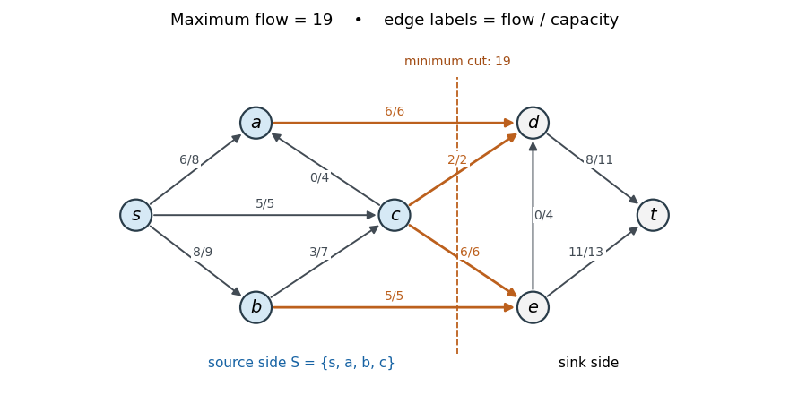

<h1 id="20h/c/solution">Solution</h1>

↑ **Parent:** [C](../c.md)

Reading the arrows directly from the original PDF gives, in particular, $c\to a$ and $e\to d$. Starting from zero [flow](../../../../../../flow.md), use the following [augmenting paths](../../../../../../augmenting-path.md) and bottlenecks, in order:

- $s\to a\to d\to t$: $6$.
- $s\to b\to e\to t$: $5$.
- $s\to c\to e\to t$: $5$.
- $s\to b\to c\to d\to t$: $2$.
- $s\to b\to c\to e\to t$: $1$.

Each path is available in the current [residual network](../../../../../../residual-network.md). The resulting nonzero edge flows are

$$
\begin{aligned}
f_{sa}&=6,&f_{sb}&=8,&f_{sc}&=5,\\
f_{ad}&=6,&f_{bc}&=3,&f_{be}&=5,\\
f_{cd}&=2,&f_{ce}&=6,&f_{dt}&=8,&f_{et}&=11.
\end{aligned}
$$

The flows on $c\to a$ and $e\to d$ are zero. Capacity constraints and [flow conservation](../../../../../../flow-conservation.md) hold at each interior vertex; net source outflow is $6+8+5=19$.

Take $S=\{s,a,b,c\}$. Its outgoing edges are $a\to d$, $c\to d$, $b\to e$, $c\to e$, with total capacity $6+2+5+6=19$. Thus the matching [flow](../../../../../../flow.md) and [cut of a flow network](../../../../../../cut-of-a-flow-network.md) certificates give

$$
\boxed{\text{maximum flow value}=19,\qquad\text{minimum cut }(\{s,a,b,c\},\{d,e,t\})}.
$$

These are also exactly the source-reachable vertices in the final [residual network](../../../../../../residual-network.md). The original drawing below labels each edge by flow/capacity; the highlighted edges realise the minimum [cut of a flow network](../../../../../../cut-of-a-flow-network.md).

**[Figure 2](#20h/c/image-a-maximum-flow-and-its-edge-capacities). A maximum flow and its edge capacities**. Verified maximum flow, with each arrow labelled flow/capacity and the minimum cut marked in orange.

## ↑ Ancestors (11)

1. [C](../c.md)
2. [20H](../../20h.md)
3. [Paper 4](../../../paper-4-split.md)
4. [Ib](../../../split.md)
5. [2017](../../../../split.md)
6. [Past exam of the mathematics course of the University of Cambridge](../../../../../split.md)
7. [Mathematics course of the University of Cambridge](../../../../../../mathematics-course-of-the-university-of-cambridge.md)
8. [Course of the University of Cambridge](../../../../../../course-of-the-university-of-cambridge.md)
9. [University of Cambridge](../../../../../../university-of-cambridge-split.md)
10. [List of universities](../../../../../../list-of-universities.md)
11. [Codex Wiki](../../../../../../split.md)
