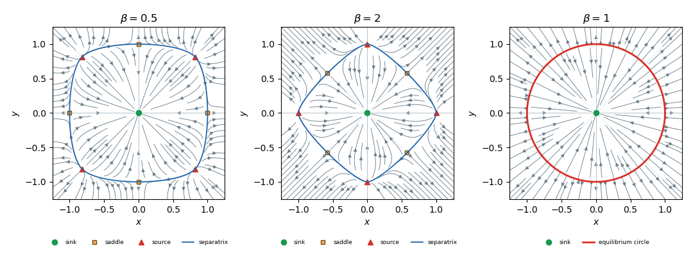
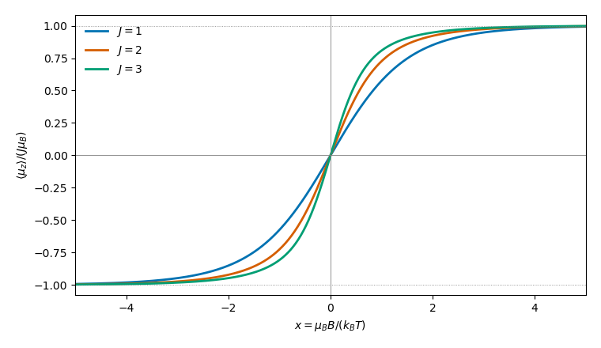
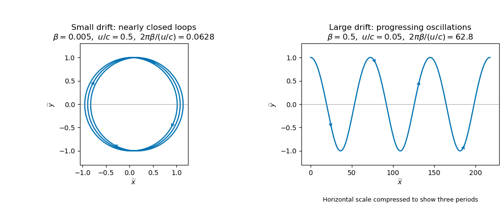

# Paper 1

↑ **Parent:** [Ii](../ii.md)

[https://www.maths.cam.ac.uk/undergrad/pastpapers/files/2017/paperii_1_2.pdf](https://www.maths.cam.ac.uk/undergrad/pastpapers/files/2017/paperii_1_2.pdf)

**Table of contents**

- [1G](#1g)
  - [Solution](#1g/solution)
- [2F](#2f)
  - [Solution](#2f/solution)
- [3G](#3g)
  - [Solution](#3g/solution)
- [4H](#4h)
  - [a](#4h/a)
    - [Solution](#4h/a/solution)
  - [b](#4h/b)
    - [Solution](#4h/b/solution)
- [5J](#5j)
  - [i](#5j/i)
    - [Solution](#5j/i/solution)
  - [ii](#5j/ii)
    - [Solution](#5j/ii/solution)
  - [iii](#5j/iii)
    - [Solution](#5j/iii/solution)
- [6B](#6b)
  - [Solution](#6b/solution)
- [7E](#7e)
  - [Solution](#7e/solution)
- [8E](#8e)
  - [Solution](#8e/solution)
- [9C](#9c)
  - [Solution](#9c/solution)
- [10G](#10g)
  - [i](#10g/i)
    - [Solution](#10g/i/solution)
  - [ii](#10g/ii)
    - [Solution](#10g/ii/solution)
- [11H](#11h)
  - [a](#11h/a)
    - [Solution](#11h/a/solution)
  - [b](#11h/b)
    - [Solution](#11h/b/solution)
- [12J](#12j)
  - [Solution](#12j/solution)
- [13E](#13e)
  - [Solution](#13e/solution)
- [14C](#14c)
  - [Solution](#14c/solution)
- [15H](#15h)
  - [Solution](#15h/solution)
- [16H](#16h)
  - [Solution](#16h/solution)
- [17I](#17i)
  - [a](#17i/a)
    - [Solution](#17i/a/solution)
  - [b](#17i/b)
    - [i](#17i/b/i)
      - [Solution](#17i/b/i/solution)
    - [ii](#17i/b/ii)
      - [Solution](#17i/b/ii/solution)
- [18G](#18g)
  - [a](#18g/a)
    - [Solution](#18g/a/solution)
  - [b](#18g/b)
    - [i](#18g/b/i)
      - [Solution](#18g/b/i/solution)
    - [ii](#18g/b/ii)
      - [Solution](#18g/b/ii/solution)
    - [iii](#18g/b/iii)
      - [Solution](#18g/b/iii/solution)
  - [c](#18g/c)
    - [Solution](#18g/c/solution)
- [19H](#19h)
  - [a](#19h/a)
    - [Solution](#19h/a/solution)
  - [b](#19h/b)
    - [Solution](#19h/b/solution)
  - [c](#19h/c)
    - [Solution](#19h/c/solution)
  - [d](#19h/d)
    - [Solution](#19h/d/solution)
- [20I](#20i)
  - [a](#20i/a)
    - [Solution](#20i/a/solution)
  - [b](#20i/b)
    - [Solution](#20i/b/solution)
  - [c](#20i/c)
    - [Solution](#20i/c/solution)
  - [d](#20i/d)
    - [Solution](#20i/d/solution)
  - [e](#20i/e)
    - [Solution](#20i/e/solution)
- [21F](#21f)
  - [a](#21f/a)
    - [Solution](#21f/a/solution)
  - [b](#21f/b)
    - [Solution](#21f/b/solution)
  - [c](#21f/c)
    - [Solution](#21f/c/solution)
- [22F](#22f)
  - [a](#22f/a)
    - [Solution](#22f/a/solution)
  - [b](#22f/b)
    - [Solution](#22f/b/solution)
  - [c](#22f/c)
    - [Solution](#22f/c/solution)
  - [d](#22f/d)
    - [Solution](#22f/d/solution)
- [23F](#23f)
  - [Solution](#23f/solution)
- [24I](#24i)
  - [a](#24i/a)
    - [Solution](#24i/a/solution)
  - [b](#24i/b)
    - [Solution](#24i/b/solution)
  - [c](#24i/c)
    - [Solution](#24i/c/solution)
  - [d](#24i/d)
    - [Solution](#24i/d/solution)
- [25I](#25i)
  - [Solution](#25i/solution)
- [26J](#26j)
  - [a](#26j/a)
    - [Solution](#26j/a/solution)
  - [b](#26j/b)
    - [Solution](#26j/b/solution)
  - [c](#26j/c)
    - [Solution](#26j/c/solution)
  - [d](#26j/d)
    - [Solution](#26j/d/solution)
  - [e](#26j/e)
    - [Solution](#26j/e/solution)
- [27K](#27k)
  - [a](#27k/a)
    - [Solution](#27k/a/solution)
  - [b](#27k/b)
    - [Solution](#27k/b/solution)
  - [c](#27k/c)
    - [Solution](#27k/c/solution)
- [28K](#28k)
  - [a](#28k/a)
    - [Solution](#28k/a/solution)
  - [b](#28k/b)
    - [i](#28k/b/i)
      - [Solution](#28k/b/i/solution)
    - [ii](#28k/b/ii)
      - [Solution](#28k/b/ii/solution)
    - [iii](#28k/b/iii)
      - [Solution](#28k/b/iii/solution)
- [29J](#29j)
  - [a](#29j/a)
    - [Solution](#29j/a/solution)
  - [b](#29j/b)
    - [Solution](#29j/b/solution)
  - [c](#29j/c)
    - [Solution](#29j/c/solution)
- [30A](#30a)
  - [a](#30a/a)
    - [Solution](#30a/a/solution)
  - [b](#30a/b)
    - [Solution](#30a/b/solution)
- [31A](#31a)
  - [Solution](#31a/solution)
- [32C](#32c)
  - [Solution](#32c/solution)
- [33C](#33c)
  - [Solution](#33c/solution)
- [34D](#34d)
  - [Solution](#34d/solution)
- [35D](#35d)
  - [Solution](#35d/solution)
- [36D](#36d)
  - [Solution](#36d/solution)
- [37B](#37b)
  - [Solution](#37b/solution)
- [38B](#38b)
  - [i](#38b/i)
    - [Solution](#38b/i/solution)
  - [ii](#38b/ii)
    - [Solution](#38b/ii/solution)
- [39A](#39a)
  - [Solution](#39a/solution)

## 1G

↑ **Parent:** [Paper 1](paper-1.md)

<h3 id="1g/solution">Solution</h3>

↑ **Parent:** [1G](#1g)

For an odd [prime number](../../../number-theory.md#prime-number) $p$, the [Legendre symbol](../../../number-theory.md#legendre-symbol) is zero when $p\mid a$, one when $a$ is a nonzero [quadratic residue](../../../number-theory.md#quadratic-residue) modulo $p$, and minus one otherwise. The number-theoretic [Gauss lemma](../../../number-theory.md#gauss-s-lemma-number-theory) says that, for $p\nmid a$, $(a/p)=(-1)^r$, where $r$ counts those least positive residues of $a,2a,\ldots,(p-1)a/2$ exceeding $p/2$.

For $a=2$, the residues are simply $2,4,\ldots,p-1$, so $r=(p-1)/2-\lfloor p/4\rfloor$. Examining the four odd residue classes modulo eight gives

$$
\boxed{\left(\frac2p\right)=(-1)^{(p^2-1)/8}
=\begin{cases}1&p\equiv1,7\pmod8,\\-1&p\equiv3,5\pmod8.\end{cases}}
$$

Now $2^m\equiv-1\pmod p$ and $p$ is odd. The [multiplicative order](../../../number-theory.md#multiplicative-order) $d$ of $2$ divides $2m$ but not $m$. Since $m$ is a power of two, every proper divisor of $2m$ divides $m$, whence $d=2m$. [Lagrange's theorem for finite groups](../../../group-theory.md#lagrange-s-theorem) gives $2m\mid p-1$. Because $m\ge4$, this implies $p\equiv1\pmod8$, so the supplementary law just proved gives $(2/p)=1$. By [Euler's criterion](../../../number-theory.md#euler-s-criterion), $2^{(p-1)/2}\equiv1\pmod p$, and consequently $2m\mid(p-1)/2$. Therefore

$$
\boxed{p\equiv1\pmod{4m}}.
$$

## 2F

↑ **Parent:** [Paper 1](paper-1.md)

<h3 id="2f/solution">Solution</h3>

↑ **Parent:** [2F](#2f)

The [Liouville approximation theorem](../../../number-theory.md#liouville-approximation-theorem) states that an irrational [algebraic number](../../../algebra.md#algebraic-number) $\alpha$ of degree $d\ge2$ satisfies $|\alpha-a/b|\ge C_\alpha b^{-d}$ for all integers $a$ and $b\ge1$, for some $C_\alpha>0$. The constant is independent of the rational approximation.

The required condition is **infinitely many of the coefficients equal one**. If only finitely many do, the [series](../../../real-analysis.md#series-mathematics) is a finite sum of [rational numbers](../../../number-theory.md#rational-number). Conversely let $\alpha$ be the sum with infinitely many nonzero terms. Its truncation $s_N$ has denominator dividing $q_N=10^{N!}$. For $N\ge2$, its strictly positive tail satisfies

$$
0<\alpha-s_N\le\sum_{j=N+1}^\infty10^{-j!}
<2\,10^{-(N+1)!}=2q_N^{-(N+1)}.
$$

If $\alpha=a/b$ were rational, the distinct fractions $\alpha,s_N$ would have distance at least $1/(bq_N)$, contradicting the tail bound for large $N$. Thus $\alpha$ is irrational. If it were algebraic of fixed degree $d$, apply the [Liouville approximation theorem](../../../number-theory.md#liouville-approximation-theorem) to $s_N$. Even if its reduced denominator is smaller than $q_N$, the lower bound is at least $C_\alpha q_N^{-d}$. The displayed upper bound contradicts this as $N\to\infty$. Hence

$$
\boxed{\alpha\text{ is transcendental}\iff\#\{n:\zeta_n=1\}=\infty}.
$$

The coincidence $0!=1!$ changes only the first rational contribution and has no effect on this criterion.

## 3G

↑ **Parent:** [Paper 1](paper-1.md)

<h3 id="3g/solution">Solution</h3>

↑ **Parent:** [3G](#3g)

The ideal observer performs [maximum a posteriori decoding](../../../coding-theory.md#maximum-a-posteriori-decoding): for received word $y$, it maximizes $\Pr(X=c\mid Y=y)$, equivalently $\Pr(X=c)\Pr(Y=y\mid X=c)$. [Maximum-likelihood decoding](../../../coding-theory.md#maximum-likelihood-decoding) maximizes the latter conditional likelihood alone. [Minimum-distance decoding](../../../coding-theory.md#minimum-distance-decoding) minimizes the [Hamming distance](../../../coding-theory.md#hamming-distance) $d(c,y)$. Ties may be resolved arbitrarily among maximizers.

For independent errors in a [binary symmetric channel](../../../coding-theory.md#binary-symmetric-channel),

$$
\Pr(Y=y\mid X=c)=p^{d(c,y)}(1-p)^{n-d(c,y)}.
$$

For $0<p<1/2$, its ratio on increasing the distance by one is $p/(1-p)<1$. Thus [maximum-likelihood decoding](../../../coding-theory.md#maximum-likelihood-decoding) and [minimum-distance decoding](../../../coding-theory.md#minimum-distance-decoding) select exactly the same codewords. At the allowed endpoint $p=0$, they agree on a possible observation $y\in C$; impossible observations have zero likelihood for every codeword, so an arbitrary maximum-likelihood tie rule need not agree with minimum distance. This qualification is needed for the literal assumption $p<1/2$.

For the specified observation, the [Hamming distances](../../../coding-theory.md#hamming-distance) from 000 and 111 are two and one. Their likelihoods are $3/64$ and $9/64$, respectively. After multiplying by the priors, their joint probabilities are $12/320$ and $9/320$, so their posterior probabilities are $4/7$ and $3/7$. Therefore

$$
\boxed{\text{ideal observer: }000,\qquad\text{maximum likelihood: }111,\qquad\text{minimum distance: }111}.
$$

## 4H

↑ **Parent:** [Paper 1](paper-1.md)

<h3 id="4h/a">a</h3>

↑ **Parent:** [4H](#4h)

<h4 id="4h/a/solution">Solution</h4>

↑ **Parent:** [A](#4h/a)

Let a [deterministic finite automaton](../../../foundations-of-mathematics.md#deterministic-finite-automaton) recognizing the [regular language](../../../foundations-of-mathematics.md#regular-language) have states $Q$, start state $q_0$, accepting states $F$, and transition [function](../../../function.md) $\delta$. Construct a [context-free grammar](../../../foundations-of-mathematics.md#context-free-grammar) with one nonterminal $A_q$ for every state, start symbol $A_{q_0}$, and productions

$$
A_q\to aA_{\delta(q,a)}\quad(q\in Q,\ a\in\Sigma),
\qquad A_q\to\varepsilon\quad(q\in F).
$$

Induction on the length of a word shows that $A_q$ derives $wA_r$ exactly when the automaton reaches $r$ from $q$ after reading $w$. The terminal production can then end the derivation precisely at an accepting state. Thus the grammar generates exactly the recognized language, proving **every [regular language](../../../foundations-of-mathematics.md#regular-language) is a [context-free language](../../../foundations-of-mathematics.md#context-free-language)**. This is actually a [right-linear grammar](../../../foundations-of-mathematics.md#right-linear-grammar), a special case of a [context-free grammar](../../../foundations-of-mathematics.md#context-free-grammar).

<h3 id="4h/b">b</h3>

↑ **Parent:** [4H](#4h)

<h4 id="4h/b/solution">Solution</h4>

↑ **Parent:** [B](#4h/b)

Treat the fixed letters $a_1,\ldots,a_n$, the empty-language and empty-word symbols, and the punctuation of expressions as a finite token alphabet. In the usual syntax allowing parentheses, union, concatenation, and star, the following [context-free grammar](../../../foundations-of-mathematics.md#context-free-grammar) generates exactly the syntactically valid [regular expressions](../../../foundations-of-mathematics.md#regular-expression):

$$
E\to\varnothing\mid\varepsilon\mid a_1\mid\cdots\mid a_n
\mid(E)\mid E+E\mid EE\mid E^*.
$$

Structural induction proves that every generated string is an expression and that every expression has a derivation. Grammar ambiguity does not affect the [context-free language](../../../foundations-of-mathematics.md#context-free-language) assertion.

If the language of these expressions were a [regular language](../../../foundations-of-mathematics.md#regular-language), its intersection with the regular token language consisting of some opening parentheses, then $a_1$, then some closing parentheses would be regular. That intersection is exactly

$$
\{\mathtt{(}^{\,r}a_1\mathtt{)}^{\,r}:r\ge0\}.
$$

The [pumping lemma for regular languages](../../../foundations-of-mathematics.md#pumping-lemma-for-regular-languages) contradicts regularity: a sufficiently long opening-parenthesis prefix forces a pumpable segment wholly within that prefix, and pumping it changes the two parenthesis counts unequally. Hence **the expression syntax is context-free but not regular**. This conclusion concerns the strings describing expressions, not the languages those expressions denote; it uses the usual concrete syntax with arbitrary nested parentheses.

## 5J

↑ **Parent:** [Paper 1](paper-1.md)

<h3 id="5j/i">i</h3>

↑ **Parent:** [5J](#5j)

<h4 id="5j/i/solution">Solution</h4>

↑ **Parent:** [I](#5j/i)

The comparison is a [nested-model F-test](../../../probability-and-statistics.md#nested-model-f-test) of the three time-by-diet interaction coefficients, with null hypothesis that all are zero. The reduced [linear regression](../../../linear-regression.md) model has a common time slope and four diet-specific intercepts; the full model permits four slopes. It has eight fitted coefficients and $579-8=571$ residual degrees of freedom.

$$
F=\frac{(34.381-31.589)/3}{31.589/571}\approx16.823,
\qquad \boxed{F\sim F_{3,571}\text{ under the null}}.
$$

The rounded sums of squares give the displayed approximation; the software reports $F=16.824$ using unrounded values. The quoted [p-value](../../../statistical-modelling.md#p-value) $1.744\times10^{-10}$ gives overwhelming evidence against equal log-weight growth slopes across diets under the [normal linear model](../../../statistical-modelling.md#normal-linear-model) assumptions. Thus **reject the common-slope hypothesis**. Because repeated measurements on the same chicken may be correlated, the exact reference distribution requires independent, homoscedastic Gaussian errors; the displayed ordinary regression output by itself does not establish that assumption.

<h3 id="5j/ii">ii</h3>

↑ **Parent:** [5J](#5j)

<h4 id="5j/ii/solution">Solution</h4>

↑ **Parent:** [Ii](#5j/ii)

A [residual-versus-fitted plot](../../../linear-regression.md#residual-versus-fitted-plot) for the untransformed fit places $e_i=y_i-\widehat y_i$ on the vertical axis and $\widehat y_i$ on the horizontal axis. A fan-shaped cloud, with larger residual spread at larger fitted weight, suggests [heteroscedasticity](../../../statistical-modelling.md#heteroscedastic) and approximately multiplicative errors. A [logarithmic transformation](../../../statistical-modelling.md#logarithmic-transformation) may stabilize this spread when the conditional standard deviation is roughly proportional to the mean.

One can also use the scale-location plot of $\sqrt{|r_i|}$ against fitted values, where $r_i$ is a standardized residual. A systematic rise suggests nonconstant error [variance](../../../variance.md). Neither plot proves that taking logarithms is sufficient: diagnostics of the transformed fit should be checked as well, and dependence between repeated chicken measurements is a separate issue.

<h3 id="5j/iii">iii</h3>

↑ **Parent:** [5J](#5j)

<h4 id="5j/iii/solution">Solution</h4>

↑ **Parent:** [Iii](#5j/iii)

The dashed curves are contours of constant [Cook's distance](../../../statistical-modelling.md#cook-s-distance), labelled 0.5 and 1, in the plot of standardized residual against [regression leverage](../../../statistical-modelling.md#regression-leverage). Writing $h_{ii}$ for the diagonal of the [hat matrix](../../../statistical-modelling.md#hat-matrix), $s^2$ for the residual [variance](../../../variance.md) estimate, and $p=8$ for the number of fitted coefficients,

$$
r_i=\frac{e_i}{s\sqrt{1-h_{ii}}},\qquad
\boxed{D_i=\frac{r_i^2}{p}\frac{h_{ii}}{1-h_{ii}}}.
$$

Thus a contour $D_i=d$ has $r_i=\pm\sqrt{dp(1-h_{ii})/h_{ii}}$. On the actual PDF plot, observation 579 has leverage about 0.084 and standardized residual about $-8$, lying beyond the $D=0.5$ contour and below $D=1$ in influence magnitude, approximately $D\simeq0.7$ to $0.8$ from the plotted coordinates. It is unusually light relative to its fitted log-weight and potentially influential because deleting it can materially change fitted coefficients. It warrants checking, not automatic deletion. The solid smooth red curve is distinct from the dashed [Cook's distance](../../../statistical-modelling.md#cook-s-distance) contours.

## 6B

↑ **Parent:** [Paper 1](paper-1.md)

<h3 id="6b/solution">Solution</h3>

↑ **Parent:** [6B](#6b)

For nonnegative insect density assume $N_0>0$. Substitution of $N=e^{\alpha t}R$ gives $R_t=D e^{2\alpha t}(R^2R_x)_x$, so choose

$$
\boxed{\tau(t)=\begin{cases}\dfrac{D}{2\alpha}(e^{2\alpha t}-1)&\alpha\ne0,\\Dt&\alpha=0.\end{cases}}
$$

Then $\tau'=De^{2\alpha t}>0$ and the [porous medium equation](../../../diffusion-equation.md#porous-medium-equation) is $R_\tau=(R^2R_x)_x$. Its total mass is conserved when the flux vanishes at infinity. For the mass-preserving [similarity solution](../../../partial-differential-equation.md#similarity-solution), direct differentiation gives

$$
R_\tau=-\frac14\tau^{-5/4}(F+\xi F'),\qquad
(R^2R_x)_x=\tau^{-5/4}(F^2F')',
\qquad \int_{\mathbb R}F\,d\xi=N_0.
$$

On the positive support, integrating once with zero boundary flux gives $F^2F'=-\xi F/4$ and hence $F^2=(\xi_0^2-\xi^2)/4$. The semicircle mass [integral](../../../calculus.md#integral) is $\pi\xi_0^2/4=N_0$, confirming the profile and its symmetric [compact support](../../../function.md#compact-support).

The front is at $|x|=\xi_0\tau^{1/4}$. When $\alpha<0$, $\tau(t)$ increases towards $D/(2|\alpha|)$, so the supremum of the distance reached is

$$
\boxed{x_{\max}=\sqrt{\frac{4N_0}{\pi}}\left(\frac{D}{2|\alpha|}\right)^{1/4}}.
$$

It is approached as $t\to\infty$, rather than attained at a finite time. If $N_0=0$, the nonnegative solution is identically zero and the corresponding distance is zero.

## 7E

↑ **Parent:** [Paper 1](paper-1.md)

<h3 id="7e/solution">Solution</h3>

↑ **Parent:** [7E](#7e)

There is an important convention issue in the printed statement. The ordinary [Cauchy principal value](../../../complex-analysis.md#cauchy-principal-value) exists only for $n=1$. Closing the Fourier contour in the lower half-plane, with a small indentation above the real-axis pole, gives

$$
\boxed{\operatorname{PV}\int_{\mathbb R}\frac{e^{-ix}}x\,dx=-i\pi}.
$$

Equivalently, the odd cosine contribution cancels and the [Dirichlet integral](../../../fourier-analysis.md#dirichlet-integral) $\int_0^\infty\sin x/x\,dx=\pi/2$ supplies the imaginary part.

For $n\ge2$, the paired integrand near zero is $2\cos x/x^n$ if $n$ is even and $-2i\sin x/x^n$ if $n$ is odd. Its leading even power is nonintegrable: $x^{-n}$ in the first case and $x^{1-n}$ in the second. Thus **the ordinary principal value diverges for every $n>1$**.

If the intended convention is the [Hadamard finite-part integral](../../../distribution-theory.md#hadamard-finite-part-integral), define it consistently by distributional differentiation,

$$
\operatorname{Pf}\frac1{x^n}
=\frac{(-1)^{n-1}}{(n-1)!}\frac{d^{n-1}}{dx^{n-1}}\operatorname{PV}\frac1x.
$$

Integration by parts in this distributional pairing, or regularized Fourier transformation, then gives

$$
\boxed{\operatorname{Pf}\int_{\mathbb R}\frac{e^{-ix}}{x^n}\,dx
=\frac{\pi(-i)^n}{(n-1)!}}.
$$

The distinction is essential: subtracting the divergent local Taylor terms supplies a finite part, but symmetric exclusion alone does not.

## 8E

↑ **Parent:** [Paper 1](paper-1.md)

<h3 id="8e/solution">Solution</h3>

↑ **Parent:** [8E](#8e)

Assume the [holonomic constraints](../../../classical-mechanics.md#holonomic-constraint) have [linearly independent](../../../vector-space.md#linear-independence) [gradients](../../../calculus.md#gradient), so their common level [set](../../../set.md) is locally a smooth constraint [manifold](../../../topology.md#topological-manifold) parametrized by $q_1,\ldots,q_n$. The multiplier form of the [Euler-Lagrange equations](../../../analysis.md#euler-lagrange-equation) is

$$
\frac d{dt}L_{\dot x_A}-L_{x_A}
=\sum_\alpha\lambda_\alpha\partial_A f_\alpha.
$$

At fixed time $\sum_A\partial_A f_\alpha\,\partial_i x_A=0$. The [chain rule](../../../calculus.md#chain-rule) for the reduced [Lagrangian](../../../calculus-of-variations.md#lagrangian) gives

$$
\frac d{dt}\mathcal L_{\dot q_i}-\mathcal L_{q_i}
=\sum_A\left(\frac d{dt}L_{\dot x_A}-L_{x_A}\right)\partial_i x_A=0.
$$

Conversely, if these reduced equations hold, the Cartesian Euler-Lagrange residual annihilates every tangent direction. [Linear independence](../../../vector-space.md#linear-independence) of the constraint [gradients](../../../calculus.md#gradient) implies that it is a linear combination of those [gradients](../../../calculus.md#gradient), giving the required [Lagrange multipliers](../../../mathematical-optimization.md#lagrange-multiplier). This proves the local equivalence, including time-dependent constraints; singular constraints would need separate analysis.

For the bead, $\dot y=f'(x)\dot x$, so

$$
\boxed{\mathcal L=\frac12(1+f'(x)^2)\dot x^2},\qquad
(1+f'^2)\ddot x+f'f''\dot x^2=0.
$$

The autonomous [conservation of energy](../../../physics.md#conservation-of-energy) gives $E=\tfrac12(1+f'^2)\dot x^2$. If $E>0$, the motion has a fixed sign $s=\operatorname{sgn}\dot x$ and

$$
\boxed{t=t_*+\frac{s}{\sqrt{2E}}\int_{x_*}^{x}\sqrt{1+f'(u)^2}\,du}.
$$

The [integral](../../../calculus.md#integral) is the signed [arc length](../../../riemannian-geometry.md#arc-length) divided by the constant speed, and is locally invertible. The special solution $E=0$ is a stationary bead, for which writing time as a [function](../../../function.md) of its unchanging position is not meaningful.

## 9C

↑ **Parent:** [Paper 1](paper-1.md)

<h3 id="9c/solution">Solution</h3>

↑ **Parent:** [9C](#9c)

For comoving galaxies their relative comoving vector $\boldsymbol\chi$ is constant, and the physical displacement is $\mathbf r(t)=a(t)\boldsymbol\chi$, where $a$ is the [scale factor](../../../cosmology.md#scale-factor-cosmology). Differentiating gives the [Hubble law](../../../cosmology.md#hubble-s-law)

$$
\boxed{\mathbf v=H\mathbf r,\qquad H=\frac{\dot a}{a}}.
$$

[Peculiar velocity](../../../cosmology.md#peculiar-velocity) relative to this comoving frame is excluded in this relation.

Transport a wave crest between neighbouring comoving observers separated by a small physical distance $d\ell$. Their recession speed is $H\,d\ell$, while the light travel time is $dt=d\ell/c$ to first order. The local [Doppler shift](../../../physics.md#doppler-effect) therefore changes its wavelength by $d\lambda/\lambda=H\,dt$. Multiplying these infinitesimal shifts along the ray, or integrating their logarithms, yields

$$
\log\frac{\lambda_0}{\lambda_e}
=\int_{t_e}^{t_0}H(t)\,dt
=\log\frac{a(t_0)}{a(t_e)},
\qquad \boxed{1+z=\frac{a(t_0)}{a(t_e)}}.
$$

The use of the local first-order Doppler law is exact in the limit of infinitesimal steps: the accumulated second-order errors tend to zero. A single special-relativistic recession velocity assigned to widely separated galaxies would not justify this [cosmological redshift](../../../cosmology.md#cosmological-redshift) relation.

## 10G

↑ **Parent:** [Paper 1](paper-1.md)

<h3 id="10g/i">i</h3>

↑ **Parent:** [10G](#10g)

<h4 id="10g/i/solution">Solution</h4>

↑ **Parent:** [I](#10g/i)

A [linear code](../../../coding-theory.md#linear-code) of length $n$ and rank $k$ is a $k$-dimensional [linear subspace](../../../vector-space.md#vector-subspace) of $\mathbb F_2^n$. The [Hamming weight](../../../coding-theory.md#hamming-weight) of a vector counts its nonzero coordinates. Thus the sum of the coefficients of the [weight enumerator](../../../coding-theory.md#weight-enumerator) is the number of codewords:

$$
\boxed{W_C(1,1)=2^k}.
$$

Since the zero vector is the unique word of weight zero, $W_C(0,1)=1$. Symmetry of the enumerator therefore implies $W_C(1,0)=1$. Conversely $W_C(1,0)=1$ means that the all-one vector $\mathbf1$ belongs to $C$. Translation $x\mapsto x+\mathbf1$ is then a bijection of $C$ which replaces weight $j$ by $n-j$, proving the [polynomial](../../../polynomial.md) symmetry. For length zero the same conclusion holds with the unique empty vector.

The [dual code](../../../coding-theory.md#dual-code) is $C^\perp=\{y:x\cdot y=0\text{ for every }x\in C\}$, using the standard bilinear form over $\mathbb F_2$. If $y\in C^\perp$, each summand of the character sum equals one. Otherwise choose $x_0\in C$ with $x_0\cdot y=1$; replacing $x$ by $x+x_0$ permutes the summands and reverses their sign. The sum equals its own negative and must be zero. Consequently

$$
\boxed{\sum_{x\in C}(-1)^{x\cdot y}=2^k\mathbf1_{\{y\in C^\perp\}}}.
$$

This is [character orthogonality](../../../representation-theory.md#character-orthogonality) for the additive [group](../../../group.md) of the code.

<h3 id="10g/ii">ii</h3>

↑ **Parent:** [10G](#10g)

<h4 id="10g/ii/solution">Solution</h4>

↑ **Parent:** [Ii](#10g/ii)

For any vector $y\in\mathbb F_2^n$, use its [Hamming weight](../../../coding-theory.md#hamming-weight) $w(y)=\#\{j:y_j=1\}$. The stated product identity also follows directly by summing each coordinate independently:

$$
\sum_y u^{w(y)}(-1)^{x\cdot y}
=\prod_{j=1}^n(1+(-1)^{x_j}u)
=(1-u)^{w(x)}(1+u)^{n-w(x)}.
$$

For $t\ne0$, interchange the two finite sums with $u=s/t$. [Character orthogonality](../../../representation-theory.md#character-orthogonality) evaluates the inner sum over codewords, whereas the product identity evaluates the sum over all binary vectors. Thus

$$
2^k\sum_{y\in C^\perp}(s/t)^{w(y)}
=\sum_{x\in C}(1-s/t)^{w(x)}(1+s/t)^{n-w(x)}.
$$

Multiply by $t^n$ to obtain the [MacWilliams identity](../../../coding-theory.md#macwilliams-identity) in the paper's weight-enumerator convention:

$$
\boxed{W_{C^\perp}(s,t)=2^{-k}W_C(t-s,t+s)}.
$$

Both sides are [polynomials](../../../polynomial.md), so equality for $t\ne0$ extends to $t=0$ as well; the intermediate quotient is not a restriction on the final identity.

## 11H

↑ **Parent:** [Paper 1](paper-1.md)

<h3 id="11h/a">a</h3>

↑ **Parent:** [11H](#11h)

<h4 id="11h/a/solution">Solution</h4>

↑ **Parent:** [A](#11h/a)

A [deterministic finite automaton](../../../foundations-of-mathematics.md#deterministic-finite-automaton) is described by finite state and alphabet label lists, one initial state label, an accepting-state bit mask, and a finite transition table. Keep each label in increasing order and list transitions lexicographically by the actual state and alphabet labels. This retains arbitrary finite subsets of the permitted labels, rather than assuming they are consecutive.

The [prime-exponent encoding of a finite list](../../../mathematical-logic.md#prime-exponent-encoding-of-a-finite-list) gives an explicit [Gödel encoding](../../../mathematical-logic.md#godel-numbering) for a list $(a_0,\ldots,a_{r-1})$ of [nonnegative integers](../../../arithmetic.md#natural-number):

$$
\operatorname{code}(a_0,\ldots,a_{r-1})
=2^r\prod_{j=0}^{r-1}p_{j+2}^{a_j+1},
$$

where $p_i$ is the $i$th [prime number](../../../number-theory.md#prime-number). Encode the descriptor as a list beginning with the numbers of states and alphabet symbols, followed by their sorted labels, the start label, the accepting mask, and all transition destinations. The lengths are then known during decoding.

[Unique prime factorization](../../../number-theory.md#fundamental-theorem-of-arithmetic) recovers the list and hence the automaton. Reject an integer if the prescribed prime exponents are missing, additional primes occur, the list lengths disagree, state or alphabet labels repeat, the initial state or a transition target is absent, or the mask is out of range. These are effective finite checks. Thus every automaton has an integer code, valid codes are decidable, and the transition system of a coded automaton is computable. Invalid integers may be excluded explicitly or assigned a fixed empty-language automaton.

<h3 id="11h/b">b</h3>

↑ **Parent:** [11H](#11h)

<h4 id="11h/b/solution">Solution</h4>

↑ **Parent:** [B](#11h/b)

From the decoded [deterministic finite automaton](../../../foundations-of-mathematics.md#deterministic-finite-automaton), retain only productive states: those reachable from the initial state and from which an accepting state is reachable. Both [sets](../../../set.md) are computable by finite [graph search](../../../graph.md#graph-search). Its [regular language](../../../foundations-of-mathematics.md#regular-language) is infinite precisely when this productive directed graph contains a directed cycle.

Indeed, a cycle on a route from the start to acceptance can be repeated arbitrarily often, giving accepted words of different lengths. Conversely an accepted path of length at least the number of productive states repeats one such state and gives a productive cycle. Therefore absence of cycles bounds every accepted length strictly below that number. Cycle detection is a finite algorithm, proving that **finiteness of the accepted language is decidable**.

When it is finite, enumerate every word of length less than the number of states and simulate acceptance, then count the accepted words. This includes the empty word. Alternatively use dynamic programming in the productive acyclic graph:

$$
N(q)=\mathbf1_{\{q\text{ accepting}\}}+
\sum_{a:\delta(q,a)\text{ productive}}N(\delta(q,a)).
$$

Distinct alphabet symbols count distinct words even when their transitions share a destination. The result is $N(q_0)$, or zero if the start state is not productive. Validity of the encoding is checked first, so the [set](../../../set.md) of valid finite-language codes is [recursive set](../../../foundations-of-mathematics.md#computable-set).

## 12J

↑ **Parent:** [Paper 1](paper-1.md)

<h3 id="12j/solution">Solution</h3>

↑ **Parent:** [12J](#12j)

Under the [binomial distribution](../../../discrete-probability-distribution.md#binomial-distribution) model's assumption of independent games with a common win [probability](../../../probability-theory.md#probability) $p$, the [probability](../../../probability-theory.md#probability) of winning a match is

$$
h(p)=\sum_{j=6}^{11}\binom{11}{j}p^j(1-p)^{11-j}.
$$

This is also the [cumulative distribution function](../../../probability-theory.md#cumulative-distribution-function) $F_{6,6}(p)$ of a [Beta distribution](../../../probability-theory.md#beta-distribution) with parameters $(6,6)$: differentiation of the binomial tail gives $h'(p)=11!\,p^5(1-p)^5/(5!)^2$, and $h(0)=0$. In particular $h$ is strictly increasing on $(0,1)$ and maps $[0,1]$ bijectively onto itself.

The new match [probability](../../../probability-theory.md#probability) is $\widetilde P_{ab}=h(P_{ab})$, while the desired linear predictor remains the game-level [log odds](../../../statistical-modelling.md#log-odds). Therefore the [link function](../../../statistical-modelling.md#link-function) is

$$
\boxed{g(u)=\log\frac{F_{6,6}^{-1}(u)}{1-F_{6,6}^{-1}(u)}},\qquad0<u<1.
$$

Its endpoint values are $-\infty$ and $+\infty$. This is not the ordinary match-level [log odds](../../../statistical-modelling.md#log-odds) link: it first recovers the underlying game [probability](../../../probability-theory.md#probability). Symmetry of the binomial tail gives $h(1-p)=1-h(p)$, hence $g(1-u)=-g(u)$, as required by swapping the players. Dependence or varying game probabilities within a match would invalidate the stated binomial-tail conversion.

## 13E

↑ **Parent:** [Paper 1](paper-1.md)

<h3 id="13e/solution">Solution</h3>

↑ **Parent:** [13E](#13e)

For $\operatorname{Re}s>1$, expand $(e^t-1)^{-1}=\sum_{n\ge1}e^{-nt}$. Absolute integrability, bounded near zero by a constant times $t^{\operatorname{Re}s-2}$, permits termwise integration. The [Gamma function](../../../complex-analysis.md#gamma-function) [integral](../../../calculus.md#integral) then gives

$$
\int_0^\infty\frac{t^{s-1}}{e^t-1}\,dt
=\sum_{n\ge1}n^{-s}\Gamma(s),
\qquad \boxed{\zeta_R(s)=\frac1{\Gamma(s)}\int_0^\infty\frac{t^{s-1}}{e^t-1}\,dt}.
$$

Specify the [Hankel contour](../../../complex-analysis.md#hankel-contour) to run from the negative real axis below the cut towards zero, circle zero counterclockwise with fixed radius $0<r<2\pi$, and return above the cut. Take $-\pi<\arg t<\pi$. The circle excludes every nonzero pole $2\pi i\mathbb Z$ of the denominator. For $\operatorname{Re}s>1$ its radius can shrink to zero, and the lower and upper rays give respectively $-e^{-i\pi s}\Gamma(s)\zeta_R(s)$ and $e^{i\pi s}\Gamma(s)\zeta_R(s)$. By the [Gamma reflection formula](../../../complex-analysis.md#gamma-reflection-formula),

$$
I(s)=\frac{\Gamma(1-s)\Gamma(s)\sin\pi s}{\pi}\zeta_R(s)=\zeta_R(s)
$$

away from integer $s$ in that half-plane, with limiting equality at the removable points.

With the circle radius kept fixed, the contour [integral](../../../calculus.md#integral) is an [entire function](../../../complex-analysis.md#entire-function) of $s$: the rays decay exponentially and converge locally uniformly, and the circular part stays away from zero. Multiplication by $\Gamma(1-s)$ is analytic for $\operatorname{Re}s<1$ and meromorphic globally. The apparent singularities at positive integers $s\ge2$ are removable because the [integral](../../../calculus.md#integral) vanishes there and it already agrees with the original analytic zeta [function](../../../function.md) nearby. Only $s=1$ remains a simple pole. Thus this constructs the [meromorphic continuation](../../../complex-analysis.md#meromorphic-continuation) to the whole plane and an [analytic continuation](../../../complex-analysis.md#analytic-continuation) on $\mathbb C\setminus\{1\}$. Keeping the circular segment is essential when the [integral](../../../calculus.md#integral) is not locally integrable at zero.

At $s=-1$ the two rays cancel, since $t^{-2}$ is single-valued. The Laurent expansion

$$
\frac1{e^{-t}-1}=-\frac1t-\frac12-\frac t{12}+O(t^3)
$$

shows that the residue of $t^{-2}/(e^{-t}-1)$ is $-1/12$. Since $\Gamma(2)=1$, the [residue theorem](../../../analysis.md#residue-theorem) gives

$$
\boxed{\zeta_R(-1)=-\frac1{12}}.
$$

## 14C

↑ **Parent:** [Paper 1](paper-1.md)

<h3 id="14c/solution">Solution</h3>

↑ **Parent:** [14C](#14c)

Differentiate the [Friedmann equation](../../../cosmology.md#friedmann-equations) and use [energy](../../../classical-mechanics.md#energy) conservation to obtain $\dot H=-4\pi G(\rho+P/c^2)$ on the expanding branch, where $H\ne0$. Since $\ddot a/a=\dot H+H^2$,

$$
\boxed{\frac{\ddot a}{a}=-\frac{4\pi G}{3}(\rho+3P/c^2)+\frac{\Lambda c^2}{3}}.
$$

For [pressureless matter](../../../cosmology.md#pressureless-matter), conservation gives $\rho_M=\rho_{M0}a^{-3}$. In terms of the specified [cosmological density parameters](../../../cosmology.md#cosmological-density-parameter), flatness implies $\Omega_M+\Omega_\Lambda=1$, and

$$
H=H_0\sqrt{\Omega_Ma^{-3}+\Omega_\Lambda},\qquad
\frac{\ddot a}{a}=-\frac{H_0^2}2(\Omega_Ma^{-3}-2\Omega_\Lambda).
$$

Set $b=a^{3/2}$ and take $\Omega_M>0$. Then $\dot b=\tfrac32H_0\sqrt{\Omega_M+\Omega_\Lambda b^2}$. Integrating with the [Big Bang](../../../cosmology.md#big-bang) at $t=0$ gives

$$
\operatorname{arsinh}\left(\sqrt{\frac{\Omega_\Lambda}{\Omega_M}}b\right)
=\frac32H_0\sqrt{\Omega_\Lambda}\,t,
\qquad
\boxed{a(t)=\left(\frac{\Omega_M}{\Omega_\Lambda}\right)^{1/3}
\sinh^{2/3}\left(\frac32H_0\sqrt{\Omega_\Lambda}\,t\right)}.
$$

For another time origin replace $t$ by $t-t_B$. The [cosmological constant](../../../cosmology.md#cosmological-constant) has effective density $\rho_\Lambda=3H_0^2\Omega_\Lambda/(8\pi G)$. Equality with the matter density means $a^3=\Omega_M/\Omega_\Lambda$, so

$$
\boxed{\bar t=\frac{2}{3H_0\sqrt{\Omega_\Lambda}}\operatorname{arsinh}1}.
$$

If $\Omega_M=0$, the expanding solution is pure exponential [de Sitter scale factor in flat slicing](../../../general-relativity.md#de-sitter-scale-factor-in-flat-slicing) and there is no finite matter-density equality time or dust Big Bang; the stated hyperbolic-sine formula presumes a nonzero dust component.

## 15H

↑ **Parent:** [Paper 1](paper-1.md)

<h3 id="15h/solution">Solution</h3>

↑ **Parent:** [15H](#15h)

The [completeness theorem for propositional logic](../../../mathematical-logic.md#completeness-theorem-for-propositional-logic), together with soundness, states $S\vdash\varphi$ if and only if $S\models\varphi$. In particular, an inconsistent [set](../../../set.md) of formulae has a finite formal proof of contradiction. Such a proof uses only finitely many assumptions, yielding the [propositional compactness theorem](../../../mathematical-logic.md#propositional-compactness-theorem): if every finite subset of $S$ is satisfiable, then $S$ is satisfiable.

The [decidability theorem for propositional logic](../../../mathematical-logic.md#decidability-theorem-for-propositional-logic) concerns theoremhood of a formula, or entailment from a finite list of premises. Formulae involve finitely many variables, so their valuations can be tested by a finite truth table; completeness identifies semantic validity with provability. Equivalently, dovetail effective proof enumeration with the finite search for a countervaluation: completeness ensures that one succeeds. This is not a decidability claim for consequences of an arbitrary noncomputable infinite theory.

An infinite collection of distinct tautologies is a [finitary set of formulae](../../../mathematical-logic.md#finitary-set-of-formulae), since its deductive closure equals that of the empty [set](../../../set.md). By contrast, the [set](../../../set.md) of independent variables $\{p_i:i\ge1\}$ is not finitary. If a finite [set](../../../set.md) $T$ had the same closure, it would mention only finitely many variables. It is satisfiable because it is a consequence of the all-true model of the $p_i$; changing an unmentioned $p_j$ to false preserves $T$ and contradicts $T\models p_j$.

Under the final hypothesis, $A\cup B$ has no model. The [propositional compactness theorem](../../../mathematical-logic.md#propositional-compactness-theorem) gives finite $A'\subset A$, $B'\subset B$ with $A'\cup B'$ inconsistent. Any valuation satisfying $A'$ cannot satisfy $B$, because it would then satisfy $B'$; by the exactly-one hypothesis it must satisfy $A$. The reverse implication holds by inclusion. Thus $A$ and $A'$ have identical models, and similarly $B$ and $B'$. Completeness gives identical deductive closures, proving

$$
\boxed{A\text{ and }B\text{ are finitary}}.
$$

## 16H

↑ **Parent:** [Paper 1](paper-1.md)

<h3 id="16h/solution">Solution</h3>

↑ **Parent:** [16H](#16h)

Let $v_1\cdots v_r$ be a longest path in the finite simple [graph](../../../graph.md). Every neighbour of either endpoint lies on it. Among indices $1\le i<r$, consider those with edges $v_1v_{i+1}$ and those with edges $v_iv_r$. Their cardinalities are the endpoint degrees, whose sum is at least $n\ge r$, exceeding the $r-1$ available indices. They intersect, producing the cycle

$$
v_1v_2\cdots v_i v_r v_{r-1}\cdots v_{i+1}v_1.
$$

Every connected component has at least $\delta(G)+1>n/2$ vertices, so the graph is connected. If $r<n$, an edge joins a vertex outside this cycle to it, and breaking the cycle there gives a longer path, a contradiction. Hence $r=n$ and this is a [Hamilton cycle](../../../graph-theory.md#hamilton-cycle), proving [Dirac theorem](../../../graph-theory.md#dirac-s-theorem).

The complete graph $K_4$ is planar, has [chromatic number](../../../graph-theory.md#chromatic-number) four and a Hamilton cycle. Adding one leaf attached to one of its vertices preserves planarity and [chromatic number](../../../graph-theory.md#chromatic-number) four but prevents a Hamilton cycle, since a leaf has degree one.

For the last claim, the given plane embedding has all vertices on the outer cycle. Add noncrossing diagonals until its polygonal interior is triangulated. A triangulated polygon has a vertex incident with only its two boundary neighbours: for example the dual graph of its triangles is a tree and a leaf triangle supplies an ear. Remove this vertex. Inductively three-colour the smaller triangulated polygon, starting with a triangle. The removed vertex's neighbours are adjacent and have different colours, so it can receive the third. Restriction to the original graph gives

$$
\boxed{\chi(G)\le3}.
$$

This uses the specified embedding, not the false assertion that every planar [Hamiltonian](../../../classical-mechanics.md#hamiltonian) graph is three-colourable; $K_4$ is already a counterexample to that broader assertion.

## 17I

↑ **Parent:** [Paper 1](paper-1.md)

<h3 id="17i/a">a</h3>

↑ **Parent:** [17I](#17i)

<h4 id="17i/a/solution">Solution</h4>

↑ **Parent:** [A](#17i/a)

A [splitting field](../../../galois-theory.md#splitting-field) of a nonzero [polynomial](../../../polynomial.md) $f$ over $K$ is an extension in which $f$ splits into linear factors and which is generated over $K$ by all its roots. For a constant nonzero [polynomial](../../../polynomial.md) the [splitting field](../../../galois-theory.md#splitting-field) is $K$; the zero [polynomial](../../../polynomial.md) does not have a root-generated [splitting field](../../../galois-theory.md#splitting-field) in this standard definition.

Given two [splitting fields](../../../galois-theory.md#splitting-field) $L,L'$, enumerate the roots generating $L$ and extend a $K$-embedding one root at a time. If an embedding is defined on $K(\alpha_1,\ldots,\alpha_j)$, the [minimal polynomial](../../../linear-operator-theory.md#minimal-polynomial) of the next root divides $f$ over that [field](../../../algebra.md#field). Its image under the embedding therefore divides $f$ over the corresponding subfield of $L'$, and has a root in $L'$. The quotient construction $K(\alpha)\cong K[t]/(m_\alpha)$ extends the embedding to that root. The [polynomial](../../../polynomial.md) need not be a [separable polynomial](../../../galois-theory.md#separable-polynomial).

At the end this gives a $K$-embedding $L\to L'$. It sends the distinct roots of $f$ injectively to its roots, hence permutes the finite [set](../../../set.md) of distinct roots and contains every root in its image. Since these generate $L'$, the embedding is onto. Thus **the [splitting field](../../../galois-theory.md#splitting-field) is unique up to a (K)-isomorphism**.

<h3 id="17i/b">b</h3>

↑ **Parent:** [17I](#17i)

<h4 id="17i/b/i">i</h4>

↑ **Parent:** [B](#17i/b)

<h5 id="17i/b/i/solution">Solution</h5>

↑ **Parent:** [I](#17i/b/i)

The quartic is irreducible by [Eisenstein criterion](../../../commutative-algebra.md#eisenstein-criterion) at two, so its [Galois group](../../../galois-theory.md#galois-group) is transitive on its four roots. Its [discriminant](../../../polynomial.md#discriminant) is $1616=16\cdot101$, so five and seven are unramified primes for the [polynomial](../../../polynomial.md). The squarefree factorizations are

$$
f(t)\equiv(t-1)(t^3+t^2+t-2)\pmod5,
\qquad
f(t)\equiv(t+2)(t+3)(t^2+2t-2)\pmod7.
$$

The cubic modulo five has no root in $\mathbb F_5$, hence is irreducible. The quadratic modulo seven has [discriminant](../../../polynomial.md#discriminant) five, a nonsquare there. The [Frobenius cycle type](../../../galois-theory.md#frobenius-cycle-type) theorem therefore supplies a three-cycle and a transposition in the [group](../../../group.md).

Transitivity implies that its order is divisible by four, and the three-cycle implies divisibility by three. Its order divides $24$, so it is $12$ or $24$. The only subgroup of index two in $S_4$ is $A_4$: an index-two subgroup is the [kernel of a group homomorphism](../../../group-theory.md#kernel-of-a-group-homomorphism) of a nontrivial homomorphism to $C_2$, and all transpositions are conjugate and generate $S_4$, forcing this homomorphism to be the sign. The exhibited transposition excludes $A_4$. Hence

$$
\boxed{\operatorname{Gal}(t^4+2t+2/\mathbb Q)\cong S_4}.
$$

<h4 id="17i/b/ii">ii</h4>

↑ **Parent:** [B](#17i/b)

<h5 id="17i/b/ii/solution">Solution</h5>

↑ **Parent:** [Ii](#17i/b/ii)

Modulo three, the quintic has no linear factor: its value is $-1$ at every element of $\mathbb F_3$. The monic irreducible quadratics over this [field](../../../algebra.md#field) are $t^2+1$, $t^2+t+2$ and $t^2+2t+2$. Division leaves respectively $-1$, $t-1$ and $t-1$, all nonzero. A reducible quintic has a factor of degree at most two, so it is irreducible modulo three and therefore over $\mathbb Q$. Its [Galois group](../../../galois-theory.md#galois-group) is transitive on five roots.

Modulo two its squarefree factorization is

$$
t^5-t-1\equiv(t^2+t+1)(t^3+t^2+1).
$$

Both factors are irreducible, so the [Frobenius cycle type](../../../galois-theory.md#frobenius-cycle-type) theorem gives an element that is a disjoint transposition times a three-cycle. Cubing it gives a transposition.

The [prime-degree transposition criterion](../../../group-theory.md#prime-degree-transposition-criterion) can be proved here: a transitive subgroup of prime degree containing a transposition is the whole [symmetric group](../../../finite-group-theory.md#symmetric-group). Construct a graph on the five roots whose edges are the pairs swapped by all conjugates of this transposition. The [group](../../../group.md) acts transitively on vertices and permutes connected components, so all component sizes are equal and divide five. An edge rules out size one; the graph is connected. Edge transpositions of any connected graph generate the full [symmetric group](../../../finite-group-theory.md#symmetric-group), for instance by transporting swaps along a spanning tree. All belong to the [Galois group](../../../galois-theory.md#galois-group), proving

$$
\boxed{\operatorname{Gal}(t^5-t-1/\mathbb Q)\cong S_5}.
$$

The prime-degree condition is essential to the short transposition argument.

## 18G

↑ **Parent:** [Paper 1](paper-1.md)

<h3 id="18g/a">a</h3>

↑ **Parent:** [18G](#18g)

<h4 id="18g/a/solution">Solution</h4>

↑ **Parent:** [A](#18g/a)

In an irreducible complex [group representation](../../../representation-theory.md#group-representation) $\rho$, every $\rho(z)$ for $z$ in the [center of a group](../../../group-theory.md#center-of-a-group) commutes with the entire representation. [Schur lemma](../../../representation-theory.md#schur-s-lemma) therefore gives $\rho(z)=\lambda_z I$. Faithfulness makes $z\mapsto\lambda_z$ an injective homomorphism $Z(G)\to\mathbb C^\times$.

Its image is a finite subgroup. If its order is $m$, [Lagrange's theorem for finite groups](../../../group-theory.md#lagrange-s-theorem) shows that every element is an $m$th root of unity. These roots form a [cyclic group](../../../group.md#cyclic-group), and every subgroup of a [cyclic group](../../../group.md#cyclic-group) is cyclic. Hence

$$
\boxed{Z(G)\text{ is cyclic}}.
$$

Both irreducibility over the algebraically closed [field](../../../algebra.md#field) and faithfulness are used: scalar action alone would not embed the centre.

<h3 id="18g/b">b</h3>

↑ **Parent:** [18G](#18g)

<h4 id="18g/b/i">i</h4>

↑ **Parent:** [B](#18g/b)

<h5 id="18g/b/i/solution">Solution</h5>

↑ **Parent:** [I](#18g/b/i)

Use the conjugation relations to move every occurrence of $c$ to the right and the commuting generators $a,b$ into order. Every element has a normal form

$$
\boxed{a^i b^j c^e,\qquad0\le i,j<3,\quad e\in\{0,1\}}.
$$

The nine $a^i b^j$ are distinct because their restrictions to the disjoint three-letter supports determine $i$ and $j$. Also $c\notin\langle a,b\rangle$: its restriction to the first three letters is a transposition, whereas every restriction from this subgroup is a three-cycle or the identity. Consequently the two cosets $\langle a,b\rangle$ and $\langle a,b\rangle c$ are disjoint and have nine elements each. Thus $|E|=18$.

In structural terms, $E=(C_3\times C_3)\rtimes C_2$, where the element of order two inverts both coordinates. This is a [generalized dihedral group](../../../group-theory.md#generalized-dihedral-group). The normal-form count also proves that the listed relations are a complete presentation, rather than merely some relations holding in the permutation [group](../../../group.md).

<h4 id="18g/b/ii">ii</h4>

↑ **Parent:** [B](#18g/b)

<h5 id="18g/b/ii/solution">Solution</h5>

↑ **Parent:** [Ii](#18g/b/ii)

Let $A,B$ be the stated diagonal matrices and $C$ the interchange [matrix](../../../vector-space.md#matrix). Since $\varepsilon^3=\eta^3=1$, direct [matrix](../../../vector-space.md#matrix) multiplication gives

$$
A^3=B^3=C^2=I,\qquad AB=BA,\qquad C^{-1}AC=A^{-1},\quad C^{-1}BC=B^{-1}.
$$

The complete presentation established by the preceding normal-form argument therefore defines a [group homomorphism](../../../group-theory.md#group-homomorphism) $\rho:E\to\operatorname{GL}_2(\mathbb C)$. More explicitly, set

$$
\rho(a^i b^j c^e)=A^iB^jC^e.
$$

Multiplication of normal forms uses $c a^i b^j=a^{-i}b^{-j}c$, and the matrices obey exactly the same rule, so this is well-defined and multiplicative. It is the required complex [group representation](../../../representation-theory.md#group-representation).

<h4 id="18g/b/iii">iii</h4>

↑ **Parent:** [B](#18g/b)

<h5 id="18g/b/iii/solution">Solution</h5>

↑ **Parent:** [Iii](#18g/b/iii)

On the [normal subgroup](../../../group-theory.md#normal-subgroup) $N=\langle a,b\rangle$, the first diagonal entry is the [linear character](../../../representation-theory.md#linear-character) $\chi(a^i b^j)=\varepsilon^i\eta^j$. Its image has order at most three, although $|N|=9$, so its [kernel of a group homomorphism](../../../group-theory.md#kernel-of-a-group-homomorphism) has order at least three. The second entry is the inverse character and has the same [kernel of a group homomorphism](../../../group-theory.md#kernel-of-a-group-homomorphism). Thus

$$
\boxed{\rho\text{ is never faithful}}.
$$

Elements of the other coset have off-diagonal image and cannot be the identity. If $(\varepsilon,\eta)\ne(1,1)$, the [kernel of a group homomorphism](../../../group-theory.md#kernel-of-a-group-homomorphism) has order exactly three; otherwise it is all of $N$.

When both roots equal one, only $C$ acts nontrivially and its eigenlines spanned by $(1,1)$ and $(1,-1)$ are invariant, so the representation is reducible. Otherwise one of $A,B$ has two distinct [eigenvalues](../../../linear-operator-theory.md#eigenvalue). Any invariant line would be one of its coordinate eigenlines, but $C$ interchanges these two lines. Hence no invariant line exists, and

$$
\boxed{\rho\text{ is irreducible}\iff(\varepsilon,\eta)\ne(1,1)}.
$$

<h3 id="18g/c">c</h3>

↑ **Parent:** [18G](#18g)

<h4 id="18g/c/solution">Solution</h4>

↑ **Parent:** [C](#18g/c)

The identity is one [conjugacy class](../../../group-theory.md#conjugacy-class). In $N\setminus\{1\}$, conjugation by $c$ pairs each element with its inverse, giving four classes represented by $a,b,ab,ab^2$, each of size two. All nine elements of $Nc$ are conjugate, since conjugation by $n\in N$ changes the reflection component by $n^2$ and squaring is a bijection of $N$.

There are two [linear characters](../../../representation-theory.md#linear-character): the trivial character and the character equal to one on $N$ and minus one on $Nc$. Write $\omega=e^{2\pi i/3}$. The remaining four irreducible [characters of a representation](../../../representation-theory.md#character-of-a-representation) are induced from the nontrivial characters $a^i b^j\mapsto\omega^{ri+sj}$ of $N$, pairing $(r,s)$ with $(-r,-s)$. They are exactly the two-dimensional representations already proved irreducible. Taking representatives $(1,0),(0,1),(1,1),(1,2)$ yields the [character table](../../../representation-theory.md#character-table)

$$
\begin{array}{c|rrrrrr}
&1&a&b&ab&ab^2&c\\\hline
\text{class size}&1&2&2&2&2&9\\\hline
1&1&1&1&1&1&1\\
\mathrm{sgn}&1&1&1&1&1&-1\\
\chi_{10}&2&-1&2&-1&-1&0\\
\chi_{01}&2&2&-1&-1&-1&0\\
\chi_{11}&2&-1&-1&-1&2&0\\
\chi_{12}&2&-1&-1&2&-1&0
\end{array}
$$

Indeed the induced value on $a^i b^j$ is $\omega^{ri+sj}+\omega^{-(ri+sj)}$, equal to two or minus one, and is zero off $N$. The squared dimensions sum to $1+1+4\cdot4=18$, so this is the complete table.

An element of $N$ centralizes $c$ only if it equals its inverse, hence only if it is the identity. No reflection centralizes $a$. Thus $Z(E)=\{1\}$ is cyclic, but the two linear representations kill $N$ and each two-dimensional irreducible has a nontrivial [kernel of a group homomorphism](../../../group-theory.md#kernel-of-a-group-homomorphism) of order three. Therefore **a cyclic centre does not imply a faithful [irreducible representation](../../../representation-theory.md#irreducible-representation)**.

## 19H

↑ **Parent:** [Paper 1](paper-1.md)

<h3 id="19h/a">a</h3>

↑ **Parent:** [19H](#19h)

<h4 id="19h/a/solution">Solution</h4>

↑ **Parent:** [A](#19h/a)

Choose a nonzero $\alpha\in\mathfrak a$. It is an [algebraic integer](../../../algebraic-number-theory.md#algebraic-integer), with monic [minimal polynomial](../../../linear-operator-theory.md#minimal-polynomial)

$$
\alpha^d+c_{d-1}\alpha^{d-1}+\cdots+c_1\alpha+c_0=0,
\qquad c_j\in\mathbb Z.
$$

Its constant coefficient is nonzero, since otherwise the [polynomial](../../../polynomial.md) would have the root zero and be divisible by its variable, contradicting irreducibility and $\alpha\ne0$. Rearranging gives $c_0=-\alpha(\alpha^{d-1}+\cdots+c_1)$. The expression in parentheses lies in the [ring of integers of a number field](../../../algebraic-number-theory.md#ring-of-integers), so the [ideal](../../../commutative-algebra.md#ideal) property gives $c_0\in\mathfrak a$. Hence

$$
\boxed{\mathfrak a\cap\mathbb Z\ne\{0\}}.
$$

<h3 id="19h/b">b</h3>

↑ **Parent:** [19H](#19h)

<h4 id="19h/b/solution">Solution</h4>

↑ **Parent:** [B](#19h/b)

By the preceding argument take a nonzero integer $m\in\mathfrak a$. The [ideal](../../../commutative-algebra.md#ideal) property gives $m\mathcal O_L\subseteq\mathfrak a$. If $d=[L:\mathbb Q]$, an [integral basis](../../../algebraic-number-theory.md#integral-basis) identifies the additive [group](../../../group.md) of $\mathcal O_L$ with $\mathbb Z^d$, so

$$
\mathcal O_L/m\mathcal O_L\cong(\mathbb Z/|m|\mathbb Z)^d.
$$

The natural projection onto $\mathcal O_L/\mathfrak a$ is surjective. Thus the latter is an [abelian group](../../../group.md#abelian-group) of order at most $|m|^d$, proving

$$
\boxed{\mathcal O_L/\mathfrak a\text{ is finite abelian}}.
$$

In particular the [ideal](../../../commutative-algebra.md#ideal) is a full-rank integer lattice; this permits the integral-basis argument in the next part.

<h3 id="19h/c">c</h3>

↑ **Parent:** [19H](#19h)

<h4 id="19h/c/solution">Solution</h4>

↑ **Parent:** [C](#19h/c)

Choose an [integral basis](../../../algebraic-number-theory.md#integral-basis) $u_1,\ldots,u_d$ of the nonzero [ideal](../../../commutative-algebra.md#ideal) $\mathfrak a$. Its rational span is $L$, since it contains a nonzero integer multiple of $\mathcal O_L$. The condition $x\mathfrak a\subseteq\mathfrak a$ gives integers $m_{ij}$ with $xu_j=\sum_i m_{ij}u_i$. Thus multiplication by $x$ on $L$ has an integer [matrix](../../../vector-space.md#matrix) $M$ in this basis.

Its [characteristic polynomial](../../../linear-operator-theory.md#characteristic-polynomial) $P(t)=\det(tI-M)$ is monic with integer coefficients. By the [Cayley-Hamilton theorem](../../../mathematics.md#cayley-hamilton-theorem), $P(M)=0$. On the [field](../../../algebra.md#field) $L$, this is multiplication by $P(x)$, so $P(x)=0$. Hence $x$ is an [algebraic integer](../../../algebraic-number-theory.md#algebraic-integer), and

$$
\boxed{x\in\mathcal O_L}.
$$

This is the [determinant trick](../../../module-theory.md#determinant-trick) for an [ideal](../../../commutative-algebra.md#ideal) preserved by multiplication.

<h3 id="19h/d">d</h3>

↑ **Parent:** [19H](#19h)

<h4 id="19h/d/solution">Solution</h4>

↑ **Parent:** [D](#19h/d)

We prove the [conjugate product of a quadratic ideal](../../../algebraic-number-theory.md#conjugate-product-of-a-quadratic-ideal) identity $\mathfrak a\overline{\mathfrak a}=(N(\mathfrak a))$, which applies to the given two-generator [ideal](../../../commutative-algebra.md#ideal) without assuming its displayed generators form an [integral basis](../../../algebraic-number-theory.md#integral-basis).

The quadratic [ring of integers of a number field](../../../algebraic-number-theory.md#ring-of-integers) has a basis $1,\omega$ over $\mathbb Z$: the vector 1 is primitive, since a rational [algebraic integer](../../../algebraic-number-theory.md#algebraic-integer) must be an integer, and extends to an [integral basis](../../../algebraic-number-theory.md#integral-basis). Write $\omega^2-T\omega+U=0$, with $T,U\in\mathbb Z$. Let $B$ be the least positive integer in $\mathfrak a$ and let $s>0$ generate the [set](../../../set.md) of coefficients of $\omega$ in elements of $\mathfrak a$. Its lattice basis can be chosen as $B,r+s\omega$, with $r\in\mathbb Z$. Since $B\omega\in\mathfrak a$, comparison of coefficients shows $s\mid B$ and $s\mid r$. Write $B=sd$, $r=se$ and $\theta=e+\omega$. Then

$$
\mathfrak a=s\langle d,\theta\rangle_{\mathbb Z},
\qquad \theta+\bar\theta=T'=T+2e,\quad
\theta\bar\theta=U'=e^2+eT+U.
$$

The scaled [ideal](../../../commutative-algebra.md#ideal) $\mathfrak j=s^{-1}\mathfrak a$ remains an $\mathcal O_L$-ideal. From $\theta^2-T'\theta+U'=0$ we get $U'\in\mathfrak j\cap\mathbb Z=d\mathbb Z$, so $d\mid U'$. The product $\mathfrak j\bar{\mathfrak j}$ is generated as an [ideal](../../../commutative-algebra.md#ideal) by $d^2,d\theta,d\bar\theta,U'$ and is contained in $(d)$.

Moreover $\gcd(d,T',U'/d)=1$. If a prime $\ell$ divided all three, then $\ell\mid T'$ and $\ell^2\mid U'$, so $\theta/\ell$ would satisfy the monic integer [polynomial](../../../polynomial.md) $z^2-(T'/\ell)z+U'/\ell^2$. It would lie in $\mathcal O_L$, impossible because its $\omega$ coefficient in the [integral basis](../../../algebraic-number-theory.md#integral-basis) is $1/\ell$. [Bezout identity](../../../algebra.md#bezout-identity) now expresses one as an integer combination of $d,T',U'/d$. Multiplying by $d$, the terms are $d^2$, $dT'=d\theta+d\bar\theta$, and $U'$, all in the product. Hence $d$ belongs to it, proving $\mathfrak j\bar{\mathfrak j}=(d)$.

The [determinant](../../../linear-algebra.md#determinant) of the lattice basis $sd,s(e+\omega)$ gives the [ideal norm](../../../algebraic-number-theory.md#ideal-norm) $N(\mathfrak a)=s^2d$. Consequently

$$
\boxed{\mathfrak a\bar{\mathfrak a}=(s^2d)=(N(\mathfrak a))}.
$$

In particular $\langle b,\alpha\rangle\langle b,\bar\alpha\rangle$ is principal. This does not require the original $b$ to be nonzero or the [ideal](../../../commutative-algebra.md#ideal) itself to be principal.

## 20I

↑ **Parent:** [Paper 1](paper-1.md)

<h3 id="20i/a">a</h3>

↑ **Parent:** [20I](#20i)

<h4 id="20i/a/solution">Solution</h4>

↑ **Parent:** [A](#20i/a)

Use path concatenation in the order of traversal and let $\bar u(t)=u(1-t)$. A loop $\alpha$ based at $x_0$ determines the loop $\bar u*\alpha*u$ based at $x_1$. Thus the [change of basepoint isomorphism](../../../algebraic-topology.md#change-of-basepoint-isomorphism) is

$$
\boxed{u_\#([\alpha])=[\bar u*\alpha*u]}.
$$

A [based homotopy](../../../algebraic-topology.md#based-homotopy) of $\alpha$ can be concatenated with the fixed outer paths to give a [based homotopy](../../../algebraic-topology.md#based-homotopy) of the resulting loops, so this map is well-defined on the [fundamental group](../../../algebraic-topology.md#fundamental-group). Different parenthesizations and affine reparametrizations of path concatenation are based homotopic.

<h3 id="20i/b">b</h3>

↑ **Parent:** [20I](#20i)

<h4 id="20i/b/solution">Solution</h4>

↑ **Parent:** [B](#20i/b)

For loops $\alpha,\beta$ based at $x_0$, the product of their transported loops is represented by

$$
\bar u*\alpha*u*\bar u*\beta*u.
$$

The middle $u*\bar u$ contracts relative to its endpoints, leaving $\bar u*(\alpha*\beta)*u$. Hence $u_\#$ is a [group homomorphism](../../../group-theory.md#group-homomorphism). The reverse path induces the inverse: transporting back produces $u*\bar u*\alpha*u*\bar u$, whose outer retraced paths contract. Similarly the other composite contracts at $x_1$. Therefore

$$
\boxed{(\bar u)_\#\circ u_\#=\operatorname{id},\qquad u_\#\circ(\bar u)_\#=\operatorname{id}}.
$$

This proves the asserted [group isomorphism](../../../algebra.md#group-isomorphism) without needing any global path-connectedness hypothesis beyond the supplied path between the two points.

<h3 id="20i/c">c</h3>

↑ **Parent:** [20I](#20i)

<h4 id="20i/c/solution">Solution</h4>

↑ **Parent:** [C](#20i/c)

Let $H(s,z)$ be the [free homotopy](../../../algebraic-topology.md#free-homotopy) from $\alpha$ to $\beta$ and put $v(s)=H(s,1)$. Because both endpoint loops are based at $x_0$, this is itself a loop based at $x_0$.

Cut the circle parameter at 1 and regard $H$ as a map on a square. Traversing its boundary gives the concatenation $\alpha*v*\bar\beta*\bar v$. The boundary is null-homotopic since the map extends over the square. Thus, in the [fundamental group](../../../algebraic-topology.md#fundamental-group),

$$
[\alpha][v][\beta]^{-1}[v]^{-1}=1,
\qquad \boxed{[\beta]=[v]^{-1}[\alpha][v]}.
$$

Hence the corresponding elements are [conjugate group elements](../../../group-theory.md#conjugate-group-elements). The moving basepoint path is precisely what distinguishes free [homotopy](../../../algebraic-topology.md#homotopy) from [based homotopy](../../../algebraic-topology.md#based-homotopy).

<h3 id="20i/d">d</h3>

↑ **Parent:** [20I](#20i)

<h4 id="20i/d/solution">Solution</h4>

↑ **Parent:** [D](#20i/d)

View the [torus](../../../topology.md#torus) as the topological [group](../../../group.md) $S^1\times S^1$ under coordinatewise multiplication, and let $x_0$ be the common basepoint. From the given free [homotopy](../../../algebraic-topology.md#homotopy) construct

$$
\boxed{K(s,z)=H(s,z)\,H(s,1)^{-1}x_0}.
$$

This is continuous, has $K(s,1)=x_0$, and at $s=0,1$ agrees with $\alpha,\beta$ because $H(0,1)=H(1,1)=x_0$. Thus it exhibits the requested [based homotopy](../../../algebraic-topology.md#based-homotopy) explicitly.

Algebraically $\pi_1(S^1\times S^1)\cong\mathbb Z^2$ is [Abelian](../../../group.md#abelian-group), so conjugate elements are equal. Free and [based homotopy](../../../algebraic-topology.md#based-homotopy) classes of loops with a specified common basepoint therefore coincide here.

<h3 id="20i/e">e</h3>

↑ **Parent:** [20I](#20i)

<h4 id="20i/e/solution">Solution</h4>

↑ **Parent:** [E](#20i/e)

Let $a,b$ be the two oriented circle generators of the [fundamental group of a bouquet of circles](../../../algebraic-topology.md#fundamental-group-of-a-bouquet-of-circles), $\pi_1(S^1\vee S^1)\cong F(a,b)$. Take

$$
\boxed{[\alpha]=a,\qquad[\beta]=b^{-1}ab}.
$$

Their loops are freely homotopic: slide the basepoint of the $a$ loop along the path $b$, thereby introducing the route $b^{-1}$ to the original loop and $b$ back. Equivalently the change-of-basepoint construction along a loop realizes conjugation, and the retraced connecting portions can be contracted with a moving marked point.

They are not based homotopic, since their [reduced words](../../../geometric-group-theory.md#reduced-word-in-a-free-group) in the [free group](../../../geometric-group-theory.md#free-group) are distinct: $a$ has length one and $b^{-1}ab$ has length three with no cancellation. This illustrates that free [homotopy](../../../algebraic-topology.md#homotopy) remembers conjugacy classes, whereas [based homotopy](../../../algebraic-topology.md#based-homotopy) remembers actual elements of the [fundamental group](../../../algebraic-topology.md#fundamental-group).

## 21F

↑ **Parent:** [Paper 1](paper-1.md)

<h3 id="21f/a">a</h3>

↑ **Parent:** [21F](#21f)

<h4 id="21f/a/solution">Solution</h4>

↑ **Parent:** [A](#21f/a)

The continuous [dual space](../../../linear-algebra.md#dual-space) $X^*$ consists of all bounded real [linear functionals](../../../linear-algebra.md#linear-functional) on $X$, with [operator norm](../../../continuous-dual-space.md#operator-norm) $\|f\|=\sup_{\|x\|\le1}|f(x)|$. Let $(f_n)$ be Cauchy in this [norm](../../../functional-analysis.md#norm). For each $x$, $|f_n(x)-f_m(x)|\le\|f_n-f_m\|\|x\|$, so $f_n(x)$ converges in $\mathbb R$; define its limit to be $f(x)$.

Pointwise limits of the linear identities show that $f$ is linear. The [sequence](../../../real-analysis.md#sequence) of [norms](../../../functional-analysis.md#norm) is bounded, say by $M$, so $|f(x)|\le M\|x\|$ and $f\in X^*$. Given $\varepsilon>0$, choose $N$ so that $\|f_n-f_m\|\le\varepsilon$ for all $m,n\ge N$. Holding $n$ fixed and taking the pointwise limit in $m$ gives $|f_n(x)-f(x)|\le\varepsilon\|x\|$ for all $x$. Thus $\|f_n-f\|\le\varepsilon$, proving

$$
\boxed{X^*\text{ is a Banach space}}.
$$

Completeness of $X$ is not needed; completeness of the scalar [field](../../../algebra.md#field) supplies the pointwise limit.

<h3 id="21f/b">b</h3>

↑ **Parent:** [21F](#21f)

<h4 id="21f/b/solution">Solution</h4>

↑ **Parent:** [B](#21f/b)

On the one-dimensional [linear subspace](../../../vector-space.md#vector-subspace) $Y=\mathbb R x_0$, define $g(tx_0)=t\|x_0\|$. It is linear and obeys $g(y)\le\|y\|$ even for negative $t$. The [norm](../../../functional-analysis.md#norm) on $X$ is a [sublinear functional](../../../functional-analysis.md#sublinear-function), so the real [Hahn-Banach theorem](../../../functional-analysis.md#hahn-banach-theorem) extends $g$ to a [linear functional](../../../linear-algebra.md#linear-functional) $f$ with $f(x)\le\|x\|$ for every $x$.

Apply this also to $-x$ to get $-f(x)\le\|x\|$. Hence $|f(x)|\le\|x\|$, proving [continuity](../../../calculus.md#continuous-function) and $\|f\|\le1$. At $x_0\ne0$ the extension satisfies $f(x_0)=\|x_0\|$, forcing the reverse [norm](../../../functional-analysis.md#norm) inequality. Therefore

$$
\boxed{f(x_0)=\|x_0\|,\qquad\|f\|=1}.
$$

The exclusion of $x_0=0$ is what ensures that this particular construction attains [norm](../../../functional-analysis.md#norm) one.

<h3 id="21f/c">c</h3>

↑ **Parent:** [21F](#21f)

<h4 id="21f/c/solution">Solution</h4>

↑ **Parent:** [C](#21f/c)

Take $Y=X^{**}$, which is a [Banach space](../../../banach-space.md) by the completeness of the dual just proved. The [canonical embedding into the bidual](../../../functional-analysis.md#canonical-embedding-into-the-bidual) is

$$
\Phi(x)(f)=f(x),\qquad f\in X^*.
$$

For fixed $x$ this is a bounded [linear functional](../../../linear-algebra.md#linear-functional) on $X^*$, since $|f(x)|\le\|f\|\|x\|$, and $\Phi$ is linear in $x$. This gives $\|\Phi(x)\|\le\|x\|$. For $x\ne0$, the norming functional from the [Hahn-Banach theorem](../../../functional-analysis.md#hahn-banach-theorem) has $\|f\|=1$ and $f(x)=\|x\|$, giving the reverse inequality. At zero equality is immediate. Thus

$$
\boxed{\|\Phi(x)\|=\|x\|\text{ for all }x\in X}.
$$

In particular $\Phi$ is injective and isometric. If a dense isometric embedding is wanted, rather than merely the stated embedding, take the [norm](../../../functional-analysis.md#norm) closure of $\Phi(X)$ in $X^{**}$; a closed subspace of a [Banach space](../../../banach-space.md) is complete and supplies a [completion of a normed space](../../../functional-analysis.md#completion-of-a-normed-space).

## 22F

↑ **Parent:** [Paper 1](paper-1.md)

<h3 id="22f/a">a</h3>

↑ **Parent:** [22F](#22f)

<h4 id="22f/a/solution">Solution</h4>

↑ **Parent:** [A](#22f/a)

The pointwise limit $f$ is a [measurable function](../../../measure-theory.md#measurable-function), since it can be expressed as $\sup_n\inf_{m\ge n}f_m$. Thus each [set](../../../set.md) $E_n^{(k)}$ is a countable intersection of measurable [sets](../../../set.md) within $A$. Deleting the condition at index $m=n$ weakens the requirements, whereas replacing $1/k$ by $1/(k+1)$ strengthens them. Hence

$$
\boxed{E_n^{(k)}\subseteq E_{n+1}^{(k)},\qquad E_n^{(k+1)}\subseteq E_n^{(k)}}.
$$

These are inclusions, not necessarily strict inclusions. The displayed [sets](../../../set.md) describe eventual uniform error tolerances at an individual point.

Fix $k\ge1$ and $x\in A$. By [pointwise convergence](../../../real-analysis.md#pointwise-convergence), there is an $N=N(x,k)$ such that $|f_m(x)-f(x)|\le1/k$ for every $m\ge N$. This is exactly $x\in E_N^{(k)}$, proving

$$
\boxed{A=\bigcup_{n\ge1}E_n^{(k)}}.
$$

Together with monotonicity in $n$ and finite measure of $A$, [continuity from below of a measure](../../../measure-theory.md#continuity-from-below-of-a-measure) gives $\lambda(E_n^{(k)})\uparrow\lambda(A)$. Consequently

$$
\lambda(A\setminus E_n^{(k)})\longrightarrow0.
$$

This quantitative form is what allows a single large-measure [set](../../../set.md) to work for every tolerance, rather than choosing a different exceptional [set](../../../set.md) for each point.

<h3 id="22f/b">b</h3>

↑ **Parent:** [22F](#22f)

<h4 id="22f/b/solution">Solution</h4>

↑ **Parent:** [B](#22f/b)

For each $k$, choose $n_k$ with $\lambda(A\setminus E_{n_k}^{(k)})\le\varepsilon2^{-k-1}$ and set $B=\bigcap_{k\ge1}E_{n_k}^{(k)}$. [Countable subadditivity](../../../measure-theory.md#countable-subadditivity-of-a-measure) gives $\lambda(A\setminus B)\le\varepsilon/2$. For any tolerance $\delta>0$, choose $k$ with $1/k<\delta$. For all $m\ge n_k$ and every $x\in B$, $|f_m(x)-f(x)|\le1/k$, proving [uniform convergence](../../../real-analysis.md#uniform-convergence) on $B$.

If the [functions](../../../function.md) are Borel measurable, $B$ itself is Borel and we can take $A_\varepsilon=B$. If “measurable” is interpreted in the completed Lebesgue sense, use [regularity of Lebesgue measure](../../../measure-theory.md#regularity-of-lebesgue-measure) to choose a Borel subset $A_\varepsilon\subseteq B$ differing from $B$ by a null [set](../../../set.md); the same measure bound and [uniform convergence](../../../real-analysis.md#uniform-convergence) hold. Thus the requested Borel conclusion is valid under either convention. This proves the finite-measure [Egorov theorem](../../../real-analysis.md#egorov-s-theorem).

For an infinite-measure counterexample take $A=[0,\infty)$ and $f_n=\mathbf1_{[n,\infty)}$. It converges pointwise to zero. Any subset of $A$ with complement of finite measure intersects every infinite tail $[n,\infty)$, so the supremum of $f_n$ there is one for every $n$. Hence **finite measure is essential to the conclusion**.

<h3 id="22f/c">c</h3>

↑ **Parent:** [22F](#22f)

<h4 id="22f/c/solution">Solution</h4>

↑ **Parent:** [C](#22f/c)

For $1<p<\infty$, apply [Fatou lemma](../../../measure-theory.md#fatou-s-lemma) to the nonnegative [sequence](../../../real-analysis.md#sequence) $|f_n|^p$, which converges pointwise to $|f|^p$:

$$
\int_{\mathbb R}|f|^p\,d\lambda
\le\liminf_n\int_{\mathbb R}|f_n|^p\,d\lambda\le M^p.
$$

For $p=\infty$, each inequality $\|f_n\|_\infty\le M$ fails pointwise only on a null [set](../../../set.md). Outside the union of these countably many null [sets](../../../set.md), $|f_n(x)|\le M$ for every $n$, so the pointwise limit also satisfies $|f(x)|\le M$. Therefore in both cases

$$
\boxed{f\in L^p(\mathbb R),\qquad\|f\|_p\le M}.
$$

<h3 id="22f/d">d</h3>

↑ **Parent:** [22F](#22f)

<h4 id="22f/d/solution">Solution</h4>

↑ **Parent:** [D](#22f/d)

Let $q$ be conjugate to $p$, so $1/q=1-1/p$, including $q=1$ for $p=\infty$. [Hölder's inequality](../../../real-analysis.md#holder-s-inequality) implies, for every measurable finite-measure [set](../../../set.md) $E$,

$$
\int_E|f_n|\,d\lambda\le M\lambda(E)^{1/q},\qquad
\int_E|f|\,d\lambda\le M\lambda(E)^{1/q}.
$$

This proves integrability on $A$ and gives [uniform integrability](../../../convergence-of-random-variables.md#uniform-integrability) there. Choose a [set](../../../set.md) $B\subseteq A$ with $\lambda(A\setminus B)\le\delta$ on which convergence is uniform, using [Egorov theorem](../../../real-analysis.md#egorov-s-theorem). Then

$$
\int_A|f_n-f|\,d\lambda
\le\lambda(A)\sup_B|f_n-f|+2M\delta^{1/q}.
$$

First take $n\to\infty$ and then $\delta\downarrow0$. Thus even the local $L^1$ difference tends to zero, and in particular

$$
\boxed{\int_A f_n\,d\lambda\longrightarrow\int_A f\,d\lambda}.
$$

For $1<p<\infty$, simple [functions](../../../function.md) supported on finite-measure [Borel sets](../../../measure-theory.md#borel-set) are dense in $L^q(\mathbb R)$. The displayed convergence proves pairing convergence for such [functions](../../../function.md). Approximate any $h\in L^q$ by a simple $h_0$ and use

$$
\left|\int(f_n-f)(h-h_0)\,d\lambda\right|\le2M\|h-h_0\|_q.
$$

By the [duality of Lp spaces](../../../continuous-dual-space.md#duality-of-lp-spaces), these are all [continuous linear functionals](../../../topological-vector-space.md#continuous-linear-functional) on $L^p$, so $f_n$ converges weakly to $f$. It need not converge strongly: $f_n=\mathbf1_{[n,n+1]}$ converges pointwise to zero but has $L^p$ [norm](../../../functional-analysis.md#norm) one. For $p=\infty$ the pairing argument gives weak-star convergence against $L^1$, rather than asserting [weak convergence](../../../weak-topology.md#weak-convergence) against every functional in the much larger full dual.

## 23F

↑ **Parent:** [Paper 1](paper-1.md)

<h3 id="23f/solution">Solution</h3>

↑ **Parent:** [23F](#23f)

Consider the singularity of the injective [entire function](../../../complex-analysis.md#entire-function) $f$ at infinity. If removable, it is bounded outside a disk and therefore bounded globally; [Liouville theorem](../../../complex-analysis.md#liouville-theorem) makes it constant, a contradiction. If essential, the [Casorati-Weierstrass theorem](../../../isolated-singularity.md#casorati-weierstrass-theorem) says its values outside every large disk are dense. Choose a small neighbourhood $U$ of a finite point; the [open mapping theorem](../../../functional-analysis.md#open-mapping-theorem-functional-analysis) puts a nonempty open disk inside $f(U)$. A point outside a disk containing $U$ would map into that open disk, duplicating a value already attained in $U$. This contradicts injectivity. Thus infinity is a pole, so $f$ is a [polynomial](../../../polynomial.md). If its degree were greater than one, its [derivative](../../../calculus.md#derivative) would have a root; the local power-series form at that point has local degree at least two and cannot be injective. Hence

$$
\boxed{f(z)=az+b,\qquad a\ne0}.
$$

For a nonconstant [holomorphic map](../../../complex-analysis.md#holomorphic-map) of connected compact [Riemann surfaces](../../../complex-analysis.md#riemann-surfaces) of degree $d$, the [Riemann-Hurwitz formula](../../../complex-analysis.md#riemann-hurwitz-formula) is

$$
2g_R-2=d(2g_S-2)+\sum_{p\in R}(e_p-1),
$$

where $g_R,g_S$ are genera and $e_p$ is the local mapping degree, the multiplicity in the target fibre. There are finitely many points with $e_p>1$.

For a degree-two sphere map, the formula gives total ramification two. Since $e_p\le2$, there are exactly two distinct ramification points, each of local degree two. Their images are distinct, since a fibre has total multiplicity two. Choose a [Möbius transformation](../../../group-theory.md#mobius-transformation) $T$ taking $0,\infty$ to these domain points and $S_0$ taking their images to $0,\infty$. The resulting rational map has its only zero at zero of order two and its only pole at infinity of order two, hence is $cz^2$ with $c\ne0$. Replace $S_0$ by $S(z)=c^{-1}S_0(z)$, obtaining

$$
\boxed{S\circ f\circ T(z)=z^2}.
$$

## 24I

↑ **Parent:** [Paper 1](paper-1.md)

<h3 id="24i/a">a</h3>

↑ **Parent:** [24I](#24i)

<h4 id="24i/a/solution">Solution</h4>

↑ **Parent:** [A](#24i/a)

A [morphism of algebraic varieties](../../../algebraic-geometry.md#morphism-of-algebraic-varieties) is a map regular in local affine coordinates: for each point of the source, choose affine charts containing it and its image, and require each target coordinate to pull back locally to a quotient of [polynomials](../../../polynomial.md) with a denominator nonzero at that point. The map is continuous in the [Zariski topology](../../../algebraic-geometry.md#zariski-topology) and pulls back [regular functions](../../../ringed-space.md#regular-function) on every target open [set](../../../set.md) to [regular functions](../../../ringed-space.md#regular-function) on its inverse image.

Equivalently, one can take Zariski [continuity](../../../calculus.md#continuous-function) and this local regular-function pullback property as the definition. In particular, a morphism between affine varieties is specified by globally regular coordinate [functions](../../../function.md), with values satisfying the defining equations of the target. Being an arbitrary set-theoretic [function](../../../function.md), or being merely Zariski continuous, is not sufficient.

<h3 id="24i/b">b</h3>

↑ **Parent:** [24I](#24i)

<h4 id="24i/b/solution">Solution</h4>

↑ **Parent:** [B](#24i/b)

Let $A=A(X)=k[x_1,\ldots,x_m]/I(X)$. [Polynomial](../../../polynomial.md) restrictions are [regular functions](../../../ringed-space.md#regular-function), and a restriction is zero precisely when its class in the [coordinate ring](../../../algebraic-geometry.md#coordinate-ring) is zero. We prove surjectivity.

Using the usual irreducible-variety convention, view a [regular function](../../../ringed-space.md#regular-function) $f$ as an element of the [fraction field](../../../commutative-algebra.md#field-of-fractions) of $A$. On a neighbourhood of every point it has the form $a/b$, where $a,b\in A$ and $b$ does not vanish at that point. Equality on a nonempty open subset of the irreducible variety is equality of rational [functions](../../../function.md). Define

$$
J=\{h\in A:hf\in A\}.
$$

This is an [ideal](../../../commutative-algebra.md#ideal) and contains a denominator nonzero at each point. Thus its zero locus is empty. The [Hilbert Nullstellensatz](../../../algebraic-geometry.md#hilbert-nullstellensatz) implies $J=A$, so $1\in J$ and $f\in A$. Therefore

$$
\boxed{A(X)=\Gamma(X,\mathcal O_X)}.
$$

The result also holds under a convention allowing reduced reducible affine varieties. One may cover by finitely many principal opens $D(b_i)$, represent $f$ in each localization, and increase powers until the local representatives glue after clearing denominators. Since these opens cover, the [ideal](../../../commutative-algebra.md#ideal) generated by those powers is the unit [ideal](../../../commutative-algebra.md#ideal) by the Nullstellensatz; a unit linear combination glues their numerators to one element of $A$. Irreducibility is used only for the shorter fraction-field proof, not for the assertion itself.

<h3 id="24i/c">c</h3>

↑ **Parent:** [24I](#24i)

<h4 id="24i/c/solution">Solution</h4>

↑ **Parent:** [C](#24i/c)

An isomorphism $\phi:X\to Y$ of affine varieties and its inverse $\psi$ pull [regular functions](../../../ringed-space.md#regular-function) back to [regular functions](../../../ringed-space.md#regular-function). By the preceding identification this gives [k-algebra homomorphisms](../../../algebra.md#algebra-homomorphism-over-a-field)

$$
\phi^*:A(Y)\to A(X),\quad h\mapsto h\circ\phi,
\qquad \psi^*:A(X)\to A(Y).
$$

They preserve sums, products, and every constant in $k$. Contravariance of pullback and $\psi\circ\phi=\operatorname{id}_X$, $\phi\circ\psi=\operatorname{id}_Y$ give $\phi^*\psi^*=\operatorname{id}_{A(X)}$ and $\psi^*\phi^*=\operatorname{id}_{A(Y)}$. Hence

$$
\boxed{A(X)\cong A(Y)\text{ as }k\text{-algebras}}.
$$

<h3 id="24i/d">d</h3>

↑ **Parent:** [24I](#24i)

<h4 id="24i/d/solution">Solution</h4>

↑ **Parent:** [D](#24i/d)

The [semicubical parabola](../../../algebraic-geometry.md#semicubical-parabola) has [coordinate ring](../../../algebraic-geometry.md#coordinate-ring)

$$
A=k[x,y]/(x^2-y^3)\cong k[t^3,t^2]\subset k[t],
$$

under $x\mapsto t^3$, $y\mapsto t^2$. The isomorphism is valid in every characteristic: after division by the monic [polynomial](../../../polynomial.md) in $x$, a remainder $P(y)+xQ(y)$ maps to a sum of distinct even powers and odd powers at least three, and can vanish only when both [polynomials](../../../polynomial.md) are zero.

Its [fraction field](../../../commutative-algebra.md#field-of-fractions) contains $t=t^3/t^2$, which is an [integral element](../../../commutative-algebra.md#integral-element) over $A$ because it satisfies $z^2-y=0$. However $t\notin A$, since a [polynomial](../../../polynomial.md) in $t^2,t^3$ has no term of degree one. Thus $A$ is not an [integrally closed domain](../../../commutative-algebra.md#integrally-closed-domain). The [ring](../../../commutative-algebra.md#ring) $k[t]$ of the affine line is a [principal ideal domain](../../../commutative-algebra.md#principal-ideal-domain) and therefore an [integrally closed domain](../../../commutative-algebra.md#integrally-closed-domain). This property is preserved by [ring isomorphism](../../../algebra.md#ring-isomorphism). By coordinate-ring functoriality,

$$
\boxed{Z(x^2-y^3)\not\cong\mathbb A^1}.
$$

The parametrization is a bijection on points over an algebraically closed [field](../../../algebra.md#field), but that does not make its inverse a morphism at the cusp.

## 25I

↑ **Parent:** [Paper 1](paper-1.md)

<h3 id="25i/solution">Solution</h3>

↑ **Parent:** [25I](#25i)

An embedded smooth $d$-dimensional [manifold](../../../topology.md#topological-manifold) $X\subset\mathbb R^N$ is locally carried by a smooth ambient coordinate change to $\mathbb R^d\times\{0\}$. A map between such [manifolds](../../../topology.md#topological-manifold) is a [smooth map between manifolds](../../../differential-geometry.md#smooth-map-between-manifolds) if its coordinate representatives are smooth. Its [differential](../../../differential-geometry.md#differential-of-a-smooth-map) $df_x:T_xX\to T_{f(x)}Y$ sends the tangent vector represented by a curve $\gamma$ to $(f\circ\gamma)'(0)$; equivalently it is the [derivative](../../../calculus.md#derivative) in charts.

A [regular value](../../../differential-geometry.md#regular-value) $y$ is one for which $df_x$ is surjective at every $x\in f^{-1}(y)$, including vacuous regularity when the fibre is empty. For example zero is not a [regular value](../../../differential-geometry.md#regular-value) of $f:\mathbb R\to\mathbb R$, $f(x)=x^2$, because $df_0=0$.

For an invertible [matrix](../../../vector-space.md#matrix) $A$, the [derivative of the determinant](../../../linear-algebra.md#derivative-of-the-determinant) is

$$
(d\det)_A(H)=\det(A)\operatorname{Tr}(A^{-1}H).
$$

At a determinant-one [matrix](../../../vector-space.md#matrix) it is nonzero, since taking $H=A/n$ gives value one. The [regular level set theorem](../../../differential-geometry.md#regular-level-set-theorem) therefore makes $SL_n(\mathbb R)=\det^{-1}(1)$ an embedded [manifold](../../../topology.md#topological-manifold) of dimension $n^2-1$, also for $n=1$ when it is a single point. [Matrix](../../../vector-space.md#matrix) multiplication has [polynomial](../../../polynomial.md) ambient coordinates and restricts to the [group](../../../group.md), so it is smooth. At the identity,

$$
\boxed{T_I SL_n(\mathbb R)=\{H:\operatorname{Tr}H=0\},\qquad\dim SL_n(\mathbb R)=n^2-1}.
$$

Finally suppose the singular-matrix [set](../../../set.md) were an embedded smooth [manifold](../../../topology.md#topological-manifold) near zero for $n\ge2$. Every curve $t\mapsto tE_{ij}$ lies in it, since its rank is at most one. Thus every [matrix](../../../vector-space.md#matrix) unit belongs to its [tangent space](../../../differential-geometry.md#tangent-space) at zero. These span $\mathbb R^{n^2}$, forcing its local dimension to be $n^2$. An embedded [manifold](../../../topology.md#topological-manifold) of full ambient dimension is locally open, but arbitrarily small scalar multiples of the identity are invertible. This contradiction proves **the singular-matrix [set](../../../set.md) is not an embedded smooth [manifold](../../../topology.md#topological-manifold)**. The argument addresses the subset-manifold convention specified at the start.

## 26J

↑ **Parent:** [Paper 1](paper-1.md)

<h3 id="26j/a">a</h3>

↑ **Parent:** [26J](#26j)

<h4 id="26j/a/solution">Solution</h4>

↑ **Parent:** [A](#26j/a)

The [Borel sigma-algebra](../../../measure-theory.md#borel-sigma-algebra) $\mathcal B(\mathbb R)$ is the smallest [sigma-algebra](../../../measure-theory.md#sigma-algebra) containing all open subsets of $\mathbb R$. A real-valued [Borel measurable function](../../../measure-theory.md#borel-measurable-function) on $(E,\mathcal E)$ is a map $f$ with $f^{-1}(B)\in\mathcal E$ for every $B\in\mathcal B(\mathbb R)$. It suffices to test the [sets](../../../set.md) $(a,\infty)$ for rational $a$, because these generate the [Borel sigma-algebra](../../../measure-theory.md#borel-sigma-algebra).

Here “Borel [function](../../../function.md)” describes measurability into the Borel structure of the target; the domain need not itself be a topological space.

<h3 id="26j/b">b</h3>

↑ **Parent:** [26J](#26j)

<h4 id="26j/b/solution">Solution</h4>

↑ **Parent:** [B](#26j/b)

Let $f_n$ be Borel measurable and converge pointwise to the finite real value $f$. For every real $a$,

$$
\boxed{\{f>a\}=\bigcup_{\substack{r\in\mathbb Q\\r>a}}
\bigcup_{N\ge1}\bigcap_{n\ge N}\{f_n>r\}}.
$$

If $f(x)>a$, choose a rational $r$ strictly between them; convergence puts $f_n(x)>r$ eventually. Conversely eventual strict inequality $f_n(x)>r>a$ implies $f(x)\ge r>a$. The right side belongs to $\mathcal E$ by its countable union/intersection operations. Since these half-lines generate the [Borel sigma-algebra](../../../measure-theory.md#borel-sigma-algebra), $f$ is a [Borel measurable function](../../../measure-theory.md#borel-measurable-function).

<h3 id="26j/c">c</h3>

↑ **Parent:** [26J](#26j)

<h4 id="26j/c/solution">Solution</h4>

↑ **Parent:** [C](#26j/c)

The chosen non-eventually-one [binary expansion](../../../arithmetic.md#binary-expansion) fixes the ambiguity at dyadic rationals. Its $n$th digit is

$$
\boxed{R_n(x)=\lfloor2^n x\rfloor-2\lfloor2^{n-1}x\rfloor}.
$$

In particular

$$
R_n^{-1}(\{1\})=\bigcup_{j=0}^{2^{n-1}-1}
\left[\frac{2j+1}{2^n},\frac{2j+2}{2^n}\right).
$$

This is a finite union of [Borel sets](../../../measure-theory.md#borel-set); the zero-digit preimage is its complement in $[0,1)$. Since $R_n$ only takes the values zero and one, every Borel preimage is a union of these two [sets](../../../set.md). Thus it is Borel measurable. The half-open intervals implement the terminating-zero convention at dyadic endpoints.

<h3 id="26j/d">d</h3>

↑ **Parent:** [26J](#26j)

<h4 id="26j/d/solution">Solution</h4>

↑ **Parent:** [D](#26j/d)

Each [function](../../../function.md) $(x,y)\mapsto|R_n(x)-R_n(y)|$ is Borel measurable on the product square, by composition with its coordinate projections and arithmetic of measurable real [functions](../../../function.md). Its value is one exactly when the $n$th digits disagree. Therefore the partial disagreement counts

$$
f_N(x,y)=\sum_{n=1}^N|R_n(x)-R_n(y)|
$$

are nonnegative Borel [functions](../../../function.md) and increase to the extended-real [function](../../../function.md) $f$. For every finite $a$, $\{f>a\}=\bigcup_N\{f_N>a\}$ is Borel. Hence

$$
\boxed{f:[0,1)^2\to[0,\infty]\text{ is nonnegative measurable}}.
$$

Infinite disagreement is allowed, so restricting the target to finite real values would lose part of the stated [function](../../../function.md).

<h3 id="26j/e">e</h3>

↑ **Parent:** [26J](#26j)

<h4 id="26j/e/solution">Solution</h4>

↑ **Parent:** [E](#26j/e)

The [set](../../../set.md) of finitely disagreeing pairs is $\bigcup_{N\ge0}F_N$, where $F_N$ consists of pairs whose digits agree at every position beyond $N$. For $M>N$, requiring agreement just at positions $N+1,\ldots,M$ defines a union of dyadic rectangles of total area $2^{-(M-N)}$: among the $2^{2M}$ pairs of length-$M$ prefixes, exactly $2^{M+N}$ meet these $M-N$ matching constraints, each rectangle having area $2^{-2M}$.

Since $F_N$ is contained in each of these finite-prefix agreement [sets](../../../set.md), its measure is at most $2^{-(M-N)}$ for every $M$, hence zero. [Countable subadditivity](../../../measure-theory.md#countable-subadditivity-of-a-measure) now gives

$$
\boxed{\lambda^2\bigl(f^{-1}([0,\infty))\bigr)=0}.
$$

Thus almost every pair disagrees in infinitely many digits. Dyadic endpoints, treated with the stipulated expansion convention, do not change any rectangle measure.

## 27K

↑ **Parent:** [Paper 1](paper-1.md)

<h3 id="27k/a">a</h3>

↑ **Parent:** [27K](#27k)

<h4 id="27k/a/solution">Solution</h4>

↑ **Parent:** [A](#27k/a)

A time-homogeneous [continuous-time Markov chain](../../../markov-process.md#continuous-time-markov-chain) on a countable state space is a stochastic process with the [Markov property](../../../markov-process.md#markov-property): conditional on the current state, the law of its future depends on neither its past nor the current time. In the usual conservative, nonexplosive setting its sample paths are right-continuous step [functions](../../../function.md). Its [Q-matrix](../../../markov-process.md#transition-rate-matrix) $Q=(q_{ij})$ has $q_{ij}\ge0$ for $j\ne i$, $q_i=-q_{ii}=\sum_{j\ne i}q_{ij}<\infty$, and infinitesimal transition probabilities $\mathbb P_i(X(h)=j)=q_{ij}h+o(h)$ for $j\ne i$.

On entering $i$, the [holding time](../../../markov-process.md#holding-time) has distribution $\operatorname{Exp}(q_i)$; independently, the next state is $j$ with [probability](../../../probability-theory.md#probability) $q_{ij}/q_i$. The successive states form the [jump chain](../../../markov-process.md#jump-chain), whose transition probabilities are

$$
\boxed{p_{ij}=q_{ij}/q_i\quad(j\ne i),\qquad p_{ii}=0\quad(q_i>0)}.
$$

If $q_i=0$, the state is absorbing, its [holding time](../../../markov-process.md#holding-time) is infinite, and the jump-chain convention is $p_{ii}=1$. Nonexplosion ensures this construction defines the process for all finite times rather than accumulating infinitely many jumps in finite time.

<h3 id="27k/b">b</h3>

↑ **Parent:** [27K](#27k)

<h4 id="27k/b/solution">Solution</h4>

↑ **Parent:** [B](#27k/b)

Let $r_i$ be the [probability](../../../probability-theory.md#probability) of returning to $i$ after its first departure. Transience means $r_i<1$; in particular $q_i>0$. By the [Strong Markov property](../../../markov-process.md#strong-markov-property), the number $N$ of visits, including the initial visit, has the [geometric distribution](../../../discrete-probability-distribution.md#geometric-distribution) $\mathbb P(N=n)=(1-r_i)r_i^{n-1}$, $n\ge1$. The [holding times](../../../markov-process.md#holding-time) of these visits are independent $\operatorname{Exp}(q_i)$ variables and are independent of the jump-chain return decisions.

For the total [occupation time of a continuous-time Markov chain](../../../markov-process.md#occupation-time-of-a-continuous-time-markov-chain) $T_i$ and $s\ge0$, summing over $N$ gives

$$
\mathbb E_i e^{-sT_i}
=\sum_{n\ge1}(1-r_i)r_i^{n-1}\left(\frac{q_i}{q_i+s}\right)^n
=\frac{q_i(1-r_i)}{s+q_i(1-r_i)}.
$$

Uniqueness of the [Laplace transform](../../../analysis.md#laplace-transform) identifies

$$
\boxed{T_i\sim\operatorname{Exp}\bigl(q_i(1-r_i)\bigr)}.
$$

Starting elsewhere adds an atom at zero if the state might never be hit; the purely exponential conclusion uses the specified initial state $i$.

<h3 id="27k/c">c</h3>

↑ **Parent:** [27K](#27k)

<h4 id="27k/c/solution">Solution</h4>

↑ **Parent:** [C](#27k/c)

Write $a=\mu/\lambda<1$. The embedded [birth-death chain](../../../markov-process.md#birth-death-chain) moves upward with [probability](../../../probability-theory.md#probability) $\lambda/(\lambda+\mu)$ and downward with [probability](../../../probability-theory.md#probability) $\mu/(\lambda+\mu)$ away from zero. The [gambler's ruin](../../../markov-process.md#gambler-s-ruin) formula, obtained by solving its two-point difference equation on $\{0,\ldots,N\}$ and then letting $N\to\infty$, gives $\mathbb P_k(\text{hit }0)=a^k$. Translation gives return [probability](../../../probability-theory.md#probability) $a$ from $r+1$ to $r$. From $r-1$ the chain hits $r$ almost surely: before that hit it remains in a finite reflecting interval, from every state of which a uniformly positive finite-step chance of hitting $r$ is available. This also proves that starting at zero it hits each $r\ge1$ almost surely.

After departure from $r\ge1$ the return [probability](../../../probability-theory.md#probability) is therefore

$$
r_r=\frac{\lambda}{\lambda+\mu}a+\frac{\mu}{\lambda+\mu}
=\frac{2\mu}{\lambda+\mu}.
$$

The holding rate is $q_r=\lambda+\mu$, so the exponential occupation-time parameter is $q_r(1-r_r)=\lambda-\mu$. Applying the [Strong Markov property](../../../markov-process.md#strong-markov-property) at the almost-sure first hit gives

$$
\boxed{T_r\sim\operatorname{Exp}(\lambda-\mu),\qquad r\ge1}.
$$

At zero the holding rate is $\lambda$ and return [probability](../../../probability-theory.md#probability) after departure is $a$, again giving parameter $\lambda-\mu$. From initial state $k$, the expected occupation time at zero is $a^k/(\lambda-\mu)$, since the time is zero unless zero is reached. Averaging over the initial law with [probability generating function](../../../probability-theory.md#probability-generating-function) $G$ yields

$$
\boxed{\mathbb E T_0=\frac{G(\mu/\lambda)}{\lambda-\mu}}.
$$

For $\mu=0$, the interpretation is $a^0=1$, $a^k=0$ for $k>0$, and $G(0)=\mathbb P(X(0)=0)$; the same formulas hold.

## 28K

↑ **Parent:** [Paper 1](paper-1.md)

<h3 id="28k/a">a</h3>

↑ **Parent:** [28K](#28k)

<h4 id="28k/a/solution">Solution</h4>

↑ **Parent:** [A](#28k/a)

For observation $X=k$, the likelihood is proportional to $p^k(1-p)^{n-k}$. For $0<k<n$, its logarithmic [derivative](../../../calculus.md#derivative) is $k/p-(n-k)/(1-p)$, vanishing uniquely at $k/n$; the logarithm is strictly concave. At $k=0$ or $k=n$, monotonicity gives the boundary maximum. Thus the [maximum-likelihood estimator](../../../statistical-modelling.md#maximum-likelihood-estimator) is

$$
\boxed{\widehat p_{\rm ML}=X/n}.
$$

A [uniform prior](../../../statistical-inference.md#uniform-prior) multiplies this likelihood by a constant. The beta-integral normalization therefore gives the [posterior distribution](../../../statistical-inference.md#bayesian-posterior)

$$
\boxed{p\mid X=k\sim\operatorname{Beta}(k+1,n-k+1)}.
$$

In particular the posterior mean $(k+1)/(n+2)$ is not automatically the optimal estimator for the weighted loss in the next part.

<h3 id="28k/b">b</h3>

↑ **Parent:** [28K](#28k)

<h4 id="28k/b/i">i</h4>

↑ **Parent:** [B](#28k/b)

<h5 id="28k/b/i/solution">Solution</h5>

↑ **Parent:** [I](#28k/b/i)

for an estimator $\delta(X)$ and loss $L$, its [risk function](../../../statistical-modelling.md#risk-function) is $R(p,\delta)=\mathbb E_p L(\delta(X),p)$, where [expectation](../../../probability-theory.md#expected-value) is over repeated data at fixed $p$. Its [Bayes risk](../../../statistical-inference.md#bayes-risk) under prior $\pi$ is $r(\pi,\delta)=\int R(p,\delta)\,\pi(dp)$, equivalently the joint [expectation](../../../probability-theory.md#expected-value) under the prior and sampling model.

<h4 id="28k/b/ii">ii</h4>

↑ **Parent:** [B](#28k/b)

<h5 id="28k/b/ii/solution">Solution</h5>

↑ **Parent:** [Ii](#28k/b/ii)

Condition on $X=k$. For $0<k<n$, the posterior expected loss is a strictly convex quadratic in the decision $d$. Its minimizer is

$$
d=\frac{\mathbb E[1/(1-p)\mid k]}{\mathbb E[1/p\mid k]+\mathbb E[1/(1-p)\mid k]}.
$$

The beta density gives $\mathbb E[1/p\mid k]=(n+1)/k$ and $\mathbb E[1/(1-p)\mid k]=(n+1)/(n-k)$, so $d=k/n$. If $k=0$, every $d\ne0$ has infinite posterior expected loss because of the nonintegrable $d^2/p$ term near zero, whereas $d=0$ has finite loss [expectation](../../../probability-theory.md#expected-value). The analogous argument at $k=n$ forces $d=1$. Hence the [Bayes estimator](../../../statistical-inference.md#bayes-estimator) is

$$
\boxed{\delta_B(X)=X/n,\qquad R(p,\delta_B)=1/n\quad(0<p<1)}.
$$

Indeed $X/n$ is unbiased and has [variance](../../../variance.md) $p(1-p)/n$, which cancels the loss denominator. Its uniform-prior [Bayes risk](../../../statistical-inference.md#bayes-risk) is $1/n$.

The printed loss is undefined at $p=0,1$, despite the stated closed parameter interval. A convention is necessary there. The natural extended loss assigns zero to the correct endpoint decision and infinity to an incorrect one; it gives endpoint risks zero for $X/n$. Alternatively a continuous extension of this estimator's risk gives endpoint values $1/n$. The interior result and the minimax value below are unchanged by either convention, and a [uniform prior](../../../statistical-inference.md#uniform-prior) gives the endpoints measure zero. We do not identify an undefined $0/0$ with a value without specifying this choice.

<h4 id="28k/b/iii">iii</h4>

↑ **Parent:** [B](#28k/b)

<h5 id="28k/b/iii/solution">Solution</h5>

↑ **Parent:** [Iii](#28k/b/iii)

For every estimator, its worst-case risk dominates its average risk under the [uniform prior](../../../statistical-inference.md#uniform-prior). Since the preceding [Bayes estimator](../../../statistical-inference.md#bayes-estimator) minimizes that average,

$$
\sup_{0<p<1}R(p,\delta)\ge\int_0^1R(p,\delta)\,dp\ge1/n.
$$

The estimator $X/n$ has risk exactly $1/n$ throughout the interior, so it attains this lower bound. Under either endpoint convention discussed above its supremum over $[0,1]$ is also $1/n$. Thus

$$
\boxed{\delta_{\rm minimax}=X/n,\qquad\inf_\delta\sup_pR(p,\delta)=1/n}.
$$

This constant-risk Bayes argument works also for $n=1$, when the only observed counts are endpoints and the posterior integrability argument still selects their corresponding decisions.

## 29J

↑ **Parent:** [Paper 1](paper-1.md)

<h3 id="29j/a">a</h3>

↑ **Parent:** [29J](#29j)

<h4 id="29j/a/solution">Solution</h4>

↑ **Parent:** [A](#29j/a)

A [martingale](../../../martingale.md) with respect to a [filtration](../../../stochastic-process.md#filtration-probability-theory) $(\mathcal F_n)$ is an adapted process: $X_n$ is $\mathcal F_n$-measurable for every $n$. It must satisfy $\mathbb E|X_n|<\infty$ and

$$
\boxed{\mathbb E[X_{n+1}\mid\mathcal F_n]=X_n\quad\text{almost surely}}.
$$

By the tower property this is equivalent to $\mathbb E[X_m\mid\mathcal F_n]=X_n$ for all $m\ge n$. Integrability and adaptation are part of the definition, not consequences of writing a formal conditional-mean identity.

<h3 id="29j/b">b</h3>

↑ **Parent:** [29J](#29j)

<h4 id="29j/b/solution">Solution</h4>

↑ **Parent:** [B](#29j/b)

Inductively, $X_0,\ldots,X_n$ are [functions](../../../function.md) of $\Delta_0,\ldots,\Delta_n$, so $\mathcal F_n\subseteq\sigma(\Delta_0,\ldots,\Delta_n)$. The average $f_n(X_0,\ldots,X_n)$ is therefore $\mathcal F_n$-measurable and independent of $\Delta_{n+1}$. If $X_0,\ldots,X_n$ are integrable, then

$$
\mathbb E|f_n|\le\frac1{n+1}\sum_{j=0}^n\mathbb E|X_j|<\infty,
\quad
\mathbb E|\Delta_{n+1}f_n|=\mathbb E|\Delta_{n+1}|\,\mathbb E|f_n|<\infty.
$$

Starting with $X_0=\Delta_0$, induction proves integrability of every $X_n$. Adaptation holds by definition of the natural [filtration](../../../stochastic-process.md#filtration-probability-theory). [Independence](../../../random-variable.md#independent-random-variables) and zero mean now legitimately give

$$
\mathbb E[X_{n+1}\mid\mathcal F_n]
=X_n+f_n\mathbb E[\Delta_{n+1}\mid\mathcal F_n]=X_n.
$$

Hence **the process is a [martingale](../../../martingale.md)**. Only first moments are used; no second-moment or boundedness assumption on the increments is needed.

<h3 id="29j/c">c</h3>

↑ **Parent:** [29J](#29j)

<h4 id="29j/c/solution">Solution</h4>

↑ **Parent:** [C](#29j/c)

The bounded-time [optional stopping theorem](../../../martingale.md#optional-sampling-theorem-for-a-supermartingale) states that if $X$ is an integrable discrete-time [martingale](../../../martingale.md) and $\tau$ is a [stopping time](../../../martingale.md#stopping-time) bounded by a deterministic integer $N$, then $X_\tau$ is integrable and $\mathbb E X_\tau=\mathbb E X_0$. Indeed $|X_\tau|\le\sum_{j=0}^N|X_j|$ proves integrability, and

$$
X_\tau=X_0+\sum_{j=1}^N\mathbf1_{\{\tau\ge j\}}(X_j-X_{j-1}).
$$

The event $\{\tau\ge j\}=\{\tau>j-1\}$ belongs to $\mathcal F_{j-1}$. [Conditional expectation](../../../measure-theory.md#conditional-expectation) of each summand given $\mathcal F_{j-1}$ is zero, so

$$
\boxed{\mathbb E X_\tau=\mathbb E X_0}.
$$

More generally, if $\sigma\le\tau\le N$ are [stopping times](../../../martingale.md#stopping-time), $\mathbb E[X_\tau\mid\mathcal F_\sigma]=X_\sigma$. To prove this, test against $A\in\mathcal F_\sigma$ and apply the same argument to $\mathbf1_A\mathbf1_{\{\sigma<j\le\tau\}}(X_j-X_{j-1})$; its coefficient is $\mathcal F_{j-1}$-measurable. Boundedness of the [stopping times](../../../martingale.md#stopping-time) makes the sums finite, so no limiting optional-stopping hypothesis is being omitted.

## 30A

↑ **Parent:** [Paper 1](paper-1.md)

<h3 id="30a/a">a</h3>

↑ **Parent:** [30A](#30a)

<h4 id="30a/a/solution">Solution</h4>

↑ **Parent:** [A](#30a/a)

The equilibrium equations are $x(-1+x^2+\beta y^2)=y(-1+\beta x^2+y^2)=0$. For $\beta\ne1$ the [fixed points](../../../function.md#fixed-point) are the origin, four axis points $(\pm1,0),(0,\pm1)$, and four diagonal points $(\pm s,\pm s)$ with independent signs and $s=(1+\beta)^{-1/2}$. The hypothesis $\beta>-1$ ensures that $s$ is real. The [Jacobian matrix](../../../calculus.md#jacobian-matrix) has diagonal entries $-1+3x^2+\beta y^2$, $-1+\beta x^2+3y^2$ and off-diagonal entries $2\beta xy$.

At the origin both [eigenvalues](../../../linear-operator-theory.md#eigenvalue) are $-1$, so it is a [stable node](../../../dynamical-systems.md#stable-node). At each axis point the [eigenvalues](../../../linear-operator-theory.md#eigenvalue) are $2,\beta-1$. At each diagonal point they are $2,2(1-\beta)/(1+\beta)$, along the radial and transverse diagonal directions respectively. Thus

$$
\boxed{\begin{array}{c|cc}
&-1<\beta<1&\beta>1\\\hline
\text{origin}&\text{sink}&\text{sink}\\
\text{axis points}&\text{saddles}&\text{sources}\\
\text{diagonal points}&\text{sources}&\text{saddles}
\end{array}}.
$$

The axes and diagonals are invariant lines. For $\beta=1/2$ the axis [saddle points](../../../analysis.md#saddle-point) have stable directions transverse to their axes and unstable directions along them; the diagonal points are [unstable nodes](../../../dynamical-systems.md#unstable-node). For $\beta=2$ these roles switch: the diagonal [saddle points](../../../analysis.md#saddle-point) have stable transverse directions and unstable radial directions, and the axis points are [unstable nodes](../../../dynamical-systems.md#unstable-node). Their [stable manifolds](../../../dynamical-systems.md#stable-manifold) separate trajectories attracted to the origin from outward-escaping trajectories. Symmetry gives the other quadrants.

For $\beta=1$, the entire unit circle consists of equilibria. In [polar coordinates](../../../calculus.md#polar-coordinates) $\dot r=r(r^2-1)$ and $\dot\theta=0$: every ray inside the circle moves toward the origin, and every ray outside moves outward. The circle has neutral tangential and unstable radial directions; its points are not isolated [saddle points](../../../analysis.md#saddle-point) or [unstable nodes](../../../dynamical-systems.md#unstable-node).

All three [phase portraits](../../../dynamical-systems.md#phase-portrait) are shown below. The potential $\Phi=-(x^2+y^2)/2+(x^4+y^4)/4+\beta x^2y^2/2$ satisfies $(\dot x,\dot y)=\nabla\Phi$ and $\dot\Phi=|\nabla\Phi|^2$, ruling out nonconstant periodic orbits. Blue curves show the saddle stable [separatrices](../../../dynamical-systems.md#separatrix), integrated backwards from their local stable directions. The flow arrows and invariant lines, together with the equilibrium classification, specify the topology of the sketches.

**[Figure 1](#30a/a/image-phase-portraits-and-equilibrium-branches). Phase portraits and equilibrium branches**.

<h3 id="30a/b">b</h3>

↑ **Parent:** [30A](#30a)

<h4 id="30a/b/solution">Solution</h4>

↑ **Parent:** [B](#30a/b)

For $k\ne0$, put $t=k^2>0$ and use the positive-definite [Lyapunov function](../../../dynamical-systems.md#lyapunov-function) $V=x^2+ty^2$. Its [derivative](../../../calculus.md#derivative) is

$$
\dot V=-2V+2\{x^4+\beta(1+t)x^2y^2+ty^4\}.
$$

For $V>0$ set $u=x^2/V\in[0,1]$. The brace divided by $V^2$ is $Au^2+2Bu(1-u)+C(1-u)^2$, where $A=1$, $B=\beta(1+t)/(2t)$ and $C=1/t$. Since $\beta>2$, $B>A,C$. Completing the square gives its maximum

$$
M=\frac{B^2-AC}{2B-A-C}
=\frac{\beta^2(1+t)^2-4t}{4t(1+t)(\beta-1)}.
$$

Hence $\dot V\le-2V+2MV^2$. If $V(0)<1/M$, this sublevel region is positively invariant: $V$ decreases, and $\dot V\le-2(1-MV(0))V$. The exponential bound makes $V\to0$. The trajectory is bounded in a compact ellipse, so smoothness of the [vector field](../../../calculus.md#vector-field) also guarantees existence for every positive time. Therefore

$$
\boxed{x^2+k^2y^2<\frac{4k^2(1+k^2)(\beta-1)}{\beta^2(1+k^2)^2-4k^2}
\ \Longrightarrow\ (x(t),y(t))\to(0,0)}.
$$

For $k=0$ the displayed strict inequality has no solutions; negative $k$ gives the same ellipse as $-k$. Taking the union of the nonempty ellipses is valid because each point needs only one Lyapunov certificate.

At $k=1$ the certified disk has squared radius $2/(\beta+1)$. Along $y=0$, the limiting threshold as $k^2\to\infty$ is $4(\beta-1)/\beta^2$, which is strictly larger, since their difference is $2(\beta^2-2)/(\beta^2(\beta+1))>0$ for $\beta>2$. Choose $x^2$ strictly between these thresholds and then a sufficiently large finite $k$. This point is certified by that ellipse but lies outside the $k=1$ disk. Thus **the union gives a strictly larger certified region**. It need not equal the whole [basin of attraction](../../../dynamical-systems.md#basin-of-attraction).

## 31A

↑ **Parent:** [Paper 1](paper-1.md)

<h3 id="31a/solution">Solution</h3>

↑ **Parent:** [31A](#31a)

A [Lie point symmetry](../../../partial-differential-equation.md#lie-point-symmetry) is a local one-parameter family of [diffeomorphisms](../../../geometry-and-topology.md#diffeomorphism) of $(t,\mathbf x)$ that takes solution graphs of the [differential equation](../../../differential-equation.md) to solution graphs wherever the transformed graph remains a graph over time. Its infinitesimal generator is $Y=\tau(t,\mathbf x)\partial_t+\sum_i\eta_i(t,\mathbf x)\partial_{x_i}$. Its [first prolongation](../../../differential-equation.md#first-prolongation) is

$$
\operatorname{pr}^{(1)}Y=Y+\sum_i\bigl(D_t\eta_i-\dot x_iD_t\tau\bigr)\partial_{\dot x_i},
\qquad D_t=\partial_t+\sum_i\dot x_i\partial_{x_i}.
$$

For a regular first-order equation the infinitesimal criterion is $\operatorname{pr}^{(1)}Y(\Delta)=0$ on $\Delta=0$; it says that the prolonged [vector field](../../../calculus.md#vector-field) is tangent to the equation submanifold.

With the constant nondegenerate canonical [matrix](../../../vector-space.md#matrix) $J$, define the [Poisson bracket](../../../classical-mechanics.md#poisson-bracket) by $\{f,g\}=(\nabla f)^TJ\nabla g$ and the [Hamiltonian vector field](../../../symplectic-geometry.md#hamiltonian-vector-field) by $V_f=J\nabla f$. Our convention gives $V_f[h]=\{h,f\}$. Applying the [Jacobi identity](../../../lie-algebra.md#jacobi-identity) to a test [function](../../../function.md) $h$,

$$
[V_f,V_g]h=\{\{h,g\},f\}-\{\{h,f\},g\}
=-\{h,\{f,g\}\},
$$

so

$$
\boxed{[V_f,V_g]=-V_{\{f,g\}}}.
$$

A [first integral](../../../differential-equation.md#first-integral) $F$ obeys $dF/dt=\{F,H\}=0$. Consequently $[V_F,V_H]=0$, and the local flows commute. The time-independent transformation generated by $V_F$, with $t$ unchanged, therefore maps [integral curves of a vector field](../../../calculus.md#integral-curve-of-a-vector-field) for $V_H$ to [integral curves of a vector field](../../../calculus.md#integral-curve-of-a-vector-field): it is a [Lie point symmetry](../../../partial-differential-equation.md#lie-point-symmetry).

Conversely, such a time-independent symmetry gives $[V_F,V_H]=0$, hence $V_{\{F,H\}}=0$. Nondegeneracy of $J$ makes $\{F,H\}$ constant on each connected component. At a [fixed point](../../../function.md#fixed-point) $\mathbf x_0$, $J\nabla H(\mathbf x_0)=0$ implies $\nabla H(\mathbf x_0)=0$, so that constant is zero on its component. Thus **the converse holds on a connected phase space containing a [fixed point](../../../function.md#fixed-point)**, or on each component that contains one.

The printed global converse needs this connectedness convention: a [fixed point](../../../function.md#fixed-point) on one component does not control the constants on other components. For example take one component with $H=(q^2+p^2)/2$, $F=0$, and another with $H=p$, $F=q$. The [Hamiltonian vector fields](../../../symplectic-geometry.md#hamiltonian-vector-field) commute everywhere and there is a [fixed point](../../../function.md#fixed-point) on the first component, but $F$ is not a [first integral](../../../differential-equation.md#first-integral) on the second. Even on a connected space the fixed-point condition matters: $H=p$, $F=q$ commute but $\dot F=1$.

## 32C

↑ **Parent:** [Paper 1](paper-1.md)

<h3 id="32c/solution">Solution</h3>

↑ **Parent:** [32C](#32c)

Invert the operator definitions to obtain $a=\sqrt{m\omega/(2\hbar)}\,\hat x+i\hat p/\sqrt{2\hbar m\omega}$ and the adjoint formula for $a^\dagger$. The [canonical commutation relation](../../../quantum-mechanics.md#canonical-commutation-relation) yields $[a,a^\dagger]=1$, with $[a,a]=[a^\dagger,a^\dagger]=0$. Substitution gives

$$
\boxed{H=\hbar\omega\left(a^\dagger a+\tfrac12\right)}.
$$

Write $N=a^\dagger a\ge0$. Since $[N,a]=-a$ and $[N,a^\dagger]=a^\dagger$, these are lowering and raising operators. Applying $a$ to a [ground state](../../../quantum-mechanics.md#ground-state) would lower its [energy](../../../classical-mechanics.md#energy) unless it vanishes, so $a|0\rangle=0$. From the normalized unique [ground state](../../../quantum-mechanics.md#ground-state) construct

$$
\boxed{|n\rangle=\frac{(a^\dagger)^n}{\sqrt{n!}}|0\rangle,
\qquad E_n=\hbar\omega(n+\tfrac12),\quad n=0,1,\ldots}.
$$

The commutator gives the factorial normalization and $a|n\rangle=\sqrt n|n-1\rangle$. For any [energy](../../../classical-mechanics.md#energy) eigenstate, repeated lowering cannot pass below $N=0$; positivity of each lowered [norm](../../../functional-analysis.md#norm) forces its $N$ [eigenvalue](../../../linear-operator-theory.md#eigenvalue) to be a nonnegative integer and lowering eventually reaches the [ground state](../../../quantum-mechanics.md#ground-state). Its uniqueness then yields the entire eigenstate ladder. The usual oscillator on the real line has discrete complete spectrum because its potential is confining, so these states span its [Hilbert space](../../../hilbert-space.md).

For the perturbation $\lambda W$ with $W=\hbar\omega(a^2+a^{\dagger2})$, nondegenerate [time-independent perturbation theory](../../../quantum-mechanics.md#time-independent-perturbation-theory) gives $E_n'=E_n+\lambda W_{nn}+\lambda^2\sum_{m\ne n}|W_{mn}|^2/(E_n-E_m)+O(\lambda^3)$. The first-order term vanishes. Only $m=n-2,n+2$ contribute, with squared [matrix](../../../vector-space.md#matrix) elements $(\hbar\omega)^2n(n-1)$ and $(\hbar\omega)^2(n+1)(n+2)$ respectively. Thus

$$
\boxed{E_n'=\hbar\omega(n+\tfrac12)-\lambda^2\hbar\omega(2n+1)+O(\lambda^3)}.
$$

The absent downward transition for $n=0,1$ is automatically represented by $n(n-1)=0$. Direct substitution also gives

$$
H'=\frac{1-2\lambda}{2m}\hat p^2+\frac{m\omega^2(1+2\lambda)}2\hat x^2.
$$

For $|\lambda|<1/2$ this is another oscillator with mass $m'=m/(1-2\lambda)$ and frequency $\omega'=\omega\sqrt{1-4\lambda^2}$. Therefore

$$
\boxed{E_n'=\hbar\omega\sqrt{1-4\lambda^2}\,(n+\tfrac12)}.
$$

Its expansion is $E_n[1-2\lambda^2+O(\lambda^4)]$, agreeing with the perturbative result and sharpening its remainder. At the excluded endpoints confinement is lost; beyond them the quadratic [Hamiltonian](../../../classical-mechanics.md#hamiltonian) is not bounded below.

## 33C

↑ **Parent:** [Paper 1](paper-1.md)

<h3 id="33c/solution">Solution</h3>

↑ **Parent:** [33C](#33c)

The normalized [Bloch states](../../../quantum-theory.md#bloch-state) $|k\rangle=N^{-1/2}\sum_{n=1}^Ne^{ikna}|n\rangle$ satisfy periodicity when $k=2\pi j/(Na)$. Acting with the hopping terms shifts the coefficients by one site, giving

$$
\boxed{H|k\rangle=(E_0-2J\cos ka)|k\rangle}.
$$

The first [Brillouin zone](../../../quantum-theory.md#brillouin-zone) is a fundamental cell of reciprocal space, for example $[-\pi/a,\pi/a)$; [wavevectors](../../../continuum-mechanics.md#wavevector) differing by $2\pi/a$ label the same state. It contains exactly $N$ distinct allowed [wavevectors](../../../continuum-mechanics.md#wavevector) and hence $N$ orbital states. The written [Hamiltonian](../../../classical-mechanics.md#hamiltonian) has no spin index; if electron spin degeneracy is included there are $2N$ states.

For a narrow [wave packet](../../../wave-equation.md#wave-packet), [group velocity](../../../wave-equation.md#group-velocity) and band-curvature [effective mass](../../../quantum-theory.md#band-effective-mass) are

$$
\boxed{v(k)=\frac{2Ja}{\hbar}\sin ka,
\qquad m^*(k)=\frac{\hbar^2}{2Ja^2\cos ka}}.
$$

For the usual $J>0$, the mass is negative in the outer half of the zone, $\pi/(2a)<|k|\le\pi/a$, taking one endpoint representative. At $|k|=\pi/(2a)$ the inverse mass vanishes and the mass diverges. For arbitrary nonzero $J$, the sign criterion is $J\cos ka<0$; $J=0$ is a flat band.

For electron charge $-e$ with $e>0$ in a constant [electric field](../../../electromagnetism.md#electric-field) $\mathcal E$, the single-band semiclassical equations are $\hbar\dot k=-e\mathcal E$, $\dot x=v(k)$. Thus $k(t)=k_0-e\mathcal E t/\hbar$, and for $\mathcal E\ne0$,

$$
\boxed{x(t)-x_0=\frac{2J}{e\mathcal E}\left[\cos\left(k_0a-\frac{e\mathcal E a}{\hbar}t\right)-\cos k_0a\right]}.
$$

These are [Bloch oscillations](../../../quantum-theory.md#bloch-oscillation) of period $2\pi\hbar/(|e\mathcal E|a)$. The zero-field limit is $x-x_0=v(k_0)t$. This assumes a narrow packet and neglects scattering and interband transitions.

For many electrons obeying the [Pauli exclusion principle](../../../quantum-mechanics.md#pauli-exclusion-principle), a partially filled band has available nearby states and can carry current under a displaced occupation distribution: it describes a metal within band theory. A completely filled band has cancelling velocities over the zone, so its current is zero; if separated from empty higher bands by a nonzero gap, it describes an insulator at sufficiently low temperature and weak [electric field](../../../electromagnetism.md#electric-field). With spin degeneracy this isolated band is filled at two electrons per site. The single-electron [Hamiltonian](../../../classical-mechanics.md#hamiltonian) alone does not specify the filling or a gap to a next band, so those extra physical assumptions are required for classifying a material.

## 34D

↑ **Parent:** [Paper 1](paper-1.md)

<h3 id="34d/solution">Solution</h3>

↑ **Parent:** [34D](#34d)

The [microcanonical ensemble](../../../statistical-physics.md#microcanonical-ensemble) assigns equal [probability](../../../probability-theory.md#probability) to accessible quantum states in a narrow [energy](../../../classical-mechanics.md#energy) shell of an isolated system with fixed [energy](../../../classical-mechanics.md#energy), particle number and external parameters. To derive the [canonical ensemble](../../../statistical-physics.md#canonical-ensemble), put a small system in weak thermal contact with a much larger isolated bath. If the small-system state has [energy](../../../classical-mechanics.md#energy) $E_i$, its [probability](../../../probability-theory.md#probability) is proportional to the number $\Omega_b(E_{\rm total}-E_i)$ of bath states. Expanding the bath [entropy](../../../thermodynamics.md#entropy) gives $S_b(E_{\rm total}-E_i)=S_b(E_{\rm total})-E_i/T+\cdots$, since $\partial S_b/\partial E=1/T$. Negligible interaction [energy](../../../classical-mechanics.md#energy) and an effectively constant bath temperature therefore give $p_i=e^{-E_i/(k_BT)}/Z$. The [microcanonical ensemble](../../../statistical-physics.md#microcanonical-ensemble) suits an isolated fixed-energy system; the [canonical ensemble](../../../statistical-physics.md#canonical-ensemble) suits a system exchanging [energy](../../../classical-mechanics.md#energy) with a thermostat at fixed temperature, with particle number still fixed.

For one atom, summing the finite geometric [series](../../../real-analysis.md#series-mathematics) over $m=-J,\ldots,J$ gives the [partition function](../../../statistical-physics.md#canonical-partition-function)

$$
\boxed{Z_1=\sum_{m=-J}^Je^{xm}=\frac{\sinh((J+1/2)x)}{\sinh(x/2)},\qquad x=\frac{\mu_BB}{k_BT}}.
$$

At $x=0$ the ratio is understood by [continuity](../../../calculus.md#continuous-function) as $2J+1$. Logarithmic differentiation gives the mean [magnetic dipole moment](../../../electromagnetism.md#magnetic-dipole-moment)

$$
\boxed{\langle\mu_z\rangle=\mu_B\left[(J+\tfrac12)\coth((J+\tfrac12)x)-\tfrac12\coth(x/2)\right]}.
$$

This is odd in $x$, has small-$x$ expansion $\mu_BJ(J+1)x/3+O(x^3)$, and saturates at $\pm J\mu_B$. The requested common graph is plotted in units of $\mu_B$: its ordinate is $\langle\mu_z\rangle/(J\mu_B)$, so multiplication by $\mu_B$ gives $\langle\mu_z\rangle/J$. The normalized slopes at zero are $(J+1)/3$ and the limits are $\pm1$.

**[Figure 2](#34d/image-magnetization-as-a-function-of-field-and-temperature). Magnetization as a function of field and temperature**.

The [magnetic susceptibility](../../../statistical-physics.md#magnetic-susceptibility) is

$$
\boxed{\chi=\frac{N\mu_B^2}{k_BT}\left[\frac14\operatorname{csch}^2(x/2)-(J+\tfrac12)^2\operatorname{csch}^2((J+\tfrac12)x)\right]}.
$$

Equivalently it is $N\mu_B^2\operatorname{Var}(m)/(k_BT)\ge0$. For $k_BT\gg\mu_B|B|$, the apparent singular terms cancel, yielding [Curie law](../../../statistical-physics.md#curie-s-law)

$$
\boxed{\chi\sim\frac{N\mu_B^2J(J+1)}{3k_BT}}.
$$

For fixed nonzero $B$, $T\to0$ and integer $J\ge1$, the first excited magnetic level is separated from the aligned [ground state](../../../quantum-mechanics.md#ground-state) by $\mu_B|B|$. Its exponentially small occupation gives

$$
\boxed{\chi\sim\frac{N\mu_B^2}{k_BT}e^{-\mu_B|B|/(k_BT)}\longrightarrow0}.
$$

The moments are saturated, so changing the [magnetic field](../../../electromagnetism.md#magnetic-field) hardly changes their alignment. This is a fixed-nonzero-field low-temperature limit. At exactly $B=0$, differentiating first gives the Curie expression for every $T>0$, which diverges as $T\to0$; the two limits do not commute in this noninteracting model. For $J=0$ both moment and susceptibility vanish identically.

## 35D

↑ **Parent:** [Paper 1](paper-1.md)

<h3 id="35d/solution">Solution</h3>

↑ **Parent:** [35D](#35d)

Use a [Lorentz boost](../../../special-relativity.md#lorentz-boost) along positive $x$ with $v=E/B$. Since $E<cB$, its dimensionless speed $\beta=E/(cB)$ is less than one. The given transformation of the [electric field](../../../electromagnetism.md#electric-field) and [magnetic field](../../../electromagnetism.md#magnetic-field) yields $E'_y=\gamma(\beta)(E-vB)=0$ and

$$
\boxed{\beta=\frac{E}{cB},\qquad B'=B\sqrt{1-\beta^2}=\sqrt{B^2-E^2/c^2}}.
$$

All other electric components vanish. In this frame a [magnetic field](../../../electromagnetism.md#magnetic-field) does no work, so the particle's speed $u<c$ and [Lorentz factor](../../../special-relativity.md#lorentz-factor) $\gamma_u=(1-u^2/c^2)^{-1/2}$ are constant. In [proper time](../../../special-relativity.md#proper-time), the [Lorentz force](../../../electromagnetism.md#lorentz-force) equations are $d(\gamma_u u_x')/d\tau=(qB'/m)\gamma_u u_y'$ and $d(\gamma_u u_y')/d\tau=-(qB'/m)\gamma_u u_x'$. Thus, choosing the phase and origin,

$$
ct'=\gamma_uc\tau,\qquad x'=\frac{\gamma_uu}{\omega}\sin\omega\tau,\qquad y'=\frac{\gamma_uu}{\omega}\cos\omega\tau,
\qquad\boxed{\omega=\frac{qB'}m}.
$$

This is the signed proper-time [cyclotron frequency](../../../quantum-theory.md#cyclotron-frequency); the frequency with respect to $t'$ is $\omega/\gamma_u$. The inverse [Lorentz boost](../../../special-relativity.md#lorentz-boost) gives

$$
\boxed{\begin{aligned}
ct&=\gamma_u\gamma(\beta)\left(c\tau+\frac{\beta u}{\omega}\sin\omega\tau\right),\\
x&=\gamma_u\gamma(\beta)\left(\beta c\tau+\frac{u}{\omega}\sin\omega\tau\right),\\
y&=\frac{\gamma_uu}{\omega}\cos\omega\tau.
\end{aligned}}
$$

In particular the average drift speed is $\beta c=E/B$ along $\mathbf E\times\mathbf B$.

For $u>0$, $q\ne0$, set $s=\omega\tau$ and $d=\beta c/u$. The dimensionless spatial curve is

$$
\boxed{\widetilde x=\gamma(\beta)(ds+\sin s),\qquad\widetilde y=\cos s}.
$$

The drift between successive cycles is $2\pi\gamma(\beta)d$. When $2\pi\beta\ll u/c$, this is small compared with the oscillation size: the curve consists of nearly closed loops with slow rightward drift. When $2\pi\beta\gg u/c$, the longitudinal drift is large, producing a progressing oscillatory curve. More precisely $d\widetilde x/ds=\gamma(\beta)(d+\cos s)$: loops occur for $d<1$, cusps at $d=1$, and monotone progression for $d>1$. The stated large-drift inequality compares the drift over a full cycle, so an example of that regime with $d>1$ is shown; that comparison alone does not replace the exact loop criterion.

**[Figure 3](#35d/image-the-relativistic-drift-of-a-charged-particle). The relativistic drift of a charged particle**.

Reversing $q$ reverses the cyclotron orientation; the drift remains along positive $x$. If $u=0$ the trajectory is pure straight drift and the dimensionless coordinates are undefined. If $q=0$ the particle is inertial and the displayed $1/\omega$ parametrization must be replaced by its inertial limit.

## 36D

↑ **Parent:** [Paper 1](paper-1.md)

<h3 id="36d/solution">Solution</h3>

↑ **Parent:** [36D](#36d)

Put $h(r)=1-\mu/r^2$. For the equatorial [geodesic](../../../riemannian-geometry.md#geodesic), the [geodesic](../../../riemannian-geometry.md#geodesic) [Lagrangian](../../../calculus-of-variations.md#lagrangian) is $\mathcal L=\tfrac12[-h\dot t^2+h^{-1}\dot r^2+r^2\dot\phi^2]$, where dots denote [derivatives](../../../calculus.md#derivative) with respect to the [affine parameter](../../../riemannian-geometry.md#affine-parameter). The cyclic coordinates $t,\phi$ give constants $p_t=-h\dot t=-E$ and $p_\phi=r^2\dot\phi=L$. A third constant is the tangent [norm](../../../functional-analysis.md#norm) $g_{ab}\dot x^a\dot x^b=-\kappa$, preserved by the [geodesic](../../../riemannian-geometry.md#geodesic) equation and [metric compatibility](../../../fiber-bundle.md#metric-compatibility). For a timelike [geodesic](../../../riemannian-geometry.md#geodesic) rescale the [affine parameter](../../../riemannian-geometry.md#affine-parameter) to [proper time](../../../special-relativity.md#proper-time) so $\kappa=1$; for a null [geodesic](../../../riemannian-geometry.md#geodesic) $\kappa=0$.

Substitute $\dot t=E/h$, $\dot\phi=L/r^2$ into the [norm](../../../functional-analysis.md#norm) identity and multiply by $h$. It gives the [effective potential](../../../physics.md#effective-potential) equation

$$
\boxed{\frac12\dot r^2+V(r)=\frac12E^2,\qquad
V(r)=\frac12\left(1-\frac\mu{r^2}\right)\left(\kappa+\frac{L^2}{r^2}\right)}.
$$

Outside the horizon $r=\sqrt\mu$, its [derivative](../../../calculus.md#derivative) is $V'=-(L^2-\kappa\mu)/r^3+2\mu L^2/r^5$. A nontrivial circular null [geodesic](../../../riemannian-geometry.md#geodesic) requires $L\ne0$, giving

$$
\boxed{r_{\rm null}=\sqrt{2\mu},\qquad V''(r_{\rm null})=-\frac{L^2}{2\mu^2}<0}.
$$

For a circular timelike [geodesic](../../../riemannian-geometry.md#geodesic),

$$
\boxed{r_{\rm time}^2=\frac{2\mu L^2}{L^2-\mu},\qquad L^2>\mu}.
$$

At it $V''=-4\mu L^2/r^6<0$, and its radius exceeds $\sqrt{2\mu}$. If $L^2\le\mu$ no finite circular timelike radius exists. Thus **all finite circular null and timelike orbits in this five-dimensional exterior are radially unstable**. The [energy](../../../classical-mechanics.md#energy) of a circular orbit is fixed by $E^2=2V(r)$, not independently arbitrary.

For comparison, with four-dimensional Schwarzschild horizon radius $r_s$, the photon circle is at $3r_s/2$ and is unstable. Circular timelike orbits exist for $r>3r_s/2$; they are unstable below $3r_s$, marginal at $3r_s$ and stable above $3r_s$. The five-dimensional potential has no corresponding stable outer circular timelike branch.

## 37B

↑ **Parent:** [Paper 1](paper-1.md)

<h3 id="37b/solution">Solution</h3>

↑ **Parent:** [37B](#37b)

The unit normal pointing out of the fluid at its lower boundary is $-\mathbf e_y$. Since impermeability gives $v(x,0)=0$, also $v_x(x,0)=0$, and the tangential viscous traction exerted on the fluid is $t_x=-\mu u_y(x,0)$. The cilia do positive work at rate $t_xu=\rho P$, so

$$
\boxed{u\,u_y\big|_{y=0}=-\rho P/\mu=-P/\nu}.
$$

For positive downstream velocity this requires $u_y<0$, as expected when the wall-driven flow slows away from the cilia. The wall velocity is not prescribed independently; the driving condition prescribes power.

In a laminar [boundary layer](../../../continuum-mechanics.md#boundary-layer), momentum diffuses over a thickness $\delta$ during the downstream advection time $x/U$, giving $\delta^2\sim\nu x/U$. The wall power condition gives $U^2/\delta\sim P/\nu$. With these balances the downstream Reynolds number grows and $\delta/x\propto x^{-3/5}$ tends to zero. This explains the thin layer for large $x$ within the laminar approximation. Pressure is uniform across it and has no imposed streamwise [gradient](../../../calculus.md#gradient) because the outer fluid is at rest. The [two-dimensional boundary-layer equations](../../../continuum-mechanics.md#two-dimensional-boundary-layer-equations) are

$$
u u_x+v u_y=\nu u_{yy},\qquad u_x+v_y=0.
$$

Choose the scales to satisfy the balances exactly:

$$
\boxed{U(x)=\left(\frac{P^2x}{\nu}\right)^{1/5},\qquad
\delta(x)=\left(\frac{\nu^3x^2}{P}\right)^{1/5}}.
$$

The [stream function](../../../fluid-mechanics.md#stream-function) $\psi=U\delta f(\eta)$, $\eta=y/\delta$, enforces [continuity equation](../../../physics.md#continuity-equation) and gives

$$
u=U f',\qquad v=\frac{U\delta}{5x}(2\eta f'-3f),\qquad
u_x=\frac U{5x}(f'-2\eta f'').
$$

Thus the advective term is $U^2[\tfrac15f'^2-\tfrac35ff'']/x$, while $\nu u_{yy}=\nu U f'''/\delta^2=U^2f'''/x$. Hence

$$
\boxed{f'''=\tfrac15f'^2-\tfrac35ff''}.
$$

Impermeability, imposed wall power and matching to resting outer fluid give

$$
\boxed{f(0)=0,\qquad f'(0)f''(0)=-1,\qquad f'(\eta)\to0\quad(\eta\to\infty)}.
$$

A regular decaying profile also has $f''\to0$ and finite positive $f_\infty$; no arbitrary additional wall value for $f'$ should be imposed.

The volume flux per unit span is $Q=\int_0^\infty u\,dy=U\delta f_\infty\propto x^{3/5}$, so [continuity equation](../../../physics.md#continuity-equation) gives $v_\infty=-dQ/dx<0$: outer fluid is entrained toward the wall. In the physical positive decaying similarity profile, $f'>0$ and $f''<0$. To justify monotonicity, $f''(0)<0$ by the power condition; if $f''$ first crossed zero with $f'>0$, the equation would give $f'''=f'^2/5>0$, after which $f''>0$ cannot cross back and $f'$ could not decay to zero. Therefore $f(\eta)=\int_0^\eta f'(s)ds\ge\eta f'(\eta)$, and the velocity formula gives $2\eta f'-3f<0$ for $\eta>0$. Consequently **the transverse velocity is negative throughout that physical layer, and zero at the wall**. This pointwise conclusion uses the positive decaying branch; the flux argument already establishes [entrainment](../../../fluid-mechanics.md#fluid-entrainment) of the exterior.

## 38B

↑ **Parent:** [Paper 1](paper-1.md)

<h3 id="38b/i">i</h3>

↑ **Parent:** [38B](#38b)

<h4 id="38b/i/solution">Solution</h4>

↑ **Parent:** [I](#38b/i)

Linearized mass conservation, momentum balance and the isentropic pressure-density relation are $\rho'_t+\rho_0\nabla\cdot\mathbf u=0$, $\rho_0\mathbf u_t=-\nabla\widetilde p$, and $\widetilde p=c_0^2\rho'$. Differentiate mass conservation in time and take the divergence of momentum balance to eliminate velocity. This gives the [acoustic pressure wave equation](../../../linear-acoustics.md#acoustic-pressure-wave-equation)

$$
\boxed{\widetilde p_{tt}=c_0^2\nabla^2\widetilde p}.
$$

For the convention $\widetilde p=\operatorname{Re}e^{i(\mathbf k\cdot\mathbf r-\omega t)}$, momentum balance gives the complex velocity amplitude $\mathbf k/(\rho_0\omega)$, with $\omega=c_0|\mathbf k|$. Thus the incident [velocity field](../../../fluid-mechanics.md#velocity-field) is $\operatorname{Re}[\mathbf k_Ie^{i(\mathbf k_I\cdot\mathbf r-\omega t)}/(\rho_1\omega)]$ in the lower gas.

Let $a=k_I\sin\theta$, $l_1=k_I\cos\theta>0$, $\omega=c_1k_I$, and $l_2=\sqrt{(\omega/c_2)^2-a^2}$ with nonnegative real or imaginary part. This chooses an outgoing propagating wave or an evanescent wave decaying as $y\to+\infty$. Conservation of tangential [wavevector](../../../continuum-mechanics.md#wavevector) is the acoustic [Snell law for elastic and acoustic waves](../../../continuum-mechanics.md#snell-law-for-elastic-and-acoustic-waves). Write the complex pressures as

$$
p_1=e^{i(ax-\omega t)}(e^{il_1y}+R e^{-il_1y}),\qquad
p_2=T e^{i(ax+l_2y-\omega t)}.
$$

Inviscid kinematic matching requires equal normal velocities at the plate, not equal tangential velocities:

$$
\frac{l_1}{\rho_1\omega}(1-R)=\frac{l_2}{\rho_2\omega}T=-i\omega\eta_0.
$$

Define the [normal acoustic impedance](../../../continuum-mechanics.md#normal-acoustic-impedance) ratio $\delta=\rho_2l_1/(\rho_1l_2)$, so $T=\delta(1-R)$. For a propagating transmitted wave this is $\rho_2c_2\cos\theta/(\rho_1c_1\cos\theta_2)$. The dynamic condition gives

$$
T-1-R=(m\omega^2-Ba^4)\eta_0=i\beta(1-R),
\quad \beta=\frac{(m\omega^2-Ba^4)l_1}{\rho_1\omega^2},
$$

which is exactly the printed dimensionless parameter. Solving yields the pressure [reflection coefficient](../../../partial-differential-equation.md#reflection-coefficient) and [transmission coefficient](../../../partial-differential-equation.md#transmission-coefficient)

$$
\boxed{R=\frac{\delta-1-i\beta}{\delta+1-i\beta},\qquad
T=\frac{2\delta}{\delta+1-i\beta}}.
$$

At $l_2=0$ use the preceding velocity equations, or take their limit, rather than substituting an infinite $\delta$. For real $l_2>0$, the reflected [energy](../../../classical-mechanics.md#energy) fraction is $|R|^2$, the transmitted fraction is $|T|^2/\delta$, and these sum to one. An evanescent transmitted wave carries no mean normal [energy](../../../classical-mechanics.md#energy) flux.

When the gases match, $\delta=1$, so $R=-i\beta/(2-i\beta)$ and $T=2/(2-i\beta)$. For a nongrazing incident wave of nonzero frequency, perfect transmission means $R=0$, equivalent to

$$
\boxed{\beta=0\quad\Longleftrightarrow\quad m\omega^2=Bk_I^4\sin^4\theta
\quad\Longleftrightarrow\quad mc_0^2=Bk_I^2\sin^4\theta}.
$$

The plate's inertial and bending terms cancel: the incident frequency and tangential [wavevector](../../../continuum-mechanics.md#wavevector) coincide with its free [flexural wave](../../../continuum-mechanics.md#flexural-wave) [dispersion relation](../../../wave-equation.md#dispersion-relation). Then $T=1$, including its phase. With positive $m,B$, this condition is possible only at angles and frequencies satisfying that relation; for normal incidence at nonzero frequency it cannot occur unless the mass is zero.

<h3 id="38b/ii">ii</h3>

↑ **Parent:** [38B](#38b)

<h4 id="38b/ii/solution">Solution</h4>

↑ **Parent:** [Ii](#38b/ii)

Away from a transmitted grazing or critical angle, $\rho_1c_1\gg\rho_2c_2$ gives a small [normal acoustic impedance](../../../continuum-mechanics.md#normal-acoustic-impedance) ratio $\delta$. Thus

$$
\boxed{R\simeq\frac{-1-i\beta}{1-i\beta},\qquad |R|\simeq1}.
$$

The reflected [energy](../../../classical-mechanics.md#energy) is nearly all the incident [energy](../../../classical-mechanics.md#energy), while the pressure phase depends on the plate response. Large $|\beta|$ gives $R\simeq+1$, resembling a rigid boundary; $\beta\simeq0$ gives $R\simeq-1$, resembling a [pressure-release boundary](../../../fluid-mechanics.md#pressure-release-boundary). Bulk impedance contrast alone does not ensure $\delta\ll1$ arbitrarily close to a transmitted critical angle, since the factor $1/\cos\theta_2$ can be large.

For fixed frequency and finite plate parameters, $\beta$ contains the incident normal [wavevector](../../../continuum-mechanics.md#wavevector) and therefore tends to zero as $\theta\to\pi/2$. If $c_1\ne c_2$, the outgoing $l_2$ tends to a nonzero real or imaginary value, whereas $l_1\to0$, so $\delta\to0$ too. Consequently

$$
\boxed{R\longrightarrow-1\quad(\theta\to\pi/2,\ c_1\ne c_2)}.
$$

The lower-side boundary pressure $1+R$ tends to zero, regardless of how large the fixed $m,B$ are. The angle must become closer to grazing as those parameters grow; the assertion is not uniform in an unbounded plate mass or rigidity.

If $c_1=c_2$, however, $l_2=l_1$ and $\delta=\rho_2/\rho_1$ remains constant. The exact grazing limit is $(\delta-1)/(\delta+1)$, rather than exactly $-1$ for finite contrast. Under the stated large-contrast approximation it is still arbitrarily close to the pressure-release value, with boundary pressure $2\delta/(1+\delta)$. Thus the printed pressure-release description is an approximation in that equal-speed case, not an exact zero-pressure identity. If a transmitted wave becomes evanescent, the outgoing square-root convention above continues to give the unequal-speed grazing limit.

## 39A

↑ **Parent:** [Paper 1](paper-1.md)

<h3 id="39a/solution">Solution</h3>

↑ **Parent:** [39A](#39a)

The [Householder-John theorem](../../../numerical-analysis.md#householder-john-theorem) states that if $A=M-N$ is Hermitian positive definite and $M^*+N$ is also Hermitian positive definite, then $M$ is invertible and $\rho(M^{-1}N)<1$. The associated stationary iteration $x^{(k+1)}=M^{-1}Nx^{(k)}+M^{-1}b$ therefore converges from every starting vector. For designing a method, choose a splitting with easily solved $M$ and verify the positive-definiteness condition on $M^*+N$; it is a sufficient certificate and does not require computing every iteration-matrix [eigenvalue](../../../linear-operator-theory.md#eigenvalue).

For completeness, put $C=M^*+N=M^*+M-A$. If $Mv=0$ for $v\ne0$, then $v^*Cv=-v^*Av<0$, a contradiction. If $M^{-1}Nv=zv$, then $Av=(1-z)Mv$. The case $z=1$ contradicts invertibility of $A$. Taking scalar products and using Hermitian symmetry gives

$$
(1-|z|^2)v^*Av=|1-z|^2v^*Cv>0,
$$

hence $|z|<1$. The usual spectral-radius convergence criterion now proves the stated conclusion.

For the given scheme take the [matrix splitting](../../../numerical-analysis.md#matrix-splitting)

$$
M=D/\omega+L,\qquad N=(1/\omega-1)D-U.
$$

Since $A$ is real symmetric, $U=L^T$, and since it is positive definite, every diagonal entry in $D$ is positive. Thus

$$
M^T+N=(2/\omega-1)D
$$

is positive definite exactly for $0<\omega<2$. The theorem applies, and the iteration [matrix](../../../vector-space.md#matrix) has [spectral radius](../../../analysis.md#spectral-radius) below one. The unique solution $x_*=A^{-1}b$ is its [fixed point](../../../function.md#fixed-point), so $x^{(k)}-x_*=(M^{-1}N)^k(x^{(0)}-x_*)\to0$. Therefore

$$
\boxed{x^{(k)}\to A^{-1}b\quad\text{for every }x^{(0)}\text{ and }0<\omega<2}.
$$

The scheme is [successive over-relaxation](../../../numerical-analysis.md#successive-over-relaxation); at $\omega=1$ it becomes the **[Gauss-Seidel method](../../../numerical-analysis.md#gauss-seidel-method)**.

## ↑ Ancestors (8)

1. [Ii](../ii.md)
2. [2017](../../2017.md)
3. [Past exam of the mathematics course of the University of Cambridge](../../../past-exam-of-the-mathematics-course-of-the-university-of-cambridge.md)
4. [Mathematics course of the University of Cambridge](../../../university-of-cambridge.md#mathematics-course-of-the-university-of-cambridge)
5. [Course of the University of Cambridge](../../../university-of-cambridge.md#course-of-the-university-of-cambridge)
6. [University of Cambridge](../../../university-of-cambridge.md)
7. [List of universities](../../../README.md#list-of-universities)
8. [Codex Wiki](../../../README.md)
