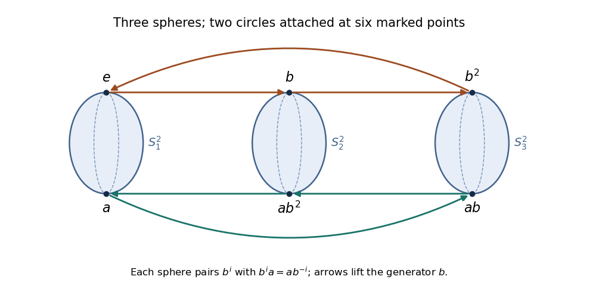

<h1 id="19i/c/i/solution">Solution</h1>

↑ **Parent:** [I](../i.md)

The kernel is a [normal subgroup](../../../../../../../normal-subgroup.md) of index $6$, so the corresponding connected [covering space](../../../../../../../covering-space.md) is regular with six sheets labeled by $S_3$. Write $a=(12)$, $b=(123)$ and use right multiplication for path lifting. Above the [real projective plane](../../../../../../../real-projective-plane.md), right multiplication by $a$ pairs the labels, giving three copies of its two-sheeted [covering space](../../../../../../../covering-space.md) $S^2$. Each [sphere](../../../../../../../sphere.md) has two marked antipodal points corresponding to its pair $\{b^i,b^ia\}$, $i=0,1,2$. Above the [circle](../../../../../../../circle.md), right multiplication by $b$ gives two cycles of length three. Attach their six marked points to the identically labeled points of these three [spheres](../../../../../../../sphere.md).

**[Figure 1](#19i/c/i/image-the-six-sheeted-cover-three-spheres-joined-by-two-lifted-circles). The six-sheeted cover: three spheres joined by two lifted circles**.

The upper [circle](../../../../../../../circle.md) follows $e\to b\to b^2\to e$; the lower follows $a\to ab\to ab^2\to a$. The point paired with $b^i$ is $b^ia=ab^{-i}$, explaining the reversed lower labeling in the figure. On each summand these are genuine [covering maps](../../../../../../../covering-space.md), and the attachment matches the six lifts of the wedge point. A small neighborhood of that point lifts to six disjoint copies of its neighborhood in the wedge. This verifies the [covering space](../../../../../../../covering-space.md) locally, and the action of $a,b$ is transitive, so it is connected. Its stabilizer is $\ker\phi$, identifying this [kernel cover of a real projective plane wedged with a circle](../../../../../../../kernel-cover-of-a-real-projective-plane-wedged-with-a-circle.md).

## ↑ Ancestors (12)

1. [I](../i.md)
2. [C](../../c.md)
3. [19I](../../../19i.md)
4. [Paper 2](../../../../paper-2-split.md)
5. [Ii](../../../../split.md)
6. [2017](../../../../../split.md)
7. [Past exam of the mathematics course of the University of Cambridge](../../../../../../split.md)
8. [Mathematics course of the University of Cambridge](../../../../../../../mathematics-course-of-the-university-of-cambridge.md)
9. [Course of the University of Cambridge](../../../../../../../course-of-the-university-of-cambridge.md)
10. [University of Cambridge](../../../../../../../university-of-cambridge-split.md)
11. [List of universities](../../../../../../../list-of-universities.md)
12. [Codex Wiki](../../../../../../../split.md)
