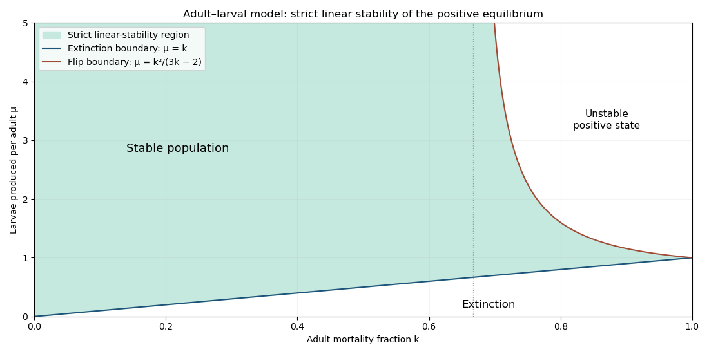
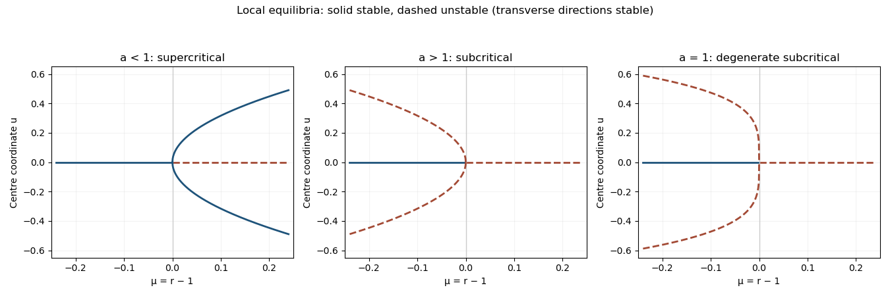
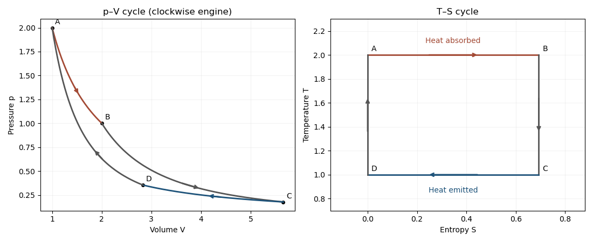

# Paper 3

↑ **Parent:** [Ii](../ii.md)

[https://www.maths.cam.ac.uk/undergrad/pastpapers/files/2017/paperii_3_2.pdf](https://www.maths.cam.ac.uk/undergrad/pastpapers/files/2017/paperii_3_2.pdf)

**Table of contents**

- [1G](#1g)
  - [Solution](#1g/solution)
- [2F](#2f)
  - [a](#2f/a)
    - [Solution](#2f/a/solution)
  - [b](#2f/b)
    - [Solution](#2f/b/solution)
  - [c](#2f/c)
    - [Solution](#2f/c/solution)
- [3G](#3g)
  - [Solution](#3g/solution)
- [4H](#4h)
  - [a](#4h/a)
    - [Solution](#4h/a/solution)
  - [b](#4h/b)
    - [Solution](#4h/b/solution)
  - [c](#4h/c)
    - [Solution](#4h/c/solution)
- [5J](#5j)
  - [Solution](#5j/solution)
- [6B](#6b)
  - [Solution](#6b/solution)
- [7E](#7e)
  - [Solution](#7e/solution)
- [8E](#8e)
  - [Solution](#8e/solution)
- [9C](#9c)
  - [a](#9c/a)
    - [Solution](#9c/a/solution)
  - [b](#9c/b)
    - [Solution](#9c/b/solution)
- [10G](#10g)
  - [a](#10g/a)
    - [Solution](#10g/a/solution)
  - [b](#10g/b)
    - [Solution](#10g/b/solution)
  - [c](#10g/c)
    - [Solution](#10g/c/solution)
  - [d](#10g/d)
    - [Solution](#10g/d/solution)
- [11H](#11h)
  - [a](#11h/a)
    - [Solution](#11h/a/solution)
  - [b](#11h/b)
    - [Solution](#11h/b/solution)
  - [c](#11h/c)
    - [Solution](#11h/c/solution)
- [12B](#12b)
  - [Solution](#12b/solution)
- [13C](#13c)
  - [a](#13c/a)
    - [Solution](#13c/a/solution)
  - [b](#13c/b)
    - [Solution](#13c/b/solution)
- [14H](#14h)
  - [Solution](#14h/solution)
- [15H](#15h)
  - [Solution](#15h/solution)
- [16I](#16i)
  - [a](#16i/a)
    - [Solution](#16i/a/solution)
  - [b](#16i/b)
    - [i](#16i/b/i)
      - [Solution](#16i/b/i/solution)
    - [ii](#16i/b/ii)
      - [Solution](#16i/b/ii/solution)
    - [iii](#16i/b/iii)
      - [Solution](#16i/b/iii/solution)
- [17G](#17g)
  - [a](#17g/a)
    - [Solution](#17g/a/solution)
  - [b](#17g/b)
    - [Solution](#17g/b/solution)
  - [c](#17g/c)
    - [Solution](#17g/c/solution)
- [18I](#18i)
  - [Solution](#18i/solution)
- [19F](#19f)
  - [i](#19f/i)
    - [Solution](#19f/i/solution)
  - [ii](#19f/ii)
    - [Solution](#19f/ii/solution)
  - [iii](#19f/iii)
    - [Solution](#19f/iii/solution)
  - [iv](#19f/iv)
    - [Solution](#19f/iv/solution)
- [20F](#20f)
  - [i](#20f/i)
    - [Solution](#20f/i/solution)
  - [ii](#20f/ii)
    - [Solution](#20f/ii/solution)
  - [iii](#20f/iii)
    - [Solution](#20f/iii/solution)
  - [iv](#20f/iv)
    - [Solution](#20f/iv/solution)
- [21F](#21f)
  - [Solution](#21f/solution)
- [22I](#22i)
  - [a](#22i/a)
    - [Solution](#22i/a/solution)
  - [b](#22i/b)
    - [Solution](#22i/b/solution)
  - [c](#22i/c)
    - [Solution](#22i/c/solution)
- [23I](#23i)
  - [Solution](#23i/solution)
- [24J](#24j)
  - [a](#24j/a)
    - [Solution](#24j/a/solution)
  - [b](#24j/b)
    - [Solution](#24j/b/solution)
  - [c](#24j/c)
    - [Solution](#24j/c/solution)
  - [d](#24j/d)
    - [Solution](#24j/d/solution)
- [25K](#25k)
  - [a](#25k/a)
    - [Solution](#25k/a/solution)
  - [b](#25k/b)
    - [Solution](#25k/b/solution)
- [26K](#26k)
  - [a](#26k/a)
    - [Solution](#26k/a/solution)
  - [b](#26k/b)
    - [Solution](#26k/b/solution)
  - [c](#26k/c)
    - [Solution](#26k/c/solution)
  - [d](#26k/d)
    - [Solution](#26k/d/solution)
- [27J](#27j)
  - [a](#27j/a)
    - [Solution](#27j/a/solution)
  - [b](#27j/b)
    - [Solution](#27j/b/solution)
  - [c](#27j/c)
    - [Solution](#27j/c/solution)
- [28K](#28k)
  - [Solution](#28k/solution)
- [29E](#29e)
  - [Solution](#29e/solution)
- [30A](#30a)
  - [Solution](#30a/solution)
- [31A](#31a)
  - [Solution](#31a/solution)
- [32C](#32c)
  - [Solution](#32c/solution)
- [33C](#33c)
  - [Solution](#33c/solution)
- [34D](#34d)
  - [a](#34d/a)
    - [Solution](#34d/a/solution)
  - [b](#34d/b)
    - [i](#34d/b/i)
      - [Solution](#34d/b/i/solution)
    - [ii](#34d/b/ii)
      - [Solution](#34d/b/ii/solution)
    - [iii](#34d/b/iii)
      - [Solution](#34d/b/iii/solution)
    - [iv](#34d/b/iv)
      - [Solution](#34d/b/iv/solution)
- [35D](#35d)
  - [Solution](#35d/solution)
- [36D](#36d)
  - [i](#36d/i)
    - [Solution](#36d/i/solution)
  - [ii](#36d/ii)
    - [Solution](#36d/ii/solution)
  - [iii](#36d/iii)
    - [Solution](#36d/iii/solution)
  - [iv](#36d/iv)
    - [Solution](#36d/iv/solution)
- [37B](#37b)
  - [Solution](#37b/solution)
- [38B](#38b)
  - [Solution](#38b/solution)
- [39A](#39a)
  - [i](#39a/i)
    - [Solution](#39a/i/solution)
  - [ii](#39a/ii)
    - [Solution](#39a/ii/solution)
  - [iii](#39a/iii)
    - [Solution](#39a/iii/solution)

## 1G

↑ **Parent:** [Paper 3](paper-3.md)

<h3 id="1g/solution">Solution</h3>

↑ **Parent:** [1G](#1g)

An [Euler pseudoprime](../../../number-theory.md#euler-pseudoprime) is an odd [composite number](../../../number-theory.md#composite-number) $N$ with $\gcd(b,N)=1$ satisfying $b^{(N-1)/2}\equiv(\frac bN)\pmod N$, where the right side is the [Jacobi symbol](../../../number-theory.md#jacobi-symbol). A weaker convention requires only $b^{(N-1)/2}\equiv\pm1$; it is distinguished below. A [strong pseudoprime](../../../number-theory.md#strong-pseudoprime), with $N-1=2^s d$ and $d$ odd, satisfies $b^d\equiv1$ or $b^{2^j d}\equiv-1$ for some $0\leq j<s$.

By the [Chinese remainder theorem for unit groups](../../../mathematics.md#chinese-remainder-theorem-for-unit-groups), the [unit group](../../../algebra.md#unit-group) modulo $65$ is $C_4\times C_{12}$. Modulo $5$, $b^{32}=1$. Thus the only possible sign in $b^{32}\equiv\pm1\pmod{65}$ is positive. Modulo $13$, writing $b=g^e$ for a [primitive root](../../../number-theory.md#primitive-root-modulo-n), the condition is $12\mid32e$, equivalently $3\mid e$. Consequently $b$ has [multiplicative order](../../../number-theory.md#multiplicative-order) dividing $4$ in each factor. Its square is either $1$ or $-1$ in each factor, but these signs must agree: modulo $5$, the [Legendre symbol](../../../number-theory.md#legendre-symbol) is $1$ for square $1$ and $-1$ for square $-1$, and the same is true modulo $13$. The [Euler pseudoprime](../../../number-theory.md#euler-pseudoprime) condition additionally requires the product of those [Legendre symbols](../../../number-theory.md#legendre-symbol) to be $1$. Hence

$$
\boxed{65\text{ is an Euler pseudoprime to }b\iff b^2\equiv\pm1\pmod{65}.}
$$

Each sign has two roots modulo each [prime](../../../number-theory.md#prime-number), hence four roots modulo $65$. There are **eight [pseudoprime bases](../../../computer-science.md#pseudoprime-base)** modulo $65$ under the [Jacobi symbol](../../../number-theory.md#jacobi-symbol) convention. Under the weaker sign-only convention there are instead sixteen [pseudoprime bases](../../../computer-science.md#pseudoprime-base), since the two signs of the squares need not agree; the stated equivalence therefore specifically uses the [Jacobi symbol](../../../number-theory.md#jacobi-symbol) convention.

For the [strong pseudoprime](../../../number-theory.md#strong-pseudoprime) condition, $s=6,d=1$. Since the [unit group](../../../algebra.md#unit-group) has [exponent of a finite group](../../../group-theory.md#exponent-of-a-finite-group) $12$, the only possibilities are $b=\pm1$ or $b^2=-1$. The six [pseudoprime bases](../../../computer-science.md#pseudoprime-base) are $1,8,18,47,57,64$. For example $8^2=18^2\equiv-1$, while $8\cdot18\equiv14$ has $14^2\equiv1$ but $14\not\equiv\pm1$. Thus **the strong-pseudoprime [pseudoprime bases](../../../computer-science.md#pseudoprime-base) are not a [subgroup](../../../group.md#subgroup)**.

## 2F

↑ **Parent:** [Paper 3](paper-3.md)

<h3 id="2f/a">a</h3>

↑ **Parent:** [2F](#2f)

<h4 id="2f/a/solution">Solution</h4>

↑ **Parent:** [A](#2f/a)

Let $D$ be the closed unit [disc](../../../topology.md#topological-disc) and set

$$
 f(x)=x-\frac{g(Kx)}K.
$$

The displacement bound gives $\|f(x)\|\leq1$, so $f:D\to D$ is [continuous](../../../calculus.md#continuous-function). The [Brouwer fixed-point theorem](../../../topological-analysis.md#brouwer-fixed-point-theorem) applies because $D$ is nonempty, [compact](../../../topology.md#compact-space) and [convex](../../../real-analysis.md#convex-function). At a [fixed point](../../../function.md#fixed-point) $x_*$, $x_*=x_*-g(Kx_*)/K$. Therefore $\boxed{t=Kx_*,\quad g(t)=0}$.

<h3 id="2f/b">b</h3>

↑ **Parent:** [2F](#2f)

<h4 id="2f/b/solution">Solution</h4>

↑ **Parent:** [B](#2f/b)

For arbitrary $y\in\mathbb R^2$, the [continuous map](../../../topology.md#continuous-map) $g_y(x)=g(x)-y$ satisfies $\|g_y(x)-x\|\leq K+\|y\|$. Applying the preceding [Brouwer fixed-point theorem](../../../topological-analysis.md#brouwer-fixed-point-theorem) argument with this positive bound gives $g_y(t)=0$. Hence $g(t)=y$, and **$g$ is surjective**.

<h3 id="2f/c">c</h3>

↑ **Parent:** [2F](#2f)

<h4 id="2f/c/solution">Solution</h4>

↑ **Parent:** [C](#2f/c)

Let $e=(1,0)$ and define

$$
 g(x)=\begin{cases}e,&x=0,\\x,&x\ne0.\end{cases}
$$

Then $\|g(x)-x\|\leq1$ everywhere, but $0$ is not in the [image of a function](../../../set-theory.md#image-of-a-function). The map is [discontinuous](../../../calculus.md#discontinuity-of-a-function) at $0$, giving **a bounded-displacement map which is not surjective**.

## 3G

↑ **Parent:** [Paper 3](paper-3.md)

<h3 id="3g/solution">Solution</h3>

↑ **Parent:** [3G](#3g)

Identify a binary word with its coefficient [polynomial](../../../polynomial.md) in $R=\mathbb F_2[X]/(X^7-1)$. A [cyclic code](../../../coding-theory.md#cyclic-code) is exactly an [ideal](../../../commutative-algebra.md#ideal) of $R$: closure under multiplication by $X$ is closure under cyclic shift. Its inverse image in the [principal ideal domain](../../../commutative-algebra.md#principal-ideal-domain) $\mathbb F_2[X]$ has a unique monic [generator polynomial of a cyclic code](../../../coding-theory.md#generator-polynomial-of-a-cyclic-code) $g$ dividing $X^7-1$. Put

$$
 a=X+1,\quad b=X^3+X+1,\quad c=X^3+X^2+1;\qquad X^7-1=abc.
$$

The cubics have no root in $\mathbb F_2$, hence are [irreducible polynomials](../../../polynomial.md#irreducible-polynomial). The eight monic [divisors](../../../number-theory.md#divisor) yield all [binary cyclic codes of length seven](../../../coding-theory.md#binary-cyclic-codes-of-length-seven). A code generated by $g$ has [basis](../../../vector-space.md#basis) $g,Xg,\ldots,X^{6-\deg g}g$ and [dimension](../../../vector-space.md#dimension-vector-space) $7-\deg g$, with the zero code treated separately.

For the [dual of a cyclic code](../../../coding-theory.md#dual-of-a-cyclic-code), let $h=(X^7-1)/g$. Orthogonality of coefficient [vectors](../../../vector-space.md#vector) to all cyclic shifts gives the generator $h^*(X)=X^{\deg h}h(X^{-1})$. Here $a^*=a,b^*=c,c^*=b$. Thus the complete pairing, with the respective [dimensions](../../../vector-space.md#dimension-vector-space), is

$$
\boxed{1\ (7)\longleftrightarrow abc\ (0),\quad
 a\ (6)\longleftrightarrow bc\ (1),\quad
 b\ (4)\longleftrightarrow ab\ (3),\quad
 c\ (4)\longleftrightarrow ac\ (3).}
$$

These are respectively the whole-space/zero, even-weight/repetition, and two [Hamming code](../../../coding-theory.md#hamming-code)/[binary simplex code](../../../coding-theory.md#binary-simplex-code) pairs. The reciprocal formula follows because the product of a word [polynomial](../../../polynomial.md) and the reversed [polynomial](../../../polynomial.md) of an orthogonal word has zero coefficients in all cyclic positions; the resulting inclusion has the correct complementary [dimension](../../../vector-space.md#dimension-vector-space), hence is equality.

## 4H

↑ **Parent:** [Paper 3](paper-3.md)

<h3 id="4h/a">a</h3>

↑ **Parent:** [4H](#4h)

<h4 id="4h/a/solution">Solution</h4>

↑ **Parent:** [A](#4h/a)

In strict [Chomsky normal form](../../../foundations-of-mathematics.md#chomsky-normal-form), every production of a [context-free grammar](../../../foundations-of-mathematics.md#context-free-grammar) is $A\to BC$ or $A\to a$, with $A,B,C$ [nonterminal symbols](../../../foundations-of-mathematics.md#nonterminal-symbol) and $a$ a [terminal symbol](../../../foundations-of-mathematics.md#terminal-symbol). Such a derivation cannot produce the [empty word](../../../foundations-of-mathematics.md#empty-word): it starts with one [nonterminal symbol](../../../foundations-of-mathematics.md#nonterminal-symbol), and every step either increases the symbol count or replaces one symbol by one symbol. The [context-free language](../../../foundations-of-mathematics.md#context-free-language) $\{\varepsilon\}$, generated by $S\to\varepsilon$, is therefore **not generated by any strict CNF grammar**.

The convention matters: extended [Chomsky normal form](../../../foundations-of-mathematics.md#chomsky-normal-form) permits $S\to\varepsilon$ with $S$ excluded from right-hand sides. Under that convention every [context-free language](../../../foundations-of-mathematics.md#context-free-language) has such a grammar, so the requested example would not exist.

<h3 id="4h/b">b</h3>

↑ **Parent:** [4H](#4h)

<h4 id="4h/b/solution">Solution</h4>

↑ **Parent:** [B](#4h/b)

The [context-free languages](../../../foundations-of-mathematics.md#context-free-language) $L_1=\{a^n b^n c^m:n,m\geq0\}$ and $L_2=\{a^m b^n c^n:n,m\geq0\}$ have [context-free grammars](../../../foundations-of-mathematics.md#context-free-grammar) $S\to TC$, $T\to aTb\mid\varepsilon$, $C\to cC\mid\varepsilon$, and $S\to AT$, $A\to aA\mid\varepsilon$, $T\to bTc\mid\varepsilon$, respectively.

Their [intersection](../../../set.md#set-intersection) is $L=\{a^n b^n c^n:n\geq0\}$. Suppose $L$ satisfied the [pumping lemma for context-free languages](../../../foundations-of-mathematics.md#pumping-lemma-for-context-free-languages) with length $p$. In a decomposition $a^p b^p c^p=uvwxy$ with $|vwx|\leq p$ and $|vx|>0$, the window $vwx$ cannot meet both the $a$ and $c$ blocks. Pumping down changes at least one count and leaves at least one count unchanged. Thus the three counts are unequal, or the word order is invalid, contrary to the [pumping lemma for context-free languages](../../../foundations-of-mathematics.md#pumping-lemma-for-context-free-languages). Hence **CFLs are not closed under [intersection](../../../set.md#set-intersection)**.

<h3 id="4h/c">c</h3>

↑ **Parent:** [4H](#4h)

<h4 id="4h/c/solution">Solution</h4>

↑ **Parent:** [C](#4h/c)

[Context-free languages](../../../foundations-of-mathematics.md#context-free-language) are closed under [union](../../../set.md#set-union): use a new start symbol with alternatives for two renamed [context-free grammars](../../../foundations-of-mathematics.md#context-free-grammar). If they were closed under [complement](../../../set.md#complement-of-a-set) in $\Sigma^*$, [De Morgan's laws](../../../computer-science.md#de-morgan-s-laws) would give

$$
 L_1\cap L_2=\Sigma^*\setminus\bigl((\Sigma^*\setminus L_1)\cup(\Sigma^*\setminus L_2)\bigr),
$$

contradicting the preceding [intersection](../../../set.md#set-intersection) example. Therefore **some CFL has a non-context-free [complement](../../../set.md#complement-of-a-set)**. This is an existence argument; it does not assert that both [complements](../../../set.md#complement-of-a-set) of the particular $L_1,L_2$ are non-context-free.

A concrete choice is $L=\{a,b,c\}^*\setminus\{a^n b^n c^n:n\geq0\}$. Words outside $a^*b^*c^*$ form a [regular language](../../../foundations-of-mathematics.md#regular-language). Among words inside it, membership in $L$ means the first two counts or the last two counts differ. Each unequal-count comparison has a [context-free grammar](../../../foundations-of-mathematics.md#context-free-grammar): for $a^i b^j$ with $i>j$, use $T\to aTb\mid A$, $A\to aA\mid a$; for $i<j$, replace $A$ by $B\to bB\mid b$. Append any number of $c$'s, or prefix any number of $a$'s for the analogous $b,c$ comparison. Taking these [unions](../../../set.md#set-union) gives a [context-free language](../../../foundations-of-mathematics.md#context-free-language) whose [complement](../../../set.md#complement-of-a-set) is the non-context-free equal-three-count language. These productions are definitions of the example, not a restriction to strict [Chomsky normal form](../../../foundations-of-mathematics.md#chomsky-normal-form).

## 5J

↑ **Parent:** [Paper 3](paper-3.md)

<h3 id="5j/solution">Solution</h3>

↑ **Parent:** [5J](#5j)

Write $\ell(\beta)$ for the [log-likelihood](../../../statistical-modelling.md#log-likelihood) and $U=\nabla\ell$ for the [score function](../../../statistical-modelling.md#informant-function). [Newton method](../../../mathematical-optimization.md#newton-s-method-in-optimization) uses the [Observed Fisher information](../../../statistical-modelling.md#observed-fisher-information) $M=-\nabla^2\ell$; [Fisher scoring](../../../statistical-modelling.md#scoring-algorithm) uses the [Fisher information](../../../statistical-modelling.md#fisher-information-matrix) $M=\mathbb E_\beta[-\nabla^2\ell]$.

For independent responses in an [exponential family](../../../exponential-family.md), with fixed [dispersion parameter](../../../exponential-family.md#dispersion-parameter) and fixed weights $a_i$, a [canonical link function](../../../statistical-modelling.md#canonical-link-function) gives $\theta_i=x_i^T\beta$ and

$$
 \ell(\beta)=\sum_i\frac{y_i\theta_i-b(\theta_i)}{a_i}+\sum_i c_i(y_i),\qquad
 U=\sum_i\frac{x_i(y_i-b'(\theta_i))}{a_i},\qquad
 -\nabla^2\ell=\sum_i\frac{b''(\theta_i)}{a_i}x_ix_i^T.
$$

The last [matrix](../../../vector-space.md#matrix) depends on $\beta$ but not on the responses, so taking its [expectation](../../../probability-theory.md#expected-value) leaves it unchanged. Hence **the two updates are identical**, wherever this [Fisher information matrix](../../../statistical-modelling.md#fisher-information-matrix) is invertible. Equivalently both solve the same [iteratively reweighted least squares](../../../statistical-modelling.md#iteratively-reweighted-least-squares) problem. This statement concerns the regression coefficients at a fixed [dispersion parameter](../../../exponential-family.md#dispersion-parameter); a joint update of an unknown [dispersion parameter](../../../exponential-family.md#dispersion-parameter) need not have identical observed and expected full [Fisher information matrices](../../../statistical-modelling.md#fisher-information-matrix).

## 6B

↑ **Parent:** [Paper 3](paper-3.md)

<h3 id="6b/solution">Solution</h3>

↑ **Parent:** [6B](#6b)

In the [birth-death master equation](../../../markov-process.md#birth-death-master-equation), The upward jump has rate $\lambda$ and the downward jump rate $\beta x$, so the first two jump moments per unit time are $A(x)=\lambda-\beta x$ and $B(x)=\lambda+\beta x$. The second-order [Kramers-Moyal expansion](../../../mathematical-biology.md#kramers-moyal-expansion) gives the [diffusion approximation of a birth-death process](../../../markov-process.md#diffusion-approximation-of-a-birth-death-process)

$$
\boxed{\partial_tP=-\partial_x[(\lambda-\beta x)P]+\frac12\partial_x^2[(\lambda+\beta x)P].}
$$

For the associated [Fokker-Planck equation](../../../probability-theory.md#fokker-planck-equation), integrating by parts with vanishing moment boundary terms gives $d\langle f\rangle/dt=\langle Af'+\tfrac12Bf''\rangle$. Taking $f=x,x^2$ yields

$$
\boxed{\frac{d\langle x\rangle}{dt}=\lambda-\beta\langle x\rangle,\qquad
\frac{d\langle x^2\rangle}{dt}=-2\beta\langle x^2\rangle+(2\lambda+\beta)\langle x\rangle+\lambda.}
$$

For example, if $m_0=\langle x(0)\rangle$, then $m(t)=\lambda/\beta+(m_0-\lambda/\beta)e^{-\beta t}$, while the [variance](../../../variance.md) satisfies $v'=-2\beta v+\lambda+\beta m$. The two boxed [moment equations](../../../mathematical-biology.md#moment-equation) also follow exactly from the discrete [Markov jump-process generator](../../../markov-process.md#markov-jump-process-generator), since quadratic functions have no higher jump terms. A reflecting diffusion confined to $x\geq0$ can have extra boundary contributions; the formal approximation near extinction is not an exact replacement for the discrete process.

## 7E

↑ **Parent:** [Paper 3](paper-3.md)

<h3 id="7e/solution">Solution</h3>

↑ **Parent:** [7E](#7e)

After division by $z$, the coefficients are $P=2/z-1$ and $Q=-1/z$. At $0$, $zP$ and $z^2Q$ are [analytic functions](../../../complex-analysis.md#space-of-holomorphic-functions), so $0$ is a [regular singular point](../../../complex-analysis.md#regular-singular-point). Its [indicial equation](../../../differential-equation.md#indicial-equation) is $r(r-1)+2r=r(r+1)=0$. There are no other finite [singular points of a differential equation](../../../differential-equation.md#singular-point-of-a-differential-equation). At infinity the [regular singular point criterion for a second-order equation](../../../complex-analysis.md#regular-singular-point-criterion-for-a-second-order-equation) would require $P=O(z^{-1})$, but $P\to-1$; hence infinity is an [irregular singular point](../../../complex-analysis.md#irregular-singular-point).

Substituting $y=f/z$ reduces the equation to $f''-f'=0$, so

$$
\boxed{y(z)=\frac{A+B e^z}{z},\qquad z\ne0.}
$$

A [linearly independent](../../../vector-space.md#linear-independence) pair is $1/z$ and $(e^z-1)/z$. Their [Wronskian](../../../differential-equation.md#wronskian) is $e^z/z^2\ne0$. The second has a removable singularity at $0$ and value $1$, whereas the first has a simple pole, agreeing with the two [characteristic exponents at a regular singular point](../../../complex-analysis.md#characteristic-exponent-at-a-regular-singular-point), $0,-1$. The [integer](../../../number-theory.md#integer) difference does not require a [logarithm](../../../calculus.md#logarithm). At infinity $e^z/z$ has an [essential singularity](../../../isolated-singularity.md#essential-singularity), consistent with the [irregular singular point](../../../complex-analysis.md#irregular-singular-point); the existence of the simpler solution $1/z$ does not make infinity regular.

## 8E

↑ **Parent:** [Paper 3](paper-3.md)

<h3 id="8e/solution">Solution</h3>

↑ **Parent:** [8E](#8e)

[Liouville integrability](../../../classical-mechanics.md#integrable-hamiltonian-system) on a $2n$-dimensional [symplectic manifold](../../../symplectic-geometry.md#symplectic-manifold) means that there are $n$ functionally independent [first integrals](../../../differential-equation.md#first-integral), including $H$, whose pairwise [Poisson brackets](../../../classical-mechanics.md#poisson-bracket) vanish. Near a [compact](../../../topology.md#compact-space) connected regular common level [set](../../../set.md), the [Arnold-Liouville theorem](../../../classical-mechanics.md#liouville-arnold-theorem) gives [action-angle variables](../../../classical-mechanics.md#action-angle-variables) $(J_i,\theta_i)$ with $J_i=(2\pi)^{-1}\oint p\,dq$, $\theta_i$ periodic modulo $2\pi$, $H=H(J)$, $\dot J_i=0$ and $\dot\theta_i=\partial H/\partial J_i$.

For a frozen [mass](../../../classical-mechanics.md#mass), the turning point is $q_*=(2E)^{1/(2k)}$. The [action variable](../../../classical-mechanics.md#action-variable) is

$$
 J=\frac{2}{\pi}\int_0^{q_*}\sqrt{2m(E-q^{2k}/2)}\,dq
 =C_k m^{1/2}E^{(k+1)/(2k)},\quad
 C_k=\frac{2\sqrt2\,2^{1/(2k)}}{\pi}\int_0^1\sqrt{1-s^{2k}}\,ds.
$$

[Adiabatic invariance of the action](../../../classical-mechanics.md#adiabatic-invariance-of-the-action) holds to leading order when the [mass](../../../classical-mechanics.md#mass) varies slowly compared with an orbital period, away from degenerating [orbits](../../../dynamical-systems.md#orbit-dynamical-system). Keeping $J$ fixed gives

$$
\boxed{E(t)\propto m(t)^{-k/(k+1)},\qquad c=-\frac{k}{k+1}.}
$$

For $k=1$ this agrees with $E=\omega J$ and $\omega\propto m^{-1/2}$.

## 9C

↑ **Parent:** [Paper 3](paper-3.md)

<h3 id="9c/a">a</h3>

↑ **Parent:** [9C](#9c)

<h4 id="9c/a/solution">Solution</h4>

↑ **Parent:** [A](#9c/a)

[Chemical equilibrium](../../../thermodynamics.md#chemical-equilibrium) imposes $\mu_e+\mu_p=\mu_H+\mu_\gamma$. For blackbody [photons](../../../quantum-mechanics.md#photon), $\mu_\gamma=0$. Define the positive [Hydrogen binding energy](../../../cosmology.md#hydrogen-binding-energy) by $I=(m_e+m_p-m_H)c^2$, approximately $13.6\,\mathrm{eV}$. Multiplying the two [Maxwell-Boltzmann distribution](../../../statistical-physics.md#maxwell-boltzmann-distribution) number densities and dividing by the neutral-hydrogen density gives

$$
 \frac{n_en_p}{n_H}=\frac{g_eg_p}{g_H}
 \left(\frac{2\pi kT}{h^2}\frac{m_em_p}{m_H}\right)^{3/2}e^{-I/(kT)}.
$$

Use $g_eg_p/g_H=1$ and $m_p/m_H\simeq1$ to obtain the [Saha ionization equation](../../../cosmology.md#saha-ionization-equation)

$$
\boxed{\frac{n_en_p}{n_H}=\left(\frac{2\pi m_e kT}{h^2}\right)^{3/2}e^{-I/(kT)}.}
$$

The assumptions are nonrelativistic, dilute, nondegenerate species at a common [temperature](../../../thermodynamics.md#temperature), ground-state hydrogen with the stated [degeneracy factors](../../../statistical-physics.md#degeneracy-factor), negligible [mass](../../../classical-mechanics.md#mass) correction in the prefactor, and sufficiently rapid reactions to maintain [chemical equilibrium](../../../thermodynamics.md#chemical-equilibrium).

<h3 id="9c/b">b</h3>

↑ **Parent:** [9C](#9c)

<h4 id="9c/b/solution">Solution</h4>

↑ **Parent:** [B](#9c/b)

The [baryon-to-photon ratio](../../../cosmology.md#baryon-to-photon-ratio) is extremely small, of order $10^{-9}$. Thus even when the typical [photon](../../../quantum-mechanics.md#photon) [energy](../../../classical-mechanics.md#energy) is below $I$, the high-[energy](../../../classical-mechanics.md#energy) tail of the [blackbody radiation](../../../statistical-physics.md#black-body-radiation) contains enough [photons](../../../quantum-mechanics.md#photon) above the [ionization energy](../../../physics.md#ionization-energy) to reionize almost every newly formed [hydrogen atom](../../../physics.md#hydrogen-atom). [Cosmological recombination](../../../cosmology.md#recombination-cosmology) becomes effective only when this exponentially small tail is also small compared with the [baryon-to-photon ratio](../../../cosmology.md#baryon-to-photon-ratio). Consequently **recombination occurs at a [temperature](../../../thermodynamics.md#temperature) much lower than $I/k$**, consistent with $kT\simeq0.03I$. The exact freeze-out history also depends on reaction rates and expansion; the equilibrium estimate explains the large suppression of the [temperature](../../../thermodynamics.md#temperature).

## 10G

↑ **Parent:** [Paper 3](paper-3.md)

<h3 id="10g/a">a</h3>

↑ **Parent:** [10G](#10g)

<h4 id="10g/a/solution">Solution</h4>

↑ **Parent:** [A](#10g/a)

Set $p_{-2}=0,p_{-1}=1,q_{-2}=1,q_{-1}=0$ and define the [continued fraction convergents](../../../number-theory.md#continued-fraction-convergent) by

$$
 p_n=a_np_{n-1}+p_{n-2},\qquad q_n=a_nq_{n-1}+q_{n-2},\qquad
 \frac{p_n}{q_n}=[a_0;\ldots,a_n].
$$

The recurrence reverses the sign of $p_nq_{n-1}-p_{n-1}q_n$, whose initial value at $n=0$ is $-1$. Hence $p_nq_{n-1}-p_{n-1}q_n=(-1)^{n-1}$. Every common [divisor](../../../number-theory.md#divisor) of $p_n,q_n$ divides this number, proving $\boxed{\gcd(p_n,q_n)=1}$.

<h3 id="10g/b">b</h3>

↑ **Parent:** [10G](#10g)

<h4 id="10g/b/solution">Solution</h4>

↑ **Parent:** [B](#10g/b)

Let $D_n=p_{n-1}q_{n-2}-p_{n-2}q_{n-1}=(-1)^{n-2}$. Solving the given [Möbius transformation](../../../group-theory.md#mobius-transformation) for the [complete quotient](../../../number-theory.md#complete-quotient) and rationalizing gives

$$
 \theta_n=\frac{p_{n-2}-\sqrt d\,q_{n-2}}{\sqrt d\,q_{n-1}-p_{n-1}}
 =\frac{D_n\sqrt d+dq_{n-1}q_{n-2}-p_{n-1}p_{n-2}}
 {p_{n-1}^2-dq_{n-1}^2}.
$$

Therefore

$$
\boxed{s_n=\frac{p_{n-1}^2-dq_{n-1}^2}{D_n},\qquad
 r_n=\frac{dq_{n-1}q_{n-2}-p_{n-1}p_{n-2}}{D_n}.}
$$

The denominator $D_n$ is $\pm1$, so both are [integers](../../../number-theory.md#integer). The [algebraic norm](../../../algebraic-number-theory.md#algebraic-norm) denominator is nonzero because $\sqrt d$ is an [irrational number](../../../algebra.md#irrational-number).

<h3 id="10g/c">c</h3>

↑ **Parent:** [10G](#10g)

<h4 id="10g/c/solution">Solution</h4>

↑ **Parent:** [C](#10g/c)

Use the periodic [continued fraction](../../../number-theory.md#continued-fraction) $\sqrt d=[a_0;\overline{a_1,\ldots,a_m}]$. A direct [matrix](../../../vector-space.md#matrix) argument avoids any assumption about the parity of the period. Let

$$
 T(a)=\begin{pmatrix}a&1\\1&0\end{pmatrix},\quad
 M=T(a_1)\cdots T(a_m),\quad B=T(a_0),\quad N=BMB^{-1}.
$$

Periodicity says that $M$ fixes $\theta_1$ as a [Möbius transformation](../../../group-theory.md#mobius-transformation), while $B$ takes $\theta_1$ to $\sqrt d$. Thus $N=\begin{pmatrix}A&B_1\\C&D\end{pmatrix}$ has [integer](../../../number-theory.md#integer) entries and fixes $\sqrt d$. Equating rational and irrational parts in $A\sqrt d+B_1=\sqrt d(C\sqrt d+D)$ gives $A=D,B_1=dC$. Consequently

$$
 A^2-dC^2=\det N=(-1)^m.
$$

The [eigenvalue](../../../linear-operator-theory.md#eigenvalue) of $M$ on $(\theta_1,1)^T$ is its denominator $M_{21}\theta_1+M_{22}>1$; this uses $a_i\geq1$ and $\theta_1>1$, including the one-term period. The corresponding [eigenvalue](../../../linear-operator-theory.md#eigenvalue) of $N$ is $A+C\sqrt d>1$. If the [algebraic norm](../../../algebraic-number-theory.md#algebraic-norm) is $-1$, square this unit; otherwise keep it. In either case there is a unit $u=X+Y\sqrt d>1$ of [algebraic norm](../../../algebraic-number-theory.md#algebraic-norm) $1$ with [integer](../../../number-theory.md#integer) $X,Y$. Its powers have [integer](../../../number-theory.md#integer) coefficients and [algebraic norm](../../../algebraic-number-theory.md#algebraic-norm) $1$, and are distinct since $u^j$ strictly increases. Hence **Pell's equation has infinitely many [integer](../../../number-theory.md#integer) solutions**.

<h3 id="10g/d">d</h3>

↑ **Parent:** [10G](#10g)

<h4 id="10g/d/solution">Solution</h4>

↑ **Parent:** [D](#10g/d)

The [continued fraction convergents](../../../number-theory.md#continued-fraction-convergent) of $\sqrt{67}$ begin $8,41/5,90/11,131/16,221/27$. The last one yields

$$
\boxed{x=221,\qquad y=27,\qquad 221^2-67\cdot27^2=48841-48843=-2.}
$$

Changing either sign gives another valid [integer](../../../number-theory.md#integer) solution.

## 11H

↑ **Parent:** [Paper 3](paper-3.md)

<h3 id="11h/a">a</h3>

↑ **Parent:** [11H](#11h)

<h4 id="11h/a/solution">Solution</h4>

↑ **Parent:** [A](#11h/a)

A [many-one reduction](../../../foundations-of-mathematics.md#many-one-reduction) $A\leq_mB$ is a [total computable function](../../../foundations-of-mathematics.md#total-computable-function) $f:\mathbb N\to\mathbb N$ with $x\in A\iff f(x)\in B$. If $B$ is [recursively enumerable](../../../foundations-of-mathematics.md#recursively-enumerable-set), compute $f(x)$ and run a semidecision procedure for $B$ on that value. It halts exactly when $x\in A$, so **$A$ is [recursively enumerable](../../../foundations-of-mathematics.md#recursively-enumerable-set)**. Totality of $f$ is essential to this argument.

<h3 id="11h/b">b</h3>

↑ **Parent:** [11H](#11h)

<h4 id="11h/b/solution">Solution</h4>

↑ **Parent:** [B](#11h/b)

The [S-m-n theorem](../../../foundations-of-mathematics.md#smn-theorem) says that parameters can be compiled effectively into program indices: for a standard effective numbering, there is a [total computable function](../../../foundations-of-mathematics.md#total-computable-function) $s_m^n$ with $\varphi_{s_m^n(e,\mathbf a)}(\mathbf x)=\varphi_e(\mathbf a,\mathbf x)$ for partial computable functions of $m+n$ arguments.

Write $K=\{e:\varphi_e(e)\text{ halts}\}$, a [recursively enumerable](../../../foundations-of-mathematics.md#recursively-enumerable-set) [halting problem](../../../foundations-of-mathematics.md#halting-problem). If $X$ is [recursively enumerable](../../../foundations-of-mathematics.md#recursively-enumerable-set), make a program with parameter $x$ which ignores its input and runs a semidecision procedure for $x\in X$, halting when that procedure halts. By the [S-m-n theorem](../../../foundations-of-mathematics.md#smn-theorem) its index $f(x)$ is total computable and $f(x)\in K\iff x\in X$. Conversely, $X\leq_mK$ implies that $X$ is [recursively enumerable](../../../foundations-of-mathematics.md#recursively-enumerable-set) by the previous construction. Thus $\boxed{X\text{ is r.e.}\iff X\leq_mK}$.

<h3 id="11h/c">c</h3>

↑ **Parent:** [11H](#11h)

<h4 id="11h/c/solution">Solution</h4>

↑ **Parent:** [C](#11h/c)

Use uniform finite-stage enumerations $W_{n,s}$ and $K_s$. Define a uniformly [recursively enumerable](../../../foundations-of-mathematics.md#recursively-enumerable-set) [set](../../../set.md)

$$
 V_n=\{x:\exists s\ (x\in K_s\text{ and }x<|W_{n,s}|)\}.
$$

The [S-m-n theorem](../../../foundations-of-mathematics.md#smn-theorem) supplies a total computable index function $f$ with $W_{f(n)}=V_n$. If $W_n$ is finite of size $h$, then $V_n\subseteq\{0,\ldots,h-1\}$, so $V_n$ is [recursive](../../../foundations-of-mathematics.md#computable-set). If $W_n$ is infinite, then for every $x\in K$ a sufficiently late stage has both $x\in K_s$ and $|W_{n,s}|>x$, while no $x\notin K$ is ever enumerated. Hence $V_n=K$, which is not [recursive](../../../foundations-of-mathematics.md#computable-set). Therefore $\boxed{n\in P\iff f(n)\in Q,\quad P\leq_mQ}$. As usual the effective numbering indexes all programs; if malformed codes are included, send them to a fixed index of $K$.

## 12B

↑ **Parent:** [Paper 3](paper-3.md)

<h3 id="12b/solution">Solution</h3>

↑ **Parent:** [12B](#12b)

A fraction $1-k$ of adults survives each time step; $k$ is the adult mortality fraction. Adults produce $\mu a_n$ larvae, which mature one step later with recruitment reduced by adult-dependent competition through $1/(1+a_n)$. Eliminating larvae gives the [second-order difference equation](../../../dynamical-systems.md#second-order-difference-equation)

$$
 a_{n+1}=(1-k)a_n+\frac{\mu a_{n-1}}{1+a_n}.
$$

At an [equilibrium point](../../../dynamical-systems.md#equilibrium-point-of-a-dynamical-system), either $(a,b)=(0,0)$ or

$$
 \boxed{a_*=\frac\mu k-1,\qquad b_*=\mu\left(\frac\mu k-1\right),\qquad \mu>k.}
$$

Only nonnegative populations are admissible. At extinction the [Jacobian matrix](../../../calculus.md#jacobian-matrix) is $\begin{pmatrix}1-k&1\\\mu&0\end{pmatrix}$ and its [characteristic polynomial](../../../linear-operator-theory.md#characteristic-polynomial) is $\lambda^2-(1-k)\lambda-\mu$. Its positive root exceeds $1$ exactly when $\mu>k$. For $0<\mu<k$ both roots have modulus less than $1$; at $\mu=k$ the roots are $1,-k$, so linearization is marginal. On the nonnegative [state space](../../../dynamical-systems.md#state-space) extinction is still attracting at this equality: if two consecutive adult values are bounded by $M>0$, the next is at most $(1-k)M+kM/(1+a_n)\leq M$, with strict decrease away from zero; the maximum of two consecutive adult values strictly decreases after two steps whenever it is positive; continuity on its bounded state region then excludes a positive limiting maximum. Thus the extinction [equilibrium point](../../../dynamical-systems.md#equilibrium-point-of-a-dynamical-system) is unstable exactly when the positive [equilibrium point](../../../dynamical-systems.md#equilibrium-point-of-a-dynamical-system) exists, with equality understood through nonlinear rather than strict linear stability.

At the positive [equilibrium point](../../../dynamical-systems.md#equilibrium-point-of-a-dynamical-system), the trace and [determinant](../../../linear-algebra.md#determinant) of the [Jacobian matrix](../../../calculus.md#jacobian-matrix) are $T=1-2k+k^2/\mu$ and $-k$. The [Jury stability criterion](../../../dynamical-systems.md#jury-stability-criterion) for $\lambda^2-T\lambda-k$ requires $1-T-k>0$, $1+T-k>0$ and $1-k>0$. The strict [linear stability analysis](../../../dynamical-systems.md#linear-stability) conditions are

$$
\boxed{\mu>k,\qquad (3k-2)\mu<k^2.}
$$

For $k\leq2/3$ there is no upper bound on $\mu$; for $k>2/3$ the stable region is $k<\mu<k^2/(3k-2)$.

**[Figure 1](#12b/image-stability-regions-and-equilibrium-branches). Stability regions and equilibrium branches**.

At the lower boundary $\mu=k$, the positive [equilibrium point](../../../dynamical-systems.md#equilibrium-point-of-a-dynamical-system) merges with extinction, with a multiplier $+1$ and slow recovery. At the upper boundary a multiplier reaches $-1$ (the other is $k$), giving alternating adult/larval fluctuations. The nonlinear map confirms a supercritical [period-doubling bifurcation](../../../dynamical-systems.md#period-doubling-bifurcation), as follows. For $k>2/3$, put $h=1-k$ and $\mu_c=k^2/(3k-2)$. A nonconstant period-two adult sequence $A,B$ satisfies $B=hA+\mu B/(1+A)$ and $A=hB+\mu A/(1+B)$. Subtracting and adding these equations gives

$$
 S=A+B=\frac{\mu-1-h}{h},\qquad P=AB=\frac{hS(S+1)}{1+h},\qquad
 (A-B)^2=\frac{S[(1-3h)S-4h]}{1+h}.
$$

Thus positive unequal values emerge for $\mu>\mu_c$, with amplitude proportional to $\sqrt{\mu-\mu_c}$. The two larval phases are $\mu B,\mu A$. If $T_2,\Delta_2$ are the trace and determinant of the two-step [Jacobian matrix](../../../calculus.md#jacobian-matrix), direct multiplication gives

$$
 \Delta_2=\frac{(1+h)\mu}{S+1},\qquad
 1-T_2+\Delta_2=\frac{Sh(1+h)[(1-3h)S-4h]}{(S+1)\mu}>0.
$$

At onset $\Delta_2=k^2<1$ and $T_2=1+k^2$, so the other two strict [Jury stability criterion](../../../dynamical-systems.md#jury-stability-criterion) inequalities hold for sufficiently small positive $\mu-\mu_c$. Hence **just beyond the upper boundary, a stable period-two population cycle replaces the stable equilibrium**. This is a local conclusion, not stability for arbitrarily large reproduction rates.

At the upper boundary itself, the positive [equilibrium point](../../../dynamical-systems.md#equilibrium-point-of-a-dynamical-system) is still locally asymptotically stable, despite its multiplier $-1$. To decide this equality case, apply the [centre manifold theorem for a discrete dynamical system](../../../dynamical-systems.md#centre-manifold-theorem-for-a-discrete-dynamical-system). Put $u=a-a_*$ and write the centre graph as $b-b_*=H(u)$ with $H'(0)=-\mu_c$. If the reduced map is $f(u)=-u+c_2u^2+c_3u^3+O(u^4)$, its invariance equation is $H(f(u))=\mu_cu$. Expanding the original recruitment map and this equation through cubic order gives

$$
c_2=\frac{(2-k)(3k-2)}{k(1-k)},\qquad
c_3+c_2^2=\frac{(2-k)(3k-2)^2}{k^2(k+1)}>0.
$$

Consequently $f^2(u)=u-2(c_3+c_2^2)u^3+O(u^4)$. The [stability at a nondegenerate flip bifurcation](../../../dynamical-systems.md#stability-at-a-nondegenerate-flip-bifurcation) criterion shows algebraic attraction on the centre direction; the transverse multiplier $k$ has [modulus](../../../complex-analysis.md#modulus) less than one. Including this boundary, the complete local asymptotic-stability condition for a positive population is therefore

$$
\boxed{\mu>k,\qquad (3k-2)\mu\leq k^2.}
$$

The shaded figure shows the strict linear-stability region; its upper boundary adds this nonhyperbolic attracting case.

[Demographic stochasticity](../../../mathematical-biology.md#demographic-stochasticity) near the lower boundary can lead to absorption at extinction; near the upper boundary it excites alternating fluctuations and can blur the deterministic [period-doubling bifurcation](../../../dynamical-systems.md#period-doubling-bifurcation). These qualitative predictions depend on the chosen stochastic recruitment and mortality rules.

## 13C

↑ **Parent:** [Paper 3](paper-3.md)

<h3 id="13c/a">a</h3>

↑ **Parent:** [13C](#13c)

<h4 id="13c/a/solution">Solution</h4>

↑ **Parent:** [A](#13c/a)

With constant [masses](../../../classical-mechanics.md#mass), differentiate the [moment of inertia](../../../classical-mechanics.md#moment-of-inertia) twice:

$$
 \frac12I''=\sum_i m_i\dot r_i^2+\sum_i m_i r_i\cdot\ddot r_i=2K+\sum_i r_i\cdot F_i.
$$

For each pair, $F_{ij}=-Gm_im_j(r_i-r_j)/|r_i-r_j|^3$ and $F_{ji}=-F_{ij}$. Hence its contribution is $(r_i-r_j)\cdot F_{ij}=-Gm_im_j/|r_i-r_j|=V_{ij}$. Summing over unordered pairs gives $\sum r_i\cdot F_i=V$. Time-averaging over $[0,T]$ yields

$$
 2\overline K_T+\overline V_T=\frac{I'(T)-I'(0)}{2T}.
$$

For a bound system with $I'(T)=o(T)$, or a stationary equilibrium with zero average left-hand [derivative](../../../calculus.md#derivative), the [limit](../../../calculus.md#limit-of-a-function) is the [virial theorem](../../../classical-mechanics.md#virial-theorem)

$$
\boxed{2\langle K\rangle+\langle V\rangle=0.}
$$

Bounded spatial extent together with bounded [velocities](../../../classical-mechanics.md#velocity) suffices for the [derivative](../../../calculus.md#derivative) condition; possible gravitational collisions must be excluded or otherwise regularized.

<h3 id="13c/b">b</h3>

↑ **Parent:** [13C](#13c)

<h4 id="13c/b/solution">Solution</h4>

↑ **Parent:** [B](#13c/b)

For the initially homogeneous [sphere](../../../geometry-and-topology.md#sphere), $V_i=-3GM^2/(5R_i)$ and $K_i=0$. [Conservation of energy](../../../physics.md#conservation-of-energy) and the [virial theorem](../../../classical-mechanics.md#virial-theorem) imply $E_f=V_f/2=V_i$, hence $V_f=2V_i$. With the usual homologous-[sphere](../../../geometry-and-topology.md#sphere) approximation, $V\propto-1/R$, so

$$
\boxed{R_f=R_i/2,\qquad \rho_f=8\rho_i.}
$$

These are the conventional collapse estimates. A final virial equilibrium is not, by itself, guaranteed to remain homogeneous: if $V_f=-\alpha_f GM^2/R_f$, the actual relation is $R_f/R_i=\alpha_f/(2\alpha_i)$ with $\alpha_i=3/5$. Thus the factor of two applies exactly to the gravitational radius, and to the outer radius only under the stated structural approximation.

Here “non-interacting” means collisionless apart from gravity. Baryonic gas can collide, convert ordered motion to thermal [energy](../../../classical-mechanics.md#energy), and radiate it. If [radiative cooling](../../../thermodynamics.md#radiative-cooling) is effective, the fixed-[energy](../../../classical-mechanics.md#energy) virial state loses [pressure](../../../thermodynamics.md#pressure) support and contracts further. **Baryonic cooling can destabilize the collisionless virial state**; baryons are not inevitably unstable if cooling is slow or heating and [pressure](../../../thermodynamics.md#pressure) support maintain equilibrium.

## 14H

↑ **Parent:** [Paper 3](paper-3.md)

<h3 id="14h/solution">Solution</h3>

↑ **Parent:** [14H](#14h)

[Zorn lemma](../../../set-theory.md#zorn-s-lemma) states that a [partially ordered set](../../../set.md#partially-ordered-set) in which every [chain in a partially ordered set](../../../set.md#chain-in-a-partially-ordered-set) has an upper bound has a [maximal element](../../../set.md#maximal-element-of-a-partially-ordered-set). Include the empty [chain in a partially ordered set](../../../set.md#chain-in-a-partially-ordered-set), so the hypotheses imply that the [set](../../../set.md) $P$ is nonempty. Suppose there were no [maximal element](../../../set.md#maximal-element-of-a-partially-ordered-set). Every [chain in a partially ordered set](../../../set.md#chain-in-a-partially-ordered-set) $C$ has an upper bound $u$, and some $v>u$; therefore the [set](../../../set.md) of elements strictly above every member of $C$ is nonempty. The [axiom of choice](../../../set-theory.md#axiom-of-choice) selects one such element $f(C)$ for each [chain in a partially ordered set](../../../set.md#chain-in-a-partially-ordered-set) (and an element of $P$ when $C$ is empty).

By [Hartogs theorem](../../../set-theory.md#hartogs-theorem), there is an [ordinal](../../../set-theory.md#ordinal) $\kappa$ which does not inject into $P$. [Transfinite recursion](../../../set-theory.md#transfinite-recursion) defines $x_\alpha=f(\{x_\beta:\beta<\alpha\})$ for all $\alpha<\kappa$: previous elements form a strictly increasing [chain in a partially ordered set](../../../set.md#chain-in-a-partially-ordered-set), including at [limit ordinal](../../../set-theory.md#limit-ordinal) stages. All $x_\alpha$ are distinct, giving the forbidden injection. This proves [Zorn lemma](../../../set-theory.md#zorn-s-lemma); **the choice of $f$ is the use of the [axiom of choice](../../../set-theory.md#axiom-of-choice)**.

Apply [Zorn lemma](../../../set-theory.md#zorn-s-lemma) to [linearly independent](../../../vector-space.md#linear-independence) [subsets](../../../set.md#subset) of $\mathbb R$ over $\mathbb Q$, ordered by inclusion. A [union](../../../set.md#set-union) along a [chain in a partially ordered set](../../../set.md#chain-in-a-partially-ordered-set) is [linearly independent](../../../vector-space.md#linear-independence) because each finite linear relation occurs in one member of that [chain in a partially ordered set](../../../set.md#chain-in-a-partially-ordered-set). A maximal independent [set](../../../set.md) spans $\mathbb R$, since a [vector](../../../vector-space.md#vector) outside its span could be adjoined. Thus **$\mathbb R$ has a Hamel [basis](../../../vector-space.md#basis) over $\mathbb Q$**.

For a finite [basis](../../../vector-space.md#basis), the [Steinitz exchange lemma](../../../vector-space.md#steinitz-exchange-lemma) proves equality of [basis](../../../vector-space.md#basis) sizes. This also rules out an infinite [basis](../../../vector-space.md#basis) when a finite spanning [set](../../../set.md) exists: write each member of the finite spanning [set](../../../set.md) using finitely many elements of another [basis](../../../vector-space.md#basis); their finite [union](../../../set.md#set-union) spans, and independence leaves no other [basis](../../../vector-space.md#basis) elements. If a [basis](../../../vector-space.md#basis) $B$ is infinite with [cardinality](../../../set-theory.md#cardinality) $\lambda$, the finite-support description of every [vector](../../../vector-space.md#vector) and countability of $\mathbb Q$ give

$$
 \lambda\leq|V|\leq\sum_{n<\omega}|B|^n|\mathbb Q|^n=\lambda.
$$

Here infinite [cardinal arithmetic](../../../set-theory.md#cardinal-arithmetic) uses the [axiom of choice](../../../set-theory.md#axiom-of-choice). Thus any infinite [basis](../../../vector-space.md#basis) has [cardinality](../../../set-theory.md#cardinality) $|V|$, proving **all [bases](../../../vector-space.md#basis) have the same [cardinality](../../../set-theory.md#cardinality)**. The zero space has its unique empty [basis](../../../vector-space.md#basis).

## 15H

↑ **Parent:** [Paper 3](paper-3.md)

<h3 id="15h/solution">Solution</h3>

↑ **Parent:** [15H](#15h)

A [graph Ramsey number](../../../graph-theory.md#graph-ramsey-number) $R(s,t)$ is the least $N$ such that every red-blue edge colouring of the [complete graph](../../../graph-theory.md#complete-graph) $K_N$ has a red $K_s$ or a blue $K_t$. At a vertex in $K_{R(s-1,t)+R(s,t-1)}$, either at least $R(s-1,t)$ neighbours have red incident edges or at least $R(s,t-1)$ have blue incident edges. In the first case find a red $K_{s-1}$ and adjoin the vertex, or a blue $K_t$; the second case is symmetric. Thus

$$
 R(s,t)\leq R(s-1,t)+R(s,t-1).
$$

Starting with $R(2,t)=t$ and $R(s,2)=s$, induction gives the [binomial upper bound for a Ramsey number](../../../graph-theory.md#binomial-upper-bound-for-a-ramsey-number)

$$
\boxed{R(s,t)\leq\binom{s+t-2}{s-1},\qquad R(s,s)\leq\binom{2s-2}{s-1}\leq4^{s-1}<4^s.}
$$

For the lower construction, partition $2t-2$ vertices into two classes of size $t-1$, colour inside-class edges red and between-class edges blue. Red [cliques](../../../graph-theory.md#clique-graph-theory) have at most $t-1$ vertices, and the blue [graph](../../../graph.md) is [bipartite](../../../graph-theory.md#bipartite-graph), so has no [odd cycle](../../../graph-theory.md#odd-cycle).

Conversely, a [graph](../../../graph.md) without an [odd cycle](../../../graph-theory.md#odd-cycle) is [bipartite](../../../graph-theory.md#bipartite-graph): in each connected component colour vertices by the parity of the length of a path from a root; differing path parities would give an odd closed walk, hence an [odd cycle](../../../graph-theory.md#odd-cycle). On $2t-1$ vertices one of the two blue bipartition classes has at least $t$ vertices. Every edge within it is red, giving a red $K_t$. Thus **$2t-1$ is the exact threshold** for this alternative.

## 16I

↑ **Parent:** [Paper 3](paper-3.md)

<h3 id="16i/a">a</h3>

↑ **Parent:** [16I](#16i)

<h4 id="16i/a/solution">Solution</h4>

↑ **Parent:** [A](#16i/a)

Write $|F|=p^n$, where $n=[F:\mathbb F_p]$ since $F$ is a finite-dimensional [vector space](../../../vector-space.md) over its [prime field](../../../algebra.md#prime-field). Every nonzero element satisfies $x^{p^n-1}=1$ by [Lagrange theorem](../../../group-theory.md#lagrange-s-theorem), so $F$ is exactly the [splitting field](../../../galois-theory.md#splitting-field) of $X^{p^n}-X$ over $\mathbb F_p$. The [derivative](../../../calculus.md#derivative) is $-1$, making it a [separable polynomial](../../../galois-theory.md#separable-polynomial). Thus the extension is a [normal field extension](../../../galois-theory.md#normal-extension) and a [separable field extension](../../../galois-theory.md#separable-extension), hence a [Galois extension](../../../galois-theory.md#finite-galois-extension).

The [finite-field Frobenius automorphism](../../../algebra.md#finite-field-frobenius-automorphism) $\sigma(x)=x^p$ fixes $\mathbb F_p$ and has $\sigma^n=1$. If $\sigma^d=1$ with $0<d<n$, all $p^n$ elements would be roots of the degree-$p^d$ [polynomial](../../../polynomial.md) $X^{p^d}-X$, impossible. It has order $n$, equal to the degree of the [Galois extension](../../../galois-theory.md#finite-galois-extension). Therefore

$$
\boxed{\operatorname{Gal}(F/\mathbb F_p)=\langle\sigma\rangle\cong C_n.}
$$

<h3 id="16i/b">b</h3>

↑ **Parent:** [16I](#16i)

<h4 id="16i/b/i">i</h4>

↑ **Parent:** [B](#16i/b)

<h5 id="16i/b/i/solution">Solution</h5>

↑ **Parent:** [I](#16i/b/i)

Over $\mathbb F_3$,

$$
 t^4+1=(t^2+t+2)(t^2+2t+2).
$$

Both quadratics have [discriminant](../../../polynomial.md#discriminant) $2$, a nonsquare in $\mathbb F_3$, so are [irreducible polynomials](../../../polynomial.md#irreducible-polynomial). Both split in the same quadratic [finite field](../../../algebra.md#finite-field) $\mathbb F_9$. Consequently $\boxed{\operatorname{Gal}(t^4+1/\mathbb F_3)\cong C_2}$. Its generator is the [finite-field Frobenius automorphism](../../../algebra.md#finite-field-frobenius-automorphism) $x\mapsto x^3$, acting as a product of two transpositions on the four roots.

<h4 id="16i/b/ii">ii</h4>

↑ **Parent:** [B](#16i/b)

<h5 id="16i/b/ii/solution">Solution</h5>

↑ **Parent:** [Ii](#16i/b/ii)

The [polynomial](../../../polynomial.md) $t^3-t-2$ has values $3,3,4,2,3$ at $0,1,2,3,4$ respectively, modulo $5$. Thus $t^3-t-2$ has no root and is an [irreducible polynomial](../../../polynomial.md#irreducible-polynomial) over $\mathbb F_5$. One root generates $\mathbb F_{125}$; all its [Frobenius conjugates](../../../algebra.md#frobenius-conjugate) are there, so this is its [splitting field](../../../galois-theory.md#splitting-field). Hence $\boxed{\operatorname{Gal}(t^3-t-2/\mathbb F_5)\cong C_3}$, generated by $x\mapsto x^5$, a 3-[cycle](../../../finite-group-theory.md#permutation-cycle) on the roots.

<h4 id="16i/b/iii">iii</h4>

↑ **Parent:** [B](#16i/b)

<h5 id="16i/b/iii/solution">Solution</h5>

↑ **Parent:** [Iii](#16i/b/iii)

Over $\mathbb F_7$, the [polynomial](../../../polynomial.md) $t^4-1$ factors as $(t-1)(t+1)(t^2+1)$. Since $-1$ is not a square modulo $7$, the last factor is an [irreducible polynomial](../../../polynomial.md#irreducible-polynomial). The [splitting field](../../../galois-theory.md#splitting-field) is $\mathbb F_{49}$, so $\boxed{\operatorname{Gal}(t^4-1/\mathbb F_7)\cong C_2}$. The [finite-field Frobenius automorphism](../../../algebra.md#finite-field-frobenius-automorphism) fixes $1,-1$ and swaps the other two roots.

## 17G

↑ **Parent:** [Paper 3](paper-3.md)

<h3 id="17g/a">a</h3>

↑ **Parent:** [17G](#17g)

<h4 id="17g/a/solution">Solution</h4>

↑ **Parent:** [A](#17g/a)

[Burnside's theorem](../../../group.md#burnside-s-theorem) states that **every finite [group](../../../group.md) of order $p^a q^b$ is solvable**, where $p,q$ are [primes](../../../number-theory.md#prime-number) and $a,b$ are nonnegative [integers](../../../number-theory.md#integer). In particular, a nonabelian [simple group](../../../finite-group-theory.md#simple-group) cannot have order divisible by only one or two distinct [primes](../../../number-theory.md#prime-number).

<h3 id="17g/b">b</h3>

↑ **Parent:** [17G](#17g)

<h4 id="17g/b/solution">Solution</h4>

↑ **Parent:** [B](#17g/b)

[Conjugation](../../../group-theory.md#conjugation) by $P$ partitions $H$ into [orbits](../../../dynamical-systems.md#orbit-dynamical-system). Each non-singleton [orbit](../../../dynamical-systems.md#orbit-dynamical-system) has size divisible by $p$, by the [orbit-stabilizer theorem](../../../group-theory.md#orbit-stabilizer-theorem). The singleton [orbits](../../../dynamical-systems.md#orbit-dynamical-system) are exactly $H\cap Z(P)$. Since $|H|$ is divisible by $p$, $|H\cap Z(P)|\equiv0\pmod p$. This [set](../../../set.md) contains $1$, so $\boxed{|H\cap Z(P)|\geq p}$.

For the deduction we also give the representation-theoretic ingredient behind [Burnside's theorem](../../../group.md#burnside-s-theorem): a nonabelian finite [simple group](../../../finite-group-theory.md#simple-group) has no nontrivial [conjugacy class](../../../group-theory.md#conjugacy-class) of [prime power](../../../number-theory.md#prime-power) size. Here is a proof, so no stronger theorem is being assumed without justification. Suppose $g\ne1$ has class size $p^b$. For an [irreducible character](../../../representation-theory.md#irreducible-character) $\chi$ of degree $d$ coprime to $p$, the [class sum](../../../associative-algebra.md#conjugacy-class-sum) acts as the scalar $p^b\chi(g)/d$, which is an [algebraic integer](../../../algebraic-number-theory.md#algebraic-integer): the [class sum](../../../associative-algebra.md#conjugacy-class-sum) has an integer-entry [matrix](../../../vector-space.md#matrix) in the [regular representation](../../../representation-theory.md#regular-representation), which contains every [irreducible representation](../../../representation-theory.md#irreducible-representation), so this scalar is an eigenvalue of an integer-entry matrix. Also $\chi(g)$ is an [algebraic integer](../../../algebraic-number-theory.md#algebraic-integer). Bezout's identity then makes $\chi(g)/d$ an [algebraic integer](../../../algebraic-number-theory.md#algebraic-integer). All its [algebraic conjugates](../../../algebra.md#conjugate-element-field-theory) have modulus at most $1$, because [character values of a representation](../../../representation-theory.md#character-value-of-a-representation) are sums of $d$ [roots of unity](../../../algebra.md#root-of-unity). An [algebraic integer](../../../algebraic-number-theory.md#algebraic-integer) with this property is zero or a [root of unity](../../../algebra.md#root-of-unity): the monic [polynomials](../../../polynomial.md) of all its powers have uniformly bounded [integer](../../../number-theory.md#integer) coefficients, so two powers must coincide unless it is zero.

Every nontrivial [irreducible representation](../../../representation-theory.md#irreducible-representation) of a [simple group](../../../finite-group-theory.md#simple-group) is faithful. If $\chi(g)/d$ were a [root of unity](../../../algebra.md#root-of-unity), equality in the triangle inequality would force its representing [matrix](../../../vector-space.md#matrix) to be scalar, hence $g$ central, impossible. Thus $\chi(g)=0$ whenever $p\nmid d$, except for the trivial [character of a representation](../../../representation-theory.md#character-of-a-representation). Orthogonality of the identity column and the $g$ column in the [character table](../../../representation-theory.md#character-table) now gives

$$
 0=1+\sum_{p\mid\chi(1)}\chi(1)\overline{\chi(g)}.
$$

This would make $1/p$ an [algebraic integer](../../../algebraic-number-theory.md#algebraic-integer), contradicting the fact that rational [algebraic integers](../../../algebraic-number-theory.md#algebraic-integer) are [integers](../../../number-theory.md#integer). The same proof covers class size $1$ directly through triviality of the center.

If an abelian [subgroup](../../../group.md#subgroup) $A$ had index $p^a$, every $g\in A\setminus\{1\}$ would have $A\subseteq C_G(g)$, making its class size a [divisor](../../../number-theory.md#divisor) of $p^a$, a contradiction. Such a $g$ exists: if $A=1$, then $G$ is a nontrivial [p-group](../../../finite-group-theory.md#p-group), whose center is nontrivial by the first argument with $H=P$. Therefore **a nonabelian [simple group](../../../finite-group-theory.md#simple-group) has no abelian [subgroup](../../../group.md#subgroup) of [prime power](../../../number-theory.md#prime-power) index**.

<h3 id="17g/c">c</h3>

↑ **Parent:** [17G](#17g)

<h4 id="17g/c/solution">Solution</h4>

↑ **Parent:** [C](#17g/c)

Multiplicativity of the [determinant](../../../linear-algebra.md#determinant) gives $\delta(gh)=\delta(g)\delta(h)$ and $\delta(1)=1$, so $\delta$ is a [linear character](../../../representation-theory.md#linear-character). Its finite image is a cyclic [group](../../../group.md) of [roots of unity](../../../algebra.md#root-of-unity). If it contains $-1$, its order is $2m$ and the [character of a representation](../../../representation-theory.md#character-of-a-representation) $\delta^m$ maps onto $\{\pm1\}$. The [kernel of a group homomorphism](../../../group-theory.md#kernel-of-a-group-homomorphism) is the preimage of its identity, so $\ker(\delta^m)$ is a [normal subgroup](../../../group-theory.md#normal-subgroup) of index $2$. The [subgroup](../../../group.md#subgroup) $\ker\delta$ itself need not have index $2$.

By [Cauchy theorem for groups](../../../finite-group-theory.md#cauchy-theorem-for-groups), a [group](../../../group.md) $E$ of order $2k$ has an involution $g$. In the [regular representation](../../../representation-theory.md#regular-representation), left multiplication by $g$ is a permutation consisting of $k$ disjoint transpositions, so its [determinant](../../../linear-algebra.md#determinant) is $(-1)^k=-1$ when $k$ is odd. The preceding argument gives **a [normal subgroup](../../../group-theory.md#normal-subgroup) of index two**.

For a nonabelian [simple group](../../../finite-group-theory.md#simple-group) of order below $80$, [Burnside's theorem](../../../group.md#burnside-s-theorem) requires at least three distinct [prime](../../../number-theory.md#prime-number) factors. An odd order with three factors is at least $3\cdot5\cdot7=105$. An even order with exactly one factor of $2$ has a [normal subgroup](../../../group-theory.md#normal-subgroup) of index $2$. Thus its order must be divisible by $4$ and by at least two odd [primes](../../../number-theory.md#prime-number). Below $80$ the only possibility is $4\cdot3\cdot5=60$, since the next is $4\cdot3\cdot7=84$. Hence $\boxed{|H|=60}$.

## 18I

↑ **Parent:** [Paper 3](paper-3.md)

<h3 id="18i/solution">Solution</h3>

↑ **Parent:** [18I](#18i)

Use [singular homology](../../../homology.md#singular-homology) with [integer](../../../number-theory.md#integer) coefficients. The [Künneth theorem](../../../cohomology.md#kunneth-theorem) for triangulable spaces gives a split short exact [sequence](../../../real-analysis.md#sequence) with tensor terms $\bigoplus_{i+j=k}H_i(X)\otimes H_j(Y)$ and torsion terms $\bigoplus_{i+j=k-1}\operatorname{Tor}_1(H_i(X),H_j(Y))$. When one factor's [homology groups](../../../homology.md#homology-group) are free abelian, the torsion terms vanish and the tensor map is an [isomorphism](../../../algebra.md#isomorphism).

The [circle](../../../topology.md#circle) has $H_0(S^1)=H_1(S^1)=\mathbb Z$ and all other [groups](../../../group.md) zero. Inductively, the [homology groups](../../../homology.md#homology-group) of a [torus](../../../topology.md#torus) are free, and

$$
 H_k(T^{n-1}\times S^1)\cong H_k(T^{n-1})\oplus H_{k-1}(T^{n-1}).
$$

Pascal's identity gives

$$
\boxed{H_k(T^n;\mathbb Z)\cong\mathbb Z^{\binom nk}\quad(0\leq k\leq n),\qquad H_k=0\quad(k>n).}
$$

Geometrically the generators correspond to choosing $k$ of the $n$ [circle](../../../topology.md#circle) factors and taking their product, consistent with the cellular model having one $k$-cell for each such [subset](../../../set.md#subset) and cancelling opposite boundary faces.

## 19F

↑ **Parent:** [Paper 3](paper-3.md)

<h3 id="19f/i">i</h3>

↑ **Parent:** [19F](#19f)

<h4 id="19f/i/solution">Solution</h4>

↑ **Parent:** [I](#19f/i)

The real [Stone-Weierstrass theorem](../../../functional-analysis.md#stone-weierstrass-theorem) says that a real [subalgebra](../../../algebra.md#subalgebra) $A\subset C(K,\mathbb R)$ which contains the constants and separates points is dense in $C(K,\mathbb R)$ for the [uniform norm](../../../functional-analysis.md#supremum-norm), when $K$ is [compact Hausdorff space](../../../topology.md#compact-hausdorff-space). If $A$ is also closed, **$A=C(K,\mathbb R)$**. The complex version needs closure under [complex conjugation](../../../complex-analysis.md#complex-conjugation); that extra condition is unnecessary here.

<h3 id="19f/ii">ii</h3>

↑ **Parent:** [19F](#19f)

<h4 id="19f/ii/solution">Solution</h4>

↑ **Parent:** [Ii](#19f/ii)

Since a [subalgebra](../../../algebra.md#subalgebra) is closed under addition and scalar multiplication, the given absolute-value property yields

$$
 \boxed{\max(f,g)=\frac{f+g+|f-g|}{2}\in A.}
$$

The same identity with a minus sign gives $\min(f,g)\in A$. These are pointwise operations on real-valued [continuous functions](../../../calculus.md#continuous-function).

<h3 id="19f/iii">iii</h3>

↑ **Parent:** [19F](#19f)

<h4 id="19f/iii/solution">Solution</h4>

↑ **Parent:** [Iii](#19f/iii)

Let $F,G$ be disjoint closed [subsets](../../../set.md#subset) of $K$. They are [compact](../../../topology.md#compact-space). For each $x\in F,y\in G$, the [Hausdorff space](../../../topology.md#hausdorff-space) condition gives disjoint open neighbourhoods $U_{xy},V_{xy}$. For fixed $x$, finitely many $V_{xy}$ cover $G$; intersect the corresponding $U_{xy}$ and take the [union](../../../set.md#set-union) of those $V_{xy}$ to obtain disjoint open [sets](../../../set.md) $U_x\ni x$ and $V_x\supset G$. Finitely many $U_x$ cover $F$. Their [union](../../../set.md#set-union) and the [intersection](../../../set.md#set-intersection) of the corresponding $V_x$ are disjoint open neighbourhoods of $F,G$. The case of an empty [set](../../../set.md) is immediate. Hence **$K$ is a [normal topological space](../../../topology.md#normal-space)**.

[Urysohn lemma](../../../topology.md#urysohn-s-lemma) states that in a [normal topological space](../../../topology.md#normal-space) satisfying $T_1$, disjoint closed [sets](../../../set.md) $F,G$ admit a [continuous function](../../../calculus.md#continuous-function) $h:K\to[0,1]$ with $h=0$ on $F$ and $h=1$ on $G$.

<h3 id="19f/iv">iv</h3>

↑ **Parent:** [19F](#19f)

<h4 id="19f/iv/solution">Solution</h4>

↑ **Parent:** [Iv](#19f/iv)

For $x\ne y$, $|(\delta_x-\delta_y)(f)|\leq2\|f\|_\infty$, giving an upper bound $2$ for the [operator norm](../../../continuous-dual-space.md#operator-norm). By [Urysohn lemma](../../../topology.md#urysohn-s-lemma), there is $h:K\to[0,1]$ with $h(x)=1,h(y)=0$. Then $f=2h-1$ has [uniform norm](../../../functional-analysis.md#supremum-norm) $1$ and $(\delta_x-\delta_y)(f)=2$. Thus every distinct pair has [operator norm](../../../continuous-dual-space.md#operator-norm) $2$, and

$$
\boxed{\inf_{x\ne y}\|\delta_x-\delta_y\|=2\quad\text{if }|K|\geq2.}
$$

The stated hypotheses also permit a singleton $K$. Then there are no distinct pairs, so the infimum is **$+\infty$ under the extended-real convention**, or undefined as a real number. This edge case cannot be assigned the value $2$.

## 20F

↑ **Parent:** [Paper 3](paper-3.md)

<h3 id="20f/i">i</h3>

↑ **Parent:** [20F](#20f)

<h4 id="20f/i/solution">Solution</h4>

↑ **Parent:** [I](#20f/i)

Dominated convergence makes $\widehat f$ [continuous](../../../calculus.md#continuous-function), and $\|\widehat f\|_\infty\leq\|f\|_1$. Smooth compactly supported functions are dense in $L^1$. Their [Fourier transforms](../../../analysis.md#fourier-transform) decay at infinity by [integration by parts](../../../calculus.md#integration-by-parts), so uniform approximation proves the [Riemann-Lebesgue lemma](../../../fourier-analysis.md#riemann-lebesgue-lemma): $\widehat f\in C_0$.

For density, smooth compactly supported functions are also uniformly dense in $C_0$ by cutoff and mollification. Each such target $g$ is a [Schwartz function](../../../fourier-analysis.md#schwartz-function); its inverse [Fourier transform](../../../analysis.md#fourier-transform) is another [Schwartz function](../../../fourier-analysis.md#schwartz-function), hence belongs to $L^1$, and [Fourier inversion](../../../fourier-analysis.md#fourier-inversion-theorem) recovers $g$. Therefore the [image of a function](../../../set-theory.md#image-of-a-function) of $L^1$ is dense in $C_0$.

The $L^1$ [Fourier inversion theorem](../../../fourier-analysis.md#fourier-inversion-theorem) says that if $f,\widehat f\in L^1$, then $f$ agrees almost everywhere with the inverse [integral](../../../calculus.md#integral) of $\widehat f$. If $\widehat f=0$, this applies and gives $f=0$ almost everywhere. Hence **the [Fourier transform](../../../analysis.md#fourier-transform) is [injective](../../../algebra.md#injective-function) as a map of $L^1$ equivalence classes, with dense image in $C_0$**.

<h3 id="20f/ii">ii</h3>

↑ **Parent:** [20F](#20f)

<h4 id="20f/ii/solution">Solution</h4>

↑ **Parent:** [Ii](#20f/ii)

Integrating the exponential gives the [Fourier transform of an interval indicator](../../../analysis.md#fourier-transform-of-an-interval-indicator)

$$
\boxed{\widehat{\chi_{[a,b]}}(\xi)=\frac{e^{-2\pi i a\xi}-e^{-2\pi i b\xi}}{2\pi i\xi}\quad(\xi\ne0),\qquad \widehat{\chi_{[a,b]}}(0)=b-a.}
$$

The value at zero is the removable [limit](../../../calculus.md#limit-of-a-function), for $a\leq b$.

<h3 id="20f/iii">iii</h3>

↑ **Parent:** [20F](#20f)

<h4 id="20f/iii/solution">Solution</h4>

↑ **Parent:** [Iii](#20f/iii)

For $n\geq1$, the [convolution](../../../fourier-analysis.md#convolution) equals the length of the overlap of two intervals:

$$
 g_n(\xi)=\begin{cases}2,&|\xi|\leq n-1,\\n+1-|\xi|,&n-1<|\xi|<n+1,\\0,&|\xi|\geq n+1.\end{cases}
$$

It is [continuous](../../../calculus.md#continuous-function) and compactly supported, with $\|g_n\|_\infty=2$. Inverse [Fourier transform](../../../analysis.md#fourier-transform) turns this [convolution](../../../fourier-analysis.md#convolution) into a product, so

$$
\boxed{h_n(x)=\frac{\sin(2\pi n x)\sin(2\pi x)}{\pi^2x^2}\ (x\ne0),\qquad h_n(0)=4n.}
$$

This function is bounded near zero and $O(x^{-2})$ at infinity, hence lies in $L^1$. [Fourier inversion](../../../fourier-analysis.md#fourier-inversion-theorem), or the [convolution theorem](../../../fourier-analysis.md#convolution-theorem) applied first to the integrable interval indicators, gives $\widehat h_n=g_n$.

<h3 id="20f/iv">iv</h3>

↑ **Parent:** [20F](#20f)

<h4 id="20f/iv/solution">Solution</h4>

↑ **Parent:** [Iv](#20f/iv)

If the bounded [injective](../../../algebra.md#injective-function) [Fourier transform](../../../analysis.md#fourier-transform) $L^1\to C_0$ were surjective, the [open mapping theorem](../../../functional-analysis.md#open-mapping-theorem-functional-analysis) for [Banach spaces](../../../banach-space.md) would make its inverse bounded, yielding $\|h\|_1\leq C\|\widehat h\|_\infty$. But the preceding $g_n$ have [uniform norm](../../../functional-analysis.md#supremum-norm) $2$, whereas $\|h_n\|_1$ diverges.

For a quantitative lower bound, on $0<x\leq1/4$ we have $\sin(2\pi x)\geq4x$. On each interval $I_j=[(j+1/12)/n,(j+5/12)/n]$, $|\sin(2\pi n x)|\geq1/2$. For $1\leq j\leq\lfloor n/8\rfloor$ these intervals lie below $1/4$ for large $n$, so

$$
 \|h_n\|_1\geq\frac2{\pi^2}\sum_j\int_{I_j}\frac{dx}{x}
 \geq\frac{2}{3\pi^2}\sum_{j=1}^{\lfloor n/8\rfloor}\frac1{j+5/12}\longrightarrow\infty.
$$

This contradicts boundedness of the inverse. Therefore **the [Fourier transform](../../../analysis.md#fourier-transform) has proper dense image in $C_0(\mathbb R)$**.

## 21F

↑ **Parent:** [Paper 3](paper-3.md)

<h3 id="21f/solution">Solution</h3>

↑ **Parent:** [21F](#21f)

Set $F(z,w)=w^2-z^n+1$. Its complex [gradient](../../../calculus.md#gradient) is $(-nz^{n-1},2w)$, never zero on $F=0$: simultaneous zero would give $z=w=0$, which is not on the [curve](../../../topology.md#curve). The complex [implicit function theorem](../../../calculus.md#implicit-function-theorem) therefore gives a one-dimensional complex [manifold](../../../topology.md#topological-manifold), hence a [Riemann surface](../../../complex-analysis.md#riemann-surfaces). Where $w\ne0$ use $z$ as coordinate, and where $z\ne0$ use $w$; the transition maps and both projections are [holomorphic](../../../complex-analysis.md#complex-differentiability-at-a-point).

For $\pi$, a [ramification point of a holomorphic map](../../../complex-analysis.md#ramification-point-of-a-holomorphic-map) has $w=0$ and $z=\zeta$ with $\zeta^n=1$. In the coordinate $w$, $z-\zeta=w^2/(n\zeta^{n-1})+O(w^4)$, giving [ramification index](../../../arithmetic.md#ramification-index) $2$. Thus there are $n$ such points, and their [branch points](../../../complex-analysis.md#branch-point) are the $n$th [roots of unity](../../../algebra.md#root-of-unity).

For $\tau$, a [ramification point of a holomorphic map](../../../complex-analysis.md#ramification-point-of-a-holomorphic-map) has $z=0,w=\pm i$. In the coordinate $z$, $w-w_0=z^n/(2w_0)+O(z^{2n})$, giving [ramification index](../../../arithmetic.md#ramification-index) $n$ at both points and [branch points](../../../complex-analysis.md#branch-point) $\pm i$.

Write $n=2m$. At infinity set $u=1/z$, $v=w u^m$; then $v^2=1-u^n$. At $u=0$ there are two smooth points, $v=\pm1$, and $u$ is a local coordinate. The extended $\pi$ has a simple pole at each, so neither is ramified. The degree-two [Riemann-Hurwitz formula](../../../complex-analysis.md#riemann-hurwitz-formula) for the map to the [Riemann sphere](../../../complex-analysis.md#riemann-sphere) gives $2g-2=2(-2)+n$, hence

$$
\boxed{g=\frac{n-2}{2}.}
$$

The list for $\tau$ above concerns the original affine [Riemann surface](../../../complex-analysis.md#riemann-surfaces); on the compactification its poles at the two added points have order $m$ and are additionally ramified if $m>1$.

## 22I

↑ **Parent:** [Paper 3](paper-3.md)

<h3 id="22i/a">a</h3>

↑ **Parent:** [22I](#22i)

<h4 id="22i/a/solution">Solution</h4>

↑ **Parent:** [A](#22i/a)

For [algebraic varieties](../../../algebraic-geometry.md#algebraic-variety) that are [irreducible topological spaces](../../../algebraic-geometry.md#irreducible-topological-space), a [rational map](../../../isolated-singularity.md#rational-map-complex-analysis) $X\dashrightarrow Y$ is an equivalence class of [morphisms](../../../algebra.md#morphism) $U\to Y$ on nonempty open [subsets](../../../set.md#subset) of $X$, with two representatives equivalent if they agree on a nonempty open [intersection](../../../set.md#set-intersection). Such [subsets](../../../set.md#subset) are dense. **A [birational map](../../../algebraic-geometry.md#birational-map) has a rational inverse**; equivalently it restricts to an [isomorphism](../../../algebra.md#isomorphism) between dense open [subsets](../../../set.md#subset). In [function field](../../../algebraic-geometry.md#function-field-of-an-algebraic-variety) language it induces an [isomorphism](../../../algebra.md#isomorphism) $k(Y)\cong k(X)$ over the ground [field](../../../algebra.md#field).

<h3 id="22i/b">b</h3>

↑ **Parent:** [22I](#22i)

<h4 id="22i/b/solution">Solution</h4>

↑ **Parent:** [B](#22i/b)

Work over the usual algebraically closed ground [field](../../../algebra.md#field) of characteristic zero. Away from $x=0$, a line of slope $t=y/x$ through the singular point meets the [curve](../../../topology.md#curve) with $t^2=x-1$. Thus

$$
\boxed{\phi(x,y)=y/x,\qquad \psi(t)=(t^2+1,\ t(t^2+1)).}
$$

Substitution verifies the defining equation. On $x\ne0$ and $t^2+1\ne0$, the two maps are inverse [morphisms](../../../algebra.md#morphism), so this is a [birational map](../../../algebraic-geometry.md#birational-map) to $\mathbb A^1$. The two parameters $t=\pm i$ both map to the node $(0,0)$, explaining why the globally defined parametrization is not a global [isomorphism](../../../algebra.md#isomorphism).

<h3 id="22i/c">c</h3>

↑ **Parent:** [22I](#22i)

<h4 id="22i/c/solution">Solution</h4>

↑ **Parent:** [C](#22i/c)

Let $F(y)=y_1^2y_2+y_2^2y_3+y_3^2y_1$. The [proper transform](../../../complex-geometry.md#strict-transform) is

$$
\boxed{\widetilde Y=\{(x,[y]):x_iy_j=x_jy_i\ (i<j),\ F(y)=0\}\subset\mathbb A^3\times\mathbb P^2.}
$$

Indeed, in the blowup chart $y_i\ne0$, write $x=t y$ with $y_i=1$. Homogeneity gives $F(x)=t^3F(y)$. Away from the [exceptional divisor](../../../complex-geometry.md#exceptional-divisor) $t=0$, the equation is $F(y)=0$, and its closure retains that equation, removing the exceptional factor $t^3$. Every point with $t=0,F(y)=0$ is approached algebraically along the line $(t y,[y])$, so no component in this displayed [set](../../../set.md) is extraneous.

For $x\ne0$, the fibre is the single point $[y]=[x]$, and the projection is an [isomorphism](../../../algebra.md#isomorphism) over $Y\setminus\{0\}$. Over $0$ the fibre is the projective plane cubic $F(y)=0$. In characteristic zero this cubic is smooth: a coordinate zero in the three [derivative](../../../calculus.md#derivative) equations would force all coordinates zero; with all nonzero, multiplying $2y_1y_2=-y_3^2$, $y_1^2=-2y_2y_3$, $y_2^2=-2y_3y_1$ gives $1=-8$, impossible. Thus **the exceptional fibre is a smooth [genus](../../../topology.md#genus-of-a-surface)-one plane cubic**. The fibre description itself does not require this optional smoothness conclusion; characteristic $3$ requires separate treatment.

## 23I

↑ **Parent:** [Paper 3](paper-3.md)

<h3 id="23i/solution">Solution</h3>

↑ **Parent:** [23I](#23i)

The [length of a curve](../../../riemannian-geometry.md#length-of-a-curve) is $L(\alpha)=\int_a^b\|\alpha'(t)\|dt$. Its [arc length](../../../riemannian-geometry.md#arc-length) parameter is $s(t)=\int_a^t\|\alpha'(u)\|du$. Regularity gives $s'(t)>0$, so the inverse function theorem gives a smooth inverse and $\beta(s)=\alpha(t(s))$ has $\|\beta'(s)\|=1$.

Reparametrize a length minimizer to constant speed on $[a,b]$ and use the [energy functional](../../../calculus-of-variations.md#energy-functional) $E=\tfrac12\int_a^b\|\alpha'\|^2dt$. By [Cauchy-Schwarz inequality](../../../probability-and-statistics.md#cauchy-schwarz-inequality), every competitor has $E\geq L^2/(2(b-a))$, with equality for constant speed, so this parametrization also minimizes $E$. For a fixed-endpoint [variation](../../../calculus-of-variations.md#variation) with tangential [vector field](../../../calculus.md#vector-field) $V$, differentiation and [integration by parts](../../../calculus.md#integration-by-parts) give

$$
 \delta E=\int_a^b\langle\alpha',V'\rangle dt
 =-\int_a^b\langle\alpha'',V\rangle dt
 =-\int_a^b\langle\nabla_t\alpha',V\rangle dt.
$$

The boundary term is zero. Arbitrary smooth tangential $V$ of [compact](../../../topology.md#compact-space) interior support are realizable by the stated [variation](../../../calculus-of-variations.md#variation) fact. Taking $V$ to be a nonnegative cutoff times $\nabla_t\alpha'$ proves $\nabla_t\alpha'=0$. Hence **a length minimizer is a [geodesic](../../../riemannian-geometry.md#geodesic) after constant-speed reparametrization**. The original parameter need not be affine: arbitrary varying-speed parametrizations preserve length but have nonzero covariant [acceleration](../../../classical-mechanics.md#acceleration). This qualification is necessary for the literal wording.

For distinct nonantipodal $p,q$ on the punctured unit [sphere](../../../geometry-and-topology.md#sphere), there is a unique shorter [great circle](../../../geometry-and-topology.md#great-circle) arc, of length $d=\arccos(p\cdot q)<\pi$. A minimizing [curve](../../../topology.md#curve) exists **exactly when that shorter arc avoids the removed north pole**. If it avoids the pole it attains the spherical lower bound. If it passes through the pole, arbitrarily small smooth detours have lengths tending to $d$, but equality would force the unique shorter arc, which is unavailable. Thus the infimum is not attained; the longer [great circle](../../../geometry-and-topology.md#great-circle) arc is not a substitute minimizer.

For antipodal $p,q$ in the punctured [sphere](../../../geometry-and-topology.md#sphere), one can choose a [great circle](../../../geometry-and-topology.md#great-circle) semicircle avoiding the north pole; it attains length $\pi$. Thus **every admissible antipodal pair has a minimizer**. If identical endpoints are included despite the earlier distinctness stipulation, the infimum is zero, but no smooth regular [curve](../../../topology.md#curve) attains it; only a nonregular constant [curve](../../../topology.md#curve) does.

## 24J

↑ **Parent:** [Paper 3](paper-3.md)

<h3 id="24j/a">a</h3>

↑ **Parent:** [24J](#24j)

<h4 id="24j/a/solution">Solution</h4>

↑ **Parent:** [A](#24j/a)

A family $(X_n)$ of [integrable random variables](../../../probability-theory.md#integrable-random-variable) is [uniformly integrable](../../../convergence-of-random-variables.md#uniform-integrability) when

$$
\boxed{\lim_{M\to\infty}\sup_n\mathbb E\bigl[|X_n|\mathbf1_{\{|X_n|>M\}}\bigr]=0.}
$$

Equivalently the [integrals](../../../calculus.md#integral) of their tails vanish uniformly. This includes uniform $L^1$ boundedness, since $\mathbb E|X_n|\leq M+\mathbb E[|X_n|\mathbf1_{|X_n|>M}]$.

<h3 id="24j/b">b</h3>

↑ **Parent:** [24J](#24j)

<h4 id="24j/b/solution">Solution</h4>

↑ **Parent:** [B](#24j/b)

For conjugate exponents $1<p,q<\infty$, $1/p+1/q=1$, [Hölder's inequality](../../../real-analysis.md#holder-s-inequality) is $\boxed{\mathbb E|XY|\leq\|X\|_p\|Y\|_q}$. If either finite [norm](../../../functional-analysis.md#norm) is zero, the corresponding variable is zero [almost surely](../../../convergence-of-random-variables.md#almost-sure-convergence). Otherwise normalize $u=|X|/\|X\|_p$, $v=|Y|/\|Y\|_q$. [Young inequality](../../../nonlinear-analysis.md#young-s-inequality-for-products) $uv\leq u^p/p+v^q/q$ follows by minimizing the right side minus $uv$ in $u\geq0$, whose [derivative](../../../calculus.md#derivative) is $u^{p-1}-v$. Integration gives $\mathbb E(uv)\leq1/p+1/q=1$, proving the result. Infinite [norms](../../../functional-analysis.md#norm) give the usual extended-value inequality whenever the right side is unambiguous. At the endpoints, $\mathbb E|XY|\leq\|X\|_1\|Y\|_\infty$ follows from the almost-sure bound for $Y$, with the symmetric version for $p=\infty$.

<h3 id="24j/c">c</h3>

↑ **Parent:** [24J](#24j)

<h4 id="24j/c/solution">Solution</h4>

↑ **Parent:** [C](#24j/c)

$L^p$ boundedness means $\sup_n\|X_n\|_p<\infty$, with the essential-supremum [norm](../../../functional-analysis.md#norm) for $p=\infty$. For finite $p>1$, let $C=\sup_n\mathbb E|X_n|^p<\infty$. On $|X_n|>M$, $|X_n|\leq M^{1-p}|X_n|^p$, so

$$
 \boxed{\sup_n\mathbb E[|X_n|\mathbf1_{|X_n|>M}]\leq C M^{1-p}\longrightarrow0.}
$$

This proves [uniform integrability](../../../convergence-of-random-variables.md#uniform-integrability). For an $L^\infty$ bounded family the tails are identically zero beyond the common essential bound.

<h3 id="24j/d">d</h3>

↑ **Parent:** [24J](#24j)

<h4 id="24j/d/solution">Solution</h4>

↑ **Parent:** [D](#24j/d)

The assertion is **false**. On $([0,1],\mathcal B,\text{Lebesgue measure})$, put $X_n=n\mathbf1_{(0,1/n)}$. Then $\mathbb E|X_n|=1$ for every $n$, so the family is $L^1$ bounded. For every $M$, choose $n>M$; then $\mathbb E[|X_n|\mathbf1_{|X_n|>M}]=1$. The tail criterion for [uniform integrability](../../../convergence-of-random-variables.md#uniform-integrability) fails.

## 25K

↑ **Parent:** [Paper 3](paper-3.md)

<h3 id="25k/a">a</h3>

↑ **Parent:** [25K](#25k)

<h4 id="25k/a/solution">Solution</h4>

↑ **Parent:** [A](#25k/a)

In a neutral [Moran model](../../../mathematical-biology.md#moran-process), a population has $N$ labelled individuals; reproduction copies one individual's type to a uniformly chosen other individual, keeping population size fixed. One convenient time convention puts independent rate-$1/2$ Poisson arrows on each ordered pair of distinct individuals. Backwards in time, two sampled ancestral lineages merge whenever one copies the other, at total rate $1$ per unordered pair. In the convention where each individual reproduces at rate $1$, this pair rate is $2/(N-1)$ if the parent cannot replace itself, and time must be rescaled accordingly.

[Kingman's coalescent](../../../markov-process.md#kingman-s-coalescent) on $n$ labels is the [continuous-time Markov chain](../../../markov-process.md#continuous-time-markov-chain) on partitions of $\{1,\ldots,n\}$, initially all singleton blocks, in which each pair of distinct blocks merges at rate $1$. With $j$ blocks, the waiting time is exponential of rate $\binom j2$, and the merging pair is uniform. [Kingman's infinite coalescent](../../../markov-process.md#kingman-s-infinite-coalescent) is the consistent partition process on $\mathbb N$ whose restriction to each finite label [set](../../../set.md) has this law; consistency and the extension theorem construct it. These time conventions are part of the definition.

Let $B_t^{(n)}$ be the number of blocks in the first $n$ labels. The expected time to reach at most $m$ blocks is

$$
 \mathbb E T_m^{(n)}=\sum_{j=m+1}^n\binom j2^{-1}=2\left(\frac1m-\frac1n\right)\leq\frac2m.
$$

[Markov inequality](../../../probability-inequality.md#markov-inequality) gives $\mathbb P(B_t^{(n)}>m)\leq2/(mt)$. As $n$ increases these counts increase to the total number of infinite-coalescent blocks, so the same bound holds for that number. Letting $m\to\infty$ shows it is finite [almost surely](../../../convergence-of-random-variables.md#almost-sure-convergence) for each $t>0$. Apply this simultaneously to positive rational times; monotonicity of the block count then covers every positive real time. Hence **[Kingman's infinite coalescent](../../../markov-process.md#kingman-s-infinite-coalescent) comes down from infinity [almost surely](../../../convergence-of-random-variables.md#almost-sure-convergence)**.

<h3 id="25k/b">b</h3>

↑ **Parent:** [25K](#25k)

<h4 id="25k/b/solution">Solution</h4>

↑ **Parent:** [B](#25k/b)

A [renewal process](../../../probability-theory.md#renewal-process) has independent identically distributed, nonnegative, [almost surely](../../../convergence-of-random-variables.md#almost-sure-convergence) finite inter-arrival times $X_i$, epochs $S_0=0,S_n=\sum_{i=1}^nX_i$, and count $N(t)=\max\{n:S_n\leq t\}$. Allowing zero inter-arrivals is harmless provided $\mathbb P(X_1>0)>0$. The hypothesis $\mathbb E X_1>0$ ensures there is $\varepsilon>0$ with $p=\mathbb P(X_1\geq\varepsilon)>0$.

The [strong law of large numbers](../../../convergence-of-random-variables.md#strong-law-of-large-numbers) for the indicators gives $S_n\geq\varepsilon\sum_{i=1}^n\mathbf1_{X_i\geq\varepsilon}\to\infty$, so $N(t)$ is finite for finite $t$. Conversely every fixed $S_n$ is finite, so eventually $N(t)\geq n$. On their countable common [probability](../../../probability-theory.md#probability)-one event, this proves $\boxed{N(t)\to\infty\text{ as }t\to\infty\text{ almost surely}}$.

For fixed $t$, put $L=\lfloor t/\varepsilon\rfloor$. The hinted comparison process has epochs $S_n'=\varepsilon\sum_{i=1}^n\mathbf1_{X_i\geq\varepsilon}\leq S_n$, hence $N(t)\leq N'(t)$. Equivalently,

$$
 \mathbb P(N(t)\geq n)\leq\mathbb P(\operatorname{Bin}(n,p)\leq L).
$$

If $p<1$, for $n>L$ this is bounded by $C_{t,p} n^L(1-p)^n$, by summing the first $L+1$ [binomial distribution](../../../discrete-probability-distribution.md#binomial-distribution). Thus $\sum_ne^{\theta n}\mathbb P(N(t)=n)<\infty$ for $0<\theta<-\log(1-p)$. If $p=1$, $N(t)\leq L$ deterministically. Therefore **a strictly positive exponential moment exists** for every fixed finite $t$, with the same allowed $\theta$ for all such $t$. Almost-sure finiteness of the inter-arrivals is implicit in a proper [renewal process](../../../probability-theory.md#renewal-process); allowing an infinite inter-arrival with positive [probability](../../../probability-theory.md#probability) would invalidate the divergence claim.

## 26K

↑ **Parent:** [Paper 3](paper-3.md)

<h3 id="26k/a">a</h3>

↑ **Parent:** [26K](#26k)

<h4 id="26k/a/solution">Solution</h4>

↑ **Parent:** [A](#26k/a)

The [score function](../../../statistical-modelling.md#informant-function) is

$$
 S_n(\theta)=\frac{d}{d\theta}\log\prod_{i=1}^nf(X_i,\theta)=\sum_{i=1}^n\frac{\partial_\theta f(X_i,\theta)}{f(X_i,\theta)}.
$$

With common parameter-independent support and justified differentiation under the [integral](../../../calculus.md#integral), $\mathbb E_\theta[\partial_\theta\log f(X_1,\theta)]=\int\partial_\theta f(x,\theta)dx=\partial_\theta1=0$. Linearity then gives $\boxed{\mathbb E_{\theta_0}S_n(\theta_0)=0}$. These regularity conditions exclude, for example, moving-support uniform models.

<h3 id="26k/b">b</h3>

↑ **Parent:** [26K](#26k)

<h4 id="26k/b/solution">Solution</h4>

↑ **Parent:** [B](#26k/b)

The per-observation [Fisher information](../../../statistical-modelling.md#fisher-information-matrix) is $I(\theta)=\mathbb E_\theta[(\partial_\theta\log f(X_1,\theta))^2]$. Since

$$
 \partial_\theta^2\log f=\frac{f_{\theta\theta}}f-\left(\frac{f_\theta}f\right)^2,
$$

and the [integral](../../../calculus.md#integral) of $f_{\theta\theta}$ is the second [derivative](../../../calculus.md#derivative) of $1$, the regularity assumptions give

$$
\boxed{I(\theta)=-\mathbb E_\theta[\partial_\theta^2\log f(X_1,\theta)].}
$$

For independent observations the total [Fisher information](../../../statistical-modelling.md#fisher-information-matrix) is $nI(\theta)$, because centered individual [score functions](../../../statistical-modelling.md#informant-function) have zero cross terms.

<h3 id="26k/c">c</h3>

↑ **Parent:** [26K](#26k)

<h4 id="26k/c/solution">Solution</h4>

↑ **Parent:** [C](#26k/c)

A [maximum-likelihood estimate](../../../statistical-modelling.md#maximum-likelihood-estimator) $\hat\theta_n$ is a measurable maximizer of $\ell_n(\theta)=\sum_i\log f(X_i,\theta)$ over $\Theta$. Under identifiability, consistency conditions, an interior true parameter, sufficient differentiability and finite positive [Fisher information](../../../statistical-modelling.md#fisher-information-matrix), the standard [limits](../../../calculus.md#limit-of-a-function) are

$$
\boxed{\hat\theta_n\xrightarrow{\mathbb P}\theta_0,\qquad
 \sqrt n(\hat\theta_n-\theta_0)\xrightarrow{d}\mathcal N(0,I(\theta_0)^{-1}).}
$$

The [variance](../../../variance.md) in the [normal distribution](../../../probability-theory.md#normal-distribution) is the reciprocal of the per-observation [Fisher information](../../../statistical-modelling.md#fisher-information-matrix), not of $nI$. Strong consistency needs additional hypotheses if it is to replace [convergence in probability](../../../convergence-of-random-variables.md#convergence-in-probability); the regular asymptotic result stated here does not require claiming it.

<h3 id="26k/d">d</h3>

↑ **Parent:** [26K](#26k)

<h4 id="26k/d/solution">Solution</h4>

↑ **Parent:** [D](#26k/d)

The almost-sure bound gives $\tilde\theta_n-\hat\theta_n=o_{\mathbb P}(n^{-1/2})$, so [Slutsky theorem](../../../statistical-inference.md#slutsky-theorem) transfers both consistency and the asymptotic normal law to $\tilde\theta_n$. The [continuous mapping theorem](../../../convergence-of-random-variables.md#continuous-mapping-theorem) and [delta method](../../../statistical-inference.md#delta-method) then give

$$
\boxed{\psi(\tilde\theta_n)\xrightarrow{\mathbb P}\psi(\theta_0),\qquad
\sqrt n\bigl(\psi(\tilde\theta_n)-\psi(\theta_0)\bigr)
 \xrightarrow{d}\mathcal N\!\left(0,\frac{\psi'(\theta_0)^2}{I(\theta_0)}\right).}
$$

If $\psi'(\theta_0)=0$, the latter is the [Dirac measure](../../../measure-theory.md#dirac-measure) at zero, conventionally a degenerate [normal distribution](../../../probability-theory.md#normal-distribution); a nondegenerate second-order [limit](../../../calculus.md#limit-of-a-function) would need a different normalization and extra smoothness.

## 27J

↑ **Parent:** [Paper 3](paper-3.md)

<h3 id="27j/a">a</h3>

↑ **Parent:** [27J](#27j)

<h4 id="27j/a/solution">Solution</h4>

↑ **Parent:** [A](#27j/a)

For a finite-state, finite-horizon discrete-time frictionless market with a strictly positive [numéraire](../../../mathematical-finance.md#numeraire), the [fundamental theorem of asset pricing](../../../mathematical-finance.md#fundamental-theorem-of-asset-pricing) states **no arbitrage if and only if there exists an [equivalent martingale measure](../../../mathematical-finance.md#risk-neutral-measure)** under which all discounted asset prices are [martingales](../../../martingale.md). Equivalence means the same null events as the physical measure. In this setting [market completeness](../../../mathematical-finance.md#complete-market) is equivalent to uniqueness of the [equivalent martingale measure](../../../mathematical-finance.md#risk-neutral-measure), and a replicable payoff $H$ has price $S_t^0\mathbb E_Q[H/S_T^0\mid\mathcal F_t]$. Without finite-state hypotheses, stronger integrability and closure conditions are needed; this is the standard multi-period course version.

<h3 id="27j/b">b</h3>

↑ **Parent:** [27J](#27j)

<h4 id="27j/b/solution">Solution</h4>

↑ **Parent:** [B](#27j/b)

The difference of the terminal [European call option](../../../mathematical-finance.md#european-call-option) and [European put option](../../../mathematical-finance.md#european-put-option) payoffs is $S_T^1-K$. Replicating that difference by one share and a borrowing position gives conditional [put-call parity](../../../mathematical-finance.md#put-call-parity)

$$
 c_{t_0}-p_{t_0}=S_{t_0}^1-K(1+r)^{t_0-T}.
$$

Thus the call is more valuable exactly when the right side is positive. With a put selected at equality, the [chooser option](../../../mathematical-finance.md#chooser-option) payoff is

$$
\boxed{H=(S_T^1-K)^+\mathbf1_{\{S_{t_0}^1>K(1+r)^{t_0-T}\}}
 +(K-S_T^1)^+\mathbf1_{\{S_{t_0}^1\leq K(1+r)^{t_0-T}\}}.}
$$

At equality both choices have the same price, even though their eventual payoffs can differ. [Put-call parity](../../../mathematical-finance.md#put-call-parity) assumes no dividends or other intermediate stock cash flows, as in the stated asset-price model.

<h3 id="27j/c">c</h3>

↑ **Parent:** [27J](#27j)

<h4 id="27j/c/solution">Solution</h4>

↑ **Parent:** [C](#27j/c)

Put $K'=K(1+r)^{t_0-T}$. At the choice time,

$$
 \max(c_{t_0},p_{t_0})=c_{t_0}+(K'-S_{t_0}^1)^+.
$$

Buy a [European call option](../../../mathematical-finance.md#european-call-option) of strike $K$ and maturity $T$, together with a [European put option](../../../mathematical-finance.md#european-put-option) of strike $K'$ and maturity $t_0$. If the call is selected, the short-maturity put expires worthless. If the put is selected, sell the call and combine its value with the short-maturity put's cash payment; [put-call parity](../../../mathematical-finance.md#put-call-parity) makes this exactly enough to buy the maturity-$T$ put. This self-financing replication proves

$$
\boxed{\pi(C(K,t_0,T))=\pi(EC(K,T))+\pi(EP(K(1+r)^{t_0-T},t_0)).}
$$

It requires tradability of the priced options at the choice time, but not completeness of every other market claim. The identity also covers $t_0=0$ and $t_0=T$.

## 28K

↑ **Parent:** [Paper 3](paper-3.md)

<h3 id="28k/solution">Solution</h3>

↑ **Parent:** [28K](#28k)

The stochastic objective is interpreted as its [expectation](../../../probability-theory.md#expected-value); a literal pathwise minimization is generally impossible without knowing future noises. Let the value function from time $t$ be $V_t(x)=P_t x^2+d_t$, with $P_T=1,d_T=0$. Independence from past observations and zero contemporaneous [covariance](../../../variance.md#covariance) give

$$
 \mathbb E[x_{t+1}^2\mid x_t=x,u_t=u]=V_\xi(Ax+u)^2+V_\epsilon.
$$

The [Bellman equation](../../../mathematical-optimization.md#bellman-equation) is $V_t(x)=x^2+\min_u\{cu^2+P_{t+1}V_\xi(Ax+u)^2+P_{t+1}V_\epsilon+d_{t+1}\}$. Completing the square yields

$$
\boxed{u_t^*(x)=-\frac{A V_\xi P_{t+1}}{c+V_\xi P_{t+1}}x,\quad
 P_t=1+\frac{A^2c V_\xi P_{t+1}}{c+V_\xi P_{t+1}},\quad
 d_t=d_{t+1}+P_{t+1}V_\epsilon.}
$$

This feedback is optimal among all controls measurable from the specified past, not merely linear controls. It depends on $V_\xi$ and **does not depend on $V_\epsilon$**, though the minimal cost does. There is no cost-relevant $u_T$ in the displayed objective.

The backward [Riccati recurrence](../../../mathematical-optimization.md#discrete-riccati-recurrence) iterates $F(P)=1+A^2cV_\xi P/(c+V_\xi P)$ from $1$. It is increasing, maps into $[1,1+A^2c]$, and has exactly one positive [fixed point](../../../function.md#fixed-point). Consequently it converges to

$$
\boxed{P=\frac{-b+\sqrt{b^2+4cV_\xi}}{2V_\xi},\quad
 b=c-V_\xi-A^2cV_\xi,\qquad
 u^*(x)=-\frac{A V_\xi P}{c+V_\xi P}x.}
$$

As $T\to\infty$, the finite-horizon feedback at any fixed time tends to this feedback. The closed-loop multiplier is $A c/(c+V_\xi P)$, and its squared-mean factor $\alpha=V_\xi A^2c^2/(c+V_\xi P)^2$ is less than one, since $(P-1)/P=A^2cV_\xi/(c+V_\xi P)$ and $\alpha=(P-1)c/[P(c+V_\xi P)]$. Thus the second moment tends to $V_\epsilon/(1-\alpha)$. The finite-horizon value has $d_1=V_\epsilon\sum_{t=1}^{T-1}P_{t+1}$; its average converges by Cesaro summation. For a fixed initial state of finite second moment,

$$
\boxed{\lim_{T\to\infty}\frac1T\inf\mathbb E[\text{total cost}]=P V_\epsilon.}
$$

The same average is attained by the stationary feedback, by the stationary [Bellman equation](../../../mathematical-optimization.md#bellman-equation) and bounded second moments.

## 29E

↑ **Parent:** [Paper 3](paper-3.md)

<h3 id="29e/solution">Solution</h3>

↑ **Parent:** [29E](#29e)

The exponent $\Phi(t)=\tfrac i2(t-t^{-1})$ has saddles $t=\pm i$, with $\Phi(-i)=1$ and $\Phi(i)=-1$. Since the integrand is analytic off the origin, deform the contour to the unit [circle](../../../topology.md#circle) and rotate $t=-i e^{i\theta}$. This gives the exact representation

$$
 I_0(x)=\frac1{2\pi}\int_{-\pi}^{\pi}e^{x\cos\theta}\,d\theta.
$$

The dominant saddle at $\theta=0$ is a steepest-descent direction for the [method of steepest descent](../../../analysis.md#method-of-steepest-descent): $\cos\theta=1-\theta^2/2+\theta^4/24-\cdots$. Set $\theta=s/\sqrt x$ and expand the analytic amplitude against $e^{-s^2/2}$. Integrating its Gaussian moments gives the leading factor $e^x/\sqrt{2\pi x}$; the rest of the contour is exponentially smaller than this dominant contribution outside any fixed neighbourhood of the maximum.

To obtain every coefficient efficiently, the [integral](../../../calculus.md#integral) satisfies $x^2I_0''+xI_0'-x^2I_0=0$, by differentiating and integrating the [derivative](../../../calculus.md#derivative) of $\sin\theta\,e^{x\cos\theta}$. Substitute $I_0=e^x x^{-1/2}\sum a_nx^{-n}/\sqrt{2\pi}$ to get $a_0=1$ and $a_n=(2n-1)^2a_{n-1}/(8n)$. Therefore the full [asymptotic expansion](../../../analysis.md#asymptotic-expansion) is

$$
\boxed{I_0(x)\sim\frac{e^x}{\sqrt{2\pi x}}
 \sum_{n=0}^\infty\frac{((2n-1)!!)^2}{n!\,8^n x^n}
 =\frac{e^x}{\sqrt{2\pi x}}\left(1+\frac1{8x}+\frac9{128x^2}+\frac{225}{3072x^3}+\cdots\right).}
$$

Here $(-1)!!=1$. For each fixed truncation at $n=N$, the relative remainder is $O(x^{-N-1})$ as $x\to+\infty$. The infinite [series](../../../real-analysis.md#series-mathematics) is generally divergent, and this all-orders expansion does not purport to resolve exponentially small saddle contributions or their [Stokes phenomenon](../../../analysis.md#stokes-phenomenon).

## 30A

↑ **Parent:** [Paper 3](paper-3.md)

<h3 id="30a/solution">Solution</h3>

↑ **Parent:** [30A](#30a)

The [centre manifold theorem](../../../dynamical-systems.md#centre-manifold-theorem) gives, near an equilibrium of a sufficiently smooth system, a local invariant [manifold](../../../topology.md#topological-manifold) tangent to the [generalized eigenspaces](../../../linear-operator-theory.md#generalized-eigenspace) with zero-real-part [eigenvalues](../../../linear-operator-theory.md#eigenvalue), expressible as a [graph of a function](../../../function.md#graph-of-a-function) over them. Its reduced dynamics govern local equilibria and their stability in the presence of strictly stable transverse directions. The [manifold](../../../topology.md#topological-manifold) need not be unique or analytic; finite Taylor jets can nevertheless be determined from invariance. Treating a parameter as a variable with $\dot\mu=0$ gives the [extended centre manifold for a parameter](../../../dynamical-systems.md#extended-centre-manifold-for-a-parameter).

At $r=1$ the linearized $(x,y)$ block has [eigenvalues](../../../linear-operator-theory.md#eigenvalue) $0,-2$, and the $z$ direction has [eigenvalue](../../../linear-operator-theory.md#eigenvalue) $-1$. Thus the origin is a [nonhyperbolic equilibrium](../../../dynamical-systems.md#nonhyperbolic-equilibrium), with **stable [dimension](../../../vector-space.md#dimension-vector-space) two and non-extended centre [dimension](../../../vector-space.md#dimension-vector-space) one**. The extended centre [dimension](../../../vector-space.md#dimension-vector-space) is two. The transformed equations are

$$
\begin{aligned}
 \dot u&=\tfrac12\mu(u+v)+\tfrac a2(u+v)^3-\tfrac12(u-v)z,\\
 \dot v&=-2v-\tfrac12\mu(u+v)+\tfrac a2(u+v)^3+\tfrac12(u-v)z,\\
 \dot z&=u^2-v^2-z,\qquad\dot\mu=0.
\end{aligned}
$$

The [graph of a function](../../../function.md#graph-of-a-function) satisfies $V(0,0)=Z(0,0)=0$ and $DV(0,0)=DZ(0,0)=0$, with invariance equations $V_u\dot u=\dot v$ and $Z_u\dot u=\dot z$. Symmetry permits $V$ odd and $Z$ even in $u$. Giving $u$ weight one and $\mu$ weight two, comparison yields

$$
 Z=u^2+O_{\rm w}(4),\qquad
 V=-\frac14\mu u+\frac{a+1}{4}u^3+O_{\rm w}(5),\qquad
 \boxed{\dot u=\frac12\mu u+\frac{a-1}{2}u^3+O_{\rm w}(5).}
$$

Here $O_{\rm w}(j)$ means terms of weighted order at least $j$ under the stated scaling. If $a<1$, the [pitchfork bifurcation](../../../dynamical-systems.md#pitchfork-bifurcation-normal-form) is supercritical: stable branches $u\sim\pm\sqrt{\mu/(1-a)}$ appear for $\mu>0$ as the origin loses stability. If $a>1$, it is a [subcritical pitchfork bifurcation](../../../dynamical-systems.md#subcritical-pitchfork-bifurcation): unstable branches occur for $\mu<0$, while the origin is stable there.

For $a=1$, assign $\mu$ weight four. The leading cubic terms in $\dot u$ cancel. The invariance equations now give $V=u^3/2+O_{\rm w}(5)$ and $Z=u^2+0\,u^4+O_{\rm w}(6)$: $Z_u\dot u$ first contributes at weight six and $v^2$ also first contributes there. Substitution then gives

$$
\boxed{\dot u=\frac12\mu u+u^5+O_{\rm w}(7),\qquad
 u\sim\pm(-\mu/2)^{1/4}\quad(\mu<0).}
$$

The [derivative](../../../calculus.md#derivative) along the nonzero branches is $-2\mu>0$, so they are unstable. The origin is stable for $\mu<0$, unstable for $\mu>0$, and nonlinearly unstable at $\mu=0$ because the leading term is $+u^5$. This is a degenerate subcritical [pitchfork bifurcation](../../../dynamical-systems.md#pitchfork-bifurcation-normal-form).

**[Figure 2](#30a/image-bifurcation-diagram-for-the-equilibrium-branches). Bifurcation diagram for the equilibrium branches**.

## 31A

↑ **Parent:** [Paper 3](paper-3.md)

<h3 id="31a/solution">Solution</h3>

↑ **Parent:** [31A](#31a)

With the sign convention of the displayed operator, the [Lax equation](../../../integrable-systems.md#isospectral-lax-equation) is $L_t=[L,A]$. Differentiating $L\varphi=k^2\varphi$ shows that $\varphi_t+A\varphi$ is another solution at the same spectral parameter. The normalization at $-\infty$ fixes

$$
 \varphi_t=-A\varphi+4ik^3\varphi,
$$

since $A e^{-ikx}=4ik^3e^{-ikx}$ there. At $+\infty$, comparison of the two plane-[wave](../../../physics.md#wave) coefficients gives

$$
\boxed{a_t=0,\qquad b_t=8ik^3b,\qquad b(k,t)=b(k,0)e^{8ik^3t}.}
$$

Thus the transmission denominator $a$ is time independent. This is the [Time evolution of KdV scattering data](../../../integrable-systems.md#time-evolution-of-kdv-scattering-data) for the stated normalization.

The [logarithmic derivative](../../../analytic-number-theory.md#logarithmic-derivative) $S=\varphi_x/\varphi+ik$ obeys the [Riccati equation](../../../analysis.md#riccati-equation)

$$
 S'-2ikS+S^2=u.
$$

Its formal large-$k$ expansion gives

$$
 S_1=-u,\qquad S_{n+1}=S_n'+\sum_{j=1}^{n-1}S_jS_{n-j},\qquad
 S_2=-u',\quad S_3=-u''+u^2,\quad S_4=-u'''+4uu'.
$$

There is an important qualification to the [integral](../../../calculus.md#integral) identity in the question. For real $k$ with nonzero reflection, $e^{ikx}\varphi\sim a+b e^{2ikx}$ has no [limit](../../../calculus.md#limit-of-a-function) at $+\infty$, so the literal improper [integral](../../../calculus.md#integral) of the exact $S$ need not exist. Continue to $\operatorname{Im}k>0$, where the reflected exponential decays relative to $e^{-ikx}$, and take sufficiently large $k$ away from zeros and with a consistent [logarithm](../../../calculus.md#logarithm). Then the normalization gives

$$
\boxed{a(k,t)=\exp\left(\int_{-\infty}^{\infty}S(x,k,t)\,dx\right),\qquad
 \log a\sim\sum_{n\geq1}\frac{\int S_n\,dx}{(2ik)^n}.}
$$

The second equality is an [asymptotic expansion](../../../analysis.md#asymptotic-expansion), not an asserted convergent [series](../../../real-analysis.md#series-mathematics). Time independence of $a$ fixes every coefficient, so each $\int S_n dx$ is a [conserved quantity](../../../classical-mechanics.md#conserved-quantity) of the [Korteweg-De Vries equation](../../../integrable-systems.md#korteweg-de-vries-equation). The first two nontrivial examples are $-\int u dx$ and $\int u^2dx$.

For the usual real-valued KdV potential and real formal $k$, write $S=X+iY$ with real coefficient functions. Its imaginary part of the [Riccati equation](../../../analysis.md#riccati-equation) is $Y'-2kX+2XY=0$, hence

$$
 X=\frac{Y'}{2(k-Y)}=-\frac12\partial_x\log(1-Y/k).
$$

In the formal expansion, $X$ contains precisely the even-indexed $S_n$ and $Y$ the odd-indexed ones. Rapid decay of $u$ and its [derivatives](../../../calculus.md#derivative) makes every coefficient of the [logarithm](../../../calculus.md#logarithm) vanish at both spatial ends. Therefore $\boxed{\int_{\mathbb R}S_{2j}\,dx=0\quad(j\geq1)}$. This is a coefficientwise formal identity; it does not claim that the exact real-axis reflected solution has a convergent [integral](../../../calculus.md#integral) of $X$. The analytically continued scattering identity and the formal expansion are the conventions needed to make the requested argument valid.

## 32C

↑ **Parent:** [Paper 3](paper-3.md)

<h3 id="32c/solution">Solution</h3>

↑ **Parent:** [32C](#32c)

Put $N_a=a^\dagger a$ and $N_b=b^\dagger b$. The [canonical commutation relations](../../../quantum-mechanics.md#canonical-commutation-relation) give $[N_a,a^\dagger]=a^\dagger$, $[N_a,a]=-a$, and the analogous relations for $b$, with all cross-mode operators commuting. Consequently $[K_3,K_+]=K_+$ and $[K_3,K_-]=-K_-$. Also

$$
 K_+K_-=N_a(N_b+1),\qquad K_-K_+=(N_a+1)N_b,
$$

so $[K_+,K_-]=N_a-N_b=2K_3$. This is the [Schwinger boson representation](../../../quantum-mechanics.md#schwinger-boson-representation) of the [angular momentum](../../../classical-mechanics.md#angular-momentum) algebra, with $\hbar=1$ in the stated [commutators](../../../lie-algebra.md#commutator).

The vacuum has $N_a=N_b=0$, and $(a^\dagger)^2|0\rangle$ has occupation numbers $(2,0)$, hence $K_3$ [eigenvalue](../../../linear-operator-theory.md#eigenvalue) $1$. With $N=N_a+N_b$,

$$
 K^2=N_aN_b+\frac12N+\frac14(N_a-N_b)^2
 =\frac N2\left(\frac N2+1\right).
$$

Thus $\boxed{K^2(a^\dagger)^2|0\rangle=2(a^\dagger)^2|0\rangle}$. It is the highest-weight state of the spin-one [irreducible representation](../../../representation-theory.md#irreducible-representation). There are **two other states in this multiplet**, $a^\dagger b^\dagger|0\rangle$ and $(b^\dagger)^2|0\rangle$, with $K_3$ [eigenvalues](../../../linear-operator-theory.md#eigenvalue) $0,-1$. A normalized [basis](../../../vector-space.md#basis) is $(a^\dagger)^2|0\rangle/\sqrt2$, $a^\dagger b^\dagger|0\rangle$, $(b^\dagger)^2|0\rangle/\sqrt2$. This count assumes the usual two-mode [bosonic Fock space](../../../quantum-field-theory.md#bosonic-fock-space); an extra unmentioned vacuum multiplicity could replicate the multiplet.

## 33C

↑ **Parent:** [Paper 3](paper-3.md)

<h3 id="33c/solution">Solution</h3>

↑ **Parent:** [33C](#33c)

For a multiplication operator $A_j(x)$, $[p_i,A_j]=-i\hbar\partial_iA_j$. Therefore the [mechanical momentum](../../../classical-mechanics.md#mechanical-momentum) satisfies

$$
 [\pi_x,\pi_y]=iq\hbar(\partial_xA_y-\partial_yA_x)=iq\hbar B.
$$

The displayed ladder operators implicitly require $qB>0$, so that their denominator is real and the second is the adjoint of the first. Then $[a,a^\dagger]=1$ and

$$
 H=\frac{q\hbar B}{m}(a^\dagger a+\tfrac12)+\frac{p_z^2}{2m},\qquad
\boxed{E_{n,k_z}=\frac{q\hbar B}{m}(n+\tfrac12)+\frac{\hbar^2k_z^2}{2m},\quad n=0,1,\ldots.}
$$

The free longitudinal motion gives a [continuous spectrum](../../../linear-operator-theory.md#continuous-spectrum) in $k_z$, and the transverse [Landau levels](../../../quantum-theory.md#landau-level) have guiding-centre [degeneracy of a Landau level](../../../quantum-theory.md#degeneracy-of-a-landau-level). For arbitrary sign of $qB$, use $|qB|$ in the [energy](../../../classical-mechanics.md#energy) and $a=(\pi_x+i\operatorname{sgn}(qB)\pi_y)/\sqrt{2\hbar|qB|}$. The question's normalizable [wavefunctions](../../../quantum-mechanics.md#wave-function) likewise assume $qB>0$.

For the stated symmetric-gauge [wavefunction](../../../quantum-mechanics.md#wave-function), $|\psi|^2\propto r^{2M}e^{-qBr^2/(2\hbar)}$, whose peak for $M>0$ is at $r_M^2=2\hbar M/(qB)$. Thus the largest useful angular index is about $qBR^2/(2\hbar)$, giving

$$
\boxed{N_{\rm LLL}\simeq\frac{qBR^2}{2\hbar}=\frac{\Phi}{h/q},\qquad \Phi=B\pi R^2.}
$$

The $M=0$ state should also be included in the usual [lowest Landau level](../../../quantum-theory.md#lowest-landau-level); its omission by “positive [integer](../../../number-theory.md#integer)” changes only an order-one term. Including the radial measure shifts the most probable radius to $r^2=(2M+1)\hbar/(qB)$, again only an order-one counting correction. Boundary conditions and the tails of the [wavefunctions](../../../quantum-mechanics.md#wave-function) make this a large-flux estimate, not an exact finite-[disc](../../../topology.md#topological-disc) count.

## 34D

↑ **Parent:** [Paper 3](paper-3.md)

<h3 id="34d/a">a</h3>

↑ **Parent:** [34D](#34d)

<h4 id="34d/a/solution">Solution</h4>

↑ **Parent:** [A](#34d/a)

A clockwise engine [Carnot cycle](../../../thermodynamics.md#carnot-cycle) has four reversible steps. At hot [temperature](../../../thermodynamics.md#temperature) $T_h$, [isothermal expansion](../../../thermodynamics.md#isothermal-expansion) absorbs $Q_h=T_h\Delta S>0$ and does positive [work](../../../classical-mechanics.md#work) by the gas. [Adiabatic expansion](../../../thermodynamics.md#adiabatic-expansion) then cools it to $T_c$, with zero [heat](../../../thermodynamics.md#heat) and positive [work](../../../classical-mechanics.md#work) by the gas. [Isothermal compression](../../../thermodynamics.md#isothermal-compression) at $T_c$ emits $Q_c=-T_c\Delta S$ and requires [work](../../../classical-mechanics.md#work) on the gas. Finally [adiabatic compression](../../../thermodynamics.md#adiabatic-compression) returns it to $T_h$, with zero [heat](../../../thermodynamics.md#heat) and [work](../../../classical-mechanics.md#work) on the gas.

For an [ideal gas](../../../thermodynamics.md#ideal-gas), the $p,V$ isotherms obey $pV=\text{constant}$ and the adiabats $pV^\gamma=\text{constant}$, the latter being steeper. In the $T,S$ plane, the isotherms are horizontal and the adiabats vertical, forming a clockwise rectangle. [Heat](../../../thermodynamics.md#heat) occurs only on the horizontal legs, while [work](../../../classical-mechanics.md#work) occurs on all four $p,V$ legs.

$$
\boxed{W=(T_h-T_c)\Delta S,\qquad\eta_{\rm Carnot}=1-T_c/T_h.}
$$

Reversing the arrows gives a refrigerator, reversing the [heat](../../../thermodynamics.md#heat) and [work](../../../classical-mechanics.md#work) signs.

**[Figure 3](#34d/a/image-the-carnot-cycle-in-thermodynamic-state-space). The Carnot cycle in thermodynamic state space**.

<h3 id="34d/b">b</h3>

↑ **Parent:** [34D](#34d)

<h4 id="34d/b/i">i</h4>

↑ **Parent:** [B](#34d/b)

<h5 id="34d/b/i/solution">Solution</h5>

↑ **Parent:** [I](#34d/b/i)

For $N$ particles of a classical monatomic [ideal gas](../../../thermodynamics.md#ideal-gas), the [equation of state](../../../thermodynamics.md#equation-of-state) and [internal energy](../../../thermodynamics.md#internal-energy) are

$$
\boxed{pV=Nk_BT,\qquad U=\frac32Nk_BT=\frac32pV.}
$$

Only translational degrees of freedom contribute; the particle number is fixed throughout the [thermodynamic cycle](../../../thermodynamics.md#thermodynamic-cycle).

<h4 id="34d/b/ii">ii</h4>

↑ **Parent:** [B](#34d/b)

<h5 id="34d/b/ii/solution">Solution</h5>

↑ **Parent:** [Ii](#34d/b/ii)

For a reversible change, the [first law of thermodynamics](../../../thermodynamics.md#first-law-of-thermodynamics) is $T\,dS=dU+p\,dV$. Using the monatomic [internal energy](../../../thermodynamics.md#internal-energy),

$$
\boxed{T\,dS=\frac32V\,dp+\frac52p\,dV.}
$$

Along the constant-[volume](../../../geometry-and-topology.md#volume) leg, $Q_{AB}=\tfrac32V_0(2p_0-p_0)=\tfrac32p_0V_0>0$, so [heat](../../../thermodynamics.md#heat) is absorbed. Along the constant-[pressure](../../../thermodynamics.md#pressure) return leg, $Q_{CA}=\tfrac52p_0(V_0-2V_0)=-\tfrac52p_0V_0$, so [heat](../../../thermodynamics.md#heat) is emitted. The [work](../../../classical-mechanics.md#work) signs are zero on $AB$ and negative, or [work](../../../classical-mechanics.md#work) on the gas, on $CA$.

<h4 id="34d/b/iii">iii</h4>

↑ **Parent:** [B](#34d/b)

<h5 id="34d/b/iii/solution">Solution</h5>

↑ **Parent:** [Iii](#34d/b/iii)

On the straight sloping leg, $p=p_0(3-V/V_0)$ and $dp=-p_0dV/V_0$. Put $v=V/V_0$, which increases from $1$ to $2$. The reversible [heat transfer](../../../thermodynamics.md#heat-transfer) is

$$
 dQ=p_0V_0\left(\frac{15}{2}-4v\right)dv.
$$

Thus **[heat](../../../thermodynamics.md#heat) is absorbed for $1<v<15/8$ and emitted for $15/8<v<2$**, with zero instantaneous [heat](../../../thermodynamics.md#heat) at $v=15/8$. The switching point has $(p,V)=(9p_0/8,15V_0/8)$. In particular the net [heat](../../../thermodynamics.md#heat) on this leg, $\tfrac32p_0V_0$, is not the total positive [heat](../../../thermodynamics.md#heat) on it.

<h4 id="34d/b/iv">iv</h4>

↑ **Parent:** [B](#34d/b)

<h5 id="34d/b/iv/solution">Solution</h5>

↑ **Parent:** [Iv](#34d/b/iv)

The total [work](../../../classical-mechanics.md#work) by the gas is the enclosed triangular area, $W=\tfrac12p_0V_0$. The positive [heat](../../../thermodynamics.md#heat) on the sloping leg is

$$
 Q_{BC,+}=p_0V_0\int_1^{15/8}(15/2-4v)dv=\frac{49}{32}p_0V_0.
$$

Add $Q_{AB}=48p_0V_0/32$, excluding the emitting part of $BC$ and all of $CA$. Hence

$$
\boxed{Q_{\rm in}=\frac{97}{32}p_0V_0,\qquad\eta=\frac{W}{Q_{\rm in}}=\frac{16}{97}.}
$$

As an independent [conservation of energy](../../../physics.md#conservation-of-energy) check, the [heat](../../../thermodynamics.md#heat) emitted on late $BC$ is $p_0V_0/32$ and on $CA$ is $80p_0V_0/32$; thus $Q_{\rm in}-Q_{\rm out}=16p_0V_0/32=W$. Using only the net [heat](../../../thermodynamics.md#heat) on $BC$ would give an incorrect [thermal efficiency](../../../thermodynamics.md#thermal-efficiency).

## 35D

↑ **Parent:** [Paper 3](paper-3.md)

<h3 id="35d/solution">Solution</h3>

↑ **Parent:** [35D](#35d)

The [Maxwell equations](../../../electromagnetism.md#maxwell-equations) with vacuum permittivity and permeability give $\rho=\epsilon_0\nabla\cdot E$ and $J=\mu_0^{-1}\nabla\times B-\epsilon_0\partial_tE$. The current identity is the [Ampère-Maxwell equation](../../../electromagnetism.md#ampere-s-circuital-law), and [Faraday's law](../../../electromagnetism.md#faraday-s-law-of-induction) gives $\partial_tB=-\nabla\times E$. With $g=\epsilon_0E\times B$,

$$
 f+\partial_tg=\epsilon_0[(\nabla\cdot E)E-E\times(\nabla\times E)]+
 \mu_0^{-1}(\nabla\times B)\times B.
$$

The identity $(\nabla\times B)\times B=(B\cdot\nabla)B-\tfrac12\nabla B^2$, and its electric analogue, turn this into the divergence of the [Maxwell stress tensor](../../../electromagnetism.md#maxwell-stress-tensor) $T$. Thus the tensor in the question is its negative:

$$
\boxed{\sigma_{ij}=\epsilon_0\left(\frac12E^2\delta_{ij}-E_iE_j\right)
 +\frac1{\mu_0}\left(\frac12B^2\delta_{ij}-B_iB_j\right),\qquad
 \partial_tg_i+\partial_j\sigma_{ij}=-f_i.}
$$

The [vector](../../../vector-space.md#vector) $g$ is [electromagnetic momentum density](../../../electromagnetism.md#electromagnetic-momentum-density), and $\sigma_{ij}$ is the outward flux of its $i$th component across a surface normal in the $j$ direction. In static conditions the total [force](../../../classical-mechanics.md#force) on matter is $F_i=-\oint\sigma_{ij}n_j\,dS$; generally subtract the time [derivative](../../../calculus.md#derivative) of the enclosed [electromagnetic field](../../../electromagnetism.md#electromagnetic-field) [momentum](../../../classical-mechanics.md#momentum) as well.

For the two infinite sheets, superposition and the [electromagnetic field](../../../electromagnetism.md#electromagnetic-field) jumps give $E=(\sigma/\epsilon_0)e_x$, $B=\mu_0K e_y$ between them and zero outside. Substitution yields exactly

$$
 \sigma_{ij}=\frac{\sigma^2}{2\epsilon_0}\operatorname{diag}(-1,1,1)
 +\frac{\mu_0K^2}{2}\operatorname{diag}(1,-1,1).
$$

A thin pillbox enclosing the $x=0$ sheet has only its $+x$ face in the interior [electromagnetic field](../../../electromagnetism.md#electromagnetic-field). Therefore

$$
\boxed{\frac FA=\left(\frac{\sigma^2}{2\epsilon_0}-\frac{\mu_0K^2}{2}\right)e_x.}
$$

Directly, omit the sheet's self-[electromagnetic field](../../../electromagnetism.md#electromagnetic-field): the other sheet supplies $E_{\rm other}=\sigma e_x/(2\epsilon_0)$ and $B_{\rm other}=\mu_0K e_y/2$. The [Lorentz force](../../../electromagnetism.md#lorentz-force) per area is $\sigma E_{\rm other}+K e_z\times B_{\rm other}$, giving the same result. The electric contribution is attractive and the magnetic contribution repulsive.

If $K=\sigma v$ for a single moving charge population, use $\mu_0\epsilon_0=c^{-2}$ to obtain $F/A=\sigma^2(1-v^2/c^2)e_x/(2\epsilon_0)$. For physical $|v|<c$ this is attractive, so **motion of these charges cannot make the [force](../../../classical-mechanics.md#force) repulsive**. Independently imposed currents need not satisfy that restriction on $K/\sigma$.

## 36D

↑ **Parent:** [Paper 3](paper-3.md)

<h3 id="36d/i">i</h3>

↑ **Parent:** [36D](#36d)

<h4 id="36d/i/solution">Solution</h4>

↑ **Parent:** [I](#36d/i)

At $p$, choose local [normal coordinates](../../../general-relativity.md#normal-coordinates) with $g_{\alpha\beta}(p)=\operatorname{diag}(-1,1)$. Let $e_0,e_1$ be their coordinate [basis](../../../vector-space.md#basis). The [vectors](../../../vector-space.md#vector) $V=e_0+e_1$ and $W=e_0-e_1$ have zero [metric tensor](../../../general-relativity.md#metric-tensor) square, and their component [matrix](../../../vector-space.md#matrix) has [determinant](../../../linear-algebra.md#determinant) $-2\ne0$. Thus **two independent [null vectors](../../../special-relativity.md#null-vector) form a [basis](../../../vector-space.md#basis) of the [tangent space](../../../differential-geometry.md#tangent-space)**. [Normal coordinates](../../../general-relativity.md#normal-coordinates) are only needed at the chosen point, not on a whole neighbourhood with flat metric.

<h3 id="36d/ii">ii</h3>

↑ **Parent:** [36D](#36d)

<h4 id="36d/ii/solution">Solution</h4>

↑ **Parent:** [Ii](#36d/ii)

Write the nonzero [tangent vector](../../../differential-geometry.md#tangent-vector) as $U=aV+bW$. Since $g(V,V)=g(W,W)=0$ and $g(V,W)=-2$, nullness gives $g(U,U)=-4ab=0$. Thus exactly one coefficient can be nonzero, proving $\boxed{U\parallel V\text{ or }U\parallel W}$. This pointwise argument does not require the [curve](../../../topology.md#curve) to be a [geodesic](../../../riemannian-geometry.md#geodesic).

<h3 id="36d/iii">iii</h3>

↑ **Parent:** [36D](#36d)

<h4 id="36d/iii/solution">Solution</h4>

↑ **Parent:** [Iii](#36d/iii)

Let $U$ be the smooth nonzero tangent along a regular [null curve](../../../special-relativity.md#null-curve), and $a=\nabla_UU$. Metric compatibility gives $g(U,a)=\tfrac12U[g(U,U)]=0$. In a two-dimensional [Lorentzian manifold](../../../topology.md#lorentzian-manifold), the [orthogonal complement](../../../hilbert-space.md#orthogonal-complement) of a nonzero [null vector](../../../special-relativity.md#null-vector) is its own span; this follows directly in the preceding null [basis](../../../vector-space.md#basis). Therefore $a=\kappa(t)U$.

Consequently **every regular [null curve](../../../special-relativity.md#null-curve) is a [geodesic](../../../riemannian-geometry.md#geodesic) up to reparametrization**. To obtain an [affine parameter](../../../riemannian-geometry.md#affine-parameter) $\lambda$, write $q=dt/d\lambda>0$ and solve $dq/dt+\kappa(t)q=0$. Then $\nabla_{qU}(qU)=q^2(\kappa+q^{-1}dq/dt)U=0$. A solution $q=C\exp(-\int\kappa dt)$ exists locally and along any nonsingular parameter interval. The original parameter need not be affine; the literal assertion of zero covariant [acceleration](../../../classical-mechanics.md#acceleration) for every parameter would be false.

<h3 id="36d/iv">iv</h3>

↑ **Parent:** [36D](#36d)

<h4 id="36d/iv/solution">Solution</h4>

↑ **Parent:** [Iv](#36d/iv)

In [Minkowski spacetime](../../../special-relativity.md#minkowski-spacetime) with metric $-dt^2+dx^2+dy^2+dz^2$, take

$$
\boxed{\gamma(t)=(t,\cos t,\sin t,0).}
$$

Its [tangent vector](../../../differential-geometry.md#tangent-vector) is $(1,-\sin t,\cos t,0)$, with [metric tensor](../../../general-relativity.md#metric-tensor) square $-1+\sin^2t+\cos^2t=0$. Its [acceleration](../../../classical-mechanics.md#acceleration) is $(0,-\cos t,-\sin t,0)$, nonzero and not proportional to the tangent because its time component is zero. Thus it is a regular [null curve](../../../special-relativity.md#null-curve) which is **not a [geodesic](../../../riemannian-geometry.md#geodesic) under any reparametrization**.

## 37B

↑ **Parent:** [Paper 3](paper-3.md)

<h3 id="37b/solution">Solution</h3>

↑ **Parent:** [37B](#37b)

Write $Q=U_jx_j$ and use repeated-index summation. Direct differentiation gives

$$
 \partial_ju_i=\frac a2\left[-\frac{U_ix_j}{r^3}+\frac{U_jx_i}{r^3}
 +\frac{Q\delta_{ij}}{r^3}-\frac{3Qx_ix_j}{r^5}\right].
$$

Tracing yields $\partial_i u_i=0$. Since $\nabla^2(1/r)=0$ for $r>a$, and $\nabla^2(Qx_i/r^3)=2U_i/r^3-6Qx_i/r^5$, we get

$$
 \mu\nabla^2u_i=\mu a\left(\frac{U_i}{r^3}-\frac{3Qx_i}{r^5}\right)=\partial_i p.
$$

Hence the incompressible [Stokes equations](../../../stokes-flow.md#stokes-equation) hold everywhere outside the bubble.

The Newtonian [viscous stress tensor](../../../fluid-mechanics.md#viscous-stress-tensor) $T_{ij}=-p\delta_{ij}+\mu(\partial_ju_i+\partial_iu_j)$ simplifies to

$$
\boxed{T_{ij}=-\frac{3\mu aQx_ix_j}{r^5}.}
$$

At $r=a$ with $n=x/a$, $u=\tfrac12[U+(U\cdot n)n]$, so $u\cdot n=U\cdot n$: the interface is impermeable in the bubble frame. Also $Tn=-(3\mu/a)(U\cdot n)n$ is purely normal, so the tangential traction vanishes, appropriate to a clean bubble with negligible internal viscosity. The tangential fluid [velocity](../../../classical-mechanics.md#velocity) need not equal the bubble's [velocity](../../../classical-mechanics.md#velocity). At infinity $u,p\to0$. The calculation assumes the usual spherical, negligible-deformation [limit](../../../calculus.md#limit-of-a-function); exact normal-stress balance includes interior [pressure](../../../thermodynamics.md#pressure), [surface tension](../../../fluid-mechanics.md#surface-tension) and any buoyancy sustaining the motion.

Integrate the outer-fluid traction with the normal pointing from the bubble into the fluid:

$$
 F_i=-\frac{3\mu}{a}U_j\int n_in_j\,dS=-4\pi\mu aU_i.
$$

Thus $\boxed{F_{\rm drag}=-4\pi\mu aU}$, smaller than the no-slip rigid-[sphere](../../../geometry-and-topology.md#sphere) [Stokes drag law](../../../stokes-flow.md#stokes-s-law) $-6\pi\mu aU$.

## 38B

↑ **Parent:** [Paper 3](paper-3.md)

<h3 id="38b/solution">Solution</h3>

↑ **Parent:** [38B](#38b)

For the rapidly varying [wave phase](../../../physics.md#phase-waves), define $k_i=\partial_i\theta$ and $\omega=-\partial_t\theta$, with the common scaling by $\varepsilon$ absorbed into these local variables. A packet moves with [group velocity](../../../wave-equation.md#group-velocity) $c_{g,i}=\partial\Omega/\partial k_i$. Along that trajectory, $d/dt=\partial_t+c_g\cdot\nabla_x$. Compatibility gives $\partial_tk_i=-\partial_i\omega$ and $\partial_i k_j=\partial_j k_i$. Differentiating the local [dispersion relation](../../../wave-equation.md#dispersion-relation) then cancels its implicit $k$ [derivatives](../../../calculus.md#derivative), yielding

$$
\boxed{\dot x_i=\Omega_{k_i},\quad\dot k_i=-\Omega_{x_i},\quad\dot\omega=\Omega_t.}
$$

The last equality follows also by differentiating $\omega=\Omega(k,x,t)$ along the ray and cancelling the two [Hamiltonian](../../../classical-mechanics.md#hamiltonian) cross terms. The partial [derivatives](../../../calculus.md#derivative) of $\Omega$ hold its other arguments fixed.

A mean flow adds the [Doppler shift](../../../physics.md#doppler-effect): the [intrinsic frequency](../../../gravity-wave.md#intrinsic-frequency) is $\widehat\omega=\omega-kU(z)$, so

$$
 (\omega-kU)^2=\frac{N^2k^2}{k^2+m^2},\qquad
 \Omega=kU+\frac{Nk}{\sqrt{k^2+m^2}}
$$

on the positive-intrinsic-frequency branch launched here. The medium is stationary and independent of $x$, so $\omega$ and $k$ are constant. Initially $m=0,U=0$, hence $\omega=N$. Moreover $\dot m=-kU'<0$, and then $\dot z=-Nkm/(k^2+m^2)^{3/2}>0$. The initial vertical [group velocity](../../../wave-equation.md#group-velocity) is zero, but $m$ immediately becomes negative and the ray accelerates upwards.

If $U$ reaches $N/k$ at a finite height $z_c$, this is the [critical level of an internal gravity wave](../../../gravity-wave.md#critical-level-of-an-internal-gravity-wave), with $U(z_c)=\omega/k$. Below it,

$$
\boxed{m=-k\sqrt{\frac{N^2}{(N-kU)^2}-1}.}
$$

Assuming $0<U'(z_c)<\infty$, put $\delta=z_c-z$. Then $N-kU\sim kU'(z_c)\delta$, giving

$$
\boxed{m\sim-\frac{N}{U'(z_c)\delta},\quad
 \dot z\sim\frac{kU'(z_c)^2}{N}\delta^2,\quad
 t\sim\frac{N}{kU'(z_c)^2\delta}\longrightarrow\infty.}
$$

Thus the ray cannot cross this level in finite time within the geometrical-optics approximation. The hypothesis $U'>0,U(0)=0$ alone does not guarantee a finite $z_c$: for example $U(z)=\frac{N}{2k}(1-e^{-z})$ on $z\geq0$ never reaches $N/k$. **Existence of a finite critical level is an additional assumption**. Very close to one, diverging [wavenumber](../../../wave-equation.md#wavenumber) can invalidate the inviscid, linear, slowly varying approximation; the result is the formal ray prediction.

## 39A

↑ **Parent:** [Paper 3](paper-3.md)

<h3 id="39a/i">i</h3>

↑ **Parent:** [39A](#39a)

<h4 id="39a/i/solution">Solution</h4>

↑ **Parent:** [I](#39a/i)

Expand the initial [vector](../../../vector-space.md#vector) in the orthonormal [eigenbasis](../../../linear-operator-theory.md#eigenbasis). After $j$ unshifted steps, the coefficient ratio of mode $i<n$ to the dominant mode is $(c_i/c_n)(\lambda_i/\lambda_n)^j$. Since $\lambda_{n-1}=1$ and $c_{n-1},c_n\ne0$, the sharp asymptotic contraction factor is

$$
\boxed{\rho=\frac1{1+\epsilon}=1-\epsilon+O(\epsilon^2).}
$$

Normalization only changes the dominant coefficient by a higher-order error; its eventual sign is the sign of $c_n$.

<h3 id="39a/ii">ii</h3>

↑ **Parent:** [39A](#39a)

<h4 id="39a/ii/solution">Solution</h4>

↑ **Parent:** [Ii](#39a/ii)

With shift $1/2$, the unwanted [eigenvalues](../../../linear-operator-theory.md#eigenvalue) lie in $[-1/2,1/2]$, and both endpoints occur. The dominant shifted [eigenvalue](../../../linear-operator-theory.md#eigenvalue) is $1/2+\epsilon$. Hence

$$
\boxed{\rho=\frac{1/2}{1/2+\epsilon}=1-2\epsilon+O(\epsilon^2).}
$$

The negative endpoint can alternate in sign, but the [norm](../../../functional-analysis.md#norm) error has this factor, and the even-iteration comparison removes the alternation.

<h3 id="39a/iii">iii</h3>

↑ **Parent:** [39A](#39a)

<h4 id="39a/iii/solution">Solution</h4>

↑ **Parent:** [Iii](#39a/iii)

Two consecutive steps multiply by the [polynomial](../../../polynomial.md) of the symmetric [matrix](../../../vector-space.md#matrix)

$$
 P(A)=(A-s_0I)(A-s_1I),\qquad P(\lambda)=\lambda^2-\lambda+\frac18
 =\frac18T_2(2\lambda-1).
$$

The [Chebyshev polynomial](../../../numerical-analysis.md#chebyshev-polynomial) bound on $[0,1]$ gives $|P(\lambda)|\leq1/8$, and the actual endpoints $0,1$ attain it. At the dominant [eigenvalue](../../../linear-operator-theory.md#eigenvalue), $P(1+\epsilon)=1/8+\epsilon+\epsilon^2$. Thus

$$
\boxed{\rho^2=\frac1{1+8\epsilon+8\epsilon^2},\qquad
 \rho=1-4\epsilon+O(\epsilon^2).}
$$

For a small prescribed error $\delta$ relative to a fixed initial-component factor $C$, the number of [matrix](../../../vector-space.md#matrix)-[vector](../../../vector-space.md#vector) iterations is approximately $\log(C/\delta)/(-\log\rho)$. The three leading denominators are $\epsilon,2\epsilon,4\epsilon$. Therefore **the iteration counts are in the ratio $1:1/2:1/4$**: the single shift halves and the alternating double shift quarters the leading count. A pair of double-shift steps costs two [matrix](../../../vector-space.md#matrix)-[vector](../../../vector-space.md#vector) products, already accounted for by using $\rho$ per iteration rather than $\rho^2$.

## ↑ Ancestors (8)

1. [Ii](../ii.md)
2. [2017](../../2017.md)
3. [Past exam of the mathematics course of the University of Cambridge](../../../past-exam-of-the-mathematics-course-of-the-university-of-cambridge.md)
4. [Mathematics course of the University of Cambridge](../../../university-of-cambridge.md#mathematics-course-of-the-university-of-cambridge)
5. [Course of the University of Cambridge](../../../university-of-cambridge.md#course-of-the-university-of-cambridge)
6. [University of Cambridge](../../../university-of-cambridge.md)
7. [List of universities](../../../README.md#list-of-universities)
8. [Codex Wiki](../../../README.md)
