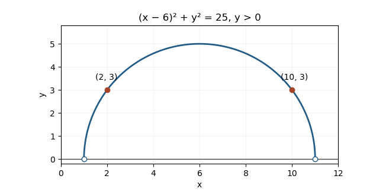
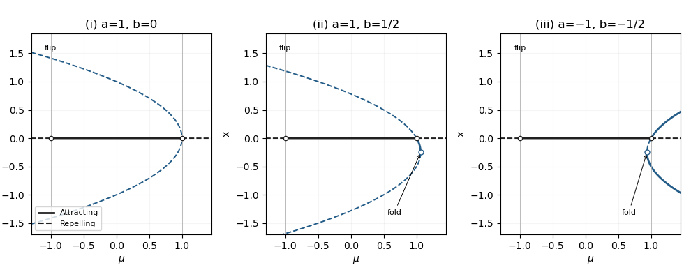
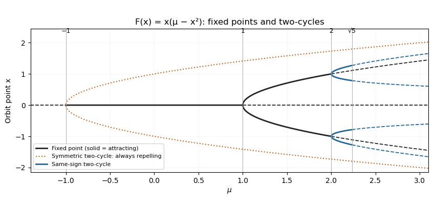
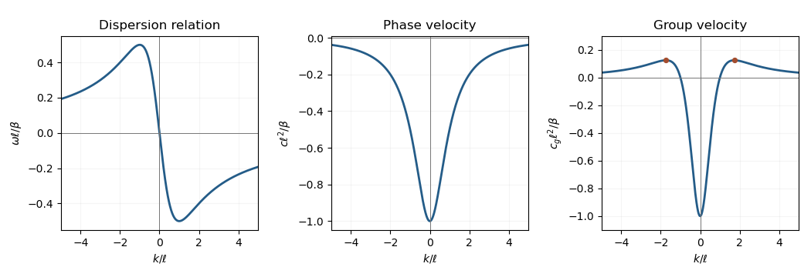

# Paper 4

↑ **Parent:** [Ii](../ii.md)

[https://www.maths.cam.ac.uk/undergrad/pastpapers/files/2017/paperii_4_2.pdf](https://www.maths.cam.ac.uk/undergrad/pastpapers/files/2017/paperii_4_2.pdf)

**Table of contents**

- [1G](#1g)
  - [Solution](#1g/solution)
- [2F](#2f)
  - [Solution](#2f/solution)
- [3G](#3g)
  - [Solution](#3g/solution)
- [4H](#4h)
  - [a](#4h/a)
    - [Solution](#4h/a/solution)
  - [b](#4h/b)
    - [Solution](#4h/b/solution)
- [5J](#5j)
  - [a](#5j/a)
    - [Solution](#5j/a/solution)
  - [b](#5j/b)
    - [Solution](#5j/b/solution)
  - [c](#5j/c)
    - [Solution](#5j/c/solution)
  - [d](#5j/d)
    - [Solution](#5j/d/solution)
- [6B](#6b)
  - [Solution](#6b/solution)
- [7E](#7e)
  - [Solution](#7e/solution)
- [8E](#8e)
  - [Solution](#8e/solution)
- [9C](#9c)
  - [a](#9c/a)
    - [Solution](#9c/a/solution)
  - [b](#9c/b)
    - [Solution](#9c/b/solution)
- [10G](#10g)
  - [a](#10g/a)
    - [Solution](#10g/a/solution)
  - [b](#10g/b)
    - [Solution](#10g/b/solution)
  - [c](#10g/c)
    - [Solution](#10g/c/solution)
- [11F](#11f)
  - [a](#11f/a)
    - [Solution](#11f/a/solution)
  - [b](#11f/b)
    - [Solution](#11f/b/solution)
  - [c](#11f/c)
    - [Solution](#11f/c/solution)
  - [d](#11f/d)
    - [Solution](#11f/d/solution)
  - [e](#11f/e)
    - [Solution](#11f/e/solution)
- [12J](#12j)
  - [a](#12j/a)
    - [Solution](#12j/a/solution)
  - [b](#12j/b)
    - [Solution](#12j/b/solution)
  - [c](#12j/c)
    - [Solution](#12j/c/solution)
  - [d](#12j/d)
    - [Solution](#12j/d/solution)
- [13B](#13b)
  - [Solution](#13b/solution)
- [14E](#14e)
  - [Solution](#14e/solution)
- [15H](#15h)
  - [Solution](#15h/solution)
- [16H](#16h)
  - [i](#16h/i)
    - [Solution](#16h/i/solution)
  - [ii](#16h/ii)
    - [Solution](#16h/ii/solution)
  - [iii](#16h/iii)
    - [Solution](#16h/iii/solution)
  - [iv](#16h/iv)
    - [Solution](#16h/iv/solution)
  - [Solution](#16h/solution)
- [17I](#17i)
  - [a](#17i/a)
    - [Solution](#17i/a/solution)
  - [b](#17i/b)
    - [Solution](#17i/b/solution)
  - [c](#17i/c)
    - [Solution](#17i/c/solution)
- [18G](#18g)
  - [a](#18g/a)
    - [Solution](#18g/a/solution)
  - [b](#18g/b)
    - [Solution](#18g/b/solution)
  - [c](#18g/c)
    - [Solution](#18g/c/solution)
- [19H](#19h)
  - [a](#19h/a)
    - [Solution](#19h/a/solution)
  - [b](#19h/b)
    - [Solution](#19h/b/solution)
- [20I](#20i)
  - [a](#20i/a)
    - [Solution](#20i/a/solution)
  - [b](#20i/b)
    - [Solution](#20i/b/solution)
  - [c](#20i/c)
    - [Solution](#20i/c/solution)
  - [d](#20i/d)
    - [Solution](#20i/d/solution)
- [21F](#21f)
  - [i](#21f/i)
    - [Solution](#21f/i/solution)
  - [ii](#21f/ii)
    - [Solution](#21f/ii/solution)
  - [iii](#21f/iii)
    - [Solution](#21f/iii/solution)
- [22F](#22f)
  - [i](#22f/i)
    - [Solution](#22f/i/solution)
  - [ii](#22f/ii)
    - [Solution](#22f/ii/solution)
  - [iii](#22f/iii)
    - [Solution](#22f/iii/solution)
  - [iv](#22f/iv)
    - [Solution](#22f/iv/solution)
- [23I](#23i)
  - [a](#23i/a)
    - [Solution](#23i/a/solution)
  - [b](#23i/b)
    - [Solution](#23i/b/solution)
  - [c](#23i/c)
    - [Solution](#23i/c/solution)
- [24I](#24i)
  - [Solution](#24i/solution)
- [25J](#25j)
  - [a](#25j/a)
    - [Solution](#25j/a/solution)
  - [b](#25j/b)
    - [Solution](#25j/b/solution)
  - [c](#25j/c)
    - [Solution](#25j/c/solution)
  - [d](#25j/d)
    - [i](#25j/d/i)
      - [Solution](#25j/d/i/solution)
    - [ii](#25j/d/ii)
      - [Solution](#25j/d/ii/solution)
- [26K](#26k)
  - [a](#26k/a)
    - [Solution](#26k/a/solution)
  - [b](#26k/b)
    - [Solution](#26k/b/solution)
- [27K](#27k)
  - [a](#27k/a)
    - [Solution](#27k/a/solution)
  - [b](#27k/b)
    - [Solution](#27k/b/solution)
  - [c](#27k/c)
    - [i](#27k/c/i)
      - [Solution](#27k/c/i/solution)
    - [ii](#27k/c/ii)
      - [Solution](#27k/c/ii/solution)
  - [d](#27k/d)
    - [Solution](#27k/d/solution)
- [28J](#28j)
  - [a](#28j/a)
    - [Solution](#28j/a/solution)
  - [b](#28j/b)
    - [Solution](#28j/b/solution)
  - [c](#28j/c)
    - [Solution](#28j/c/solution)
- [29K](#29k)
  - [Solution](#29k/solution)
- [30E](#30e)
  - [Solution](#30e/solution)
- [31A](#31a)
  - [a](#31a/a)
    - [Solution](#31a/a/solution)
    - [i](#31a/a/i)
      - [Solution](#31a/a/i/solution)
    - [ii](#31a/a/ii)
      - [Solution](#31a/a/ii/solution)
    - [iii](#31a/a/iii)
      - [Solution](#31a/a/iii/solution)
  - [b](#31a/b)
    - [Solution](#31a/b/solution)
- [32C](#32c)
  - [Solution](#32c/solution)
- [33C](#33c)
  - [a](#33c/a)
    - [i](#33c/a/i)
      - [Solution](#33c/a/i/solution)
    - [ii](#33c/a/ii)
      - [Solution](#33c/a/ii/solution)
  - [b](#33c/b)
    - [i](#33c/b/i)
      - [Solution](#33c/b/i/solution)
    - [ii](#33c/b/ii)
      - [Solution](#33c/b/ii/solution)
    - [iii](#33c/b/iii)
      - [Solution](#33c/b/iii/solution)
- [34D](#34d)
  - [i](#34d/i)
    - [Solution](#34d/i/solution)
  - [ii](#34d/ii)
    - [Solution](#34d/ii/solution)
  - [iii](#34d/iii)
    - [Solution](#34d/iii/solution)
  - [iv](#34d/iv)
    - [Solution](#34d/iv/solution)
- [35D](#35d)
  - [Solution](#35d/solution)
- [36D](#36d)
  - [a](#36d/a)
    - [Solution](#36d/a/solution)
  - [b](#36d/b)
    - [Solution](#36d/b/solution)
- [37B](#37b)
  - [Solution](#37b/solution)
- [38B](#38b)
  - [Solution](#38b/solution)
  - [i](#38b/i)
    - [Solution](#38b/i/solution)
  - [ii](#38b/ii)
    - [Solution](#38b/ii/solution)
- [39A](#39a)
  - [a](#39a/a)
    - [Solution](#39a/a/solution)
  - [b](#39a/b)
    - [Solution](#39a/b/solution)

## 1G

↑ **Parent:** [Paper 4](paper-4.md)

<h3 id="1g/solution">Solution</h3>

↑ **Parent:** [1G](#1g)

Expand the finite [Euler product](../../../analytic-number-theory.md#euler-product) into [geometric series](../../../real-analysis.md#geometric-series). By [unique prime factorization](../../../number-theory.md#fundamental-theorem-of-arithmetic), it is the sum of $1/n$ over positive [integers](../../../number-theory.md#integer) whose [prime factors](../../../number-theory.md#prime-factor) do not exceed $x$, and hence contains every term up to $m=\lfloor x\rfloor$. The [harmonic sum](../../../real-analysis.md#harmonic-sum) satisfies

$$
\prod_{p\leq x}(1-p^{-1})^{-1}\geq\sum_{n=1}^m\frac1n>\int_1^{m+1}\frac{dt}{t}=\log(m+1)>\log x.
$$

The last inequality uses $m+1>x$, including when $x$ is an [integer](../../../number-theory.md#integer). For each [prime number](../../../number-theory.md#prime-number) $p$,

$$
0<-\log(1-p^{-1})-p^{-1}=\sum_{j=2}^\infty\frac1{jp^j}<\frac1{2p(p-1)}.
$$

The [telescoping series](../../../real-analysis.md#telescoping-series) over all [integers](../../../number-theory.md#integer) $n\geq2$ bounds the sum of these remainders by $\frac12\sum_{n\geq2}[n(n-1)]^{-1}=1/2$. Taking [logarithms](../../../calculus.md#logarithm) of the product bound therefore gives

$$
\boxed{\sum_{p\leq x}\frac1p>\log\log x-\frac12,\qquad c=-\frac12.}
$$

This explicit constant suffices; no asymptotic theorem about the distribution of [prime numbers](../../../number-theory.md#prime-number) is needed.

## 2F

↑ **Parent:** [Paper 4](paper-4.md)

<h3 id="2f/solution">Solution</h3>

↑ **Parent:** [2F](#2f)

For $x>0$, $N(x)=\lfloor1/x\rfloor$ and $T(x)=1/x-\lfloor1/x\rfloor$. Iterating this [Gauss continued-fraction map](../../../number-theory.md#gauss-continued-fraction-map) on an [irrational number](../../../algebra.md#irrational-number) never reaches zero, and its [continued fraction](../../../number-theory.md#continued-fraction) is

$$
\boxed{x=[0;N(x),N(Tx),N(T^2x),\ldots].}
$$

The branches $T:(1/(n+1),1/n)\to(0,1)$ have inverse $x_n(y)=1/(n+y)$, for $n\geq1$. The [change of variables formula](../../../calculus.md#change-of-variables-formula) for a [probability density function](../../../continuous-probability-distribution.md#probability-density-function) gives, [almost everywhere](../../../measure-theory.md#almost-everywhere),

$$
f_{T(X)}(y)=\sum_{n=1}^\infty f\!\left(\frac1{n+y}\right)\frac1{(n+y)^2}
=\frac1{\log2}\sum_{n=1}^\infty\left[\frac1{n+y}-\frac1{n+y+1}\right]
=\frac1{(\log2)(1+y)}.
$$

The endpoints of these branches are a [countable set](../../../set-theory.md#countable-set) of probability zero. Thus **$T(X)$ and $X$ have the same distribution**; this [Gauss measure](../../../number-theory.md#gauss-measure) is an [invariant measure](../../../measure-theory.md#invariant-measure) for the [Gauss continued-fraction map](../../../number-theory.md#gauss-continued-fraction-map).

## 3G

↑ **Parent:** [Paper 4](paper-4.md)

<h3 id="3g/solution">Solution</h3>

↑ **Parent:** [3G](#3g)

In the [RSA cryptosystem](../../../algebra.md#rsa-cryptosystem), choose distinct large [prime numbers](../../../number-theory.md#prime-number) $p,q$, set $N=pq$, and choose $e$ [coprime](../../../number-theory.md#coprime-integers) to $\varphi(N)=(p-1)(q-1)$. Choose $d$ with $ed\equiv1\pmod{\varphi(N)}$. A plaintext [residue class](../../../number-theory.md#residue-class) $m$ is encrypted as $c=m^e\pmod N$ and decrypted as $c^d\pmod N$. [Fermat's little theorem](../../../number-theory.md#fermat-little-theorem) modulo $p$ and $q$, followed by the [Chinese remainder theorem](../../../mathematics.md#chinese-remainder-theorem), proves correctness even when $m$ is not [coprime](../../../number-theory.md#coprime-integers) to $N$.

Textbook [RSA cryptosystem](../../../algebra.md#rsa-cryptosystem) is multiplicative: $E(m_1m_2)=E(m_1)E(m_2)\pmod N$. For a [chosen-ciphertext attack](../../../computer-science.md#chosen-ciphertext-attack), multiply an intercepted $c$ by $r^e$ for a known invertible $r$. A decryption oracle returns $mr$, from which multiplication by $r^{-1}$ recovers $m$. Likewise, multiplying two textbook [RSA signatures](../../../computer-science.md#rsa-signature) produces a signature of their product. These are [homomorphism attacks](../../../algebra.md#homomorphism-attack), exploiting algebra rather than factoring $N$.

For an [ElGamal signature](../../../computer-science.md#elgamal-signature-scheme), choose a [prime](../../../number-theory.md#prime-number) $p$, a [primitive root](../../../number-theory.md#primitive-root-modulo-n) $g$ modulo $p$, a private exponent $a$, and public $y=g^a$. To sign a message digest $h=H(m)$, choose a fresh secret $k$ [coprime](../../../number-theory.md#coprime-integers) to $p-1$ and set

$$
\boxed{r=g^k\pmod p,\qquad s=k^{-1}(h-ar)\pmod{p-1}.}
$$

Verification checks $1\leq r\leq p-1$ and $g^{H(m)}\equiv y^r r^s\pmod p$, which follows because $ar+ks\equiv h\pmod{p-1}$. Authenticating the ciphertext and its context with such a [digital signature](../../../computer-science.md#digital-signature), before decryption, prevents the simple multiplicative modification from being accepted without a fresh valid signature. One needs an appropriate [cryptographic hash function](../../../computer-science.md#cryptographic-hash-function) and fresh secret [cryptographic nonces](../../../computer-science.md#cryptographic-nonce): this is not a claim that every algebraic attack is impossible. In particular, the unhashed historical [ElGamal signature scheme](../../../computer-science.md#elgamal-signature-scheme) admits existential forgeries of specially chosen message exponents; mere multiplication of encrypted messages is not an authentication mechanism.

## 4H

↑ **Parent:** [Paper 4](paper-4.md)

<h3 id="4h/a">a</h3>

↑ **Parent:** [4H](#4h)

<h4 id="4h/a/solution">Solution</h4>

↑ **Parent:** [A](#4h/a)

Use [state elimination for finite automata](../../../foundations-of-mathematics.md#state-elimination-for-finite-automata) on a [generalized finite automaton](../../../foundations-of-mathematics.md#generalized-finite-automaton), whose directed [edges](../../../graph-theory.md#edge-of-a-graph) are labelled by [regular expressions](../../../foundations-of-mathematics.md#regular-expression). Add a fresh initial state $s$ with an $\varepsilon$-edge to the old initial state and a fresh final state $f$ with $\varepsilon$-edges from all old accepting states. Every missing [edge](../../../graph-theory.md#edge-of-a-graph) has label $\varnothing$, the [empty language](../../../computer-science.md#empty-language); parallel [edges](../../../graph-theory.md#edge-of-a-graph) are merged by [union](../../../set.md#set-union). The label $\varepsilon$ denotes the language containing just the [empty word](../../../foundations-of-mathematics.md#empty-word).

When eliminating a state $k$, replace the label on each surviving [edge](../../../graph-theory.md#edge-of-a-graph) $i\to j$ by

$$
\boxed{R_{ij}\ \cup\ R_{ik}(R_{kk})^*R_{kj}.}
$$

Here juxtaposition means [concatenation of formal languages](../../../computer-science.md#concatenation-of-formal-languages), and the [Kleene star](../../../foundations-of-mathematics.md#kleene-star) allows zero or more traversals of the loop at $k$. Then delete $k$ and its incident [edges](../../../graph-theory.md#edge-of-a-graph). Eliminate every original state; the remaining $s\to f$ label is a [regular expression](../../../foundations-of-mathematics.md#regular-expression) for exactly the accepted [formal language](../../../computer-science.md#formal-language). The update accounts for paths avoiding $k$ and paths entering $k$, looping there any number of times, and leaving it.

<h3 id="4h/b">b</h3>

↑ **Parent:** [4H](#4h)

<h4 id="4h/b/solution">Solution</h4>

↑ **Parent:** [B](#4h/b)

Let $K$ be the [diagonal halting set](../../../foundations-of-mathematics.md#diagonal-halting-set), which is [undecidable](../../../foundations-of-mathematics.md#undecidable-decision-problem). The pumping argument below actually holds for every subset $K\subseteq\mathbb N$; nonregularity needs the stated convention, or at least a set of exponents whose unary language is nonregular.

The [pumping lemma for regular languages](../../../foundations-of-mathematics.md#pumping-lemma-for-regular-languages) holds with [pumping length](../../../foundations-of-mathematics.md#pumping-length) one. For an accepted nonempty word, pump its first symbol. A word containing only $1$s remains in $1^*$ even if that symbol is deleted. If there is a zero and a nonempty prefix before its last zero, pumping the first symbol leaves the last zero and its following $n\in K$ ones unchanged. If the word is $01^n$, pumping its initial zero produces $0^i1^n$; this is accepted for $i\geq1$, and for $i=0$ it belongs to $1^*$. In every case the pumped substring is nonempty and lies in the first position.

If $L$ were a [regular language](../../../foundations-of-mathematics.md#regular-language), closure under intersection would make

$$
L\cap01^*=\{01^n:n\in K\}
$$

regular. A [finite-state automaton](../../../foundations-of-mathematics.md#finite-state-machine) for this intersection would decide membership of $n$ in the [diagonal halting set](../../../foundations-of-mathematics.md#diagonal-halting-set) by reading $01^n$, a contradiction. Thus **$L$ satisfies the pumping lemma but is not regular**, under the usual meaning of $\mathbb K$. If $K$ were arbitrary, the printed conclusion would be false, for example for $K=\mathbb N$.

## 5J

↑ **Parent:** [Paper 4](paper-4.md)

<h3 id="5j/a">a</h3>

↑ **Parent:** [5J](#5j)

<h4 id="5j/a/solution">Solution</h4>

↑ **Parent:** [A](#5j/a)

**This is the appropriate command for the full [contingency table](../../../statistical-modelling.md#contingency-table).** It fits a [log-linear model](../../../statistical-modelling.md#log-linear-model) to the nine cell counts, with [logarithmic link function](../../../statistical-modelling.md#logarithmic-link-function) and no interaction:

$$
Y_{ij}\sim\operatorname{Poisson}(\mu_{ij}),\qquad\log\mu_{ij}=\alpha+g_i+d_j.
$$

With baseline constraints on $g_i,d_j$, there are five parameters. The factorized means express [independence](../../../random-variable.md#independent-random-variables) of treatment group and damage category. The [maximum-likelihood estimates](../../../statistical-modelling.md#maximum-likelihood-estimator) are

$$
\boxed{\widehat\mu_{ij}=\frac{Y_{i+}Y_{+j}}{Y_{++}}=(18,4,8)\quad\text{in each row}.}
$$

Although the experiment fixes each row total at 30, conditioning these independent [Poisson random variables](../../../discrete-probability-distribution.md#poisson-distribution) on those totals produces the appropriate row-wise [multinomial distribution](../../../discrete-probability-distribution.md#multinomial-distribution). The [Poisson trick](../../../discrete-probability-distribution.md#poisson-trick) therefore gives the correct likelihood inference for this [independence log-linear model for a two-way contingency table](../../../statistical-modelling.md#independence-log-linear-model-for-a-two-way-contingency-table); the margins are nuisance parameters. It tests whether treatment changes the distribution of damage, rather than modelling a binary outcome.

<h3 id="5j/b">b</h3>

↑ **Parent:** [5J](#5j)

<h4 id="5j/b/solution">Solution</h4>

↑ **Parent:** [B](#5j/b)

**This is not a valid ordinary R glm family specification.** A [multinomial distribution](../../../discrete-probability-distribution.md#multinomial-distribution) is natural for the three damage counts conditional on the row total, but base R's [generalized linear model](../../../statistical-modelling.md#generalized-linear-model) interface does not supply a family named multinomial. Furthermore, the written response is one cell count, not a three-category response or grouped multinomial vector. A properly specified [multinomial logistic regression](../../../statistical-modelling.md#multinomial-logistic-regression) could model category probabilities by group, but it is not the model fit by this command. The independent-count [log-linear model](../../../statistical-modelling.md#log-linear-model) in part (a), conditional on the margins, is the appropriate supplied alternative.

<h3 id="5j/c">c</h3>

↑ **Parent:** [5J](#5j)

<h4 id="5j/c/solution">Solution</h4>

↑ **Parent:** [C](#5j/c)

**This does not model the full three-category response.** A [binomial distribution](../../../discrete-probability-distribution.md#binomial-distribution) has two outcome classes, whereas the observed damage factor has three. In base R, a factor response to a binomial [generalized linear model](../../../statistical-modelling.md#generalized-linear-model) is coded as first level versus all other levels; this would silently collapse the categories. It would also treat the nine table rows as nine individual observations, ignoring the frequencies. A deliberate binary analysis would require specifying the collapse and retaining the counts, but cannot recover the full damage distribution.

<h3 id="5j/d">d</h3>

↑ **Parent:** [5J](#5j)

<h4 id="5j/d/solution">Solution</h4>

↑ **Parent:** [D](#5j/d)

The count weights correct the loss of frequencies for a deliberately coarsened binary response, but do not supply a third outcome category. Thus **this remains inappropriate for the full [contingency table](../../../statistical-modelling.md#contingency-table)**. With the base R factor convention, it could fit the chosen first damage level versus the other two combined, using a [logistic regression](../../../statistical-modelling.md#logistic-regression) and the frequencies as weights. That is a different scientific question. The supplied [log-linear model](../../../statistical-modelling.md#log-linear-model) retains all three categories and their counts without this information loss.

## 6B

↑ **Parent:** [Paper 4](paper-4.md)

<h3 id="6b/solution">Solution</h3>

↑ **Parent:** [6B](#6b)

At an [endemic equilibrium](../../../mathematical-biology.md#endemic-equilibrium), $I_*>0$, so $\beta S_*=\mu+\nu$. Substitution into the susceptible equation gives

$$
\boxed{S_*=\frac N{R_0},\qquad I_*=\frac{\mu N}{\mu+\nu}\left(1-\frac1{R_0}\right).}
$$

These values are physically positive exactly when $R_0>1$. The [Jacobian matrix](../../../calculus.md#jacobian-matrix) at this equilibrium is

$$
J=\begin{pmatrix}-\mu R_0&-(\mu+\nu)\\\mu(R_0-1)&0\end{pmatrix},\qquad
\operatorname{tr}J=-\mu R_0<0,\quad\det J=\mu(\mu+\nu)(R_0-1)>0.
$$

Both [eigenvalues](../../../linear-operator-theory.md#eigenvalue) have negative real parts, so the [endemic equilibrium](../../../mathematical-biology.md#endemic-equilibrium) is locally asymptotically stable. Its decay exponents are

$$
\lambda_\pm=-\frac{\mu R_0}{2}\pm\sqrt{\frac{\mu^2R_0^2}{4}-\mu(\mu+\nu)(R_0-1)}.
$$

The regime $\nu\gg\mu$ means recovery is rapid compared with demographic replacement. For fixed $R_0>1$ away from the threshold, the exponents form a [complex conjugate](../../../complex-analysis.md#complex-conjugate) pair with frequency approximately $\sqrt{\mu\nu(R_0-1)}$. Hence

$$
\boxed{T\simeq\frac{2\pi}{\sqrt{\mu\nu(R_0-1)}}.}
$$

Strictly, oscillations require $\mu(\mu+\nu)(R_0-1)>\mu^2R_0^2/4$; $\nu\gg\mu$ alone does not ensure this uniformly for every $R_0$ arbitrarily close to one or arbitrarily large.

Vaccinating a fraction $v$ of newborns replaces the susceptible input by $\mu N(1-v)$. The effective [basic reproduction number](../../../mathematical-biology.md#basic-reproduction-number) is $R_v=(1-v)R_0$, and the same calculation replaces $R_0$ by $R_v$. Provided $R_v>1$ and the oscillatory approximation remains applicable, **vaccination lengthens the [oscillation period](../../../classical-mechanics.md#period-of-an-oscillation)**, because $R_v-1$ is smaller. Extremely near eradication the exponents become real and there is no [oscillation period](../../../classical-mechanics.md#period-of-an-oscillation) to extrapolate indefinitely.

## 7E

↑ **Parent:** [Paper 4](paper-4.md)

<h3 id="7e/solution">Solution</h3>

↑ **Parent:** [7E](#7e)

Substitute the [Laplace contour-integral method for a linear differential equation](../../../differential-equation.md#laplace-contour-integral-method-for-a-linear-differential-equation) into the [differential equation](../../../differential-equation.md) and use $z e^{zt}=\partial_t e^{zt}$. [Integration by parts](../../../calculus.md#integration-by-parts) around a closed contour avoiding singularities gives

$$
0=\int_C e^{zt}\{-[(1+t^2)f(t)]'-2tf(t)\}\,dt.
$$

It suffices to solve $(1+t^2)f'+4tf=0$, giving

$$
\boxed{f(t)=\frac{C_0}{(1+t^2)^2}.}
$$

Nonzero contour integrals arise by enclosing one or both double poles $t=\pm i$. At $t=i$, the [residue](../../../analysis.md#residue) is

$$
\operatorname{Res}_{t=i}\frac{e^{zt}}{(1+t^2)^2}=-\frac14(z+i)e^{iz}.
$$

The conjugate pole gives the conjugate expression for real $z$. Taking real and imaginary linear combinations yields the real solutions

$$
\boxed{y_1(z)=\sin z-z\cos z,\qquad y_2(z)=\cos z+z\sin z.}
$$

Their [derivatives](../../../calculus.md#derivative) are $y_1'=z\sin z$, $y_2'=z\cos z$, and their [Wronskian](../../../differential-equation.md#wronskian) is $-z^2$, so they are [linearly independent](../../../vector-space.md#linear-independence) on every interval avoiding zero. Both extend analytically across zero and remain independent as functions; the vanishing [Wronskian](../../../differential-equation.md#wronskian) at zero reflects the singular leading coefficient of the printed [differential equation](../../../differential-equation.md) there.

## 8E

↑ **Parent:** [Paper 4](paper-4.md)

<h3 id="8e/solution">Solution</h3>

↑ **Parent:** [8E](#8e)

The [Poisson bracket](../../../classical-mechanics.md#poisson-bracket) is $\{f,g\}=\mathbf r\cdot(\nabla f\times\nabla g)$. Since $\nabla\rho^2=2\mathbf r$, the [scalar triple product](../../../linear-algebra.md#scalar-triple-product) vanishes, and

$$
\boxed{\{f,\rho^2\}=0.}
$$

Equivalently, check the identity on $x,y,z$ and extend to every [polynomial](../../../polynomial.md) using the [Leibniz rule](../../../calculus.md#leibniz-rule). Thus $\rho^2$ is a [Casimir function of a Poisson manifold](../../../symplectic-geometry.md#casimir-function-of-a-poisson-manifold) of this [rotational Lie-Poisson structure on R3](../../../symplectic-geometry.md#rotational-lie-poisson-structure-on-r3).

The [Hamilton's equations](../../../classical-mechanics.md#hamilton-s-equations) are

$$
\boxed{\dot x=(B-C)yz,\qquad\dot y=(C-A)xz,\qquad\dot z=(A-B)xy.}
$$

[Linearization](../../../algebra.md#linearization) about $(1,0,0)$ gives $\dot\alpha=0$, $\dot\beta=(C-A)\gamma$, $\dot\gamma=(A-B)\beta$. The two nonzero exponents satisfy $\lambda^2=(C-A)(A-B)$. Consequently

$$
\boxed{\text{exponential instability occurs iff }\min(B,C)<A<\max(B,C).}
$$

When $A$ is outside this interval the transverse motion is oscillatory. At equality the [linearization](../../../algebra.md#linearization) is nonhyperbolic; if just one transverse coupling vanishes, the other permits secular linear growth, rather than an exponential instability. This is the familiar intermediate-axis instability described by the [Euler equations for a torque-free rigid body](../../../classical-mechanics.md#euler-equations-for-a-torque-free-rigid-body).

## 9C

↑ **Parent:** [Paper 4](paper-4.md)

<h3 id="9c/a">a</h3>

↑ **Parent:** [9C](#9c)

<h4 id="9c/a/solution">Solution</h4>

↑ **Parent:** [A](#9c/a)

For a thin spherical shell, the radial [pressure](../../../thermodynamics.md#pressure) force per unit [volume](../../../geometry-and-topology.md#volume) is $-dP/dr$. By the [shell theorem](../../../physics.md#spherical-shell-theorem), the inward [gravitational acceleration](../../../classical-mechanics.md#gravitational-acceleration) is $GM(r)/r^2$, because exterior spherical shells contribute no force. Balancing force densities in [hydrostatic equilibrium](../../../statistical-physics.md#hydrostatic-equilibrium) gives

$$
\boxed{\frac{dP}{dr}=-\frac{GM(r)\rho(r)}{r^2},\qquad\frac{dM}{dr}=4\pi r^2\rho(r).}
$$

The second equation is [mass conservation](../../../continuum-mechanics.md#mass-conservation); it closes the pressure-support equation once an [equation of state](../../../thermodynamics.md#equation-of-state) is supplied.

<h3 id="9c/b">b</h3>

↑ **Parent:** [9C](#9c)

<h4 id="9c/b/solution">Solution</h4>

↑ **Parent:** [B](#9c/b)

Regularity at the centre requires finite $\rho_c,P_c$ and $M(0)=0$. Then $M(r)=4\pi\rho_c r^3/3+o(r^3)$, so $P'(0)=0$. At a free stellar surface, $P(R)=0$; more generally it matches the external [pressure](../../../thermodynamics.md#pressure). For $P=K\rho^2$ with $K>0$ and vacuum outside, this also gives $\rho(R)=0$.

Inside the star, cancel positive $\rho$ to obtain $2K\rho'=-GM/r^2$. Differentiate and use [mass conservation](../../../continuum-mechanics.md#mass-conservation):

$$
\frac1{r^2}\frac d{dr}(r^2\rho')=-\frac{2\pi G}{K}\rho.
$$

Thus the [Lane-Emden equation](../../../nonlinear-analysis.md#lane-emden-equation) of [polytropic index](../../../stellar-structure.md#polytropic-index) one is

$$
\boxed{\frac1{x^2}\frac d{dx}\left(x^2\frac{d\rho}{dx}\right)=-\rho,\qquad x=\alpha r,\quad\alpha=\sqrt{\frac{2\pi G}{K}}.}
$$

For example, the regular solution is $\rho=\rho_c\sin x/x$, with its central value interpreted by [continuity](../../../calculus.md#continuous-function), and the first vacuum surface is at $x=\pi$. This also verifies the stated central and surface [boundary conditions](../../../differential-equation.md#boundary-condition).

## 10G

↑ **Parent:** [Paper 4](paper-4.md)

<h3 id="10g/a">a</h3>

↑ **Parent:** [10G](#10g)

<h4 id="10g/a/solution">Solution</h4>

↑ **Parent:** [A](#10g/a)

[Dirichlet theorem on primes in arithmetic progressions](../../../analytic-number-theory.md#dirichlet-s-theorem-on-arithmetic-progressions) states that if [positive integer](../../../number-theory.md#positive-integer) $q$ and [integer](../../../number-theory.md#integer) $a$ satisfy $\gcd(a,q)=1$, then infinitely many [prime numbers](../../../number-theory.md#prime-number) satisfy

$$
\boxed{p\equiv a\pmod q.}
$$

The coprimality hypothesis is essential: if $a$ and $q$ have a common factor greater than one, a [prime](../../../number-theory.md#prime-number) in the progression must divide that factor, giving at most finitely many possibilities.

<h3 id="10g/b">b</h3>

↑ **Parent:** [10G](#10g)

<h4 id="10g/b/solution">Solution</h4>

↑ **Parent:** [B](#10g/b)

Write an integral [binary quadratic form](../../../number-theory.md#binary-quadratic-form) as $Q(u,v)=Au^2+Buv+Cv^2$, with [discriminant of a binary quadratic form](../../../number-theory.md#discriminant-of-a-binary-quadratic-form) $d=B^2-4AC$. If $Q(u,v)=p$ is [prime](../../../number-theory.md#prime-number), then $\gcd(u,v)=1$: any common [divisor](../../../number-theory.md#divisor) would have its square dividing $p$. Complete $(u,v)$ to a matrix in $\operatorname{SL}_2(\mathbb Z)$ using [Bezout identity](../../../algebra.md#bezout-identity). After the associated integral [change of variables](../../../calculus.md#change-of-variables-formula), the properly equivalent form has leading coefficient $p$, say $[p,b,c]$. Its [discriminant of a binary quadratic form](../../../number-theory.md#discriminant-of-a-binary-quadratic-form) gives $d=b^2-4pc$, hence $b^2\equiv d\pmod p$.

Conversely suppose $b_0^2\equiv d\pmod p$. Since $d$ is an integral-form [discriminant of a binary quadratic form](../../../number-theory.md#discriminant-of-a-binary-quadratic-form), $d\equiv0$ or $1\pmod4$. Choose $b\equiv b_0\pmod p$ with even [integer parity](../../../number-theory.md#parity-mathematics) for $d\equiv0\pmod4$ and odd [integer parity](../../../number-theory.md#parity-mathematics) for $d\equiv1\pmod4$. This is possible because $p$ is odd. Then $b^2-d$ is divisible by $4p$, and

$$
\boxed{Q(u,v)=pu^2+buv+\frac{b^2-d}{4p}v^2}
$$

is an integral form of [discriminant of a binary quadratic form](../../../number-theory.md#discriminant-of-a-binary-quadratic-form) $d$ representing $p=Q(1,0)$. This proves the [discriminant criterion for prime representation by a binary quadratic form](../../../number-theory.md#discriminant-criterion-for-prime-representation-by-a-binary-quadratic-form), including the case $p\mid d$; no assumption that $d$ is a [fundamental discriminant](../../../algebraic-number-theory.md#fundamental-discriminant) was used.

<h3 id="10g/c">c</h3>

↑ **Parent:** [10G](#10g)

<h4 id="10g/c/solution">Solution</h4>

↑ **Parent:** [C](#10g/c)

Both forms have [discriminant of a binary quadratic form](../../../number-theory.md#discriminant-of-a-binary-quadratic-form) $-60$. The [reduction algorithm for a positive definite binary quadratic form](../../../number-theory.md#reduction-algorithm-for-a-positive-definite-binary-quadratic-form) gives $|b|\leq a\leq c$ and $a\leq\sqrt{60/3}<5$ for a reduced positive definite representative. Enumerating $a=1,2,3,4$ gives

$$
[1,0,15],\quad[2,2,8],\quad[3,0,5],\quad[4,2,4].
$$

The second and fourth forms are imprimitive and represent only even [integers](../../../number-theory.md#integer). Every odd [prime](../../../number-theory.md#prime-number) represented by a form of [discriminant of a binary quadratic form](../../../number-theory.md#discriminant-of-a-binary-quadratic-form) $-60$ must therefore be represented by $f$ or $g$.

For a [prime](../../../number-theory.md#prime-number) $p\nmid30$, [quadratic reciprocity](../../../number-theory.md#quadratic-reciprocity) gives

$$
\left(\frac{-60}{p}\right)=\left(\frac{-3}{p}\right)\left(\frac5p\right)
=\left(\frac p3\right)\left(\frac p5\right).
$$

Every [prime](../../../number-theory.md#prime-number) $p\equiv1\pmod{15}$ has this symbol equal to one and hence is represented by one of the two primitive forms, by part (b). But an odd [prime](../../../number-theory.md#prime-number) represented by $g$ and different from three is $2\pmod3$, so these [primes](../../../number-theory.md#prime-number) must be represented by $f$. Similarly, [primes](../../../number-theory.md#prime-number) $p\equiv2\pmod{15}$ have both symbols equal to $-1$, and are represented by $g$, since a [prime](../../../number-theory.md#prime-number) represented by $f$ is $1\pmod3$. Both [residue classes](../../../number-theory.md#residue-class) are [coprime](../../../number-theory.md#coprime-integers) to 15, so [Dirichlet theorem on primes in arithmetic progressions](../../../analytic-number-theory.md#dirichlet-s-theorem-on-arithmetic-progressions) proves **each form represents infinitely many [primes](../../../number-theory.md#prime-number)**.

The same modulo-three distinction excludes every [prime](../../../number-theory.md#prime-number) other than three from being represented by both. The form $f$ does not represent three; $g$ represents three and five but neither is represented by $f$, and two is represented by neither. Therefore **there are no [primes](../../../number-theory.md#prime-number) represented by both forms**.

## 11F

↑ **Parent:** [Paper 4](paper-4.md)

<h3 id="11f/a">a</h3>

↑ **Parent:** [11F](#11f)

<h4 id="11f/a/solution">Solution</h4>

↑ **Parent:** [A](#11f/a)

Let $u(t)=\gamma(t)/|\gamma(t)|$, a [continuous map](../../../topology.md#continuous-map) into the [unit circle](../../../complex-analysis.md#complex-unit-circle). By [uniform continuity](../../../topological-analysis.md#uniform-continuity), partition $[0,1]$ so finely that on each interval beginning at $t_j$, $|u(t)/u(t_j)-1|<1$. This ratio lies in the right half-plane and has a continuous [complex argument](../../../complex-analysis.md#argument-complex-analysis) with value zero at $t_j$. Starting from $\theta_0$, add these local arguments successively, matching endpoint values. This constructs a continuous real lift with $u(t)=e^{i\theta(t)}$.

Any two such lifts with the same initial value differ by a [continuous function](../../../calculus.md#continuous-function) taking values in $2\pi\mathbb Z$, and hence coincide. Since the curve closes, $e^{i(\theta(1)-\theta(0))}=1$. Define its [winding number](../../../complex-analysis.md#winding-number) by

$$
\boxed{w(\gamma)=\frac{\theta(1)-\theta(0)}{2\pi}\in\mathbb Z.}
$$

Changing the chosen initial argument adds a constant multiple of $2\pi$ to the whole lift, so the [winding number](../../../complex-analysis.md#winding-number) is independent of that choice. No [differentiability](../../../analysis.md#differentiability) of the curve is required.

<h3 id="11f/b">b</h3>

↑ **Parent:** [11F](#11f)

<h4 id="11f/b/solution">Solution</h4>

↑ **Parent:** [B](#11f/b)

For each [integer](../../../number-theory.md#integer) $m$, take $\gamma_m(t)=e^{2\pi imt}$. It is a continuous closed curve avoiding zero and has the continuous argument $2\pi mt$. Consequently

$$
\boxed{w(\gamma_m)=m,\qquad m\in\mathbb Z.}
$$

Positive and negative [integers](../../../number-theory.md#integer) correspond to opposite senses of traversal, and the constant curve gives zero.

<h3 id="11f/c">c</h3>

↑ **Parent:** [11F](#11f)

<h4 id="11f/c/solution">Solution</h4>

↑ **Parent:** [C](#11f/c)

Choose continuous argument lifts $\theta_1,\theta_2$ for the two curves. Their sum is a lift for their pointwise product, because

$$
\gamma_1(t)\gamma_2(t)=|\gamma_1(t)||\gamma_2(t)|e^{i(\theta_1(t)+\theta_2(t))}.
$$

Subtract its initial value from its final value to obtain

$$
\boxed{w(\gamma_1\gamma_2)=w(\gamma_1)+w(\gamma_2).}
$$

In particular, [winding numbers](../../../complex-analysis.md#winding-number) subtract under pointwise division of curves avoiding zero.

<h3 id="11f/d">d</h3>

↑ **Parent:** [11F](#11f)

<h4 id="11f/d/solution">Solution</h4>

↑ **Parent:** [D](#11f/d)

The continuous closed curve $q(t)=\gamma_2(t)/\gamma_1(t)$ satisfies $|q(t)-1|<1$. It lies in the right half-plane, which admits a single continuous [complex argument](../../../complex-analysis.md#argument-complex-analysis) in $(-\pi/2,\pi/2)$. Since $q$ closes, this argument has equal endpoint values, giving $w(q)=0$. Additivity under multiplication then yields

$$
\boxed{w(\gamma_2)=w(\gamma_1)+w(q)=w(\gamma_1).}
$$

The strict inequality ensures that the quotient stays in a region avoiding zero and admitting a single argument branch.

<h3 id="11f/e">e</h3>

↑ **Parent:** [11F](#11f)

<h4 id="11f/e/solution">Solution</h4>

↑ **Parent:** [E](#11f/e)

The appropriate [homotopy invariance of winding number](../../../complex-analysis.md#homotopy-invariance-of-winding-number) is: if $H:[0,1]^2\to\mathbb C\setminus\{0\}$ is continuous and $H(s,0)=H(s,1)$ for each $s$, then all loops $t\mapsto H(s,t)$ have the same [winding number](../../../complex-analysis.md#winding-number). The basepoint may move; every intermediate curve must close and avoid zero.

[Compactness](../../../topology.md#compact-space) gives $m=\min_{s,t}|H(s,t)|>0$. [Uniform continuity](../../../topological-analysis.md#uniform-continuity) gives $\delta>0$ such that $|s-s'|<\delta$ implies $|H(s,t)-H(s',t)|<m$ for every $t$. Part (d) then makes the [winding numbers](../../../complex-analysis.md#winding-number) equal for nearby $s,s'$. Subdivide $[0,1]$ into steps smaller than $\delta$ and chain these equalities. Therefore

$$
\boxed{w(H(0,\cdot))=w(H(1,\cdot)).}
$$

This proves the theorem directly for continuous loops, without requiring an integral formula or smooth [homotopy](../../../algebraic-topology.md#homotopy).

## 12J

↑ **Parent:** [Paper 4](paper-4.md)

<h3 id="12j/a">a</h3>

↑ **Parent:** [12J](#12j)

<h4 id="12j/a/solution">Solution</h4>

↑ **Parent:** [A](#12j/a)

The [Poisson deviance](../../../statistical-modelling.md#poisson-deviance) tests overall fit against the saturated [Poisson regression](../../../statistical-modelling.md#poisson-regression), not whether the single slope is zero. Under fit.1, its large-count approximation is $\chi^2_{60-2}=\chi^2_{58}$. The observed value is 261.72, far above the one-percent upper critical value (about 85.95); its upper-tail probability is about $1.14\times10^{-27}$. Thus **reject fit.1 at the one-percent level**. The slope's reported $p$-value 0.421 only compares this inadequate log-linear trend with an intercept-only model; it is not a [goodness-of-fit test](../../../statistical-modelling.md#goodness-of-fit-test).

<h3 id="12j/b">b</h3>

↑ **Parent:** [12J](#12j)

<h4 id="12j/b/solution">Solution</h4>

↑ **Parent:** [B](#12j/b)

The two design matrices span the same six-dimensional space of arbitrary log means for the six periods. Fit.2 uses the first period as a baseline, whereas fit.3 uses cumulative indicator steps. If $a_j$ is the log mean for period $j$, fit.3 has intercept $a_1$ and jump coefficients $a_{j+1}-a_j$. Thus both fits give identical fitted means and identical maximized [likelihood functions](../../../statistical-modelling.md#likelihood-function). Therefore

$$
\boxed{D(\text{fit.2})-D(\text{fit.3})=0.}
$$

Different coefficient tests arise because they test different contrasts, not because one full fit explains the observations better.

<h3 id="12j/c">c</h3>

↑ **Parent:** [12J](#12j)

<h4 id="12j/c/solution">Solution</h4>

↑ **Parent:** [C](#12j/c)

**Use fit.3 if backward selection is intended to combine adjacent periods.** Each cumulative indicator is a separate model term; deleting its coefficient enforces equality of the two adjacent period means separated by that boundary. This offers an interpretable reduced stepwise profile. Fit.2 treats the entire factor as one term, so ordinary term-wise backward selection retains all five contrasts or removes period altogether. Removing selected baseline contrasts by hand would instead privilege period one, rather than grouping neighbouring periods. If the scientific objective were simply whether any period effect exists, retaining or deleting the whole factor in fit.2 would be the appropriate different procedure.

<h3 id="12j/d">d</h3>

↑ **Parent:** [12J](#12j)

<h4 id="12j/d/solution">Solution</h4>

↑ **Parent:** [D](#12j/d)

Under fit.2, observations in each period are independent [Poisson random variables](../../../discrete-probability-distribution.md#poisson-distribution) with a common mean, so each [sample variance](../../../statistical-inference.md#sample-variance) should fluctuate around its [sample mean](../../../variance.md#sample-mean). The plot instead has [variances](../../../variance.md) roughly 130–300 for means roughly 80–120, well above the line [variance](../../../variance.md) equals mean. This is [overdispersion](../../../exponential-family.md#overdispersion).

Day-to-day traffic variation can produce a [Poisson mixture](../../../discrete-probability-distribution.md#poisson-mixture): a random daily intensity increases the marginal [variance](../../../variance.md) and can correlate observations from the same day. A useful replacement is a [negative binomial regression](../../../statistical-modelling.md#negative-binomial-regression), with [variance](../../../variance.md) $\mu+\mu^2/\kappa$, or a [Poisson generalized linear mixed model](../../../statistical-modelling.md#poisson-generalized-linear-mixed-model) with a day [random intercept](../../../statistical-modelling.md#random-intercept). A day-factor effect can also be included if inference is restricted to the observed days. A [Quasi-Poisson regression](../../../statistical-modelling.md#quasi-poisson-regression) estimates a dispersion multiplier for uncertainty, but does not itself explain the shared-day dependence and has no ordinary likelihood-based AIC. The means can retain the period-factor or selected jump structure.

## 13B

↑ **Parent:** [Paper 4](paper-4.md)

<h3 id="13b/solution">Solution</h3>

↑ **Parent:** [13B](#13b)

A positive [spatially homogeneous equilibrium](../../../diffusion-equation.md#spatially-homogeneous-equilibrium) satisfies $v=c+u$ and $au=bv$, giving

$$
\boxed{u_*=\frac{bc}{a-b},\qquad v_*=\frac{ac}{a-b}.}
$$

It exists iff $a>b$. The reaction [Jacobian matrix](../../../calculus.md#jacobian-matrix) is

$$
J=u_*\begin{pmatrix}1&-1\\a^2/b&-a\end{pmatrix},\qquad
\operatorname{tr}J=u_*(1-a),\quad\det J=u_*^2\frac{a(a-b)}b.
$$

Thus [linear stability analysis](../../../dynamical-systems.md#linear-stability) gives strict homogeneous stability precisely when

$$
\boxed{a>1,\qquad0<b<a.}
$$

The boundaries are not included: at $a=1$ the [linearization](../../../algebra.md#linearization) has purely imaginary exponents, and at $a=b$ the positive equilibrium ceases to exist.

For a mode $\cos(kx)$, put $q=k^2$. The perturbation matrix is $J-\operatorname{diag}(q,dq)$. In the homogeneously stable region its [trace](../../../linear-algebra.md#matrix-trace) is still negative, so a growing mode exists iff its [determinant](../../../linear-algebra.md#determinant) is negative:

$$
D(q)=dq^2+u_*(a-d)q+u_*^2\frac{a(a-b)}b<0.
$$

This upward quadratic is negative for some $q>0$ precisely when

$$
\boxed{d>a>1,\qquad\frac{4da^2}{(d+a)^2}<b<a.}
$$

Such a [Turing instability](../../../diffusion-equation.md#turing-instability) region is nonempty iff $d>1$. The unstable band is

$$
\frac{u_*}{2d}\left[d-a-\sqrt{(d-a)^2-\frac{4da(a-b)}b}\right]<k^2<
\frac{u_*}{2d}\left[d-a+\sqrt{(d-a)^2-\frac{4da(a-b)}b}\right].
$$

For a finite domain only the admissible boundary-condition [wavenumbers](../../../wave-equation.md#wavenumber) in this band grow. The region shown below describes a continuous [wavenumber](../../../wave-equation.md#wavenumber) [spectrum](../../../linear-operator-theory.md#spectrum-functional-analysis).

**[Figure 1](#13b/image-homogeneous-stability-and-diffusion-driven-instability-for-d-4). Homogeneous stability and diffusion-driven instability for d=4**.

At onset the minimum of $D$ is zero and $q_c=u_*(d-a)/(2d)$. On the threshold $b=4da^2/(d+a)^2$, substitution gives $u_*=4dac/(d-a)^2$. Hence

$$
\boxed{k_c=\sqrt{\frac{2ac}{d-a}}.}
$$

This last expression is the threshold [wavenumber](../../../wave-equation.md#wavenumber); away from onset the fastest-growing mode need not coincide with the minimum of the [determinant](../../../linear-algebra.md#determinant).

## 14E

↑ **Parent:** [Paper 4](paper-4.md)

<h3 id="14e/solution">Solution</h3>

↑ **Parent:** [14E](#14e)

The [Euler-Lagrange equations](../../../analysis.md#euler-lagrange-equation) for the kinetic [Lagrangian](../../../calculus-of-variations.md#lagrangian) are

$$
\frac d{dt}(g_{ab}\dot x^b)-\frac12\partial_a g_{bc}\dot x^b\dot x^c=0.
$$

Expanding and multiplying by the [inverse metric](../../../general-relativity.md#inverse-metric) gives the [geodesic equation](../../../riemannian-geometry.md#geodesic-equation)

$$
\boxed{\ddot x^a+\Gamma^a_{bc}\dot x^b\dot x^c=0,\qquad
\Gamma^a_{bc}=\frac12g^{ad}(\partial_b g_{dc}+\partial_c g_{db}-\partial_d g_{bc}).}
$$

The kinetic variational principle uses an [affine parameter](../../../riemannian-geometry.md#affine-parameter); the energy $g_{ab}\dot x^a\dot x^b/2$ is constant along its solutions. Constant curves are also [geodesics](../../../riemannian-geometry.md#geodesic).

For the [Poincaré half-plane model](../../../geometry-and-topology.md#poincare-half-plane-model), translation in $x$ gives the [conserved quantity](../../../classical-mechanics.md#conserved-quantity) $p=\dot x/y^2$, and the energy is $E=(\dot x^2+\dot y^2)/(2y^2)$. If $p=0$, the nonconstant [geodesics](../../../riemannian-geometry.md#geodesic) are vertical lines, with $y=y_0e^{\pm\sqrt{2E}t}$. If $p\ne0$,

$$
\left(\frac{dy}{dx}\right)^2=\frac{2E}{p^2y^2}-1.
$$

Writing $R^2=2E/p^2$ and integrating $dx/dy=\pm y/\sqrt{R^2-y^2}$ yields $(x-x_0)^2+y^2=R^2$. Thus nonconstant [geodesic](../../../riemannian-geometry.md#geodesic) images are vertical lines or upper semicircles meeting the real axis orthogonally.

For the two specified points, the circle centre is $(6,0)$ and the radius is five:

$$
\boxed{(x-6)^2+y^2=25,\qquad y>0.}
$$

For example, an affine unit-speed parametrization is $x=6+5\tanh t$, $y=5\operatorname{sech}t$. The endpoints on the real axis are $(1,0)$ and $(11,0)$, outside the hyperbolic surface.

**[Figure 2](#14e/image-the-upper-half-plane-geodesic-through-the-two-specified-points). The upper-half-plane geodesic through the two specified points**.

## 15H

↑ **Parent:** [Paper 4](paper-4.md)

<h3 id="15h/solution">Solution</h3>

↑ **Parent:** [15H](#15h)

Use the convention that the [transitive closure](../../../set-theory.md#transitive-closure) of $x$ is the least [transitive set](../../../set-theory.md#transitive-set) containing $x$ as a subset. Define $x_0=x$ and $x_{n+1}=\bigcup x_n$. For each [natural number](../../../arithmetic.md#natural-number) $n$, a finite sequence of length $n+1$ with these properties exists by induction, and is unique because each next entry is the uniquely determined [union](../../../set.md#set-union) of the previous entry. Thus the relation sending $n$ to its last entry is a definable function-class, not just a putative recursive specification. The [Axiom schema of replacement](../../../set-theory.md#axiom-schema-of-replacement) applied to $\omega$ gives the set of all $x_n$. The [Axiom of union](../../../set-theory.md#axiom-of-union) then gives

$$
\boxed{\operatorname{TC}(x)=\bigcup_{n<\omega}x_n.}
$$

If $a\in x_n$ and $b\in a$, then $b\in x_{n+1}$, so this set is transitive. It contains $x=x_0$, and any [transitive set](../../../set-theory.md#transitive-set) containing $x$ contains all $x_n$ by induction; hence it is least. The convention requiring $x$ itself as an element instead uses $\operatorname{TC}(\{x\})$.

The [Axiom of foundation](../../../set-theory.md#axiom-of-regularity) says every nonempty set $A$ has an element $a\in A$ with $a\cap A=\varnothing$. [Epsilon induction](../../../set-theory.md#epsilon-induction) says that for every formula $\phi$,

$$
[\forall x\,((\forall y\in x\,\phi(y))\Rightarrow\phi(x))]\Rightarrow\forall x\,\phi(x).
$$

To derive induction from Foundation, if $\phi(x)$ fails, form by [axiom schema of separation](../../../set-theory.md#axiom-schema-of-specification) the nonempty set of counterexamples in $\operatorname{TC}(\{x\})$. A Foundation-minimal counterexample has every member satisfying $\phi$, by transitivity, contradicting the inductive hypothesis. Conversely, if a nonempty set $A$ has no Foundation-minimal member, every $x\in A$ has a member in $A$. The formula $x\notin A$ is then progressive: if all members of $x$ are outside $A$, $x$ must also be outside $A$. [Epsilon induction](../../../set-theory.md#epsilon-induction) makes $A$ empty, a contradiction. Thus the two principles are equivalent given the other axioms.

The [epsilon-recursion theorem](../../../set-theory.md#epsilon-recursion-theorem) states that for a definable class operation $G$ assigning a unique set to each set-indexed function, there is a unique definable function-class $F$ such that $F(x)=G(F|_x)$ for every set $x$. A version with explicit $x$ in the argument is equivalent. Foundation gives well-foundedness and Replacement makes each restriction set-sized. Its ordinal restriction gives [transfinite recursion](../../../set-theory.md#transfinite-recursion) and constructs the printed $C_\alpha$.

Here “countable” means at most countable, including finite sets and the [empty set](../../../set.md#empty-set). By [transfinite induction](../../../set-theory.md#transfinite-induction) each $C_\alpha$ is transitive, each of its elements is countable, and $C_\alpha\subseteq C_{\alpha+1}$. At a successor this follows because a member of $C_\alpha$ is a countable subset of $C_\alpha$; at a [limit](../../../calculus.md#limit-of-a-function) use the increasing [union](../../../set.md#set-union). Let $\omega_1$ be the [first uncountable ordinal](../../../set-theory.md#first-uncountable-ordinal). Every countable subset of $C_{\omega_1}$ lies in some $C_\alpha$ with $\alpha<\omega_1$, since countably many [countable ordinal](../../../set-theory.md#countable-ordinal) bounds have a countable supremum. It therefore belongs to $C_{\alpha+1}$. Consequently

$$
\boxed{C_{\omega_1+1}=C_{\omega_1}.}
$$

There is no earlier stabilization: for every [countable ordinal](../../../set-theory.md#countable-ordinal) $\alpha$, induction gives $\alpha\subseteq C_\alpha$, so $\alpha\in C_{\alpha+1}$, while $C_\alpha\subseteq V_\alpha$ excludes $\alpha$ by its rank. Thus $\omega_1$ is the first such stage. The fixed set is the set of [hereditarily countable sets](../../../set-theory.md#hereditarily-countable-set).

## 16H

↑ **Parent:** [Paper 4](paper-4.md)

<h3 id="16h/i">i</h3>

↑ **Parent:** [16H](#16h)

<h4 id="16h/i/solution">Solution</h4>

↑ **Parent:** [I](#16h/i)

Let $A$ be the [adjacency matrix of a graph](../../../graph-theory.md#adjacency-matrix) and $Av=\lambda v$ with $v\ne0$. Choose a [vertex](../../../graph.md#vertex-graph-theory) $i$ maximizing $|v_i|>0$. Then

$$
|\lambda||v_i|=\left|\sum_{j\sim i}v_j\right|\leq\deg(i)|v_i|\leq\Delta|v_i|.
$$

Dividing gives

$$
\boxed{|\lambda|\leq\Delta.}
$$

This argument works even with a complex [eigenvector](../../../linear-operator-theory.md#eigenvector); for a finite undirected [graph](../../../graph.md) the matrix is real symmetric and all [eigenvalues](../../../linear-operator-theory.md#eigenvalue) are real.

<h3 id="16h/ii">ii</h3>

↑ **Parent:** [16H](#16h)

<h4 id="16h/ii/solution">Solution</h4>

↑ **Parent:** [Ii](#16h/ii)

If every [vertex](../../../graph.md#vertex-graph-theory) has degree $\Delta$, then each row of the [adjacency matrix of a graph](../../../graph-theory.md#adjacency-matrix) sums to $\Delta$. The nonzero constant vector therefore satisfies

$$
\boxed{A\mathbf1=\Delta\mathbf1,}
$$

so $\Delta$ is an [eigenvalue](../../../linear-operator-theory.md#eigenvalue). This uses the usual finite, nonempty [graph](../../../graph.md) convention.

<h3 id="16h/iii">iii</h3>

↑ **Parent:** [16H](#16h)

<h4 id="16h/iii/solution">Solution</h4>

↑ **Parent:** [Iii](#16h/iii)

For a $\Delta$-regular undirected [graph](../../../graph.md), its [Graph Laplacian](../../../graph-theory.md#laplacian-matrix) is $L=\Delta I-A$, and for any complex vector $v$,

$$
v^*Lv=\sum_{\{i,j\}\in E}|v_i-v_j|^2.
$$

If $Av=\Delta v$, the left side is zero, hence $v_i=v_j$ on every [edge](../../../graph-theory.md#edge-of-a-graph). In a [connected graph](../../../graph.md#connected-graph) all coordinates coincide. Thus the [eigenspace](../../../linear-operator-theory.md#eigenspace) is exactly the constant vectors, of dimension one. Since the [adjacency matrix of a graph](../../../graph-theory.md#adjacency-matrix) is symmetric and diagonalizable,

$$
\boxed{\text{the algebraic and geometric multiplicities of }\Delta\text{ are one}.}
$$

<h3 id="16h/iv">iv</h3>

↑ **Parent:** [16H](#16h)

<h4 id="16h/iv/solution">Solution</h4>

↑ **Parent:** [Iv](#16h/iv)

If a [regular graph](../../../graph-theory.md#regular-graph) has $c>1$ connected components, the [indicator vector](../../../measure-theory.md#indicator-vector) of each component is a $\Delta$-[eigenvector](../../../linear-operator-theory.md#eigenvector). They are [linearly independent](../../../vector-space.md#linear-independence), and the Laplacian argument shows that every such [eigenvector](../../../linear-operator-theory.md#eigenvector) is constant on each component. Therefore its [multiplicity](../../../polynomial.md#multiplicity-mathematics) is exactly $c$, in particular greater than one.

<h3 id="16h/solution">Solution</h3>

↑ **Parent:** [16H](#16h)

For the [Petersen graph](../../../graph-theory.md#petersen-graph), each [vertex](../../../graph.md#vertex-graph-theory) has three neighbours, adjacent vertices have no [common neighbour](../../../graph-theory.md#common-neighbour), and distinct nonadjacent vertices have exactly one [common neighbour](../../../graph-theory.md#common-neighbour). The entries of $A^2$ count length-two walks, so diagonal entries are three, adjacent entries zero, and other off-diagonal entries one. Hence

$$
\boxed{A^2+A-2I=J.}
$$

The [connected graph](../../../graph.md#connected-graph) has the [simple eigenvalue](../../../linear-operator-theory.md#simple-eigenvalue) three with [eigenvector](../../../linear-operator-theory.md#eigenvector) $\mathbf1$. On its [orthogonal complement](../../../hilbert-space.md#orthogonal-complement) $J=0$, so the remaining [eigenvalues](../../../linear-operator-theory.md#eigenvalue) satisfy $\lambda^2+\lambda-2=0$ and are one or minus two. If their multiplicities are $r,s$, then $r+s=9$ and $\operatorname{tr}A=3+r-2s=0$. Thus

$$
\boxed{\operatorname{spec}(A)=\{3\text{ (once)},\ 1\text{ (five times)},\ -2\text{ (four times)}\}.}
$$

## 17I

↑ **Parent:** [Paper 4](paper-4.md)

<h3 id="17i/a">a</h3>

↑ **Parent:** [17I](#17i)

<h4 id="17i/a/solution">Solution</h4>

↑ **Parent:** [A](#17i/a)

The [Fundamental theorem of Galois theory](../../../galois-theory.md#fundamental-theorem-of-galois-theory) applies to a finite [Galois extension](../../../galois-theory.md#finite-galois-extension) $L/K$ with group $G$. It gives inclusion-reversing inverse bijections

$$
\boxed{H\leq G\ \longleftrightarrow\ L^H,\qquad K\subseteq M\subseteq L\ \longleftrightarrow\operatorname{Gal}(L/M).}
$$

The [fixed field](../../../galois-theory.md#fixed-field) $L^H$ consists of elements fixed by every member of $H$. Moreover $[L:L^H]=|H|$ and $[L^H:K]=[G:H]$. An intermediate extension $M/K$ is Galois iff $H=\operatorname{Gal}(L/M)$ is normal, in which case restriction gives $\operatorname{Gal}(M/K)\cong G/H$. All intermediate $L/M$ are themselves Galois. Finiteness and normality/separability of $L/K$ are essential for this stated form.

<h3 id="17i/b">b</h3>

↑ **Parent:** [17I](#17i)

<h4 id="17i/b/solution">Solution</h4>

↑ **Parent:** [B](#17i/b)

A [cyclotomic field](../../../galois-theory.md#cyclotomic-field) over $\mathbb Q$ is a field $\mathbb Q(\zeta_m)$ generated by an $m$th [root of unity](../../../algebra.md#root-of-unity) of exact order $m$. It contains all roots of $X^m-1$, and is its [splitting field](../../../galois-theory.md#splitting-field). In characteristic zero this [polynomial](../../../polynomial.md) is separable, so the extension is Galois.

Every automorphism sends $\zeta_m$ to $\zeta_m^a$ with $a\in(\mathbb Z/m\mathbb Z)^\times$, and is determined by that image. Composition multiplies the exponents modulo $m$, yielding an injective homomorphism into an [abelian group](../../../group.md#abelian-group). Thus **the [Galois group](../../../galois-theory.md#galois-group) is abelian**. Using irreducibility of the [cyclotomic polynomial](../../../galois-theory.md#cyclotomic-polynomial), every unit exponent occurs and

$$
\boxed{\operatorname{Gal}(\mathbb Q(\zeta_m)/\mathbb Q)\cong(\mathbb Z/m\mathbb Z)^\times.}
$$

If “cyclotomic” is used more broadly for a subfield of such a field, it is still Galois and abelian, because every subgroup of an abelian [Galois group](../../../galois-theory.md#galois-group) is normal.

<h3 id="17i/c">c</h3>

↑ **Parent:** [17I](#17i)

<h4 id="17i/c/solution">Solution</h4>

↑ **Parent:** [C](#17i/c)

The [cyclotomic polynomial](../../../galois-theory.md#cyclotomic-polynomial) $\Phi_7=1+X+\cdots+X^6$ is irreducible: replacing $X$ by $X+1$ gives an [Eisenstein polynomial](../../../arithmetic.md#eisenstein-polynomial) at seven. Hence the extension has degree six, and

$$
\boxed{G=(\mathbb Z/7\mathbb Z)^\times\cong C_6,\qquad\sigma_a(\eta)=\eta^a.}
$$

There is one subgroup of each order $1,2,3,6$, and therefore precisely four intermediate fields. The trivial subgroup fixes $\mathbb Q(\eta)$; the whole group fixes $\mathbb Q$. The order-two subgroup $\{1,6\}$ is [complex conjugation](../../../complex-analysis.md#complex-conjugation) and fixes $\mathbb Q(\eta+\eta^{-1})$, of degree three: $\eta$ satisfies $X^2-(\eta+\eta^{-1})X+1$ and is not real.

The order-three subgroup $\{1,2,4\}$ fixes $u=\eta+\eta^2+\eta^4$. Its other conjugate is $v=\eta^3+\eta^5+\eta^6$. Expanding products and using $\sum_{j=1}^6\eta^j=-1$ gives $u+v=-1$ and $uv=2$. Thus $u^2+u+2=0$, and this [fixed field](../../../galois-theory.md#fixed-field) is $\mathbb Q(u)=\mathbb Q(\sqrt{-7})$, of degree two. These generators have the required degrees and are fixed by the indicated subgroups, so the [Galois correspondence](../../../galois-theory.md#galois-correspondence) proves they are the full fixed fields.

## 18G

↑ **Parent:** [Paper 4](paper-4.md)

<h3 id="18g/a">a</h3>

↑ **Parent:** [18G](#18g)

<h4 id="18g/a/solution">Solution</h4>

↑ **Parent:** [A](#18g/a)

Give $V_n$ the action $(g\cdot P)(x,y)=P((x,y)g)$, where $(x,y)$ is a row vector. Substitution preserves homogeneous degree, and composition agrees with [matrix multiplication](../../../vector-space.md#matrix-multiplication), so this is a [complex representation](../../../representation-theory.md#complex-representation) of [SU(2) group](../../../topological-group.md#su-2-group). The diagonal [torus](../../../topology.md#torus) $\operatorname{diag}(z,z^{-1})$ acts on $x^{n-j}y^j$ with weight $z^{n-2j}$; these weights are distinct.

A nonzero [invariant subspace](../../../representation-theory.md#invariant-subspace) is invariant under the [torus](../../../topology.md#torus), so finite-dimensional Fourier projection onto its [weight spaces](../../../semisimple-lie-algebra.md#weight-space) supplies a nonzero [monomial](../../../polynomial.md#monomial). Differentiating the [group action](../../../group-theory.md#group-action) and complexifying supplies the operators $E=x\partial_y$ and $F=y\partial_x$. Their repeated application moves between every successive [monomial](../../../polynomial.md#monomial), with nonzero coefficients until an endpoint is reached:

$$
E(x^{n-j}y^j)=j x^{n-j+1}y^{j-1},\qquad
F(x^{n-j}y^j)=(n-j)x^{n-j-1}y^{j+1}.
$$

The [invariant subspace](../../../representation-theory.md#invariant-subspace) therefore contains the whole [monomial basis](../../../vector-space.md#monomial-basis). Thus

$$
\boxed{V_n\text{ is irreducible and }\dim V_n=n+1.}
$$

For $n=0$ this is the one-dimensional [trivial representation](../../../representation-theory.md#trivial-representation). [Torus](../../../topology.md#torus) weight projections are legitimate because an invariant complex subspace is closed in finite dimension.

<h3 id="18g/b">b</h3>

↑ **Parent:** [18G](#18g)

<h4 id="18g/b/solution">Solution</h4>

↑ **Parent:** [B](#18g/b)

The [Clebsch-Gordan decomposition for SU2](../../../representation-theory.md#clebsch-gordan-decomposition-for-su2) states

$$
\boxed{V_m\otimes V_n\cong\bigoplus_{r=0}^{\min(m,n)}V_{m+n-2r}.}
$$

Realize the [tensor product](../../../linear-algebra.md#tensor-product) as [polynomials](../../../polynomial.md) of bidegree $(m,n)$ in $(x_1,y_1)$ and $(x_2,y_2)$. The [determinant](../../../linear-algebra.md#determinant) $D=x_1y_2-y_1x_2$ is invariant under the simultaneous SU2 action. For each $r$, the vector

$$
v_r=D^r x_1^{m-r}x_2^{n-r}
$$

has [torus](../../../topology.md#torus) weight $q=m+n-2r$ and is killed by $E=x_1\partial_{y_1}+x_2\partial_{y_2}$. Applying $F=y_1\partial_{x_1}+y_2\partial_{x_2}$ produces $q+1$ nonzero vectors of distinct weights, with $F^{q+1}v_r=0$. The relations $[E,F]=H$ and $H v_r=qv_r$ give $E F^jv_r=j(q-j+1)F^{j-1}v_r$, so their span is an irreducible copy of $V_q$.

These irreducible submodules have distinct [highest weights](../../../semisimple-lie-algebra.md#highest-weight-of-a-representation) and form a [direct sum](../../../vector-space.md#direct-sum): a sum of earlier ones cannot contain an [irreducible module](../../../module-theory.md#irreducible-module) inequivalent to all its summands. Equivalently use complete reducibility, obtained by averaging an [inner product](../../../linear-algebra.md#inner-product) over the compact group. Assuming $m\leq n$, their total dimension is

$$
\sum_{r=0}^m(m+n-2r+1)=(m+1)(n+1),
$$

which equals the dimension of the [tensor product](../../../linear-algebra.md#tensor-product). Hence they exhaust it, proving the theorem.

<h3 id="18g/c">c</h3>

↑ **Parent:** [18G](#18g)

<h4 id="18g/c/solution">Solution</h4>

↑ **Parent:** [C](#18g/c)

In $V_n\otimes V_n$, interchange of the two factors commutes with SU2. On the [highest-weight vector](../../../semisimple-lie-algebra.md#highest-weight-vector) $D^r x_1^{n-r}x_2^{n-r}$ it acts by $(-1)^r$. Each irreducible summand in the [Clebsch-Gordan decomposition](../../../quantum-mechanics.md#clebsch-gordan-decomposition) has [multiplicity](../../../polynomial.md#multiplicity-mathematics) one, so this sign is its scalar action on the entire summand. The [symmetric square](../../../linear-algebra.md#symmetric-square) is the $+1$ [eigenspace](../../../linear-operator-theory.md#eigenspace) and the [exterior square](../../../linear-algebra.md#exterior-square) the $-1$ [eigenspace](../../../linear-operator-theory.md#eigenspace). Therefore

$$
\boxed{S^2V_n\cong\bigoplus_{j=0}^{\lfloor n/2\rfloor}V_{2n-4j},\qquad
\Lambda^2V_n\cong\bigoplus_{j=0}^{\lfloor(n-1)/2\rfloor}V_{2n-2-4j}.}
$$

For instance, $S^2V_1=V_2$ and $\Lambda^2V_1=V_0$. The dimensions agree respectively with $(n+1)(n+2)/2$ and $n(n+1)/2$.

## 19H

↑ **Parent:** [Paper 4](paper-4.md)

<h3 id="19h/a">a</h3>

↑ **Parent:** [19H](#19h)

<h4 id="19h/a/solution">Solution</h4>

↑ **Parent:** [A](#19h/a)

For a [square-free integer](../../../number-theory.md#square-free-integer) $\delta\equiv2$ or $3\pmod4$, the ring of [integers](../../../number-theory.md#integer) of the quadratic field is $\mathcal O_{\mathbb Q(\sqrt\delta)}=\mathbb Z[\sqrt\delta]$. Square-freeness is the usual convention underlying the first request: congruence alone would not suffice, for example $\delta=27$ gives the same field as $\delta=3$.

Now take the stipulated square-free $\delta\equiv3\pmod4$ and put $r=\sqrt2$, $s=\sqrt\delta$. For any integral $\alpha=a+br+cs+drs$, [relative traces](../../../representation-theory.md#relative-trace) to the three quadratic subfields show $2a,2b,2c,2d\in\mathbb Z$. Those subfields all have integral bases $1$ and their [square root](../../../algebra.md#square-root), including $\mathbb Q(\sqrt{2\delta})$. Write $\alpha=(A+Br+Cs+Drs)/2$ with [integer](../../../number-theory.md#integer) coefficients.

Its relative [field norm](../../../algebraic-number-theory.md#field-norm) to $\mathbb Q(s)$ is

$$
\frac{A^2+\delta C^2-2B^2-2\delta D^2}{4}+\frac{AC-2BD}{2}s\in\mathbb Z[s].
$$

Thus $AC$ is even, and the constant numerator is divisible by four. Since $\delta\equiv3\pmod4$, these conditions force $A,C$ both even: one odd makes the numerator odd, and both odd contradicts $AC$ even. They then force $B,D$ to have the same [integer parity](../../../number-theory.md#parity-mathematics). Every [algebraic integer](../../../algebraic-number-theory.md#algebraic-integer) consequently belongs to the lattice generated by

$$
\boxed{1,\quad\sqrt2,\quad\sqrt\delta,\quad\frac{\sqrt2+\sqrt{2\delta}}2.}
$$

Conversely the last generator $w$ satisfies $w^2=(1+\delta)/2+\sqrt\delta$ and the monic [integer](../../../number-theory.md#integer) equation

$$
w^4-(1+\delta)w^2+\frac{(\delta-1)^2}{4}=0.
$$

All four generators are integral and [linearly independent](../../../vector-space.md#linear-independence) over $\mathbb Q$, so this lattice is exactly $\mathcal O_L$, proving this [integral basis of an odd biquadratic field containing square root of two](../../../algebraic-number-theory.md#integral-basis-of-an-odd-biquadratic-field-containing-square-root-of-two) without an unproved index assumption.

<h3 id="19h/b">b</h3>

↑ **Parent:** [19H](#19h)

<h4 id="19h/b/solution">Solution</h4>

↑ **Parent:** [B](#19h/b)

Here $\mathcal O_K=\mathbb Z[s]$ with $s=\sqrt{-14}$ and [field discriminant](../../../algebraic-number-theory.md#field-discriminant) $-56$. The imaginary-quadratic [Minkowski bound for ideal classes](../../../algebraic-number-theory.md#minkowski-s-bound) is $(2/\pi)\sqrt{56}<5$, so each [ideal class](../../../algebraic-number-theory.md#ideal-class) has an integral representative of [ideal norm](../../../algebraic-number-theory.md#ideal-norm) at most four. Representatives therefore use [prime ideals](../../../commutative-algebra.md#prime-ideal) above two and three. Put

$$
\mathfrak p=(2,s),\qquad\mathfrak q=(3,s+1).
$$

The [prime](../../../number-theory.md#prime-number) two ramifies, with $\mathfrak p^2=(2)$, and three splits into $\mathfrak q\overline{\mathfrak q}=(3)$. No element has [field norm](../../../algebraic-number-theory.md#field-norm) two, because $N(a+bs)=a^2+14b^2$; thus $[\mathfrak p]$ is nontrivial of order two. Norm-four [ideals](../../../commutative-algebra.md#ideal) represent $[\mathfrak p]^2=1$ and add no generator, so the class group is generated by $[\mathfrak p],[\mathfrak q]$.

The element $2-s$ has [field norm](../../../algebraic-number-theory.md#field-norm) 18. It belongs to $\mathfrak p$ and $\mathfrak q$, but not $\overline{\mathfrak q}$, since reduction there gives $s\equiv1\pmod3$. Its [ideal](../../../commutative-algebra.md#ideal) therefore factors as

$$
(2-s)=\mathfrak p\mathfrak q^2.
$$

The exponents follow from the [ideal norm](../../../algebraic-number-theory.md#ideal-norm) 18, or from the root $s\equiv2\pmod9$ defining $\mathfrak q^2$. Hence $[\mathfrak q]^2=[\mathfrak p]$, so $[\mathfrak q]$ has order four and already generates all possible classes. Therefore

$$
\boxed{\operatorname{Cl}(\mathbb Q(\sqrt{-14}))\cong\mathbb Z/4\mathbb Z.}
$$

As a separate check, the reduced forms of [discriminant of a binary quadratic form](../../../number-theory.md#discriminant-of-a-binary-quadratic-form) $-56$ are $[1,0,14],[2,0,7],[3,2,5],[3,-2,5]$, giving exactly four classes.

## 20I

↑ **Parent:** [Paper 4](paper-4.md)

<h3 id="20i/a">a</h3>

↑ **Parent:** [20I](#20i)

<h4 id="20i/a/solution">Solution</h4>

↑ **Parent:** [A](#20i/a)

Write $n=2m-1$. On $\mathbb R^{2m}$ define the orthogonal [linear map](../../../vector-space.md#linear-map)

$$
J(x_1,x_2,\ldots,x_{2m-1},x_{2m})=(-x_2,x_1,\ldots,-x_{2m},x_{2m-1}).
$$

It satisfies $J^T=-J$ and $J^TJ=I$. Hence $\langle x,Jx\rangle=0$ and $\|Jx\|=\|x\|$. Restricting to the [unit sphere](../../../topology.md#unit-sphere) gives

$$
\boxed{f(x)=Jx\in S^{2m-1},\qquad f(x)\perp x.}
$$

This continuous unit tangent field is available exactly because the ambient dimension is even.

<h3 id="20i/b">b</h3>

↑ **Parent:** [20I](#20i)

<h4 id="20i/b/solution">Solution</h4>

↑ **Parent:** [B](#20i/b)

Triangulate the [sphere](../../../geometry-and-topology.md#sphere) by the boundary complex of the [cross-polytope](../../../mathematical-optimization.md#cross-polytope) with [simplicial vertices](../../../algebraic-topology.md#vertex-of-a-simplicial-complex) $\pm e_0,\ldots,\pm e_n$: a face contains at most one [simplicial vertex](../../../algebraic-topology.md#vertex-of-a-simplicial-complex) from each antipodal pair. Take its [barycentric subdivision](../../../homology.md#barycentric-subdivision). Its [simplicial vertices](../../../algebraic-topology.md#vertex-of-a-simplicial-complex) are the nonempty faces $F$ of the original complex, and its simplices are strictly nested chains $F_0\subset\cdots\subset F_k$.

Form a quotient complex whose [simplicial vertices](../../../algebraic-topology.md#vertex-of-a-simplicial-complex) are pairs $\{F,-F\}$, and whose simplices are the images of these chains. No chain contains both $F$ and $-F$. Moreover a chain of face-orbits lifts uniquely up to simultaneous negation: after choosing a largest face, every smaller face has at most one representative contained in it, because an original face contains no antipodal [simplicial vertices](../../../algebraic-topology.md#vertex-of-a-simplicial-complex). Thus the quotient is an honest [simplicial complex](../../../algebraic-topology.md#simplicial-complex), without two different simplices with the same [simplicial vertex](../../../algebraic-topology.md#vertex-of-a-simplicial-complex) set. Its realization is homeomorphic to the [sphere](../../../geometry-and-topology.md#sphere) modulo its antipodal action. This provides **a triangulation of [Real projective space](../../../algebraic-topology.md#real-projective-space) $\mathbb{RP}^n$**. The subdivision avoids the duplicate-simplex problem of naively identifying [simplicial vertices](../../../algebraic-topology.md#vertex-of-a-simplicial-complex) in the unsubdivided cross-polytope boundary.

<h3 id="20i/c">c</h3>

↑ **Parent:** [20I](#20i)

<h4 id="20i/c/solution">Solution</h4>

↑ **Parent:** [C](#20i/c)

The [antipodal map](../../../homology.md#antipodal-map) is the restriction to the boundary of the [unit ball](../../../functional-analysis.md#unit-ball) of $-I$ on $\mathbb R^{n+1}$. The induced [orientation](../../../algebraic-topology.md#orientation-of-a-simplex) on the [sphere](../../../geometry-and-topology.md#sphere) is reversed or preserved according to the [determinant](../../../linear-algebra.md#determinant) of that ambient [linear map](../../../vector-space.md#linear-map), namely $(-1)^{n+1}$. Its degree is therefore $(-1)^{n+1}$. With integral coefficients, for $n\geq1$ the induced top-homology map is

$$
\boxed{a_*:H_n(S^n)\cong\mathbb Z\longrightarrow\mathbb Z,\qquad m\mapsto(-1)^{n+1}m.}
$$

At $n=0$, ordinary $H_0(S^0)=\mathbb Z^2$ instead has its two generators exchanged; multiplication by $-1$ is the statement on reduced $H_0(S^0)\cong\mathbb Z$. This distinguishes the small-dimension exception from the usual top-degree formula.

<h3 id="20i/d">d</h3>

↑ **Parent:** [20I](#20i)

<h4 id="20i/d/solution">Solution</h4>

↑ **Parent:** [D](#20i/d)

Suppose such an $f$ exists. Orthogonality and unit lengths make

$$
H_s(x)=\cos(\pi s)x+\sin(\pi s)f(x),\qquad0\leq s\leq1,
$$

a [continuous map](../../../topology.md#continuous-map) into the [unit sphere](../../../topology.md#unit-sphere), since its squared [norm](../../../functional-analysis.md#norm) is one. This is a [homotopy](../../../algebraic-topology.md#homotopy) from the identity to the [antipodal map](../../../homology.md#antipodal-map). Their degrees would coincide, but for even $n\geq2$ they are respectively $1$ and $(-1)^{n+1}=-1$, a contradiction. Thus **no such [continuous map](../../../topology.md#continuous-map) exists for even $n$**. At $n=0$ there is not even a [unit vector](../../../vector-space.md#unit-vector) orthogonal to either point of $S^0\subset\mathbb R$, so nonexistence holds there as well. This is a [sphere](../../../geometry-and-topology.md#sphere) form of the [Hairy ball theorem](../../../fiber-bundle.md#hairy-ball-theorem).

## 21F

↑ **Parent:** [Paper 4](paper-4.md)

<h3 id="21f/i">i</h3>

↑ **Parent:** [21F](#21f)

<h4 id="21f/i/solution">Solution</h4>

↑ **Parent:** [I](#21f/i)

For a [bounded linear operator](../../../topological-vector-space.md#continuous-linear-operator) $T$ on a complex [Hilbert space](../../../hilbert-space.md), the [spectrum of a bounded operator](../../../linear-operator-theory.md#spectrum-of-a-bounded-operator) consists of $\lambda\in\mathbb C$ for which $T-\lambda I$ does not have a bounded everywhere-defined inverse. A bijective bounded operator has a bounded inverse by the [bounded inverse theorem](../../../functional-analysis.md#bounded-inverse-theorem). Using the disjoint spectral convention,

$$
\boxed{\begin{aligned}
\sigma_p(T)&=\{\lambda:T-\lambda I\text{ is not injective}\},\\
\sigma_c(T)&=\{\lambda:T-\lambda I\text{ is injective, has dense range, but is not onto}\},\\
\sigma_r(T)&=\{\lambda:T-\lambda I\text{ is injective and has nondense range}\}.
\end{aligned}}
$$

These are respectively the [point spectrum](../../../linear-operator-theory.md#point-spectrum), [continuous spectrum](../../../linear-operator-theory.md#continuous-spectrum) and [residual spectrum](../../../linear-operator-theory.md#residual-spectrum), and partition the [spectrum](../../../linear-operator-theory.md#spectrum-functional-analysis). Some texts let [residual spectrum](../../../linear-operator-theory.md#residual-spectrum) include noninjective operators with nondense range; the displayed convention excludes overlap with [point spectrum](../../../linear-operator-theory.md#point-spectrum).

<h3 id="21f/ii">ii</h3>

↑ **Parent:** [21F](#21f)

<h4 id="21f/ii/solution">Solution</h4>

↑ **Parent:** [Ii](#21f/ii)

Put $A=T^*T$. Then $A^*=T^*T$ and $(x,Ax)=\|Tx\|^2\geq0$, with the [inner product](../../../linear-algebra.md#inner-product) linear in its second argument as required by the later SVD formula. For nonreal $\lambda$, self-adjointness gives $\|(A-\lambda I)x\|\geq|\operatorname{Im}\lambda|\|x\|$. For $\lambda=-a<0$, positivity gives $\|(A+aI)x\|\geq a\|x\|$. These bounds give injectivity and closed range. The range is dense because its [orthogonal complement](../../../hilbert-space.md#orthogonal-complement) is the kernel of the adjoint, to which the same bound applies. Thus the range is all of $H$ and the inverse is bounded in either case. Consequently

$$
\boxed{A=T^*T\text{ is self-adjoint},\qquad\sigma(A)\subseteq[0,\infty).}
$$

If $T$ is compact, composition of the [compact operator](../../../compact-operator.md) $T$ with bounded $T^*$ is compact, so $T^*T$ is compact too.

<h3 id="21f/iii">iii</h3>

↑ **Parent:** [21F](#21f)

<h4 id="21f/iii/solution">Solution</h4>

↑ **Parent:** [Iii](#21f/iii)

Apply the [spectral theorem for compact Hermitian operators](../../../compact-operator.md#spectral-theorem-for-compact-hermitian-operators) to positive $A=T^*T$. Its positive [eigenvalues](../../../linear-operator-theory.md#eigenvalue) $\mu_i$ have [orthonormal](../../../linear-algebra.md#orthonormal-set) [eigenvectors](../../../linear-operator-theory.md#eigenvector) $u_i$ spanning $\ker A^\perp$, with a finite or countable list. In the infinite case $\mu_i\to0$. Define

$$
\lambda_i=\sqrt{\mu_i}>0,\qquad v_i=\frac{Tu_i}{\lambda_i}.
$$

Then $(v_i,v_j)=(u_i,T^*Tu_j)/(\lambda_i\lambda_j)=\delta_{ij}$, so the $v_i$ are orthonormal. Also $\ker A=\ker T$, because $(x,Ax)=\|Tx\|^2$. Decompose $x=x_0+\sum_i(u_i,x)u_i$ with $x_0\in\ker T$ and apply bounded $T$ to the norm-convergent expansion. This gives the [singular value decomposition](../../../linear-algebra.md#singular-value-decomposition)

$$
\boxed{Tx=\sum_{i=1}^N\lambda_i(u_i,x)v_i.}
$$

The series converges in [norm](../../../functional-analysis.md#norm); its squared tail [norm](../../../functional-analysis.md#norm) is $\sum_{i>m}\mu_i|(u_i,x)|^2\to0$. No separability of the whole [Hilbert space](../../../hilbert-space.md) is necessary: the nonzero spectral subspace of a [compact operator](../../../compact-operator.md) is separable. For $T=0$ use the empty list $N=0$.

## 22F

↑ **Parent:** [Paper 4](paper-4.md)

<h3 id="22f/i">i</h3>

↑ **Parent:** [22F](#22f)

<h4 id="22f/i/solution">Solution</h4>

↑ **Parent:** [I](#22f/i)

Let $w(\xi)=(1+|\xi|^2)^{s/2}$. The map $U:f\mapsto w\widehat f$ is linear, and $\|U(f+g)\|_2\leq\|Uf\|_2+\|Ug\|_2$ proves the vector-subspace claim. The stated [inner product](../../../linear-algebra.md#inner-product) is $\int w^2\widehat f\,\overline{\widehat g}$. By the [Plancherel theorem](../../../fourier-analysis.md#plancherel-theorem) it is positive definite.

More strongly, $U:H^s\to L^2$ is onto: for $h\in L^2$, $w^{-1}h\in L^2$, since $w\geq1$, and $f=\mathcal F^{-1}(w^{-1}h)$ satisfies $Uf=h$. Thus $U$ is an isometric linear bijection, and completeness of $L^2$ gives

$$
\boxed{H^s(\mathbb R^n)\text{ is a Hilbert space with }\|f\|_{H^s}=\|w\widehat f\|_2.}
$$

This argument includes $s=0$ if zero is allowed in the printed $\mathbb R_+$ convention.

<h3 id="22f/ii">ii</h3>

↑ **Parent:** [22F](#22f)

<h4 id="22f/ii/solution">Solution</h4>

↑ **Parent:** [Ii](#22f/ii)

Take $f=\mathbf1_{[0,1]}$. Its [Fourier transform](../../../analysis.md#fourier-transform) is

$$
\widehat f(\xi)=e^{-\pi i\xi}\frac{\sin(\pi\xi)}{\pi\xi},
$$

with value one at zero. It is bounded near zero and is $O(|\xi|^{-1})$ at infinity, so $(1+\xi^2)^s|\widehat f|^2=O(|\xi|^{2s-2})$ is integrable for $s<1/2$. Therefore

$$
\boxed{\mathbf1_{[0,1]}\in H^s(\mathbb R)\quad(0<s<1/2).}
$$

If a [continuous function](../../../calculus.md#continuous-function) agreed with this indicator [almost everywhere](../../../measure-theory.md#almost-everywhere), [continuity](../../../calculus.md#continuous-function) would force it to equal zero on $(-\infty,0)$ and one on $(0,1)$: any violation has a nonempty open neighbourhood of [positive measure](../../../measure-theory.md#positive-measure). The one-sided limits at zero would then differ, a contradiction. Hence no continuous representative exists.

<h3 id="22f/iii">iii</h3>

↑ **Parent:** [22F](#22f)

<h4 id="22f/iii/solution">Solution</h4>

↑ **Parent:** [Iii](#22f/iii)

The defining integral is well-defined and bounded for every dimension: $|\mathcal Ff|\leq\|f\|_1$ and the multiplier is supported on a finite-[volume](../../../geometry-and-topology.md#volume) ball. However **the asserted general-dimensional $L^1$ conclusion is false for the Euclidean radial cutoff printed in the original PDF**. The [nonintegrability of a radial triangular Fourier cutoff in three dimensions](../../../analysis.md#nonintegrability-of-a-radial-triangular-fourier-cutoff-in-three-dimensions) is a source issue, not an omitted conjugate or OCR substitution.

For a direct counterexample in $n=3$, take the [Schwartz function](../../../fourier-analysis.md#schwartz-function) $f(x)=e^{-\pi|x|^2}$, whose [Fourier transform](../../../analysis.md#fourier-transform) is the same Gaussian. With $r=|x|$ and $a=2\pi r$, radial integration gives

$$
F_R(r)=\frac{4\pi}{a}\int_0^R \rho(1-\rho/R)e^{-\pi\rho^2}\sin(a\rho)\,d\rho.
$$

The amplitude $b(\rho)=\rho(1-\rho/R)e^{-\pi\rho^2}$ vanishes at both endpoints, and $b'(R)=-e^{-\pi R^2}$. Two integrations by parts, with a further one to bound the remainder, give

$$
F_R(r)=-\frac{4\pi e^{-\pi R^2}}{(2\pi r)^3}\sin(2\pi Rr)+O(r^{-4}).
$$

The integral $\int_1^\infty r^2|F_R(r)|\,dr$ diverges logarithmically for every fixed $R>0$. For example, restrict to the periodic subintervals on which $|\sin(2\pi Rr)|\geq1/2$; the error is smaller than half the leading term at sufficiently large $r$. Thus $F_R\notin L^1(\mathbb R^3)$, even for this smooth integrable $f$.

The familiar intended argument is valid in one dimension. There the inverse Fourier kernel is

$$
K_R(x)=R\left(\frac{\sin(\pi Rx)}{\pi Rx}\right)^2\geq0,\qquad\int K_R=1,
$$

and $F_R=K_R*f$ by [Fubini's theorem](../../../measure-theory.md#fubini-s-theorem). Its mass outside any fixed neighbourhood of zero tends to zero by scaling, so

$$
\|K_R*f-f\|_1\leq\int K_R(y)\|f(\cdot-y)-f\|_1\,dy\longrightarrow0
$$

by [continuity](../../../calculus.md#continuous-function) of translations in $L^1$. For arbitrary dimension, replacing the radial cutoff by the product $\prod_{j=1}^n(1-|\xi_j|/R)_+$ gives a [tensor product](../../../linear-algebra.md#tensor-product) of these integrable kernels and the same [approximate identity](../../../fourier-analysis.md#approximate-identity) proof. These are explicit valid repairs, not claims that the PDF specified a product cutoff.

<h3 id="22f/iv">iv</h3>

↑ **Parent:** [22F](#22f)

<h4 id="22f/iv/solution">Solution</h4>

↑ **Parent:** [Iv](#22f/iv)

The implication is true in every dimension despite the failure of part (iii). The hypothesis gives $\mathcal Ff\in L^2$, since its weight is at least one. Let $g$ be its inverse Fourier-Plancherel transform; then $g\in H^s$ by construction.

Use the [Gaussian approximate identity](../../../diffusion-equation.md#gaussian-approximate-identity) $G_\varepsilon(x)=\varepsilon^{-n}e^{-\pi|x|^2/\varepsilon^2}$. Its [Fourier transform](../../../analysis.md#fourier-transform) is $e^{-\pi\varepsilon^2|\xi|^2}$. [Fourier inversion](../../../fourier-analysis.md#fourier-inversion-theorem) of this integrable multiplier times the bounded transform of $f$, justified by Fubini, gives the same function both as $G_\varepsilon*f$ and as $G_\varepsilon*g$. The first converges to $f$ in $L^1$, while the second converges to $g$ in $L^2$ by Plancherel and dominated convergence. Along a common sequence, select subsequences converging [almost everywhere](../../../measure-theory.md#almost-everywhere) for both norms. Their limits agree, giving $f=g$ [almost everywhere](../../../measure-theory.md#almost-everywhere). Consequently

$$
\boxed{f\in H^s(\mathbb R^n),\qquad\widehat f=\mathcal Ff\text{ almost everywhere}.}
$$

This proves the requested conclusion without relying on the incorrect general-dimensional kernel assertion.

## 23I

↑ **Parent:** [Paper 4](paper-4.md)

<h3 id="23i/a">a</h3>

↑ **Parent:** [23I](#23i)

<h4 id="23i/a/solution">Solution</h4>

↑ **Parent:** [A](#23i/a)

For $Q=\varphi(P)$, the [local ring](../../../commutative-algebra.md#local-ring) of a nonsingular curve at $Q$ is a [discrete valuation ring](../../../commutative-algebra.md#discrete-valuation-ring). Choose a [uniformizer](../../../commutative-algebra.md#uniformizer) $t$ there. The [ramification index of a morphism of curves](../../../algebraic-geometry.md#ramification-index-of-a-morphism-of-curves) is

$$
\boxed{e_P=\operatorname{ord}_P(\varphi^*t).}
$$

Equivalently, $\varphi^*t=u z^{e_P}$ for a local [uniformizer](../../../commutative-algebra.md#uniformizer) $z$ at $P$ and a [unit in a ring](../../../algebra.md#unit-in-a-ring) $u$. A different choice $t'=vt$ changes its pullback by a [unit in a ring](../../../algebra.md#unit-in-a-ring), so the index is well-defined. This local definition applies also to inseparable morphisms; conclusions involving separability or [tame ramification](../../../arithmetic.md#tamely-ramified-extension) require those extra hypotheses.

<h3 id="23i/b">b</h3>

↑ **Parent:** [23I](#23i)

<h4 id="23i/b/solution">Solution</h4>

↑ **Parent:** [B](#23i/b)

The cubic equation is $x_0x_2^2-x_1^3+x_0^2x_1=0$. On $x_0\ne0$, put $u=x_1/x_0$, $v=x_2/x_0$, giving $v^2=u^3-u$. The projection is $u$, so its function-field extension is generated by a [square root](../../../algebra.md#square-root) of $u^3-u$. This is not a square in $k(u)$, since its zeros at $0,1,-1$ have odd order. In characteristic different from two the extension is separable of degree two.

The only apparent basepoint is $P_\infty=(0:0:1)$. In the chart $x_2=1$, put $s=x_0$, $t=x_1$. The equation is $s-t^3+s^2t=0$, so $t$ is a local parameter and $s=t^3/(1+st)$. The ratio $s/t=t^2/(1+st)$ is regular and the projection extends there as $(s/t:1)$, with value $(0:1)$. Thus the displayed rational projection does define a morphism after this unique extension; it is not literally evaluable by the raw pair $(x_0,x_1)$ at that point.

At a finite point with $v\ne0$, the [derivative](../../../calculus.md#derivative) with respect to $v$ is $2v\ne0$, so $u-u(P)$ is a parameter and $e_P=1$. At $v=0$, the roots $u=0,\pm1$ are simple (also in characteristic three), and $v$ is a parameter with $u-u(P)$ of order two. At infinity the target parameter $s/t$ likewise has order two. Therefore

$$
\boxed{\deg\varphi=2,\quad e_P=2\text{ at }(1:0:0),(1:1:0),(1:-1:0),(0:0:1),\quad e_P=1\text{ otherwise}.}
$$

The affine gradient and the nonzero $\partial f/\partial x_0$ at infinity also verify nonsingularity for every characteristic other than two. The ramification description is on geometric points; it descends to these stated rational points over $k$.

<h3 id="23i/c">c</h3>

↑ **Parent:** [23I](#23i)

<h4 id="23i/c/solution">Solution</h4>

↑ **Parent:** [C](#23i/c)

For a nonsingular projective integral curve, apply the [Riemann-Roch theorem](../../../algebraic-geometry.md#riemann-roch-theorem) to the [divisor on an algebraic curve](../../../algebraic-geometry.md#divisor-on-an-algebraic-curve) $mP$. It gives $\ell(mP)\geq m\deg P+1-g$, where $g$ is the [geometric genus](../../../normalization-of-an-algebraic-curve.md#geometric-genus). For sufficiently large $m$, this exceeds the dimension of the space of constant functions; over the usual geometrically integral convention that dimension is one. Thus $L(mP)$ contains a nonconstant [rational function](../../../isolated-singularity.md#rational-function).

By the definition of $L(mP)$, the [principal divisor on an algebraic curve](../../../algebraic-geometry.md#principal-divisor-on-an-algebraic-curve) of that function plus $mP$ is effective, so it has no pole away from $P$. Therefore **there is a nonconstant [rational function](../../../isolated-singularity.md#rational-function) regular on $X\setminus\{P\}$**. If $P$ is not a rational point, using its closed-point degree in the same inequality handles that case. A positive pole order at $P$ is unavoidable, since [regular functions](../../../ringed-space.md#regular-function) on a projective integral curve are constant in its constant field.

## 24I

↑ **Parent:** [Paper 4](paper-4.md)

<h3 id="24i/solution">Solution</h3>

↑ **Parent:** [24I](#24i)

For $v\in T_pS$ sufficiently small, let $\gamma_v$ be the [geodesic](../../../riemannian-geometry.md#geodesic) with $\gamma_v(0)=p$, $\dot\gamma_v(0)=v$, and define $\exp_p(v)=\gamma_v(1)$. The domain consists more generally of initial velocities whose [geodesic](../../../riemannian-geometry.md#geodesic) exists through time one. Uniqueness and affine rescaling give $\exp_p(tv)=\gamma_v(t)$ near zero, so

$$
\boxed{d\exp_p|_0(v)=v.}
$$

Thus the differential is the identity under the natural identification of tangent spaces, and the [inverse function theorem](../../../calculus.md#inverse-function-theorem) makes the [exponential map](../../../riemannian-geometry.md#exponential-map-riemannian-geometry) a [local diffeomorphism](../../../calculus.md#local-diffeomorphism) near zero.

A punctured plane has [geodesics](../../../riemannian-geometry.md#geodesic) reaching its missing point in finite time, so its [exponential map](../../../riemannian-geometry.md#exponential-map-riemannian-geometry) need not be global; adding the point remedies this example. But **an extension cannot always remedy the failure**. On the [punctured circular cone](../../../differential-geometry.md#punctured-circular-cone) $S=\{(r\cos\theta,r\sin\theta,r):r>0\}$, radial generators are [geodesics](../../../riemannian-geometry.md#geodesic) and reach the missing point in finite intrinsic length. Any globally defined extension would have to include their limiting point $(0,0,0)$. The cone's tangent planes have different limits as $\theta$ varies; no smooth embedded surface through that point can contain this [punctured circular cone](../../../differential-geometry.md#punctured-circular-cone). Hence no such extension exists for this $S$.

For an [oriented surface](../../../differential-geometry.md#oriented-surface) and a closed topological disc $D$ with smooth positively oriented boundary, the [Gauss-Bonnet theorem](../../../differential-geometry.md#gauss-bonnet-theorem) with boundary says

$$
\boxed{\int_D K\,dA+\int_{\partial D}k_g\,ds=2\pi\chi(D)=2\pi.}
$$

Here $k_g$ is signed [geodesic curvature](../../../differential-geometry.md#geodesic-curvature) with the disc on the left. A smooth boundary has no corner terms; piecewise smooth boundaries require exterior-angle terms.

For the flat disc in the problem this gives $\int_{\partial D}k_g\,ds=2\pi$. Conditions (i) and (ii) mean that the proposed replacement disc has the same boundary and agrees with the original [smooth surface](../../../differential-geometry.md#smooth-surface) from the outside. Smoothness therefore gives the same tangent planes, metric [derivatives](../../../calculus.md#derivative) and boundary [geodesic curvature](../../../differential-geometry.md#geodesic-curvature) on the replacement, with consistent [orientation](../../../algebraic-topology.md#orientation-of-a-simplex). Applying Gauss-Bonnet to that disc forces

$$
\boxed{\int_{\widetilde D}\widetilde K\,d\widetilde A=0.}
$$

Thus these gluing conditions fix the [total curvature](../../../differential-geometry.md#total-curvature) of any smooth replacement disc, regardless of its detailed interior shape.

The nonnegative continuous [Gaussian curvature](../../../second-fundamental-form.md#gaussian-curvature) on the compact replacement disc, together with its zero integral established by Gauss-Bonnet, forces it to vanish at every point of that disc. Outside it the replacement surface agrees with the original flat surface, so its curvature also vanishes there; smoothness covers the common boundary. Consequently no point of the replacement surface can have positive [Gaussian curvature](../../../second-fundamental-form.md#gaussian-curvature). Therefore **no surface can satisfy all three conditions**. A disc with some positive curvature could only have compensating negative curvature or alter the smooth boundary gluing, both excluded here.

## 25J

↑ **Parent:** [Paper 4](paper-4.md)

<h3 id="25j/a">a</h3>

↑ **Parent:** [25J](#25j)

<h4 id="25j/a/solution">Solution</h4>

↑ **Parent:** [A](#25j/a)

For a measurable map, each preimage $\theta^{-1}(A)$ lies in $\mathcal E$, so $\mu_\theta$ is well-defined and nonnegative. The preimage of the [empty set](../../../set.md#empty-set) is empty, and preimages commute with disjoint countable [unions](../../../set.md#set-union), giving

$$
\mu_\theta\!\left(\bigcup_{j=1}^\infty A_j\right)=\mu\!\left(\bigcup_{j=1}^\infty\theta^{-1}(A_j)\right)=\sum_{j=1}^\infty\mu_\theta(A_j)
$$

for pairwise disjoint measurable $A_j$. Thus **$\mu_\theta$ is a [measure](../../../measure-theory.md#measure)**, the [pushforward measure](../../../measure-theory.md#pushforward-measure) $\theta_*\mu$. Its total mass is $\mu(E)$, because $\theta^{-1}(E)=E$. Finiteness is not needed for this construction, but is used in the uniqueness argument next.

<h3 id="25j/b">b</h3>

↑ **Parent:** [25J](#25j)

<h4 id="25j/b/solution">Solution</h4>

↑ **Parent:** [B](#25j/b)

If $\theta$ is measure-preserving, equality holds on every measurable set and hence on the specified $\pi$-system. Conversely, let $\mathcal D=\{A\in\mathcal E:\mu_\theta(A)=\mu(A)\}$. Both finite [measures](../../../measure-theory.md#measure) have equal total mass. Therefore $E\in\mathcal D$, complements of members remain in $\mathcal D$ by subtracting from the finite total mass, and disjoint countable [unions](../../../set.md#set-union) remain in $\mathcal D$ by [countable additivity](../../../measure-theory.md#countable-additivity). Thus $\mathcal D$ is a [Dynkin system](../../../measure-theory.md#dynkin-system).

It contains the generating [pi-system](../../../measure-theory.md#pi-system) $\mathcal A$, so [Dynkin lemma](../../../measure-theory.md#dynkin-lemma) gives $\mathcal E=\sigma(\mathcal A)\subseteq\mathcal D$. Consequently

$$
\boxed{\mu(\theta^{-1}(A))=\mu(A)\quad\text{for every }A\in\mathcal E.}
$$

This is exactly the measure-preserving property.

<h3 id="25j/c">c</h3>

↑ **Parent:** [25J](#25j)

<h4 id="25j/c/solution">Solution</h4>

↑ **Parent:** [C](#25j/c)

The [Birkhoff ergodic theorem](../../../measure-theory.md#birkhoff-ergodic-theorem) states: for a [measure-preserving transformation](../../../measure-theory.md#measure-preserving-transformation) $\theta$ of a [finite measure](../../../measure-theory.md#finite-measure) space and $f\in L^1$, the averages $A_nf=n^{-1}\sum_{j=0}^{n-1}f\circ\theta^j$ converge [almost everywhere](../../../measure-theory.md#almost-everywhere) and in $L^1$ to an invariant function $f^*$. On a [probability space](../../../probability-theory.md#probability-space),

$$
\boxed{f^*=\mathbb E[f\mid\mathcal I],}
$$

where $\mathcal I$ is the [invariant sigma-algebra](../../../measure-theory.md#invariant-sigma-algebra) modulo null sets. In particular the integral is preserved, and if $\theta$ is ergodic then $f^*=\int f\,d\mu$ [almost everywhere](../../../measure-theory.md#almost-everywhere); for a finite space of nonunit mass, this constant is $\mu(E)^{-1}\int f\,d\mu$ when $\mu(E)>0$.

The [maximal ergodic lemma](../../../measure-theory.md#maximal-ergodic-lemma) says that for real integrable $f$, with $S_kf=\sum_{j=0}^{k-1}f\circ\theta^j$ and $E_N=\{\max_{1\leq k\leq N}S_kf>0\}$,

$$
\boxed{\int_{E_N}f\,d\mu\geq0.}
$$

The same inequality holds on $E_\infty=\{\sup_{k\geq1}S_kf>0\}$, by taking the increasing [limit](../../../calculus.md#limit-of-a-function) and dominated convergence. These statements do not require the transformation to be invertible or the space to be ergodic.

<h3 id="25j/d">d</h3>

↑ **Parent:** [25J](#25j)

<h4 id="25j/d/i">i</h4>

↑ **Parent:** [D](#25j/d)

<h5 id="25j/d/i/solution">Solution</h5>

↑ **Parent:** [I](#25j/d/i)

The map swaps each adjacent pair of binary digits: $(\omega_1,\omega_2,\omega_3,\omega_4,\ldots)\mapsto(\omega_2,\omega_1,\omega_4,\omega_3,\ldots)$. Canonical expansions with no eventual all-ones tail remain canonical under this swap, and $\theta^2=\operatorname{id}$.

Under [Lebesgue measure](../../../measure-theory.md#lebesgue-measure), any specified values of $m$ distinct binary digits have probability $2^{-m}$. Indeed they describe a [union](../../../set.md#set-union) of dyadic intervals at the largest of the specified positions, with that total length. The preimage of a cylinder prescribing its first $m$ output digits prescribes $m$ distinct input digits and therefore has the same [measure](../../../measure-theory.md#measure). The half-open dyadic intervals, with the [empty set](../../../set.md#empty-set), form a [pi-system](../../../measure-theory.md#pi-system) generating the [Borel sigma-algebra](../../../measure-theory.md#borel-sigma-algebra). Apply the preceding uniqueness result to obtain

$$
\boxed{\theta\text{ preserves Lebesgue measure on }[0,1).}
$$

The choice of [binary expansion](../../../arithmetic.md#binary-expansion) matters at dyadic endpoints for the map's pointwise definition; the chosen convention removes that ambiguity and those endpoints are null in the [measure](../../../measure-theory.md#measure) calculation.

<h4 id="25j/d/ii">ii</h4>

↑ **Parent:** [D](#25j/d)

<h5 id="25j/d/ii/solution">Solution</h5>

↑ **Parent:** [Ii](#25j/d/ii)

Consider $A=\{x:\omega_1=\omega_2\}=[0,1/4)\cup[3/4,1)$. The first digit pair is swapped by the transformation, so the equality of its digits is unchanged: $\theta^{-1}(A)=A$. Yet $\mu(A)=1/2$. An [ergodic measure-preserving transformation](../../../measure-theory.md#ergodicity) has only invariant events of [measure](../../../measure-theory.md#measure) zero or one. Thus

$$
\boxed{\theta\text{ is not ergodic}.}
$$

Its order-two property also explains why averaging along orbits cannot in general sample the entire interval.

## 26K

↑ **Parent:** [Paper 4](paper-4.md)

<h3 id="26k/a">a</h3>

↑ **Parent:** [26K](#26k)

<h4 id="26k/a/solution">Solution</h4>

↑ **Parent:** [A](#26k/a)

An [M/M/1 queue](../../../markov-process.md#m-m-1-queue) has a Poisson arrival process of rate $\lambda$, independent exponential service times of rate $\mu$, and one server, with an unlimited waiting room and the usual first-come-first-served discipline. Its number-in-system process is a continuous-time [birth-death chain](../../../markov-process.md#birth-death-chain) with $q_{j,j+1}=\lambda$ and $q_{j,j-1}=\mu$ for $j\geq1$. For $\rho=\lambda/\mu<1$, [detailed balance](../../../markov-process.md#detailed-balance) gives

$$
\boxed{\pi_j=(1-\rho)\rho^j,\qquad j=0,1,\ldots.}
$$

This sums to one and satisfies $\pi_j\lambda=\pi_{j+1}\mu$. The nonexplosive irreducible chain therefore has an invariant probability and is positive recurrent. Equivalently its negative drift above zero gives finite mean return cycles. Here queue length includes the customer in service.

In equilibrium, [PASTA](../../../queueing-theory.md#poisson-arrivals-see-time-averages) gives an arriving customer's number of predecessors the distribution $\pi$. Conditional on $j$ predecessors, [memoryless property](../../../continuous-probability-distribution.md#memorylessness-of-the-exponential-distribution) makes its total waiting-plus-service time a sum of $j+1$ independent $\operatorname{Exp}(\mu)$ variables. Its [Laplace transform](../../../analysis.md#laplace-transform) is

$$
\sum_{j=0}^\infty(1-\rho)\rho^j\left(\frac\mu{\mu+s}\right)^{j+1}
=\frac{\mu-\lambda}{\mu-\lambda+s}.
$$

Therefore

$$
\boxed{W\sim\operatorname{Exp}(\mu-\lambda).}
$$

This is the sojourn time including service, not just the time until service begins.

<h3 id="26k/b">b</h3>

↑ **Parent:** [26K](#26k)

<h4 id="26k/b/solution">Solution</h4>

↑ **Parent:** [B](#26k/b)

For the [M-M-1 queue with Bernoulli feedback](../../../markov-process.md#m-m-1-queue-with-bernoulli-feedback), assume $0<\delta\leq1$. The number of service visits before departure is geometric on $1,2,\ldots$, with probabilities $\delta(1-\delta)^{j-1}$, independent of the independent exponential visit lengths. The transform of the total time actually being served is

$$
\sum_{j=1}^\infty\delta(1-\delta)^{j-1}\left(\frac\mu{\mu+s}\right)^j
=\frac{\delta\mu}{\delta\mu+s}.
$$

Thus

$$
\boxed{B_{\rm total}\sim\operatorname{Exp}(\delta\mu).}
$$

This excludes the waiting between visits. A feedback completion changes the customer's position but not the number in the system. By exponential [memoryless property](../../../continuous-probability-distribution.md#memorylessness-of-the-exponential-distribution), the latter process has births of rate $\lambda$ and true deaths of rate $\delta\mu$ while nonempty; unsuccessful completions are self-events. It is therefore an M/M/1 number process with effective service rate $\delta\mu$, giving

$$
\boxed{\lambda<\delta\mu,\qquad\pi_j=\left(1-\frac\lambda{\delta\mu}\right)\left(\frac\lambda{\delta\mu}\right)^j.}
$$

For positive $\lambda$ equality is null recurrent, larger arrival rate is unstable, and $\delta=0$ admits no departure-based equilibrium.

To prove the output claim, state the relevant [time reversal of a continuous-time Markov chain](../../../markov-process.md#time-reversal-of-a-continuous-time-markov-chain) theorem: an equilibrium continuous-time chain satisfying [detailed balance](../../../markov-process.md#detailed-balance) has the same reversed path law. In this reversible [birth-death process](../../../markov-process.md#birth-death-process), final departures are precisely downward jumps; time reversal turns them into upward jumps. Upward jumps are supplied by a state-independent Poisson clock of rate $\lambda$, so their process is Poisson. Hence **the stationary final-departure process is Poisson of rate $\lambda$**. This is the output conclusion of [Burke theorem](../../../markov-process.md#burke-s-theorem) for the effective number process; it does not say the process of all service completions has that rate.

## 27K

↑ **Parent:** [Paper 4](paper-4.md)

<h3 id="27k/a">a</h3>

↑ **Parent:** [27K](#27k)

<h4 id="27k/a/solution">Solution</h4>

↑ **Parent:** [A](#27k/a)

The part of the [log-likelihood](../../../statistical-modelling.md#log-likelihood) depending on $\theta$ is

$$
\ell(\theta)=-\frac12\sum_{i=1}^n(X_i-\theta)^T\Sigma^{-1}(X_i-\theta)+\text{constant}.
$$

[Completing the square](../../../polynomial.md#completing-the-square) separates the sum into a term independent of $\theta$ and $n(\overline X-\theta)^T\Sigma^{-1}(\overline X-\theta)$. Positive definiteness makes its unique minimum occur at $\overline X$. Since linear combinations of independent [multivariate normal](../../../probability-and-statistics.md#multivariate-normal-distribution) vectors are normal,

$$
\boxed{\widehat\theta_n=\overline X,\qquad\widehat\theta_n\sim\mathcal N_d(\theta,\Sigma/n).}
$$

The [Hessian matrix](../../../calculus.md#hessian-matrix) $-n\Sigma^{-1}$ is negative definite, confirming the global likelihood maximum.

<h3 id="27k/b">b</h3>

↑ **Parent:** [27K](#27k)

<h4 id="27k/b/solution">Solution</h4>

↑ **Parent:** [B](#27k/b)

The pivot $Z=\sqrt n\,\Sigma^{-1/2}(\overline X-\theta)$ has independent standard [normal coordinates](../../../general-relativity.md#normal-coordinates), so $Z^TZ$ has the [chi-squared distribution](../../../probability-theory.md#chi-squared-distribution) with $d$ [degrees of freedom](../../../classical-mechanics.md#degree-of-freedom). Let $q_{d,1-\alpha}$ be its $(1-\alpha)$ quantile. The [confidence ellipsoid](../../../statistical-inference.md#confidence-ellipsoid)

$$
\boxed{C_n^\alpha=\left\{v\in\mathbb R^d:n(\overline X-v)^T\Sigma^{-1}(\overline X-v)\leq q_{d,1-\alpha}\right\}}
$$

therefore has exactly $1-\alpha$ coverage for every $\theta$. No large-sample approximation is required when the covariance is known.

<h3 id="27k/c">c</h3>

↑ **Parent:** [27K](#27k)

<h4 id="27k/c/i">i</h4>

↑ **Parent:** [C](#27k/c)

<h5 id="27k/c/i/solution">Solution</h5>

↑ **Parent:** [I](#27k/c/i)

With $\Sigma=I_d$, constrained likelihood maximization minimizes $\|\theta-\overline X\|^2$. On the [unit sphere](../../../topology.md#unit-sphere) this is $1+\|\overline X\|^2-2\theta^T\overline X$. By the [Cauchy-Schwarz inequality](../../../probability-and-statistics.md#cauchy-schwarz-inequality) its minimizer is

$$
\boxed{\widehat\theta=\frac{\overline X}{\|\overline X\|}\quad\text{if }\overline X\ne0.}
$$

If $\overline X=0$, every [unit vector](../../../vector-space.md#unit-vector) is a [maximum-likelihood estimator](../../../statistical-modelling.md#maximum-likelihood-estimator); a specified measurable tie-breaking choice makes an estimator defined everywhere. This event has probability zero in the nonsingular normal model, but the optimization still has that exceptional case.

<h4 id="27k/c/ii">ii</h4>

↑ **Parent:** [C](#27k/c)

<h5 id="27k/c/ii/solution">Solution</h5>

↑ **Parent:** [Ii](#27k/c/ii)

Decompose $\overline X$ into its components parallel and orthogonal to the [unit vector](../../../vector-space.md#unit-vector) $v$. Its nearest point in the [hyperplane](../../../vector-space.md#hyperplane) $v^T\theta=0$ is the orthogonal component, since the two components' squared distances add. Thus

$$
\boxed{\widehat\theta=(I_d-vv^T)\overline X=\overline X-(v^T\overline X)v.}
$$

This is a unique [orthogonal projection](../../../hilbert-space.md#orthogonal-projection); for $d=1$ the [hyperplane](../../../vector-space.md#hyperplane) is the singleton zero and the formula still applies.

<h3 id="27k/d">d</h3>

↑ **Parent:** [27K](#27k)

<h4 id="27k/d/solution">Solution</h4>

↑ **Parent:** [D](#27k/d)

Use the convention that the [likelihood ratio](../../../statistical-modelling.md#likelihood-ratio) is maximized alternative likelihood divided by null likelihood. The alternative excludes zero, but its supremum agrees with the unrestricted maximum, even on the exceptional sample $\overline X=0$. [Completing the square](../../../polynomial.md#completing-the-square) gives

$$
\boxed{\Lambda(\Theta_1,\Theta_0)=\exp\left(\frac n2\|\overline X\|^2\right),\qquad2\log\Lambda=n\|\overline X\|^2.}
$$

Under the null, $\sqrt n\overline X\sim\mathcal N_d(0,I_d)$, so $2\log\Lambda\sim\chi_d^2$ exactly for every $n$. Equivalently $\Lambda$ is distributed as $e^{Y/2}$ for $Y\sim\chi_d^2$. With the reciprocal likelihood-ratio convention the statistic is $-2\log\Lambda$ instead.

[Wilks theorem](../../../statistical-inference.md#wilks-theorem) predicts a limiting [chi-squared distribution](../../../probability-theory.md#chi-squared-distribution) with [degrees of freedom](../../../classical-mechanics.md#degree-of-freedom) equal to the difference of parameter dimensions, here $d-0=d$, under regularity and an interior null point of the unrestricted model. This example strengthens the asymptotic conclusion to an exact finite-sample identity.

## 28J

↑ **Parent:** [Paper 4](paper-4.md)

<h3 id="28j/a">a</h3>

↑ **Parent:** [28J](#28j)

<h4 id="28j/a/solution">Solution</h4>

↑ **Parent:** [A](#28j/a)

Use discrete dates $j=0,\ldots,N$, a [bank account](../../../mathematical-finance.md#bank-account) $B_j=R^j$ with $R=1+r>0$, and a positive stock with each one-period gross return either $u$ or $d$, where $0<d<u$. On the natural tree assume both moves have positive physical probability. The [Cox--Ross--Rubinstein model](../../../probability-theory.md#cox-ross-rubinstein-model) is arbitrage-free precisely when

$$
\boxed{d<R<u.}
$$

Otherwise a stock/bank position gives nonnegative profit in both states and positive profit in at least one. Under the condition, the unique [equivalent martingale measure](../../../mathematical-finance.md#risk-neutral-measure) has independent upward moves with [conditional probability](../../../probability-theory.md#conditional-probability)

$$
\boxed{q=\frac{R-d}{u-d}\in(0,1).}
$$

Indeed $qu+(1-q)d=R$, making the discounted stock a [martingale](../../../martingale.md). Both branches have positive probability under this [measure](../../../measure-theory.md#measure), ensuring equivalence. The uniqueness/completeness claim is for the stock-generated binomial tree; an enlarged filtration carrying additional untraded risk would change that claim.

<h3 id="28j/b">b</h3>

↑ **Parent:** [28J](#28j)

<h4 id="28j/b/solution">Solution</h4>

↑ **Parent:** [B](#28j/b)

For any finite [contingent claim](../../../mathematical-finance.md#contingent-claim) $C$ measurable at the final date in the natural binomial tree, [backward induction](../../../foundations-of-mathematics.md#backward-induction) gives

$$
\boxed{V_j=B_j\mathbb E_Q[C/B_N\mid\mathcal F_j].}
$$

At a node with stock $S_j$, let $V_{j+1}^u,V_{j+1}^d$ be its two successor values. Hold, during the next period,

$$
\boxed{\Delta_j=\frac{V_{j+1}^u-V_{j+1}^d}{S_j(u-d)},\qquad
\psi_j=\frac{uV_{j+1}^d-dV_{j+1}^u}{(u-d)B_{j+1}}.}
$$

The stock and bank holdings reproduce both successor values and cost $\Delta_jS_j+\psi_jB_j=R^{-1}[qV_{j+1}^u+(1-q)V_{j+1}^d]=V_j$. Rebalancing at every node is self-financing, and terminal value is $C$. Thus every such claim is replicated and the no-arbitrage price is unique.

<h3 id="28j/c">c</h3>

↑ **Parent:** [28J](#28j)

<h4 id="28j/c/solution">Solution</h4>

↑ **Parent:** [C](#28j/c)

Interpret $t=m$ and $T=N$ as trading dates in the discrete model; a payoff at nondates would require an interpolation convention absent from the question. Put $n=N-m$. Under $Q$, the independent stock returns after $m$ give

$$
\frac{S_N}{S_m}=u^Jd^{n-J},\qquad J\sim\operatorname{Binomial}(n,q).
$$

The ratio payoff is therefore independent of $\mathcal F_m$ under $Q$, and its time-zero price is

$$
\boxed{V_0=R^{-N}\sum_{j=0}^n\binom njq^j(1-q)^{n-j}(u^jd^{n-j}-K)^+.}
$$

At any date $s\leq m$, its price is the same expectation discounted only for the remaining $N-s$ periods. The formula uses the ratio payoff actually specified; multiplying it by $S_m$ would define a different, conventional monetary forward-start call.

## 29K

↑ **Parent:** [Paper 4](paper-4.md)

<h3 id="29k/solution">Solution</h3>

↑ **Parent:** [29K](#29k)

Assume a finite optimum with $X>0$ and continuous price near its completion time. With [costate](../../../control-theory.md#costate) $p^*$ for the remaining-file state, the minimization [Hamiltonian of an optimal-control problem](../../../control-theory.md#hamiltonian-of-an-optimal-control-problem) is $H=u(p(t)-p^*)$. It is independent of $x$, so $p^*$ is constant. By the [Pontryagin maximum principle](../../../control-theory.md#pontryagin-maximum-principle), pointwise minimization over $[0,1]$ gives

$$
\boxed{u(t)=1\text{ if }p(t)<p^*,\qquad u(t)=0\text{ if }p(t)>p^*.}
$$

This is a [bang-bang control](../../../control-theory.md#bang-bang-control) away from equality. At equality partial transmission or either endpoint rate is allowed. This also follows by exchanging a small amount of transmission from a more expensive time to a cheaper unused time. The [free-terminal-time transversality condition](../../../control-theory.md#free-terminal-time-transversality-condition) is $\min_uH(T,u)+2\gamma T=0$. Since $T>0$, it forces $p^*>p(T)$ and terminal transmission at rate one, yielding

$$
\boxed{p^*=p(T)+2\gamma T.}
$$

Without regularity/existence hypotheses an arbitrary known price need not have a finite differentiable optimum; the equality is the interior terminal-time condition used here.

For $p(t)=t+1/t$, $X=1$, feasible completion requires $T>1$ for finite cost. The price decreases to its minimum at one and then increases. Its cheapest unrestricted interval of length one has endpoints $a,a+1$ of equal price, giving $a(a+1)=1$ and $a+1=\varphi=(1+\sqrt5)/2$. For $1<T\leq\varphi$, the cheapest length-one subset of $[0,T]$ is the terminal interval $[T-1,T]$: its left endpoint has at least the price of its right endpoint, and the earlier times are still more expensive. For $T\geq\varphi$ the transmission minimum is unchanged from that unrestricted interval, while the delay cost increases, so no optimum lies beyond $\varphi$.

For the terminal-interval policy the total cost is

$$
J(T)=T-\frac12+\log\frac T{T-1}+\gamma T^2,\qquad
J'(T)=1-\frac1{T(T-1)}+2\gamma T.
$$

Its [derivative](../../../calculus.md#derivative) is strictly increasing on $T>1$, since $J''(T)=(2T-1)/[T^2(T-1)^2]+2\gamma>0$. It is negative near one and positive at $\varphi$, so the unique global optimum is

$$
\boxed{u=1\text{ on }[T-1,T],\quad u=0\text{ earlier},\qquad\frac1{(T-1)T}=1+2\gamma T.}
$$

There is exactly one [positive root](../../../semisimple-lie-algebra.md#positive-root): none lies in $(0,1)$ because the left side is negative, and the strictly monotone comparison gives exactly one in $(1,\varphi)$. Its threshold is $p(T-1)=p(T)+2\gamma T$.

## 30E

↑ **Parent:** [Paper 4](paper-4.md)

<h3 id="30e/solution">Solution</h3>

↑ **Parent:** [30E](#30e)

Put $q=\mu^2-1/4$ and $S=\log y$. The [differential equation](../../../differential-equation.md) becomes the [Riccati equation](../../../analysis.md#riccati-equation) $S''+(S')^2=1/4+q/x^2$. The inverse-power exponential hierarchy begins with

$$
(S_0')^2=\frac14,\qquad2S_0'S_1'+S_0''=0,
$$

so choose $S_0=\varepsilon x/2$, $S_1=0$ with $\varepsilon=\pm1$; additive constants specify the overall normalization. At order $x^{-2}$, $2S_0'S_2'=q/x^2$, and at subsequent orders

$$
2S_0'S_j'+S_{j-1}''+\sum_{r=2}^{j-2}S_r'S_{j-r}'=0,\qquad j\geq3.
$$

These equations are formally equivalent coefficient by coefficient; the order-zero transport term happens to be constant, so its chosen zero value is not interpreted as a literal denominator in a successive-ratio hypothesis. The ansatz $S_j=c_jx^{-(j-1)}$ is consistent for $j\geq2$, with

$$
\boxed{c_2=-\varepsilon q,\qquad
c_j=\varepsilon\left[(j-2)c_{j-1}+\frac1{j-1}\sum_{r=2}^{j-2}(r-1)(j-r-1)c_rc_{j-r}\right],\quad j\geq3.}
$$

Empty sums are zero. In particular $c_3=-q$, which agrees with direct expansion of the [Riccati equation](../../../analysis.md#riccati-equation).

Exponentiating the inverse-power series gives $y_\varepsilon\sim e^{\varepsilon x/2}\sum_{j\geq0}A_j^\varepsilon x^{-j}$ with $A_0=1$. Substitute this amplitude series into $u''+\varepsilon u'=qx^{-2}u$ to obtain

$$
\boxed{A_{j+1}^\varepsilon=\frac{\varepsilon[j(j+1)-q]}{j+1}A_j^\varepsilon,\qquad
A_1^\varepsilon=-\varepsilon q,\quad A_2^\varepsilon=\frac{q(q-2)}2.}
$$

Formal matching alone does not prove existence of actual solutions with these asymptotics. Here actual solutions are obtained from the [Modified Bessel differential equation](../../../analysis.md#modified-bessel-differential-equation) and the [large-argument asymptotic expansion of a modified Bessel function](../../../analysis.md#large-argument-asymptotic-expansion-of-a-modified-bessel-function): substituting $y=\sqrt x\,w(x/2)$ yields solutions $\sqrt\pi\sqrt x\,I_\mu(x/2)$ and $\sqrt{x/\pi}\,K_\mu(x/2)$, using the [Modified Bessel function of the first kind](../../../analysis.md#modified-bessel-function-of-the-first-kind) and [Modified Bessel function of the second kind](../../../analysis.md#modified-bessel-function-of-the-second-kind), whose positive-real-axis [asymptotic expansions](../../../analysis.md#asymptotic-expansion) have precisely these normalized growing and decaying series. They are [linearly independent](../../../vector-space.md#linear-independence). The series need not converge; it is an [asymptotic expansion](../../../analysis.md#asymptotic-expansion) with a remainder after each fixed truncation. When $q=j(j+1)$ the amplitude recurrence terminates.

## 31A

↑ **Parent:** [Paper 4](paper-4.md)

<h3 id="31a/a">a</h3>

↑ **Parent:** [31A](#31a)

<h4 id="31a/a/solution">Solution</h4>

↑ **Parent:** [A](#31a/a)

The [fixed point](../../../function.md#fixed-point) zero has multiplier $F'(0)=\mu$, so it is attracting for $|\mu|<1$ and repelling for $|\mu|>1$. Other real [fixed points](../../../function.md#fixed-point) satisfy

$$
\boxed{ax^2+bx+\mu-1=0,\qquad x=\frac{-b\pm\sqrt{b^2+4a(1-\mu)}}{2a}.}
$$

Their multiplier is $M=1+bx+2ax^2$, and they are attracting exactly when $-2<bx+2ax^2<0$. At equality $M=\pm1$ the linear test is inconclusive. For $b\ne0$ two branches meet at $x_s=-b/(2a)$, $\mu_s=1+b^2/(4a)$, a generic [saddle-node bifurcation](../../../dynamical-systems.md#saddle-node-bifurcation). At $\mu=1$, the nonzero branch crossing zero gives a [transcritical bifurcation](../../../dynamical-systems.md#transcritical-bifurcation) when $b\ne0$.

**[Figure 3](#31a/a/image-representative-fixed-point-diagrams-with-solid-attracting-and-dashed-repelling-branches). Representative fixed-point diagrams with solid attracting and dashed repelling branches**.

The three sketches use $(a,b)=(1,0),(1,1/2),(-1,-1/2)$ respectively; case (iii) therefore illustrates the subcritical-flip choice.

<h4 id="31a/a/i">i</h4>

↑ **Parent:** [A](#31a/a)

<h5 id="31a/a/i/solution">Solution</h5>

↑ **Parent:** [I](#31a/a/i)

For $b=0,a>0$, the nonzero branches $x=\pm\sqrt{(1-\mu)/a}$ exist for $\mu<1$ and have multiplier $3-2\mu>1$, so both repel. Zero changes from attracting below one to repelling above one: the bifurcation at one is a subcritical [pitchfork bifurcation](../../../dynamical-systems.md#pitchfork-bifurcation-normal-form). At minus one its multiplier crosses $-1$, producing a supercritical [period-doubling bifurcation](../../../dynamical-systems.md#period-doubling-bifurcation); the newly stable small two-cycle lies on the side $\mu<-1$.

<h4 id="31a/a/ii">ii</h4>

↑ **Parent:** [A](#31a/a)

<h5 id="31a/a/ii/solution">Solution</h5>

↑ **Parent:** [Ii](#31a/a/ii)

For $a,b>0$, $\mu_s>1$. The negative branch segment $-b/(2a)<x<0$ has $M<1$ and is attracting wherever $M>-1$; all other nonzero segments repel or undergo further flips according to the full multiplier criterion. Zero and the crossing branch exchange stability at one, and the two negative branches meet at the saddle-node. The origin's flip at minus one is supercritical.

<h4 id="31a/a/iii">iii</h4>

↑ **Parent:** [A](#31a/a)

<h5 id="31a/a/iii/solution">Solution</h5>

↑ **Parent:** [Iii](#31a/a/iii)

For $a,b<0$, $\mu_s<1$. The local attracting nonzero segments have $x<-b/(2a)$ or $x>0$, again subject to $M>-1$; the segment between the saddle-node and zero repels. The crossings at $\mu_s$ and one are saddle-node and transcritical. The [quadratic-cubic flip criticality](../../../dynamical-systems.md#quadratic-cubic-flip-criticality) at the origin requires additional information: writing $\mu=-1+\epsilon$ gives

$$
F^2(x)-x=-2\epsilon x-2(a+b^2)x^3+O(\epsilon^2x,\epsilon x^2,x^4).
$$

It is supercritical if $a+b^2>0$ and subcritical if $a+b^2<0$, with a degenerate flip if $a+b^2=0$. **The sign assumptions in case (iii) do not determine this criticality.** The original “no further bifurcations in the region sketched” qualification is local; it does not remove this possible degeneracy or the additional $M=-1$ crossings farther along fixed branches.

<h3 id="31a/b">b</h3>

↑ **Parent:** [31A](#31a)

<h4 id="31a/b/solution">Solution</h4>

↑ **Parent:** [B](#31a/b)

For $F(x)=x(\mu-x^2)$, the [fixed points](../../../function.md#fixed-point) are zero for all $\mu$ and $\pm\sqrt{\mu-1}$ for $\mu>1$. Their multipliers are respectively $\mu$ and $3-2\mu$, giving attraction for $-1<\mu<1$ and $1<\mu<2$ respectively.

Remove these [fixed points](../../../function.md#fixed-point) from the roots of $F^2(x)=x$. The factor $\mu+1-x^2$ gives the genuine two-cycle

$$
\boxed{\{+\sqrt{\mu+1},-\sqrt{\mu+1}\},\qquad\mu>-1.}
$$

Its multiplier is $(2\mu+3)^2>1$, so it is always unstable. It collapses to zero at $\mu=-1$, the subcritical [period-doubling bifurcation](../../../dynamical-systems.md#period-doubling-bifurcation) of zero.

The remaining equation is $x^4-\mu x^2+1=0$, whose positive roots in $x^2$ exist only for $\mu\geq2$. At $\mu=2$ they give the [fixed points](../../../function.md#fixed-point) $\pm1$, not genuine two-cycles. For $\mu>2$, put $r=\sqrt{(\mu+\sqrt{\mu^2-4})/2}>1$. Since $\mu=r^2+r^{-2}$, $F(r)=r^{-1}$ and $F(r^{-1})=r$. There are exactly two further cycles,

$$
\boxed{\{r,r^{-1}\},\qquad\{-r,-r^{-1}\},\qquad\mu>2.}
$$

Their common multiplier is $(\mu-3r^2)(\mu-3r^{-2})=9-2\mu^2$. They are attracting for $2<\mu<\sqrt5$ and repelling for $\mu>\sqrt5$, with marginal multiplier $-1$ at $\sqrt5$. Thus there are no cycles for $\mu\leq-1$, one for $-1<\mu\leq2$, and three for $\mu>2$.

**[Figure 4](#31a/b/image-fixed-points-and-two-cycle-points-for-the-odd-cubic-map). Fixed points and two-cycle points for the odd cubic map**.

The nonzero [fixed points](../../../function.md#fixed-point) emerge in a supercritical [pitchfork bifurcation](../../../dynamical-systems.md#pitchfork-bifurcation-normal-form) at one and each flips to an attracting two-cycle at two. Beyond $\sqrt5$ further period doubling to four-cycles is expected, followed by additional bifurcations and potentially chaotic dynamics. This local expectation does not assert chaos for every larger parameter; periodic windows and escape are possible.

## 32C

↑ **Parent:** [Paper 4](paper-4.md)

<h3 id="32c/solution">Solution</h3>

↑ **Parent:** [32C](#32c)

Define interaction-picture states by $|\psi_I(t)\rangle=e^{iH_0t/\hbar}|\psi_S(t)\rangle$ and $V_I(t)=e^{iH_0t/\hbar}V(t)e^{-iH_0t/\hbar}$. Differentiation cancels the free [Hamiltonian operator](../../../quantum-mechanics.md#hamiltonian-quantum-mechanics) and yields

$$
\boxed{i\hbar\frac d{dt}|\psi_I(t)\rangle=\lambda V_I(t)|\psi_I(t)\rangle.}
$$

Assume the interaction is switched off sufficiently fast in the remote past for the following integral to converge. Starting in $|n\rangle$, the first iteration of the [integral equation](../../../analysis.md#integral-equation) gives

$$
\langle m|\psi_I(t)\rangle=-\frac{i\lambda}{\hbar}\int_{-\infty}^t\langle m|V(t')|n\rangle e^{i(E_m-E_n)t'/\hbar}\,dt'+O(\lambda^2)
$$

for $m\ne n$. The picture change only multiplies the measured amplitude by a phase. Squaring therefore gives

$$
\boxed{P_{n\to m}(t)=\frac{\lambda^2}{\hbar^2}\left|\int_{-\infty}^t\langle m|V(t')|n\rangle e^{i(E_m-E_n)t'/\hbar}\,dt'\right|^2+O(\lambda^3).}
$$

For the [harmonic oscillator](../../../classical-mechanics.md#simple-harmonic-motion), $|1\rangle=a^\dagger|0\rangle$ is normalized and $\langle1|(a+a^\dagger)|0\rangle=1$. The energy difference is $\hbar\omega$, and

$$
\int_{-\infty}^{\infty}e^{-p|t|}e^{i\omega t}\,dt=\frac1{p+i\omega}+\frac1{p-i\omega}=\frac{2p}{p^2+\omega^2}.
$$

Hence the lowest nonzero [transition probability](../../../markov-process.md#transition-probability) is

$$
\boxed{P_{0\to1}(\infty)=\frac{4\lambda^2p^2}{\hbar^2(p^2+\omega^2)^2}+O(\lambda^4).}
$$

The stronger remainder here follows from [parity](../../../quantum-mechanics.md#parity): every insertion of $a+a^\dagger$ reverses oscillator [parity](../../../quantum-mechanics.md#parity), so the amplitude between $|0\rangle$ and $|1\rangle$ has only odd powers of $\lambda$. The general displayed $O(\lambda^3)$ estimate remains valid.

## 33C

↑ **Parent:** [Paper 4](paper-4.md)

<h3 id="33c/a">a</h3>

↑ **Parent:** [33C](#33c)

<h4 id="33c/a/i">i</h4>

↑ **Parent:** [A](#33c/a)

<h5 id="33c/a/i/solution">Solution</h5>

↑ **Parent:** [I](#33c/a/i)

With the incoming basis $\mathcal I_\pm$ and outgoing basis $\mathcal O_\pm$ as printed, expand any scattering solution as $\psi\sim a_+\mathcal I_++a_-\mathcal I_-+b_+\mathcal O_++b_-\mathcal O_-$. Linearity defines

$$
\boxed{\begin{pmatrix}b_+\\b_-\end{pmatrix}=S^P(k)\begin{pmatrix}a_+\\a_-\end{pmatrix}.}
$$

The column indexed by a channel records outgoing amplitudes for a unit incoming wave in that channel. The extra minus sign in $\mathcal O_-$ is a channel phase convention; it affects the sign of the free odd-channel amplitude but not flux probabilities. For a real potential and no absorbing or additional channels, probability-current conservation makes the flux-normalized matrix unitary.

<h4 id="33c/a/ii">ii</h4>

↑ **Parent:** [A](#33c/a)

<h5 id="33c/a/ii/solution">Solution</h5>

↑ **Parent:** [Ii](#33c/a/ii)

**An even potential $V(x)=V(-x)$ preserves [parity](../../../quantum-mechanics.md#parity).** Its [Hamiltonian operator](../../../quantum-mechanics.md#hamiltonian-quantum-mechanics) commutes with the [parity](../../../quantum-mechanics.md#parity) operator, so an even incoming solution produces only an even outgoing solution, and similarly for an odd one. Thus

$$
\boxed{S_{+-}=S_{-+}=0.}
$$

An asymmetric potential generically couples the [parity](../../../quantum-mechanics.md#parity) channels; an accidental vanishing at one energy does not imply the symmetry for all energies.

<h3 id="33c/b">b</h3>

↑ **Parent:** [33C](#33c)

<h4 id="33c/b/i">i</h4>

↑ **Parent:** [B](#33c/b)

<h5 id="33c/b/i/solution">Solution</h5>

↑ **Parent:** [I](#33c/b/i)

For the odd channel, solve on $x>0$ with $\psi(0)=0$. Inside $0<x<a$, write $\psi=C\sin(kx)$; outside write $\psi=e^{-ikx}-S_{--}e^{ikx}$, respecting the outgoing odd-channel minus sign. [Continuity](../../../calculus.md#continuous-function) at $a$ and the delta-potential [derivative](../../../calculus.md#derivative) jump are

$$
C\sin(ka)=e^{-ika}-S_{--}e^{ika},\qquad
-ik(e^{-ika}+S_{--}e^{ika})-Ck\cos(ka)=U_0(e^{-ika}-S_{--}e^{ika}).
$$

Eliminating $C$ yields

$$
\boxed{S_{--}(k)=e^{-2ika}\frac{(2k-iU_0)e^{ika}+iU_0e^{-ika}}{(2k+iU_0)e^{-ika}-iU_0e^{ika}}.}
$$

The equations remain valid when $\sin(ka)=0$ by taking the limiting value, rather than dividing blindly. For real $k,U_0$, numerator and denominator inside the fraction are complex conjugates and the prefactor has unit modulus. Thus $|S_{--}|^2=1$. This is conservation of flux in the odd [parity](../../../quantum-mechanics.md#parity) channel: the real potential causes only a phase shift there, not absorption. It does not assert unit left-to-right transmission in the usual incident-from-one-side basis.

<h4 id="33c/b/ii">ii</h4>

↑ **Parent:** [B](#33c/b)

<h5 id="33c/b/ii/solution">Solution</h5>

↑ **Parent:** [Ii](#33c/b/ii)

A negative-energy odd [bound state](../../../quantum-mechanics.md#bound-state) has $k=i\kappa$, $\kappa>0$, with $\psi=C\sinh(\kappa x)$ inside and a decaying exponential outside. Its jump condition, equivalently the nontrivial upper-half-plane pole of the preceding S-matrix, gives

$$
\kappa=-\frac{U_0}{2}(1-e^{-2\kappa a}).
$$

Set $w=2\kappa a$ and $g=-aU_0>0$. The condition is $w=g(1-e^{-w})$. The right side is strictly increasing and strictly concave, has slope $g$ at zero and is bounded by $g$. Hence there is exactly one positive intersection iff $g>1$. Therefore

$$
\boxed{\text{one odd bound state exists iff }aU_0<-1,\qquad E=-\frac{\hbar^2\kappa^2}{2m}.}
$$

The formal zero root is not a positive-decay [bound state](../../../quantum-mechanics.md#bound-state). At $aU_0=-1$ there is a zero-energy threshold solution, not a normalizable [bound state](../../../quantum-mechanics.md#bound-state).

<h4 id="33c/b/iii">iii</h4>

↑ **Parent:** [B](#33c/b)

<h5 id="33c/b/iii/solution">Solution</h5>

↑ **Parent:** [Iii](#33c/b/iii)

Let $g=aU_0\gg1$ and $z=ka$. A denominator zero away from the removable zero at $z=0$ obeys

$$
2z+ig-ig e^{2iz}=0,\qquad e^{2iz}=1-\frac{2iz}{g}.
$$

Near $z=\pi$, write $z=\pi+\delta$ and choose the [logarithm](../../../calculus.md#logarithm) branch with $\delta\to0$. Expanding gives

$$
\delta=-\frac z g-\frac{iz^2}{g^2}+O(g^{-3}),\qquad
z=\pi-\frac\pi g+\frac\pi{g^2}-\frac{i\pi^2}{g^2}+O(g^{-3}).
$$

Consequently

$$
\boxed{\alpha=-\frac\pi{aU_0}+O((aU_0)^{-2}),\qquad
\gamma=\left(\frac\pi{aU_0}\right)^2+O((aU_0)^{-3}).}
$$

The lower-half-plane pole is a [scattering resonance](../../../quantum-mechanics.md#scattering-resonance): an odd [standing wave](../../../physics.md#standing-wave) is nearly confined between the two high repulsive barriers but leaks out slowly. If $E=E_R-i\Gamma/2=\hbar^2k^2/(2m)$, then $\Gamma\simeq2\hbar^2\pi\gamma/(ma^2)$ and its probability lifetime is $\hbar/\Gamma$. It is not a genuine [bound state](../../../quantum-mechanics.md#bound-state) of the repulsive potential.

## 34D

↑ **Parent:** [Paper 4](paper-4.md)

<h3 id="34d/i">i</h3>

↑ **Parent:** [34D](#34d)

<h4 id="34d/i/solution">Solution</h4>

↑ **Parent:** [I](#34d/i)

For a simple homogeneous thermodynamic system, [internal energy](../../../thermodynamics.md#internal-energy) is extensive: $E(\lambda S,\lambda V,\lambda N)=\lambda E(S,V,N)$. [Euler theorem for homogeneous functions](../../../real-analysis.md#euler-theorem-for-homogeneous-functions) and $dE=T\,dS-p\,dV+\mu\,dN$ give $E=TS-pV+\mu N$, hence

$$
\boxed{G=E+pV-TS=\mu N.}
$$

Also $dG=-S\,dT+V\,dp+\mu\,dN$, so at fixed $T,N$,

$$
\boxed{\left(\frac{\partial\mu}{\partial p}\right)_{T,N}=\frac VN=v.}
$$

At coexistence gas and liquid have the same [temperature](../../../thermodynamics.md#temperature), [pressure](../../../thermodynamics.md#pressure) and [chemical potential](../../../thermodynamics.md#chemical-potential). Integrating $d\mu=v\,dp$ along the intervening isotherm gives $\int v\,dp=0$. [Integration by parts](../../../calculus.md#integration-by-parts), with endpoints at the same coexistence [pressure](../../../thermodynamics.md#pressure) $p_*$, gives the [Maxwell construction](../../../thermodynamics.md#maxwell-construction)

$$
\boxed{\int_{v_l}^{v_g}[p(v,T)-p_*]\,dv=0.}
$$

The horizontal line at $p_*$ replaces the mechanically unstable loop of the van der Waals isotherm. The extensivity argument presupposes the ordinary [thermodynamic limit](../../../statistical-physics.md#thermodynamic-limit) and neglects macroscopic interface contributions.

<h3 id="34d/ii">ii</h3>

↑ **Parent:** [34D](#34d)

<h4 id="34d/ii/solution">Solution</h4>

↑ **Parent:** [Ii](#34d/ii)

The [liquid-gas critical point](../../../critical-phenomenon.md#liquid-gas-critical-point) is the endpoint of the gas-liquid coexistence curve where the distinct phases merge. For this [equation of state](../../../thermodynamics.md#equation-of-state) it is the horizontal inflection of an isotherm, so $p_v=p_{vv}=0$:

$$
-\frac{kT}{(v-b)^2}+\frac{2a}{v^3}=0,\qquad
\frac{2kT}{(v-b)^3}-\frac{6a}{v^4}=0.
$$

Dividing these conditions gives $v_c=3b$, then substitution gives

$$
\boxed{v_c=3b,\qquad kT_c=\frac{8a}{27b},\qquad p_c=\frac a{27b^2}.}
$$

All lie in the physical domain $v>b$.

<h3 id="34d/iii">iii</h3>

↑ **Parent:** [34D](#34d)

<h4 id="34d/iii/solution">Solution</h4>

↑ **Parent:** [Iii](#34d/iii)

Substitute $v=3b\bar v$, $T=(8a/(27bk))\bar T$, and $p=(a/(27b^2))\bar p$ into the [equation of state](../../../thermodynamics.md#equation-of-state). After cancellation of the material parameters,

$$
\boxed{\bar p=\frac{8\bar T}{3\bar v-1}-\frac3{\bar v^2}.}
$$

This is the [Van der Waals law of corresponding states](../../../thermodynamics.md#van-der-waals-law-of-corresponding-states): fluids described by this model share the same reduced equation, although real fluids need not obey it exactly.

<h3 id="34d/iv">iv</h3>

↑ **Parent:** [34D](#34d)

<h4 id="34d/iv/solution">Solution</h4>

↑ **Parent:** [Iv](#34d/iv)

The expansion about the [liquid-gas critical point](../../../critical-phenomenon.md#liquid-gas-critical-point) is

$$
\bar p=1+4t-6t\phi+9t\phi^2-\frac32\phi^3-\frac{27}{2}t\phi^3+O(\phi^4)+O(t\phi^4).
$$

Differentiating at fixed $t$ gives the requested $-9\phi^2/2+O(\phi^3)+t[-6+O(\phi)]$. At coexistence $\phi=O(\sqrt{-t})$, so to leading nontrivial order keep the cubic odd part $\bar p=1+4t-6t\phi-3\phi^3/2$.

Let $a=\phi_l$, $b=\phi_g$ for this leading cubic model. Equality of endpoint [pressures](../../../thermodynamics.md#pressure) gives $a^2+ab+b^2=-4t$. The Maxwell condition in [pressure](../../../thermodynamics.md#pressure) coordinates is $\int_a^b(1+\phi)\bar p'(\phi)\,d\phi=0$. Since the endpoint [pressures](../../../thermodynamics.md#pressure) agree, its first term vanishes, leaving

$$
(b^2-a^2)\left[-3t-\frac98(a^2+b^2)\right]=0.
$$

If $a+b\ne0$, these two equations would imply $(a-b)^2=0$, contrary to distinct phases. Therefore $a=-b$, and the [pressure](../../../thermodynamics.md#pressure) equality gives $a^2=b^2=-4t$. Hence

$$
\boxed{\phi_l=-2\sqrt{-t}+O(t),\qquad\phi_g=2\sqrt{-t}+O(t),\qquad
\bar v_g-\bar v_l\sim4\sqrt{\frac{T_c-T}{T_c}}.}
$$

Thus the coexistence gap has exponent one half. **The printed equality $\phi_l(t)=-\phi_g(t)$ is a leading-order statement, not an exact identity for the full [Van der Waals equation](../../../thermodynamics.md#van-der-waals-equation).** Discarded asymmetric terms shift both phase [volumes](../../../geometry-and-topology.md#volume) at higher order. This distinction is needed even though the leading cubic calculation has exact antisymmetry within its truncation.

## 35D

↑ **Parent:** [Paper 4](paper-4.md)

<h3 id="35d/solution">Solution</h3>

↑ **Parent:** [35D](#35d)

Ignoring magnetization, [electric polarization](../../../electromagnetism.md#polarization-density) charge transport gives [bound current](../../../electromagnetism.md#bound-current) $\mathbf J_{\rm b}=\partial_t\mathbf P$. The assumed weak dielectric contrast therefore gives $\mathbf J_{\rm b}\simeq-i\omega\epsilon_0(\epsilon_r-1)\mathbf E_0e^{i(\mathbf k\cdot\mathbf x-\omega t)}$ inside the [sphere](../../../geometry-and-topology.md#sphere). This is the first [Born approximation](../../../quantum-theory.md#born-approximation): the incident field supplies the [electric polarization](../../../electromagnetism.md#polarization-density) to leading order in $\epsilon_r-1$.

For $\mathbf x=r\mathbf n$, the far-distance expansions are $|\mathbf x-\mathbf x'|=r-\mathbf n\cdot\mathbf x'+O(a^2/r)$ and $|\mathbf x-\mathbf x'|^{-1}\simeq r^{-1}$. Substitute the [retarded time](../../../electromagnetism.md#retarded-time) into the phase in the [Lorenz gauge](../../../electromagnetism.md#lorenz-gauge-condition) [vector potential](../../../calculus.md#vector-potential). The phase becomes $kr-\omega t+(\mathbf k-k\mathbf n)\cdot\mathbf x'$, so, using $\mu_0\epsilon_0=c^{-2}$,

$$
\boxed{\mathbf A_{\rm scatt}\simeq-\frac{i\omega(\epsilon_r-1)}{4\pi c^2r}\mathbf E_0e^{i(kr-\omega t)}I(q),\qquad
I(q)=\int_{|\mathbf x'|\leq a}e^{i\mathbf q\cdot\mathbf x'}d^3x',\quad\mathbf q=\mathbf k-k\mathbf n.}
$$

The assumptions $r\gg a$ and $ka^2/r\ll2\pi$ control amplitude and phase errors respectively. In the [radiation zone](../../../electromagnetism.md#radiation-zone) the supplied electric and magnetic fields satisfy $\mathbf B_{\rm scatt}=c^{-1}\mathbf n\times\mathbf E_{\rm scatt}$. Complex phasors therefore give the time-averaged radial Poynting flux $|\mathbf E_{\rm scatt}|^2/(2\mu_0c)$. The incident flux is $|\mathbf E_0|^2/(2\mu_0c)$, so

$$
\frac{d\sigma}{d\Omega}=r^2\frac{|\mathbf E_{\rm scatt}|^2}{|\mathbf E_0|^2}
=\frac{(\epsilon_r-1)^2k^4}{16\pi^2}|I(q)|^2|\mathbf n\times\widehat{\mathbf E}_0|^2.
$$

Orient [spherical coordinates](../../../calculus.md#spherical-coordinate-system) along $\mathbf q$ to evaluate the form factor:

$$
I(q)=4\pi\int_0^a s^2\frac{\sin(qs)}{qs}\,ds=4\pi\frac{\sin(qa)-qa\cos(qa)}{q^3}.
$$

Consequently

$$
\boxed{\frac{d\sigma}{d\Omega}=(\epsilon_r-1)^2k^4\left[\frac{\sin(qa)-qa\cos(qa)}{q^3}\right]^2|\mathbf n\times\widehat{\mathbf E}_0|^2.}
$$

At $q=0$ the bracket is interpreted by its [limit](../../../calculus.md#limit-of-a-function) $a^3/3$, not a singularity. The transverse factor accounts for [polarization of an electromagnetic wave](../../../electromagnetism.md#polarization-of-an-electromagnetic-wave); for complex [polarization of an electromagnetic wave](../../../electromagnetism.md#polarization-of-an-electromagnetic-wave) its squared [norm](../../../functional-analysis.md#norm) means the Hermitian [norm](../../../functional-analysis.md#norm).

## 36D

↑ **Parent:** [Paper 4](paper-4.md)

<h3 id="36d/a">a</h3>

↑ **Parent:** [36D](#36d)

<h4 id="36d/a/solution">Solution</h4>

↑ **Parent:** [A](#36d/a)

Use $G=c=1$ and the physical [real part](../../../complex-analysis.md#real-part) of the printed [plane wave](../../../quantum-mechanics.md#plane-wave). Its null wavevector obeys $k^\alpha k_\alpha=0$, so each component satisfies $\Box h_{\alpha\beta}=0$. Direct differentiation of the defined stress tensor gives

$$
\partial^\nu\tau_{\mu\nu}=\frac1{32\pi}(\partial^\nu\partial_\mu h^{\alpha\beta})(\partial_\nu h_{\alpha\beta})
+\frac1{32\pi}(\partial_\mu h^{\alpha\beta})\Box h_{\alpha\beta}
=\frac12\partial_\mu\tau^\nu{}_\nu.
$$

The [trace](../../../linear-algebra.md#matrix-trace) is proportional to $k^\nu k_\nu$ for a single [plane wave](../../../quantum-mechanics.md#plane-wave) and hence vanishes. Therefore

$$
\boxed{\tau^\nu{}_\nu=0,\qquad\partial^\nu\tau_{\mu\nu}=0.}
$$

This is local [conservation of energy](../../../physics.md#conservation-of-energy) and [momentum conservation](../../../classical-mechanics.md#momentum-conservation); spatial integration gives conserved total charges when the boundary flux vanishes. For a finite-amplitude complex phasor, one takes the real field before quadratic products and may time-average: $\langle\tau_{\mu\nu}\rangle=k_\mu k_\nu H^{\alpha\beta}\overline{H}_{\alpha\beta}/(64\pi)$ in [transverse-traceless gauge](../../../general-relativity.md#transverse-traceless-gauge). Its [energy density](../../../statistical-physics.md#energy-density) is nonnegative and its flux travels in the positive $z$ direction.

<h3 id="36d/b">b</h3>

↑ **Parent:** [36D](#36d)

<h4 id="36d/b/solution">Solution</h4>

↑ **Parent:** [B](#36d/b)

Using the stipulated point-mass quadrupole, take $z(t)=L\cos\omega t$ and $Q_{ij}=m(x_ix_j-r^2\delta_{ij}/3)$. The only nonzero components are

$$
Q_{xx}=Q_{yy}=-\frac m3z^2,\qquad Q_{zz}=\frac{2m}3z^2.
$$

Since $z^2=L^2(1+\cos2\omega t)/2$, its third [derivative](../../../calculus.md#derivative) is $4L^2\omega^3\sin2\omega t$. Therefore

$$
\left\langle\dddot Q_{ij}\dddot Q_{ij}\right\rangle=\frac23m^2\left\langle[(z^2)''']^2\right\rangle=\frac{16}{3}m^2L^4\omega^6,
$$

and the total outward radiated power is

$$
\boxed{\left\langle P_{\rm GW}\right\rangle=\frac{16}{15}m^2L^4\omega^6\quad(G=c=1),\qquad
\frac{16Gm^2L^4\omega^6}{15c^5}\quad\text{in physical units}.}
$$

Quadrupole radiation oscillates at twice the motion frequency. The approximation assumes slow motion $L\omega\ll c$ and a prescribed motion relative to the rest of the source. A lone freely moving point mass cannot execute this oscillation; a physical conserved source includes the accelerating apparatus or other matter, whose quadrupole would also need specification. The displayed value is the point-mass contribution requested by the supplied formula.

## 37B

↑ **Parent:** [Paper 4](paper-4.md)

<h3 id="37b/solution">Solution</h3>

↑ **Parent:** [37B](#37b)

Assume incompressible inviscid layers, gravity $-g\mathbf e_y$, no [surface tension](../../../fluid-mechanics.md#surface-tension), and irrotational perturbations of the uniform base flows. The full bulk equations are $\nabla\cdot\mathbf u_j=0$ and $\partial_t\mathbf u_j+\mathbf u_j\cdot\nabla\mathbf u_j=-\rho_j^{-1}\nabla p_j-g\mathbf e_y$. At the rigid walls $u_{1y}(h)=u_{2y}(-h)=0$. At the material interface $y=\eta(x,t)$ each layer obeys $u_{jy}=\eta_t+u_{jx}\eta_x$, and $p_1=p_2$. There is no tangential-velocity matching condition across this [vortex sheet](../../../fluid-mechanics.md#vortex-sheet).

Write $\mathbf u_j=(U_j,0)+\nabla\phi_j$, with $U_1=U$, $U_2=-U$. Then $\nabla^2\phi_j=0$, and the wall conditions are $\partial_y\phi_1(h)=\partial_y\phi_2(-h)=0$. Linearizing the interface conditions at zero gives

$$
\partial_y\phi_j(0)=(\partial_t+U_j\partial_x)\eta,
$$

$$
\rho_1(\partial_t+U\partial_x)\phi_1-\rho_2(\partial_t-U\partial_x)\phi_2=(\rho_2-\rho_1)g\eta.
$$

The second follows from linear Bernoulli [pressure](../../../thermodynamics.md#pressure) $p_j'=-\rho_j(\partial_t+U_j\partial_x)\phi_j$ and the [hydrostatic pressure](../../../fluid-mechanics.md#hydrostatic-pressure) shift $-\rho_jg\eta$.

For $k>0$, use amplitudes $\phi_1=B_1\cosh k(y-h)e^{ikx+\sigma t}$ and $\phi_2=B_2\cosh k(y+h)e^{ikx+\sigma t}$. Kinematics gives $B_1=-(\sigma+ikU)A/[k\sinh kh]$ and $B_2=(\sigma-ikU)A/[k\sinh kh]$. The dynamic condition becomes

$$
\rho_1(\sigma+ikU)^2+\rho_2(\sigma-ikU)^2=-(\rho_2-\rho_1)gk\tanh kh.
$$

[Completing the square](../../../polynomial.md#completing-the-square) yields

$$
\sigma=ikU\frac{\rho_2-\rho_1}{\rho_1+\rho_2}\pm\sqrt{\frac{4\rho_1\rho_2}{(\rho_1+\rho_2)^2}k^2U^2-\frac{\rho_2-\rho_1}{\rho_1+\rho_2}gk\tanh kh}.
$$

A positive [real part](../../../complex-analysis.md#real-part) occurs precisely when

$$
\boxed{U^2>\frac{\rho_2^2-\rho_1^2}{4\rho_1\rho_2}\frac gk\tanh kh.}
$$

The function $\tanh(kh)/k$ decreases strictly from $h$ at $k=0$ to zero at infinity. Indeed its [derivative](../../../calculus.md#derivative) has numerator $kh\operatorname{sech}^2(kh)-\tanh(kh)<0$, since $\sinh(2kh)>2kh$. Therefore the minimum speed producing instability at every finite nonzero [wavenumber](../../../wave-equation.md#wavenumber) is

$$
\boxed{U_{\rm crit}=\sqrt{\frac{(\rho_2^2-\rho_1^2)gh}{4\rho_1\rho_2}}.}
$$

At equality every $k>0$ still satisfies the strict growth inequality, since $\tanh(kh)<kh$; the limiting infinite-wavelength mode is marginal. A strict uniform long-wave margin requires $U>U_{\rm crit}$.

**[Figure 5](#37b/image-normalized-finite-depth-shear-instability-threshold). Normalized finite-depth shear-instability threshold**.

## 38B

↑ **Parent:** [Paper 4](paper-4.md)

<h3 id="38b/solution">Solution</h3>

↑ **Parent:** [38B](#38b)

Substitution of $e^{i(kx-\omega t)}$ gives

$$
\boxed{\omega(k)=-\frac{\beta k}{k^2+\ell^2},\qquad c(k)=\frac\omega k=-\frac\beta{k^2+\ell^2},\qquad
c_g(k)=\omega'(k)=\frac{\beta(k^2-\ell^2)}{(k^2+\ell^2)^2}.}
$$

The [phase velocity](../../../wave-equation.md#phase-velocity) is negative for all nonzero [wavenumbers](../../../wave-equation.md#wavenumber), so crests travel left. The [group velocity](../../../wave-equation.md#group-velocity) is negative for $|k|<\ell$, zero at $|k|=\ell$, and positive for $|k|>\ell$. Its minimum is $-\beta/\ell^2$ at zero and maximum $\beta/(8\ell^2)$ at $|k|=\sqrt3\ell$; it tends to zero from above at infinity. The odd [dispersion relation](../../../wave-equation.md#dispersion-relation) has extrema at $k=\pm\ell$, with $\omega(\ell)=-\beta/(2\ell)$.

**[Figure 6](#38b/image-rossby-dispersion-phase-velocity-and-group-velocity-in-dimensionless-variables). Rossby dispersion, phase velocity and group velocity in dimensionless variables**.

The Fourier solution is $\varphi(x,t)=\int_{\mathbb R}A(k)e^{i[kx-\omega(k)t]}\,dk$. The stationary-phase statements require enough amplitude regularity and decay, for example $A$ smooth and rapidly decreasing; realness and evenness alone do not guarantee a convergent integral or a stationary-phase expansion. For $x=Vt$, set $\Phi_V(k)=kV-\omega(k)$ and solve $\omega'(k)=V$ implicitly. 

<h3 id="38b/i">i</h3>

↑ **Parent:** [38B](#38b)

<h4 id="38b/i/solution">Solution</h4>

↑ **Parent:** [I](#38b/i)

For $0<V<\beta/(8\ell^2)$ there are two positive solutions $k_1\in(\ell,\sqrt3\ell)$ and $k_2>\sqrt3\ell$, together with their negatives. The second [derivative](../../../calculus.md#derivative) is

$$
\omega''(k)=\frac{2\beta k(3\ell^2-k^2)}{(k^2+\ell^2)^3}.
$$

Each negative [stationary point](../../../calculus-of-variations.md#stationary-point) has the conjugate contribution of its positive partner, because $A$ is real even and $\Phi_V$ is odd. Therefore

$$
\boxed{\varphi(Vt,t)\sim2\sqrt{\frac{2\pi}{t}}\left[
\frac{A(k_1)}{\sqrt{|\omega''(k_1)|}}\cos\left(t\Phi_V(k_1)-\frac\pi4\right)+
\frac{A(k_2)}{\sqrt{|\omega''(k_2)|}}\cos\left(t\Phi_V(k_2)+\frac\pi4\right)\right].}
$$

If a leading amplitude vanishes, this gives a zero coefficient and a higher-order term supplies that branch's first nonzero contribution.

<h3 id="38b/ii">ii</h3>

↑ **Parent:** [38B](#38b)

<h4 id="38b/ii/solution">Solution</h4>

↑ **Parent:** [Ii](#38b/ii)

For $-\beta/\ell^2<V\leq0$, there is one positive stationary [wavenumber](../../../wave-equation.md#wavenumber) $k_0\in(0,\ell]$ satisfying $\beta(k_0^2-\ell^2)/(k_0^2+\ell^2)^2=V$, and its negative. Since $\omega''(k_0)>0$, their paired stationary-phase contribution is

$$
\boxed{\varphi(Vt,t)\sim2A(k_0)\sqrt{\frac{2\pi}{t\omega''(k_0)}}\cos\left(t[k_0V-\omega(k_0)]-\frac\pi4\right).}
$$

At $V=0$ the finite stationary points are $\pm\ell$ and are nondegenerate, so the same formula applies, assuming sufficient decay to control the large-[wavenumber](../../../wave-equation.md#wavenumber) tail.

For $V>\beta/(8\ell^2)$ or $V<-\beta/\ell^2$, there are no real stationary points: no group-velocity ray reaches those slopes. [Integration by parts](../../../calculus.md#integration-by-parts) gives much smaller contributions; for a Schwartz amplitude they decay faster than every inverse power of $t$ at a fixed such $V$. For less regular data the rate depends on the amplitude, and the printed [even function](../../../calculus.md#even-function) assumption alone does not specify it. At the excluded endpoint values of the [group velocity](../../../wave-equation.md#group-velocity) stationary points coalesce and an ordinary $t^{-1/2}$ formula fails, typically requiring an Airy-type transition rather than the expressions above.

## 39A

↑ **Parent:** [Paper 4](paper-4.md)

<h3 id="39a/a">a</h3>

↑ **Parent:** [39A](#39a)

<h4 id="39a/a/solution">Solution</h4>

↑ **Parent:** [A](#39a/a)

Let $L=\operatorname{tridiag}(1,-2,1)$. The zero Dirichlet boundary values introduce no forcing terms, so the scheme is

$$
\boxed{Bu^{n+1}=Cu^n,\quad B=I-\frac\mu2L=\operatorname{tridiag}(-\mu/2,1+\mu,-\mu/2),\quad
C=I+\frac\mu2L=\operatorname{tridiag}(\mu/2,1-\mu,\mu/2).}
$$

The common orthogonal sine [eigenvectors](../../../linear-operator-theory.md#eigenvector) have $L$-eigenvalues $-4\sin^2[\pi j/(2(M+1))]$. Thus $B$ is invertible for every $\mu>0$, and each amplification [eigenvalue](../../../linear-operator-theory.md#eigenvalue) is

$$
\boxed{g_j=\frac{1-2\mu\sin^2[\pi j/(2(M+1))]}{1+2\mu\sin^2[\pi j/(2(M+1))]},\qquad |g_j|\leq1.}
$$

The matrix $B^{-1}C$ is orthogonally diagonalizable, so its powers have [Euclidean norm](../../../functional-analysis.md#euclidean-norm) at most one, uniformly in the mesh and time step. Therefore **[Crank-Nicolson diffusion scheme](../../../finite-difference.md#crank-nicolson-diffusion-scheme) is stable for every $\mu>0$**. Negative amplification factors at large $\mu$ can create temporal sign oscillations, which do not contradict this [norm](../../../functional-analysis.md#norm) stability.

<h3 id="39a/b">b</h3>

↑ **Parent:** [39A](#39a)

<h4 id="39a/b/solution">Solution</h4>

↑ **Parent:** [B](#39a/b)

Use a [Fourier mode](../../../fourier-analysis.md#fourier-mode) $u_m^n=\zeta^ne^{im\theta}$. Substitution gives

$$
\zeta^2-2[1-2\mu\sin^2(\theta/2)]\zeta+1=0.
$$

Its roots have product one. They lie on the [unit circle](../../../complex-analysis.md#complex-unit-circle) for all spatial frequencies precisely when $|1-2\mu\sin^2(\theta/2)|\leq1$, giving

$$
\boxed{0<\mu\leq1,\qquad\Delta t/\Delta x\leq1.}
$$

For $\mu>1$, the Nyquist frequency has a real reciprocal root pair with one root of modulus greater than one, giving exponential growth and instability.

The endpoint convention needs care in this two-step wave scheme: repeated unit roots occur at zero frequency, and also at the Nyquist frequency when $\mu=1$. They are not power-bounded for arbitrary two independent displacement sequences with a mesh-independent difference. With the usual initialization from displacement and velocity,

$$
u^1=u^0+k v^0+\frac\mu2\Delta_h^{\rm unscaled}u^0,
$$

each Fourier component satisfies $\widehat u^n=\cos(n\eta)\widehat u^0+k[\sin(n\eta)/\sin\eta]\widehat v^0$, where $\cos\eta=1-2\mu\sin^2(\theta/2)$. Taking the limiting values at repeated roots and using $|\sin(n\eta)|\leq n|\sin\eta|$ gives $|\widehat u^n|\leq|\widehat u^0|+nk|\widehat v^0|$. This is a uniform finite-time stability bound in the physical displacement/velocity data and includes $\mu=1$. A strict root-condition test for arbitrary two-level data must record the double-root qualification rather than calling that endpoint unconditionally power-bounded.

## ↑ Ancestors (8)

1. [Ii](../ii.md)
2. [2017](../../2017.md)
3. [Past exam of the mathematics course of the University of Cambridge](../../../past-exam-of-the-mathematics-course-of-the-university-of-cambridge.md)
4. [Mathematics course of the University of Cambridge](../../../university-of-cambridge.md#mathematics-course-of-the-university-of-cambridge)
5. [Course of the University of Cambridge](../../../university-of-cambridge.md#course-of-the-university-of-cambridge)
6. [University of Cambridge](../../../university-of-cambridge.md)
7. [List of universities](../../../README.md#list-of-universities)
8. [Codex Wiki](../../../README.md)
