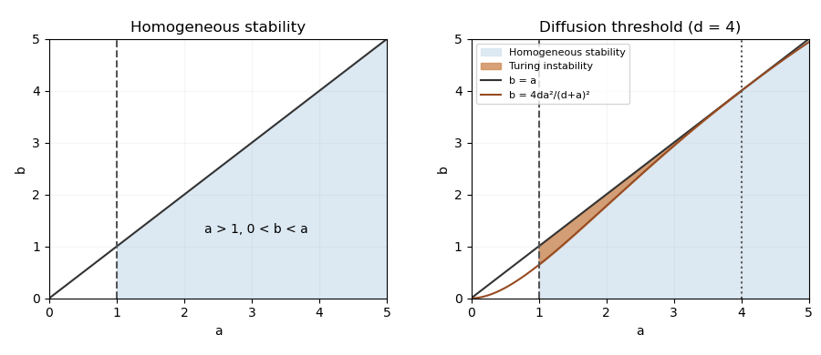

<h1 id="13b/solution">Solution</h1>

↑ **Parent:** [13B](../13b.md)

A positive [spatially homogeneous equilibrium](../../../../../spatially-homogeneous-equilibrium.md) satisfies $v=c+u$ and $au=bv$, giving

$$
\boxed{u_*=\frac{bc}{a-b},\qquad v_*=\frac{ac}{a-b}.}
$$

It exists iff $a>b$. The reaction [Jacobian matrix](../../../../../jacobian-matrix.md) is

$$
J=u_*\begin{pmatrix}1&-1\\a^2/b&-a\end{pmatrix},\qquad
\operatorname{tr}J=u_*(1-a),\quad\det J=u_*^2\frac{a(a-b)}b.
$$

Thus [linear stability analysis](../../../../../linear-stability.md) gives strict homogeneous stability precisely when

$$
\boxed{a>1,\qquad0<b<a.}
$$

The boundaries are not included: at $a=1$ the [linearization](../../../../../linearization.md) has purely imaginary exponents, and at $a=b$ the positive equilibrium ceases to exist.

For a mode $\cos(kx)$, put $q=k^2$. The perturbation matrix is $J-\operatorname{diag}(q,dq)$. In the homogeneously stable region its [trace](../../../../../matrix-trace.md) is still negative, so a growing mode exists iff its [determinant](../../../../../determinant.md) is negative:

$$
D(q)=dq^2+u_*(a-d)q+u_*^2\frac{a(a-b)}b<0.
$$

This upward quadratic is negative for some $q>0$ precisely when

$$
\boxed{d>a>1,\qquad\frac{4da^2}{(d+a)^2}<b<a.}
$$

Such a [Turing instability](../../../../../turing-instability.md) region is nonempty iff $d>1$. The unstable band is

$$
\frac{u_*}{2d}\left[d-a-\sqrt{(d-a)^2-\frac{4da(a-b)}b}\right]<k^2<
\frac{u_*}{2d}\left[d-a+\sqrt{(d-a)^2-\frac{4da(a-b)}b}\right].
$$

For a finite domain only the admissible boundary-condition [wavenumbers](../../../../../wavenumber.md) in this band grow. The region shown below describes a continuous [wavenumber](../../../../../wavenumber.md) [spectrum](../../../../../spectrum-functional-analysis.md).

**[Figure 1](#13b/image-homogeneous-stability-and-diffusion-driven-instability-for-d-4). Homogeneous stability and diffusion-driven instability for d=4**.

At onset the minimum of $D$ is zero and $q_c=u_*(d-a)/(2d)$. On the threshold $b=4da^2/(d+a)^2$, substitution gives $u_*=4dac/(d-a)^2$. Hence

$$
\boxed{k_c=\sqrt{\frac{2ac}{d-a}}.}
$$

This last expression is the threshold [wavenumber](../../../../../wavenumber.md); away from onset the fastest-growing mode need not coincide with the minimum of the [determinant](../../../../../determinant.md).

## ↑ Ancestors (10)

1. [13B](../13b.md)
2. [Paper 4](../../paper-4-split.md)
3. [Ii](../../split.md)
4. [2017](../../../split.md)
5. [Past exam of the mathematics course of the University of Cambridge](../../../../split.md)
6. [Mathematics course of the University of Cambridge](../../../../../mathematics-course-of-the-university-of-cambridge.md)
7. [Course of the University of Cambridge](../../../../../course-of-the-university-of-cambridge.md)
8. [University of Cambridge](../../../../../university-of-cambridge-split.md)
9. [List of universities](../../../../../list-of-universities.md)
10. [Codex Wiki](../../../../../split.md)
