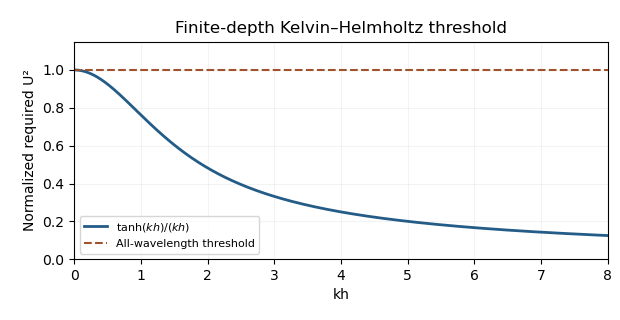

<h1 id="37b/solution">Solution</h1>

↑ **Parent:** [37B](../37b.md)

Assume incompressible inviscid layers, gravity $-g\mathbf e_y$, no [surface tension](../../../../../surface-tension.md), and irrotational perturbations of the uniform base flows. The full bulk equations are $\nabla\cdot\mathbf u_j=0$ and $\partial_t\mathbf u_j+\mathbf u_j\cdot\nabla\mathbf u_j=-\rho_j^{-1}\nabla p_j-g\mathbf e_y$. At the rigid walls $u_{1y}(h)=u_{2y}(-h)=0$. At the material interface $y=\eta(x,t)$ each layer obeys $u_{jy}=\eta_t+u_{jx}\eta_x$, and $p_1=p_2$. There is no tangential-velocity matching condition across this [vortex sheet](../../../../../vortex-sheet.md).

Write $\mathbf u_j=(U_j,0)+\nabla\phi_j$, with $U_1=U$, $U_2=-U$. Then $\nabla^2\phi_j=0$, and the wall conditions are $\partial_y\phi_1(h)=\partial_y\phi_2(-h)=0$. Linearizing the interface conditions at zero gives

$$
\partial_y\phi_j(0)=(\partial_t+U_j\partial_x)\eta,
$$

$$
\rho_1(\partial_t+U\partial_x)\phi_1-\rho_2(\partial_t-U\partial_x)\phi_2=(\rho_2-\rho_1)g\eta.
$$

The second follows from linear Bernoulli [pressure](../../../../../pressure.md) $p_j'=-\rho_j(\partial_t+U_j\partial_x)\phi_j$ and the [hydrostatic pressure](../../../../../hydrostatic-pressure.md) shift $-\rho_jg\eta$.

For $k>0$, use amplitudes $\phi_1=B_1\cosh k(y-h)e^{ikx+\sigma t}$ and $\phi_2=B_2\cosh k(y+h)e^{ikx+\sigma t}$. Kinematics gives $B_1=-(\sigma+ikU)A/[k\sinh kh]$ and $B_2=(\sigma-ikU)A/[k\sinh kh]$. The dynamic condition becomes

$$
\rho_1(\sigma+ikU)^2+\rho_2(\sigma-ikU)^2=-(\rho_2-\rho_1)gk\tanh kh.
$$

[Completing the square](../../../../../completing-the-square.md) yields

$$
\sigma=ikU\frac{\rho_2-\rho_1}{\rho_1+\rho_2}\pm\sqrt{\frac{4\rho_1\rho_2}{(\rho_1+\rho_2)^2}k^2U^2-\frac{\rho_2-\rho_1}{\rho_1+\rho_2}gk\tanh kh}.
$$

A positive [real part](../../../../../real-part.md) occurs precisely when

$$
\boxed{U^2>\frac{\rho_2^2-\rho_1^2}{4\rho_1\rho_2}\frac gk\tanh kh.}
$$

The function $\tanh(kh)/k$ decreases strictly from $h$ at $k=0$ to zero at infinity. Indeed its [derivative](../../../../../derivative.md) has numerator $kh\operatorname{sech}^2(kh)-\tanh(kh)<0$, since $\sinh(2kh)>2kh$. Therefore the minimum speed producing instability at every finite nonzero [wavenumber](../../../../../wavenumber.md) is

$$
\boxed{U_{\rm crit}=\sqrt{\frac{(\rho_2^2-\rho_1^2)gh}{4\rho_1\rho_2}}.}
$$

At equality every $k>0$ still satisfies the strict growth inequality, since $\tanh(kh)<kh$; the limiting infinite-wavelength mode is marginal. A strict uniform long-wave margin requires $U>U_{\rm crit}$.

**[Figure 5](#37b/image-normalized-finite-depth-shear-instability-threshold). Normalized finite-depth shear-instability threshold**.

## ↑ Ancestors (10)

1. [37B](../37b.md)
2. [Paper 4](../../paper-4-split.md)
3. [Ii](../../split.md)
4. [2017](../../../split.md)
5. [Past exam of the mathematics course of the University of Cambridge](../../../../split.md)
6. [Mathematics course of the University of Cambridge](../../../../../mathematics-course-of-the-university-of-cambridge.md)
7. [Course of the University of Cambridge](../../../../../course-of-the-university-of-cambridge.md)
8. [University of Cambridge](../../../../../university-of-cambridge-split.md)
9. [List of universities](../../../../../list-of-universities.md)
10. [Codex Wiki](../../../../../split.md)
