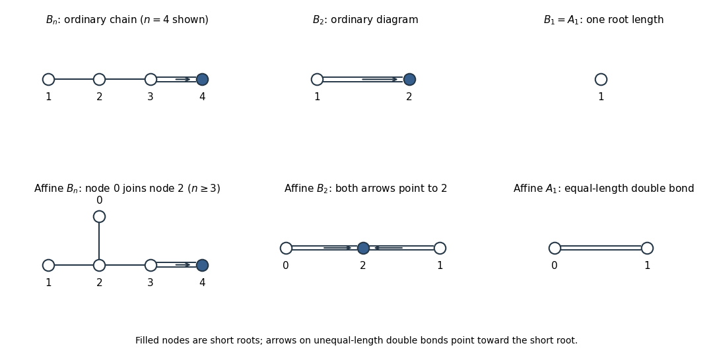
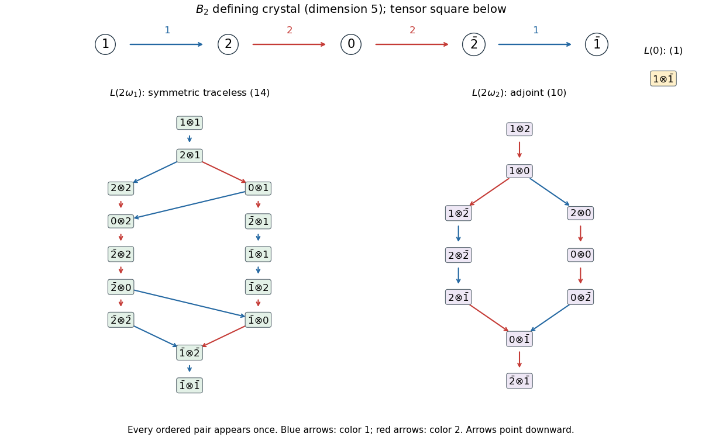
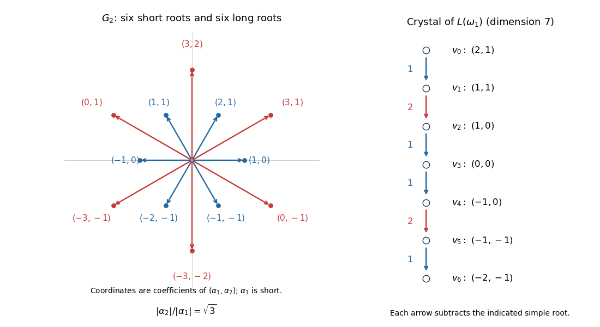

# Paper 102

↑ **Parent:** [Iii](../iii.md)

[https://www.maths.cam.ac.uk/postgrad/part-iii/files/pastpapers/2017/paper_102.pdf](https://www.maths.cam.ac.uk/postgrad/part-iii/files/pastpapers/2017/paper_102.pdf)

**Table of contents**

- [1](#1)
  - [i](#1/i)
    - [Solution](#1/i/solution)
  - [ii](#1/ii)
    - [Solution](#1/ii/solution)
- [2](#2)
  - [i](#2/i)
    - [Solution](#2/i/solution)
  - [ii](#2/ii)
    - [Solution](#2/ii/solution)
- [3](#3)
  - [i](#3/i)
    - [Solution](#3/i/solution)
  - [ii](#3/ii)
    - [Solution](#3/ii/solution)
  - [iii](#3/iii)
    - [Solution](#3/iii/solution)
  - [iv](#3/iv)
    - [Solution](#3/iv/solution)
- [4](#4)
  - [i](#4/i)
    - [Solution](#4/i/solution)
  - [ii](#4/ii)
    - [Solution](#4/ii/solution)
- [5](#5)
  - [i](#5/i)
    - [Solution](#5/i/solution)
  - [ii](#5/ii)
    - [Solution](#5/ii/solution)
  - [iii](#5/iii)
    - [Solution](#5/iii/solution)

## 1

↑ **Parent:** [Paper 102](paper-102.md)

<h3 id="1/i">i</h3>

↑ **Parent:** [1](#1)

<h4 id="1/i/solution">Solution</h4>

↑ **Parent:** [I](#1/i)

A [simple Lie algebra](../../../semisimple-lie-algebra.md#simple-lie-algebra) is a nonabelian [Lie algebra](../../../lie-algebra.md) whose only [Lie algebra ideals](../../../lie-algebra.md#ideal-of-a-lie-algebra) are zero and the whole algebra. Assume $n\geq2$; $\mathfrak{sl}_1=0$ is not simple. We prove the assertion by the [matrix-unit extraction lemma for special linear ideals](../../../semisimple-lie-algebra.md#matrix-unit-extraction-lemma-for-special-linear-ideals), avoiding any classification theorem.

Let $I$ be a nonzero ideal in the [special linear Lie algebra](../../../semisimple-lie-algebra.md#special-linear-lie-algebra) and $0\ne A\in I$. If an off-diagonal entry $A_{ji}$ is nonzero, two [commutators](../../../lie-algebra.md#commutator) with the [matrix unit](../../../vector-space.md#matrix-unit) $E_{ij}$ give

$$
[E_{ij},[E_{ij},A]]=-2A_{ji}E_{ij}\in I,
$$

so $E_{ij}\in I$. If $A$ is diagonal and nonscalar, choose unequal diagonal entries; $[E_{ij},A]=(A_{jj}-A_{ii})E_{ij}$ again supplies a [matrix unit](../../../vector-space.md#matrix-unit). A nonzero scalar matrix cannot have zero [trace](../../../linear-algebra.md#matrix-trace) over $\mathbb C$, so these cases cover every nonzero $A$.

Once $E_{ij}\in I$, its bracket with $E_{ji}$ gives $H=E_{ii}-E_{jj}$, and $[H,E_{ji}]=-2E_{ji}$ puts the reverse unit in $I$. Bracketing with the other off-diagonal [matrix units](../../../vector-space.md#matrix-unit) generates every off-diagonal unit: for a third index $k$, $[E_{ij},E_{jk}]=E_{ik}$ and $[E_{ki},E_{ij}]=E_{kj}$; using the reverse unit fills the remaining row and column, then $[E_{ki},E_{i\ell}]=E_{k\ell}$ fills the others. Opposite pairs generate every trace-zero diagonal matrix. These vectors span $\mathfrak{sl}_n$, so

$$
\boxed{\mathfrak{sl}_n(\mathbb C)\text{ is simple for }n\geq2.}
$$

<h3 id="1/ii">ii</h3>

↑ **Parent:** [1](#1)

<h4 id="1/ii/solution">Solution</h4>

↑ **Parent:** [Ii](#1/ii)

In [field characteristic](../../../algebra.md#characteristic-of-a-field) $p$, the identity matrix has [trace](../../../linear-algebra.md#matrix-trace) $p=0$, and hence belongs to $\mathfrak{sl}_p$. Its span is a nonzero proper [central ideal](../../../lie-algebra.md#central-ideal), so $\mathfrak{sl}_p$ is not a [simple Lie algebra](../../../semisimple-lie-algebra.md#simple-lie-algebra). In fact its [center of a Lie algebra](../../../lie-algebra.md#center-of-a-lie-algebra) is precisely $kI_p$: commuting with every off-diagonal [matrix unit](../../../vector-space.md#matrix-unit) forces a matrix to be scalar.

For $p>2$, the [matrix-unit extraction lemma for special linear ideals](../../../semisimple-lie-algebra.md#matrix-unit-extraction-lemma-for-special-linear-ideals) still works because two is invertible. Any ideal containing a nonscalar matrix contains every off-diagonal [matrix unit](../../../vector-space.md#matrix-unit) and every trace-zero diagonal matrix, hence equals $\mathfrak{sl}_p$. Therefore an ideal of the [quotient Lie algebra](../../../lie-algebra.md#quotient-lie-algebra) pulls back either to the center or to the whole algebra. The quotient is nonabelian, since $[E_{12},E_{23}]=E_{13}$ remains nonzero modulo the center. Consequently

$$
\boxed{\mathfrak{sl}_p/kI_p\text{ is simple for }p>2.}
$$

No separation of diagonal [root spaces](../../../semisimple-lie-algebra.md#root-space) is needed, so this proof also handles $p=3$ without assuming their weights are distinct.

For $p=2$, every trace-zero two-by-two matrix has the form $aI+bE_{12}+cE_{21}$. The only nonzero bracket between these basis vectors is $[E_{12},E_{21}]=I$, which is central. Thus

$$
\boxed{\mathfrak{sl}_2/kI\text{ is a two-dimensional abelian Lie algebra in characteristic two.}}
$$

## 2

↑ **Parent:** [Paper 102](paper-102.md)

<h3 id="2/i">i</h3>

↑ **Parent:** [2](#2)

<h4 id="2/i/solution">Solution</h4>

↑ **Parent:** [I](#2/i)

For the finite-dimensional [Lie algebra representation](../../../lie-algebra.md#lie-algebra-representation) specified in the PDF, a [Lie-invariant bilinear form](../../../lie-algebra.md#lie-invariant-bilinear-form) satisfies

$$
B(xv,w)+B(v,xw)=0\qquad(x\in\mathfrak g,\ v,w\in V).
$$

The [dual Lie algebra representation](../../../lie-algebra.md#dual-lie-algebra-representation) has action $(x\phi)(w)=-\phi(xw)$, so the map $T_B:V\to V^*$ defined by $T_B(v)=B(v,-)$ is an [intertwining operator](../../../representation-theory.md#intertwining-operator). If $V$ is [irreducible](../../../representation-theory.md#irreducible-representation) and $B\ne0$, its [kernel](../../../linear-algebra.md#kernel-of-a-linear-map) is zero. Since $V,V^*$ have equal finite [dimension](../../../vector-space.md#dimension-vector-space), $T_B$ is an [isomorphism](../../../algebra.md#isomorphism), and $B$ is a [nondegenerate bilinear form](../../../linear-algebra.md#nondegenerate-bilinear-form).

For $B_1\ne0$, the composition $T_{B_1}^{-1}T_{B_2}$ is a representation endomorphism. Over an [algebraically closed field](../../../algebra.md#algebraically-closed-field), the [Schur lemma](../../../representation-theory.md#schur-s-lemma) makes it scalar, proving

$$
\boxed{B_2=\lambda B_1.}
$$

Transposing $B$ gives another [Lie-invariant bilinear form](../../../lie-algebra.md#lie-invariant-bilinear-form). For $B\ne0$, write $B^T=\mu B$; transposing twice gives $\mu^2=1$. In [field characteristic](../../../algebra.md#characteristic-of-a-field) different from two, this means $\mu=1$ or $\mu=-1$. Thus the form is a [symmetric bilinear form](../../../linear-algebra.md#symmetric-bilinear-form) or an [alternating bilinear form](../../../linear-algebra.md#alternating-bilinear-form), respectively. The zero form has both properties. In the second case $B(v,v)=-B(v,v)$ forces $B(v,v)=0$, using the same characteristic assumption.

<h3 id="2/ii">ii</h3>

↑ **Parent:** [2](#2)

<h4 id="2/ii/solution">Solution</h4>

↑ **Parent:** [Ii](#2/ii)

Use the [classification of finite-dimensional sl2 representations](../../../semisimple-lie-algebra.md#classification-of-finite-dimensional-sl2-representations). In the irreducible representation $V(m)$, choose $v_j=f^jv_0$, $0\leq j\leq m$, so

$$
hv_j=(m-2j)v_j,\qquad fv_j=v_{j+1},\qquad
ev_j=j(m-j+1)v_{j-1},
$$

with vectors beyond the endpoints interpreted as zero. The [invariant form on an irreducible sl2 module](../../../semisimple-lie-algebra.md#invariant-form-on-an-irreducible-sl2-module) is

$$
\boxed{B(v_j,v_k)=\begin{cases}(-1)^j,&j+k=m,\\0,&j+k\ne m.\end{cases}}
$$

Its anti-diagonal entries are nonzero, so it is [nondegenerate](../../../linear-algebra.md#nondegenerate-bilinear-form). [Lie-invariant bilinear form](../../../lie-algebra.md#lie-invariant-bilinear-form) invariance under $h$ follows from the sum of the two weights. For $f$, the two potentially nonzero terms are $(-1)^{j+1}$ and $(-1)^j$. For $e$, their coefficients coincide when $j+k=m+1$, and their signs are opposite. These checks prove invariance under the generators of the [sl2 Lie algebra](../../../semisimple-lie-algebra.md#sl2-lie-algebra).

Interchanging $j,k$ multiplies the form by $(-1)^m$, giving

$$
\boxed{B\text{ is symmetric for even }m,\quad\text{alternating for odd }m.}
$$

Equivalently it is a [symmetric bilinear form](../../../linear-algebra.md#symmetric-bilinear-form) in [odd integer](../../../number-theory.md#odd-integer) [dimension](../../../vector-space.md#dimension-vector-space) and an [alternating bilinear form](../../../linear-algebra.md#alternating-bilinear-form) in [even number](../../../number-theory.md#even-number) [dimension](../../../vector-space.md#dimension-vector-space). The [Weyl complete reducibility theorem](../../../semisimple-lie-algebra.md#weyl-complete-reducibility-theorem) expresses any finite-dimensional representation as a [direct sum](../../../vector-space.md#direct-sum) of these irreducibles. Give each summand the displayed form and make different summands orthogonal. The resulting form is invariant and nondegenerate. On a reducible representation with both parities, this orthogonal sum need not itself be symmetric or alternating; the dichotomy in the preceding part required irreducibility.

## 3

↑ **Parent:** [Paper 102](paper-102.md)

<h3 id="3/i">i</h3>

↑ **Parent:** [3](#3)

<h4 id="3/i/solution">Solution</h4>

↑ **Parent:** [I](#3/i)

The PDF's $J$ is the anti-diagonal identity matrix. Write $\bar i=2n+2-i$ and $o=n+1$. Its diagonal [Cartan subalgebra](../../../semisimple-lie-algebra.md#cartan-subalgebra) consists of

$$
H=\operatorname{diag}(h_1,\ldots,h_n,0,-h_n,\ldots,-h_1),\qquad
\varepsilon_i(H)=h_i.
$$

The defining matrix identity says $A_{ij}=-A_{\bar j,\bar i}$. The [root spaces](../../../semisimple-lie-algebra.md#root-space) have the following [root vectors](../../../semisimple-lie-algebra.md#root-vector), together with their opposites:

$$
\begin{array}{c|c}
\text{root}&\text{root vector}\\\hline
\varepsilon_i-\varepsilon_j&E_{ij}-E_{\bar j,\bar i}\quad(i\ne j)\\
\varepsilon_i+\varepsilon_j&E_{i,\bar j}-E_{j,\bar i}\quad(i<j)\\
\varepsilon_i&E_{i,o}-E_{o,\bar i}
\end{array}
$$

The negative short root has vector $E_{o,i}-E_{\bar i,o}$. Hence the [root-space decomposition](../../../semisimple-lie-algebra.md#root-space-decomposition) is $\mathfrak g=\mathfrak t\oplus\bigoplus_{\alpha\in R}\mathfrak g_\alpha$, each root space is one-dimensional, and the [Bn root system](../../../semisimple-lie-algebra.md#bn-root-system) is

$$
\boxed{R=\{\pm\varepsilon_i\pm\varepsilon_j:i<j\}\cup\{\pm\varepsilon_i\}.}
$$

There are $2n^2$ roots and $n$ zero-weight dimensions, giving $\dim\mathfrak g=n(2n+1)$ as a check. Upper triangular matrices give

$$
\boxed{R^+=\{\varepsilon_i-\varepsilon_j,\varepsilon_i+\varepsilon_j:i<j\}\cup\{\varepsilon_i\},\quad
\alpha_i=\varepsilon_i-\varepsilon_{i+1}\ (i<n),\quad\alpha_n=\varepsilon_n.}
$$

For $n\geq2$, the [highest root](../../../semisimple-lie-algebra.md#highest-root) is $\theta=\varepsilon_1+\varepsilon_2=\alpha_1+2\alpha_2+\cdots+2\alpha_n$. The [fundamental weights](../../../semisimple-lie-algebra.md#fundamental-weight) and [Weyl vector](../../../semisimple-lie-algebra.md#half-sum-of-positive-roots) are

$$
\boxed{\omega_i=\varepsilon_1+\cdots+\varepsilon_i\ (i<n),\quad
\omega_n=\tfrac12(\varepsilon_1+\cdots+\varepsilon_n),\quad
\rho=\sum_{i=1}^n\left(n-i+\tfrac12\right)\varepsilon_i.}
$$

These weights pair to $\delta_{ij}$ with the [simple coroots](../../../semisimple-lie-algebra.md#simple-coroot); summing the positive roots gives the displayed $\rho$.

The [Dynkin diagram](../../../semisimple-lie-algebra.md#dynkin-diagram) is the chain $1,\ldots,n$, with single edges except a double edge between $n-1$ and $n$, whose arrow points to the short root $\alpha_n$. In the [Extended Dynkin diagram](../../../semisimple-lie-algebra.md#extended-dynkin-diagram), $\alpha_0=-\theta$ attaches by a single edge to $\alpha_2$ when $n\geq3$. For $n=2$, both long nodes $\alpha_0,\alpha_1$ have a double edge to the short node $\alpha_2$. The [Bn Dynkin diagram and affine extension](../../../semisimple-lie-algebra.md#bn-dynkin-diagram-and-affine-extension) below distinguishes these small-rank cases.

**[Figure 1](#3/i/image-ordinary-and-affine-dynkin-diagrams-of-type-b). Ordinary and affine Dynkin diagrams of type B**.

For $n=1$, the system is $A_1$: $R^+=\{\varepsilon_1\}$, $\theta=\varepsilon_1$, $\omega_1=\rho=\varepsilon_1/2$. Its ordinary diagram is one node; its affine diagram has two equal-length nodes with the usual affine $A_1$ double bond.

<h3 id="3/ii">ii</h3>

↑ **Parent:** [3](#3)

<h4 id="3/ii/solution">Solution</h4>

↑ **Parent:** [Ii](#3/ii)

Let $U$ be a four-dimensional [symplectic vector space](../../../linear-algebra.md#symplectic-vector-space). The [symplectic contraction of an exterior square](../../../linear-algebra.md#symplectic-contraction-of-an-exterior-square) splits $\Lambda^2U$ into its five-dimensional [primitive exterior square](../../../linear-algebra.md#primitive-exterior-square) $W$ and the invariant line spanned by the inverse symplectic bivector $\Omega$. Choose $\operatorname{vol}=\Omega\wedge\Omega/2$. Exterior multiplication defines a [symmetric bilinear form](../../../linear-algebra.md#symmetric-bilinear-form) on $\Lambda^2U$ by $\xi\wedge\eta=B(\xi,\eta)\operatorname{vol}$; it is symmetric because both degrees are two. In a symplectic basis, $\Omega\wedge\Omega=2\operatorname{vol}\ne0$, and $W=\Omega^\perp$, so the restriction to $W$ is [nondegenerate](../../../linear-algebra.md#nondegenerate-bilinear-form).

The [symplectic Lie algebra](../../../semisimple-lie-algebra.md#symplectic-lie-algebra) $\mathfrak{sp}_4$ preserves this form, giving a homomorphism $\mathfrak{sp}_4\to\mathfrak{so}(W)$. It is injective: an element acting trivially on $W$ also acts trivially on $\Omega$, hence on all of $\Lambda^2U$. In a four-vector basis, the identities $Ae_i\wedge e_j+e_i\wedge Ae_j=0$ first force every off-diagonal coefficient of $A$ to vanish, then force $A_{ii}+A_{jj}=0$ for every pair. Over $\mathbb C$ these equalities imply $A=0$.

Both Lie algebras have [dimension](../../../vector-space.md#dimension-vector-space) ten: $\dim\mathfrak{sp}_4=4\cdot5/2$ and $\dim\mathfrak{so}_5=5\cdot4/2$. The injective map is therefore an [isomorphism](../../../algebra.md#isomorphism), proving the [exceptional isomorphism between sp4 and so5](../../../semisimple-lie-algebra.md#exceptional-isomorphism-between-sp4-and-so5):

$$
\boxed{\mathfrak{sp}_4(\mathbb C)\cong\mathfrak{so}_5(\mathbb C).}
$$

<h3 id="3/iii">iii</h3>

↑ **Parent:** [3](#3)

<h4 id="3/iii/solution">Solution</h4>

↑ **Parent:** [Iii](#3/iii)

Identify the diagonal [Cartan subalgebra](../../../semisimple-lie-algebra.md#cartan-subalgebra) with coordinates $(h_1,\ldots,h_n)$. The [root reflection](../../../semisimple-lie-algebra.md#root-reflection) $s_\alpha$ is $h\mapsto h-2(h,\alpha)\alpha/(\alpha,\alpha)$ in the standard Euclidean identification. For the [Bn root system](../../../semisimple-lie-algebra.md#bn-root-system), this gives

$$
\boxed{\begin{aligned}
s_{\varepsilon_i}:&\ h_i\mapsto-h_i,\\
s_{\varepsilon_i-\varepsilon_j}:&\ (h_i,h_j)\mapsto(h_j,h_i),\\
s_{\varepsilon_i+\varepsilon_j}:&\ (h_i,h_j)\mapsto(-h_j,-h_i).
\end{aligned}}
$$

All unlisted coordinates stay fixed, and $s_{-\alpha}=s_\alpha$. These transformations are coordinate permutations and independent sign changes. They generate exactly the [signed symmetric group](../../../lie-theory.md#hyperoctahedral-group), so

$$
\boxed{W\cong(\mathbb Z/2\mathbb Z)^n\rtimes S_n,\qquad |W|=2^n n!.}
$$

Here $S_n$ permutes the $n$ factors in the [semidirect product](../../../group-theory.md#semidirect-product).

<h3 id="3/iv">iv</h3>

↑ **Parent:** [3](#3)

<h4 id="3/iv/solution">Solution</h4>

↑ **Parent:** [Iv](#3/iv)

The PDF uses $V=\mathbb C^{2n+1}$ for $\mathfrak{so}_{2n+1}$; the TeX incorrectly turns this into a power of two. The [crystal of the defining odd-orthogonal representation](../../../semisimple-lie-algebra.md#crystal-of-the-defining-odd-orthogonal-representation) is the chain with weights $\varepsilon_1,\ldots,\varepsilon_n,0,-\varepsilon_n,\ldots,-\varepsilon_1$. Label its vertices $1,\ldots,n,0,\bar n,\ldots,\bar1$. Its directed edge colors are

$$
1,2,\ldots,n-1,n,n,n-1,\ldots,2,1.
$$

In particular the short-root string $n\to0\to\bar n$ has two edges of color $n$.

For a full drawing of the [tensor product of crystals](../../../semisimple-lie-algebra.md#tensor-product-of-crystals) in any rank, take every ordered pair of chain vertices $(a,b)$. Let $\varepsilon_i(b)$ count incoming edges of color $i$ along its string, and let $\varphi_i(a)$ count outgoing ones. We use the convention

$$
\widetilde f_i(a\otimes b)=
\begin{cases}\widetilde f_i(a)\otimes b,&\varphi_i(a)>\varepsilon_i(b),\\
a\otimes\widetilde f_i(b),&\varphi_i(a)\leq\varepsilon_i(b),\end{cases}
$$

omitting an edge when the indicated operator vanishes. This [crystal tensor-product rule](../../../semisimple-lie-algebra.md#crystal-tensor-product-rule) specifies every vertex and every edge; the raising rule uses $\geq$ for its first-factor branch. The picture shows the chain and all 25 tensor vertices for $n=2$, with connected components distinguished by node color.

**[Figure 2](#3/iv/image-the-type-b2-defining-crystal-and-its-tensor-square). The type-B2 defining crystal and its tensor square**.

For $n\geq2$, the three [highest-weight vectors](../../../semisimple-lie-algebra.md#highest-weight-vector) of the tensor crystal are $1\otimes1$, $1\otimes2$ and $1\otimes\bar1$. They have weights $2\varepsilon_1$, $\varepsilon_1+\varepsilon_2$ and zero. There are no others: a highest tensor vertex must have highest first factor, and the string inequalities then restrict its second factor to these three vertices. Therefore

$$
\boxed{V\otimes V=L(2\varepsilon_1)\oplus L(\varepsilon_1+\varepsilon_2)\oplus L(0).}
$$

The summands are the traceless [symmetric square](../../../linear-algebra.md#symmetric-square), the [exterior square](../../../linear-algebra.md#exterior-square) (the [Adjoint representation](../../../lie-algebra.md#adjoint-representation-of-a-lie-algebra)), and the invariant scalar line. Their dimensions are $(2n+1)(n+1)-1$, $n(2n+1)$ and one, summing to $(2n+1)^2$. For $n\geq3$ the first two [highest weights](../../../semisimple-lie-algebra.md#highest-weight-of-a-representation) are $2\omega_1,\omega_2$; for $n=2$ they are $2\omega_1,2\omega_2$. For $n=1$, the three tensor highest vertices are $1\otimes1,1\otimes0,1\otimes\bar1$, giving $L(4\omega_1)\oplus L(2\omega_1)\oplus L(0)$ of dimensions $5,3,1$.

## 4

↑ **Parent:** [Paper 102](paper-102.md)

<h3 id="4/i">i</h3>

↑ **Parent:** [4](#4)

<h4 id="4/i/solution">Solution</h4>

↑ **Parent:** [I](#4/i)

Choose a positive [root system](../../../semisimple-lie-algebra.md#root-system) $R^+$ for a complex [semisimple Lie algebra](../../../semisimple-lie-algebra.md), with [Weyl group](../../../semisimple-lie-algebra.md#weyl-group) $W$ and [Weyl vector](../../../semisimple-lie-algebra.md#half-sum-of-positive-roots) $\rho=\frac12\sum_{\alpha\in R^+}\alpha$. For a [dominant integral weight](../../../semisimple-lie-algebra.md#dominant-integral-weight) $\lambda$, let $L(\lambda)$ denote its finite-dimensional [irreducible representation](../../../representation-theory.md#irreducible-representation), and use formal symbols with $e^\mu e^\nu=e^{\mu+\nu}$. Its [formal character of a weight module](../../../semisimple-lie-algebra.md#formal-character-of-a-weight-module) is $\operatorname{ch}L(\lambda)=\sum_\mu\dim L(\lambda)_\mu\,e^\mu$. The [Weyl character formula](../../../semisimple-lie-algebra.md#weyl-character-formula) says

$$
\boxed{\operatorname{ch}L(\lambda)
=\frac{\sum_{w\in W}\det(w)e^{w(\lambda+\rho)}}
{\sum_{w\in W}\det(w)e^{w\rho}}.}
$$

Here $\det(w)=(-1)^{\ell(w)}$, the sign of the product of simple [root reflections](../../../semisimple-lie-algebra.md#root-reflection). The [Weyl denominator formula](../../../semisimple-lie-algebra.md#weyl-denominator-formula) is

$$
\boxed{\sum_{w\in W}\det(w)e^{w\rho}
=e^\rho\prod_{\alpha\in R^+}(1-e^{-\alpha}).}
$$

The quotient is initially interpreted in the fraction field of the group algebra of the [weight lattice](../../../semisimple-lie-algebra.md#weight-lattice); the theorem makes it a finite character.

<h3 id="4/ii">ii</h3>

↑ **Parent:** [4](#4)

<h4 id="4/ii/solution">Solution</h4>

↑ **Parent:** [Ii](#4/ii)

Take an integer $k\geq0$, so $k\rho$ is a [dominant integral weight](../../../semisimple-lie-algebra.md#dominant-integral-weight). Apply the dilation $e^\mu\mapsto e^{(k+1)\mu}$ to the [Weyl denominator formula](../../../semisimple-lie-algebra.md#weyl-denominator-formula):

$$
\sum_{w\in W}\det(w)e^{(k+1)w\rho}
=e^{(k+1)\rho}\prod_{\alpha\in R^+}(1-e^{-(k+1)\alpha}).
$$

This is exactly the numerator of the [Weyl character formula](../../../semisimple-lie-algebra.md#weyl-character-formula) for $L(k\rho)$. Divide by its denominator and use a finite [geometric series](../../../real-analysis.md#geometric-series) in each root direction:

$$
\boxed{\operatorname{ch}L(k\rho)
=e^{k\rho}\prod_{\alpha\in R^+}
\frac{1-e^{-(k+1)\alpha}}{1-e^{-\alpha}}
=e^{k\rho}\prod_{\alpha\in R^+}(1+e^{-\alpha}+\cdots+e^{-k\alpha}).}
$$

This [character of a Weyl-vector multiple](../../../semisimple-lie-algebra.md#character-of-a-weyl-vector-multiple) also gives $\dim L(k\rho)=(k+1)^{|R^+|}$ by evaluating every formal exponential at one. This evaluation is safe in the final polynomial expression, without dividing by a zero denominator.

## 5

↑ **Parent:** [Paper 102](paper-102.md)

<h3 id="5/i">i</h3>

↑ **Parent:** [5](#5)

<h4 id="5/i/solution">Solution</h4>

↑ **Parent:** [I](#5/i)

Number the [G2 root system](../../../semisimple-lie-algebra.md#g2-root-system) with $\alpha_1$ short and $\alpha_2$ long, normalized by $(\alpha_1,\alpha_1)=2$, $(\alpha_2,\alpha_2)=6$ and $(\alpha_1,\alpha_2)=-3$. Its positive roots are $\alpha_1,\alpha_2,\alpha_1+\alpha_2,2\alpha_1+\alpha_2,3\alpha_1+\alpha_2,3\alpha_1+2\alpha_2$, and the negatives complete the twelve-root system. The short roots form one hexagon, and the long roots form a rotated hexagon whose radius is $\sqrt3$ times larger. The picture also supplies the crystal requested in the next part.

**[Figure 3](#5/i/image-the-type-g2-root-system-and-defining-crystal). The type-G2 root system and defining crystal**.

The [fundamental weights](../../../semisimple-lie-algebra.md#fundamental-weight) are $\omega_1=2\alpha_1+\alpha_2$, $\omega_2=3\alpha_1+2\alpha_2$, and $\rho=\omega_1+\omega_2$. The six positive [coroots](../../../semisimple-lie-algebra.md#coroot), in coordinates relative to $\alpha_1^\vee,\alpha_2^\vee$, are $(1,0),(0,1),(1,3),(2,3),(1,1),(1,2)$. Applying the [Weyl dimension formula](../../../semisimple-lie-algebra.md#weyl-dimension-formula) to $\lambda=n_1\omega_1+n_2\omega_2$ therefore gives the [G2 dimension polynomial](../../../semisimple-lie-algebra.md#g2-dimension-polynomial)

$$
\boxed{\dim L(\lambda)=\frac{(n_1+1)(n_2+1)(n_1+n_2+2)
(n_1+2n_2+3)(n_1+3n_2+4)(2n_1+3n_2+5)}{120}.}
$$

The denominator is the product $1\cdot1\cdot2\cdot3\cdot4\cdot5$ of the corresponding pairings with $\rho$. As checks, the weights $\omega_1,\omega_2,2\omega_1$ give dimensions $7,14,27$ respectively.

<h3 id="5/ii">ii</h3>

↑ **Parent:** [5](#5)

<h4 id="5/ii/solution">Solution</h4>

↑ **Parent:** [Ii](#5/ii)

The [G2 dimension polynomial](../../../semisimple-lie-algebra.md#g2-dimension-polynomial) gives dimension seven at the short-root [fundamental weight](../../../semisimple-lie-algebra.md#fundamental-weight), so

$$
\boxed{V=L(\omega_1),\qquad\omega_1=2\alpha_1+\alpha_2.}
$$

The [crystal of the seven-dimensional G2 representation](../../../semisimple-lie-algebra.md#crystal-of-the-seven-dimensional-g2-representation) is a chain whose weights, in order, are

$$
2\alpha_1+\alpha_2,\quad\alpha_1+\alpha_2,\quad\alpha_1,\quad0,
\quad-\alpha_1,\quad-\alpha_1-\alpha_2,\quad-2\alpha_1-\alpha_2.
$$

Its successive arrow colors are $1,2,1,1,2,1$, as drawn above. Each arrow subtracts its indicated [simple root](../../../semisimple-lie-algebra.md#simple-root); in particular the central three vertices form a length-two string of color one. The six nonzero weights are exactly the six short roots, each with [multiplicity](../../../polynomial.md#multiplicity-mathematics) one, and the zero weight also has [multiplicity](../../../polynomial.md#multiplicity-mathematics) one.

<h3 id="5/iii">iii</h3>

↑ **Parent:** [5](#5)

<h4 id="5/iii/solution">Solution</h4>

↑ **Parent:** [Iii](#5/iii)

Choose the chain basis $v_0,\ldots,v_6$ from the preceding part, normalized by $v_1=f_1v_0$, $v_2=f_2v_1$, $v_3=f_1v_2$. The associated [sl2 Lie algebra](../../../semisimple-lie-algebra.md#sl2-lie-algebra) strings give $e_1v_1=v_0$, $e_1v_3=2v_2$ and $e_2v_2=v_1$; other raising actions used below vanish because their proposed weights do not occur.

In the [exterior square](../../../linear-algebra.md#exterior-square), $v_0\wedge v_1$ is a [highest-weight vector](../../../semisimple-lie-algebra.md#highest-weight-vector) of weight $2\omega_1-\alpha_1=\omega_2$: $e_1$ produces $v_0\wedge v_0=0$, and $e_2$ kills both factors. Also

$$
w=v_0\wedge v_3-2v_1\wedge v_2
$$

is a nonzero [highest-weight vector](../../../semisimple-lie-algebra.md#highest-weight-vector) of weight $\omega_1$. Its two $e_1$ terms cancel, and its $e_2$ image is zero. The [Weyl complete reducibility theorem](../../../semisimple-lie-algebra.md#weyl-complete-reducibility-theorem) supplies irreducible summands with those weights; their dimensions $14+7=21$ exhaust $\dim\Lambda^2V$. Thus

$$
\boxed{\Lambda^2V=L(\omega_2)\oplus L(\omega_1).}
$$

For the [symmetric square](../../../linear-algebra.md#symmetric-square), $v_0\otimes v_0$ is a [highest-weight vector](../../../semisimple-lie-algebra.md#highest-weight-vector) of weight $2\omega_1$, giving a 27-dimensional summand. The [longest Weyl-group element](../../../semisimple-lie-algebra.md#longest-weyl-group-element) of $G_2$ acts as minus the identity, so the [highest weight of a dual representation](../../../lie-algebra.md#highest-weight-of-a-dual-representation) is $-w_0\omega_1=\omega_1$: $V$ is self-dual. A nonzero intertwiner $V\to V^*$ gives a [nondegenerate](../../../linear-algebra.md#nondegenerate-bilinear-form) [Lie-invariant bilinear form](../../../lie-algebra.md#lie-invariant-bilinear-form). It is symmetric, since an [alternating bilinear form](../../../linear-algebra.md#alternating-bilinear-form) cannot be nondegenerate in odd [dimension](../../../vector-space.md#dimension-vector-space). Its inverse is a nonzero invariant vector in $S^2V$, supplying the scalar summand. Since $27+1=28=\dim S^2V$,

$$
\boxed{S^2V=L(2\omega_1)\oplus L(0).}
$$

These are the [exterior and symmetric squares of the seven-dimensional G2 representation](../../../semisimple-lie-algebra.md#exterior-and-symmetric-squares-of-the-seven-dimensional-g2-representation); all highest-weight and dimension claims are specified rather than relying on an unstated cross-product identity.

## ↑ Ancestors (8)

1. [Iii](../iii.md)
2. [2017](../../2017.md)
3. [Past exam of the mathematics course of the University of Cambridge](../../../past-exam-of-the-mathematics-course-of-the-university-of-cambridge.md)
4. [Mathematics course of the University of Cambridge](../../../university-of-cambridge.md#mathematics-course-of-the-university-of-cambridge)
5. [Course of the University of Cambridge](../../../university-of-cambridge.md#course-of-the-university-of-cambridge)
6. [University of Cambridge](../../../university-of-cambridge.md)
7. [List of universities](../../../README.md#list-of-universities)
8. [Codex Wiki](../../../README.md)
