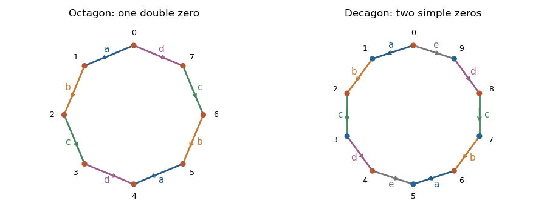

<h1 id="2/c/solution">Solution</h1>

↑ **Parent:** [C](../c.md)

Label the polygon vertices $v_0,\ldots,v_{2n-1}$ cyclically. Translation pairing of opposite sides identifies

$$
v_i\sim v_{i+n+1},\qquad v_{i+1}\sim v_{i+n},
$$

with indices modulo $2n$. The vertex classes are consequently the cosets of the subgroup generated by $n-1$ in $\mathbb Z/(2n)$, and their number is

$$
V=\gcd(2n,n-1)=
\begin{cases}1,&n\text{ even},\\2,&n\text{ odd}.\end{cases}
$$

The quotient is a [compact](../../../../../../compact-space.md) [Hausdorff space](../../../../../../hausdorff-space.md). An interior point has a disk neighbourhood, a paired-side point has two half-disks joined to a disk, and each vertex class has its incident sectors cyclically joined to a cone, topologically a disk. Thus it is a [connected](../../../../../../connected-space.md) [closed surface](../../../../../../closed-surface.md) with an [orientation](../../../../../../orientation-of-a-simplex.md). Its [Euler characteristic](../../../../../../euler-characteristic.md) is $V-n+1$, since there are $n$ paired edges and one face. Hence

$$
\boxed{g(X_n)=\frac{n+1-V}{2}=\left\lfloor\frac n2\right\rfloor.}
$$

The polygon interior and paired-side charts are [translation surface](../../../../../../translation-surface.md) charts with $\omega_n=dz$. Each corner angle is $(n-1)\pi/n$. For even $n$, all $2n$ corners meet, giving [cone angle](../../../../../../cone-angle.md) $2\pi(n-1)$; for odd $n$, each of the two classes contains $n$ corners, giving [cone angle](../../../../../../cone-angle.md) $(n-1)\pi$. Both are integral multiples of $2\pi$. A cone of angle $2\pi(k+1)$ has the local uniformizing coordinate $\zeta$ with $w=\zeta^{k+1}$; the [holomorphic one-form](../../../../../../holomorphic-one-form.md) is $(k+1)\zeta^k\,d\zeta$. Filling the vertices therefore supplies the [Riemann surface](../../../../../../riemann-surfaces.md) structure and the [holomorphic one-form](../../../../../../holomorphic-one-form.md), with

$$
\boxed{\begin{array}{ll}
n\text{ even}:&\text{one vertex class of zero order }n-2,\\
n\text{ odd}:&\text{two vertex classes, each of zero order }(n-3)/2.
\end{array}}
$$

An order-zero entry denotes a regular point, not an actual zero: for $n=2,3$ the surface is a [torus](../../../../../../torus.md) and the form is nowhere zero. The [zero orders](../../../../../../order-of-a-zero-of-a-differential.md) otherwise sum to $2g-2$, as a check against the degree of the [canonical bundle](../../../../../../canonical-bundle.md).

**[Figure 1](#2/c/image-opposite-side-pairings-one-vertex-class-in-the-octagon-and-two-in-the-decagon). Opposite-side pairings: one vertex class in the octagon and two in the decagon**.

For $n=4$, the form has one double zero and lies in the [stratum of holomorphic one-forms](../../../../../../stratum-of-holomorphic-one-forms.md) $\mathcal H(2)$; for $n=5$, it has two simple zeros and lies in $\mathcal H(1,1)$. The [SL2R action on differentials](../../../../../../sl2r-action-on-differentials.md) preserves zero multiplicities, as the local cone argument shows. Therefore

$$
\boxed{(X_4,\omega_4)\text{ and }(X_5,\omega_5)\text{ are not in the same }\mathrm{SL}_2(\mathbb R)\text{ orbit}.}
$$

Their equal [genus](../../../../../../genus-of-a-surface.md) and area do not distinguish the orbits; their different [strata of holomorphic one-forms](../../../../../../stratum-of-holomorphic-one-forms.md) do.

## ↑ Ancestors (11)

1. [C](../c.md)
2. [2](../../2.md)
3. [Paper 132](../../../paper-132-split.md)
4. [Iii](../../../split.md)
5. [2017](../../../../split.md)
6. [Past exam of the mathematics course of the University of Cambridge](../../../../../split.md)
7. [Mathematics course of the University of Cambridge](../../../../../../mathematics-course-of-the-university-of-cambridge.md)
8. [Course of the University of Cambridge](../../../../../../course-of-the-university-of-cambridge.md)
9. [University of Cambridge](../../../../../../university-of-cambridge-split.md)
10. [List of universities](../../../../../../list-of-universities.md)
11. [Codex Wiki](../../../../../../split.md)
