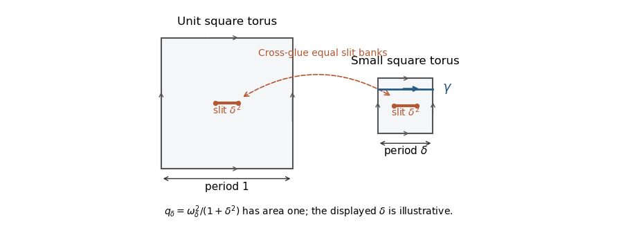

<h1 id="4/b/solution">Solution</h1>

↑ **Parent:** [B](../b.md)

The given $\gamma$ is a [simple closed curve](../../../../../../simple-closed-curve.md). Assume it is essential; for a contractible class both infimal lengths are already zero. Write $\ell_n=\ell_{X_n}(\gamma)$. The [collar lemma](../../../../../../collar-lemma.md) supplies an embedded [annulus](../../../../../../annulus-mathematics.md) with coordinates $r\in(-w_n,w_n)$ and $t\in\mathbb R/\mathbb Z$, and metric

$$
ds^2=dr^2+\ell_n^2\cosh^2r\,dt^2,\qquad
\sinh w_n\,\sinh(\ell_n/2)=1.
$$

Set $y(r)=\ell_n^{-1}\int_0^r\operatorname{sech}s\,ds$. This changes the metric to a positive scalar multiple of $dt^2+dy^2$, so the [conformal modulus of an annulus](../../../../../../conformal-modulus-of-an-annulus.md) is

$$
M_n=\frac2{\ell_n}\int_0^{w_n}\operatorname{sech}r\,dr
=\frac2{\ell_n}\arctan\!\left(\frac1{\sinh(\ell_n/2)}\right)
\sim\frac\pi{\ell_n}\longrightarrow\infty.
$$

The [extremal length](../../../../../../extremal-length.md) of its core curves is $1/M_n$. Allowing all curves [homotopic](../../../../../../homotopy.md) to $\gamma$ in $X_n$ can only decrease infimal lengths, while the area of a metric on all of $X_n$ is at least its area on the collar. Thus $\lambda(\gamma,X_n)\leq1/M_n$. Use the particular [conformal metric](../../../../../../conformal-metric.md) $|q_n|^{1/2}$, whose [area of a quadratic differential](../../../../../../area-of-a-quadratic-differential.md) is one:

$$
\boxed{L(\gamma,|q_n|^{1/2})^2
\leq\lambda(\gamma,X_n)\leq\frac1{M_n}\longrightarrow0.}
$$

This proves the required implication uniformly over all the area-one [holomorphic quadratic differentials](../../../../../../holomorphic-quadratic-differential.md) on these surfaces.

**The converse is false.** Here is an explicit [slit connected sum of translation tori](../../../../../../slit-connected-sum-of-translation-tori.md). Start with square flat copies of a [torus](../../../../../../torus.md) $T_1=\mathbb C/(\mathbb Z+i\mathbb Z)$ and $T_\delta=\mathbb C/(\delta\mathbb Z+i\delta\mathbb Z)$, where $\delta\to0$. Cut a horizontal slit of physical length $\delta^2$ in each, centred in an interior coordinate disk, and cross-glue the banks by translation. The resulting surface has [genus](../../../../../../genus-of-a-surface.md) two. Its two slit endpoints have [cone angle](../../../../../../cone-angle.md) $4\pi$, so the locally defined $dz$ extends to a [holomorphic one-form](../../../../../../holomorphic-one-form.md) $\omega_\delta$ with two simple zeros. Its flat area is $1+\delta^2$. Set

$$
q_\delta=\frac{\omega_\delta^2}{1+\delta^2},
$$

which is a [holomorphic quadratic differential](../../../../../../holomorphic-quadratic-differential.md) of area one. Let $\gamma$ be a horizontal generator in the small [torus](../../../../../../torus.md), taken away from the slit and fixed by the marking of this small handle. Then

$$
L(\gamma,|q_\delta|^{1/2})\leq\frac{\delta}{\sqrt{1+\delta^2}}\longrightarrow0.
$$

To verify that its hyperbolic length does not tend to zero, construct a uniform lower bound on [extremal length](../../../../../../extremal-length.md). On the unit square [torus](../../../../../../torus.md) choose a disk $D$ about the eventual slit centre and a [smooth cutoff function](../../../../../../smooth-cutoff-function.md) $\chi$ equal to one on a smaller disk and supported in $D$. Let $x$ denote a local real coordinate on $D$; in the first term below, $dx$ is the globally defined torus one-form, while $\chi x$ is extended by zero outside $D$. The real [closed differential form](../../../../../../closed-differential-form.md)

$$
\alpha=dx-d(\chi x)
$$

is globally defined, vanishes on the smaller disk, and has period one on the horizontal generator. Pull it to $T_\delta$ by the rescaling map $z\mapsto z/\delta$, and extend it by zero across the slit and over the other [torus](../../../../../../torus.md). For sufficiently small $\delta$, the slit is inside the region where the form vanishes. Hence this extension $\alpha_\delta$ is a [smooth](../../../../../../smooth-function.md) [closed differential form](../../../../../../closed-differential-form.md) on the [connected](../../../../../../connected-space.md) sum, with $\int_\gamma\alpha_\delta=1$.

Define a nonnegative [conformal metric](../../../../../../conformal-metric.md) density by the pointwise norm of $\alpha_\delta$ relative to the flat metric. Two-dimensional scale invariance gives

$$
A_\rho=\int|\alpha_\delta|^2\,dA=\int_{T_1}|\alpha|^2\,dA=:C<\infty,
$$

independently of $\delta$. For every representative $\widetilde\gamma$ [homotopic](../../../../../../homotopy.md) to $\gamma$,

$$
\int_{\widetilde\gamma}\rho\,ds
\geq\left|\int_{\widetilde\gamma}\alpha_\delta\right|=1,
$$

because the period of a [closed differential form](../../../../../../closed-differential-form.md) is unchanged by homotopy. This is the [extremal length lower bound from a closed one-form](../../../../../../extremal-length-lower-bound-from-a-closed-one-form.md); therefore $\lambda(\gamma,X_\delta)\geq1/C>0$. If $\ell_{X_\delta}(\gamma)$ tended to zero along any subsequence, the collar estimate would force $\lambda(\gamma,X_\delta)\to0$, a contradiction. In fact its hyperbolic lengths are uniformly bounded away from zero. Thus

$$
\boxed{L(\gamma,|q_\delta|^{1/2})\to0
\quad\text{while}\quad
\inf_{\delta\text{ small}}\ell_{X_\delta}(\gamma)>0.}
$$

For every fixed $g>2$, replace $T_1$ by the area-one [translation surface](../../../../../../translation-surface.md) $X_{2g-2}$ constructed in the polygon argument; its [genus](../../../../../../genus-of-a-surface.md) is $g-1$. Cut its slit inside a nonsingular [flat coordinate](../../../../../../natural-coordinate-of-a-holomorphic-differential.md) disk. The new connected sum has [genus](../../../../../../genus-of-a-surface.md) $g$, and the area normalization, small-handle length bound and closed-one-form energy argument are unchanged. Thus the converse fails at every fixed [genus](../../../../../../genus-of-a-surface.md) $g\geq2$.

**[Figure 2](#4/b/image-a-small-translation-torus-joined-by-equal-slits-its-generator-is-flat-short-while-retaining-a-positive-extremal-length-bound). A small translation torus joined by equal slits; its generator is flat-short while retaining a positive extremal-length bound**.

## ↑ Ancestors (11)

1. [B](../b.md)
2. [4](../../4.md)
3. [Paper 132](../../../paper-132-split.md)
4. [Iii](../../../split.md)
5. [2017](../../../../split.md)
6. [Past exam of the mathematics course of the University of Cambridge](../../../../../split.md)
7. [Mathematics course of the University of Cambridge](../../../../../../mathematics-course-of-the-university-of-cambridge.md)
8. [Course of the University of Cambridge](../../../../../../course-of-the-university-of-cambridge.md)
9. [University of Cambridge](../../../../../../university-of-cambridge-split.md)
10. [List of universities](../../../../../../list-of-universities.md)
11. [Codex Wiki](../../../../../../split.md)
