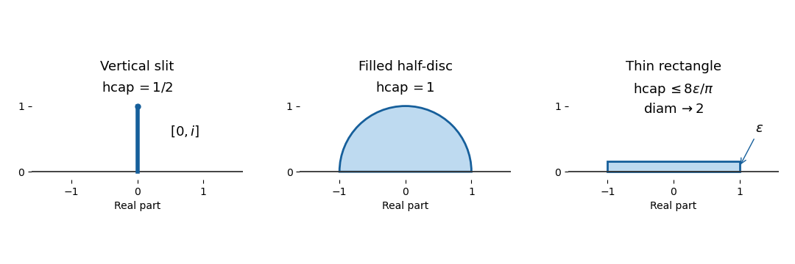

<h1 id="2/b/solution">Solution</h1>

↑ **Parent:** [B](../b.md)

**The implication is false**. Take the thin rectangles

$$
A_\varepsilon=\{x+iy:-1\leq x\leq1,\ 0<y\leq\varepsilon\},\qquad 0<\varepsilon\leq1.
$$

Each is a [compact H-hull](../../../../../../compact-h-hull.md), and $\operatorname{diam}(A_\varepsilon)=\sqrt{4+\varepsilon^2}\to2$. We verify that its [half-plane capacity](../../../../../../half-plane-capacity.md) nevertheless tends to zero.

Let $K=\{z\in\mathbb H:|z|\leq2\}$, which contains all these rectangles. At the [Brownian exit time](../../../../../../brownian-exit-time.md) $\tau$ from $\mathbb H\setminus A_\varepsilon$, the exit height is at most $\varepsilon$, and a positive exit height requires hitting $K$ before $\mathbb R$. Therefore

$$
\mathbb E_{iy}[\operatorname{Im}B_\tau]\leq\varepsilon\,\mathbb P_{iy}(B\text{ hits }K\text{ before }\mathbb R).
$$

For $y>2$, [conformal invariance of planar Brownian motion](../../../../../../conformal-invariance-of-planar-brownian-motion.md) and $g_K(z)=z+4/z$ identify the probability on the right with the [harmonic measure](../../../../../../harmonic-measure.md) of $[-4,4]$ from $i(y-4/y)$ in $\mathbb H$. Integrating the [Poisson kernel for the upper half-plane](../../../../../../poisson-kernel-for-the-upper-half-plane.md) gives

$$
\mathbb P_{iy}(B\text{ hits }K\text{ before }\mathbb R)=\frac2\pi\arctan\frac4{y-4/y},\qquad \lim_{y\to\infty}y\,\mathbb P_{iy}(B\text{ hits }K\text{ before }\mathbb R)=\frac8\pi.
$$

The [Brownian representation of half-plane capacity](../../../../../../brownian-representation-of-half-plane-capacity.md) now proves the explicit estimate

$$
\boxed{0\leq\operatorname{hcap}(A_\varepsilon)\leq\frac8\pi\varepsilon\longrightarrow0,\qquad \operatorname{diam}(A_\varepsilon)\longrightarrow2.}
$$

Choose $\varepsilon=1/n$ to obtain the required sequence. This is an instance of [half-plane capacity of a low rectangle](../../../../../../half-plane-capacity-of-a-low-rectangle.md): shrinking height can make [half-plane capacity](../../../../../../half-plane-capacity.md) small while horizontal extent stays fixed.

**[Figure 1](#2/b/image-half-plane-capacities-of-a-slit-half-disc-and-thin-rectangle). Half-plane capacities of a slit, half-disc and thin rectangle**. Two explicit [half-plane capacities](../../../../../../half-plane-capacity.md) and a thin [compact H-hull](../../../../../../compact-h-hull.md) with fixed width and vanishing [half-plane capacity](../../../../../../half-plane-capacity.md).

## ↑ Ancestors (11)

1. [B](../b.md)
2. [2](../../2.md)
3. [Paper 203](../../../paper-203-split.md)
4. [Iii](../../../split.md)
5. [2017](../../../../split.md)
6. [Past exam of the mathematics course of the University of Cambridge](../../../../../split.md)
7. [Mathematics course of the University of Cambridge](../../../../../../mathematics-course-of-the-university-of-cambridge.md)
8. [Course of the University of Cambridge](../../../../../../course-of-the-university-of-cambridge.md)
9. [University of Cambridge](../../../../../../university-of-cambridge-split.md)
10. [List of universities](../../../../../../list-of-universities.md)
11. [Codex Wiki](../../../../../../split.md)
