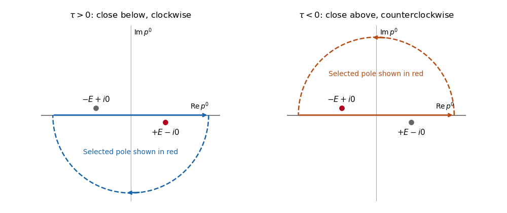

# Paper 301

↑ **Parent:** [Iii](../iii.md)

[https://www.maths.cam.ac.uk/postgrad/part-iii/files/pastpapers/2017/paper_301.pdf](https://www.maths.cam.ac.uk/postgrad/part-iii/files/pastpapers/2017/paper_301.pdf)

**Table of contents**

- [1](#1)
  - [a](#1/a)
    - [Solution](#1/a/solution)
  - [b](#1/b)
    - [Solution](#1/b/solution)
  - [c](#1/c)
    - [Solution](#1/c/solution)
  - [d](#1/d)
    - [Solution](#1/d/solution)
- [2](#2)
  - [a](#2/a)
    - [Solution](#2/a/solution)
  - [b](#2/b)
    - [Solution](#2/b/solution)
  - [c](#2/c)
    - [Solution](#2/c/solution)
  - [d](#2/d)
    - [i](#2/d/i)
      - [Solution](#2/d/i/solution)
    - [ii](#2/d/ii)
      - [Solution](#2/d/ii/solution)
    - [iii](#2/d/iii)
      - [Solution](#2/d/iii/solution)
    - [iv](#2/d/iv)
      - [Solution](#2/d/iv/solution)
  - [e](#2/e)
    - [Solution](#2/e/solution)
  - [f](#2/f)
    - [Solution](#2/f/solution)
  - [g](#2/g)
    - [Solution](#2/g/solution)
- [3](#3)
  - [Solution](#3/solution)
- [4](#4)
  - [a](#4/a)
    - [Solution](#4/a/solution)
  - [b](#4/b)
    - [Solution](#4/b/solution)
  - [c](#4/c)
    - [Solution](#4/c/solution)

## 1

↑ **Parent:** [Paper 301](paper-301.md)

<h3 id="1/a">a</h3>

↑ **Parent:** [1](#1)

<h4 id="1/a/solution">Solution</h4>

↑ **Parent:** [A](#1/a)

Use [natural units](../../../physics.md#natural-units) $\hbar=c=1$ and the [Minkowski metric](../../../special-relativity.md#minkowski-metric) $\eta=\operatorname{diag}(1,-1,-1,-1)$ throughout. An Abelian [gauge transformation](../../../electromagnetism.md#gauge-transformation) is $A_\mu\mapsto A_\mu+\partial_\mu\chi$. For a sufficiently regular $\chi$, commuting the [partial derivatives](../../../calculus.md#partial-derivative) gives $F_{\mu\nu}\mapsto F_{\mu\nu}$, so the [Maxwell Lagrangian](../../../electromagnetism.md#maxwell-lagrangian) is invariant pointwise.

Vary the [action](../../../classical-mechanics.md#action) with respect to the [electromagnetic four-potential](../../../electromagnetism.md#electromagnetic-four-potential), using variations of [compact support](../../../function.md#compact-support) or vanishing on the [boundary](../../../topology.md#boundary-of-a-set). The antisymmetry of the [electromagnetic field tensor](../../../electromagnetism.md#electromagnetic-field-tensor) gives

$$
\delta\mathcal L=-\frac12F^{\mu\nu}\delta F_{\mu\nu}=-F^{\mu\nu}\partial_\mu\delta A_\nu.
$$

After [integration by parts](../../../calculus.md#integration-by-parts), $\delta S=\int d^4x\,(\partial_\mu F^{\mu\nu})\delta A_\nu$. The [principle of stationary action](../../../classical-mechanics.md#principle-of-stationary-action) therefore gives the source-free [Maxwell equations](../../../electromagnetism.md#maxwell-equations),

$$
\boxed{\partial_\mu F^{\mu\nu}=0\iff\Box A^\nu-\partial^\nu(\partial_\mu A^\mu)=0.}
$$

In the [Lorenz gauge](../../../electromagnetism.md#lorenz-gauge-condition), $\partial_\mu A^\mu=0$, this becomes $\Box A_\nu=0$ with $\Box=\partial_\mu\partial^\mu$. The PDF's name “Lorentz gauge” denotes the usual [Lorenz gauge](../../../electromagnetism.md#lorenz-gauge-condition), named after Lorenz. Residual [gauge transformations](../../../electromagnetism.md#gauge-transformation) preserve it when $\Box\chi=0$; this condition is not itself a complete removal of the gauge freedom.

<h3 id="1/b">b</h3>

↑ **Parent:** [1](#1)

<h4 id="1/b/solution">Solution</h4>

↑ **Parent:** [B](#1/b)

Write $D=\partial_\mu A^\mu$. The additional [gauge fixing](../../../relativistic-quantum-field.md#gauge-fixing) variation is $\delta(-D^2/2)=-D\partial_\mu\delta A^\mu$. [Integration by parts](../../../calculus.md#integration-by-parts) gives the [Euler-Lagrange field equation](../../../quantum-field-theory.md#euler-lagrange-field-equation) $\partial_\mu F^{\mu\nu}+\partial^\nu D=0$, hence $\Box A^\nu=0$. This equation follows from the gauge-fixed density without imposing $D=0$ as a separate operator identity.

Direct differentiation of the density as printed gives the [canonical momentum](../../../classical-mechanics.md#canonical-momentum) components conjugate to the lower-index fields:

$$
\boxed{\pi^\nu=\frac{\partial\mathcal L}{\partial\dot A_\nu}=-F^{0\nu}-\eta^{0\nu}D,\qquad \pi^0=-D,\quad\pi^i=\dot A_i-\partial_iA_0.}
$$

There is a boundary-term convention to reconcile with part (c). The [Feynman-gauge Maxwell kinetic density after a boundary-term subtraction](../../../relativistic-quantum-field.md#feynman-gauge-maxwell-kinetic-density-after-a-boundary-term-subtraction) is

$$
\mathcal L'=-\frac12\partial_\mu A_\nu\partial^\mu A^\nu,
\qquad
\mathcal L=\mathcal L'+\partial_\mu K^\mu,
\qquad
K^\mu=\frac12\bigl(A_\nu\partial^\nu A^\mu-A^\mu D\bigr).
$$

It has the same [Euler-Lagrange field equations](../../../quantum-field-theory.md#euler-lagrange-field-equation), but its [canonical momentum](../../../classical-mechanics.md#canonical-momentum) components are $\pi'^\nu=-\dot A^\nu$. The mode expansion supplied in part (c) is the expansion of these latter momenta. Thus it is valid after the stated boundary-term subtraction; it is not the direct derivative of the original density. For example, a time-independent spatially varying $A_0$ with $A_i=0$ gives $\pi^i=-\partial_iA_0$ but $\pi'^i=0$.

The [boundary-term shift of canonical field momenta](../../../classical-mechanics.md#boundary-term-shift-of-canonical-field-momenta) is a [canonical transformation](../../../classical-mechanics.md#canonical-transformation). If spatial boundary terms vanish, $B=\int d^3x\,K^0=\int d^3x\,A_0\partial_iA_i$, and $\pi^\nu=\pi'^\nu+\delta B/\delta A_\nu$. This explains why the two conventions have the same dynamics while their [momentum](../../../classical-mechanics.md#momentum) formulas differ.

<h3 id="1/c">c</h3>

↑ **Parent:** [1](#1)

<h4 id="1/c/solution">Solution</h4>

↑ **Parent:** [C](#1/c)

Use the supplied oscillator expansion, with the boundary-term convention for [momentum](../../../classical-mechanics.md#momentum) stated in part (b). Use a real [polarization vector](../../../relativistic-quantum-field.md#polarization-vector) basis, as in the supplied unconjugated [polarization completeness relation](../../../general-relativity.md#polarization-completeness-relation). Raise its second field index to obtain

$$
\sum_{\lambda,\lambda'}\epsilon_\mu^\lambda\epsilon^{\nu\lambda'}\eta^{\lambda\lambda'}=\delta_\mu{}^\nu.
$$

The mixed [commutator](../../../lie-algebra.md#commutator) contains only the annihilation-creation and creation-annihilation terms. Their signs are both positive after combining the minus sign in the [momentum](../../../classical-mechanics.md#momentum) expansion with the negative [Minkowski metric](../../../special-relativity.md#minkowski-metric) oscillator [commutator](../../../lie-algebra.md#commutator). Setting $\mathbf r=\mathbf x-\mathbf y$ and using the [momentum](../../../classical-mechanics.md#momentum) [Dirac delta distribution](../../../distribution-theory.md#dirac-delta-function) gives

$$
[A_\mu(\mathbf x),\pi^\nu(\mathbf y)]
=\frac i2\delta_\mu{}^\nu\int\frac{d^3p}{(2\pi)^3}\bigl(e^{i\mathbf p\cdot\mathbf r}+e^{-i\mathbf p\cdot\mathbf r}\bigr)
=i\delta_\mu{}^\nu\delta^3(\mathbf r).
$$

Here the last equality is the [Fourier representation of the Dirac delta function](../../../distribution-theory.md#fourier-representation-of-the-dirac-delta-function). Similarly,

$$
[A_\mu(\mathbf x),A_\nu(\mathbf y)]
=-\eta_{\mu\nu}\int\frac{d^3p}{(2\pi)^3}\frac{e^{i\mathbf p\cdot\mathbf r}-e^{-i\mathbf p\cdot\mathbf r}}{2|\mathbf p|}=0,
$$

because the integrand is odd under $\mathbf p\mapsto-\mathbf p$. The momentum-momentum [commutator](../../../lie-algebra.md#commutator) is proportional to the same odd difference, now weighted by $|\mathbf p|/2$, and also vanishes. Therefore the equal-time [canonical commutation relations](../../../quantum-mechanics.md#canonical-commutation-relation) are

$$
\boxed{[A_\mu(\mathbf x),\pi^\nu(\mathbf y)]=i\delta_\mu{}^\nu\delta^3(\mathbf x-\mathbf y),\quad[A_\mu,A_\nu]=[\pi^\mu,\pi^\nu]=0.}
$$

These are identities of [operator-valued distributions](../../../quantum-field-theory.md#operator-valued-distribution), understood after smearing. The extra indices in the TeX polarization relation are transcription defects; the PDF has the ordinary two-polarization completeness contraction used above. The direct momenta of part (b) also satisfy the [canonical commutation relations](../../../quantum-mechanics.md#canonical-commutation-relation) after their boundary-generated shift, although they do not have the unmodified mode expansion printed here.

<h3 id="1/d">d</h3>

↑ **Parent:** [1](#1)

<h4 id="1/d/solution">Solution</h4>

↑ **Parent:** [D](#1/d)

The oscillator-generated [covariant photon Fock space](../../../relativistic-quantum-field.md#covariant-photon-fock-space) has an [indefinite Hermitian form](../../../linear-algebra.md#indefinite-hermitian-form), not a positive [Hilbert space](../../../hilbert-space.md) [inner product](../../../linear-algebra.md#inner-product). For a normalizable one-photon [wave packet](../../../wave-equation.md#wave-packet) of polarization $\lambda$, its squared norm is proportional to $-\eta^{\lambda\lambda}\int d^3p\,|f(\mathbf p)|^2$. Thus $\lambda=0$ gives a [negative-norm photon state](../../../relativistic-quantum-field.md#negative-norm-photon-state). The divergent $\delta^3(0)$ of an unsmeared [momentum eigenstate](../../../quantum-mechanics.md#momentum-eigenstate) is a separate normalization issue, avoided by the [wave packet](../../../wave-equation.md#wave-packet).

Choose contravariant [polarization vectors](../../../relativistic-quantum-field.md#polarization-vector) $\epsilon^{0\mu}=(1,\mathbf0)$, $\epsilon^{3\mu}=(0,\widehat{\mathbf p})$, and two $\epsilon^{r\mu}=(0,\mathbf e_r)$ with $\mathbf e_r\cdot\mathbf p=0$ for $r=1,2$. The third spatial polarization is [longitudinal polarization](../../../wave-equation.md#longitudinal-polarization); the first two are [transverse polarization](../../../wave-equation.md#transverse-polarization). The [timelike photon polarization](../../../relativistic-quantum-field.md#timelike-photon-polarization) is distinct from the longitudinal one.

The [Gupta-Bleuler quantization](../../../relativistic-quantum-field.md#gupta-bleuler-formalism) condition sets the divergence of the [positive-frequency part of a quantum field](../../../quantum-field-theory.md#positive-frequency-part-of-a-quantum-field) to zero on physical states:

$$
(\partial_\mu A^\mu)^{(+)}|\Psi\rangle=0.
$$

Restore the factors $e^{-i|\mathbf p|t}$ to the annihilation terms. Since $p_\mu\epsilon^{0\mu}=|\mathbf p|$ and $p_\mu\epsilon^{3\mu}=-|\mathbf p|$, [Fourier transform](../../../analysis.md#fourier-transform) gives the equivalent condition

$$
\boxed{(a_{\mathbf p}^0-a_{\mathbf p}^3)|\Psi\rangle=0\quad\text{for every nonzero momentum, distributionally}.}
$$

Its sign depends on the chosen sign of the longitudinal [polarization vector](../../../relativistic-quantum-field.md#polarization-vector); the covariant condition does not.

To see its content for a general [Fock state](../../../quantum-field-theory.md#fock-state), temporarily discretize [momentum](../../../classical-mechanics.md#momentum) and decompose one unphysical oscillator sector as $|\Psi\rangle=\sum_{n,m\geq0}|n,m\rangle_{0,3}\otimes|\chi_{nm}\rangle_\perp$, where $|n,m\rangle=(a^{0\dagger})^n(a^{3\dagger})^m|0\rangle/\sqrt{n!m!}$. The temporal oscillator obeys $a^0|n,m\rangle=-\sqrt n|n-1,m\rangle$, while $a^3|n,m\rangle=\sqrt m|n,m-1\rangle$. The condition therefore becomes

$$
\sqrt{n+1}\,|\chi_{n+1,m}\rangle+\sqrt{m+1}\,|\chi_{n,m+1}\rangle=0.
$$

Equivalently, the allowed finite-particle states use the transverse [creation operators](../../../quantum-mechanics.md#creation-operator) and only $b^\dagger=a^{0\dagger}-a^{3\dagger}$ in the unphysical sector. Indeed the constraint acts on a [polynomial](../../../polynomial.md) of the two unphysical [creation operators](../../../quantum-mechanics.md#creation-operator) as $-\partial_{a^{0\dagger}}-\partial_{a^{3\dagger}}$, whose kernel consists of [polynomials](../../../polynomial.md) in their difference. Also $[b,b^\dagger]=-1+1=0$, and a state containing $b^\dagger$ is orthogonal to every constrained state because $b$ annihilates every such state. This argument applies mode by mode and extends by smearing to continuum [momentum](../../../classical-mechanics.md#momentum).

For one photon, $c_0a^{0\dagger}|0\rangle+c_3a^{3\dagger}|0\rangle$ is constrained only when $c_3=-c_0$, producing a null state. The [Gupta-Bleuler null-state quotient](../../../relativistic-quantum-field.md#gupta-bleuler-null-state-quotient) removes these null directions. **The condition excludes negative-norm physical states; quotienting its null states leaves the two positive-norm transverse photon polarizations.** The condition alone gives a [positive semidefinite Hermitian form](../../../linear-algebra.md#positive-semidefinite-hermitian-form), not yet a positive definite [Hilbert space](../../../hilbert-space.md).

## 2

↑ **Parent:** [Paper 301](paper-301.md)

<h3 id="2/a">a</h3>

↑ **Parent:** [2](#2)

<h4 id="2/a/solution">Solution</h4>

↑ **Parent:** [A](#2/a)

The [gamma matrices](../../../algebra.md#gamma-matrices) represent the spacetime [Clifford algebra](../../../algebra.md#clifford-algebra). With the [Minkowski metric](../../../special-relativity.md#minkowski-metric) convention above,

$$
\boxed{\{\gamma^\mu,\gamma^\nu\}=\gamma^\mu\gamma^\nu+\gamma^\nu\gamma^\mu=2\eta^{\mu\nu}I_4.}
$$

The braces denote the [anticommutator](../../../vector-space.md#anticommutator). Consequently $(\gamma^0)^2=I_4$, $(\gamma^i)^2=-I_4$, and distinct [gamma matrices](../../../algebra.md#gamma-matrices) anticommute. The [identity matrix](../../../vector-space.md#identity-matrix) is essential: the right side is a matrix equality, not a [scalar](../../../vector-space.md#scalar) equality. These signs agree with the explicit [Dirac representation of the gamma matrices](../../../algebra.md#dirac-representation-of-the-gamma-matrices) in the next part.

<h3 id="2/b">b</h3>

↑ **Parent:** [2](#2)

<h4 id="2/b/solution">Solution</h4>

↑ **Parent:** [B](#2/b)

Write every displayed block identity as $I_2$. Direct block multiplication in the [Dirac representation of the gamma matrices](../../../algebra.md#dirac-representation-of-the-gamma-matrices) gives

$$
(\widetilde\gamma^0)^2=I_4,\qquad
\widetilde\gamma^0\widetilde\gamma^i=\begin{pmatrix}0&\sigma^i\\\sigma^i&0\end{pmatrix},\qquad
\widetilde\gamma^i\widetilde\gamma^0=\begin{pmatrix}0&-\sigma^i\\-\sigma^i&0\end{pmatrix}.
$$

Thus their mixed [anticommutator](../../../vector-space.md#anticommutator) is zero. For two spatial indices,

$$
\widetilde\gamma^i\widetilde\gamma^j=-\begin{pmatrix}\sigma^i\sigma^j&0\\0&\sigma^i\sigma^j\end{pmatrix}.
$$

Using the [Pauli matrix multiplication law](../../../algebra.md#pauli-matrix-multiplication-law) gives

$$
\boxed{\{\widetilde\gamma^0,\widetilde\gamma^0\}=2I_4,\quad\{\widetilde\gamma^0,\widetilde\gamma^i\}=0,\quad\{\widetilde\gamma^i,\widetilde\gamma^j\}=-2\delta^{ij}I_4.}
$$

These exhaust all time-time, time-space and space-space cases of the [Clifford algebra](../../../algebra.md#clifford-algebra). No special choice of individual [Pauli matrices](../../../algebra.md#pauli-matrices) beyond their stated [anticommutator](../../../vector-space.md#anticommutator) is needed.

<h3 id="2/c">c</h3>

↑ **Parent:** [2](#2)

<h4 id="2/c/solution">Solution</h4>

↑ **Parent:** [C](#2/c)

A [Dirac-to-Weyl gamma-matrix similarity transform](../../../algebra.md#dirac-to-weyl-gamma-matrix-similarity-transform) with the required signs is

$$
\boxed{U=\frac1{\sqrt2}\begin{pmatrix}I_2&-I_2\\I_2&I_2\end{pmatrix},\qquad\gamma^\mu=U\widetilde\gamma^\mu U^{-1}.}
$$

It is a [unitary matrix](../../../linear-operator-theory.md#unitary-matrix), with $U^{-1}=U^\dagger=2^{-1/2}\begin{pmatrix}I_2&I_2\\-I_2&I_2\end{pmatrix}$. Multiplication gives

$$
U\widetilde\gamma^0U^{-1}=\begin{pmatrix}0&I_2\\I_2&0\end{pmatrix}.
$$

The matrix $U$ commutes with every $\widetilde\gamma^i$: their common block structure uses the same antisymmetric $2\times2$ block matrix, and the [scalar](../../../vector-space.md#scalar) blocks of $U$ commute with each [Pauli matrix](../../../algebra.md#pauli-matrices). Hence $U\widetilde\gamma^iU^{-1}=\widetilde\gamma^i$, exactly the spatial matrices specified in the [Weyl representation of the gamma matrices](../../../relativistic-quantum-field.md#weyl-representation-of-the-gamma-matrices). A [similarity transformation](../../../linear-algebra.md#similarity-transformation) preserves every [Clifford algebra](../../../algebra.md#clifford-algebra) relation, so no new consistency check is needed for the transformed representation.

<h3 id="2/d">d</h3>

↑ **Parent:** [2](#2)

<h4 id="2/d/i">i</h4>

↑ **Parent:** [D](#2/d)

<h5 id="2/d/i/solution">Solution</h5>

↑ **Parent:** [I](#2/d/i)

Use the [Clifford algebra](../../../algebra.md#clifford-algebra) to write $\gamma^\nu\gamma^\mu=2\eta^{\mu\nu}I_4-\gamma^\mu\gamma^\nu$. The [Lorentz generator from gamma-matrix commutators](../../../relativistic-quantum-field.md#lorentz-generator-from-gamma-matrix-commutators) is therefore

$$
S^{\mu\nu}=\frac14[\gamma^\mu,\gamma^\nu]=\frac12\gamma^\mu\gamma^\nu-\frac12\eta^{\mu\nu}I_4,
\qquad
\boxed{A=\frac12,\quad B=-\frac12.}
$$

This also checks the diagonal case $\mu=\nu$, where $S^{\mu\mu}=0$ because $(\gamma^\mu)^2=\eta^{\mu\mu}I_4$. The metric term in the printed expression is understood to multiply the [identity matrix](../../../vector-space.md#identity-matrix). The generators are antisymmetric in their two spacetime indices.

<h4 id="2/d/ii">ii</h4>

↑ **Parent:** [D](#2/d)

<h5 id="2/d/ii/solution">Solution</h5>

↑ **Parent:** [Ii](#2/d/ii)

The [commutator](../../../lie-algebra.md#commutator) with the [scalar](../../../vector-space.md#scalar) metric term vanishes. Reorder the third [gamma matrix](../../../algebra.md#gamma-matrices) using the [Clifford algebra](../../../algebra.md#clifford-algebra) twice:

$$
\gamma^\mu\gamma^\nu\gamma^\rho
=2\eta^{\nu\rho}\gamma^\mu-2\eta^{\mu\rho}\gamma^\nu+\gamma^\rho\gamma^\mu\gamma^\nu.
$$

Subtract the last term and multiply by $1/2$ to obtain

$$
\boxed{[S^{\mu\nu},\gamma^\rho]=\eta^{\nu\rho}\gamma^\mu-\eta^{\mu\rho}\gamma^\nu,\qquad C=1,\ D=-1.}
$$

This is the infinitesimal [vector](../../../vector-space.md#vector) transformation law implemented by the [Spinor representation of the Lorentz group](../../../relativistic-quantum-field.md#spinor-representation-of-the-lorentz-group). The first contraction is $\eta^{\nu\rho}$ as printed in the PDF; the TeX conversion's $\eta^{\rho\rho}$ is erroneous and would fail, for example, when $\mu=0,\nu=1,\rho=2$: the actual [commutator](../../../lie-algebra.md#commutator) is zero.

<h4 id="2/d/iii">iii</h4>

↑ **Parent:** [D](#2/d)

<h5 id="2/d/iii/solution">Solution</h5>

↑ **Parent:** [Iii](#2/d/iii)

Apply the [commutator derivation identity](../../../lie-algebra.md#commutator-derivation-identity) $[S,AB]=[S,A]B+A[S,B]$ and the preceding [gamma matrix](../../../algebra.md#gamma-matrices) transformation identity. Keeping the matrix order unchanged gives

$$
[S^{\mu\nu},\gamma^\rho\gamma^\sigma]
=\gamma^\mu\eta^{\nu\rho}\gamma^\sigma-\gamma^\nu\eta^{\mu\rho}\gamma^\sigma+\gamma^\rho\gamma^\mu\eta^{\nu\sigma}-\gamma^\rho\gamma^\nu\eta^{\mu\sigma}.
$$

Thus

$$
\boxed{E=1,\quad F=-1,\quad G=1,\quad H=-1.}
$$

The order of the [gamma matrices](../../../algebra.md#gamma-matrices) matters, since they generally do not commute. The PDF has the four ordinary metric contractions shown here; the conversion's stray powers such as $\eta^\nu\rho^\sigma$ are not mathematical expressions to retain.

<h4 id="2/d/iv">iv</h4>

↑ **Parent:** [D](#2/d)

<h5 id="2/d/iv/solution">Solution</h5>

↑ **Parent:** [Iv](#2/d/iv)

Since $S^{\rho\sigma}=\frac14[\gamma^\rho,\gamma^\sigma]$, apply the [commutator derivation identity](../../../lie-algebra.md#commutator-derivation-identity) to this [commutator](../../../lie-algebra.md#commutator) and insert part (ii):

$$
\begin{aligned}
[S^{\mu\nu},S^{\rho\sigma}]
&=\frac14\left([[S^{\mu\nu},\gamma^\rho],\gamma^\sigma]+[\gamma^\rho,[S^{\mu\nu},\gamma^\sigma]]\right)\\
&=\eta^{\nu\rho}S^{\mu\sigma}-\eta^{\mu\rho}S^{\nu\sigma}+\eta^{\nu\sigma}S^{\rho\mu}-\eta^{\mu\sigma}S^{\rho\nu}.
\end{aligned}
$$

This is exactly the printed [Lorentz algebra](../../../semisimple-lie-algebra.md#lorentz-algebra) relation, including its final two signs; their alternative appearance in other formulas comes from $S^{\rho\mu}=-S^{\mu\rho}$. Therefore **the matrices S form a representation of the Lorentz algebra**. Their definition contains no extra factor of $i$, so the spatial rotation generators below are represented by [skew-Hermitian matrices](../../../linear-operator-theory.md#skew-hermitian-matrix). Adding a factor of $i$ would change the convention for the [Lie algebra](../../../lie-algebra.md) structure constants and cannot be done silently.

<h3 id="2/e">e</h3>

↑ **Parent:** [2](#2)

<h4 id="2/e/solution">Solution</h4>

↑ **Parent:** [E](#2/e)

For the stated [matrix exponential](../../../linear-operator-theory.md#matrix-exponential) parametrization in the connected [Proper orthochronous Lorentz group](../../../special-relativity.md#proper-orthochronous-lorentz-group), use the corresponding [Spinor representation of the Lorentz group](../../../relativistic-quantum-field.md#spinor-representation-of-the-lorentz-group):

$$
\boxed{\psi'_\alpha(x)=D(\Lambda)_\alpha{}^\beta\psi_\beta(\Lambda^{-1}x),\qquad D(\Lambda)=\exp\!\left(\frac12\Omega_{\rho\sigma}S^{\rho\sigma}\right).}
$$

The spacetime argument is inverse-transformed because this is an active transformation of the field at a fixed coordinate $x$. Equivalently, with $x'=\Lambda x$, $\psi'(x')=D(\Lambda)\psi(x)$. The identity $[S^{\mu\nu},\gamma^\rho]=\eta^{\nu\rho}\gamma^\mu-\eta^{\mu\rho}\gamma^\nu$ integrates to $D^{-1}\gamma^\mu D=\Lambda^\mu{}_\nu\gamma^\nu$, which ensures covariance of the [Dirac equation](../../../relativistic-quantum-field.md#dirac-equation).

Strictly, $D$ depends on a lift to the [Spin group](../../../semisimple-lie-algebra.md#spin-group), not just on the final [Lorentz transformation](../../../special-relativity.md#lorentz-transformation): two lifts differ by sign. The specified generator exponential chooses a lift along its continuous path from the identity. This qualification is essential for the full-rotation comparison in part (g).

<h3 id="2/f">f</h3>

↑ **Parent:** [2](#2)

<h4 id="2/f/solution">Solution</h4>

↑ **Parent:** [F](#2/f)

In either the displayed [Dirac representation of the gamma matrices](../../../algebra.md#dirac-representation-of-the-gamma-matrices) or the displayed [Weyl representation of the gamma matrices](../../../relativistic-quantum-field.md#weyl-representation-of-the-gamma-matrices), the spatial blocks give

$$
[\gamma^j,\gamma^k]=-\begin{pmatrix}[\sigma^j,\sigma^k]&0\\0&[\sigma^j,\sigma^k]\end{pmatrix}.
$$

The [Pauli matrix commutator identity](../../../algebra.md#pauli-matrix-commutator-identity) $[\sigma^j,\sigma^k]=2i\epsilon^{jkl}\sigma^l$ therefore yields

$$
\boxed{S^{jk}=-\frac i2\epsilon^{jkl}\begin{pmatrix}\sigma^l&0\\0&\sigma^l\end{pmatrix}.}
$$

The [Levi-Civita symbol](../../../calculus.md#levi-civita-symbol) is normalized by $\epsilon^{123}=1$. The constant is $-i/2$, consistent with rotation generators represented by [skew-Hermitian matrices](../../../linear-operator-theory.md#skew-hermitian-matrix) under the chosen [Lorentz algebra](../../../semisimple-lie-algebra.md#lorentz-algebra) convention. For $j=k$ both sides vanish automatically.

<h3 id="2/g">g</h3>

↑ **Parent:** [2](#2)

<h4 id="2/g/solution">Solution</h4>

↑ **Parent:** [G](#2/g)

Insert $\Omega_{jk}=-\epsilon_{jkl}\phi^l$ and the result for $S^{jk}$ into the [Spinor representation of the Lorentz group](../../../relativistic-quantum-field.md#spinor-representation-of-the-lorentz-group). The [contraction of two Levi-Civita symbols](../../../calculus.md#contraction-of-two-levi-civita-symbols) $\sum_{j,k}\epsilon_{jkl}\epsilon^{jkm}=2\delta_l{}^m$ gives

$$
\frac12\Omega_{jk}S^{jk}=\frac i2\begin{pmatrix}\boldsymbol\phi\cdot\boldsymbol\sigma&0\\0&\boldsymbol\phi\cdot\boldsymbol\sigma\end{pmatrix}.
$$

The [matrix exponential](../../../linear-operator-theory.md#matrix-exponential) of this block diagonal matrix is the stated $O$, so $\psi'(x)=O\psi(\Lambda^{-1}x)$. The plus sign in its exponent follows from both minus signs above; it is tied to the rotation-parameter convention in the PDF.

For a rotation through $2\pi$ about $z$, the [Pauli matrix](../../../algebra.md#pauli-matrices) has [eigenvalues](../../../linear-operator-theory.md#eigenvalue) $\pm1$, hence $e^{i\pi\sigma^3}=-I_2$. The spacetime rotation is the identity, while

$$
\boxed{\psi'(x)=-\psi(x)\quad\text{for a }2\pi\text{ rotation};\qquad\psi'(x)=\psi(x)\quad\text{for }4\pi.}
$$

This is the [spinor sign under a full spatial rotation](../../../relativistic-quantum-field.md#spinor-sign-under-a-full-spatial-rotation). A [vector](../../../vector-space.md#vector) returns to itself already at $2\pi$. The comparison concerns the exponentiated [Lorentz group](../../../special-relativity.md#lorentz-group) representations: a [Lie algebra](../../../lie-algebra.md) by itself has no distinguished element called a $2\pi$ rotation. The sign records the nontrivial lift of this rotation loop to the [Spin group](../../../semisimple-lie-algebra.md#spin-group).

## 3

↑ **Parent:** [Paper 301](paper-301.md)

<h3 id="3/solution">Solution</h3>

↑ **Parent:** [3](#3)

Use a local first-derivative [Lagrangian density](../../../quantum-field-theory.md#lagrangian-density) $\mathcal L(\phi,\partial_\mu\phi,x)$ with sufficient [differentiability](../../../analysis.md#differentiability), and let variations have [compact support](../../../function.md#compact-support) or vanish at the spacetime boundary. If the phrase “a function of the field” were read literally as forbidding derivatives, the equation below would reduce to $\partial\mathcal L/\partial\phi=0$; a propagating field requires derivative dependence. Varying the [action](../../../classical-mechanics.md#action) gives

$$
\delta S=\int d^4x\left(\mathcal L_\phi\delta\phi+\Pi^\mu\partial_\mu\delta\phi\right),\qquad\Pi^\mu=\frac{\partial\mathcal L}{\partial(\partial_\mu\phi)}.
$$

[Integration by parts](../../../calculus.md#integration-by-parts) and arbitrary interior variations yield the [Euler-Lagrange field equation](../../../quantum-field-theory.md#euler-lagrange-field-equation),

$$
\boxed{\mathcal E(\phi):=\mathcal L_\phi-\partial_\mu\Pi^\mu=0.}
$$

The boundary condition is part of this derivation; if boundary variations are allowed, their separate boundary equations must also be imposed.

A [variational symmetry of a Lagrangian density](../../../quantum-field-theory.md#variational-symmetry-of-a-lagrangian-density) is an infinitesimal field change $\delta\phi=\varepsilon X$ for which $\delta\mathcal L=\varepsilon\partial_\mu K^\mu$ off shell. Equality to zero is sufficient but is not necessary: a divergence changes only the boundary contribution to the [action](../../../classical-mechanics.md#action). For fixed-coordinate field variations,

$$
\frac{\delta\mathcal L}{\varepsilon}=\mathcal E(\phi)X+\partial_\mu(\Pi^\mu X).
$$

Equating the two expressions proves the scalar-field form of the [Noether theorem](../../../calculus-of-variations.md#noether-theorem):

$$
\boxed{j^\mu=\Pi^\mu X-K^\mu,\qquad\partial_\mu j^\mu=-\mathcal E(\phi)X=0\quad\text{on shell}.}
$$

Thus every differentiable one-parameter variational symmetry gives a [conserved current](../../../quantum-field-theory.md#conserved-current), and its [Noether charge](../../../quantum-field-theory.md#noether-charge) $Q=\int d^3x\,j^0$ is constant when the spatial boundary flux vanishes. This is the [Noether current for a first-derivative scalar field](../../../quantum-field-theory.md#noether-current-for-a-first-derivative-scalar-field); the same identity applies to several real components by summing over them. Identically conserved improvement terms can change its local expression without changing the charge under the same boundary assumptions.

For an active spacetime translation, $\phi'(x)=\phi(x-a)$ and $\delta\phi=-a^\nu\partial_\nu\phi$. If the [Lagrangian density](../../../quantum-field-theory.md#lagrangian-density) has no explicit coordinate dependence, $\delta\mathcal L=-a^\nu\partial_\nu\mathcal L$, so $K^\mu=-a^\mu\mathcal L$. The [Noether current](../../../quantum-field-theory.md#noether-current) is $j^\mu=-a^\nu T^\mu{}_{\nu}$, where

$$
\boxed{T^\mu{}_{\nu}=\Pi^\mu\partial_\nu\phi-\delta^\mu{}_{\nu}\mathcal L,\qquad\partial_\mu T^\mu{}_{\nu}=0.}
$$

These four translation currents are the [canonical stress-energy tensor](../../../quantum-field-theory.md#canonical-stress-energy-tensor), also called the energy-momentum tensor. The sign in $j=-aT$ follows from the chosen active translation; the translation charges themselves can be labelled by $P_\nu=\int T^0{}_{\nu}d^3x$.

For the free [real scalar field](../../../scalar-field-theory.md#real-scalar-field), take the standard [kinetic term](../../../quantum-field-theory.md#kinetic-term) and [mass term](../../../quantum-field-theory.md#mass-term). Its [Lagrangian density](../../../quantum-field-theory.md#lagrangian-density) and [Klein-Gordon equation](../../../wave-equation.md#klein-gordon-equation) are

$$
\mathcal L=\frac12\partial_\mu\phi\partial^\mu\phi-\frac12m^2\phi^2,\qquad
\boxed{(\Box+m^2)\phi=0.}
$$

Here $\Pi^\mu=\partial^\mu\phi$, so $T^{\mu\nu}=\partial^\mu\phi\partial^\nu\phi-\eta^{\mu\nu}\mathcal L$. Raising the charge index gives the [four-momentum of a free real scalar field](../../../quantum-field-theory.md#four-momentum-of-a-free-real-scalar-field),

$$
\boxed{E=P^0=\frac12\int d^3x\,\bigl(\dot\phi^2+|\nabla\phi|^2+m^2\phi^2\bigr),\qquad\mathbf P=-\int d^3x\,\dot\phi\,\nabla\phi.}
$$

The first is total [energy](../../../classical-mechanics.md#energy), and the three components of the second are physical spatial [momentum](../../../classical-mechanics.md#momentum). With signature $(+,-,-,-)$, $P_i=-P^i$; this explains the opposite sign if the conserved quantities are instead written with lower spatial indices. For example, a [plane wave](../../../quantum-mechanics.md#plane-wave) proportional to $\cos(Et-\mathbf k\cdot\mathbf x)$ has [momentum](../../../classical-mechanics.md#momentum) density along $\mathbf k$, confirming the sign. All charges require convergence of the integrals and vanishing boundary flux, or periodic [boundary conditions](../../../differential-equation.md#boundary-condition) in a finite box.

For the [complex scalar field](../../../scalar-field-theory.md#complex-scalar-field), treat $\psi$ and $\psi^*$ as independent variables when varying, equivalently use their two real components. The [global phase symmetry of a complex scalar field](../../../scalar-field-theory.md#global-phase-symmetry-of-a-complex-scalar-field) is $\psi\mapsto e^{-i\alpha}\psi$, $\psi^*\mapsto e^{i\alpha}\psi^*$ for constant $\alpha$. Both the [kinetic term](../../../quantum-field-theory.md#kinetic-term) and $V(|\psi|^2)$ are invariant. This is a global [internal symmetry of a classical field theory](../../../quantum-field-theory.md#internal-symmetry-of-a-classical-field-theory) with [circle group](../../../lie-theory.md#circle-group) $U(1)$; a spacetime-dependent phase would require a gauge connection.

Choosing this orientation for the phase parameter gives the [Noether charge of a complex scalar field](../../../scalar-field-theory.md#noether-charge-of-a-complex-scalar-field):

$$
\boxed{j^\mu=i\bigl(\psi^*\partial^\mu\psi-\psi\partial^\mu\psi^*\bigr),\qquad Q=i\int d^3x\,\bigl(\psi^*\dot\psi-\psi\dot\psi^*\bigr).}
$$

To check conservation directly, the [Euler-Lagrange field equations](../../../quantum-field-theory.md#euler-lagrange-field-equation) are $\Box\psi+V'(|\psi|^2)\psi=0$ and their [complex conjugates](../../../complex-analysis.md#complex-conjugate), assuming a real differentiable potential. Hence $\partial_\mu j^\mu=i(\psi^*\Box\psi-\psi\Box\psi^*)=0$. Reversing the phase-parameter orientation reverses the current and charge, which is merely a convention. **For a [scalar](../../../vector-space.md#scalar) carrying [electric charge](../../../electromagnetism.md#electric-charge) $q$, the physical [electric charge](../../../electromagnetism.md#electric-charge) is $qQ$ after electromagnetic coupling.** In a neutral theory the same global charge can instead label an internal conserved [quantum number](../../../quantum-mechanics.md#quantum-number); the density alone does not identify it automatically with electricity.

## 4

↑ **Parent:** [Paper 301](paper-301.md)

<h3 id="4/a">a</h3>

↑ **Parent:** [4](#4)

<h4 id="4/a/solution">Solution</h4>

↑ **Parent:** [A](#4/a)

For ordinary bosonic operators at distinct times, [time ordering](../../../perturbative-quantum-field-theory.md#time-ordering) places the later operator to the left:

$$
\boxed{T\{O_1(t_1)O_2(t_2)\}=\begin{cases}O_1(t_1)O_2(t_2),&t_1>t_2,\\O_2(t_2)O_1(t_1),&t_2>t_1.\end{cases}}
$$

Equivalently, multiply these two products by the corresponding [Heaviside step functions](../../../analysis.md#heaviside-step-function). For two odd fermionic operators the second product receives a minus sign; more generally a graded interchange has sign $(-1)^{F_1F_2}$. This sign is the [fermionic sign](../../../perturbative-quantum-field-theory.md#fermionic-sign) convention for time-ordered field products, not a minus sign for arbitrary bosonic operators. No equal-time convention is needed for the two distinct times in this clause.

<h3 id="4/b">b</h3>

↑ **Parent:** [4](#4)

<h4 id="4/b/solution">Solution</h4>

↑ **Parent:** [B](#4/b)

For $H=H_0+H_{\mathrm{int}}$, the [interaction picture](../../../quantum-mechanics.md#interaction-picture) has $H_I(t)=e^{iH_0(t-t_0)}H_{\mathrm{int}}(t)e^{-iH_0(t-t_0)}$ and

$$
i\frac{d}{dt}|\psi(t)\rangle_I=H_I(t)|\psi(t)\rangle_I.
$$

The trial solution $|\psi(t)\rangle_I=U(t,t_0)|\psi(t_0)\rangle_I$ works for arbitrary initial states precisely when

$$
\boxed{i\partial_tU(t,t_0)=H_I(t)U(t,t_0),\qquad U(t_0,t_0)=I.}
$$

For $t\geq t_0$, the [Dyson series](../../../perturbative-quantum-field-theory.md#dyson-series) writes

$$
U(t,t_0)=T\exp\!\left(-i\int_{t_0}^tH_I(s)ds\right)
=I+\sum_{n\geq1}(-i)^n\int_{t_0}^t ds_1\int_{t_0}^{s_1}ds_2\cdots\int_{t_0}^{s_{n-1}}ds_n\,H_I(s_1)\cdots H_I(s_n).
$$

It is also $\sum_{n\geq0}(-i)^n/n!\int_{[t_0,t]^n}d^ns\,T\{H_I(s_1)\cdots H_I(s_n)\}$: the cube consists of $n!$ ordered simplexes with the same time-ordered integrand. Differentiating the nested integrals makes the latest operator $H_I(t)$ the leftmost factor, leaving the $(n-1)$-fold integral. Thus $\partial_tU=-iH_I(t)U$ and at $t=t_0$ every nonconstant term vanishes. This proves the [differentiation of the Dyson time-ordered exponential](../../../perturbative-quantum-field-theory.md#differentiation-of-the-dyson-time-ordered-exponential) identity without incorrectly treating the generally noncommuting Hamiltonians as [scalars](../../../vector-space.md#scalar).

For a Hermitian [Hamiltonian operator](../../../quantum-mechanics.md#hamiltonian-quantum-mechanics), $\partial_t(U^\dagger U)=iU^\dagger H_IU-iU^\dagger H_IU=0$, so the initial condition makes $U$ a [unitary operator](../../../vector-space.md#unitary-operator). Evolution backwards in time is its inverse, with anti-time ordering. For bounded norm-continuous $H_I$ the series converges in operator norm and the differentiation is justified by the factorial estimates. In [quantum field theory](../../../quantum-field-theory.md), unbounded operators and products of fields require domain or regulator assumptions; this computation is the formal perturbative identity unless those analytic assumptions are supplied.

<h3 id="4/c">c</h3>

↑ **Parent:** [4](#4)

<h4 id="4/c/solution">Solution</h4>

↑ **Parent:** [C](#4/c)

With the mode normalization given, the oscillator [canonical commutation relations](../../../quantum-mechanics.md#canonical-commutation-relation) are $[a_{\mathbf p},a_{\mathbf q}^\dagger]=(2\pi)^3\delta^3(\mathbf p-\mathbf q)$, with the other two [commutators](../../../lie-algebra.md#commutator) zero. Let $E_{\mathbf p}=\sqrt{\mathbf p^2+m^2}$ and $p^0=E_{\mathbf p}$. The convention compatible with the requested numerator is

$$
\Delta_F(x-y)=\langle0|T\{\phi(x)\phi(y)\}|0\rangle,
$$

without an additional factor of $i$ outside the [vacuum expectation value](../../../quantum-field-theory.md#vacuum-expectation-value). Put $\tau=x^0-y^0$ and $\mathbf r=\mathbf x-\mathbf y$. The [Fock vacuum](../../../quantum-field-theory.md#fock-vacuum) is annihilated by $a_{\mathbf p}$, so only $aa^\dagger$ contributes to the two [Wightman functions](../../../quantum-field-theory.md#wightman-function). Consequently,

$$
\Delta_F(\tau,\mathbf r)=\int\frac{d^3p}{(2\pi)^3}\frac{e^{i\mathbf p\cdot\mathbf r}}{2E_{\mathbf p}}\left(\theta(\tau)e^{-iE_{\mathbf p}\tau}+\theta(-\tau)e^{iE_{\mathbf p}\tau}\right).
$$

In the second term we changed $\mathbf p\mapsto-\mathbf p$ to give the same spatial exponential.

Now perform the [energy](../../../classical-mechanics.md#energy) [contour integral](../../../complex-analysis.md#contour-integral)

$$
g_E(\tau)=\lim_{\epsilon\downarrow0}\int\frac{dp^0}{2\pi}\frac{i\,e^{-ip^0\tau}}{(p^0)^2-E^2+i\epsilon}.
$$

Here the residue step uses $E>0$; the massless zero-momentum point is interpreted through the smeared [distribution](../../../distribution-theory.md#distribution-mathematical-analysis) limit, not as an isolated normalized oscillator. The [Feynman i-epsilon prescription](../../../quantum-field-theory.md#feynman-i-epsilon-prescription) puts the positive-energy pole below the real axis and the negative-energy pole above it: $p^0=E-i0$ and $p^0=-E+i0$. For $\tau>0$, close in the lower half-plane, clockwise; the [residue theorem](../../../analysis.md#residue-theorem) gives $-i$ times the residue $ie^{-iE\tau}/(2E)$, hence $e^{-iE\tau}/(2E)$. For $\tau<0$, close in the upper half-plane, counterclockwise; the negative-energy residue is $-ie^{iE\tau}/(2E)$, again giving a positive $e^{iE\tau}/(2E)$. These are exactly the two time-ordered terms. Restoring the spatial integral proves the [scalar Feynman propagator pole prescription](../../../quantum-field-theory.md#scalar-feynman-propagator-pole-prescription):

$$
\boxed{\Delta_F(x-y)=\lim_{\epsilon\downarrow0}\int\frac{d^4p}{(2\pi)^4}\frac{i\,e^{-ip\cdot(x-y)}}{p^2-m^2+i\epsilon}.}
$$

The prescription in this formula supplies the pole convention left unspecified in the printed display; an unprescribed ordinary real-axis integral would not be well-defined. It is a [distribution](../../../distribution-theory.md#distribution-mathematical-analysis) limit after smearing, not an absolutely convergent four-dimensional integral. With this normalization the [derivative jump of a free scalar time-ordered two-point function](../../../quantum-field-theory.md#derivative-jump-of-a-free-scalar-time-ordered-two-point-function) gives $(\Box+m^2)\Delta_F=-i\delta^4(x-y)$, an independent check of both the numerator and the sign.

**[Figure 1](#4/c/image-feynman-propagator-integration-contours-and-displaced-poles). Feynman propagator integration contours and displaced poles**. Clockwise and counterclockwise [contour integrals](../../../complex-analysis.md#contour-integral) for the [Feynman i-epsilon prescription](../../../quantum-field-theory.md#feynman-i-epsilon-prescription).

The pole displacement is exaggerated in this original schematic. The contour orientation and selected pole reproduce the [time ordering](../../../perturbative-quantum-field-theory.md#time-ordering) of the [Feynman propagator](../../../quantum-field-theory.md#feynman-propagator).

## ↑ Ancestors (8)

1. [Iii](../iii.md)
2. [2017](../../2017.md)
3. [Past exam of the mathematics course of the University of Cambridge](../../../past-exam-of-the-mathematics-course-of-the-university-of-cambridge.md)
4. [Mathematics course of the University of Cambridge](../../../university-of-cambridge.md#mathematics-course-of-the-university-of-cambridge)
5. [Course of the University of Cambridge](../../../university-of-cambridge.md#course-of-the-university-of-cambridge)
6. [University of Cambridge](../../../university-of-cambridge.md)
7. [List of universities](../../../README.md#list-of-universities)
8. [Codex Wiki](../../../README.md)
