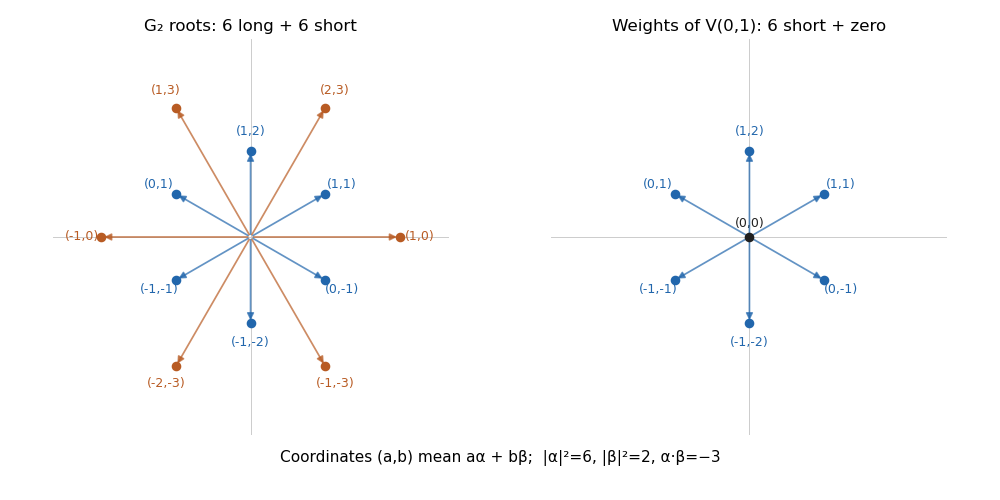

# Paper 302

↑ **Parent:** [Iii](../iii.md)

[https://www.maths.cam.ac.uk/postgrad/part-iii/files/pastpapers/2017/paper_302.pdf](https://www.maths.cam.ac.uk/postgrad/part-iii/files/pastpapers/2017/paper_302.pdf)

**Table of contents**

- [1](#1)
  - [Solution](#1/solution)
- [2](#2)
  - [Solution](#2/solution)
- [3](#3)
  - [Solution](#3/solution)
- [4](#4)
  - [Solution](#4/solution)

## 1

↑ **Parent:** [Paper 302](paper-302.md)

<h3 id="1/solution">Solution</h3>

↑ **Parent:** [1](#1)

The two [Lie groups](../../../lie-theory.md#lie-group) have the same local infinitesimal structure, but different global topology. This difference determines which [Lie algebra representations](../../../lie-algebra.md#lie-algebra-representation) integrate to representations of each group.

An element of the [SU(2) group](../../../topological-group.md#su-2-group) is a [unitary matrix](../../../linear-operator-theory.md#unitary-matrix) of [determinant](../../../linear-algebra.md#determinant) one. Orthogonality of its columns and its [determinant](../../../linear-algebra.md#determinant) give the unique form

$$
U=\begin{pmatrix}a&b\\-\overline b&\overline a\end{pmatrix},\qquad |a|^2+|b|^2=1.
$$

Thus its [group manifold](../../../lie-theory.md#group-manifold) is the unit [three-sphere](../../../geometry-and-topology.md#three-sphere) in $\mathbb C^2\simeq\mathbb R^4$: this is [SU(2) as the three-sphere](../../../topological-group.md#su-2-as-the-three-sphere). In particular it is [compact](../../../topology.md#compact-space), [connected](../../../geometry-and-topology.md#connected-space) and [simply connected](../../../algebraic-topology.md#simply-connected-space). In terms of the [Pauli matrices](../../../algebra.md#pauli-matrices) one may also write $U=a_0I-i\mathbf a\cdot\boldsymbol\sigma$ with real coefficients satisfying $a_0^2+\mathbf a^2=1$.

Differentiate $U(t)^\dagger U(t)=I$ and $\det U(t)=1$ at $U(0)=I$. The [tangent space](../../../differential-geometry.md#tangent-space) consists of traceless [skew-Hermitian matrices](../../../linear-operator-theory.md#skew-hermitian-matrix):

$$
\mathfrak{su}(2)=\{X\in M_2(\mathbb C):X^\dagger=-X,\ \operatorname{tr}X=0\}.
$$

The [Lie bracket](../../../lie-algebra.md#lie-bracket) of a [Matrix Lie group](../../../lie-theory.md#matrix-lie-group) is the matrix [commutator](../../../lie-algebra.md#commutator). With $T_a=-i\sigma_a/2$, the [Pauli matrix multiplication law](../../../algebra.md#pauli-matrix-multiplication-law) gives

$$
[T_a,T_b]=\epsilon_{abc}T_c.
$$

This derives the [SU(2) Lie algebra](../../../semisimple-lie-algebra.md#su-2-lie-algebra) as a three-dimensional real [Lie algebra](../../../lie-algebra.md). The Hermitian physics generators $J_a=\sigma_a/2$ instead obey $[J_a,J_b]=i\epsilon_{abc}J_c$; they are $i$ times the skew-Hermitian tangent generators, so these are consistent conventions.

The [SO(3) group](../../../linear-algebra.md#so-3-group) consists of real [orthogonal matrices](../../../linear-algebra.md#orthogonal-matrix) with [determinant](../../../linear-algebra.md#determinant) one. Differentiating $R(t)^TR(t)=I$ at the identity gives

$$
\mathfrak{so}(3)=\{A\in M_3(\mathbb R):A^T=-A\}.
$$

The [determinant](../../../linear-algebra.md#determinant) condition gives no additional infinitesimal constraint because a [skew-symmetric matrix](../../../linear-algebra.md#skew-symmetric-matrix) already has [trace](../../../linear-algebra.md#matrix-trace) zero. Define $L_a\mathbf v=\mathbf e_a\times\mathbf v$. The [cross product](../../../vector-space.md#cross-product) identity implies

$$
[L_a,L_b]\mathbf v=\mathbf e_a\times(\mathbf e_b\times\mathbf v)-\mathbf e_b\times(\mathbf e_a\times\mathbf v)=\epsilon_{abc}L_c\mathbf v.
$$

Therefore the [SO(3) Lie algebra](../../../semisimple-lie-algebra.md#so-3-lie-algebra) has the same [structure constants](../../../algebra.md#structure-constant) and $T_a\mapsto L_a$ is a [Lie algebra isomorphism](../../../lie-algebra.md#lie-algebra-isomorphism).

The global relation is the [Adjoint double cover from SU(2) to SO(3)](../../../lie-theory.md#adjoint-double-cover-from-su-2-to-so-3). For $V=\mathbf v\cdot\boldsymbol\sigma$, define $R(U)$ by

$$
UVU^{-1}=(R(U)\mathbf v)\cdot\boldsymbol\sigma.
$$

Conjugation preserves the real space of traceless [Hermitian matrices](../../../hilbert-space.md#hermitian-operator) and its [inner product](../../../linear-algebra.md#inner-product) $\tfrac12\operatorname{tr}(VW)=\mathbf v\cdot\mathbf w$. Hence $R(U)$ is orthogonal. Continuity and connectedness, together with $R(I)=I$, put it in $SO(3)$. Composition of conjugations makes $R$ a [group homomorphism](../../../group-theory.md#group-homomorphism). If $R(U)=I$, then $U$ commutes with every [Pauli matrix](../../../algebra.md#pauli-matrices), hence is scalar; unitarity and [determinant](../../../linear-algebra.md#determinant) one leave precisely $U=\pm I$. The differential sends $T_a$ to $L_a$, so it is an isomorphism. More concretely,

$$
U(\theta,\mathbf n)=\exp\left(-\frac{i\theta}{2}\mathbf n\cdot\boldsymbol\sigma\right)=\cos\frac\theta2\,I-i\sin\frac\theta2\,\mathbf n\cdot\boldsymbol\sigma
$$

induces rotation through angle $\theta$ about $\mathbf n$, by the [Rodrigues rotation formula](../../../mathematics.md#rodrigues-rotation-formula). Every three-dimensional rotation has such an axis and angle, proving surjectivity. Consequently

$$
\boxed{SO(3)\simeq SU(2)/\{\pm I\},\qquad \mathfrak{so}(3)\simeq\mathfrak{su}(2).}
$$

The matrices $U$ and $-U$ are antipodal points on the three-sphere, so the [SO(3) group manifold](../../../linear-algebra.md#so-3-as-real-projective-three-space) is [Real projective space](../../../algebraic-topology.md#real-projective-space) $\mathbb{RP}^3$. Equivalently, the closed axis-angle ball $\|\theta\mathbf n\|\le\pi$ has opposite boundary points identified. The [fundamental group](../../../algebraic-topology.md#fundamental-group) is $\pi_1(SO(3))\simeq\mathbb Z_2$, whereas $\pi_1(SU(2))=0$. A $2\pi$ rotation lifts from $I$ to $-I$; a $4\pi$ rotation returns to $I$. Thus the covering is the [universal cover](../../../algebraic-topology.md#universal-cover) and the groups are not globally isomorphic.

For [representation theory](../../../representation-theory.md), specify finite-dimensional complex continuous representations. Compactness permits an invariant [Hermitian inner product](../../../linear-algebra.md#hermitian-form), obtained by averaging against [Haar measure](../../../measure-theory.md#haar-measure), and therefore complete reducibility. Complexifying either real [Lie algebra](../../../lie-algebra.md) gives the [sl2 Lie algebra](../../../semisimple-lie-algebra.md#sl2-lie-algebra). Its finite-dimensional irreducibles are indexed by $n\in\mathbb Z_{\ge0}$, have [highest weight](../../../semisimple-lie-algebra.md#highest-weight-of-a-representation) $n$, and have dimension $n+1$. By [integration of a Lie-algebra representation](../../../lie-algebra.md#integration-of-a-lie-algebra-representation), since $SU(2)$ is [simply connected](../../../algebraic-topology.md#simply-connected-space), every such [Lie algebra representation](../../../lie-algebra.md#lie-algebra-representation) integrates uniquely. The resulting [homogeneous polynomial representation of SU2](../../../representation-theory.md#homogeneous-polynomial-representation-of-su2) is

$$
V_n=\operatorname{Sym}^n(\mathbb C^2),\qquad \dim V_n=n+1.
$$

In the [spin angular momentum](../../../quantum-mechanics.md#spin) notation $j=n/2$, its Hermitian $J_3$ [eigenvalues](../../../linear-operator-theory.md#eigenvalue) are $j,j-1,\ldots,-j$. The central matrix $-I$ acts on the [symmetric power](../../../linear-algebra.md#symmetric-power) by $(-1)^n$, so [descent of an SU(2) representation to SO(3)](../../../lie-theory.md#descent-of-an-su-2-representation-to-so-3) occurs exactly when $n$ is even. Hence

$$
\boxed{SU(2):j=0,\tfrac12,1,\tfrac32,\ldots;\qquad SO(3):j=0,1,2,\ldots;\qquad \dim V_j=2j+1.}
$$

For a reducible representation, every summand must satisfy the descent condition. The spin-one-half doublet is a genuine representation of the covering group but does not define a single-valued representation of $SO(3)$; the spin-one triplet does and is its vector representation. The distinction is topological, rather than a difference in their isomorphic [Lie algebras](../../../lie-algebra.md).

## 2

↑ **Parent:** [Paper 302](paper-302.md)

<h3 id="2/solution">Solution</h3>

↑ **Parent:** [2](#2)

For a complex finite-dimensional [simple Lie algebra](../../../semisimple-lie-algebra.md#simple-lie-algebra), a [Cartan subalgebra](../../../semisimple-lie-algebra.md#cartan-subalgebra) $\mathfrak h$ is a maximal commuting subalgebra of elements whose adjoint maps are semisimple. Equivalently in this setting it is a nilpotent self-normalizing subalgebra. Its dimension is the [rank of a semisimple Lie algebra](../../../semisimple-lie-algebra.md#rank-of-a-semisimple-lie-algebra). Simultaneous diagonalization of its [Adjoint representation](../../../lie-algebra.md#adjoint-representation-of-a-lie-algebra) gives the [root-space decomposition](../../../semisimple-lie-algebra.md#root-space-decomposition)

$$
\mathfrak g=\mathfrak h\oplus\bigoplus_{\alpha\in\Phi}\mathfrak g_\alpha,\qquad \mathfrak g_\alpha=\{E:[H,E]=\alpha(H)E\text{ for all }H\in\mathfrak h\}.
$$

A [root of a root system](../../../semisimple-lie-algebra.md#root-of-a-root-system) is a nonzero linear functional $\alpha$ for which this [root space](../../../semisimple-lie-algebra.md#root-space) is nonzero. For a complex semisimple algebra each [root space](../../../semisimple-lie-algebra.md#root-space) is one-dimensional. A [Cartan-Weyl basis](../../../semisimple-lie-algebra.md#cartan-weyl-basis) consists of a basis $H_i$ of $\mathfrak h$ and one nonzero [root vector](../../../semisimple-lie-algebra.md#root-vector) $E_\alpha$ for every root.

The general [Lie brackets](../../../lie-algebra.md#lie-bracket) have the form

$$
[H_i,H_j]=0,\qquad[H_i,E_\alpha]=\alpha(H_i)E_\alpha,
$$

$$
[E_\alpha,E_\beta]=\begin{cases}N_{\alpha\beta}E_{\alpha+\beta},&\alpha+\beta\in\Phi,\\\text{an element of }\mathfrak h,&\beta=-\alpha,\\0,&\alpha+\beta\notin\Phi\cup\{0\}.\end{cases}
$$

For the opposite-root bracket, use the [Killing form](../../../lie-algebra.md#killing-form) to define $h_\alpha$ by $\kappa(h_\alpha,H)=\alpha(H)$. Its [invariant bilinear form on a Lie algebra](../../../lie-algebra.md#invariant-bilinear-form-on-a-lie-algebra) property gives

$$
[E_\alpha,E_{-\alpha}]=\kappa(E_\alpha,E_{-\alpha})h_\alpha.
$$

One may normalize the [root vectors](../../../semisimple-lie-algebra.md#root-vector) so that the pairing is one. If instead one uses a [coroot](../../../semisimple-lie-algebra.md#coroot) as the opposite-root bracket, the root-vector normalization changes accordingly. In particular, root evaluation coordinates cannot simply be used as coefficients in a nonorthonormal Cartan basis.

For the matrix calculation take $N\ge2$. The [complexification of a Lie algebra](../../../lie-algebra.md#complexification-of-a-lie-algebra) of the [special unitary group](../../../topological-group.md#special-unitary-group) [Lie algebra](../../../lie-algebra.md) is the [special linear Lie algebra](../../../semisimple-lie-algebra.md#special-linear-lie-algebra) $\mathfrak{sl}_N(\mathbb C)$: traceless complex matrices. Its [Cartan subalgebra](../../../semisimple-lie-algebra.md#cartan-subalgebra) consists of traceless diagonal matrices. Write $E_{jk}=\mathcal T^{(j,k)}$ for the [matrix units](../../../vector-space.md#matrix-unit). The given Cartan basis is $H_i=E_{ii}-E_{i+1,i+1}$, $1\le i<N$, and the other basis elements are $E_{jk}$ with $j\ne k$.

The matrix-unit identity $E_{jk}E_{lm}=\delta_{kl}E_{jm}$ gives

$$
[H_i,E_{jk}]=\left(\delta_{ij}-\delta_{i+1,j}-\delta_{ik}+\delta_{i+1,k}\right)E_{jk}.
$$

Thus all the roots, expressed as evaluation vectors in this precise Cartan basis, are

$$
\boxed{(\alpha_{jk})_i=\alpha_{jk}(H_i)=\delta_{ij}-\delta_{i+1,j}-\delta_{ik}+\delta_{i+1,k},\quad j\ne k,\quad 1\le i<N.}
$$

They are the functionals $e_j-e_k$ on traceless diagonal matrices; there are $N(N-1)$ of them. The corresponding [root vector](../../../semisimple-lie-algebra.md#root-vector) is $E_{jk}$. Together with $N-1$ Cartan generators, they give $N^2-1$ basis elements. The [simple roots](../../../semisimple-lie-algebra.md#simple-root) can be chosen as $\alpha_{i,i+1}$, whose evaluation vectors are the rows of the type-$A_{N-1}$ [Cartan matrix](../../../semisimple-lie-algebra.md#cartan-matrix), with $2$ on the diagonal and $-1$ on adjacent entries. These vectors are evaluations on $H_i$, not coordinates in an orthonormal realization of the [root system](../../../semisimple-lie-algebra.md#root-system).

To express every bracket strictly in the chosen basis, introduce the abbreviation

$$
D_{jk}=E_{jj}-E_{kk}=\begin{cases}\displaystyle\sum_{p=j}^{k-1}H_p,&j<k,\\\displaystyle-\sum_{p=k}^{j-1}H_p,&j>k.\end{cases}
$$

Then all pairs are covered by

$$
\boxed{[H_i,H_l]=0,\qquad[H_i,E_{jk}]=(\alpha_{jk})_iE_{jk},}
$$

$$
\boxed{[E_{jk},E_{lm}]=\begin{cases}D_{jk},&k=l,\ j=m,\\E_{jm},&k=l,\ j\ne m,\\-E_{lk},&j=m,\ k\ne l,\\0,&k\ne l,\ j\ne m.\end{cases}}
$$

Here both input [root vectors](../../../semisimple-lie-algebra.md#root-vector) have distinct row and column indices. The first case is the only one producing diagonal [matrix units](../../../vector-space.md#matrix-unit), and the displayed sum of $H_p$ resolves them completely into the chosen Cartan basis. Reversing the order gives the negative bracket. This also shows explicitly that the two nonzero non-Cartan cases have [structure constants](../../../algebra.md#structure-constant) $+1$ and $-1$, and verifies the required root-addition rule.

## 3

↑ **Parent:** [Paper 302](paper-302.md)

<h3 id="3/solution">Solution</h3>

↑ **Parent:** [3](#3)

The triple bond in the original [Dynkin diagram](../../../semisimple-lie-algebra.md#dynkin-diagram) gives the [Cartan integers](../../../semisimple-lie-algebra.md#cartan-integer)

$$
\langle\beta,\alpha^\vee\rangle=-1,\qquad\langle\alpha,\beta^\vee\rangle=-3,
$$

where $\alpha$ is the [long root](../../../semisimple-lie-algebra.md#long-root) and $\beta$ the [short root](../../../semisimple-lie-algebra.md#short-root). Their product is $4\cos^2\theta=3$, and the [inner product](../../../linear-algebra.md#inner-product) of distinct [simple roots](../../../semisimple-lie-algebra.md#simple-root) is nonpositive. The ratio of the two integers gives the squared-length ratio. Therefore

$$
\boxed{\theta=\frac{5\pi}{6}=150^\circ,\qquad\frac{\|\alpha\|}{\|\beta\|}=\sqrt3.}
$$

It is convenient to normalize $(\alpha,\alpha)=6$, $(\beta,\beta)=2$ and $(\alpha,\beta)=-3$. Scaling the [inner product](../../../linear-algebra.md#inner-product) does not affect the [root system](../../../semisimple-lie-algebra.md#root-system) or the fundamental-weight relations.

For nonproportional roots $\gamma,\delta$, the [root-string theorem](../../../semisimple-lie-algebra.md#root-string-theorem) states that the [root string](../../../semisimple-lie-algebra.md#root-string) is consecutive:

$$
S_{\gamma,\delta}=\{\delta-p\gamma,\ldots,\delta+q\gamma\},\qquad p,q\in\mathbb Z_{\ge0},\qquad p-q=\frac{2(\delta,\gamma)}{(\gamma,\gamma)}.
$$

The endpoints are maximal, and reflection in $\gamma$ reverses the string. The [Cartan integer](../../../semisimple-lie-algebra.md#cartan-integer) determines $p-q$, not in general the total $p+q+1$ by itself. This result follows by restricting the [Adjoint representation](../../../lie-algebra.md#adjoint-representation-of-a-lie-algebra) to the [sl2 subalgebra associated with a root](../../../semisimple-lie-algebra.md#sl2-subalgebra-associated-with-a-root). If the roots are distinct [simple roots](../../../semisimple-lie-algebra.md#simple-root), $\delta-\gamma$ cannot be a root: its simple-root coefficients have opposite signs. Thus $p=0$ and

$$
\boxed{|S_{\gamma,\delta}|=1-\langle\delta,\gamma^\vee\rangle.}
$$

Here length means number of roots; the number of intervals between them is one less. Distinctness matters. If $\gamma=\delta$, a reduced [root system](../../../semisimple-lie-algebra.md#root-system) gives the set $\{\gamma,-\gamma\}$, with a missing zero between them, so the consecutive-string theorem and the displayed simple-root formula do not apply.

In the [G2 root system](../../../semisimple-lie-algebra.md#g2-root-system), the initial strings are

$$
\boxed{S_{\alpha,\beta}=\{\beta,\alpha+\beta\},\qquad S_{\beta,\alpha}=\{\alpha,\alpha+\beta,\alpha+2\beta,\alpha+3\beta\}.}
$$

For $\delta=\alpha+3\beta$, $\langle\delta,\alpha^\vee\rangle=-1$. Since $\delta-\alpha=3\beta$ is not a root in a [reduced root system](../../../semisimple-lie-algebra.md#reduced-root-system), $p=0$ and $q=1$: this generates $2\alpha+3\beta$. The remaining strings explain why the construction stops. The $\alpha$-strings through $\beta$ and $\alpha+\beta$ are the same two-element string; the one through $\alpha+2\beta$ is a singleton since subtracting $\alpha$ gives $2\beta$, and its [Cartan integer](../../../semisimple-lie-algebra.md#cartan-integer) is zero; the one through $2\alpha+3\beta$ is the string $\{\alpha+3\beta,2\alpha+3\beta\}$. The $\beta$-strings through $\alpha$, $\alpha+\beta$, $\alpha+2\beta$ and $\alpha+3\beta$ are the initial four-element string. Finally, $2\alpha+3\beta$ is orthogonal to $\beta$; its $\beta$-string is a singleton because $2\alpha+2\beta=2(\alpha+\beta)$ is not a root. Apply the same reasoning to negatives. Using the permitted completeness of this procedure gives

$$
\boxed{\Phi=\pm\{\beta,\alpha,\alpha+\beta,\alpha+2\beta,\alpha+3\beta,2\alpha+3\beta\}.}
$$

The short positive roots are $\beta,\alpha+\beta,\alpha+2\beta$, of squared length two; the other three are long, of squared length six. Each [root space](../../../semisimple-lie-algebra.md#root-space) is one-dimensional and the [Cartan subalgebra](../../../semisimple-lie-algebra.md#cartan-subalgebra) has dimension two, so

$$
\boxed{\dim G_2=2+12=14.}
$$

Here the dimension refers to the [Lie algebra](../../../lie-algebra.md), with one Cartan generator per rank, not just the number of roots.

Write a prospective weight as $w=a\alpha+b\beta$. The pairings with simple [coroots](../../../semisimple-lie-algebra.md#coroot) are

$$
\langle w,\alpha^\vee\rangle=2a-b,\qquad\langle w,\beta^\vee\rangle=-3a+2b.
$$

The [fundamental weights](../../../semisimple-lie-algebra.md#fundamental-weight) are dual to those [coroots](../../../semisimple-lie-algebra.md#coroot). Solving the two linear systems gives, in the long-root-first numbering of this paper,

$$
\boxed{\omega_1=2\alpha+3\beta,\qquad\omega_2=\alpha+2\beta.}
$$

The representation with [Dynkin labels](../../../semisimple-lie-algebra.md#dynkin-label) $(0,1)$ has [highest weight](../../../semisimple-lie-algebra.md#highest-weight-of-a-representation) $\lambda=\omega_2$, a short root. Numbering the short root first, as some references do, would call this the $(1,0)$ representation instead; the representation itself is unchanged.

The weight set of a finite-dimensional irreducible [highest-weight representation](../../../semisimple-lie-algebra.md#highest-weight-representation) is invariant under the [Weyl group](../../../semisimple-lie-algebra.md#weyl-group) and lies in the [convex hull](../../../mathematical-optimization.md#convex-hull) of the orbit of its [highest weight](../../../semisimple-lie-algebra.md#highest-weight-of-a-representation). All weights also differ from the [highest weight](../../../semisimple-lie-algebra.md#highest-weight-of-a-representation) by an element of the [root lattice](../../../semisimple-lie-algebra.md#root-lattice). The orbit of $\lambda$ comprises the six short roots, so all six are weights. The [lowering operators](../../../semisimple-lie-algebra.md#lowering-operator) give the chain

$$
\alpha+2\beta\ \xrightarrow{-\beta}\ \alpha+\beta\ \xrightarrow{-\alpha}\ \beta\ \xrightarrow{-\beta}\ 0\ \xrightarrow{-\beta}\ -\beta\ \xrightarrow{-\alpha}\ -\alpha-\beta\ \xrightarrow{-\beta}\ -\alpha-2\beta.
$$

In particular zero occurs: at weight $\beta$, its pairing with $\beta^\vee$ is two, so the lowering operator is nonzero by the finite-dimensional [sl2 Lie algebra](../../../semisimple-lie-algebra.md#sl2-lie-algebra) representation theory. The $\beta$-string through it is the usual three-weight string $\beta,0,-\beta$; higher weight $2\beta$ would lie outside the highest-weight convex hull.

There can be no further weights. Every point of that convex hull has squared norm at most $\|\lambda\|^2=2$, while a root-lattice point has

$$
\|a\alpha+b\beta\|^2=6a^2-6ab+2b^2=\frac32a^2+2\left(b-\frac32a\right)^2.
$$

The integer solutions of the bound $\|w\|^2\le2$ are precisely zero and the six short roots: $a=0$ gives $b=-1,0,1$; $a=1$ gives $b=1,2$; and $a=-1$ gives $b=-1,-2$. Thus

$$
\boxed{\operatorname{Wt}V(0,1)=\{0,\pm\beta,\pm(\alpha+\beta),\pm(\alpha+2\beta)\},\qquad\dim V(0,1)=7.}
$$

The final dimension uses the stipulated nondegeneracy of the weights. It also agrees with the [Weyl dimension formula](../../../semisimple-lie-algebra.md#weyl-dimension-formula) without that stipulation. The zero weight is not in the Weyl orbit of the nonzero weights, so this is not a [minuscule representation](../../../semisimple-lie-algebra.md#minuscule-representation).

**[Figure 1](#3/image-g2-roots-and-weights-of-its-seven-dimensional-representation). G2 roots and weights of its seven-dimensional representation**. The twelve [roots of a root system](../../../semisimple-lie-algebra.md#root-of-a-root-system) and seven [weights](../../../semisimple-lie-algebra.md#weight-representation-theory) in the long-root-first convention.

In the diagram above, a coordinate label $(a,b)$ means $a\alpha+b\beta$. The left panel contains all twelve [roots of a root system](../../../semisimple-lie-algebra.md#root-of-a-root-system); the right panel contains the six short-root weights and the zero weight. The long-root-first convention is the same as in the calculations.

## 4

↑ **Parent:** [Paper 302](paper-302.md)

<h3 id="4/solution">Solution</h3>

↑ **Parent:** [4](#4)

Use the real Lie-algebra convention of the question, with a [gauge covariant derivative](../../../relativistic-quantum-field.md#gauge-covariant-derivative) $D_\mu=\partial_\mu+A_\mu$. The [gauge field strength](../../../relativistic-quantum-field.md#gauge-field-strength) is its curvature:

$$
\boxed{F_{\mu\nu}=\partial_\mu A_\nu-\partial_\nu A_\mu+[A_\mu,A_\nu],\qquad[D_\mu,D_\nu]=F_{\mu\nu}.}
$$

Write $a_\mu=\delta_XA_\mu/\epsilon=-\partial_\mu X+[X,A_\mu]$. To first order in $\epsilon$,

$$
\epsilon^{-1}\delta_XF_{\mu\nu}=\partial_\mu a_\nu-\partial_\nu a_\mu+[a_\mu,A_\nu]+[A_\mu,a_\nu].
$$

Substitute $a_\mu$. The mixed second derivatives of $X$ cancel. The terms containing first derivatives of $X$ cancel in pairs. The remaining terms are

$$
[X,\partial_\mu A_\nu-\partial_\nu A_\mu]+[[X,A_\mu],A_\nu]+[A_\mu,[X,A_\nu]].
$$

The [Jacobi identity](../../../lie-algebra.md#jacobi-identity) combines the last two into $[X,[A_\mu,A_\nu]]$. Consequently

$$
\boxed{\delta_XF_{\mu\nu}=\epsilon[X,F_{\mu\nu}].}
$$

The transformation is homogeneous even though the connection transformation contains an inhomogeneous derivative term.

For a finite-dimensional [Lie algebra](../../../lie-algebra.md), define its [Adjoint representation](../../../lie-algebra.md#adjoint-representation-of-a-lie-algebra) by $\operatorname{ad}_X(Y)=[X,Y]$ and its [Killing form](../../../lie-algebra.md#killing-form) by

$$
\kappa(X,Y)=\operatorname{Tr}_{\mathfrak g}(\operatorname{ad}_X\operatorname{ad}_Y).
$$

It is a symmetric [bilinear form](../../../linear-algebra.md#bilinear-form) by cyclicity of the [trace](../../../linear-algebra.md#matrix-trace). The [Jacobi identity](../../../lie-algebra.md#jacobi-identity) gives $\operatorname{ad}_{[Z,X]}=[\operatorname{ad}_Z,\operatorname{ad}_X]$. Set $A=\operatorname{ad}_Z$, $B=\operatorname{ad}_X$, $C=\operatorname{ad}_Y$. Then

$$
\kappa([Z,X],Y)+\kappa(X,[Z,Y])=\operatorname{Tr}([A,B]C+B[A,C])=\operatorname{Tr}(ABC-BCA)=0.
$$

This proves the [invariant bilinear form on a Lie algebra](../../../lie-algebra.md#invariant-bilinear-form-on-a-lie-algebra) property, without assuming simplicity or nondegeneracy.

For definiteness use the [Minkowski metric](../../../special-relativity.md#minkowski-metric) $\eta=\operatorname{diag}(1,-1,-1,-1)$ and take a real compact [semisimple Lie algebra](../../../semisimple-lie-algebra.md) as the gauge algebra. Its positive internal metric is $B=-\kappa$. A [Killing-form Yang-Mills Lagrangian](../../../relativistic-quantum-field.md#killing-form-yang-mills-lagrangian) with the coupling absorbed into the connection is

$$
\boxed{\mathcal L=-\frac1{4g_{\rm YM}^2}B(F_{\mu\nu},F^{\mu\nu})=\frac1{4g_{\rm YM}^2}\kappa(F_{\mu\nu},F^{\mu\nu}),\qquad g_{\rm YM}^2>0.}
$$

The spacetime metric is unchanged by internal [gauge transformations](../../../electromagnetism.md#gauge-transformation). Hence

$$
\delta_X\mathcal L=\frac{\epsilon}{4g_{\rm YM}^2}\{\kappa([X,F_{\mu\nu}],F^{\mu\nu})+\kappa(F_{\mu\nu},[X,F^{\mu\nu}])\}=0.
$$

Thus [gauge invariance](../../../relativistic-quantum-field.md#gauge-invariance) follows directly from invariance of the [Killing form](../../../lie-algebra.md#killing-form). Other overall conventions are possible, but the energy sign must be checked rather than inferred from a prefactor in isolation.

For physical kinetic terms the internal form must be real, nondegenerate and positive definite after choosing the overall sign. If $\mathcal E_i=F_{0i}$ and $\mathcal B_i=\tfrac12\epsilon_{ijk}F_{jk}$, the above convention has Lagrangian $[B(\mathcal E_i,\mathcal E_i)-B(\mathcal B_i,\mathcal B_i)]/(2g_{\rm YM}^2)$ and physical [energy](../../../classical-mechanics.md#energy) density

$$
\mathcal H=\frac1{2g_{\rm YM}^2}\sum_i[B(\mathcal E_i,\mathcal E_i)+B(\mathcal B_i,\mathcal B_i)]\ge0.
$$

The canonical [Hamiltonian](../../../classical-mechanics.md#hamiltonian) density also contains the nondynamical multiplier and a spatial divergence. With $\Pi_i=\mathcal E_i/g_{\rm YM}^2$ and $D_i\Pi_i=\partial_i\Pi_i+[A_i,\Pi_i]$, [integration by parts](../../../calculus.md#integration-by-parts) using the [invariant bilinear form on a Lie algebra](../../../lie-algebra.md#invariant-bilinear-form-on-a-lie-algebra) gives

$$
\mathcal H_{\rm can}=\mathcal H-B(A_0,D_i\Pi_i)+\partial_i B(A_0,\Pi_i).
$$

The [Gauss law constraint in gauge theory](../../../relativistic-quantum-field.md#gauss-law-constraint-in-gauge-theory) sets $D_i\Pi_i=0$. If the boundary flux vanishes, or the appropriate boundary contribution is included, the integrated physical [Hamiltonian](../../../classical-mechanics.md#hamiltonian) is the positive [energy](../../../classical-mechanics.md#energy) displayed above.

An indefinite internal form would give gauge-field polarizations with opposite kinetic signs. A degenerate form would fail to supply a kinetic term for some directions. The [compactness criterion from the Killing form](../../../lie-algebra.md#compactness-criterion-from-the-killing-form) says that negative-definiteness of the [Killing form](../../../lie-algebra.md#killing-form) of a real finite-dimensional algebra is equivalent to compact semisimplicity; thus the pure Killing-form construction selects compact semisimple real forms. One cannot use a complex-bilinear [Killing form](../../../lie-algebra.md#killing-form) on arbitrary complex field components as if it were a positive Hermitian metric.

This does not prohibit Abelian gauge theories. A compact Abelian factor has zero [Killing form](../../../lie-algebra.md#killing-form), so it needs a separately chosen positive [invariant bilinear form on a Lie algebra](../../../lie-algebra.md#invariant-bilinear-form-on-a-lie-algebra), rather than the [Killing form](../../../lie-algebra.md#killing-form). More generally an algebra with a [positive invariant metric on a Lie algebra](../../../lie-algebra.md#positive-invariant-metric-on-a-lie-algebra) is compact reductive, namely a direct sum of a compact semisimple algebra and an Abelian center. A noncompact group can also share the same compact [Lie algebra](../../../lie-algebra.md) through global covering choices in an Abelian factor; positivity is a statement about the algebra and internal metric, not by itself a classification of global gauge-group topology. Quantum matter anomalies and global restrictions would require additional input; no matter content is specified here.

For the finite matrix transformation, let $g(x)\in SU(N)$ and regard $g$ as a multiplication operator. The identity $\partial_\mu g^{-1}=-g^{-1}(\partial_\mu g)g^{-1}$ gives

$$
D'_\mu=gD_\mu g^{-1}=\partial_\mu+gA_\mu g^{-1}-(\partial_\mu g)g^{-1}.
$$

Taking commutators of these differential operators cancels the adjacent multiplication operators $g^{-1}g$, yielding

$$
\boxed{F'_{\mu\nu}=gF_{\mu\nu}g^{-1}.}
$$

This argument keeps the derivatives acting on test fields and avoids treating $D_\mu$ as just a matrix.

There is a normalization issue in the printed last paragraph. The standard [Killing form](../../../lie-algebra.md#killing-form) defined through the adjoint [trace](../../../linear-algebra.md#matrix-trace) on $\mathfrak{su}(N)$ is

$$
\kappa_{\rm Kill}(X,Y)=2N\operatorname{tr}_{\mathbb C^N}(XY),
$$

not simply $\operatorname{tr}(XY)$. For example, with $N=2$ and $X=Y=-i\sigma_3/2$, the defining trace is $-1/2$, whereas the adjoint trace is $-2$. The printed [trace](../../../linear-algebra.md#matrix-trace) formula can be used as a rescaled invariant form, with the constant absorbed into the gauge coupling; it has exactly the invariance needed here. For either normalization,

$$
\operatorname{tr}(F'_{\mu\nu}F'^{\mu\nu})=\operatorname{tr}(gF_{\mu\nu}F^{\mu\nu}g^{-1})=\operatorname{tr}(F_{\mu\nu}F^{\mu\nu}),
$$

by cyclicity. This proves finite [Yang-Mills gauge transformation](../../../relativistic-quantum-field.md#yang-mills-gauge-transformation) invariance, with the healthy sign chosen for anti-Hermitian gauge fields. The normalization discrepancy is not a failure of [gauge invariance](../../../relativistic-quantum-field.md#gauge-invariance).

Finally let $g(x)=e^{\epsilon X(x)}=I+\epsilon X(x)+O(\epsilon^2)$. Since $X\in\mathfrak{su}(N)$ is traceless and skew-Hermitian, this exponential lies in $SU(N)$. Expanding the finite formula gives

$$
A'_\mu=A_\mu+\epsilon[X,A_\mu]-\epsilon\partial_\mu X+O(\epsilon^2),\qquad F'_{\mu\nu}=F_{\mu\nu}+\epsilon[X,F_{\mu\nu}]+O(\epsilon^2).
$$

Thus **the stated infinitesimal transformation is the derivative of the finite transformation at the identity**. It describes transformations in the identity component; arbitrary global or large [gauge transformations](../../../electromagnetism.md#gauge-transformation) need not be generated by one globally defined infinitesimal parameter.

## ↑ Ancestors (8)

1. [Iii](../iii.md)
2. [2017](../../2017.md)
3. [Past exam of the mathematics course of the University of Cambridge](../../../past-exam-of-the-mathematics-course-of-the-university-of-cambridge.md)
4. [Mathematics course of the University of Cambridge](../../../university-of-cambridge.md#mathematics-course-of-the-university-of-cambridge)
5. [Course of the University of Cambridge](../../../university-of-cambridge.md#course-of-the-university-of-cambridge)
6. [University of Cambridge](../../../university-of-cambridge.md)
7. [List of universities](../../../README.md#list-of-universities)
8. [Codex Wiki](../../../README.md)
