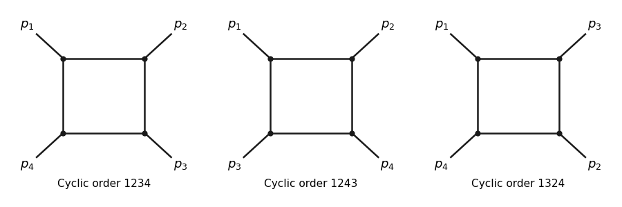

<h1 id="3/i/solution">Solution</h1>

↑ **Parent:** [I](../i.md)

For a [connected Feynman diagram](../../../../../../connected-feynman-diagram.md) with cubic vertices with four external legs and one loop, $3V=2I+4$ and $1=I-V+1$ give $V=I=4$. In a [one-particle-irreducible Feynman diagram](../../../../../../one-particle-irreducible-feynman-diagram.md), every internal edge lies on the single cycle. Each of the four cubic vertices therefore has two internal and one external leg, giving a [box Feynman diagram](../../../../../../box-feynman-diagram.md). With labelled external momenta there are three inequivalent cyclic orderings, modulo rotation and reversal, represented by $1234$, $1243$ and $1324$:

**[Figure 1](#3/i/image-the-three-labelled-cubic-scalar-box-diagrams). The three labelled cubic-scalar box diagrams**. The three inequivalent external-leg orderings of a [box Feynman diagram](../../../../../../box-feynman-diagram.md) in a [six-dimensional cubic scalar field theory](../../../../../../six-dimensional-cubic-scalar-field-theory.md). Each square contains four internal propagators and four cubic vertices.

Take all momenta incoming with $\sum_i p_i=0$. The [Feynman rules](../../../../../../feynman-rule.md) for the [Euclidean action](../../../../../../euclidean-action.md) give a propagator $(q^2+m^2)^{-1}$ and a cubic insertion $-g$. For order $1234$, the amputated connected insertion is

$$
\mathcal B_{1234}=g^4\int\frac{d^6q}{(2\pi)^6}\frac{\chi(q)\chi(q+p_1)\chi(q+p_1+p_2)\chi(q-p_4)}{(q^2+m^2)((q+p_1)^2+m^2)((q+p_1+p_2)^2+m^2)((q-p_4)^2+m^2)},
$$

where $\chi(q)=\mathbf1_{\{\Lambda<|q|<\Lambda_0\}}$ is the high-mode projector for a strict [Wilsonian effective action](../../../../../../wilsonian-effective-action.md). Each labelled box has [Feynman-diagram symmetry factor](../../../../../../feynman-diagram-symmetry-factor.md) one. A common fixed-loop-cutoff convention instead restricts only the chosen $q$ integration to the shell; both prescriptions give the same zero-external-momentum value. The effective-action vertex has the opposite sign to this connected insertion. Thus $\boxed{\text{three labelled boxes, with one cyclic topology}.}$

## ↑ Ancestors (11)

1. [I](../i.md)
2. [3](../../3.md)
3. [Paper 304](../../../paper-304-split.md)
4. [Iii](../../../split.md)
5. [2017](../../../../split.md)
6. [Past exam of the mathematics course of the University of Cambridge](../../../../../split.md)
7. [Mathematics course of the University of Cambridge](../../../../../../mathematics-course-of-the-university-of-cambridge.md)
8. [Course of the University of Cambridge](../../../../../../course-of-the-university-of-cambridge.md)
9. [University of Cambridge](../../../../../../university-of-cambridge-split.md)
10. [List of universities](../../../../../../list-of-universities.md)
11. [Codex Wiki](../../../../../../split.md)
