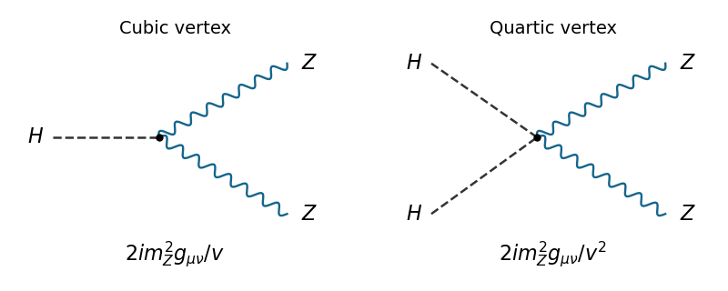

<h1 id="2/a/solution">Solution</h1>

↑ **Parent:** [A](../a.md)

Take $\tau^a=\sigma^a/2$, $Y_\phi=1/2$, metric $g_{\mu\nu}=\operatorname{diag}(1,-1,-1,-1)$, and a [Higgs potential](../../../../../../higgs-field-potential.md) with $\mu_h^2>0$, $\lambda>0$. The gauge-scalar [electroweak interaction](../../../../../../electroweak-interaction.md) is

$$
\mathcal L_{\mathrm{bos}}=-\frac14W^a_{\mu\nu}W^{a\mu\nu}-\frac14B_{\mu\nu}B^{\mu\nu}+(D_\mu\phi)^\dagger D^\mu\phi-V(\phi),\qquad V(\phi)=-\mu_h^2\phi^\dagger\phi+\lambda(\phi^\dagger\phi)^2.
$$

Here $B_{\mu\nu}=\partial_\mu B_\nu-\partial_\nu B_\mu$. With the printed plus-sign convention for $D_\mu$, define $[D_\mu,D_\nu]=igW^a_{\mu\nu}\tau^a+ig'Y_\phi B_{\mu\nu}$; thus $W^a_{\mu\nu}=\partial_\mu W^a_\nu-\partial_\nu W^a_\mu-g\epsilon^{abc}W^b_\mu W^c_\nu$. The minus sign in the nonlinear [gauge field strength](../../../../../../gauge-field-strength.md) follows from this convention.

The minima have $\phi^\dagger\phi=v^2/2$, with $v^2=\mu_h^2/\lambda$. A [gauge transformation](../../../../../../gauge-transformation.md) rotates the vacuum to $(0,v)^T/\sqrt2$. In [unitary gauge](../../../../../../unitary-gauge.md), the three angular [Goldstone bosons](../../../../../../goldstone-boson.md) are removed, leaving $\phi=(0,v+H)^T/\sqrt2$ and one real [Higgs boson](../../../../../../higgs-boson.md). The generator $Q=T^3+Y$ annihilates the vacuum, because its lower component has $T^3=-1/2$ and [hypercharge](../../../../../../hypercharge.md) $1/2$. This identifies the unbroken electromagnetic [gauge group](../../../../../../gauge-group.md).

The quadratic terms from the [Higgs field](../../../../../../higgs-field.md) [kinetic term](../../../../../../kinetic-term.md) are

$$
\frac12(\partial H)^2+\frac{g^2v^2}{8}\left[(W^1)^2+(W^2)^2\right]+\frac{v^2}{8}(gW^3-g'B)^2.
$$

Define the [Weinberg angle](../../../../../../weinberg-angle.md) and physical fields by

$$
\boxed{\tan\theta_W=\frac{g'}g},\qquad \boxed{W^\pm_\mu=\frac{W^1_\mu\mp iW^2_\mu}{\sqrt2}}.
$$

The neutral combinations are

$$
\boxed{\begin{aligned}Z_\mu&=\cos\theta_W W^3_\mu-\sin\theta_W B_\mu,\\ A_\mu&=\sin\theta_W W^3_\mu+\cos\theta_W B_\mu.\end{aligned}}
$$

The neutral [gauge-boson mass matrix](../../../../../../gauge-boson-mass-matrix.md) is $(v^2/4)\begin{pmatrix}g^2&-gg'\\-gg'&g'^2\end{pmatrix}$. It has [eigenvalues](../../../../../../eigenvalue.md) zero and $(g^2+g'^2)v^2/4$, with the zero [eigenvector](../../../../../../eigenvector.md) giving $A_\mu$. Expanding the [Higgs potential](../../../../../../higgs-field-potential.md) about its minimum gives $V=\text{constant}+\lambda v^2H^2+\lambda vH^3+\lambda H^4/4$. Therefore the [tree-level electroweak gauge-boson masses](../../../../../../tree-level-electroweak-gauge-boson-masses.md) and scalar mass are

$$
\boxed{m_A=0,\qquad m_{W^+}=m_{W^-}=\frac{gv}{2},\qquad m_Z=\frac v2\sqrt{g^2+g'^2},\qquad m_H=\sqrt{2\lambda}\,v.}
$$

Also $m_W=m_Z\cos\theta_W$ and $e=g\sin\theta_W=g'\cos\theta_W$. The three removed [Goldstone bosons](../../../../../../goldstone-boson.md) supply the longitudinal [polarization vector](../../../../../../polarization-vector.md) degrees of freedom of the massive [electroweak gauge bosons](../../../../../../electroweak-gauge-boson.md).

Replacing $v^2$ by $(v+H)^2$ in the neutral mass term gives all the [Higgs boson couplings to Z bosons](../../../../../../higgs-boson-coupling-to-z-bosons.md) in [unitary gauge](../../../../../../unitary-gauge.md):

$$
\mathcal L_{HZ}=\frac{m_Z^2}{v}HZ_\mu Z^\mu+\frac{m_Z^2}{2v^2}H^2Z_\mu Z^\mu.
$$

There are exactly the cubic $HZZ$ and quartic $HHZZ$ elementary [tree-level Feynman diagrams](../../../../../../tree-level-feynman-diagram.md). Differentiating with respect to the identical fields gives [Feynman rules](../../../../../../feynman-rule.md) $2im_Z^2g_{\mu\nu}/v$ and $2im_Z^2g_{\mu\nu}/v^2$, respectively. There is no elementary $ZHH$ vertex for the real neutral radial field.

**[Figure 1](#2/a/image-higgs-interaction-vertices). Higgs interaction vertices**. The two elementary [Higgs boson couplings to Z bosons](../../../../../../higgs-boson-coupling-to-z-bosons.md), with dashed scalar legs and wavy vector legs.

## ↑ Ancestors (11)

1. [A](../a.md)
2. [2](../../2.md)
3. [Paper 305](../../../paper-305-split.md)
4. [Iii](../../../split.md)
5. [2017](../../../../split.md)
6. [Past exam of the mathematics course of the University of Cambridge](../../../../../split.md)
7. [Mathematics course of the University of Cambridge](../../../../../../mathematics-course-of-the-university-of-cambridge.md)
8. [Course of the University of Cambridge](../../../../../../course-of-the-university-of-cambridge.md)
9. [University of Cambridge](../../../../../../university-of-cambridge-split.md)
10. [List of universities](../../../../../../list-of-universities.md)
11. [Codex Wiki](../../../../../../split.md)
