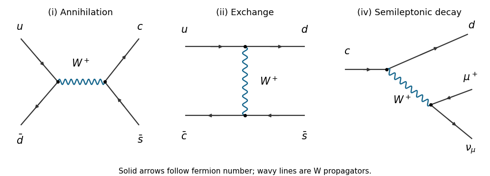

<h1 id="3/a">a</h1>

↑ **Parent:** [3](../3.md)

The three allowed [tree-level Feynman diagrams](../../../../../tree-level-feynman-diagram.md) are shown below, using physical-particle [Feynman propagators](../../../../../feynman-propagator.md) in [unitary gauge](../../../../../unitary-gauge.md). Solid arrows follow fermion number and the wavy lines denote the charged vector [Feynman propagator](../../../../../feynman-propagator.md).

**[Figure 2](#3/a/image-charged-current-interaction-diagrams). Charged-current interaction diagrams**. The allowed s-channel, t-channel and semileptonic [weak charged current](../../../../../charged-current.md) graphs.

**Table of contents**

- [i](a/i.md)
  - [Solution](a/i/solution.md)
- [ii](a/ii.md)
  - [Solution](a/ii/solution.md)
- [iii](a/iii.md)
  - [Solution](a/iii/solution.md)
- [iv](a/iv.md)
  - [Solution](a/iv/solution.md)

## ↑ Ancestors (10)

1. [3](../3.md)
2. [Paper 305](../../paper-305-split.md)
3. [Iii](../../split.md)
4. [2017](../../../split.md)
5. [Past exam of the mathematics course of the University of Cambridge](../../../../split.md)
6. [Mathematics course of the University of Cambridge](../../../../../mathematics-course-of-the-university-of-cambridge.md)
7. [Course of the University of Cambridge](../../../../../course-of-the-university-of-cambridge.md)
8. [University of Cambridge](../../../../../university-of-cambridge-split.md)
9. [List of universities](../../../../../list-of-universities.md)
10. [Codex Wiki](../../../../../split.md)
