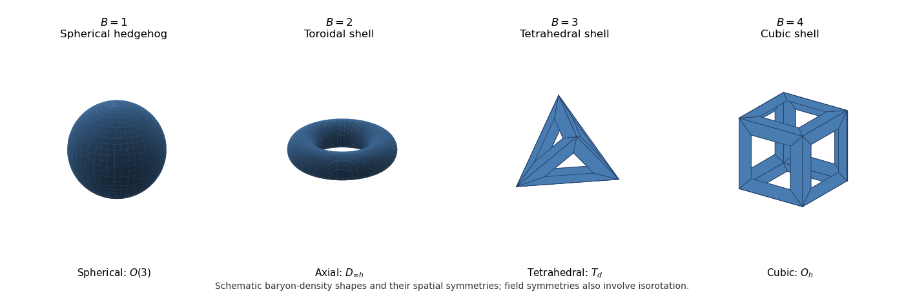

<h1 id="3/solution">Solution</h1>

↑ **Parent:** [3](../3.md)

The [Skyrme model](../../../../../skyrme-model.md) represents the three [pions](../../../../../pion.md) by a field in the [special unitary group](../../../../../special-unitary-group.md) $SU(2)$,

$$
U(x,t)=\sigma(x,t)\mathbf1+i\boldsymbol\pi(x,t)\cdot\boldsymbol\tau,\qquad \sigma^2+|\boldsymbol\pi|^2=1,
$$

with [Pauli matrices](../../../../../pauli-matrices.md) $\tau_a$. Near $U=1$, the three tangent components are the [pion](../../../../../pion.md) fields, with a normalization scale suppressed here. Define $L_\mu=U^\dagger\partial_\mu U$. In one useful sign convention with metric $(+---)$, the action consists of

$$
\mathcal L=-c_2\operatorname{tr}(L_\mu L^\mu)+c_4\operatorname{tr}([L_\mu,L_\nu][L^\mu,L^\nu])-c_0\operatorname{tr}(2\mathbf1-U-U^\dagger),
$$

where $c_2,c_4>0$ and the last term is optional, with $c_0\geq0$ proportional to a common [pion](../../../../../pion.md) mass squared. The first term is a [nonlinear sigma model](../../../../../nonlinear-sigma-model.md) kinetic term, and the second is the four-derivative term of the [Skyrme model](../../../../../skyrme-model.md). For a static configuration of size $s$, the two derivative contributions scale as $E_2\propto s$ and $E_4\propto1/s$, whereas a mass term scales as $s^3$. This [Derrick scaling](../../../../../derrick-scaling.md) explains why the four-derivative term can stabilize a finite size instead of allowing collapse.

A [finite-energy field configuration](../../../../../finite-energy-field-configuration.md) approaches a vacuum, conventionally $U(\infty)=1$. Compactifying space makes $U$ a map $S^3\to SU(2)\simeq S^3$. The [topological baryon number in the Skyrme model](../../../../../topological-baryon-number-in-the-skyrme-model.md) is its [degree of a map between oriented manifolds](../../../../../degree-of-a-map-between-oriented-manifolds.md),

$$
\boxed{B=-\frac1{24\pi^2}\int\epsilon_{ijk}\operatorname{tr}(L_iL_jL_k)\,d^3x\in\mathbb Z.}
$$

The sign convention makes the standard decreasing hedgehog have $B=1$. Smooth evolution with the vacuum boundary condition preserves this integer. A [Skyrmion](../../../../../skyrmion.md) is a localized soliton in such a sector; the unit soliton, after quantization, models a [nucleon](../../../../../nucleon.md), and higher positive charges model multi-baryon systems. The topological conservation law is distinct from an ordinary [Noether charge](../../../../../noether-charge.md) of [isospin](../../../../../isospin.md). Classical [pion](../../../../../pion.md) fields are bosonic, so obtaining fermionic [nucleons](../../../../../nucleon.md) also needs the quantum-statistics choice discussed below.

The derivative theory has global [chiral symmetry](../../../../../chiral-symmetry.md) $SU(2)_L\times SU(2)_R$, acting by $U\mapsto LUR^\dagger$. The simultaneous pair $(-1,-1)$ acts trivially, so the faithful connected action can also be viewed as $SO(4)$ on $(\sigma,\boldsymbol\pi)$. In the massless theory the choice of vacuum breaks this to the vector subgroup. For fixed $U(\infty)=1$, the [vacuum-preserving symmetry of the Skyrme model](../../../../../vacuum-preserving-symmetry-of-the-skyrme-model.md) requires $L=R$ and acts by $U\mapsto AUA^\dagger$. This is [isospin](../../../../../isospin.md), effectively $SO(3)$ because $A$ and $-A$ act the same way. A usual common pion-mass term explicitly preserves only this vector subgroup; full [chiral symmetry](../../../../../chiral-symmetry.md) is then an approximate massless-limit symmetry, not an exact symmetry of that term. Independent axial rotations change the vacuum and are not extra localized rigid-rotor coordinates in a sector with fixed boundary vacuum.

The space-time symmetry is the [Poincaré group](../../../../../poincare-group.md), comprising translations and [Lorentz transformations](../../../../../lorentz-transformation.md), including spatial rotations. [Parity](../../../../../parity.md) acts as $U(t,\mathbf x)\mapsto U^\dagger(t,-\mathbf x)$, since [pions](../../../../../pion.md) are [pseudoscalars](../../../../../pseudoscalar.md). For a static finite-energy solution, translations change its position; spatial rotations and [isorotations](../../../../../isorotation.md) change its orientation. These transformations generate [collective coordinates](../../../../../collective-coordinate-of-a-soliton.md), but a particular field can be unchanged by certain combined transformations.

For the usual low-charge minimum branches of the standard model, the relevant shapes and density symmetries are the following. These are not claims about every field of a given degree, all excited solutions or arbitrary modified [pion](../../../../../pion.md) potentials.

**[Figure 1](#3/image-schematic-skyrmion-configurations). Schematic Skyrmion configurations**. Schematic shapes of the [Skyrme baryon density](../../../../../skyrme-baryon-density.md) at low charge: sphere, torus, tetrahedral shell and cubic shell. They show shape and symmetry, rather than numerically computed density isosurfaces.

For $B=1$, the [Skyrmion hedgehog ansatz](../../../../../skyrmion-hedgehog-ansatz.md) is

$$
U_1(\mathbf x)=\cos f(r)+i\sin f(r)\widehat{\mathbf x}\cdot\boldsymbol\tau,\qquad f(0)=\pi,\quad f(\infty)=0.
$$

Its [Skyrme baryon density](../../../../../skyrme-baryon-density.md) is spherical. Indeed $B=-(2/\pi)\int_0^\infty f'\sin^2 f\,dr=1$. A spatial rotation rotates the [pion](../../../../../pion.md) direction, so the field itself is invariant under a compensating [isorotation](../../../../../isorotation.md), not under every spatial rotation alone. Its proper combined stabilizer is a diagonal $SO(3)$.

For $B=2$, the [toroidal two-Skyrmion](../../../../../toroidal-two-skyrmion.md) has a ring-shaped density with an axial hole and full density symmetry $D_{\infty h}$. The proper combined field stabilizer is an $O(2)$-type group: its continuous subgroup pairs axial spatial rotation by $\theta$ with [isorotation](../../../../../isorotation.md) by $2\theta$, and it also has discrete transverse half-turns. The angular approximation $R(z)=z^2$ makes the axial factor two explicit. A static two-baryon minimum is consequently not simply two separate round unit lumps.

For $B=3$, the [tetrahedral three-Skyrmion](../../../../../tetrahedral-three-skyrmion.md) has a tetrahedral shell with four face-hole directions and full density group $T_d$. Its proper rotational group is $T\cong A_4$, the [tetrahedral symmetry](../../../../../tetrahedral-symmetry.md) group of order 12. The actual field symmetries again pair these rotations with [isorotations](../../../../../isorotation.md).

For $B=4$, the [cubic four-Skyrmion](../../../../../cubic-four-skyrmion.md) has a cubic shell with six face-hole directions. Its full density group is $O_h$, the [symmetry group of a cube](../../../../../symmetry-group-of-a-cube.md), and its proper group is $O\cong S_4$, the [rotational symmetry group of a cube](../../../../../rotational-symmetry-group-of-a-cube.md) of order 24. Cubic and octahedral symmetry name the same point group; this particular density shape is cubic. Reflections in these full density groups should not be confused with the proper rotation-isorotation group used for angular-momentum quantization.

As a concrete independent check on these shape symmetries, the [rational map approximation for Skyrmions](../../../../../rational-map-approximation-for-skyrmions.md) uses

$$
U(r,z)=\cos f(r)+i\sin f(r)\widehat{\mathbf n}_{R(z)}\cdot\boldsymbol\tau,
$$

with $z=\tan(\theta/2)e^{i\varphi}$ and $\widehat{\mathbf n}_w=(2\operatorname{Re}w,2\operatorname{Im}w,1-|w|^2)/(1+|w|^2)$. Representative maps are

$$
R_1=z,\qquad R_2=z^2,\qquad R_3=\frac{i\sqrt3z^2-1}{z^3-i\sqrt3z},\qquad R_4=\frac{z^4+2i\sqrt3z^2+1}{z^4-2i\sqrt3z^2+1}.
$$

Their degrees are $1,2,3,4$, and with the stated radial boundary conditions their baryon numbers equal these degrees. The [angular Jacobian of a rational map](../../../../../angular-jacobian-of-a-rational-map.md) is $J_R=[(1+|z|^2)|R'|/(1+|R|^2)]^2$. It vanishes at branch directions. $R_1$ has uniform angular density; $R_2$ has its two branch directions on the axial poles; the [Wronskian of a rational map](../../../../../wronskian-of-a-rational-map.md) for $R_3$ is proportional to $z^4+2i\sqrt3z^2+1$, giving tetrahedrally arranged holes; $R_4$ has branch directions $0,\infty,\pm1,\pm i$, giving the six cube-face directions. Also $R_4(iz)=1/R_4(z)$ pairs a spatial quarter-turn with an [isospin](../../../../../isospin.md) half-turn. These give illustrative approximate fields, not exact analytic solutions or a proof of global [energy](../../../../../energy.md) minimality.

To quantize, first distinguish the model's group $G$ from the chosen soliton's [stabilizer subgroup](../../../../../stabilizer-subgroup.md) $H$. A family of the same static [energy](../../../../../energy.md) is

$$
U_{A,R,\mathbf X}(\mathbf x)=A U_0\!\left(R^{-1}(\mathbf x-\mathbf X)\right)A^\dagger.
$$

Ignoring translations for the moment, $G=SO(3)_{\rm space}\times SO(3)_{\rm iso}$, and different rigid orientations form the [Skyrmion collective-coordinate orbit](../../../../../skyrmion-stabilizer-and-collective-coordinate-orbit.md) $G/H$. The connected stabilizer dimensions are $3,1,0,0$ for the four shapes, so their orientation-orbit dimensions are $3,5,6,6$; adding translations gives $6,8,9,9$. For the unit hedgehog, treating rotation and [isorotation](../../../../../isorotation.md) as six independent modes would double-count its locked orientation. For higher charges, arbitrary separation of constituent lumps is not an exact flat moduli space in this non-Bogomolny theory.

Let the orbit coordinates depend slowly on time. Integrating the kinetic terms gives a [collective-coordinate effective Lagrangian](../../../../../collective-coordinate-effective-lagrangian-for-a-soliton.md) $L_{\rm eff}=-M+g_{ab}(q)\dot q^a\dot q^b/2$, with positive kinetic metric after removing redundant stabilizer directions. Its angular blocks are the spatial, [isospin](../../../../../isospin.md) and mixed [inertia tensors](../../../../../inertia-tensor.md). [Collective-coordinate quantization](../../../../../collective-coordinate-quantization.md) produces a rotor [Hamiltonian](../../../../../hamiltonian.md) on this orbit, with translations giving center-of-mass [momentum](../../../../../momentum.md). The global symmetry supplies states transforming in spin-$J$ and isospin-$I$ [group representations](../../../../../group-representation.md), and the associated conserved [angular momenta](../../../../../angular-momentum.md). [Inertia tensors](../../../../../inertia-tensor.md) determine [energy](../../../../../energy.md) splittings; group symmetry alone does not specify those tensors or their numerical energies.

The topology and the static stabilizer supply further [collective-rotation constraints for a Skyrmion](../../../../../collective-rotation-constraints-for-a-skyrmion.md). The degree-$B$ configuration space has [fundamental group](../../../../../fundamental-group.md) $\mathbb Z_2$, related to $\pi_4(S^3)$. Choosing the nontrivial [Finkelstein-Rubinstein constraints](../../../../../finkelstein-rubinstein-constraints.md) character gives fermionic unit baryons. Wavefunctions live on the appropriate cover, and a lifted stabilizer operation obeys

$$
\boxed{\widehat D^J(R)\widehat D^I(A)\Psi=\chi_{\rm FR}(A,R)\Psi,\qquad \chi_{\rm FR}\in\{1,-1\}.}
$$

The sign depends on whether the actual field-configuration loop is contractible, not just on whether the density looks symmetric. A $2\pi$ spatial rotation or [isorotation](../../../../../isorotation.md) has sign $(-1)^B$ in this fermionic choice, so

$$
\boxed{(-1)^{2J}=(-1)^{2I}=(-1)^B.}
$$

Thus odd [baryon number](../../../../../baryon-number.md) requires half-integer spin and [isospin](../../../../../isospin.md); even [baryon number](../../../../../baryon-number.md) requires integers. Discrete or continuous combined stabilizer symmetries impose additional restrictions on the allowed pairs and body-fixed rotor states. They must not simply be omitted, or replaced by trivial invariance under every density symmetry. The trivial character is a possible bosonic quantization but would not produce a fermionic [nucleon](../../../../../nucleon.md). Improper field symmetries, implemented using the model [parity](../../../../../parity.md) transformation, can additionally constrain [parity](../../../../../parity.md) labels; scalar-density reflection symmetry alone is insufficient to infer those labels.

For example, the two-Skyrmion axial stabilizer can be written in body-axis conventions as $(L_3+2K_3)\Psi=0$, with $L$ the spatial and $K$ the [isospin](../../../../../isospin.md) generators. A transverse spatial half-turn accompanied by an [isospin](../../../../../isospin.md) half-turn has the nontrivial sign in the [Finkelstein-Rubinstein constraints](../../../../../finkelstein-rubinstein-constraints.md). The integer-spin scalar state $J=I=0$ is therefore excluded despite even $B$. A spin-one, isospin-zero state with zero axial body projection has the required minus sign under that half-turn; the spin-zero, isospin-one channel can also satisfy the constraints. Their relative energies require the [inertia tensors](../../../../../inertia-tensor.md).

For the unit hedgehog, these requirements reduce to [rotational quantization of a unit Skyrmion](../../../../../rotational-quantization-of-a-unit-skyrmion.md): one orientation $A\in SU(2)$ with $\Psi(-A)=-\Psi(A)$ has $J=I=j=1/2,3/2,\ldots$. With $\hbar=1$ the energies are $M+j(j+1)/(2\Lambda)$, where $\Lambda$ is its [moment of inertia](../../../../../moment-of-inertia.md). Since $U_1^\dagger(-\mathbf x)=U_1(\mathbf x)$, the purely rotational hedgehog band has positive [parity](../../../../../parity.md); vibrational excitations need not share it. The $j=1/2$ multiplet models the spin-half [proton](../../../../../proton.md)/[neutron](../../../../../neutron.md) [isospin](../../../../../isospin.md) doublet; $j=3/2$ gives the [Delta baryon](../../../../../delta-baryon.md) multiplet. The familiar lowest rotor assignments for $B=2,3,4$ are respectively $(J,I)=(1,0),(1/2,1/2),(0,0)$. These assignments incorporate the corresponding field-stabilizer constraints and standard inertia ordering, not a prediction from density shape alone. Deformations, vibrational modes, radiation and binding dynamics lie beyond the rigid approximation. The two symmetry roles are therefore

$$
\boxed{\text{model symmetry labels multiplets; soliton symmetry restricts allowed states}.}
$$

## ↑ Ancestors (10)

1. [3](../3.md)
2. [Paper 308](../../paper-308-split.md)
3. [Iii](../../split.md)
4. [2017](../../../split.md)
5. [Past exam of the mathematics course of the University of Cambridge](../../../../split.md)
6. [Mathematics course of the University of Cambridge](../../../../../mathematics-course-of-the-university-of-cambridge.md)
7. [Course of the University of Cambridge](../../../../../course-of-the-university-of-cambridge.md)
8. [University of Cambridge](../../../../../university-of-cambridge-split.md)
9. [List of universities](../../../../../list-of-universities.md)
10. [Codex Wiki](../../../../../split.md)
