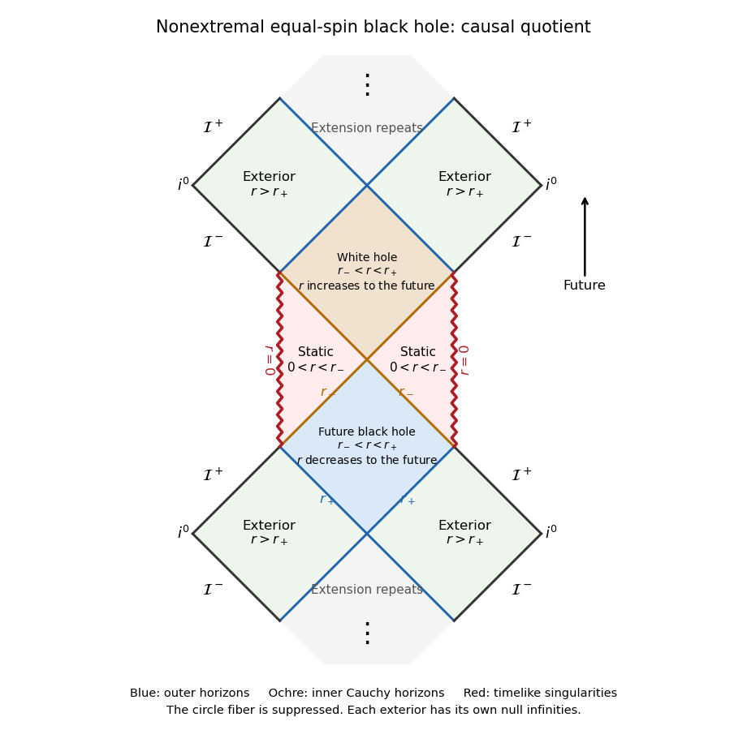
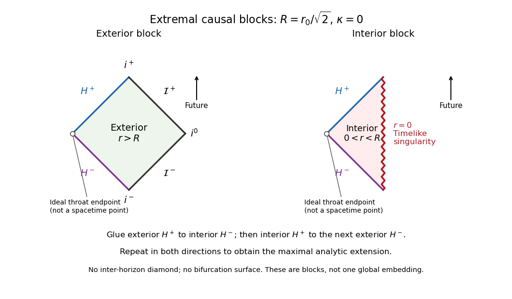

<h1 id="3/d/solution">Solution</h1>

↑ **Parent:** [D](../d.md)

Relative to a chosen asymptotically flat end, define the [black hole](../../../../../../black-hole.md) region by

$$
\boxed{\mathcal B=\mathcal M\setminus J^-(\mathcal I^+),}
$$

where $\mathcal I^+$ is that end's [future null infinity](../../../../../../future-null-infinity.md) in a [conformal completion](../../../../../../conformal-completion.md). It consists of events unable to send a future causal signal to that infinity; its boundary is the corresponding future [event horizon](../../../../../../event-horizon.md).

For $0<\alpha<r_0/2$, $h>0$ and $f<0$ on $r_-<r<r_+$. The [gradient](../../../../../../gradient.md) of $r$ has norm $g^{ab}\nabla_ar\nabla_br=f$, so it is timelike there. Use the future extension regular in the ingoing coordinates above, reached by an exterior future ingoing [null geodesic](../../../../../../null-geodesic.md) with $\dot r=-E\sqrt h<0$. This determines $\nabla r$ to be future timelike in the inter-horizon block. Every nonzero future causal tangent $V$ therefore obeys

$$
\frac{dr}{d\lambda}=g(\nabla r,V)<0.
$$

At the future outer horizon the [gradient](../../../../../../gradient.md) becomes future null and gives the corresponding one-way inequality $dr/d\lambda\leq0$. No future signal can cross that horizon outward to the selected exterior. The future inter-horizon block is consequently within $\mathcal B$; a future-directed path can leave it only through the inner horizon, not return through the outer horizon to the selected infinity.

This statement requires a branch and an end. The maximal extension also contains time-reversed inter-horizon blocks, where future-directed curves have increasing $r$ and emerge into an exterior: they are [white holes](../../../../../../white-hole.md), not the selected [black hole](../../../../../../black-hole.md) region. Thus the unqualified claim for every copy of $r_-<r<r_+$ in an arbitrary extension is false. Analytic continuation past a [Cauchy horizon](../../../../../../cauchy-horizon.md) can also introduce other asymptotic ends; the displayed definition explicitly refers to the chosen component of infinity.

To sketch the causal structure, suppress the spacelike $\psi$ circle by its orbit-space projection. The induced three-dimensional [metric tensor](../../../../../../metric-tensor.md) is

$$
ds_3^2=q+r^2h(d\psi-\Omega dt)^2,\qquad
q=-\frac f h\,dt^2+\frac{dr^2}{f}=\frac f h(-dt^2+dr_*^2).
$$

The [causal projection along a spacelike circular fiber](../../../../../../causal-projection-along-a-spacelike-circular-fiber.md) is exact: any [causal curve](../../../../../../causal-curve.md) projects to a $q$-[causal curve](../../../../../../causal-curve.md), and every base curve has a lift $d\psi=\Omega dt$ with exactly its base norm. The diagrams therefore represent this two-dimensional orbit space, not a constant-$\psi$ slice of the three-dimensional submanifold.

There are three nonextremal block types. For $r>r_+$, $r_*$ spans the full real line from the outer horizon to infinity, producing an exterior diamond. For $r_-<r<r_+$, $r_*$ spans the full line with the time and space roles reversed; these diamonds contain the future black-hole or past white-hole branches. For $0<r<r_-$, $r_*$ is finite at zero and diverges at the inner horizon, producing a static half-diamond with a timelike singular edge. The supplied [Kretschmann scalar](../../../../../../kretschmann-scalar.md) diverges as $384\alpha^4r_0^4/r^{12}$ at $r=0$, and $f>0$ on the inner side, so that edge is a genuine timelike [curvature singularity](../../../../../../curvature-singularity.md). In contrast, both horizon radii are regular in horizon-adapted coordinates.

**[Figure 1](#3/d/image-nonextremal-orbit-space-causal-structure). Nonextremal orbit-space causal structure**.

The finite strip shows two exterior levels, a future trapped block, an inner static level with timelike singularities, and the next emerging block. Continuing through the inner [Cauchy horizons](../../../../../../cauchy-horizon.md) repeats this pattern upward and downward in the maximal analytic extension. The inner boundary is not a spacelike Schwarzschild-type singularity. Such an ideal extension need not describe a physical collapse past its unstable inner horizon.

At $\alpha=r_0/2$, put $R=r_0/\sqrt2$. Then $r_+=r_-=R$, $f=(r^2-R^2)^2/r^4$, and the interval $r_-<r<r_+$ is empty. The lapse is positive on both sides, so there is no inter-horizon trapped diamond. The horizon is a [degenerate Killing horizon](../../../../../../degenerate-killing-horizon.md), with $\kappa=0$. In the exterior $r_*\to-\infty$ as $r\downarrow R$, while inside $r_*\to+\infty$ as $r\uparrow R$; more precisely its leading pole is $-\sqrt2 R^2/[4(r-R)]$. Static proper distance to the horizon is infinite. Future ingoing rays still cross it at finite affine parameter, as the regular ingoing [metric tensor](../../../../../../metric-tensor.md) shows.

**[Figure 2](#3/d/image-extremal-conformal-blocks-and-horizon-gluing). Extremal conformal blocks and horizon gluing**.

The extremal sketch gives the exterior diamond and singular interior half-diamond, with the complete gluing prescription: the exterior future horizon attaches to the interior past horizon; the interior future horizon attaches to the past horizon of another exterior. Repeating these attachments gives the maximal extension. The marked throat endpoints are conformal ideal endpoints, not bifurcation points of the [spacetime](../../../../../../spacetime.md). This block representation avoids incorrectly treating the extremal geometry as two transverse horizons with a collapsed trapped region.

## ↑ Ancestors (11)

1. [D](../d.md)
2. [3](../../3.md)
3. [Paper 311](../../../paper-311-split.md)
4. [Iii](../../../split.md)
5. [2017](../../../../split.md)
6. [Past exam of the mathematics course of the University of Cambridge](../../../../../split.md)
7. [Mathematics course of the University of Cambridge](../../../../../../mathematics-course-of-the-university-of-cambridge.md)
8. [Course of the University of Cambridge](../../../../../../course-of-the-university-of-cambridge.md)
9. [University of Cambridge](../../../../../../university-of-cambridge-split.md)
10. [List of universities](../../../../../../list-of-universities.md)
11. [Codex Wiki](../../../../../../split.md)
