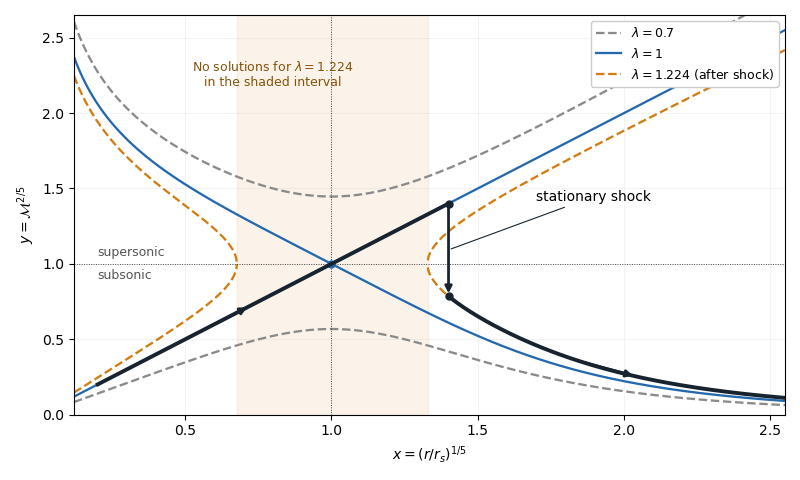

# Paper 314

↑ **Parent:** [Iii](../iii.md)

[https://www.maths.cam.ac.uk/postgrad/part-iii/files/pastpapers/2017/paper_314.pdf](https://www.maths.cam.ac.uk/postgrad/part-iii/files/pastpapers/2017/paper_314.pdf)

**Table of contents**

- [1](#1)
  - [a](#1/a)
    - [Solution](#1/a/solution)
  - [b](#1/b)
    - [Solution](#1/b/solution)
- [2](#2)
  - [Solution](#2/solution)
- [3](#3)
  - [Solution](#3/solution)
- [4](#4)
  - [a](#4/a)
    - [Solution](#4/a/solution)
  - [b](#4/b)
    - [Solution](#4/b/solution)

## 1

↑ **Parent:** [Paper 314](paper-314.md)

<h3 id="1/a">a</h3>

↑ **Parent:** [1](#1)

<h4 id="1/a/solution">Solution</h4>

↑ **Parent:** [A](#1/a)

Write $D/Dt=\partial_t+\mathbf u\cdot\nabla$ for the [material derivative](../../../continuum-mechanics.md#material-derivative) and $q=\mathbf u\cdot\mathbf B$ for the [cross-helicity](../../../astrophysical-fluid-dynamics.md#cross-helicity) density, so $H_c=\int_V q\,dV$. The [ideal magnetohydrodynamic induction equation](../../../astrophysical-fluid-dynamics.md#ideal-magnetohydrodynamic-induction-equation) of [ideal magnetohydrodynamics](../../../astrophysical-fluid-dynamics.md#ideal-magnetohydrodynamics), with $\nabla\cdot\mathbf B=0$, gives

$$
\frac{D\mathbf B}{Dt}=(\mathbf B\cdot\nabla)\mathbf u-\mathbf B\,\nabla\cdot\mathbf u.
$$

The [dot product](../../../linear-algebra.md#dot-product) of the [Euler momentum equation](../../../fluid-mechanics.md#euler-equations-for-an-inviscid-fluid) with the [magnetic field](../../../electromagnetism.md#magnetic-field) has no [Lorentz force](../../../electromagnetism.md#lorentz-force) contribution, because $\mathbf B\cdot[(\nabla\times\mathbf B)\times\mathbf B]=0$. Consequently,

$$
\frac{Dq}{Dt}=\mathbf B\cdot\nabla\left(\frac{u^2}{2}-\Phi\right)-\frac{\mathbf B\cdot\nabla p}{\rho}-q\,\nabla\cdot\mathbf u.
$$

Here $h=e+p/\rho$ is the [specific enthalpy](../../../thermodynamics.md#specific-enthalpy), $T$ the [temperature](../../../thermodynamics.md#temperature), and $s$ the [specific entropy](../../../thermodynamics.md#specific-entropy); $e$ is the [internal energy](../../../thermodynamics.md#internal-energy) per unit mass. The [first law of thermodynamics](../../../thermodynamics.md#first-law-of-thermodynamics) in this convention is $de=T\,ds-p\,d(1/\rho)$, so $dh=T\,ds+dp/\rho$. Substitution, followed by $\nabla\cdot\mathbf B=0$, yields the [cross-helicity conservation law](../../../astrophysical-fluid-dynamics.md#cross-helicity-conservation-law)

$$
\partial_tq+\nabla\cdot\left[\mathbf u q+\left(h+\Phi-\frac{u^2}{2}\right)\mathbf B\right]=T\mathbf B\cdot\nabla s.
$$

The [vector triple product](../../../calculus.md#vector-triple-product) identity $\mathbf u\times(\mathbf u\times\mathbf B)=\mathbf u q-u^2\mathbf B$ puts this in the equivalent form

$$
\boxed{\partial_t(\mathbf u\cdot\mathbf B)+\nabla\cdot\left[\mathbf u\times(\mathbf u\times\mathbf B)+\left(\frac{u^2}{2}+\Phi+h\right)\mathbf B\right]=T\mathbf B\cdot\nabla s.}
$$

For the fixed volume, the [divergence theorem](../../../calculus.md#divergence-theorem) gives the exact [cross-helicity](../../../astrophysical-fluid-dynamics.md#cross-helicity) balance

$$
\frac{dH_c}{dt}=\int_V T\mathbf B\cdot\nabla s\,dV-\int_{\partial V}\left[\mathbf u q+\left(h+\Phi-\frac{u^2}{2}\right)\mathbf B\right]\cdot\mathbf n\,dS.
$$

Thus **[cross-helicity](../../../astrophysical-fluid-dynamics.md#cross-helicity) is constant when the net source equals the outward flux**. Simple sufficient hypotheses are $\mathbf B\cdot\nabla s=0$ throughout the volume and $\mathbf u\cdot\mathbf n=\mathbf B\cdot\mathbf n=0$ on its boundary. The first condition includes a [homentropic flow](../../../compressible-flow.md#homentropic-flow); the second prevents both relevant boundary fluxes. [Periodic boundary conditions](../../../differential-equation.md#periodic-boundary-conditions), or sufficiently rapid decay at infinity, provide alternatives. These statements concern smooth [ideal magnetohydrodynamics](../../../astrophysical-fluid-dynamics.md#ideal-magnetohydrodynamics): material [specific entropy](../../../thermodynamics.md#specific-entropy) conservation alone, $Ds/Dt=0$, does not eliminate spatial [specific entropy](../../../thermodynamics.md#specific-entropy) gradients along the [magnetic field lines](../../../electromagnetism.md#magnetic-field-line).

<h3 id="1/b">b</h3>

↑ **Parent:** [1](#1)

<h4 id="1/b/solution">Solution</h4>

↑ **Parent:** [B](#1/b)

Let the constant [mass density](../../../fluid-mechanics.md#density) be $\rho>0$ and put $\mathbf v_a=\mathbf B/\sqrt{\mu_0\rho}$, the [Alfvén velocity](../../../astrophysical-fluid-dynamics.md#alfven-velocity). Since both the [velocity](../../../classical-mechanics.md#velocity) and the [magnetic field](../../../electromagnetism.md#magnetic-field) have zero [divergence](../../../calculus.md#divergence), the [magnetic tension](../../../astrophysical-fluid-dynamics.md#magnetic-tension) and [magnetic pressure](../../../astrophysical-fluid-dynamics.md#magnetic-pressure) decomposition of the [Lorentz force](../../../electromagnetism.md#lorentz-force) gives

$$
\partial_t\mathbf u+(\mathbf u\cdot\nabla)\mathbf u=-\nabla\psi+(\mathbf v_a\cdot\nabla)\mathbf v_a,\qquad
\partial_t\mathbf v_a+(\mathbf u\cdot\nabla)\mathbf v_a=(\mathbf v_a\cdot\nabla)\mathbf u,
\qquad
\boxed{\psi=\frac p\rho+\Phi+\frac{|\mathbf v_a|^2}{2}.}
$$

The [Newtonian gravitational potential](../../../classical-mechanics.md#newtonian-gravitational-potential) $\Phi$ remains in $\psi$; uniform [mass density](../../../fluid-mechanics.md#density) does not justify dropping a prescribed [gravitational acceleration](../../../classical-mechanics.md#gravitational-acceleration). Adding and subtracting the two equations proves the [Elsässer variable](../../../astrophysical-fluid-dynamics.md#elsasser-variable) equations

$$
\boxed{\partial_t\mathbf z^\pm+(\mathbf z^\mp\cdot\nabla)\mathbf z^\pm=-\nabla\psi,\qquad \nabla\cdot\mathbf z^\pm=0.}
$$

Here $\mathbf z^\pm=\mathbf u\pm\mathbf v_a$; each [Elsässer variable](../../../astrophysical-fluid-dynamics.md#elsasser-variable) is transported by the other.

Define $I_\pm=\int_V|\mathbf z^\pm|^2\,dV$. Taking the [dot product](../../../linear-algebra.md#dot-product) with $2\mathbf z^\pm$ gives the [Elsässer energy invariant](../../../astrophysical-fluid-dynamics.md#elsasser-energy-invariant) balance

$$
\partial_t|\mathbf z^\pm|^2+\nabla\cdot\left(|\mathbf z^\pm|^2\mathbf z^\mp+2\psi\mathbf z^\pm\right)=0.
$$

The [divergence theorem](../../../calculus.md#divergence-theorem) proves $dI_\pm/dt=0$ whenever the net boundary flux vanishes. In particular, $\mathbf u\cdot\mathbf n=\mathbf B\cdot\mathbf n=0$ makes $\mathbf z^\pm\cdot\mathbf n=0$, so both fluxes vanish pointwise. [Periodic boundary conditions](../../../differential-equation.md#periodic-boundary-conditions) or decay at infinity are also sufficient. These [boundary conditions](../../../differential-equation.md#boundary-condition) matter: fixed volume alone gives no conservation.

The [kinetic energy](../../../classical-mechanics.md#kinetic-energy) plus [magnetic energy](../../../electromagnetism.md#magnetic-energy) is

$$
E=\frac{\rho}{2}\int_V\left(u^2+v_a^2\right)dV.
$$

Expanding $|\mathbf u\pm\mathbf v_a|^2$ and using the [cross-helicity](../../../astrophysical-fluid-dynamics.md#cross-helicity) definition yields

$$
\boxed{E=\frac{\rho}{4}(I_++I_-),\qquad H_c=\frac{\sqrt{\mu_0\rho}}{4}(I_+-I_-),\qquad I_\pm=\frac{2E}{\rho}\pm\frac{2H_c}{\sqrt{\mu_0\rho}}.}
$$

Both [energy](../../../classical-mechanics.md#energy) and [cross-helicity](../../../astrophysical-fluid-dynamics.md#cross-helicity) therefore follow from the two [Elsässer energy invariants](../../../astrophysical-fluid-dynamics.md#elsasser-energy-invariant). The quantity $E$ here is exactly the requested [kinetic energy](../../../classical-mechanics.md#kinetic-energy) plus [magnetic energy](../../../electromagnetism.md#magnetic-energy), without an additional gravitational term.

## 2

↑ **Parent:** [Paper 314](paper-314.md)

<h3 id="2/solution">Solution</h3>

↑ **Parent:** [2](#2)

Use $v=|u_r|>0$ for the radial [speed](../../../classical-mechanics.md#speed) and distinguish the central mass $M$ from the [Mach number](../../../compressible-flow.md#mach-number) $\mathcal M=v/c$. In each smooth nonzero-flow region, [mass conservation](../../../continuum-mechanics.md#mass-conservation), the [adiabatic equation of state](../../../thermodynamics.md#adiabatic-equation-of-state), and the [Bernoulli equation](../../../fluid-mechanics.md#bernoulli-equation) give

$$
j=r^2\rho v=\frac{|\dot M|}{4\pi}>0,\qquad p=K\rho^{3/2},\qquad c^2=\frac32K\rho^{1/2},\qquad
\mathcal E=\frac{v^2}{2}+2c^2-\frac{GM}{r}.
$$

Here $K>0$ is constant on a smooth [isentropic flow](../../../compressible-flow.md#isentropic-flow) branch, $c$ is the [adiabatic sound speed](../../../compressible-flow.md#adiabatic-sound-speed), and $\mathcal E$ is the [Bernoulli function](../../../fluid-mechanics.md#bernoulli-function). Either sign of $u_r$ is possible. The positive-radius nondimensionalization in the question requires $\mathcal E>0$; flows with $\mathcal E\leq0$ do not have these positive $r_s,x,\lambda$ and require another scaling.

Indeed, the supplied [adiabatic process](../../../thermodynamics.md#adiabatic-process) equations give $D(p\rho^{-3/2})/Dt=0$, so $K$ is spatially constant along a steady nonzero radial [fluid flow](../../../fluid-mechanics.md#fluid-flow). The [adiabatic sound speed](../../../compressible-flow.md#adiabatic-sound-speed) is $c^2=(\partial p/\partial\rho)_s$, and the [specific enthalpy](../../../thermodynamics.md#specific-enthalpy) is $h=c^2/(\gamma-1)=2c^2$. The radial [Euler momentum equation](../../../fluid-mechanics.md#euler-equations-for-an-inviscid-fluid), $v\,dv/dr=-\rho^{-1}dp/dr-GM/r^2$, integrates to $\mathcal E$ because $dh=dp/\rho$ on this [isentropic flow](../../../compressible-flow.md#isentropic-flow) branch.

Put $D=[j(3K/2)^2]^{2/5}$. Eliminating the [mass density](../../../fluid-mechanics.md#density) from the [continuity equation](../../../physics.md#continuity-equation) gives

$$
c^2=D r^{-4/5}\mathcal M^{-2/5}.
$$

With $y=\mathcal M^{2/5}$, the [Bernoulli equation](../../../fluid-mechanics.md#bernoulli-equation) becomes

$$
\mathcal E+\frac{GM}{r}=\frac D2 r^{-4/5}(y^4+4/y).
$$

Therefore the physical constants of the [spherical polytropic flow with adiabatic exponent three halves](../../../compressible-flow.md#spherical-polytropic-flow-with-adiabatic-exponent-three-halves) are

$$
\boxed{r_s=\frac{GM}{4\mathcal E},\qquad \lambda=\frac{[j(3K/2)^2]^{2/5}}{2\mathcal E r_s^{4/5}},\qquad
\lambda F(y)=F(x),\quad F(t)=t^4+\frac4t,\quad x=(r/r_s)^{1/5}.}
$$

For $t>0$, $F'(t)=4(t^5-1)/t^2$, so $F$ decreases from infinity to its unique minimum $F(1)=5$, then increases to infinity. This completely determines the [algebraic curves](../../../algebraic-geometry.md#algebraic-curve). For $0<\lambda<1$, there are two disconnected branches at every $x>0$, one [subsonic flow](../../../compressible-flow.md#subsonic-flow) with $y<1$ and one [supersonic flow](../../../compressible-flow.md#supersonic-flow) with $y>1$. For $\lambda=1$, the line $y=x$ and a decreasing branch meet at $(1,1)$. Their slopes are $+1$ and $-1$, since the leading expansion is $F(1+\eta)=5+10\eta^2+O(\eta^3)$. For $\lambda>1$, solutions exist only where $F(x)\geq5\lambda$: if $x_-<1<x_+$ solve $F(x_\pm)=5\lambda$, there is a forbidden interval $x_-<x<x_+$. At either endpoint the two branches turn at $y=1$ and have an infinite slope.

A smooth [sonic point](../../../compressible-flow.md#sonic-point) needs $F'(x)=F'(y)=0$; hence **a regular sonic transition requires $\lambda=1$ and $r=r_s$**. The [critical speed of a polytropic flow](../../../compressible-flow.md#critical-speed-of-a-polytropic-flow) is then $c_s^2=GM/(2r_s)=2\mathcal E$, and the allowed [mass flux](../../../physics.md#mass-flux) is $j=(2\mathcal E)^{5/2}r_s^2/(3K/2)^2$. Here the subscript on $c_s$ denotes evaluation at the [sonic point](../../../compressible-flow.md#sonic-point), rather than the [isothermal sound speed](../../../compressible-flow.md#isothermal-sound-speed) convention used in the next solution.

The simple [transonic branch](../../../compressible-flow.md#transonic-branch) is $y=x$. Direct substitution gives

$$
\boxed{\mathcal M=(r/r_s)^{1/2},\quad v=\sqrt{2\mathcal E},\quad c^2=\frac{GM}{2r},\quad
\rho=\left(\frac{GM}{3Kr}\right)^2,\quad p=K\left(\frac{GM}{3Kr}\right)^3.}
$$

Thus the radial [velocity](../../../classical-mechanics.md#velocity) has constant magnitude, while the [mass density](../../../fluid-mechanics.md#density) and [pressure](../../../thermodynamics.md#pressure) scale as $r^{-2}$ and $r^{-3}$. For an outward [fluid flow](../../../fluid-mechanics.md#fluid-flow), this is a [subsonic flow](../../../compressible-flow.md#subsonic-flow) becoming a [supersonic flow](../../../compressible-flow.md#supersonic-flow) as its [adiabatic sound speed](../../../compressible-flow.md#adiabatic-sound-speed) decreases.

On the other [transonic branch](../../../compressible-flow.md#transonic-branch), $y$ decreases as $x$ increases. At large $r$, the terms $4/y$ and $x^4$ dominate, giving $y\sim4x^{-4}$. At small $r$, the terms $y^4$ and $4/x$ dominate, giving $y\sim4^{1/4}x^{-1/4}$. The resulting [asymptotic expansions](../../../analysis.md#asymptotic-expansion) are

$$
\begin{aligned}
r\gg r_s:\quad&\mathcal M\sim32(r_s/r)^2,\qquad c^2\longrightarrow\mathcal E/2,\qquad
\rho\longrightarrow\left(\frac{\mathcal E}{3K}\right)^2,\qquad
v\sim32\sqrt{\mathcal E/2}(r_s/r)^2,\\
r\ll r_s:\quad&\mathcal M\sim2^{5/4}(r_s/r)^{1/8},\qquad
c^2\sim\sqrt2\,\mathcal E(r_s/r)^{3/4},\qquad
v\sim\sqrt{\frac{2GM}{r}},\\
&\rho\sim\frac{j}{\sqrt{2GM}}r^{-3/2},\qquad
p\sim K\left(\frac{j}{\sqrt{2GM}}\right)^{3/2}r^{-9/4}.
\end{aligned}
$$

For inward [fluid flow](../../../fluid-mechanics.md#fluid-flow), these are the nearly static reservoir at infinity and the inner [free fall](../../../classical-mechanics.md#free-fall) region of [Bondi accretion](../../../astrophysics.md#bondi-accretion). The [specific enthalpy](../../../thermodynamics.md#specific-enthalpy) is smaller than $GM/r$ in the inner limit, which explains [free fall](../../../classical-mechanics.md#free-fall). Reversing the radial [velocity](../../../classical-mechanics.md#velocity) gives a decelerating outflow with the same profiles. The formal small-$r$ limit describes the point-mass model: if the spherical gravitating body has a finite surface, the exterior solution stops there.

A stationary, nonradiative [normal shock wave](../../../compressible-flow.md#normal-shock-wave) conserves the [mass flux](../../../physics.md#mass-flux) and the sum $v^2/2+h$, while the [Newtonian gravitational potential](../../../classical-mechanics.md#newtonian-gravitational-potential) is continuous across its thin layer. Hence $\mathcal E$ and $r_s$ are unchanged. The [entropy production in a perfect-gas shock](../../../compressible-flow.md#entropy-production-in-a-perfect-gas-shock) increases $K=p/\rho^{3/2}$, so

$$
\boxed{\frac{\lambda_2}{\lambda_1}=\left(\frac{K_2}{K_1}\right)^{4/5}>1.}
$$

More explicitly, the [Rankine-Hugoniot condition](../../../partial-differential-equation.md#rankine-hugoniot-conditions) for $\gamma=3/2$ gives, with upstream $m=\mathcal M_1^2>1$,

$$
\frac{\rho_2}{\rho_1}=\frac{5m}{m+4},\qquad
\frac{p_2}{p_1}=\frac{6m-1}{5},\qquad
\mathcal M_2^2=\frac{m+4}{6m-1}<1.
$$

Thus the [shock wave](../../../partial-differential-equation.md#shock-wave) jumps vertically, at the same $x$, from the [supersonic flow](../../../compressible-flow.md#supersonic-flow) to a [subsonic flow](../../../compressible-flow.md#subsonic-flow) on a larger-$\lambda$ curve. The figure illustrates an outward flow on $y=x$ with a [shock wave](../../../partial-differential-equation.md#shock-wave) at $x=1.4$; the downstream [subsonic flow](../../../compressible-flow.md#subsonic-flow) has $\lambda\simeq1.224$ and continues to larger $x$. The [shock wave](../../../partial-differential-equation.md#shock-wave) radius is an additional boundary-data choice, rather than being determined by the smooth equations alone.

**[Figure 1](#2/image-transonic-curves-and-a-stationary-shock). Transonic curves and a stationary shock**. Solid blue curves have $\lambda=1$; grey curves have $\lambda=0.7$; orange curves have the downstream shock value $\lambda>1$. The vertical arrow is a supersonic-to-subsonic jump at fixed radius.

## 3

↑ **Parent:** [Paper 314](paper-314.md)

<h3 id="3/solution">Solution</h3>

↑ **Parent:** [3](#3)

Write $c_s^2=p/\rho$ for the constant [isothermal sound speed](../../../compressible-flow.md#isothermal-sound-speed) squared and $v_a^2=B^2/(\mu_0\rho)$ for the constant [Alfvén speed](../../../astrophysical-fluid-dynamics.md#alfven-speed) squared. The horizontal [magnetic field](../../../electromagnetism.md#magnetic-field) has no vertical [magnetic tension](../../../astrophysical-fluid-dynamics.md#magnetic-tension); [magnetostatic equilibrium](../../../electromagnetism.md#magnetostatic-equilibrium) is

$$
\frac{d\Pi}{dz}=-g\rho,\qquad \Pi=p+\frac{B^2}{2\mu_0}=\left(c_s^2+\frac{v_a^2}{2}\right)\rho.
$$

Consequently the [magnetized isothermal atmosphere](../../../electromagnetism.md#magnetized-isothermal-atmosphere) has

$$
\boxed{H=\frac{c_s^2+v_a^2/2}{g},\qquad
\rho=\rho_0e^{-z/H},\qquad p=c_s^2\rho_0e^{-z/H},\qquad
B=B_0e^{-z/(2H)},\quad B_0^2=\mu_0\rho_0v_a^2.}
$$

The sign of $B_0$ specifies the orientation of the [magnetic field](../../../electromagnetism.md#magnetic-field). The [adiabatic sound speed](../../../compressible-flow.md#adiabatic-sound-speed) is $v_s^2=\gamma p/\rho=\gamma c_s^2$, also constant.

For the proposed [normal mode](../../../wave-equation.md#normal-mode), let $A=\exp(i\mathbf k\cdot\mathbf x+z/(2H)-i\omega t)$, $a=1/(2H)$, and temporarily write $\boldsymbol\xi$ for its constant complex amplitude. The [divergence](../../../calculus.md#divergence) amplitude is $\Delta=ik_x\xi_x+ik_y\xi_y+(ik_z+a)\xi_z$. Using $\rho'/\rho=-1/H$ and $B'/B=-a$, the [Eulerian and Lagrangian fluid perturbations](../../../fluid-mechanics.md#eulerian-and-lagrangian-fluid-perturbations) give

$$
\frac{\delta\rho}{\rho A}=-\Delta+\frac{\xi_z}{H},\qquad
\frac{\delta\mathbf B}{BA}=ik_y\boldsymbol\xi-\mathbf e_y\Delta+a\mathbf e_y\xi_z.
$$

Since $\Pi'/\rho=-g$, the [magnetohydrodynamic total pressure](../../../astrophysical-fluid-dynamics.md#magnetohydrodynamic-total-pressure) amplitude is

$$
\psi=\frac{\delta\Pi}{\rho A}=-(v_s^2+v_a^2)\Delta+v_a^2ik_y\xi_y+g\xi_z.
$$

The vertical derivative of $\delta\Pi=\rho A\psi$ is $\rho A(ik_z-a)\psi$. For the [magnetic tension](../../../astrophysical-fluid-dynamics.md#magnetic-tension) perturbation, the terms proportional to $aik_y\xi_z\mathbf e_y$ from $\delta\mathbf B\cdot\nabla\mathbf B$ and $\mathbf B\cdot\nabla\delta\mathbf B$ cancel, leaving

$$
\frac{\delta\mathbf B\cdot\nabla\mathbf B+\mathbf B\cdot\nabla\delta\mathbf B}{\mu_0\rho A}
=-v_a^2 k_y^2\boldsymbol\xi-v_a^2ik_y\Delta\,\mathbf e_y.
$$

Thus the [linearization](../../../algebra.md#linearization) really reduces to the constant-coefficient [eigenvalue problem](../../../linear-operator-theory.md#eigenvalue-problem)

$$
\begin{aligned}
-\omega^2\xi_x&=-ik_x\psi-k_y^2v_a^2\xi_x,\\
-\omega^2\xi_y&=-ik_y(\psi+v_a^2\Delta)-k_y^2v_a^2\xi_y,\\
-\omega^2\xi_z&=g(\Delta-\xi_z/H)-(ik_z-a)\psi-k_y^2v_a^2\xi_z.
\end{aligned}
$$

For a static [ideal magnetohydrodynamics](../../../astrophysical-fluid-dynamics.md#ideal-magnetohydrodynamics) equilibrium with conservative [gravitational acceleration](../../../classical-mechanics.md#gravitational-acceleration), the [magnetohydrodynamic energy principle](../../../astrophysical-fluid-dynamics.md#magnetohydrodynamic-energy-principle) gives a [Hermitian operator](../../../hilbert-space.md#hermitian-operator) for the restoring force in the [mass density](../../../fluid-mechanics.md#density) weighted [inner product](../../../linear-algebra.md#inner-product), provided the surface terms vanish. The factor $e^{z/(2H)}$ removes the exponential [mass density](../../../fluid-mechanics.md#density) weight. This can be checked directly, without assuming stability: set $s=v_s^2$, $b=v_a^2$, and $q=s+b$. Then $\omega^2\boldsymbol\xi=\mathsf K\boldsymbol\xi$, where

$$
\mathsf K=
\begin{pmatrix}
qk_x^2+bk_y^2&sk_xk_y&qk_xk_z+ik_x(g-qa)\\
sk_xk_y&sk_y^2&sk_yk_z+ik_y(g-sa)\\
qk_xk_z-ik_x(g-qa)&sk_yk_z-ik_y(g-sa)&q(k_z^2+a^2)+bk_y^2
\end{pmatrix}.
$$

This is a [Hermitian matrix](../../../hilbert-space.md#hermitian-operator) for real $\mathbf k$ and real positive $s,b$. Therefore **every squared frequency $\omega^2$ is real**; negative values give exponential growth, rather than an oscillation with a complex squared frequency. In an infinite atmosphere these are generalized [plane waves](../../../quantum-mechanics.md#plane-wave), not finite-total-energy global modes.

At $\omega^2=0$ and $k_y\ne0$, the $y$ equation, after cancelling its magnetic terms, gives $s\Delta=g\xi_z$. For nonzero [magnetic field](../../../electromagnetism.md#magnetic-field), the $x$ equation also gives $ik_x\xi_x=k_x^2\psi/(k_y^2b)$. Substituting $\psi=-b[\Delta-ik_y\xi_y]+g\xi_z-s\Delta$ and then $s\Delta=g\xi_z$ yields

$$
\boxed{s\Delta=g\xi_z,\qquad -(k_x^2+k_y^2)\psi=k_y^2b(ik_z+a)\xi_z.}
$$

For a nontrivial mode $\xi_z\ne0$; otherwise these equations and $k_yb\ne0$ force every component to vanish. Substitution in the vertical equation gives

$$
\boxed{b k_y^2\left(|\mathbf k|^2+\frac{1}{4H^2}\right)+\frac gH\left(1-\frac{gH}{s}\right)(k_x^2+k_y^2)=0.}
$$

For example, the [determinant](../../../linear-algebra.md#determinant) provides an independent check:

$$
\det\mathsf K=s b k_y^2\left[b k_y^2(|\mathbf k|^2+a^2)+\left(\frac gH-\frac{g^2}{s}\right)(k_x^2+k_y^2)\right].
$$

To prove the claimed “if and only if”, rather than merely locating a zero [eigenvalue](../../../linear-operator-theory.md#eigenvalue), use the [magnetic buoyancy energy criterion](../../../astrophysical-fluid-dynamics.md#magnetic-buoyancy-energy-criterion)

$$
\begin{aligned}
\boldsymbol\xi^\dagger\mathsf K\boldsymbol\xi={}&s\left|\Delta-\frac g{s}\xi_z\right|^2
+b\left|ik_x\xi_x+(ik_z+a)\xi_z\right|^2\\
&+bk_y^2(|\xi_x|^2+|\xi_z|^2)
+\left(\frac gH-\frac{g^2}{s}\right)|\xi_z|^2.
\end{aligned}
$$

If $gH\leq s$, every term is nonnegative, so all [eigenvalues](../../../linear-operator-theory.md#eigenvalue) are nonnegative for every [wavevector](../../../continuum-mechanics.md#wavevector), including $k_y=0$. If $gH>s$, choose $k_z=0$, any fixed $k_x\ne0$, and $\xi_z=1$, $\xi_x=-a/(ik_x)$, $\xi_y=g/(sik_y)$. The first two squares vanish; the remaining value is

$$
bk_y^2\left(1+\frac{a^2}{k_x^2}\right)+\frac gH-\frac{g^2}{s},
$$

which is negative for sufficiently small nonzero $k_y$. The [Rayleigh quotient](../../../linear-operator-theory.md#rayleigh-quotient) of this displacement is therefore negative, proving a negative [eigenvalue](../../../linear-operator-theory.md#eigenvalue) and an unstable [normal mode](../../../wave-equation.md#normal-mode). This uses precisely the assumption that [boundary conditions](../../../differential-equation.md#boundary-condition) do not exclude the chosen wavelengths. Equality is a neutral threshold, not exponential growth.

Finally the [plasma beta](../../../astrophysics.md#plasma-beta) is $\beta=p/[B^2/(2\mu_0)]=2c_s^2/v_a^2$. Hence

$$
\boxed{\text{instability}\ \Longleftrightarrow\ gH>v_s^2
\ \Longleftrightarrow\ \frac{v_a^2}{2}>(\gamma-1)c_s^2
\ \Longleftrightarrow\ \beta(\gamma-1)<1.}
$$

The [magnetic field](../../../electromagnetism.md#magnetic-field) is assumed nonzero in the marginal-mode elimination and in the finite $\beta$ expression. The positive-sound-speed, nonmagnetic limit remains covered by the energy identity; for the usual $\gamma>1$ it is stable. [Parker instability](../../../astrophysical-fluid-dynamics.md#parker-instability) occurs because [magnetic pressure](../../../astrophysical-fluid-dynamics.md#magnetic-pressure) supports part of the atmosphere's weight while the gas can drain along gently bent [magnetic field lines](../../../electromagnetism.md#magnetic-field-line). The resulting buoyant displacement can release [Newtonian gravitational potential energy](../../../classical-mechanics.md#newtonian-gravitational-potential-energy); choosing long wavelengths along the [magnetic field](../../../electromagnetism.md#magnetic-field) makes the stabilizing [magnetic tension](../../../astrophysical-fluid-dynamics.md#magnetic-tension) small. The completed-square calculation quantifies this competition, including the [adiabatic process](../../../thermodynamics.md#adiabatic-process) restoring force.

## 4

↑ **Parent:** [Paper 314](paper-314.md)

<h3 id="4/a">a</h3>

↑ **Parent:** [4](#4)

<h4 id="4/a/solution">Solution</h4>

↑ **Parent:** [A](#4/a)

Let the free surface be at $r=R_1$ and take the [Newtonian gravitational potential](../../../classical-mechanics.md#newtonian-gravitational-potential) to vanish at infinity. [Mass conservation](../../../continuum-mechanics.md#mass-conservation) fixes $R_1=(3M_1/(4\pi\rho_1))^{1/3}$. The enclosed mass is $m(r)=4\pi\rho_1r^3/3$, and [hydrostatic equilibrium](../../../statistical-physics.md#hydrostatic-equilibrium) requires $dp_0/dr=-\rho_1Gm(r)/r^2$. With vacuum outside, $p_0(R_1)=0$, giving

$$
\boxed{p_0(r)=\frac{2\pi G\rho_1^2}{3}(R_1^2-r^2),\qquad
\Phi_0(r)=
\begin{cases}
-\dfrac{GM_1}{2R_1}\left(3-\dfrac{r^2}{R_1^2}\right),&r\leq R_1,\\
-\dfrac{GM_1}{r},&r\geq R_1.
\end{cases}}
$$

The [pressure](../../../thermodynamics.md#pressure) is zero outside. A prescribed constant external [pressure](../../../thermodynamics.md#pressure) would simply add that constant to $p_0$.

The bulk [Eulerian and Lagrangian fluid perturbations](../../../fluid-mechanics.md#eulerian-and-lagrangian-fluid-perturbations) obey $\delta\rho=0$ because the [mass density](../../../fluid-mechanics.md#density) is uniform and the [Lagrangian displacement](../../../fluid-mechanics.md#lagrangian-displacement-fluid-mechanics) has zero [divergence](../../../calculus.md#divergence). The linearized [Euler momentum equation](../../../fluid-mechanics.md#euler-equations-for-an-inviscid-fluid) in the interior is

$$
-\omega^2\boldsymbol\xi=-\nabla\left(\frac{\delta p}{\rho_1}+\delta\Phi\right).
$$

Taking the [curl](../../../calculus.md#curl) gives $\omega^2\nabla\times\boldsymbol\xi=0$. Thus every nonzero-frequency [normal mode](../../../wave-equation.md#normal-mode) has an [irrotational flow](../../../fluid-mechanics.md#irrotational-flow) displacement; the [simply connected space](../../../algebraic-topology.md#simply-connected-space) formed by the interior admits $\boldsymbol\xi=\nabla U$ and [incompressibility](../../../fluid-mechanics.md#incompressible-flow) gives the [Laplace equation](../../../partial-differential-equation.md#laplace-equation) $\nabla^2U=0$. For a regular center, one [spherical harmonic](../../../analysis.md#spherical-harmonic) component is $U=A_l r^lY_l^m$, with $|m|\leq l$.

It is essential to retain the [surface gravity perturbation of a uniform-density sphere](../../../astrophysical-fluid-dynamics.md#surface-gravity-perturbation-of-a-uniform-density-sphere). Although the bulk [mass density](../../../fluid-mechanics.md#density) perturbation is zero, the displaced density discontinuity gives

$$
\delta\rho=\rho_1\xi_r(R_1)\delta(r-R_1),\qquad
\xi_r(R_1)=lA_lR_1^{l-1}Y_l^m.
$$

The [Poisson equation](../../../partial-differential-equation.md#poisson-equation) implies that $\delta\Phi$ is continuous and its outward radial derivative has the jump

$$
\left[\partial_r\delta\Phi\right]_{\mathrm{out}-\mathrm{in}}=4\pi G\rho_1\xi_r(R_1).
$$

Using regularity at the center and decay at infinity, write

$$
\delta\Phi_{\mathrm{in}}=C_l r^lY_l^m,\qquad
\delta\Phi_{\mathrm{out}}=C_l R_1^{2l+1}r^{-l-1}Y_l^m.
$$

The derivative jump is $-(2l+1)C_lR_1^{l-1}Y_l^m$, so $C_l=-4\pi G\rho_1lA_l/(2l+1)$.

Integrating the bulk [Euler momentum equation](../../../fluid-mechanics.md#euler-equations-for-an-inviscid-fluid) gives $\delta p/\rho_1=\omega^2U-\delta\Phi$ for $l\geq1$. At the free surface the [Lagrangian pressure perturbation](../../../fluid-mechanics.md#lagrangian-pressure-perturbation) vanishes:

$$
0=\delta p+\xi_r p_0'(R_1),\qquad
\frac{\delta p}{\rho_1}=\frac{GM_1}{R_1^2}\xi_r.
$$

Combining these relations yields the [Kelvin stellar mode](../../../astrophysical-fluid-dynamics.md#kelvin-stellar-mode) frequency

$$
\omega_l^2=l\frac{GM_1}{R_1^3}-\frac{4\pi G\rho_1l}{2l+1}
=\boxed{\frac{2l(l-1)}{2l+1}\frac{GM_1}{R_1^3}},\qquad l\geq1.
$$

The $2l+1$ choices of $m$ are degenerate because of [spherical symmetry](../../../geometry-and-topology.md#spherical-symmetry). For $l=1$, $rY_1^m$ is a [linear combination](../../../vector-space.md#linear-combination) of coordinates in a [Cartesian coordinate system](../../../linear-algebra.md#cartesian-coordinate-system), so $\nabla U$ is a constant [displacement](../../../classical-mechanics.md#displacement): **the zero frequency is rigid translation of the whole isolated body**. Such a translation has no restoring force. The constant $l=0$ potential generates no displacement; a radial breathing motion is excluded by [incompressibility](../../../fluid-mechanics.md#incompressible-flow) and a regular center.

The printed irrotational assertion needs the nonzero-frequency qualification, or restriction to the potential [incompressible stellar surface modes](../../../astrophysical-fluid-dynamics.md#incompressible-stellar-surface-mode). It is false for all neutral displacements: $\boldsymbol\xi=\boldsymbol\Omega\times\mathbf r$ has zero [divergence](../../../calculus.md#divergence), zero normal displacement at the surface, and $\delta p=\delta\Phi=0$, so it is a zero-frequency displacement, but $\nabla\times\boldsymbol\xi=2\boldsymbol\Omega\ne0$. This does not change the [Kelvin stellar mode](../../../astrophysical-fluid-dynamics.md#kelvin-stellar-mode) spectrum just derived.

<h3 id="4/b">b</h3>

↑ **Parent:** [4](#4)

<h4 id="4/b/solution">Solution</h4>

↑ **Parent:** [B](#4/b)

The separation of the two bodies is $a$, as is fixed by the supplied [Kepler third law](../../../physics.md#kepler-s-third-law) $\omega_o^2=G(M_1+M_2)/a^3$. The phrase “orbit of radius $a$” cannot denote the first body's distance from the center of mass in that formula.

Expand the companion's [Newtonian potential of a point mass](../../../classical-mechanics.md#newtonian-potential-of-a-point-mass) about the first body's center. The constant term produces no force; the linear term produces the uniform acceleration of the center and disappears in the translating frame. The leading differential acceleration therefore comes from the [quadrupolar tidal forcing](../../../classical-mechanics.md#quadrupolar-tidal-forcing)

$$
\Phi_{\mathrm{tide}}=-\frac{GM_2}{2a^3}\left[3(\mathbf n(t)\cdot\mathbf r)^2-r^2\right],
$$

where $\mathbf n(t)$ points toward the companion. It is a degree-two solid [spherical harmonic](../../../analysis.md#spherical-harmonic). For a circular nonrotating-frame orbit, its time-dependent components have $m=\pm2$ and frequency $2\omega_o$, because the squared direction cosines repeat twice per orbit. There is also a static $m=0$ component. The real part of one complex harmonic represents the pair of time-dependent components; its normalization and orientation are absorbed into the order-one coefficient $\psi$. This gives $\Psi=\psi(GM_2/a^3)r^2Y_2^m$ and $\omega=2\omega_o$. The expansion is the leading term for $R_1/a$ small; spin is being neglected.

For a forced [potential flow](../../../fluid-mechanics.md#potential-flow) with the same temporal frequency, the [Euler momentum equation](../../../fluid-mechanics.md#euler-equations-for-an-inviscid-fluid) becomes

$$
-\omega^2\nabla U=-\nabla\left(\frac{\delta p}{\rho_1}+\delta\Phi+\Psi\right).
$$

Use $U=A r^2Y_2^m$. The [surface gravity perturbation of a uniform-density sphere](../../../astrophysical-fluid-dynamics.md#surface-gravity-perturbation-of-a-uniform-density-sphere) is unchanged, as is the vanishing [Lagrangian pressure perturbation](../../../fluid-mechanics.md#lagrangian-pressure-perturbation) boundary condition. Integrating the equation and applying that condition gives

$$
(\omega^2-\omega_2^2)A=\psi\frac{GM_2}{a^3},\qquad
\omega_2^2=\frac45\frac{GM_1}{R_1^3}.
$$

Since $\xi_r(R_1)=2AR_1Y_2^m$, the real surface [displacement](../../../classical-mechanics.md#displacement) is

$$
\boxed{\xi_r(R_1,t)=\epsilon R_1\frac{\omega_2^2}{\omega^2-\omega_2^2}
\operatorname{Re}\!\left(\psi Y_2^m e^{-i\omega t}\right),\qquad
\epsilon=\frac52\frac{M_2}{M_1}\left(\frac{R_1}{a}\right)^3.}
$$

Indeed $\epsilon\omega_2^2=2GM_2/a^3$, so the normalization is consistent. This is a particular forced response away from the [resonance](../../../dynamical-systems.md#resonance); arbitrary free [normal modes](../../../wave-equation.md#normal-mode) can be added.

Put $\mu=M_2/M_1$ and $q=(R_1/a)^3$. The [tidal resonance of a stellar oscillation](../../../astrophysical-fluid-dynamics.md#tidal-resonance-of-a-stellar-oscillation) condition is $4\omega_o^2=\omega_2^2$, hence

$$
q=\frac1{5(1+\mu)},\qquad
\epsilon=\frac{\mu}{2(1+\mu)},\qquad
\boxed{\left(\frac{R_1}{a}\right)^3=\frac15(1-2\epsilon).}
$$

The resonance gives $0\leq\epsilon<1/2$ for finite nonnegative $\mu$, with actual forcing requiring $M_2>0$. At exact [resonance](../../../dynamical-systems.md#resonance) the undamped [linearization](../../../algebra.md#linearization) has no bounded response at the forcing frequency: the time-domain particular solution grows proportionally to $t$ times a sinusoid. Thus the frequency-response formula has a pole, rather than describing a finite resonant [displacement](../../../classical-mechanics.md#displacement). Away from that pole, [linearization](../../../algebra.md#linearization) requires the displayed surface displacement to be small compared with $R_1$; the leading [quadrupolar tidal forcing](../../../classical-mechanics.md#quadrupolar-tidal-forcing) approximation separately requires $R_1/a$ small.

## ↑ Ancestors (8)

1. [Iii](../iii.md)
2. [2017](../../2017.md)
3. [Past exam of the mathematics course of the University of Cambridge](../../../past-exam-of-the-mathematics-course-of-the-university-of-cambridge.md)
4. [Mathematics course of the University of Cambridge](../../../university-of-cambridge.md#mathematics-course-of-the-university-of-cambridge)
5. [Course of the University of Cambridge](../../../university-of-cambridge.md#course-of-the-university-of-cambridge)
6. [University of Cambridge](../../../university-of-cambridge.md)
7. [List of universities](../../../README.md#list-of-universities)
8. [Codex Wiki](../../../README.md)
