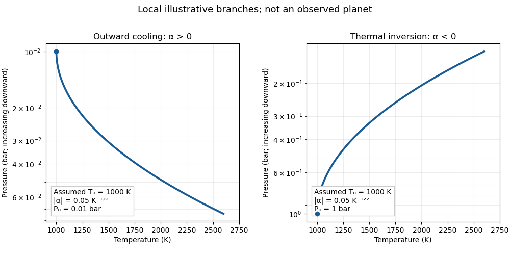

<h1 id="1/a/iii/solution">Solution</h1>

↑ **Parent:** [Iii](../iii.md)

Use the usual atmospheric plotting convention: [temperature](../../../../../../../temperature.md) on the horizontal axis, logarithmic [pressure](../../../../../../../pressure.md) increasing downward. To illustrate a physically plausible local range for a [hot Jupiter](../../../../../../../hot-jupiter.md), set $T_0=1000\,\mathrm K$ and $|\alpha|=0.05\,\mathrm K^{-1/2}$. The sign is not fixed by the fact that the planet is a [hot Jupiter](../../../../../../../hot-jupiter.md); irradiation and [opacity](../../../../../../../opacity.md) determine whether an [atmospheric thermal inversion](../../../../../../../inversion-meteorology.md) is present.

The original sketch shows both admissible branches of the [square-root exponential atmospheric profile](../../../../../../../square-root-exponential-atmospheric-profile.md), with separate assumed normalizations $P_0=0.01\,\mathrm{bar}$ for the outward-cooling example and $P_0=1\,\mathrm{bar}$ for the inverted example. Each extends from $1000$ to $2600\,\mathrm K$ and has $|\log(P/P_0)|\le2$. For $\alpha>0$, increasing depth increases both [pressure](../../../../../../../pressure.md) and [temperature](../../../../../../../temperature.md), so the curve bends rightward downward. For $\alpha<0$, moving upward lowers [pressure](../../../../../../../pressure.md) and raises [temperature](../../../../../../../temperature.md), so the curve bends rightward upward. Each branch meets $T_0$ with $dT/d\log P=0$; it must not be continued through that endpoint onto the other branch.

**[Figure 1](#1/a/iii/image-illustrative-branches-of-an-atmospheric-pressure-temperature-profile). Illustrative branches of an atmospheric pressure-temperature profile**.

For the outward-cooling example, $\alpha\sqrt{T_0}=1.58<3.5$, so a section of the imposed profile is unstable for a homogeneous diatomic [ideal gas](../../../../../../../ideal-gas.md). It should be interpreted as an illustrative retrieved radiative profile that would be modified by [convection](../../../../../../../convection.md) if realised, rather than a self-consistent deep convective atmosphere. The inverted branch is stable under the same assumptions.

**The sketch must show only the sign-allowed pressure branch; either an inverted or an outward-cooling local profile is possible.**

## ↑ Ancestors (12)

1. [Iii](../iii.md)
2. [A](../../a.md)
3. [1](../../../1.md)
4. [Paper 315](../../../../paper-315-split.md)
5. [Iii](../../../../split.md)
6. [2017](../../../../../split.md)
7. [Past exam of the mathematics course of the University of Cambridge](../../../../../../split.md)
8. [Mathematics course of the University of Cambridge](../../../../../../../mathematics-course-of-the-university-of-cambridge.md)
9. [Course of the University of Cambridge](../../../../../../../course-of-the-university-of-cambridge.md)
10. [University of Cambridge](../../../../../../../university-of-cambridge-split.md)
11. [List of universities](../../../../../../../list-of-universities.md)
12. [Codex Wiki](../../../../../../../split.md)
