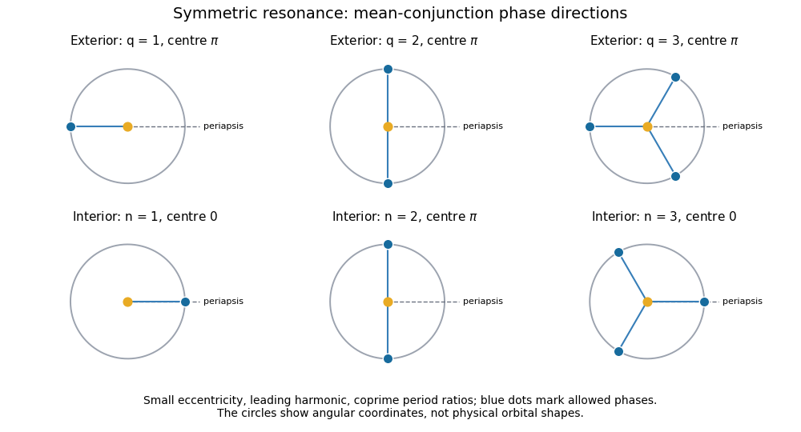
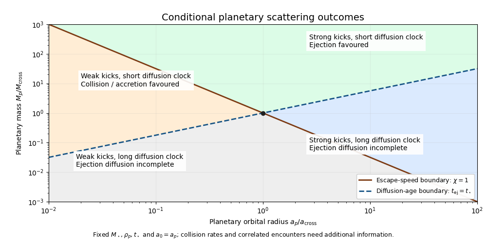

# Paper 316

↑ **Parent:** [Iii](../iii.md)

[https://www.maths.cam.ac.uk/postgrad/part-iii/files/pastpapers/2017/paper_316.pdf](https://www.maths.cam.ac.uk/postgrad/part-iii/files/pastpapers/2017/paper_316.pdf)

**Table of contents**

- [1](#1)
  - [i](#1/i)
    - [Solution](#1/i/solution)
  - [ii](#1/ii)
    - [Solution](#1/ii/solution)
  - [iii](#1/iii)
    - [Solution](#1/iii/solution)
  - [iv](#1/iv)
    - [Solution](#1/iv/solution)
  - [v](#1/v)
    - [Solution](#1/v/solution)
  - [vi](#1/vi)
    - [Solution](#1/vi/solution)
  - [vii](#1/vii)
    - [Solution](#1/vii/solution)
- [2](#2)
  - [i](#2/i)
    - [Solution](#2/i/solution)
  - [ii](#2/ii)
    - [Solution](#2/ii/solution)
  - [iii](#2/iii)
    - [Solution](#2/iii/solution)
  - [iv](#2/iv)
    - [Solution](#2/iv/solution)
  - [v](#2/v)
    - [Solution](#2/v/solution)
  - [vi](#2/vi)
    - [Solution](#2/vi/solution)
- [3](#3)
  - [i](#3/i)
    - [Solution](#3/i/solution)
  - [ii](#3/ii)
    - [Solution](#3/ii/solution)
  - [iii](#3/iii)
    - [Solution](#3/iii/solution)
  - [iv](#3/iv)
    - [Solution](#3/iv/solution)
  - [v](#3/v)
    - [Solution](#3/v/solution)
  - [vi](#3/vi)
    - [Solution](#3/vi/solution)
  - [vii](#3/vii)
    - [Solution](#3/vii/solution)
- [4](#4)
  - [i](#4/i)
    - [Solution](#4/i/solution)
  - [ii](#4/ii)
    - [Solution](#4/ii/solution)
  - [iii](#4/iii)
    - [Solution](#4/iii/solution)
  - [iv](#4/iv)
    - [Solution](#4/iv/solution)
  - [v](#4/v)
    - [Solution](#4/v/solution)
  - [vi](#4/vi)
    - [Solution](#4/vi/solution)
  - [vii](#4/vii)
    - [Solution](#4/vii/solution)
  - [viii](#4/viii)
    - [Solution](#4/viii/solution)

## 1

↑ **Parent:** [Paper 316](paper-316.md)

<h3 id="1/i">i</h3>

↑ **Parent:** [1](#1)

<h4 id="1/i/solution">Solution</h4>

↑ **Parent:** [I](#1/i)

Use the separation vector $\boldsymbol r$ from the [star](../../../stellar-astrophysics.md#star) to the [comet](../../../planetary-science.md#comet), and let $m_{\rm red}=mM_\star/(m+M_\star)$. The [two-body problem](../../../classical-mechanics.md#two-body-problem) separates into uniform [centre of mass](../../../classical-mechanics.md#center-of-mass) motion and

$$
\ddot{\boldsymbol r}=-\frac{\mu}{r^3}\boldsymbol r,\qquad \mu=G(M_\star+m).
$$

Taking a cross product with $\boldsymbol r$ proves [conservation of angular momentum](../../../classical-mechanics.md#conservation-of-angular-momentum); taking the scalar product with $\dot{\boldsymbol r}$ proves [conservation of energy](../../../physics.md#conservation-of-energy). The relative constants are

$$
\boldsymbol h=\boldsymbol r\times\dot{\boldsymbol r},\qquad \varepsilon=\frac{v^2}{2}-\frac{\mu}{r}.
$$

The total relative [angular momentum](../../../classical-mechanics.md#angular-momentum) and [energy](../../../classical-mechanics.md#energy) are $m_{\rm red}\boldsymbol h$ and $m_{\rm red}\varepsilon$, respectively. The conserved [eccentricity vector](../../../classical-mechanics.md#eccentricity-vector) is $\boldsymbol e=\dot{\boldsymbol r}\times\boldsymbol h/\mu-\widehat{\boldsymbol r}$. Its scalar product with $\widehat{\boldsymbol r}$ gives $r=h^2/[\mu(1+e\cos f)]$, with $f$ the [true anomaly](../../../classical-mechanics.md#true-anomaly). The [periapsis](../../../classical-mechanics.md#periapsis) and [apoapsis](../../../classical-mechanics.md#apoapsis) distances are therefore $h^2/[\mu(1+e)]$ and $h^2/[\mu(1-e)]$. Their sum is twice the [semi-major axis](../../../classical-mechanics.md#semi-major-axis), so

$$
\boxed{h=\sqrt{\mu a(1-e^2)}}.
$$

At either apsis $v=h/r$; substituting an apsidal radius gives $\varepsilon=-\mu/(2a)$. Thus the [specific orbital energy](../../../classical-mechanics.md#specific-orbital-energy) implies the [vis-viva equation](../../../classical-mechanics.md#vis-viva-equation)

$$
\boxed{v=\sqrt{\mu\left(\frac2r-\frac1a\right)}}.
$$

These are exact relative-coordinate formulas for an [elliptic orbit](../../../classical-mechanics.md#elliptic-orbit), $0\leq e<1$. In the barycentric frame the [comet](../../../planetary-science.md#comet)'s speed is $M_\star/(M_\star+m)$ times the relative speed; the printed identification with the [comet](../../../planetary-science.md#comet)'s stellar orbital speed uses $M_\star\gg m$.

<h3 id="1/ii">ii</h3>

↑ **Parent:** [1](#1)

<h4 id="1/ii/solution">Solution</h4>

↑ **Parent:** [Ii](#1/ii)

The transverse [velocity](../../../classical-mechanics.md#velocity) is $v_\theta=h/r$. Subtracting its square from the [vis-viva equation](../../../classical-mechanics.md#vis-viva-equation), and putting $u=a/r$, gives

$$
\dot r^2=\mu\left(\frac2r-\frac1a\right)-\frac{\mu a(1-e^2)}{r^2}
=\frac{\mu}{a}\left[2u-1-u^2(1-e^2)\right].
$$

Consequently

$$
\boxed{\dot r=\pm v_k(a)\sqrt{2u-1-u^2(1-e^2)}}.
$$

The positive branch is outward motion and the negative branch is inward motion. The PDF's unsigned expression gives the radial speed, or the outward branch, rather than the signed radial [velocity](../../../classical-mechanics.md#velocity) everywhere. For example, on the inward part of any noncircular [elliptic orbit](../../../classical-mechanics.md#elliptic-orbit), $\dot r<0$.

The same result follows from $\dot r=(\mu e/h)\sin f$, with $f$ the [true anomaly](../../../classical-mechanics.md#true-anomaly). The radicand is nonnegative precisely on $1/(1+e)\leq u\leq1/(1-e)$; it vanishes at [periapsis](../../../classical-mechanics.md#periapsis) and [apoapsis](../../../classical-mechanics.md#apoapsis). For a [circular Kepler orbit](../../../classical-mechanics.md#circular-kepler-orbit), $e=0$, $u=1$ and $\dot r=0$.

<h3 id="1/iii">iii</h3>

↑ **Parent:** [1](#1)

<h4 id="1/iii/solution">Solution</h4>

↑ **Parent:** [Iii](#1/iii)

Assume spherical fragments of the common [mass density](../../../fluid-mechanics.md#density) $\rho$, and let $n(D)=KD^{-\alpha}$ count fragments per unit diameter. [Mass normalization of a power-law size distribution](../../../planetary-science.md#mass-normalization-of-a-power-law-size-distribution) gives

$$
m=\frac{\pi\rho K}{6}\frac{D_{\max}^{4-\alpha}-D_{\min}^{4-\alpha}}{4-\alpha}.
$$

Their [geometric cross-sections](../../../classical-mechanics.md#geometric-collision-cross-section) are $\pi D^2/4$, hence the [cross-section of a power-law fragment population](../../../planetary-science.md#cross-section-of-a-power-law-fragment-population) is exactly

$$
\sigma_{\rm tot}=\frac{3m}{2\rho}\frac{4-\alpha}{\alpha-3}
\frac{D_{\min}^{3-\alpha}-D_{\max}^{3-\alpha}}{D_{\max}^{4-\alpha}-D_{\min}^{4-\alpha}}.
$$

For $3<\alpha<4$, large fragments dominate the [mass](../../../classical-mechanics.md#mass) integral and small fragments dominate the [geometric cross-section](../../../classical-mechanics.md#geometric-collision-cross-section) integral. Neglecting the subdominant endpoints gives

$$
\boxed{\sigma_{\rm tot}\simeq\frac{3(4-\alpha)m}{2(\alpha-3)\rho}
D_{\min}^{3-\alpha}D_{\max}^{\alpha-4}}.
$$

The two actual error parameters are $(D_{\min}/D_{\max})^{\alpha-3}$ and $(D_{\min}/D_{\max})^{4-\alpha}$. They must both be small; the approximation is not uniform as $\alpha$ approaches either endpoint. At $\alpha=3$ or $4$ the corresponding integral is logarithmic, so the endpoint-dominated formula must be replaced by that integral.

<h3 id="1/iv">iv</h3>

↑ **Parent:** [1](#1)

<h4 id="1/iv/solution">Solution</h4>

↑ **Parent:** [Iv](#1/iv)

**The printed line-density statement is incorrect for a phase-mixed [orbit](../../../dynamical-systems.md#orbit-dynamical-system)**. A steady [line density on a Kepler orbit](../../../classical-mechanics.md#line-density-on-a-kepler-orbit) is inversely proportional to speed: for a [cross-sectional-area current](../../../classical-mechanics.md#cross-sectional-area-current) $J_\sigma$, the area per unit arc length is $d\sigma/ds=J_\sigma/v$. Equivalently, [phase mixing](../../../planetary-science.md#phase-mixing) gives $d\sigma=(\sigma_{\rm tot}/P)\,dt$, uniform in [mean anomaly](../../../classical-mechanics.md#mean-anomaly), where $P=2\pi\sqrt{a^3/\mu}$ is the [orbital period](../../../classical-mechanics.md#orbital-period).

For an [optically thin](../../../astrophysics.md#optically-thin-medium) population of [blackbodies](../../../astrophysics.md#blackbody) in [radiative equilibrium](../../../thermodynamics.md#radiative-equilibrium), a fragment absorbs $\sigma L_\star/(4\pi r^2)$ and reradiates the same [luminosity](../../../astrophysics.md#luminosity). Thus the [fractional luminosity of a phase-mixed eccentric wire](../../../planetary-science.md#fractional-luminosity-of-a-phase-mixed-eccentric-wire) is

$$
f=\frac{\sigma_{\rm tot}}{4\pi P}\int_0^P\frac{dt}{r^2}.
$$

The [specific angular momentum](../../../classical-mechanics.md#specific-angular-momentum) gives $dt/r^2=d\theta/h$, so the integral is $2\pi/h$. Since $Ph=2\pi a^2\sqrt{1-e^2}$,

$$
\boxed{f=\frac{\sigma_{\rm tot}}{4\pi a^2\sqrt{1-e^2}}}.
$$

This derives the intended result after explicitly correcting the density to $1/v$.

The error is consequential. If one instead imposes the literal density $d\sigma/ds\propto v$, its time weighting is $v^2dt$. Using $\langle v^2\rangle=\mu/a$, $\langle r^{-2}\rangle=[a^2\sqrt{1-e^2}]^{-1}$ and $\langle r^{-3}\rangle=[a^3(1-e^2)^{3/2}]^{-1}$ gives

$$
f_{\lambda_\ell\propto v}=\frac{\sigma_{\rm tot}}{4\pi a^2}\frac{1+e^2}{(1-e^2)^{3/2}}.
$$

At $e=1/2$ this is $5/3$ times the printed result. The inverse-radius averages can also be obtained directly with [eccentric anomaly](../../../classical-mechanics.md#eccentric-anomaly) $E$, $r=a(1-e\cos E)$ and $dt=(1-e\cos E)dE/n$.

<h3 id="1/v">v</h3>

↑ **Parent:** [1](#1)

<h4 id="1/v/solution">Solution</h4>

↑ **Parent:** [V](#1/v)

Let $D_c$ be the parent [comet](../../../planetary-science.md#comet)'s diameter, with the same [mass density](../../../fluid-mechanics.md#density) as the fragments, so $m=\pi\rho D_c^3/6$. The required [geometric cross-section](../../../classical-mechanics.md#geometric-collision-cross-section) is $\sigma_{\rm tot}=4\pi a^2\sqrt{1-e^2}\,f$, using the corrected [phase-mixed orbit](../../../classical-mechanics.md#phase-mixed-orbit) interpretation.

Substitute this and the spherical [mass](../../../classical-mechanics.md#mass) into the endpoint-dominated fragment formula. The [parent-body size from a fragment cross-section](../../../planetary-science.md#parent-body-size-from-a-fragment-cross-section) becomes

$$
\boxed{D_c=\left[\frac{16(\alpha-3)}{4-\alpha}\,
f a^2\sqrt{1-e^2}\,D_{\min}^{\alpha-3}D_{\max}^{4-\alpha}\right]^{1/3}}.
$$

The common [mass density](../../../fluid-mechanics.md#density) cancels. The [comet](../../../planetary-science.md#comet)'s radius is $D_c/2$. This expression treats both fragment cutoffs as specified independently and has the same endpoint-approximation restrictions as part (iii).

If a model instead ties the largest fragment to the parent through $D_{\max}=\eta D_c$, with fixed $0<\eta\leq1$, one must solve that dependence too:

$$
\boxed{D_c=\left[\frac{16(\alpha-3)}{4-\alpha}\,
f a^2\sqrt{1-e^2}\,D_{\min}^{\alpha-3}\eta^{4-\alpha}\right]^{1/(\alpha-1)}}.
$$

That extra assumption is not supplied by the PDF; setting $D_{\max}=D_c$ without saying so would change the requested size relation.

<h3 id="1/vi">vi</h3>

↑ **Parent:** [1](#1)

<h4 id="1/vi/solution">Solution</h4>

↑ **Parent:** [Vi](#1/vi)

On the corrected steady [phase-mixed orbit](../../../classical-mechanics.md#phase-mixed-orbit), each fragment crosses a fixed orbital longitude once per [orbital period](../../../classical-mechanics.md#orbital-period). Hence the [cross-sectional-area current](../../../classical-mechanics.md#cross-sectional-area-current) through that point is

$$
J_\sigma=\frac{\sigma_{\rm tot}}{P}.
$$

From the [fractional luminosity of a phase-mixed eccentric wire](../../../planetary-science.md#fractional-luminosity-of-a-phase-mixed-eccentric-wire), $\sigma_{\rm tot}=4\pi a^2\sqrt{1-e^2}\,f=2Phf$. Therefore the area rate at the foreground crossing of the line of sight is

$$
\boxed{\dot\sigma=J_\sigma=2fh}.
$$

Only the foreground segment blocks the [star](../../../stellar-astrophysics.md#star); the far-side intersection does not add another occultation current. The orbital area current is constant because the line density varies as $1/v$, even though the local orbital speed varies.

<h3 id="1/vii">vii</h3>

↑ **Parent:** [1](#1)

<h4 id="1/vii/solution">Solution</h4>

↑ **Parent:** [Vii](#1/vii)

Use an [edge-on orbit](../../../classical-mechanics.md#edge-on-orbit) and an equatorial, effectively central chord. Near the foreground crossing the radial [velocity](../../../classical-mechanics.md#velocity) is along the line of sight; the projected transverse speed is $v_\perp=h/r$. In the small stellar-angular-radius limit, $r\gg R_\star$, the crossing time is $2R_\star/v_\perp=2R_\star r/h$.

The [cross-sectional-area current](../../../classical-mechanics.md#cross-sectional-area-current) therefore places an area

$$
\sigma_{\rm front}=(2fh)\frac{2R_\star r}{h}=4fR_\star r
$$

in front of the stellar disk. For an [optically thin](../../../astrophysics.md#optically-thin-medium) wire and a uniformly bright stellar disk, [transit dimming by an optically thin orbital wire](../../../exoplanet.md#transit-dimming-by-an-optically-thin-orbital-wire) gives

$$
\boxed{\frac{\Delta F}{F_\star}=\frac{\sigma_{\rm front}}{\pi R_\star^2}
=\frac4\pi\frac r{R_\star}f}.
$$

This is a linear occultation estimate, requiring negligible overlap and a fractional dimming much smaller than one. A finite [impact parameter](../../../classical-mechanics.md#impact-parameter) shortens the chord; [limb darkening](../../../astrophysics.md#limb-darkening), finite wire thickness and variation of $r$ across a large stellar angular extent modify the coefficient. The estimate cannot be extrapolated to dimming greater than unity.

## 2

↑ **Parent:** [Paper 316](paper-316.md)

<h3 id="2/i">i</h3>

↑ **Parent:** [2](#2)

<h4 id="2/i/solution">Solution</h4>

↑ **Parent:** [I](#2/i)

Treat $a,e$ as instantaneous [osculating orbital elements](../../../classical-mechanics.md#osculating-orbital-element) of the fixed-central-parameter [Kepler orbit](../../../classical-mechanics.md#kepler-orbit). The perturbing [work](../../../classical-mechanics.md#work) changes the [specific orbital energy](../../../classical-mechanics.md#specific-orbital-energy) according to

$$
\dot\varepsilon=\boldsymbol v\cdot(\bar R\widehat{\boldsymbol r}+\bar T\widehat{\boldsymbol\theta})
 =\bar R\dot r+\bar T\frac hr,\qquad
\dot a=\frac{2a^2}{\mu}\dot\varepsilon.
$$

The [specific angular momentum](../../../classical-mechanics.md#specific-angular-momentum) and conic equation give

$$
\dot r=\frac{\mu}{h}e\sin f,\qquad
\frac hr=\frac{\mu}{h}(1+e\cos f),\qquad h=\sqrt{\mu a(1-e^2)}.
$$

Substituting proves the [Gauss planetary equation for the semi-major axis](../../../planetary-science.md#gauss-planetary-equation-for-the-semi-major-axis):

$$
\boxed{\dot a=2\sqrt{\frac{a^3}{\mu(1-e^2)}}
[\bar R e\sin f+\bar T(1+e\cos f)]}.
$$

Here $f$ denotes [true anomaly](../../../classical-mechanics.md#true-anomaly), not the fractional [luminosity](../../../astrophysics.md#luminosity) used in Question 1. The equation follows from [work](../../../classical-mechanics.md#work) alone; a normal perturbing [acceleration](../../../classical-mechanics.md#acceleration) has no instantaneous contribution because the [velocity](../../../classical-mechanics.md#velocity) lies in the [orbital plane](../../../classical-mechanics.md#orbital-plane). For slowly averaged evolution, the perturbation must be weak over one [orbital period](../../../classical-mechanics.md#orbital-period).

<h3 id="2/ii">ii</h3>

↑ **Parent:** [2](#2)

<h4 id="2/ii/solution">Solution</h4>

↑ **Parent:** [Ii](#2/ii)

A [blackbody](../../../astrophysics.md#blackbody) grain absorbs starlight of flux $L_\star/(4\pi r^2)$ and reradiates isotropically in its own rest frame. [Aberration of light](../../../physics.md#relativistic-aberration) makes the incoming beam tilt against transverse motion. In the stellar frame, the reradiated [photons](../../../quantum-mechanics.md#photon) carry [momentum](../../../classical-mechanics.md#momentum) proportional to the grain's [velocity](../../../classical-mechanics.md#velocity), producing [Poynting–Robertson drag](../../../planetary-science.md#poynting-robertson-drag); it does not require anisotropic emission in the grain's frame.

Define the [radiation-pressure coefficient](../../../planetary-science.md#radiation-pressure-coefficient)

$$
\boxed{\beta=\frac{L_\star\sigma}{4\pi c\,GM_\star m}}.
$$

For a spherical grain of radius $s$ and [mass density](../../../fluid-mechanics.md#density) $\rho$, $\beta=3L_\star/(16\pi c\,GM_\star\rho s)$, assuming unit [radiation-pressure efficiency](../../../planetary-science.md#radiation-pressure-efficiency). To first order in $v/c$, the [first-order stellar radiation force on a blackbody grain](../../../planetary-science.md#first-order-stellar-radiation-force-on-a-blackbody-grain) is

$$
\boldsymbol F_{\rm rad}=\frac{m\beta\mu}{r^2}
\left[\left(1-\frac{\dot r}{c}\right)\widehat{\boldsymbol r}-\frac{\boldsymbol v}{c}\right].
$$

The incoming absorbed [photon](../../../quantum-mechanics.md#photon) [momentum](../../../classical-mechanics.md#momentum) contains the relative-flux factor $1-\dot r/c$; reradiation supplies the additional $-\boldsymbol v/c$. Separating the velocity-independent [radiation pressure](../../../thermodynamics.md#radiation-pressure) leaves

$$
\boxed{\boldsymbol F_{\rm PR}=\frac{m\beta\mu}{r^2}
\left[-\frac{2\dot r}{c}\widehat{\boldsymbol r}
-\frac{r\dot\theta}{c}\widehat{\boldsymbol\theta}\right]}.
$$

Thus there are two radial first-order contributions and one tangential contribution. The approximation assumes $v\ll c$, steady absorption/reradiation and constant grain properties; a non-blackbody requires its actual optical efficiencies.

<h3 id="2/iii">iii</h3>

↑ **Parent:** [2](#2)

<h4 id="2/iii/solution">Solution</h4>

↑ **Parent:** [Iii](#2/iii)

Put $A=\beta\mu/c$. The [Poynting–Robertson drag](../../../planetary-science.md#poynting-robertson-drag) [acceleration](../../../classical-mechanics.md#acceleration) has $\bar R=-2A\dot r/r^2$ and $\bar T=-A v_\theta/r^2$. Its [work](../../../classical-mechanics.md#work) is strictly dissipative:

$$
\dot\varepsilon=-\frac A{r^2}(2\dot r^2+v_\theta^2).
$$

For an unperturbed [elliptic orbit](../../../classical-mechanics.md#elliptic-orbit), use $dt=r^2df/h$, $\dot r=(\mu/h)e\sin f$ and $v_\theta=(\mu/h)(1+e\cos f)$. Averaging over its [orbital period](../../../classical-mechanics.md#orbital-period) $P$ gives

$$
\langle\dot\varepsilon\rangle
=-\frac{A\mu^2}{Ph^3}\int_0^{2\pi}
[2e^2\sin^2f+(1+e\cos f)^2]\,df
=-\frac{A\mu^2\pi(2+3e^2)}{Ph^3}.
$$

Since $\dot a=2a^2\dot\varepsilon/\mu$, $P=2\pi a^{3/2}/\sqrt\mu$ and $h^3=\mu^{3/2}a^{3/2}(1-e^2)^{3/2}$, the [Poynting–Robertson decay of a circumstellar orbit](../../../planetary-science.md#poynting-robertson-decay-of-a-circumstellar-orbit) is

$$
\boxed{\langle\dot a\rangle_{\rm cs}=-\frac{\beta\mu}{ca}
\frac{2+3e^2}{(1-e^2)^{3/2}}}.
$$

For a [circular Kepler orbit](../../../classical-mechanics.md#circular-kepler-orbit) this becomes $-2A/a$. This is a secular first-order average, not an exact instantaneous decay law. If static [radiation pressure](../../../thermodynamics.md#radiation-pressure) is appreciable, use a bound conservative [orbit](../../../dynamical-systems.md#orbit-dynamical-system) with central parameter $\mu_{\rm eff}=(1-\beta)\mu$, requiring $0\leq\beta<1$, and define its [orbital elements](../../../classical-mechanics.md#orbital-element) accordingly; repeating the [work](../../../classical-mechanics.md#work) calculation cancels $\mu_{\rm eff}$ and leaves the same coefficient $A=\beta GM_\star/c$.

<h3 id="2/iv">iv</h3>

↑ **Parent:** [2](#2)

<h4 id="2/iv/solution">Solution</h4>

↑ **Parent:** [Iv](#2/iv)

Let $\mu_p=GM_p$, $A=\beta GM_\star/c$ and $\kappa=A/a_p^2$. A tightly bound [circumplanetary orbit](../../../classical-mechanics.md#circumplanetary-orbit) lies well inside the [Hill sphere](../../../classical-mechanics.md#hill-sphere), so $a/a_p\ll1$ and its [orbital period](../../../classical-mechanics.md#orbital-period) is short compared with the [planet](../../../planetary-science.md#planet)'s year. Treat the stellar flux and stellar direction $\widehat{\boldsymbol R}$ as constant during one dust [orbit](../../../dynamical-systems.md#orbit-dynamical-system). With stellar-frame [velocity](../../../classical-mechanics.md#velocity) $\boldsymbol V_p+\boldsymbol u$, the velocity-dependent [acceleration](../../../classical-mechanics.md#acceleration) is

$$
\boldsymbol a_{\rm PR}=-\kappa[\boldsymbol V_p+\boldsymbol u+
((\boldsymbol V_p+\boldsymbol u)\cdot\widehat{\boldsymbol R})\widehat{\boldsymbol R}].
$$

The terms independent of $\boldsymbol u$, including the leading static [radiation pressure](../../../thermodynamics.md#radiation-pressure), do no net [work](../../../classical-mechanics.md#work) on an unperturbed closed circular [orbit](../../../dynamical-systems.md#orbit-dynamical-system). Hence

$$
\langle\dot\varepsilon_p\rangle=-\kappa\langle u^2+(\boldsymbol u\cdot\widehat{\boldsymbol R})^2\rangle.
$$

For a coplanar circular [orbit](../../../dynamical-systems.md#orbit-dynamical-system), $u^2=\mu_p/a$ and the component along the stellar direction has mean square $u^2/2$. Thus $\dot a=2a^2\dot\varepsilon_p/\mu_p$ yields the [Poynting–Robertson decay of a circumplanetary orbit](../../../planetary-science.md#poynting-robertson-decay-of-a-circumplanetary-orbit)

$$
\boxed{\langle\dot a\rangle_{\rm cp}=-3\frac{\beta\mu}{c}\frac a{a_p^2}}.
$$

**The coefficient three assumes coplanarity, which the PDF does not state**. For orbital normal $\widehat{\boldsymbol k}$, the general circular covariance is $\langle u_i u_j\rangle=(u^2/2)(\delta_{ij}-k_i k_j)$, giving

$$
\boxed{\langle\dot a\rangle_{\rm cp}=-\kappa a[3-(\widehat{\boldsymbol k}\cdot\widehat{\boldsymbol R})^2]}.
$$

An [orbital plane](../../../classical-mechanics.md#orbital-plane) normal to the stellar radial direction has coefficient two during that [orbit](../../../dynamical-systems.md#orbit-dynamical-system), a counterexample to an orientation-independent coefficient three. Averaging also over the [planet](../../../planetary-science.md#planet)'s circular stellar [orbit](../../../dynamical-systems.md#orbit-dynamical-system), with fixed dust-plane [orbital inclination](../../../classical-mechanics.md#orbital-inclination) $I$ to it, gives coefficient $3-\tfrac12\sin^2I$. The conservative [forces](../../../classical-mechanics.md#force) must be weak enough for the assumed approximately circular, planet-bound [orbit](../../../dynamical-systems.md#orbit-dynamical-system) to persist; the small planet-to-star [mass](../../../classical-mechanics.md#mass) ratio alone does not ensure this for arbitrary grain $\beta$.

<h3 id="2/v">v</h3>

↑ **Parent:** [2](#2)

<h4 id="2/v/solution">Solution</h4>

↑ **Parent:** [V](#2/v)

Keep $A=\beta GM_\star/c$ constant. A circular [circumstellar orbit](../../../classical-mechanics.md#circumstellar-orbit) stays circular in the secular drag approximation, and $da/dt=-2A/a$ integrates to $a^2=a_p^2-4At$. The [inspiral time under Poynting–Robertson drag](../../../planetary-science.md#inspiral-time-under-poynting-robertson-drag) to the stellar surface is

$$
\boxed{t_{\rm cs}=\frac{a_p^2-R_\star^2}{4A}\simeq\frac{a_p^2}{4A}}.
$$

The final expression treats the [star](../../../stellar-astrophysics.md#star) as a point, or assumes $R_\star\ll a_p$.

For the coplanar [circumplanetary orbit](../../../classical-mechanics.md#circumplanetary-orbit) used in the preceding result, $da/dt=-3Aa/a_p^2$, so $a=a_0\exp(-3At/a_p^2)$. The [inspiral time of circumplanetary dust](../../../planetary-science.md#inspiral-time-of-circumplanetary-dust) to the [planet](../../../planetary-science.md#planet)'s surface, for $a_0>R_p$, is

$$
\boxed{t_{\rm cp}=\frac{a_p^2}{3A}\ln\frac{a_0}{R_p}},\qquad
\boxed{\frac{t_{\rm cp}}{t_{\rm cs}}=
\frac{4\ln(a_0/R_p)}{3[1-(R_\star/a_p)^2]}}.
$$

Thus the timescales have the same dependence on stellar flux and $\beta$, but planetary arrival contains a logarithm of the initial planetocentric radius. It is not always shorter: for a point [star](../../../stellar-astrophysics.md#star), $t_{\rm cp}<t_{\rm cs}$ only if $a_0/R_p<e^{3/4}$. A constant tilted-orbit average replaces three by its appropriate orientation coefficient. [Sublimation](../../../critical-phenomenon.md#sublimation) or other removal can terminate the evolution before either idealized arrival time.

<h3 id="2/vi">vi</h3>

↑ **Parent:** [2](#2)

<h4 id="2/vi/solution">Solution</h4>

↑ **Parent:** [Vi](#2/vi)

**Radiative drag is only one of several loss mechanisms**. Around a [star](../../../stellar-astrophysics.md#star), [radiation-pressure blowout](../../../planetary-science.md#radiation-pressure-blowout-orbit) can eject small fragments; its $\beta=1/2$ threshold applies specifically to zero-kick release from a circular parent [orbit](../../../dynamical-systems.md#orbit-dynamical-system). [Stellar-wind drag](../../../planetary-science.md#stellar-wind-drag) and [gas drag](../../../fluid-mechanics.md#gas-drag) can drive [planetary migration](../../../planetary-science.md#planetary-migration), while [sublimation](../../../critical-phenomenon.md#sublimation) destroys grains approaching high-temperature regions. [Collisional cascades](../../../planetary-science.md#collisional-cascade) destroy or fragment grains and can feed the unbound size range. [Planetary scattering](../../../planetary-science.md#planetary-scattering) can cause ejection, collision with a [planet](../../../planetary-science.md#planet), or a stellar impact; [resonant trapping of dust](../../../planetary-science.md#resonant-trapping-of-dust) can instead delay [planetary migration](../../../planetary-science.md#planetary-migration).

For [circumplanetary orbits](../../../classical-mechanics.md#circumplanetary-orbit), collisions with the [planet](../../../planetary-science.md#planet) or its satellites, disruption in collisions, and escape under stellar [tidal forces](../../../classical-mechanics.md#tidal-force) are additional losses. Orbits near or outside the [Hill sphere](../../../classical-mechanics.md#hill-sphere) need not remain planet-bound. [Radiation pressure on circumplanetary dust](../../../classical-mechanics.md#radiation-pressure-on-circumplanetary-dust) can excite planetocentric [orbital eccentricity](../../../classical-mechanics.md#orbital-eccentricity) or unbind very small grains; it need not act only through slow [Poynting–Robertson drag](../../../planetary-science.md#poynting-robertson-drag). For charged grains, the [Lorentz force](../../../electromagnetism.md#lorentz-force) in stellar or planetary [magnetic fields](../../../electromagnetism.md#magnetic-field) can alter or destabilize an [orbit](../../../dynamical-systems.md#orbit-dynamical-system). [Shadowing of circumplanetary dust](../../../classical-mechanics.md#shadowing-of-circumplanetary-dust) changes the radiation-force average and can reduce the quoted decay rate. Which mechanism dominates depends on grain size and composition, environment, [orbit](../../../dynamical-systems.md#orbit-dynamical-system) orientation and the available collision or gas density.

## 3

↑ **Parent:** [Paper 316](paper-316.md)

<h3 id="3/i">i</h3>

↑ **Parent:** [3](#3)

<h4 id="3/i/solution">Solution</h4>

↑ **Parent:** [I](#3/i)

Use conventional [mean longitudes](../../../classical-mechanics.md#mean-longitude) $\lambda$ and take the positive integers $p,q$ in lowest terms. Rotational invariance requires the angular coefficients of a [resonant argument](../../../classical-mechanics.md#resonant-argument) to sum to zero. Since the inner [planet](../../../planetary-science.md#planet) has zero [orbital eccentricity](../../../classical-mechanics.md#orbital-eccentricity), the eccentricity-type term involving its undefined apsidal angle has zero amplitude. The surviving outer-eccentricity argument is

$$
\boxed{\phi_{bc}=(p+q)\lambda_c-p\lambda_b-q\varpi_c\pmod{2\pi}}.
$$

Its leading [disturbing function](../../../planetary-science.md#disturbing-function) term is proportional to $e_c^q\cos\phi_{bc}$. Near the period commensurability, $(p+q)n_c-pn_b$ is small, so the [resonant argument](../../../classical-mechanics.md#resonant-argument) is slow and repeated perturbations can add coherently. Trapping produces [resonant-argument libration](../../../classical-mechanics.md#resonant-argument-libration), rather than circulation, with $(p+q)n_c-pn_b-q\dot\varpi_c\simeq0$.

A near-integer period ratio alone does not prove [mean-motion resonance](../../../classical-mechanics.md#mean-motion-resonance): the diagnostic is bounded [resonant-argument libration](../../../classical-mechanics.md#resonant-argument-libration). At $e_c=0$ this eccentric resonant term vanishes and $\varpi_c$ is undefined. If $p,q$ have a common factor, reduce the ratio first; the unreduced $q$ is not the actual lowest resonance order.

<h3 id="3/ii">ii</h3>

↑ **Parent:** [3](#3)

<h4 id="3/ii/solution">Solution</h4>

↑ **Parent:** [Ii](#3/ii)

In the mean-conjunction approximation set $\lambda_b=\lambda_c=\Lambda$. The [resonant conjunction geometry](../../../classical-mechanics.md#resonant-conjunction-geometry) is then

$$
\phi_{bc}=q(\Lambda-\varpi_c)\pmod{2\pi},\qquad
\boxed{\Lambda_j=\varpi_c+\frac{\phi_{bc}+2\pi j}{q},\quad j=0,\ldots,q-1}.
$$

There are $q$ phase directions spaced by $2\pi/q$. The integer $p$ determines their temporal order: at exact resonance the [synodic period](../../../classical-mechanics.md#synodic-period) is $P_{\rm syn}=(p+q)P_b/q=pP_c/q$, and the [conjunction](../../../planetary-science.md#conjunction-astronomy) longitude advances by $2\pi p/q$ per [conjunction](../../../planetary-science.md#conjunction-astronomy). For coprime $p,q$ this visits all $q$ branches; [resonant-argument libration](../../../classical-mechanics.md#resonant-argument-libration) broadens each direction by about its [libration amplitude of a resonant argument](../../../classical-mechanics.md#libration-amplitude-of-a-resonant-argument) divided by $q$.

**Mean [conjunction](../../../planetary-science.md#conjunction-astronomy) and actual alignment are different for an eccentric [orbit](../../../dynamical-systems.md#orbit-dynamical-system)**. If $\Lambda$ is the true common longitude, write $x=\Lambda-\varpi_c=f_c$ and $y=M_c(f_c)$, with $M_c$ the [mean anomaly](../../../classical-mechanics.md#mean-anomaly). Because $\lambda_c=\varpi_c+y$ while the circular [planet](../../../planetary-science.md#planet) has $\lambda_b=\Lambda$, the exact geometric relation is

$$
\phi_{bc}=(p+q)y-px.
$$

The displayed equally spaced directions use $y=x+O(e_c)$, hence are leading-small-eccentricity geometry. With appreciable $e_c$, use [Kepler's equation](../../../classical-mechanics.md#kepler-s-equation) to locate true [conjunctions](../../../planetary-science.md#conjunction-astronomy); equating true and [mean longitudes](../../../classical-mechanics.md#mean-longitude) silently is not exact.

<h3 id="3/iii">iii</h3>

↑ **Parent:** [3](#3)

<h4 id="3/iii/solution">Solution</h4>

↑ **Parent:** [Iii](#3/iii)

In the weak, non-crossing, leading-eccentricity model the exterior resonant coefficient has positive sign: write its [disturbing function](../../../planetary-science.md#disturbing-function) as $R_{\rm res}=B_qe_c^q\cos\phi_{bc}$, with $B_q>0$ for the orders considered. The physical feedback can be seen for first order. Before an outer [conjunction](../../../planetary-science.md#conjunction-astronomy) near [apoapsis](../../../classical-mechanics.md#apoapsis), the faster inner [planet](../../../planetary-science.md#planet) pulls the outer one backwards; after passing it pulls forwards. On the outward side, the nearer, stronger earlier pull wins, reducing the outer [semi-major axis](../../../classical-mechanics.md#semi-major-axis) and increasing its [mean motion](../../../classical-mechanics.md#mean-motion). Thus $\phi_{bc}<\pi$ is driven upward. On the inward side, the later forward pull wins and drives $\phi_{bc}>\pi$ downward. The paired impulses cancel at the symmetric centre.

For higher order, sum the feedback over all $q$ [conjunction](../../../planetary-science.md#conjunction-astronomy) phases. The first surviving angular [Fourier harmonic](../../../fourier-series.md#fourier-harmonic) is $\sin\phi_{bc}$; the lower [Fourier harmonics](../../../fourier-series.md#fourier-harmonic) cancel over the equally spaced directions. A local [Hamiltonian](../../../classical-mechanics.md#hamiltonian) reduction with canonical [momentum](../../../classical-mechanics.md#momentum) $J$ has

$$
H_{\rm res}=-\frac{A_J}{2}J^2-B_qe_c^q\cos\phi_{bc},\quad A_J>0,
\qquad \ddot\phi_{bc}=A_JB_qe_c^q\sin\phi_{bc}.
$$

The negative curvature of the [Kepler orbit](../../../classical-mechanics.md#kepler-orbit) [Hamiltonian](../../../classical-mechanics.md#hamiltonian) gives the displayed sign. [Linear stability analysis](../../../dynamical-systems.md#linear-stability) at $\pi$ gives a restoring [acceleration](../../../classical-mechanics.md#acceleration). The [symmetric libration centres of an eccentricity resonance](../../../classical-mechanics.md#symmetric-libration-centres-of-an-eccentricity-resonance) are therefore

$$
\boxed{\phi_{bc,0}=\pi\quad(q=1,2,3)}.
$$

The corresponding [conjunction](../../../planetary-science.md#conjunction-astronomy) phases relative to [periapsis](../../../classical-mechanics.md#periapsis) are $\{\pi\}$, $\{\pi/2,3\pi/2\}$ and $\{\pi/3,\pi,5\pi/3\}$. They suppress repeatedly close passages and provide [resonance protection](../../../classical-mechanics.md#resonance-protection).

These are expected centres of the specified leading-harmonic model, not centres fixed solely by the integer order for arbitrary [orbital eccentricity](../../../classical-mechanics.md#orbital-eccentricity) and masses. [Asymmetric resonant-argument libration](../../../classical-mechanics.md#asymmetric-resonant-argument-libration) can occur when higher [Fourier harmonics](../../../fourier-series.md#fourier-harmonic) matter. For example, if $R=A\cos\phi+B\cos2\phi$, $A>0$, $B>A/4$, the symmetric $\pi$ equilibrium loses stability and stable centres satisfy $\cos\phi=-A/(4B)$. Thus further dynamical information is needed beyond the PDF's unrestricted eccentric [orbit](../../../dynamical-systems.md#orbit-dynamical-system) to assert unique centres. Exterior asymmetric branches are documented by [Winter and Murray, “Resonance and chaos. II. Exterior resonances and asymmetric libration”](https://citeseerx.ist.psu.edu/document?doi=41311cac53950a41051c987026c8c0a9a3d2029c&repid=rep1&type=pdf).

**[Figure 1](#3/iii/image-mean-conjunction-phase-directions-in-symmetric-orbital-resonances). Mean-conjunction phase directions in symmetric orbital resonances**. Leading-eccentricity mean-conjunction phases relative to [periapsis](../../../classical-mechanics.md#periapsis), with exterior and interior symmetric [resonant-argument libration](../../../classical-mechanics.md#resonant-argument-libration) centres.

<h3 id="3/iv">iv</h3>

↑ **Parent:** [3](#3)

<h4 id="3/iv/solution">Solution</h4>

↑ **Parent:** [Iv](#3/iv)

Now the eccentric [planet](../../../planetary-science.md#planet) $c$ is inside the circular perturber $d$. The [interior eccentricity-type mean-motion resonance](../../../classical-mechanics.md#interior-eccentricity-type-mean-motion-resonance) has

$$
\boxed{\phi_{cd}=(m+n)\lambda_d-m\lambda_c-n\varpi_c}.
$$

In the mean-conjunction approximation, $\phi_{cd}=n(\Lambda-\varpi_c)$, so $\Lambda_j=\varpi_c+(\phi_{cd}+2\pi j)/n$. Successive [conjunctions](../../../planetary-science.md#conjunction-astronomy) advance by $2\pi m/n$; coprime $m,n$ visit $n$ distinct phases.

The near-conjunction tangential pulls are reversed for an eccentric body inside its perturber. Just before [conjunction](../../../planetary-science.md#conjunction-astronomy) the inner body is pulled forwards and afterwards backwards. Near [periapsis](../../../classical-mechanics.md#periapsis), an inward-moving inner body experiences the stronger earlier forward pull; its [semi-major axis](../../../classical-mechanics.md#semi-major-axis) grows, its [mean motion](../../../classical-mechanics.md#mean-motion) falls, and $\phi_{cd}$ increases because its coefficient of $\lambda_c$ is negative. On the outward side the feedback reverses, restoring the first-order centre zero. Higher-order feedback is strongest on the side closest to the external perturber, near [apoapsis](../../../classical-mechanics.md#apoapsis); the leading coefficient alternates in sign with order.

Writing $R_{\rm res}=B_ne_c^n\cos\phi_{cd}$ gives $B_n<0$ for odd $n$ and $B_n>0$ for even $n$ in the leading non-crossing model. The same negative-curvature [Hamiltonian](../../../classical-mechanics.md#hamiltonian) argument therefore gives

$$
\boxed{\phi_{cd,0}=\begin{cases}0,&n=1,3,\\ \pi,&n=2.\end{cases}}
$$

Conjunction phases relative to [periapsis](../../../classical-mechanics.md#periapsis) are $\{0\}$, $\{\pi/2,3\pi/2\}$ and $\{0,2\pi/3,4\pi/3\}$, respectively, as shown in the lower row of the figure. As before, these are small-eccentricity symmetric predictions; additional resonant [Fourier harmonics](../../../fourier-series.md#fourier-harmonic) and coupled secular dynamics can change the stable branches.

For actual alignment of the eccentric body at true longitude $\Lambda$, the exact phase relation is instead $\phi_{cd}=(m+n)x-my$, where $x=\Lambda-\varpi_c$ and $y=M_c(x)$. The simple equally spaced angles replace $y$ by $x$ at leading order.

<h3 id="3/v">v</h3>

↑ **Parent:** [3](#3)

<h4 id="3/v/solution">Solution</h4>

↑ **Parent:** [V](#3/v)

A [simultaneous transit in a resonant chain](../../../exoplanet.md#simultaneous-transit-in-a-resonant-chain) requires both [conjunction](../../../planetary-science.md#conjunction-astronomy) patterns to admit the observer's longitude at the same time. In the leading mean-conjunction geometry put $x=\Lambda-\varpi_c$. The necessary phase compatibility at symmetric centres is

$$
qx=\phi_{bc,0}\pmod{2\pi},\qquad nx=\phi_{cd,0}\pmod{2\pi}.
$$

Let $d=\gcd(q,n)$. Eliminating $x$, and using that $q\ell-nk$ ranges over multiples of $d$, gives the exact modular compatibility criterion

$$
\boxed{\frac{n\phi_{bc,0}-q\phi_{cd,0}}{d}\in2\pi\mathbb Z}.
$$

Here $\gcd$ denotes the [greatest common divisor](../../../number-theory.md#greatest-common-divisor). For the orders $q,n\in\{1,2,3\}$ above, the two phase sets intersect only when

$$
\boxed{q=n=2}.
$$

The common directions are the two quadratures relative to [periapsis](../../../classical-mechanics.md#periapsis). In reduced resonances this requires $p$ and $m$ odd; otherwise the apparent second-order ratios reduce to different resonance orders. There is no additional restriction on those odd values from angular compatibility alone. A shared direction and suitable temporal phase can be chosen, and the rational period ratios allow its recurrence.

This is a potential low-amplitude configuration, not a guarantee of an observed triple [exoplanet transit](../../../exoplanet.md#exoplanet-transit). The observer must lie in the common [orbital plane](../../../classical-mechanics.md#orbital-plane) and near an allowed direction. Finite stellar radii, nonzero [libration amplitudes of a resonant argument](../../../classical-mechanics.md#libration-amplitude-of-a-resonant-argument), apsidal motion and asymmetric centres broaden or change the possibilities. At finite $e_c$, true simultaneous alignment obeys the more precise equations $(p+q)y-px=\phi_{bc}$ and $(m+n)x-my=\phi_{cd}$, with $y=M_c(x)$. Thus the order-only conclusion is not a universal necessary condition for every eccentric resonant chain.

<h3 id="3/vi">vi</h3>

↑ **Parent:** [3](#3)

<h4 id="3/vi/solution">Solution</h4>

↑ **Parent:** [Vi](#3/vi)

First adopt the uniform-angular-motion approximation implicit in the requested formula. Set the line of sight to longitude zero, the $b$ [exoplanet transit](../../../exoplanet.md#exoplanet-transit) to $t=0$, and the next $c$ [exoplanet transit](../../../exoplanet.md#exoplanet-transit) to $t=\tau$, with $0\leq\tau<P_c$. Write $n_b=2\pi/P_b$, $n_c=2\pi/P_c$, with $P_c>P_b$. The next [conjunction](../../../planetary-science.md#conjunction-astronomy) satisfies

$$
(n_b-n_c)t+n_c\tau=2\pi.
$$

The common longitude is $n_bt$ modulo $2\pi$. Subtracting one $2\pi$ gives the [conjunction longitude from a transit time lag](../../../planetary-science.md#conjunction-longitude-from-a-transit-time-lag)

$$
\Lambda_{bc}=\frac{n_c(2\pi-n_b\tau)}{n_b-n_c}
=2\pi\frac{1-\tau/P_b}{P_c/P_b-1}.
$$

Substitution of the period ratio yields

$$
\boxed{\Lambda_{bc}=2\pi\left(1-\frac{\tau}{P_b}\right)\frac pq
\left[1+\delta\frac{p+q}{q}\right]^{-1}\pmod{2\pi}}.
$$

It is exact in this uniform-angle model; no first-order expansion in $\delta$ is necessary here. For other choices of which [exoplanet transit](../../../exoplanet.md#exoplanet-transit) is used, choose the appropriate whole-turn branch.

**For the finite-eccentricity [orbit](../../../dynamical-systems.md#orbit-dynamical-system) specified earlier, this is an approximation**. Let $f_L$ and $M_L$ be the [true anomaly](../../../classical-mechanics.md#true-anomaly) and [mean anomaly](../../../classical-mechanics.md#mean-anomaly) at the line of sight. The eccentric [planet](../../../planetary-science.md#planet) has $M_c(t)=M_L+n_c(t-\tau)$ and true angular advance $n_c(t-\tau)+\Delta_e(t)$, where

$$
\Delta_e(t)=f_c(t)-M_c(t)-(f_L-M_L).
$$

True [conjunction](../../../planetary-science.md#conjunction-astronomy) therefore requires $(n_b-n_c)t+n_c\tau-\Delta_e(t)=2\pi$. The PDF omits this term, which is generally $O(e_c)$.

For a concrete counterexample take $p=q=1$, $\delta=0$, $e_c=1/5$, $\tau=P_b/4$, and a line of sight along $c$'s [periapsis](../../../classical-mechanics.md#periapsis). The uniform model predicts $t=7P_b/4$ and longitude $3\pi/2$. At that time $M_c=3\pi/2$, but [Kepler's equation](../../../classical-mechanics.md#kepler-s-equation) gives $f_c\ne3\pi/2$, so the [planets](../../../planetary-science.md#planet) are not truly aligned. Accurate finite-eccentricity [conjunctions](../../../planetary-science.md#conjunction-astronomy) must be found from the corrected equation.

<h3 id="3/vii">vii</h3>

↑ **Parent:** [3](#3)

<h4 id="3/vii/solution">Solution</h4>

↑ **Parent:** [Vii](#3/vii)

For constant [mean motions](../../../classical-mechanics.md#mean-motion), consecutive mean [conjunctions](../../../planetary-science.md#conjunction-astronomy) are separated by $P_{\rm syn}=P_bP_c/(P_c-P_b)$ and advance in longitude by $\Delta\Lambda=2\pi/(P_c/P_b-1)$. To follow one of the $q$ branches, compare [conjunctions](../../../planetary-science.md#conjunction-astronomy) $q$ steps apart. At exact resonance that advance is $2\pi p$; subtract it to measure the slow drift. Hence [conjunction-pattern precession near a mean-motion resonance](../../../classical-mechanics.md#conjunction-pattern-precession-near-a-mean-motion-resonance) is

$$
\dot\Lambda_{bc}=\frac{q\Delta\Lambda-2\pi p}{qP_{\rm syn}}
=\frac{(p+q)n_c-pn_b}{q}
=-\frac{2\pi p\,\delta}{qP_b(1+\delta)}.
$$

The printed expression is its leading small-offset term:

$$
\boxed{\dot\Lambda_{bc}=-\frac{2\pi\delta}{P_b}\frac pq+O(\delta^2)}.
$$

Positive $\delta$ gives retrograde drift and negative $\delta$ prograde drift. The tracked-branch rotation time is about $qP_b/(p|\delta|)$; the full set of $q$ interchangeable directions repeats after a rotation $2\pi/q$, giving the usual mean-pattern super-period $P_b(1+\delta)/(p|\delta|)$. The slow, continuously tracked branch interpretation assumes the resonance neighbourhood $|\delta|(p+q)\ll q$; merely $|\delta|\ll1$ need not give a slow pattern for an arbitrarily large integer ratio $p/q$. At $\delta=0$ there is no offset-driven drift.

The allowed directions can consequently move through the observer's line of sight. Triple [exoplanet transits](../../../exoplanet.md#exoplanet-transit) require the $bc$ and $cd$ patterns, together with their timing phases, to overlap that line of sight within the finite [exoplanet transit](../../../exoplanet.md#exoplanet-transit) windows; differing drift rates can open and close such windows. A small offset neither guarantees a triple event nor prohibits it permanently.

Moreover, in a true [mean-motion resonance](../../../classical-mechanics.md#mean-motion-resonance), bounded $\phi_{bc}$ can coexist with a period offset because $(p+q)n_c-pn_b=q\dot\varpi_c+\dot\phi_{bc}$. The mean [conjunction](../../../planetary-science.md#conjunction-astronomy) pattern then follows apsidal precession plus the [resonant-argument libration](../../../classical-mechanics.md#resonant-argument-libration) correction. For appreciable [orbital eccentricity](../../../classical-mechanics.md#orbital-eccentricity), the true-conjunction geometry has the periodic corrections identified above; the drift calculation is a mean-phase result.

## 4

↑ **Parent:** [Paper 316](paper-316.md)

<h3 id="4/i">i</h3>

↑ **Parent:** [4](#4)

<h4 id="4/i/solution">Solution</h4>

↑ **Parent:** [I](#4/i)

Let $r_0$ be the separation of the two centres at release. The [two-body problem](../../../classical-mechanics.md#two-body-problem) has relative [specific orbital energy](../../../classical-mechanics.md#specific-orbital-energy) $\varepsilon=v^2/2-G(M_p+M)/r$. Marginal escape has $\varepsilon=0$, so

$$
\boxed{v_{\rm esc}(r_0)=\sqrt{\frac{2G(M_p+M)}{r_0}}\simeq\sqrt{\frac{2GM_p}{r_0}}}.
$$

This follows equally by equating the relative [kinetic energy](../../../classical-mechanics.md#kinetic-energy) $\tfrac12m_{\rm red}v^2$ to the magnitude of the [Newtonian gravitational potential energy](../../../classical-mechanics.md#newtonian-gravitational-potential-energy) $GM_pM/r_0$, where $m_{\rm red}=MM_p/(M+M_p)$.

For a pointlike [comet](../../../planetary-science.md#comet) released at the [planet](../../../planetary-science.md#planet)'s surface, $r_0=R_p$, giving the usual $\boxed{v_{\rm esc}=\sqrt{2GM_p/R_p}}$. If the finite [comet](../../../planetary-science.md#comet) touches that surface, its centre is at $r_0=R_p+R$; the same formula uses this larger separation. The assumption $M_p\gg M$ by itself does not imply $R\ll R_p$. Subsequent formulas written in terms of the planet-only [escape velocity](../../../classical-mechanics.md#escape-velocity) use the additional small-comet approximation.

This is local escape from an isolated [planet](../../../planetary-science.md#planet). In a stellar [Newtonian gravitational field](../../../classical-mechanics.md#newtonian-gravitational-field), reaching the edge of the [Hill sphere](../../../classical-mechanics.md#hill-sphere) and escaping the stellar system are different [energy](../../../classical-mechanics.md#energy) thresholds.

<h3 id="4/ii">ii</h3>

↑ **Parent:** [4](#4)

<h4 id="4/ii/solution">Solution</h4>

↑ **Parent:** [Ii](#4/ii)

Work in the [planet](../../../planetary-science.md#planet)'s rest frame, neglecting its recoil and [tidal forces](../../../classical-mechanics.md#tidal-force) during the close encounter. A [hyperbolic Kepler orbit](../../../classical-mechanics.md#hyperbolic-kepler-orbit) has positive [specific orbital energy](../../../classical-mechanics.md#specific-orbital-energy) $\varepsilon=v_\infty^2/2$ and [specific angular momentum](../../../classical-mechanics.md#specific-angular-momentum) $h=bv_\infty$, where $b$ is the [impact parameter](../../../classical-mechanics.md#impact-parameter). Its [orbital eccentricity](../../../classical-mechanics.md#orbital-eccentricity) is

$$
e_h=\sqrt{1+\frac{2\varepsilon h^2}{\mu^2}}
 =\sqrt{1+\frac{b^2v_\infty^4}{\mu^2}}>1.
$$

At the [pericentre distance](../../../classical-mechanics.md#pericentre-distance), $r_{\min}=h^2/[\mu(1+e_h)]$. Substituting $h^2=\mu^2(e_h^2-1)/v_\infty^2$ yields

$$
e_h=1+\frac{r_{\min}v_\infty^2}{\mu}.
$$

The two asymptotes have [true anomalies](../../../classical-mechanics.md#true-anomaly) $\pm f_\infty$, where $\cos f_\infty=-1/e_h$. Their directions of motion give the [gravitational scattering angle](../../../classical-mechanics.md#gravitational-scattering-angle) $\theta=2f_\infty-\pi$, so $\sin(\theta/2)=-\cos f_\infty=1/e_h$. Therefore

$$
\boxed{\sin\frac{\theta}{2}=\left(1+\frac{r_{\min}v_\infty^2}{\mu}\right)^{-1}}.
$$

As a useful independent form, $b^2=r_{\min}^2+2\mu r_{\min}/v_\infty^2$, displaying [gravitational focusing](../../../classical-mechanics.md#gravitational-focusing). Here $\mu=GM_p$ to the stated small-comet accuracy; the exact relative-coordinate formula replaces it by $G(M_p+M)$.

<h3 id="4/iii">iii</h3>

↑ **Parent:** [4](#4)

<h4 id="4/iii/solution">Solution</h4>

↑ **Parent:** [Iii](#4/iii)

The incoming and outgoing [velocity](../../../classical-mechanics.md#velocity) vectors have the same magnitude $v_\infty$, by [conservation of energy](../../../physics.md#conservation-of-energy). The chord between them has length

$$
|\Delta\boldsymbol v|=2v_\infty\sin\frac{\theta}{2}
 =\frac{2v_\infty}{1+r_{\min}v_\infty^2/\mu}.
$$

For fixed $r_{\min}$ put $z=v_\infty\sqrt{r_{\min}/\mu}$. Then $|\Delta\boldsymbol v|=\sqrt{\mu/r_{\min}}\;2z/(1+z^2)$, and $(z-1)^2\geq0$ proves $2z/(1+z^2)\leq1$. Equality occurs at $v_\infty=\sqrt{\mu/r_{\min}}$.

A non-colliding [comet](../../../planetary-science.md#comet) must have $r_{\min}\geq r_0$, where $r_0=R_p$ in the point-comet approximation and $r_0=R_p+R$ for finite bodies. Thus the [non-colliding gravitational velocity-kick bound](../../../classical-mechanics.md#non-colliding-gravitational-velocity-kick-bound) is

$$
\boxed{|\Delta\boldsymbol v|_{\max}=\sqrt{\frac{\mu}{r_0}}
=\frac{v_{\rm esc}(r_0)}{\sqrt2}}.
$$

The optimizing grazing [orbit](../../../dynamical-systems.md#orbit-dynamical-system) has $v_\infty=v_{\rm esc}/\sqrt2$, $e_h=2$ and $\theta=\pi/3$. If contact itself is excluded, this is a supremum approached from larger $r_{\min}$. The finite collision radius is essential: an ideal point [planet](../../../planetary-science.md#planet) with unrestricted $r_{\min}\to0$ has no finite upper bound.

A constant [Galilean boost](../../../special-relativity.md#galilean-transformation) by the [planet](../../../planetary-science.md#planet)'s stellar orbital [velocity](../../../classical-mechanics.md#velocity) leaves the vector difference unchanged. It changes the [comet](../../../planetary-science.md#comet)'s incoming and outgoing heliocentric [energies](../../../classical-mechanics.md#energy), which is the basis of a [gravitational assist](../../../classical-mechanics.md#gravitational-assist).

<h3 id="4/iv">iv</h3>

↑ **Parent:** [4](#4)

<h4 id="4/iv/solution">Solution</h4>

↑ **Parent:** [Iv](#4/iv)

Let $\chi=v_{\rm esc}/v_k$, with $v_k=\sqrt{GM_\star/a_p}$. The [Safronov number](../../../planetary-science.md#safronov-number) is $\Theta=\chi^2/2$. In the instantaneous [planet](../../../planetary-science.md#planet) frame let the asymptotic vectors be $\boldsymbol u_{\rm in}$ and $\boldsymbol u_{\rm out}$; their magnitudes agree. In the stellar frame the corresponding [specific orbital energy](../../../classical-mechanics.md#specific-orbital-energy) change during a short encounter is

$$
\Delta\varepsilon_\star=\boldsymbol V_p\cdot
(\boldsymbol u_{\rm out}-\boldsymbol u_{\rm in}),\qquad
|\Delta\varepsilon_\star|\leq\frac{v_kv_{\rm esc}}{\sqrt2}.
$$

The quadratic relative-speed terms cancel. A [comet](../../../planetary-science.md#comet) with [semi-major axis](../../../classical-mechanics.md#semi-major-axis) comparable to $a_p$ has stellar binding [energy](../../../classical-mechanics.md#energy) per unit [mass](../../../classical-mechanics.md#mass) of order $v_k^2/2$. Consequently $\chi$ measures whether a single strong encounter can change a substantial fraction of that binding.

**Large escape-to-orbital-speed ratios favour ejection; small ratios favour collision or [accretion](../../../astrophysics.md#accretion) during repeated encounters**. For $\chi\gg1$, a suitably oriented [gravitational assist](../../../classical-mechanics.md#gravitational-assist) can eject the [comet](../../../planetary-science.md#comet) before it strikes the [planet](../../../planetary-science.md#planet). For $\chi\ll1$, most individual kicks are too weak; many close passages may be needed, providing repeated chances of collision.

The crossover is of order unity, not a sharp theorem about each [orbit](../../../dynamical-systems.md#orbit-dynamical-system). The initial binding [energy](../../../classical-mechanics.md#energy), encounter speed and geometry matter: an already nearly parabolic [comet](../../../planetary-science.md#comet) may be ejected by a low-$\chi$ [planet](../../../planetary-science.md#planet), while an unfavourably directed kick can make a [comet](../../../planetary-science.md#comet) more tightly bound even when $\chi$ is large.

<h3 id="4/v">v</h3>

↑ **Parent:** [4](#4)

<h4 id="4/v/solution">Solution</h4>

↑ **Parent:** [V](#4/v)

For a spherical [planet](../../../planetary-science.md#planet) of [mass density](../../../fluid-mechanics.md#density) $\rho_p$, $R_p=(3M_p/4\pi\rho_p)^{1/3}$. The point-comet surface [escape velocity](../../../classical-mechanics.md#escape-velocity) and circular [Kepler orbit](../../../classical-mechanics.md#kepler-orbit) speed therefore give

$$
\chi^2=\frac{2GM_p/R_p}{GM_\star/a_p}
=\frac{2M_pa_p}{M_\star}\left(\frac{4\pi\rho_p}{3M_p}\right)^{1/3}.
$$

Raise this equation to the power $3/2$ and solve for $M_p$:

$$
\boxed{M_p=\sqrt{\frac{3}{32\pi}}\,
\chi^3 M_\star^{3/2}a_p^{-3/2}\rho_p^{-1/2}}.
$$

Thus the constant of proportionality is $\boxed{\sqrt{3/(32\pi)}}$, and the [gravitational constant](../../../classical-mechanics.md#gravitational-constant) cancels. Dimensional checking gives [mass](../../../classical-mechanics.md#mass) on the right: $M_\star^{3/2}a_p^{-3/2}\rho_p^{-1/2}$ has that dimension.

This uses the [planet](../../../planetary-science.md#planet)'s own [escape velocity](../../../classical-mechanics.md#escape-velocity). If instead $\chi$ is defined at finite-comet contact, an additional factor $(1+R/R_p)^{3/2}$ appears on the right, and $R_p$ itself depends on $M_p$; the quoted pure-planet scaling is then only the $R/R_p\to0$ limit.

<h3 id="4/vi">vi</h3>

↑ **Parent:** [4](#4)

<h4 id="4/vi/solution">Solution</h4>

↑ **Parent:** [Vi](#4/vi)

Write $x=1/a$ for the [comet](../../../planetary-science.md#comet)'s inverse [semi-major axis](../../../classical-mechanics.md#semi-major-axis). Its [specific orbital energy](../../../classical-mechanics.md#specific-orbital-energy) is $-GM_\star x/2$, so escape corresponds to $x=0$. The printed quantity

$$
s_x=\frac{10}{a_p}\frac{M_p}{M_\star}
$$

has dimensions of inverse length. It cannot, literally, be a standard variance-per-time [diffusion coefficient](../../../brownian-motion.md#diffusion-coefficient). Interpret it as the characteristic [root mean square](../../../analysis.md#root-mean-square) step in $x$ per periapsis passage, as in a discrete [comet energy diffusion](../../../planetary-science.md#comet-energy-diffusion) model.

If successive kicks are unbiased and uncorrelated, after $N$ passages the [root mean square](../../../analysis.md#root-mean-square) displacement is $s_x\sqrt N$. Starting at $a_0$ gives $x_0=1/a_0$, hence $N_{\rm ej}\sim(x_0/s_x)^2$. Taking the characteristic interval to be the initial [orbital period](../../../classical-mechanics.md#orbital-period) $P(a_0)$ gives

$$
\boxed{t_{\rm ej}\sim\frac{P(a_0)}{100}
\left(\frac{a_p}{a_0}\right)^2
\left(\frac{M_\star}{M_p}\right)^2
=\frac{P_p}{100}\sqrt{\frac{a_p}{a_0}}
\left(\frac{M_\star}{M_p}\right)^2}.
$$

Here $P_p=2\pi\sqrt{a_p^3/(GM_\star)}$. In particular, for $a_0\sim a_p$ this is $P_p(M_\star/M_p)^2/100$. Without specifying the initial [semi-major axis](../../../classical-mechanics.md#semi-major-axis) and the time per statistically independent encounter, the PDF cannot determine a unique time.

With the convention $\langle(\Delta x)^2\rangle=2D_xt$, the actual [diffusion coefficient](../../../brownian-motion.md#diffusion-coefficient) would be $D_x=s_x^2/[2P(a_0)]$. The estimate requires $N_{\rm ej}\gg1$, [orbit](../../../dynamical-systems.md#orbit-dynamical-system) crossing, and sufficient phase decorrelation. Near escape the [orbital period](../../../classical-mechanics.md#orbital-period) grows, and resonant or secular correlations invalidate the simple constant-step clock. This is a characteristic diffusion scale, not an exact mean [first-passage time](../../../markov-process.md#first-passage-time): even an unbiased [Brownian motion](../../../brownian-motion.md) on an unbounded half-line has an infinite mean time to reach its absorbing endpoint.

<h3 id="4/vii">vii</h3>

↑ **Parent:** [4](#4)

<h4 id="4/vii/solution">Solution</h4>

↑ **Parent:** [Vii](#4/vii)

Fix $M_\star,\rho_p,t_\star$ and an initial-orbit ratio $\kappa=a_0/a_p$; use $\kappa=1$ for the figure. The qualitative [finite-age planetary scattering regimes](../../../planetary-science.md#finite-age-planetary-scattering-regimes) have two useful boundaries.

First, the order-unity escape-to-orbital-speed boundary $\chi=1$ is

$$
\boxed{M_{\rm esc}(a_p)=\sqrt{\frac{3}{32\pi}}\,
M_\star^{3/2}\rho_p^{-1/2}a_p^{-3/2}}.
$$

It slopes down with logarithmic slope $-3/2$. Above it a [planet](../../../planetary-science.md#planet) can give large fractional binding-energy changes, favouring [planetary ejection of a comet](../../../planetary-science.md#planetary-ejection-of-a-comet); below it weak kicks and repeated collision opportunities favour [accretion](../../../astrophysics.md#accretion).

Second, equating the characteristic [comet energy diffusion](../../../planetary-science.md#comet-energy-diffusion) time to the age gives

$$
\boxed{M_{\rm age}(a_p)=M_\star
\sqrt{\frac{P_p}{100t_\star}}\;\kappa^{-1/4}
\ \propto\ M_\star^{3/4}a_p^{3/4}t_\star^{-1/2}\kappa^{-1/4}}.
$$

This boundary slopes up with logarithmic slope $3/4$. Above it the many-encounter diffusion estimate fits within the available age; below it that estimate exceeds the age.

**[Figure 2](#4/vii/image-regimes-of-planetary-scattering-and-ejection). Regimes of planetary scattering and ejection**. Qualitative [planetary scattering](../../../planetary-science.md#planetary-scattering) map at fixed stellar [mass](../../../classical-mechanics.md#mass), planetary [mass density](../../../fluid-mechanics.md#density), age and $a_0=a_p$. The axes are normalized to the intersection of the $\chi=1$ and $t_{\rm ej}=t_\star$ boundaries.

**Above both boundaries, rapid ejection is favoured**. Above the age boundary but below the escape-speed boundary, repeated encounters can act during the age while individual kicks remain weak, so collision or [accretion](../../../astrophysics.md#accretion) is commonly favoured. Below the age boundary, the diffusion model predicts incomplete ejection; the escape-speed boundary still distinguishes strong from weak individual kicks.

These labels are statistical expectations under the stated encounter model. In particular, the given [diffusion coefficient](../../../brownian-motion.md#diffusion-coefficient) supplies no collision rate, so it does not prove that every object in the low-$\chi$ region is accreted within $t_\star$. Nor does a long ejection time exclude faster collisions or other loss mechanisms. Very massive [planets](../../../planetary-science.md#planet) with $N_{\rm ej}\lesssim1$ require a few-encounter treatment rather than an extrapolation of the diffusion formula.

<h3 id="4/viii">viii</h3>

↑ **Parent:** [4](#4)

<h4 id="4/viii/solution">Solution</h4>

↑ **Parent:** [Viii](#4/viii)

The two-boundary map omits several effects that can alter [planetary scattering](../../../planetary-science.md#planetary-scattering).

The initial [semi-major axis](../../../classical-mechanics.md#semi-major-axis), [orbital eccentricity](../../../classical-mechanics.md#orbital-eccentricity), [orbital inclination](../../../classical-mechanics.md#orbital-inclination) and [orbital phase](../../../classical-mechanics.md#orbital-phase) determine whether encounters occur and their relative [velocities](../../../classical-mechanics.md#velocity). A strongly bound [comet](../../../planetary-science.md#comet) needs more [energy](../../../classical-mechanics.md#energy) to escape; a nearly parabolic one needs less. The planetary radius and [mass density](../../../fluid-mechanics.md#density), the finite [comet](../../../planetary-science.md#comet) radius, and [gravitational focusing](../../../classical-mechanics.md#gravitational-focusing) determine collision probabilities. [Tidal disruption](../../../classical-mechanics.md#tidal-disruption), atmospheric [gas drag](../../../fluid-mechanics.md#gas-drag), [sublimation](../../../critical-phenomenon.md#sublimation) and physical fragmentation can destroy a body before a nominal point-particle scattering sequence is completed.

Other [planets](../../../planetary-science.md#planet) can hand a [comet](../../../planetary-science.md#comet) from one scatterer to another, eject it, or lift its [periapsis](../../../classical-mechanics.md#periapsis) clear of the original scatterer's [orbit](../../../dynamical-systems.md#orbit-dynamical-system). [Mean-motion resonances](../../../classical-mechanics.md#mean-motion-resonance) and [secular perturbations](../../../planetary-science.md#secular-perturbation) can protect objects from encounters or correlate kicks, contradicting the independent [random walk](../../../markov-process.md#random-walk) assumption. [Planetary migration](../../../planetary-science.md#planetary-migration) changes the encounter geometry over time.

[Stellar flybys](../../../planetary-science.md#stellar-flyby) and a [galactic tide](../../../galaxy.md#galactic-tide) can change distant [comet](../../../planetary-science.md#comet) [periapses](../../../classical-mechanics.md#periapsis), allowing new encounters or detaching an object from the planetary region. Stellar [mass](../../../classical-mechanics.md#mass) evolution changes both binding and planetary [orbits](../../../dynamical-systems.md#orbit-dynamical-system). Finally, the age and the supply rate of new [comets](../../../planetary-science.md#comet) determine whether the observed population is a residual one or continuously replenished. Thus the mass-radius map is a useful conditional classification, not a complete survival law.

## ↑ Ancestors (8)

1. [Iii](../iii.md)
2. [2017](../../2017.md)
3. [Past exam of the mathematics course of the University of Cambridge](../../../past-exam-of-the-mathematics-course-of-the-university-of-cambridge.md)
4. [Mathematics course of the University of Cambridge](../../../university-of-cambridge.md#mathematics-course-of-the-university-of-cambridge)
5. [Course of the University of Cambridge](../../../university-of-cambridge.md#course-of-the-university-of-cambridge)
6. [University of Cambridge](../../../university-of-cambridge.md)
7. [List of universities](../../../README.md#list-of-universities)
8. [Codex Wiki](../../../README.md)
