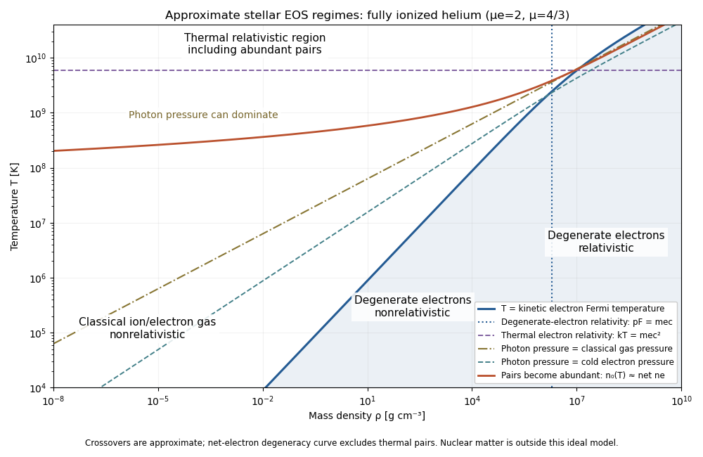

<h1 id="4/solution">Solution</h1>

↑ **Parent:** [4](../4.md)

Let $f(\mathbf p)\,d^3p$ be particle number per unit volume in a [momentum](../../../../../momentum.md) element, including the spin-state count in $f$. This is the local momentum part of a [phase-space distribution function](../../../../../phase-space-distribution-function.md), normalized by the [number density](../../../../../number-density.md) $n=\int f(\mathbf p)\,d^3p$. For an isotropic distribution with particle [energy](../../../../../energy.md) $E(p)=\sqrt{m^2c^4+p^2c^2}$, the [kinetic pressure of an isotropic gas](../../../../../kinetic-pressure-of-an-isotropic-gas.md) is the average momentum flux:

$$
P=\frac13\int \mathbf p\cdot\mathbf v\,f(\mathbf p)\,d^3p=\frac13\int\frac{p^2c^2}{E(p)}f(\mathbf p)\,d^3p.
$$

The [kinetic energy density](../../../../../kinetic-energy-density.md), explicitly excluding rest mass, is

$$
u_{\rm kin}=\int[E(p)-mc^2]f(\mathbf p)\,d^3p.
$$

For $p\ll mc$, $E-mc^2=p^2/(2m)$ and $\mathbf v=\mathbf p/m$, giving $P=2u_{\rm kin}/3$. For $p\gg mc$, $E\simeq pc$ and $v\simeq c$, giving $P\simeq u_{\rm kin}/3$. Thus

$$
\boxed{P=\frac23u_{\rm kin}\quad\text{nonrelativistically},\qquad P=\frac13u_{\rm kin}\quad\text{in the ultrarelativistic limit}.}
$$

Neither relation assumes a Maxwellian distribution. At intermediate momenta neither constant ratio is exact, and anisotropic distributions require a [pressure tensor](../../../../../pressure-tensor.md) rather than this scalar [pressure](../../../../../pressure.md).

For a classical [Maxwell-Boltzmann distribution](../../../../../maxwell-boltzmann-distribution.md), $f=n(2\pi mk_BT)^{-3/2}\exp[-p^2/(2mk_BT)]$. Three Gaussian component integrals give $\langle p^2\rangle=3mk_BT$, so the [ideal gas](../../../../../ideal-gas.md) has

$$
\boxed{P=nk_BT,\qquad u_{\rm kin}=\frac32nk_BT.}
$$

In a fully ionized mixture, sum over independent species to obtain $P_{\rm gas}=\rho k_BT/(\mu_{\rm mol}m_u)$, where the [mean molecular weight](../../../../../mean-molecular-weight.md) counts ions and free [Electrons](../../../../../electron.md). This excludes partial-ionization and interaction corrections. A dilute classical ultrarelativistic gas still has $P=nk_BT$ but $u_{\rm kin}\simeq3nk_BT$; its momentum distribution is proportional to $e^{-pc/(k_BT)}$ instead of the nonrelativistic Gaussian.

For a thermal [photon](../../../../../photon.md) gas, the two polarization states and zero [photon chemical potential](../../../../../photon-chemical-potential.md) give the [Planck photon distribution](../../../../../planck-photon-distribution.md)

$$
f_\gamma(p)=\frac{2}{(2\pi\hbar)^3}\frac1{e^{pc/(k_BT)}-1}.
$$

Use $x=pc/(k_BT)$ and $\int_0^\infty x^3/(e^x-1)\,dx=\pi^4/15$. The [radiation constant](../../../../../radiation-constant.md) and [photon](../../../../../photon.md) [equation of state](../../../../../equation-of-state.md) are therefore

$$
\boxed{u_\gamma=a_{\rm rad}T^4,\qquad P_\gamma=\frac13a_{\rm rad}T^4,\qquad a_{\rm rad}=\frac{\pi^2k_B^4}{15\hbar^3c^3}.}
$$

Likewise $n_\gamma=2\zeta(3)(k_BT/\hbar c)^3/\pi^2$. Unlike a gas with a fixed particle number, [photons](../../../../../photon.md) do not have [pressure](../../../../../pressure.md) proportional to baryonic [mass density](../../../../../density.md).

For fully degenerate [Electrons](../../../../../electron.md), the [Fermi-Dirac distribution](../../../../../fermi-dirac-distribution.md) becomes a filled momentum sphere with two spin states. Counting them gives the [Fermi momentum](../../../../../fermi-momentum.md)

$$
p_F=\hbar(3\pi^2n_e)^{1/3},\qquad n_e=\frac{\rho}{\mu_em_u}.
$$

Here $\mu_e$ is the [mean molecular weight per electron](../../../../../mean-molecular-weight-per-electron.md). The [equation of state of a cold electron gas](../../../../../equation-of-state-of-a-cold-electron-gas.md) follows by integrating momentum flux up to $p_F$:

$$
P_e=\frac1{3\pi^2\hbar^3}\int_0^{p_F}\frac{p^4c^2}{\sqrt{m_e^2c^4+p^2c^2}}\,dp.
$$

Its two limits are

$$
\boxed{P_e=\frac{\hbar^2(3\pi^2)^{2/3}}{5m_e}\left(\frac{\rho}{\mu_em_u}\right)^{5/3}\quad(p_F\ll m_ec),}
$$

$$
\boxed{P_e=\frac{\hbar c(3\pi^2)^{1/3}}4\left(\frac{\rho}{\mu_em_u}\right)^{4/3}\quad(p_F\gg m_ec).}
$$

The corresponding kinetic [energy](../../../../../energy.md) densities are $3n_e[p_F^2/(2m_e)]/5$ and $3n_ep_Fc/4$, respectively. Thus in the high-density relativistic limit the [Electron](../../../../../electron.md) [pressure](../../../../../pressure.md) scales as $\rho^{4/3}$ and is nearly independent of [temperature](../../../../../temperature.md). This is the ideal noninteracting, fixed-composition [Electron](../../../../../electron.md) result, not a universal [equation of state](../../../../../equation-of-state.md) at nuclear densities where captures, interactions and the composition change.

The boundaries on a [stellar equation-of-state regime diagram](../../../../../stellar-equation-of-state-regime-diagram.md) concern the [Electron](../../../../../electron.md) component. Define the [electron relativistic density threshold](../../../../../electron-relativistic-density-threshold.md) and [thermal electron relativistic threshold](../../../../../thermal-electron-relativistic-threshold.md) by

$$
\rho_* =\frac{\mu_em_u}{3\pi^2}\left(\frac{m_ec}{\hbar}\right)^3\simeq9.74\times10^5\mu_e\;\mathrm{g\,cm^{-3}},\qquad T_* =\frac{m_ec^2}{k_B}\simeq5.93\times10^9\;\mathrm K.
$$

A degenerate [Electron](../../../../../electron.md) gas is nonrelativistic well below $\rho_*$ and ultrarelativistic well above it: this is an approximately vertical division on a log-density plot. A nondegenerate [Electron](../../../../../electron.md) gas instead becomes thermally relativistic near $T_*$: this is an approximately horizontal division. The regimes have broad crossovers rather than a discontinuity at either line.

The exact [electron Fermi temperature](../../../../../electron-fermi-temperature.md), subtracting [Electron](../../../../../electron.md) rest [energy](../../../../../energy.md), is

$$
\boxed{T_F=\frac{m_ec^2}{k_B}\left[\sqrt{1+(\rho/\rho_*)^{2/3}}-1\right].}
$$

For [Electrons](../../../../../electron.md) with negligible thermal pairs, strong degeneracy requires $T\ll T_F$, whereas $T\gg T_F$ gives a [nondegenerate gas](../../../../../nondegenerate-gas.md). In the pair-rich regime the actual [Electron](../../../../../electron.md) and [Positron](../../../../../positron.md) distributions must instead be treated with their [chemical potentials](../../../../../chemical-potential.md), as discussed below. The two limiting degeneracy boundaries are

$$
T_F\simeq\frac{T_*}{2}(\rho/\rho_*)^{2/3}\simeq3.02\times10^5\left[\frac{\rho/(\mathrm{g\,cm^{-3}})}{\mu_e}\right]^{2/3}\mathrm K,
$$

$$
T_F\simeq T_*(\rho/\rho_*)^{1/3}\simeq5.98\times10^7\left[\frac{\rho/(\mathrm{g\,cm^{-3}})}{\mu_e}\right]^{1/3}\mathrm K.
$$

These slopes $2/3$ and $1/3$ explain the bent degeneracy boundary on the logarithmic graph. A thermal-wavelength test $n_e[2\pi\hbar^2/(m_ek_BT)]^{3/2}\sim2$ gives the same nonrelativistic density/[temperature](../../../../../temperature.md) scaling, with an order-one definition of the crossover.

The [radiation-to-gas pressure boundary](../../../../../radiation-to-gas-pressure-boundary.md) in the nondegenerate fully ionized regime is

$$
P_\gamma=P_{\rm gas}\quad\Longleftrightarrow\quad T^3=\frac{3k_B\rho}{a_{\rm rad}\mu_{\rm mol}m_u}.
$$

Radiation dominates above this line. Once [Electrons](../../../../../electron.md) are strongly degenerate, compare [radiation pressure](../../../../../radiation-pressure.md) with $P_e(\rho)$ instead of continuing the ideal-gas comparison into that regime. The [radiation-to-degeneracy pressure boundary](../../../../../radiation-to-degeneracy-pressure-boundary.md) is $T=[3P_e(\rho)/a_{\rm rad}]^{1/4}$, with logarithmic slopes $5/12$ and $1/3$ in the nonrelativistic and ultrarelativistic limits. Degeneracy of the [Electrons](../../../../../electron.md) and dominance of their [pressure](../../../../../pressure.md) are distinct criteria.

For the pair curve, distinguish baryonic net [Electrons](../../../../../electron.md) from thermally created [Electrons](../../../../../electron.md) and [Positrons](../../../../../positron.md). [Chemical equilibrium](../../../../../chemical-equilibrium.md) with [photons](../../../../../photon.md) requires opposite [Electron](../../../../../electron.md)/[Positron](../../../../../positron.md) [chemical potentials](../../../../../chemical-potential.md) when the one-particle [energy](../../../../../energy.md) includes rest [energy](../../../../../energy.md), as in the distributions below. At low [temperature](../../../../../temperature.md) and low degeneracy the zero-chemical-potential density per charge species is

$$
n_0(T)=2\left(\frac{m_ek_BT}{2\pi\hbar^2}\right)^{3/2}e^{-m_ec^2/(k_BT)}.
$$

[Charge neutrality](../../../../../charge-neutrality.md) gives $n_--n_+=n_b=\rho/(\mu_em_u)$, while the nondegenerate equilibrium product is $n_-n_+=n_0^2$. Hence

$$
\boxed{n_+=\frac{\sqrt{n_b^2+4n_0^2}-n_b}{2}.}
$$

Pairs become important when $n_0$ is comparable with or exceeds $n_b$, approximately the [electron-positron thermal pair abundance](../../../../../electron-positron-thermal-pair-abundance.md) curve $\rho_{\rm pair}(T)=\mu_em_un_0(T)$. Below its density at a fixed [temperature](../../../../../temperature.md), pairs dominate over the net charge [Electrons](../../../../../electron.md). The exponential makes the low-temperature portion steep in a log-log plot. For $\mu_e=2$, the full zero-potential integral gives approximate pair-marker densities $1.80\times10^3\,\mathrm{g\,cm^{-3}}$ at $10^9\,\mathrm K$ and $7.52\times10^5\,\mathrm{g\,cm^{-3}}$ at $3\times10^9\,\mathrm K$. At relativistic [temperature](../../../../../temperature.md) use the full zero-chemical-potential [Fermi-Dirac distribution](../../../../../fermi-dirac-distribution.md) instead; it gives $n_0\to[3\zeta(3)/(2\pi^2)](k_BT/\hbar c)^3$, so the high-temperature pair curve approaches slope three in log-density versus log-temperature. Strong net-electron degeneracy suppresses [Positrons](../../../../../positron.md) and requires the full chemical-potential-dependent distribution.

**[Figure 1](#4/image-approximate-stellar-equation-of-state-regimes-and-thermal-pair-boundary). Approximate stellar equation-of-state regimes and thermal pair boundary**.

The original diagram uses fully ionized helium, $\mu_e=2$ and $\mu_{\rm mol}=4/3$, only to set numerical locations. It plots the full $T_F$ curve and the zero-chemical-potential pair integral, rather than extending their asymptotes into the crossover. The pair boundary is deliberately an approximate abundance marker, not a phase transition; at high [temperature](../../../../../temperature.md) the nonrelativistic ion approximation and fixed-composition model also have limits. For $T\gg T_*$ with abundant nondegenerate pairs, the combined [Electron](../../../../../electron.md)/[Positron](../../../../../positron.md) [energy](../../../../../energy.md) density is $7a_{\rm rad}T^4/4$, so [photons](../../../../../photon.md) plus pairs have $u=11a_{\rm rad}T^4/4$ and $P=u/3$. Real stellar matter adds Coulomb effects, partial ionization, nuclear reactions and, at sufficiently high density, nuclear-matter physics beyond the ideal regime map.

## ↑ Ancestors (10)

1. [4](../4.md)
2. [Paper 317](../../paper-317-split.md)
3. [Iii](../../split.md)
4. [2017](../../../split.md)
5. [Past exam of the mathematics course of the University of Cambridge](../../../../split.md)
6. [Mathematics course of the University of Cambridge](../../../../../mathematics-course-of-the-university-of-cambridge.md)
7. [Course of the University of Cambridge](../../../../../course-of-the-university-of-cambridge.md)
8. [University of Cambridge](../../../../../university-of-cambridge-split.md)
9. [List of universities](../../../../../list-of-universities.md)
10. [Codex Wiki](../../../../../split.md)
