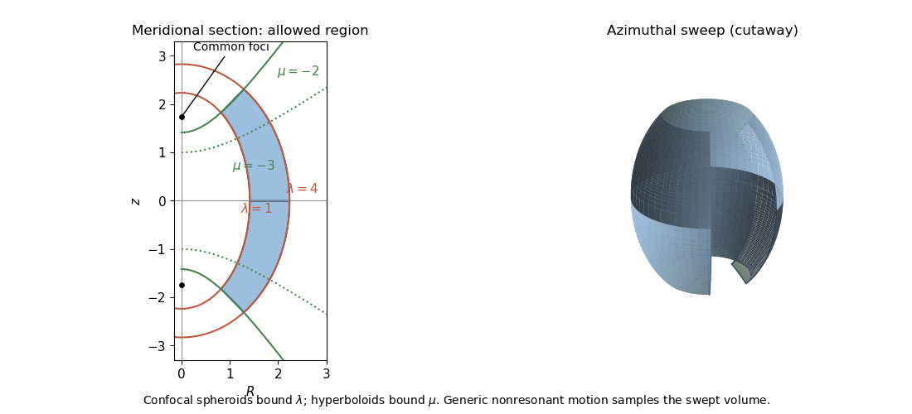

<h1 id="4/solution">Solution</h1>

↑ **Parent:** [4](../4.md)

For a regular [Lagrangian](../../../../../lagrangian.md) define the [canonical momentum](../../../../../canonical-momentum.md) components $p_j=\partial L/\partial\dot q_j$. Require the [velocity](../../../../../velocity.md) Hessian to be invertible locally so that the [velocities](../../../../../velocity.md) can be expressed in terms of $(q,p,t)$. The [Legendre transform in mechanics](../../../../../legendre-transform-in-mechanics.md) defines

$$
\boxed{H(q,p,t)=\sum_jp_j\dot q_j-L(q,\dot q,t).}
$$

The explicit [time](../../../../../time-in-physics.md) argument cannot generally be omitted when the given [Lagrangian](../../../../../lagrangian.md) depends on [time](../../../../../time-in-physics.md). Its [differential](../../../../../differential-of-a-smooth-map.md) is $dH=\sum_j\dot q_jdp_j-\sum_j(\partial L/\partial q_j)dq_j-(\partial L/\partial t)dt$, since the $d\dot q_j$ terms cancel. The [Euler-Lagrange equations](../../../../../euler-lagrange-equation.md) give $\partial L/\partial q_j=\dot p_j$, and comparison yields [Hamilton's equations](../../../../../hamilton-s-equations.md):

$$
\boxed{\dot q_j=\frac{\partial H}{\partial p_j},\qquad\dot p_j=-\frac{\partial H}{\partial q_j},\qquad\partial_tH=-\partial_tL.}
$$

For the time-independent stellar [gravitational potential](../../../../../newtonian-potential-of-a-point-mass.md) below, $H$ is conserved. Its sign convention differs from the binding [energy](../../../../../energy.md) in question 2: here $E=H=v^2/2-\psi$ is the ordinary specific orbital [energy](../../../../../energy.md).

The prescribed nondegenerate [prolate spheroidal coordinates](../../../../../prolate-spheroidal-coordinates.md) require $0<\alpha<\beta$; equality collapses the coordinate family. Their physical [velocity](../../../../../velocity.md) components are $v_j=h_j\dot q_j$, and $h_\phi=R$. Per unit stellar [mass](../../../../../mass.md) the [Lagrangian](../../../../../lagrangian.md) is $L=\tfrac12\sum_jh_j^2\dot q_j^2+\psi$, so $p_j=h_j^2\dot q_j=h_jv_j$. Its [Hamiltonian](../../../../../hamiltonian.md) is

$$
\boxed{H=\frac12\left(\frac{p_\lambda^2}{h_\lambda^2}+\frac{p_\mu^2}{h_\mu^2}+\frac{p_\phi^2}{h_\phi^2}\right)-\psi.}
$$

This uses [acceleration](../../../../../acceleration.md) $+\nabla\psi$, as specified, rather than importing the opposite [gravitational potential](../../../../../newtonian-potential-of-a-point-mass.md) convention.

For the [Stäckel potential](../../../../../stackel-potential.md), use the [Hamilton-Jacobi equation](../../../../../hamilton-jacobi-equation.md) with principal function $S=W_\lambda(\lambda)+W_\mu(\mu)+l\phi-Et$. Axisymmetry makes $p_\phi=l=Rv_\phi$ constant. Write $d=\lambda-\mu$ and $A(\tau)=(\tau+\alpha)(\tau+\beta)$. Multiplying $H=E$ by $d$ and using

$$
\frac{d}{(\lambda+\alpha)(\mu+\alpha)}=\frac1{\mu+\alpha}-\frac1{\lambda+\alpha}
$$

separates it as $F(\lambda)-E\lambda=F(\mu)-E\mu$, where $F(\tau)=2A(\tau)(W_\tau')^2-(\alpha-\beta)l^2/[2(\tau+\alpha)]-G(\tau)$. Each side depends on its own coordinate only and therefore equals a constant, chosen as $-I$. Here $G(\tau)$ is the generating function of the [gravitational potential](../../../../../newtonian-potential-of-a-point-mass.md), not the gravitational constant. Hence

$$
2(\tau+\alpha)(\tau+\beta)p_\tau^2-\frac{(\alpha-\beta)l^2}{2(\tau+\alpha)}-G(\tau)-E\tau=-I,\qquad\tau=\lambda,\mu.
$$

This proves the conserved [axisymmetric Stäckel third integral](../../../../../axisymmetric-stackel-third-integral.md). Eliminating $E$ between the two expressions and using $p_j=h_jv_j$ gives

$$
\boxed{I=\frac12\left[\mu v_\lambda^2+\lambda v_\mu^2+(\lambda+\mu+\alpha)v_\phi^2\right]-\frac{\mu G(\lambda)-\lambda G(\mu)}{\lambda-\mu}.}
$$

At regular generic phase-space points the three separation constants $E,l,I$ are independent; special circular or degenerate [orbits](../../../../../orbit-dynamical-system.md) can reduce their local independence. Thus the model is an [integrable Hamiltonian system](../../../../../integrable-hamiltonian-system.md).

For the intended regular, phase-mixed steady model, [Jeans theorem](../../../../../jeans-theorem.md) permits a [galactic distribution function](../../../../../galactic-distribution-function.md) $f=F(E,l,I)$. At any fixed point, $E$ and $I$ depend on $v_\lambda$ and $v_\mu$ only through their squares, and $l$ depends only on $v_\phi$. Thus $f$ is even separately in $v_\lambda$ and $v_\mu$, whether or not it is even in $v_\phi$. Odd [integration](../../../../../integral.md) proves [velocity-ellipsoid alignment in a Stäckel potential](../../../../../velocity-ellipsoid-alignment-in-a-stackel-potential.md):

$$
\boxed{\langle v_\lambda v_\mu\rangle=\langle v_\lambda v_\phi\rangle=\langle v_\mu v_\phi\rangle=0.}
$$

The argument allows azimuthal streaming: it does not require zero mean $v_\phi$. The means in the two meridional directions vanish, so the off-diagonal [velocity](../../../../../velocity.md) [covariance](../../../../../covariance.md) also vanishes. [Second moments](../../../../../second-moment.md) must exist for this conclusion.

There is a hypothesis behind the printed universal wording. On a generic nonresonant regular [invariant torus](../../../../../invariant-torus.md), a continuous steady distribution is constant along a dense [orbit](../../../../../orbit-dynamical-system.md) and hence depends only on the torus [integrals](../../../../../integral.md); this justifies the phase-mixed form. Bare stationarity alone is not sufficient in a degenerate resonant [gravitational potential](../../../../../newtonian-potential-of-a-point-mass.md) with additional [integrals](../../../../../integral.md). For example $H=\tfrac12(v^2+\omega^2r^2)$ is a Stäckel [Hamiltonian](../../../../../hamiltonian.md): choose $G(\tau)=-\tfrac12\omega^2[\tau^2+(\alpha+\beta)\tau]$, up to a constant vacuum shift. The additional conserved quantity $K_{xy}=v_xv_y+\omega^2xy$ gives a positive normalizable steady tracer $f\propto\exp(-aH+\epsilon K_{xy})$ for $a>|\epsilon|>0$. Its local $\langle v_xv_y\rangle=\epsilon/(a^2-\epsilon^2)\ne0$. At azimuth zero and a regular point where the $\lambda$ direction has a radial component, this gives nonzero $\langle v_\lambda v_\phi\rangle$. This tracer need not itself source the harmonic [gravitational potential](../../../../../newtonian-potential-of-a-point-mass.md). It exhibits why the stronger, ordinary phase-mixed three-integral assumption is necessary instead of claiming that every imaginable steady distribution has the asserted alignment.

The geometry follows by multiplying the coordinate-defining equation and evaluating at $\tau=-\alpha,-\beta$:

$$
R^2=\frac{(\lambda+\alpha)(\mu+\alpha)}{\alpha-\beta},\qquad z^2=\frac{(\lambda+\beta)(\mu+\beta)}{\beta-\alpha}.
$$

Constant $\lambda$ surfaces are [prolate spheroids](../../../../../prolate-spheroid.md), with equatorial semiaxis $\sqrt{\lambda+\alpha}$ and polar semiaxis $\sqrt{\lambda+\beta}$. Constant interior $\mu$ surfaces are two-sheeted hyperboloids. Their common foci lie at $z=\pm\sqrt{\beta-\alpha}$. The [orbit volume in an axisymmetric Stäckel potential](../../../../../orbit-volume-in-an-axisymmetric-stackel-potential.md) is determined by

$$
p_\tau^2=\frac{E\tau+G(\tau)-I+(\alpha-\beta)l^2/[2(\tau+\alpha)]}{2(\tau+\alpha)(\tau+\beta)}\geq0.
$$

Its allowed coordinate intervals have turning boundaries or coordinate endpoints. A typical bound [orbit](../../../../../orbit-dynamical-system.md) with $l\ne0$ oscillates between inner and outer spheroids, oscillates vertically between hyperboloidal limits, and circulates about the symmetry axis with $\dot\phi=l/R^2$. The equatorial fold $\mu=-\beta$ joins the positive and negative $z$ branches; it is not necessarily a physical turning point in $z$.

**[Figure 1](#4/image-geometric-volume-swept-out-by-an-orbit). Geometric volume swept out by an orbit**. Original schematic coordinate-bounded [orbit](../../../../../orbit-dynamical-system.md) [volume](../../../../../volume.md). The meridional section and cutaway azimuthal sweep show inner/outer confocal spheroids and upper/lower hyperboloidal boundaries. Illustrative intervals are $1\leq\lambda\leq4$, $-4\leq\mu\leq-2$ with $\alpha=1$, $\beta=4$. These are geometric examples, not a numerically integrated [orbit](../../../../../orbit-dynamical-system.md) in a specified [gravitational potential](../../../../../newtonian-potential-of-a-point-mass.md).

For three incommensurate frequencies, the regular trajectory densely samples its projected allowed [volume](../../../../../volume.md), with nonuniform occupation determined by its speeds. It does not follow one coordinate surface, and it need not close. Resonant [orbits](../../../../../orbit-dynamical-system.md) may be closed or lie in a smaller projected set; $l=0$ confines azimuthal motion to a meridional [plane](../../../../../plane.md) (with the usual axis coordinate qualification), and circular or equatorial limits are also lower-dimensional. Smooth Stäckel separation removes the generic chaotic behavior of nonintegrable potentials; it does not assert that every [orbit](../../../../../orbit-dynamical-system.md) fills a three-dimensional [volume](../../../../../volume.md).

## ↑ Ancestors (10)

1. [4](../4.md)
2. [Paper 320](../../paper-320-split.md)
3. [Iii](../../split.md)
4. [2017](../../../split.md)
5. [Past exam of the mathematics course of the University of Cambridge](../../../../split.md)
6. [Mathematics course of the University of Cambridge](../../../../../mathematics-course-of-the-university-of-cambridge.md)
7. [Course of the University of Cambridge](../../../../../course-of-the-university-of-cambridge.md)
8. [University of Cambridge](../../../../../university-of-cambridge-split.md)
9. [List of universities](../../../../../list-of-universities.md)
10. [Codex Wiki](../../../../../split.md)
