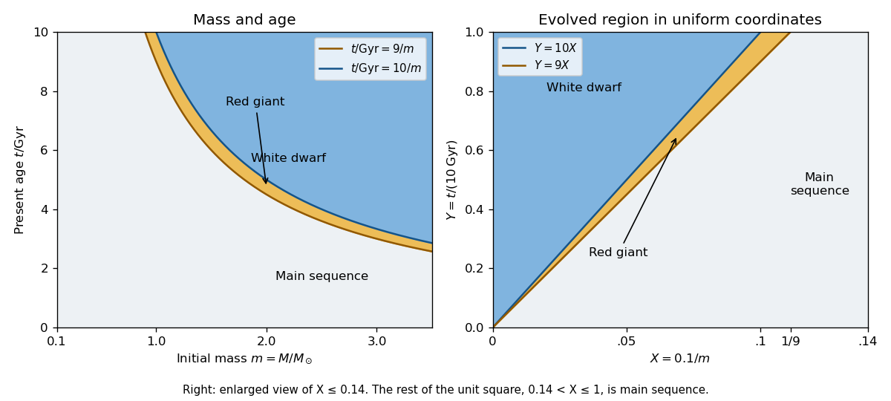

# Paper 322

↑ **Parent:** [Iii](../iii.md)

[https://www.maths.cam.ac.uk/postgrad/part-iii/files/pastpapers/2017/paper_322.pdf](https://www.maths.cam.ac.uk/postgrad/part-iii/files/pastpapers/2017/paper_322.pdf)

**Table of contents**

- [1](#1)
  - [i](#1/i)
    - [Solution](#1/i/solution)
  - [ii](#1/ii)
    - [Solution](#1/ii/solution)
  - [iii](#1/iii)
    - [Solution](#1/iii/solution)
- [2](#2)
  - [Solution](#2/solution)
- [3](#3)
  - [Solution](#3/solution)

## 1

↑ **Parent:** [Paper 322](paper-322.md)

<h3 id="1/i">i</h3>

↑ **Parent:** [1](#1)

<h4 id="1/i/solution">Solution</h4>

↑ **Parent:** [I](#1/i)

For this [stellar population](../../../stellar-astrophysics.md#stellar-population), let $m=M/M_\odot$ denote initial [mass](../../../classical-mechanics.md#mass) in units of the [solar mass](../../../stellar-astrophysics.md#solar-mass), and let $\tau=t/\mathrm{Gyr}$ denote present [stellar age](../../../stellar-astrophysics.md#stellar-age). Constant formation of equal numbers of [stars](../../../stellar-astrophysics.md#star) per unit time makes the [stellar age](../../../stellar-astrophysics.md#stellar-age) a [uniform distribution](../../../continuous-probability-distribution.md#continuous-uniform-distribution) on $[0,10]$ Gyr, so $Y=\tau/10$ is uniform on $[0,1]$. The normalized [initial mass function](../../../stellar-astrophysics.md#initial-mass-function) has [probability density function](../../../continuous-probability-distribution.md#probability-density-function) $f(m)=0.1m^{-2}$ for $m>0.1$, since $\int_{0.1}^\infty m^{-2}dm=10$. Consequently

$$
\boxed{Y(t)=\frac{t}{10\,\mathrm{Gyr}},\qquad X(M)=\frac{\int_m^\infty u^{-2}du}{\int_{0.1}^\infty u^{-2}du}=\frac{0.1}{m}.}
$$

These formulae have the stated age and mass domains; outside them the relevant cumulative fractions saturate at zero or one. The [probability integral transform](../../../probability-theory.md#probability-integral-transform) makes $X$ uniform on $[0,1]$: $m=0.1/X$ gives $f(m)|dm/dX|=1$. The time-independent [initial mass function](../../../stellar-astrophysics.md#initial-mass-function) and constant number formation rate give [independence](../../../random-variable.md#independent-random-variables) of $X$ and $Y$. All fractions here count objects, including [white dwarfs](../../../stellar-astrophysics.md#white-dwarf), using the stipulated [stellar evolution](../../../stellar-astrophysics.md#stellar-evolution) law.

A [red giant](../../../stellar-astrophysics.md#red-giant) has

$$
\frac9m<\tau<\frac{10}m,\qquad 0\leq\tau\leq10.
$$

Thus the [mass](../../../classical-mechanics.md#mass) boundaries are $m=9/\tau$ and $m=10/\tau$ for positive $\tau$. Equivalently, for $0.9<m<1$ the [red giant](../../../stellar-astrophysics.md#red-giant) region runs from $9/m$ to the age cap $10$, and for $m\geq1$ it runs from $9/m$ to $10/m$. There are no [red giants](../../../stellar-astrophysics.md#red-giant) with $m\leq0.9$. Boundaries have zero [probability](../../../probability-theory.md#probability) and their endpoint convention does not affect the fractions. In the uniform $(X,Y)$ square the [red giant](../../../stellar-astrophysics.md#red-giant) region is $9X<Y<10X$, with [triangle](../../../geometry-and-topology.md#triangle) vertices $(0,0)$, $(1/10,1)$ and $(1/9,1)$. The [white dwarf](../../../stellar-astrophysics.md#white-dwarf) region is the [triangle](../../../geometry-and-topology.md#triangle) $0<X<Y/10$.

**[Figure 1](#1/i/image-mass-age-regions-and-their-uniform-coordinate-images). Mass-age regions and their uniform-coordinate images**. The right panel magnifies the evolved part of the unit square. All of the remaining region at larger X is main sequence.

At fixed $Y=y$, define the conditional [probabilities](../../../probability-theory.md#probability) of a [red giant](../../../stellar-astrophysics.md#red-giant), [white dwarf](../../../stellar-astrophysics.md#white-dwarf) and [main sequence](../../../stellar-astrophysics.md#main-sequence) star by $g(y)$, $w(y)$ and $s(y)$. Their interval widths are

$$
g(y)=\frac{y}{90},\qquad w(y)=\frac{y}{10}=9g(y),\qquad s(y)=1-\frac y9.
$$

[Integration](../../../calculus.md#integral) over the [uniform distribution](../../../continuous-probability-distribution.md#continuous-uniform-distribution) of age gives the individual-star fractions

$$
\boxed{p_G=\int_0^1g(y)dy=\frac1{180},\qquad p_W=\int_0^1w(y)dy=\frac1{20}.}
$$

The systems form a [coeval binary population](../../../stellar-astrophysics.md#coeval-binary-population): the two [binary star](../../../stellar-astrophysics.md#binary-star) components have the same age. Their masses are independent, so $(X_1,X_2,Y)$ has uniform [probability density function](../../../continuous-probability-distribution.md#probability-density-function) on $[0,1]^3$ and their states have [conditional independence](../../../random-variable.md#conditional-independence) given $Y$. Unconditional independence of their states would be incorrect: older systems make both evolved states more likely. The [law of total probability](../../../probability-theory.md#law-of-total-probability) now gives

$$
\boxed{p_{\geq1G}=\int_0^1\bigl[1-(1-g(y))^2\bigr]dy=\frac1{90}-\frac1{24300}=\frac{269}{24300}.}
$$

The subtraction removes the double counting of systems containing two [red giants](../../../stellar-astrophysics.md#red-giant).

<h3 id="1/ii">ii</h3>

↑ **Parent:** [1](#1)

<h4 id="1/ii/solution">Solution</h4>

↑ **Parent:** [Ii](#1/ii)

Use [conditional independence](../../../random-variable.md#conditional-independence) at the common age $Y=y$. A system with a [red giant](../../../stellar-astrophysics.md#red-giant) and a second evolved component is either a pair of [red giants](../../../stellar-astrophysics.md#red-giant), with [conditional probability](../../../probability-theory.md#conditional-probability) $g(y)^2$, or a [red giant](../../../stellar-astrophysics.md#red-giant) and a [white dwarf](../../../stellar-astrophysics.md#white-dwarf), with [conditional probability](../../../probability-theory.md#conditional-probability) $2g(y)w(y)$. The factor two counts which component is the [white dwarf](../../../stellar-astrophysics.md#white-dwarf); a pair of [red giants](../../../stellar-astrophysics.md#red-giant) is counted only once. Since $w=9g$, the unconditional [probability](../../../probability-theory.md#probability) of this event is

$$
p_{G+\mathrm{evolved}}=\int_0^1(g^2+2gw)dy=19\int_0^1\frac{y^2}{8100}dy=\frac{19}{24300}.
$$

This event is contained in the event of at least one [red giant](../../../stellar-astrophysics.md#red-giant). Therefore the requested [conditional probability](../../../probability-theory.md#conditional-probability), among systems selected for containing a [red giant](../../../stellar-astrophysics.md#red-giant), is

$$
\boxed{\frac{p_{G+\mathrm{evolved}}}{p_{\geq1G}}=\frac{19}{269}\simeq0.07063.}
$$

In particular the denominator is a fraction of systems, not the individual-star fraction $1/180$.

<h3 id="1/iii">iii</h3>

↑ **Parent:** [1](#1)

<h4 id="1/iii/solution">Solution</h4>

↑ **Parent:** [Iii](#1/iii)

The common-age [conditional probabilities](../../../probability-theory.md#conditional-probability) give

$$
p_{GG}=\int_0^1g^2dy=\frac1{24300},\qquad p_{GW}=\int_0^1 2gw\,dy=\frac{18}{24300},\qquad p_{WW}=\int_0^1 w^2dy=\frac{81}{24300}.
$$

Here $GW$ includes both possible component orders. Hence the [binary star](../../../stellar-astrophysics.md#binary-star) fractions have the concise ratio

$$
\boxed{GG:GW:WW=1:18:81.}
$$

As a check on the role of shared age, $p_{GG}=4p_G^2/3$ rather than $p_G^2$. This is [covariance induced by a shared latent variable](../../../random-variable.md#covariance-induced-by-a-shared-latent-variable): the [red giant](../../../stellar-astrophysics.md#red-giant) [indicator random variables](../../../probability-theory.md#indicator-random-variable) have [covariance](../../../variance.md#covariance) equal to the [variance](../../../variance.md) of $g(Y)$, namely $1/97200$.

For a [starburst galaxy](../../../galaxy.md#starburst-galaxy) with age $t$, put $y_b=t/(10\,\mathrm{Gyr})$. There is no age averaging. The component masses remain independent, so the fraction of systems with two [red giants](../../../stellar-astrophysics.md#red-giant) is

$$
\boxed{p_{GG}^{\rm burst}=g(y_b)^2=\frac{(t/\mathrm{Gyr})^2}{810000},\qquad 0<t<10\,\mathrm{Gyr}.}
$$

The last comparison is ambiguous in the printed question. Literally, the fraction of individual [red giants](../../../stellar-astrophysics.md#red-giant) in the first [galaxy](../../../galaxy.md) is $1/180$. Since $p_{GG}^{\rm burst}<1/8100<1/180$, **no allowed starburst age satisfies that literal comparison**. If the intended comparison is instead between systems containing two [red giants](../../../stellar-astrophysics.md#red-giant) in the two [galaxies](../../../galaxy.md), compare with $p_{GG}=1/24300$; the answer is

$$
\boxed{\frac{10}{\sqrt3}\,\mathrm{Gyr}<t<10\,\mathrm{Gyr}\quad\text{for the two-giant-system comparison}.}
$$

For completeness, the individual [red giant](../../../stellar-astrophysics.md#red-giant) fraction in the burst is $g(y_b)=t/(900\,\mathrm{Gyr})$, which exceeds $1/180$ precisely for $5\,\mathrm{Gyr}<t<10\,\mathrm{Gyr}$. This is a third, different comparison; it does not change the computed fraction of two-giant systems.

## 2

↑ **Parent:** [Paper 322](paper-322.md)

<h3 id="2/solution">Solution</h3>

↑ **Parent:** [2](#2)

For [Roche-lobe overflow](../../../stellar-astrophysics.md#roche-lobe-overflow) in the stipulated [stellar thermal equilibrium](../../../stellar-structure.md#stellar-thermal-equilibrium), $R_2=R_L$. Using the [mass-radius relation](../../../exoplanet.md#mass-radius-relation) and [Kepler's third law](../../../physics.md#kepler-s-third-law),

$$
a^3=\frac{R_\odot^3}{0.46^3}\frac{M M_2^2}{M_\odot^3},\qquad P^2=\frac{4\pi^2a^3}{GM}.
$$

The total [mass](../../../classical-mechanics.md#mass) cancels, giving

$$
\boxed{\frac{P}{P_0}=\frac{M_2}{M_\odot},\qquad P_0=2\pi\sqrt{\frac{R_\odot^3}{0.46^3GM_\odot}}\simeq8.91\ \mathrm{h}.}
$$

Here $R_\odot$ is the [solar radius](../../../stellar-astrophysics.md#solar-radius). This is the [Roche-lobe-filling period-density relation](../../../stellar-astrophysics.md#roche-lobe-filling-period-density-relation) specialized to $R_2\propto M_2$.

Neglecting spin, the [angular momentum](../../../classical-mechanics.md#angular-momentum) of a [circular orbit](../../../classical-mechanics.md#circular-orbit) is $J=M_1M_2\sqrt{Ga/M}$. Between [classical novae](../../../stellar-astrophysics.md#classical-nova) the transfer conserves total [mass](../../../classical-mechanics.md#mass), so $\dot M=0$ and $\dot M_1=-\dot M_2$. Its logarithmic derivative gives

$$
\frac{\dot J}{J}=(1-q)\frac{\dot M_2}{M_2}+\frac12\frac{\dot a}{a},\qquad
\frac{\dot R_L}{R_L}=2\frac{\dot J}{J}+\left(2q-\frac53\right)\frac{\dot M_2}{M_2}.
$$

In particular, for [conservation of angular momentum](../../../classical-mechanics.md#conservation-of-angular-momentum),

$$
\boxed{\frac{\dot R_L}{R_L}=\left(2q-\frac53\right)\frac{\dot M_2}{M_2},\qquad \frac{\dot R_2}{R_2}=\frac{\dot M_2}{M_2}.}
$$

The source PDF has $\dot J=0$ here; the TeX's $J=0$ is a transcription defect. For $q>4/3$, the [Roche-lobe radius response exponent](../../../stellar-astrophysics.md#roche-lobe-radius-response-exponent) exceeds the equilibrium [stellar radius response exponent](../../../stellar-astrophysics.md#stellar-radius-response-exponent) $1$. Since $\dot M_2<0$, the [Roche lobe](../../../stellar-astrophysics.md#roche-lobe) then shrinks faster than the [donor star](../../../stellar-astrophysics.md#donor-star); the overfill increases and drives more transfer, giving positive feedback. Equality at $q=4/3$ is marginal in this linear response test.

Two qualifications matter. First, $q>4/3$ is a formal extrapolation outside the stated $q<1$ range, and the supplied [Roche lobe](../../../stellar-astrophysics.md#roche-lobe) approximation need not remain accurate there. Second, true [dynamical stability of binary mass transfer](../../../stellar-astrophysics.md#dynamical-stability-of-binary-mass-transfer) compares $\zeta_L$ with the adiabatic [stellar radius response exponent](../../../stellar-astrophysics.md#stellar-radius-response-exponent) $\zeta_{\rm ad}$, not $\zeta_{\rm eq}=1$. The [stellar thermal equilibrium](../../../stellar-structure.md#stellar-thermal-equilibrium) argument supplies the displayed feedback threshold under the imposed radius law, rather than a necessary and sufficient physical dynamical threshold. For example, the [polytropic mass-radius relation](../../../stellar-structure.md#polytropic-mass-radius-relation) for a fully convective [adiabatic stellar polytrope](../../../stellar-structure.md#adiabatic-stellar-polytrope) with index $3/2$ gives $\zeta_{\rm ad}=-1/3$; within this same [Roche lobe](../../../stellar-astrophysics.md#roche-lobe) approximation its dynamical threshold is $q=2/3$. Thus $q<4/3$ by itself does not guarantee dynamical stability.

[Gravitational-wave emission from a binary system](../../../stellar-astrophysics.md#gravitational-wave-emission-from-a-binary-system) removes orbital [energy](../../../classical-mechanics.md#energy) and [angular momentum](../../../classical-mechanics.md#angular-momentum). [Magnetic braking of a binary star](../../../stellar-astrophysics.md#magnetic-braking-of-a-binary-star) provides another important loss: a magnetized [stellar wind](../../../stellar-astrophysics.md#stellar-wind) carries away donor spin, while [tidal locking](../../../planetary-science.md#tidal-locking) couples that spin to the orbit. Tides alone redistribute [angular momentum](../../../classical-mechanics.md#angular-momentum) and are not an external sink. Matter expelled from the system can also carry orbital [angular momentum](../../../classical-mechanics.md#angular-momentum), although appreciable continuous mass loss would require nonconservative modifications of the preceding equations. Setting $\dot R_L/R_L=\dot R_2/R_2$ gives the [binary mass-transfer contact equation](../../../stellar-astrophysics.md#binary-mass-transfer-contact-equation)

$$
\boxed{\frac{\dot M_2}{M_2}=\frac{3\dot J}{J(4-3q)}.}
$$

For $q<4/3$, a negative external $\dot J$ therefore sustains negative $\dot M_2$ along the stipulated [stellar thermal equilibrium](../../../stellar-structure.md#stellar-thermal-equilibrium) contact sequence, provided the system is otherwise stable and can remain thermally relaxed.

During the [classical nova](../../../stellar-astrophysics.md#classical-nova), the ejecta carry the [white dwarf](../../../stellar-astrophysics.md#white-dwarf)'s [specific angular momentum](../../../classical-mechanics.md#specific-angular-momentum), not zero [angular momentum](../../../classical-mechanics.md#angular-momentum). With $\Omega^2=GM/a^3$ and the accretor's distance from the [centre of mass](../../../classical-mechanics.md#center-of-mass) $a_1=aM_2/M$, isotropic escape gives

$$
j_1=a_1^2\Omega,\qquad \frac{j_1}{J}=\frac{M_2}{M_1M}=\frac qM,\qquad \frac{\delta J}{J}=-\frac{q\delta m}{M}.
$$

The slow ejection relative to the [orbital period](../../../classical-mechanics.md#orbital-period) permits the adiabatic [circular orbit](../../../classical-mechanics.md#circular-orbit) approximation; the [donor star](../../../stellar-astrophysics.md#donor-star) does not transfer appreciable additional mass during it. Take $\delta M_1=-\delta m$, $\delta M_2=0$ and $\delta M=-\delta m$. Differentiating $J=M_1M_2\sqrt{Ga/M}$ gives

$$
-\frac{q\delta m}{M}=-\frac{\delta m}{M_1}+\frac12\frac{\delta a}{a}+\frac{\delta m}{2M}.
$$

Since $M/M_1=1+q$, this yields

$$
\boxed{\frac{\delta a}{a}=\frac{\delta m}{M},\qquad \frac{\delta R_L}{R_L}=\frac{\delta a}{a}+\frac13\left(\frac{\delta M_2}{M_2}-\frac{\delta M}{M}\right)=\frac{4\delta m}{3M}.}
$$

These are first-order formulae with errors of order $(\delta m/M)^2$. The orbital widening agrees with [Jeans-mode mass loss](../../../stellar-astrophysics.md#jeans-mode-mass-loss). The [donor star](../../../stellar-astrophysics.md#donor-star)'s radius is unchanged to this order by the assumed ejection, so its [Roche lobe](../../../stellar-astrophysics.md#roche-lobe) expands away from it, causing [nova-induced binary detachment](../../../stellar-astrophysics.md#nova-induced-binary-detachment). This idealization neglects changes in the donor from irradiation or interaction with ejecta; those are not supplied in the model.

Let $\Gamma=-\dot J>0$ be the fixed external loss rate. During the [detached binary](../../../stellar-astrophysics.md#detached-binary) phase both component masses are fixed, and $\dot R_L/R_L=2\dot J/J=-2\Gamma/J$. Closing the fractional gap $4\delta m/(3M)$ takes

$$
t_d=\frac{2J\delta m}{3M\Gamma}.
$$

In the subsequent [semidetached binary](../../../stellar-astrophysics.md#semidetached-binary), the [binary mass-transfer contact equation](../../../stellar-astrophysics.md#binary-mass-transfer-contact-equation) gives $-\dot M_2=3M_2\Gamma/[J(4-3q)]$. Accumulating a fresh layer of [mass](../../../classical-mechanics.md#mass) $\delta m$ therefore takes

$$
t_s=\frac{J(4-3q)\delta m}{3M_2\Gamma},\qquad
\boxed{\frac{t_d}{t_s}=\frac{2M_2}{M(4-3q)}=\frac{2q}{(1+q)(4-3q)}.}
$$

Throughout these first-order estimates $J,M,q$ can be evaluated at the start of the cycle: their fractional changes during it are of order $\delta m/M$. The limit $\Gamma=0$ is excluded, since no finite reconnection time follows without an external shrinkage mechanism.

## 3

↑ **Parent:** [Paper 322](paper-322.md)

<h3 id="3/solution">Solution</h3>

↑ **Parent:** [3](#3)

Set $\mathbf r=\mathbf x_1-\mathbf x_2$, $M=M_1+M_2$ and $\mu=M_1M_2/M$, the [reduced mass](../../../classical-mechanics.md#reduced-mass). [Newton's law of universal gravitation](../../../classical-mechanics.md#newton-s-law-of-universal-gravitation) gives $\ddot{\mathbf x}_1=-GM_2\mathbf r/r^3$ and $\ddot{\mathbf x}_2=GM_1\mathbf r/r^3$. Subtraction establishes

$$
\boxed{\ddot{\mathbf r}=-\frac{GM}{r^3}\mathbf r.}
$$

For fixed masses, the orbital [energy](../../../classical-mechanics.md#energy) and [angular momentum](../../../classical-mechanics.md#angular-momentum) are

$$
E=\frac{\mu}{2}\mathbf v^2-\frac{GM\mu}{r},\qquad \mathbf J=\mu\mathbf r\times\mathbf v,\qquad \mathbf v=\dot{\mathbf r}.
$$

Taking derivatives gives $\dot E=\mu\mathbf v\cdot(\ddot{\mathbf r}+GM\mathbf r/r^3)=0$ and $\dot{\mathbf J}=\mu\mathbf r\times\ddot{\mathbf r}=0$. These are [conservation of energy](../../../physics.md#conservation-of-energy) and [conservation of angular momentum](../../../classical-mechanics.md#conservation-of-angular-momentum) in the unperturbed [Kepler orbit](../../../classical-mechanics.md#kepler-orbit). To see directly that the [orbital eccentricity](../../../classical-mechanics.md#orbital-eccentricity) is fixed, put $\mathbf h=\mathbf r\times\mathbf v$ and $\mathbf n=\mathbf r/r$. The [eccentricity vector](../../../classical-mechanics.md#eccentricity-vector) is

$$
\mathbf e=\frac{\mathbf v\times\mathbf h}{GM}-\mathbf n.
$$

Since $\dot{\mathbf h}=0$, the [cross product](../../../vector-space.md#cross-product) identity $\mathbf r\times(\mathbf r\times\mathbf v)=\mathbf r(\mathbf r\cdot\mathbf v)-r^2\mathbf v$ gives $\ddot{\mathbf r}\times\mathbf h=GM\dot{\mathbf n}$, so $\dot{\mathbf e}=0$. Its magnitude $e$ is the [orbital eccentricity](../../../classical-mechanics.md#orbital-eccentricity). Equivalently,

$$
\boxed{e^2=1+\frac{2EJ^2}{G^2M^2\mu^3},\qquad E=-\frac{GM\mu}{2a}.}
$$

Thus the [semi-major axis](../../../classical-mechanics.md#semi-major-axis) and [orbital eccentricity](../../../classical-mechanics.md#orbital-eccentricity) of a bound noncollision [Kepler orbit](../../../classical-mechanics.md#kepler-orbit) are constant, including $e=0$.

Take the [centre of mass](../../../classical-mechanics.md#center-of-mass) as origin. The two positions are $\mathbf x_1=(M_2/M)\mathbf r$ and $\mathbf x_2=-(M_1/M)\mathbf r$. For $x\gg r$, a [Taylor expansion](../../../calculus.md#taylor-expansion) gives

$$
\frac1{|\mathbf x-\mathbf b|}=\frac1x+\frac{\mathbf x\cdot\mathbf b}{x^3}+\frac{3(\mathbf x\cdot\mathbf b)^2-x^2b^2}{2x^5}+O\left(\frac{b^3}{x^4}\right).
$$

The mass dipole vanishes because $\sum_A M_A\mathbf x_A=0$, and the [second mass moment tensor](../../../general-relativity.md#second-mass-moment-tensor) is $\sum_A M_Ax_{Ai}x_{Aj}=\mu r_i r_j$. The [gravitational quadrupole potential of a point-mass binary](../../../classical-mechanics.md#gravitational-quadrupole-potential-of-a-point-mass-binary) is consequently

$$
\Phi(\mathbf x)=-\frac{GM}{x}-\frac{G\mu}{2x^5}\bigl[3(\mathbf x\cdot\mathbf r)^2-x^2r^2\bigr]+O\left(\frac{GMr^3}{x^4}\right).
$$

Both printed tensors are trace-free. Contracting them with the [Kronecker delta](../../../linear-algebra.md#kronecker-delta) summed over three spatial dimensions gives

$$
q_{ij}l_{ij}=\frac{\mu}{2x^5}\bigl[3(\mathbf x\cdot\mathbf r)^2-x^2r^2\bigr].
$$

This proves the requested expression through second order. In particular the printed convention is $q_{ij}=\tfrac32 Q_{ij}$, where $Q_{ij}=\mu(r_ir_j-r^2\delta_{ij}/3)$ is the standard [mass quadrupole moment](../../../general-relativity.md#mass-quadrupole-moment); the radiation coefficient must be adjusted accordingly. No mass dipole term may be retained in [centre of mass](../../../classical-mechanics.md#center-of-mass) coordinates.

To evaluate the [quadrupole formula](../../../general-relativity.md#quadrupole-formula) without assuming a [circular orbit](../../../classical-mechanics.md#circular-orbit), put $k=GM$, $u=\dot r=\mathbf n\cdot\mathbf v$ and $\mathbf v_\perp=\mathbf v-u\mathbf n$. Differentiating the [gravitational acceleration](../../../classical-mechanics.md#gravitational-acceleration) gives the [kinematic jerk](../../../classical-mechanics.md#jerk-kinematics)

$$
\dddot{\mathbf r}=-\frac{k}{r^3}(\mathbf v-3u\mathbf n).
$$

For $S_{ij}=r_ir_j$, the product rule then gives

$$
\dddot S_{ij}=\frac{k}{r^2}\bigl[-4(n_iv_j+v_in_j)+6u n_i n_j\bigr],\qquad \frac{d^3r^2}{dt^3}=-\frac{2ku}{r^2}.
$$

Inserting these into the printed [mass quadrupole moment](../../../general-relativity.md#mass-quadrupole-moment) convention yields

$$
\dddot q_{ij}=\frac{\mu k}{r^2}\bigl[u(\delta_{ij}-3n_in_j)-6(n_iv_{\perp j}+v_{\perp i}n_j)\bigr].
$$

The two tensors in brackets are orthogonal in their [tensor contraction](../../../linear-algebra.md#tensor-contraction), because $\mathbf n\cdot\mathbf v_\perp=0$. Their squared norms are $6$ and $2v_\perp^2$, respectively. Hence

$$
\dddot q_{ij}\dddot q_{ij}=\frac{\mu^2k^2}{r^4}(6u^2+72v_\perp^2)=\frac{72\mu^2k^2}{r^4}\left(\mathbf v^2-\frac{11}{12}u^2\right).
$$

The [instantaneous quadrupole luminosity of a Kepler binary](../../../general-relativity.md#instantaneous-quadrupole-luminosity-of-a-kepler-binary) is therefore

$$
\boxed{\dot E=-\frac{32G^3M^2\mu^2}{5c^5r^4}\left(\dot{\mathbf r}\cdot\dot{\mathbf r}-\frac{11}{12}\dot r^2\right).}
$$

The radial derivative $\dot r$ is not the vector speed. The bracket equals $v_\perp^2+u^2/12$, so the radiated [luminosity](../../../astrophysics.md#luminosity) is nonnegative for every instantaneous velocity.

For a slowly evolving [circular orbit](../../../classical-mechanics.md#circular-orbit), there is no preferred orbital phase at which to excite a persistent [eccentricity vector](../../../classical-mechanics.md#eccentricity-vector). More precisely, the rotating [mass quadrupole moment](../../../general-relativity.md#mass-quadrupole-moment) emits at twice the orbital frequency, with angular harmonic number two; its [gravitational-wave energy and angular-momentum balance](../../../general-relativity.md#gravitational-wave-energy-and-angular-momentum-balance) is $\dot E=\Omega\dot J$. The circular [Kepler orbit](../../../classical-mechanics.md#kepler-orbit) sequence has $J=\mu\sqrt{GMa}$ and $dE/dJ=\Omega$, so this loss is tangent to the sequence. At leading adiabatic order it preserves zero secular [orbital eccentricity](../../../classical-mechanics.md#orbital-eccentricity). This is a [circular gravitational-wave inspiral](../../../stellar-astrophysics.md#circular-gravitational-wave-inspiral), with a small radial drift rather than an exactly fixed-radius Newtonian circle. The [energy](../../../classical-mechanics.md#energy) flux alone would not establish circularity without this symmetry and [angular momentum](../../../classical-mechanics.md#angular-momentum) balance.

To leading radiation order use $r=a$, $u=0$ and $\mathbf v^2=GM/a$ in the loss formula. Combining it with $E=-GM\mu/(2a)$ gives

$$
\frac{GM\mu}{2a^2}\dot a=-\frac{32G^4M^3\mu^2}{5c^5a^5},\qquad
\boxed{\frac{\dot a}{a}=-\frac{64G^3M^2\mu}{5c^5a^4}.}
$$

Keeping the fixed masses and leading [quadrupole formula](../../../general-relativity.md#quadrupole-formula), integration gives

$$
a(t)^4=a_0^4-\frac{256G^3M^2\mu}{5c^5}(t-t_0),\qquad
\boxed{t_{\rm coal}-t_0=\frac{5c^5a_0^4}{256G^3M^2\mu}.}
$$

This formal coalescence time displays the strong $a_0^4$ dependence: [gravitational-wave emission from a binary system](../../../stellar-astrophysics.md#gravitational-wave-emission-from-a-binary-system) matters far more for close [binary stars](../../../stellar-astrophysics.md#binary-star) than for wide ones. The [orbital period](../../../classical-mechanics.md#orbital-period) decreases as $a^{3/2}$ and the [gravitational-wave frequency](../../../general-relativity.md#gravitational-wave-frequency) increases, producing a chirp. A [detached binary](../../../stellar-astrophysics.md#detached-binary) can be driven into [Roche-lobe overflow](../../../stellar-astrophysics.md#roche-lobe-overflow); further evolution then depends on mass-transfer stability. A sufficiently close compact pair may merge. The weak-field, slow-motion, point-mass approximation ceases to apply before literal $a=0$; finite stellar radii or strong relativistic effects determine the final interaction.

## ↑ Ancestors (8)

1. [Iii](../iii.md)
2. [2017](../../2017.md)
3. [Past exam of the mathematics course of the University of Cambridge](../../../past-exam-of-the-mathematics-course-of-the-university-of-cambridge.md)
4. [Mathematics course of the University of Cambridge](../../../university-of-cambridge.md#mathematics-course-of-the-university-of-cambridge)
5. [Course of the University of Cambridge](../../../university-of-cambridge.md#course-of-the-university-of-cambridge)
6. [University of Cambridge](../../../university-of-cambridge.md)
7. [List of universities](../../../README.md#list-of-universities)
8. [Codex Wiki](../../../README.md)
