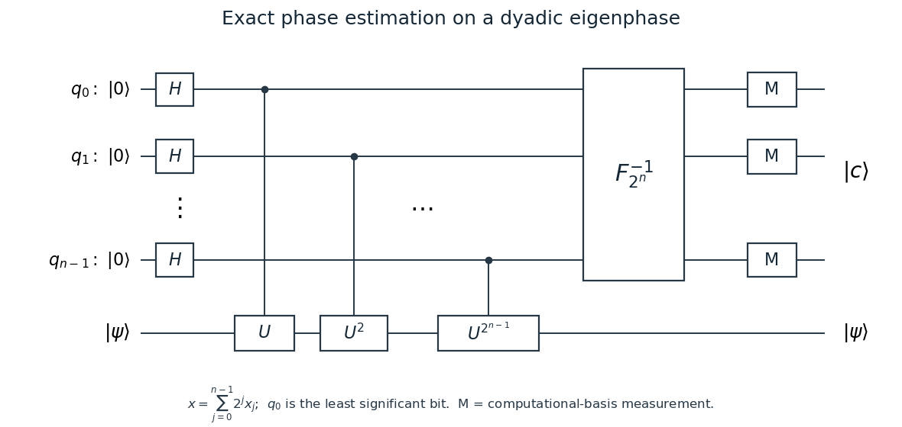

<h1 id="3/a/solution">Solution</h1>

↑ **Parent:** [A](../a.md)

Use [exact quantum phase estimation](../../../../../../exact-quantum-phase-estimation.md) with $n$ control [qubits](../../../../../../qubit.md) initially $|0^n\rangle$ and one target [quantum register](../../../../../../quantum-register.md) prepared in the given [eigenvector](../../../../../../eigenvector.md) $|\psi\rangle$. Apply [Hadamard gates](../../../../../../hadamard-gate.md) to the control [qubits](../../../../../../qubit.md). If control bit $x_j$ has significance $2^j$, apply a [controlled unitary gate](../../../../../../controlled-unitary-gate.md) $U^{2^j}$ from that [qubit](../../../../../../qubit.md) to the target. The target stays in $|\psi\rangle$, while [quantum phase kickback](../../../../../../phase-kickback.md) produces

$$
\frac1{\sqrt{2^n}}\sum_{x=0}^{2^n-1}e^{2\pi ix\phi}|x\rangle|\psi\rangle.
$$

Since $\phi=c/2^n$, this is $F_{2^n}|c\rangle\otimes|\psi\rangle$. The inverse [quantum Fourier transform](../../../../../../quantum-fourier-transform.md) on the control [quantum register](../../../../../../quantum-register.md) therefore gives $|c\rangle|\psi\rangle$. The [quantum measurement in the computational basis](../../../../../../quantum-measurement-in-the-computational-basis.md) returns $c$ with certainty, so

$$
\boxed{\phi=\frac c{2^n}\quad\text{with success probability }1.}
$$

The [quantum circuit](../../../../../../quantum-circuit-split.md) below reads left to right. The upper wires are control [qubits](../../../../../../qubit.md), with $q_0$ least significant; the vertical ellipsis represents the intervening control wires and powers. The inverse [quantum Fourier transform](../../../../../../quantum-fourier-transform.md) acts on the entire control [quantum register](../../../../../../quantum-register.md), including any bit-order permutations.

**[Figure 1](#3/a/image-quantum-phase-estimation-and-spectral-filtering). Quantum phase estimation and spectral filtering**.

A supplied controlled-$U$ can implement controlled-$U^{2^j}$ by $2^j$ repetitions with the same control. Hence this exact [quantum circuit](../../../../../../quantum-circuit-split.md) uses $2^n-1$ calls to the supplied controlled-$U$, unless controlled powers are additionally available cheaply. The [cost of exact phase estimation on a dyadic spectrum](../../../../../../cost-of-exact-phase-estimation-on-a-dyadic-spectrum.md) is not automatically polynomial in $n$; the question asks for an exact algorithm, not that stronger complexity guarantee. Exactness also uses the promised dyadic [eigenphase](../../../../../../eigenphase.md), ideal gates, and the supplied inverse [quantum Fourier transform](../../../../../../quantum-fourier-transform.md).

## ↑ Ancestors (11)

1. [A](../a.md)
2. [3](../../3.md)
3. [Paper 324](../../../paper-324-split.md)
4. [Iii](../../../split.md)
5. [2017](../../../../split.md)
6. [Past exam of the mathematics course of the University of Cambridge](../../../../../split.md)
7. [Mathematics course of the University of Cambridge](../../../../../../mathematics-course-of-the-university-of-cambridge.md)
8. [Course of the University of Cambridge](../../../../../../course-of-the-university-of-cambridge.md)
9. [University of Cambridge](../../../../../../university-of-cambridge-split.md)
10. [List of universities](../../../../../../list-of-universities.md)
11. [Codex Wiki](../../../../../../split.md)
