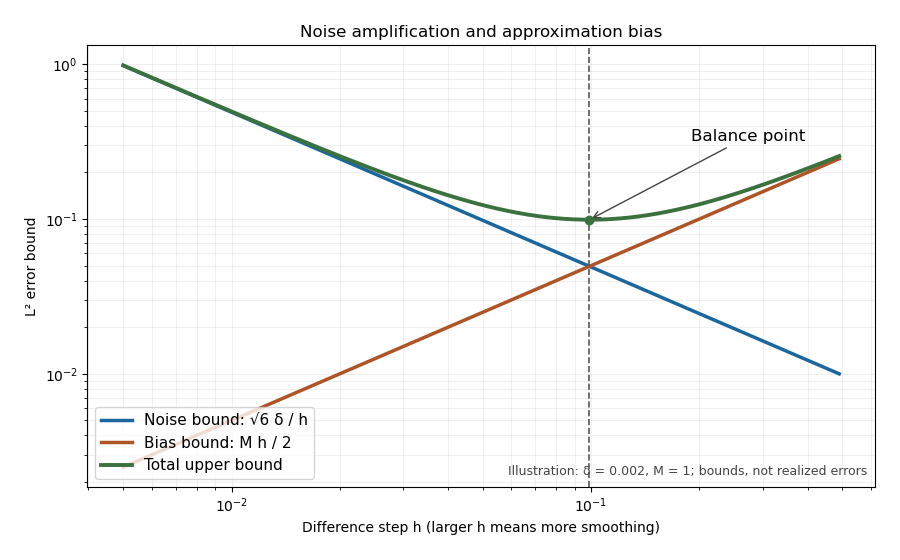

<h1 id="2/2/solution">Solution</h1>

↑ **Parent:** [2](../2.md)

For a [linear regularization](../../../../../../linear-regularization.md), add and subtract the exact-data reconstruction:

$$
R_\alpha f^\delta-u^\dagger=R_\alpha(f^\delta-f)+(R_\alpha f-u^\dagger),\qquad u^\dagger=K^\dagger f.
$$

The [triangle inequality](../../../../../../triangle-inequality.md) gives the [noise-bias decomposition for linear regularization](../../../../../../noise-bias-decomposition-for-linear-regularization.md):

$$
\boxed{\|R_\alpha f^\delta-u^\dagger\|\leq\delta\|R_\alpha\|+\|R_\alpha f-u^\dagger\|.}
$$

The two summands are noise amplification and approximation bias. Increasing the strength of regularization typically decreases noise amplification and increases bias; reducing regularization has the opposite effect. These are qualitative tendencies and bounds, not a claim that each realized noise error is monotone for every noise vector.

For the one-sided differentiation example, the bounds are $\sqrt6\delta/h$ and $\|f''\|_\infty h/2$. Their sum has an interior balance point when the second-derivative bound is positive and the optimum lies in the permitted interval. The following original sketch plots these bounds against $h$:

**[Figure 1](#2/2/image-balancing-approximation-and-noise-amplification-errors). Balancing approximation and noise-amplification errors**.

## ↑ Ancestors (11)

1. [2](../2.md)
2. [2](../../2.md)
3. [Paper 326](../../../paper-326-split.md)
4. [Iii](../../../split.md)
5. [2017](../../../../split.md)
6. [Past exam of the mathematics course of the University of Cambridge](../../../../../split.md)
7. [Mathematics course of the University of Cambridge](../../../../../../mathematics-course-of-the-university-of-cambridge.md)
8. [Course of the University of Cambridge](../../../../../../course-of-the-university-of-cambridge.md)
9. [University of Cambridge](../../../../../../university-of-cambridge-split.md)
10. [List of universities](../../../../../../list-of-universities.md)
11. [Codex Wiki](../../../../../../split.md)
