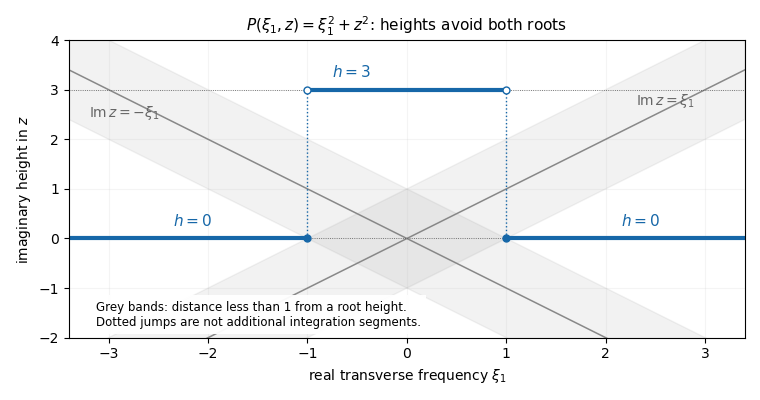

<h1 id="3/solution">Solution</h1>

↑ **Parent:** [3](../3.md)

Again use $D_j=-i\partial_j$ and [distribution](../../../../../distribution-mathematical-analysis.md) [dual pairings](../../../../../dual-pairing.md) with complex [bilinearity](../../../../../bilinearity.md). The [Malgrange–Ehrenpreis theorem](../../../../../malgrange-ehrenpreis-theorem.md) asserts that every nonzero constant-coefficient [differential operator](../../../../../differential-operator.md) defined by a [polynomial](../../../../../polynomial-split.md) has a [fundamental solution of a linear differential operator](../../../../../fundamental-solution-of-a-linear-differential-operator.md):

$$
\boxed{\text{for }P\ne0\text{ there is }E\in\mathcal D'(\mathbb R^n)
\text{ with }P(D)E=\delta_0.}
$$

If $P=a\ne0$ is constant, take $E=\delta_0/a$. For positive degree $m$, write $P_m$ for the highest homogeneous part. A nonzero [polynomial](../../../../../polynomial-split.md) cannot vanish on all of $\mathbb R^n$, so choose a real unit vector $e$ with $P_m(e)\ne0$. A change of coordinates by an [orthogonal matrix](../../../../../orthogonal-matrix.md) makes it the last coordinate direction. In these coordinates,

$$
P(\xi',z)=a z^m+\sum_{k<m}a_k(\xi')z^k,\qquad a=P_m(e)\ne0.
$$

Crucially the [leading coefficient](../../../../../leading-coefficient-of-a-polynomial.md) $a$ is constant and never vanishes as $\xi'\in\mathbb R^{n-1}$ varies.

The [finite-height polynomial root avoidance](../../../../../finite-height-polynomial-root-avoidance.md) construction gives the needed [Hörmander staircase](../../../../../hormander-staircase.md). Set $h_\ell=3\ell$ for $0\leq\ell\leq m$. For each fixed $\xi'$, the [fundamental theorem of algebra](../../../../../fundamental-theorem-of-algebra.md) supplies $m$ roots $z_1,\ldots,z_m$, with multiplicity. A root's imaginary part can be within distance strictly less than one of at most one candidate height, since those heights are separated by three. The [pigeonhole principle](../../../../../pigeonhole-principle.md) therefore leaves at least one height with $|h_\ell-\operatorname{Im}z_j|\geq1$ for all roots. At that height, for every real $s$,

$$
|P(\xi',s+ih_\ell)|=|a|\prod_{j=1}^m|s+ih_\ell-z_j|\geq |a|.
$$

No continuous labelling of the roots is required. To select the heights measurably, define

$$
B_\ell=\bigcap_{q\in\mathbb Q}
\{\xi':|P(\xi',q+ih_\ell)|\geq|a|\},\qquad
A_\ell=B_\ell\setminus\bigcup_{k<\ell}B_k.
$$

Each $B_\ell$ is closed, since the coefficients are continuous in $\xi'$. Continuity in $s$ makes the rational test equivalent to the bound for all $s\in\mathbb R$. The $A_\ell$ are therefore disjoint [Borel sets](../../../../../borel-set.md) covering $\mathbb R^{n-1}$. The union of horizontal fibres

$$
\Sigma=\bigcup_{\ell=0}^m\{(\xi',s+ih_\ell):\xi'\in A_\ell,\ s\in\mathbb R\}
$$

is a [Hörmander staircase](../../../../../hormander-staircase.md), with bounded imaginary height and a uniform nonzero denominator. For $n=1$, the transverse space has one point, and this is simply the choice of one horizontal line.

For example, $P(\xi_1,z)=\xi_1^2+z^2$ has roots $z=\pm i\xi_1$. One may select $h=0$ for $|\xi_1|\geq1$, and $h=3$ for $|\xi_1|<1$. Then the first region has $|P|\geq1$, while in the second each root is at least two units from the chosen height. The figure shows the height projection of these horizontal fibres, rather than additional connecting contours.

**[Figure 1](#3/image-a-finite-height-hormander-staircase). A finite-height Hörmander staircase**. Blue segments select horizontal integration lines away from all root heights. The dotted vertical markers indicate jumps in the transverse parameter and are not integration segments. Grey bands indicate excluded height distances less than one.

Define a linear functional on [test functions](../../../../../test-function.md) by

$$
\langle E,\varphi\rangle=(2\pi)^{-n}\sum_{\ell=0}^m
\int_{A_\ell}\int_{\mathbb R}
\frac{\widehat\varphi(-\xi',-s-ih_\ell)}
{P(\xi',s+ih_\ell)}\,ds\,d\xi'.
$$

To establish that this is a [distribution](../../../../../distribution-mathematical-analysis.md), fix a compact set containing the support of $\varphi$, inside a radius-$R$ ball. The [Fourier decay in a bounded complex strip](../../../../../fourier-decay-in-a-bounded-complex-strip.md) estimate follows by applying $(1-\Delta)^L$ to $e^{-h_\ell x_n}\varphi(x)$:

$$
|\widehat\varphi(-\xi',-s-ih_\ell)|
\leq C_{R,L}\max_{|\alpha|\leq2L}\|\partial^\alpha\varphi\|_\infty
(1+|\xi'|^2+s^2)^{-L},\qquad 0\leq h_\ell\leq3m.
$$

The finite bound on the heights absorbs all exponential factors and powers of $h_\ell$ into $C_{R,L}$. Taking $2L>n$ and using $|P|\geq|a|$ proves absolute convergence and the required finite-order continuity on each fixed support set. Hence $E\in\mathcal D'$.

Now the [formal transpose](../../../../../formal-transpose-of-a-differential-operator.md) identity and the Fourier derivative identity give

$$
\widehat{P(-D)\varphi}(-\xi',-z)=P(\xi',z)\widehat\varphi(-\xi',-z).
$$

The polynomial denominator cancels in the pairing for $P(D)E$. For each fixed real $\xi'$, the remaining function of $z$ is entire and rapidly decreasing in its real part throughout $0\leq\operatorname{Im}z\leq3m$. The [Cauchy integral theorem](../../../../../cauchy-s-integral-theorem.md) therefore allows each horizontal fibre to be shifted to the real axis; its truncated vertical end integrals tend to zero. Absolute convergence justifies [Fubini's theorem](../../../../../fubini-s-theorem.md) and the finite sum over the measurable partition. Thus

$$
\begin{aligned}
\langle P(D)E,\varphi\rangle
&=(2\pi)^{-n}\sum_{\ell=0}^m
\int_{A_\ell}\int_{\mathbb R}\widehat\varphi(-\xi',-s)\,ds\,d\xi'\\
&=(2\pi)^{-n}\int_{\mathbb R^n}\widehat\varphi(-\xi)\,d\xi
=\varphi(0)=\langle\delta_0,\varphi\rangle.
\end{aligned}
$$

The last equality is [Fourier inversion](../../../../../fourier-inversion-theorem.md). Transforming back from the orthogonal coordinates preserves $\delta_0$ and gives the required [fundamental solution of a linear differential operator](../../../../../fundamental-solution-of-a-linear-differential-operator.md) for the original operator. The staircase is allowed to jump: after cancellation the shift is performed on each one-dimensional fibre, so no assertion that $\Sigma$ is a smooth contour is used. This construction proves a distributional fundamental solution, without claiming a tempered-growth estimate.

For $f\in\mathcal D(\mathbb R^n)$, use the [smoothing convolution with a test function](../../../../../smoothing-convolution-with-a-test-function.md)

$$
\boxed{u_0=E*f,\qquad P(D)u_0=(P(D)E)*f=\delta_0*f=f.}
$$

Indeed $u_0(x)=\langle E_y,f(x-y)\rangle$ is a [smooth function](../../../../../smooth-function.md), with $\partial^\alpha u_0(x)=\langle E_y,\partial^\alpha f(x-y)\rangle$. On each compact set of $x$ values, all translated [test functions](../../../../../test-function.md) have supports in one fixed compact set, so differentiation is justified by the continuity of the [distribution](../../../../../distribution-mathematical-analysis.md). Compact support of $f$ makes the convolution well defined even when $E$ is not tempered. It does not imply compact support of $u_0$.

Finally the [affine solution space of a linear equation](../../../../../affine-solution-space-of-a-linear-equation.md) is

$$
\{u:P(D)u=f\}=u_0+\ker P(D).
$$

If every homogeneous solution is represented by a [smooth function](../../../../../smooth-function.md), so is every $u=u_0+v$. Conversely, if every solution for this fixed $f$ is represented by a [smooth function](../../../../../smooth-function.md), then for any homogeneous solution $v$, the solution $u_0+v$ is smooth, and subtracting the smooth $u_0$ shows that $v$ is smooth. Hence **All inhomogeneous solutions are [smooth functions](../../../../../smooth-function.md) exactly when all homogeneous solutions are [smooth functions](../../../../../smooth-function.md)**. This is a global statement on $\mathbb R^n$ for the stated data; no additional local regularity theorem is being assumed.

## ↑ Ancestors (10)

1. [3](../3.md)
2. [Paper 327](../../paper-327-split.md)
3. [Iii](../../split.md)
4. [2017](../../../split.md)
5. [Past exam of the mathematics course of the University of Cambridge](../../../../split.md)
6. [Mathematics course of the University of Cambridge](../../../../../mathematics-course-of-the-university-of-cambridge.md)
7. [Course of the University of Cambridge](../../../../../course-of-the-university-of-cambridge.md)
8. [University of Cambridge](../../../../../university-of-cambridge-split.md)
9. [List of universities](../../../../../list-of-universities.md)
10. [Codex Wiki](../../../../../split.md)
