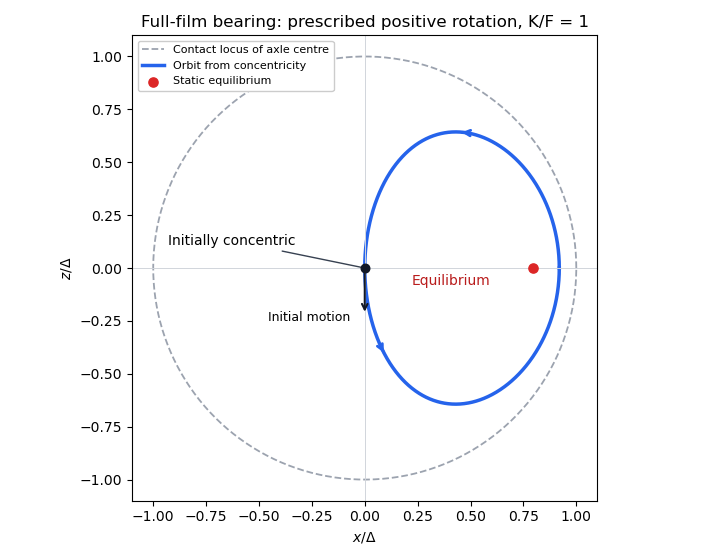

# Paper 329

↑ **Parent:** [Iii](../iii.md)

[https://www.maths.cam.ac.uk/postgrad/part-iii/files/pastpapers/2017/paper_329.pdf](https://www.maths.cam.ac.uk/postgrad/part-iii/files/pastpapers/2017/paper_329.pdf)

**Table of contents**

- [1](#1)
  - [a](#1/a)
    - [Solution](#1/a/solution)
  - [b](#1/b)
    - [Solution](#1/b/solution)
- [2](#2)
  - [a](#2/a)
    - [Solution](#2/a/solution)
  - [b](#2/b)
    - [Solution](#2/b/solution)
  - [c](#2/c)
    - [Solution](#2/c/solution)
- [3](#3)
  - [a](#3/a)
    - [Solution](#3/a/solution)
  - [b](#3/b)
    - [Solution](#3/b/solution)
  - [c](#3/c)
    - [Solution](#3/c/solution)

## 1

↑ **Parent:** [Paper 329](paper-329.md)

<h3 id="1/a">a</h3>

↑ **Parent:** [1](#1)

<h4 id="1/a/solution">Solution</h4>

↑ **Parent:** [A](#1/a)

[Linearity of Stokes flow](../../../stokes-flow.md#linearity-of-stokes-flow) and [rotational symmetry](../../../linear-algebra.md#rotational-symmetry), including [reflection in mathematics](../../../linear-algebra.md#reflection-mathematics) invariance of the spherical geometry, determine the possible rigid motions before any calculation. Translation is a [polar vector](../../../vector-space.md#polar-vector); its linear dependence on a single [vector](../../../vector-space.md#vector) $\mathbf A$ must be $c\mathbf A$. A [traceless second-rank tensor](../../../linear-algebra.md#traceless-second-rank-tensor) $\mathbf B$ cannot produce a polar [vector](../../../vector-space.md#vector) by an isotropic linear map: [tensor contraction](../../../linear-algebra.md#tensor-contraction) with the [identity matrix](../../../vector-space.md#identity-matrix) vanishes and [tensor contraction](../../../linear-algebra.md#tensor-contraction) with the [totally antisymmetric tensor](../../../linear-algebra.md#totally-antisymmetric-tensor) vanishes because $\mathbf B$ is a [symmetric second-rank tensor](../../../linear-algebra.md#symmetric-second-rank-tensor). [Angular velocity](../../../classical-mechanics.md#angular-velocity) is an [axial vector](../../../vector-space.md#pseudovector). Neither $\mathbf A$ nor a symmetric $\mathbf B$ can produce one by an isotropic linear map. Products such as $\mathbf A\times\mathbf B\mathbf A$ are excluded by [Linearity of Stokes flow](../../../stokes-flow.md#linearity-of-stokes-flow). Thus $\boldsymbol\Omega=0$.

Use the [Unscaled Papkovich–Neuber representation](../../../stokes-flow.md#unscaled-papkovich-neuber-representation), with [harmonic functions](../../../partial-differential-equation.md#harmonic-function) $\boldsymbol\Phi$ and $\chi$:

$$
\mathbf u=\nabla(\mathbf x\cdot\boldsymbol\Phi+\chi)-2\boldsymbol\Phi,
\qquad p-p_\infty=2\mu\nabla\cdot\boldsymbol\Phi.
$$

Indeed $\nabla\cdot\mathbf u=0$ and $\mu\nabla^2\mathbf u=\nabla p$ because each potential is a [harmonic function](../../../partial-differential-equation.md#harmonic-function). Put $r=|\mathbf x|$ and $S=\mathbf x\cdot\mathbf B\mathbf x$. The decaying [harmonic functions](../../../partial-differential-equation.md#harmonic-function) with the necessary angular dependence are $\mathbf A\cdot\mathbf x/r^3$, $\mathbf B\mathbf x/r^3$ and $S/r^5$. The last is a [harmonic function](../../../partial-differential-equation.md#harmonic-function) precisely because $\operatorname{tr}\mathbf B=0$. A $1/r$ [Stokeslet](../../../stokes-flow.md#stokeslet) is excluded by the [force-free](../../../stokes-flow.md#force-free) condition, and a [rotlet](../../../stokes-flow.md#rotlet) by the [torque-free](../../../stokes-flow.md#torque-free) condition. Try

$$
\boldsymbol\Phi=d\frac{\mathbf B\mathbf x}{r^3},\qquad
\chi=c\frac{\mathbf A\cdot\mathbf x}{r^3}+e\frac{S}{r^5}.
$$

The resulting [Stokes flow](../../../stokes-flow.md) is

$$
\mathbf u=c\left(\frac{\mathbf A}{r^3}-\frac{3(\mathbf A\cdot\mathbf x)\mathbf x}{r^5}\right)
-3d\frac{S\mathbf x}{r^5}
+e\left(\frac{2\mathbf B\mathbf x}{r^5}-\frac{5S\mathbf x}{r^7}\right).
$$

At $r=a$, the coefficient of $\mathbf n(\mathbf A\cdot\mathbf n)$ fixes $c=a^3/3$; the remaining constant [vector](../../../vector-space.md#vector) gives $\mathbf U=-2\mathbf A/3$. In the $\mathbf B$ mode, matching $\mathbf B\mathbf n-(\mathbf n\cdot\mathbf B\mathbf n)\mathbf n$ gives $e=a^4/2$ and $d=-a^2/2$. Therefore the complete [two-mode tensorial squirmer flow](../../../stokes-flow.md#two-mode-tensorial-squirmer-flow) is

$$
\boxed{\begin{aligned}
\mathbf u(\mathbf x)&=\frac{a^3}{3r^3}\left[\mathbf A-3(\mathbf A\cdot\widehat{\mathbf x})\widehat{\mathbf x}\right]
\\&\quad+\frac{3a^2 S\mathbf x}{2r^5}
+\frac{a^4}{2}\left(\frac{2\mathbf B\mathbf x}{r^5}-\frac{5S\mathbf x}{r^7}\right),\\
p-p_\infty&=3\mu a^2\frac{S}{r^5},\qquad
\mathbf U=-\frac23\mathbf A,\quad\boldsymbol\Omega=0.
\end{aligned}}
$$

The [boundary condition](../../../differential-equation.md#boundary-condition) is satisfied in the laboratory frame, so the [Stokes flow](../../../stokes-flow.md) tends to zero at infinity. The [potential dipole](../../../fluid-mechanics.md#potential-dipole) in the $\mathbf A$ mode gives an [irrotational flow](../../../fluid-mechanics.md#irrotational-flow) and decays as $r^{-3}$; the leading $\mathbf B$ mode is a [stresslet](../../../stokes-flow.md#force-dipole-flow), decaying as $r^{-2}$. Neither carries a net [force](../../../classical-mechanics.md#force) or [torque](../../../classical-mechanics.md#torque). Direct [surface integral](../../../calculus.md#surface-integral) averaging with the [surface slip velocity](../../../stokes-flow.md#surface-slip-velocity) formula gives the same translation, providing an independent check. [Uniqueness of Stokes flow](../../../stokes-flow.md#uniqueness-of-stokes-flow) then identifies this decaying solution.

<h3 id="1/b">b</h3>

↑ **Parent:** [1](#1)

<h4 id="1/b/solution">Solution</h4>

↑ **Parent:** [B](#1/b)

Let $\mathbf e=\mathbf X/R$, $s=\mathbf e\cdot\mathbf B\mathbf e$, and $A_\parallel=\mathbf A\cdot\mathbf e$. Applied [forces](../../../classical-mechanics.md#force) and couples below are [forces](../../../classical-mechanics.md#force) and [torques](../../../classical-mechanics.md#torque) on the solid; by [force](../../../classical-mechanics.md#force) balance their values are also the strengths exerted by that solid on the fluid. This fixes the signs in [Faxén's first law](../../../stokes-flow.md#faxen-s-first-law) and [Faxén's rotational law](../../../stokes-flow.md#faxen-s-rotational-law). To hold the passive [sphere](../../../geometry-and-topology.md#sphere) fixed, set its translation and [angular velocity](../../../classical-mechanics.md#angular-velocity) to zero in those laws. The incident [two-mode tensorial squirmer flow](../../../stokes-flow.md#two-mode-tensorial-squirmer-flow) gives

$$
\mathbf F_h=-6\pi\mu a\left(\mathbf u(\mathbf X)+\frac{a^2}{6}\nabla^2\mathbf u(\mathbf X)\right),\qquad
\mathbf G_h=-4\pi\mu a^3\boldsymbol\omega(\mathbf X).
$$

Only the [stresslet](../../../stokes-flow.md#force-dipole-flow) part has [vorticity](../../../fluid-mechanics.md#vorticity):

$$
\boldsymbol\omega(\mathbf x)=3a^2\frac{(\mathbf B\mathbf x)\times\mathbf x}{r^5}.
$$

Consequently, for fixed $\mathbf A,\mathbf B$ as $a/R\to0$,

$$
\boxed{\begin{aligned}\mathbf F_h&=-\frac{9\pi\mu a^3}{R^2}s\mathbf e
-\frac{2\pi\mu a^4}{R^3}(\mathbf A-3A_\parallel\mathbf e)
\\&\quad+O\!\left(\frac{\mu a^5\|\mathbf B\|}{R^4}+\frac{\mu a^8|\mathbf A|}{R^7}\right),\\
\mathbf G_h&=-\frac{12\pi\mu a^5}{R^5}(\mathbf B\mathbf X)\times\mathbf X+\text{higher reflections}.\end{aligned}}
$$

The leading [force](../../../classical-mechanics.md#force) is the radial [stresslet](../../../stokes-flow.md#force-dipole-flow) [force](../../../classical-mechanics.md#force). Its next correction, $O(\mu a^4|\mathbf A|/R^3)$, comes from the incident [potential dipole](../../../fluid-mechanics.md#potential-dipole). The next $\mathbf B$ correction, $O(\mu a^5\|\mathbf B\|/R^4)$, contains both the swimmer's $r^{-4}$ field and the [Laplacian](../../../calculus.md#laplacian) term in [Faxén's first law](../../../stokes-flow.md#faxen-s-first-law). If the relevant coefficient vanishes, these next terms must be retained instead of calling the vanished term a nonzero leading approximation. Further exchanges in the [method of reflections for Stokes flow](../../../stokes-flow.md#method-of-reflections-for-stokes-flow) are smaller still.

The passive [sphere](../../../geometry-and-topology.md#sphere) reflects primarily a [Stokeslet](../../../stokes-flow.md#stokeslet) with strength $\mathbf F_h$. At the swimmer, its [velocity](../../../classical-mechanics.md#velocity) is $(\mathbf I+\mathbf e\mathbf e)\mathbf F_h/(8\pi\mu R)$. The unchanged [surface slip velocity](../../../stokes-flow.md#surface-slip-velocity) adds the free swimming [velocity](../../../classical-mechanics.md#velocity) to the incident-flow contribution in [Faxén's first law](../../../stokes-flow.md#faxen-s-first-law). Thus

$$
\boxed{\begin{aligned}\delta\mathbf U&=-\frac{9a^3}{4R^3}s\mathbf e
-\frac{a^4}{4R^4}(\mathbf A-5A_\parallel\mathbf e)
\\&\quad+O\!\left(\frac{a^5\|\mathbf B\|}{R^5}+\frac{a^6|\mathbf A|}{R^6}\right).\end{aligned}}
$$

The leading change is $O(a^3\|\mathbf B\|/R^3)$; its next correction is the displayed $O(a^4|\mathbf A|/R^4)$ term. Finite-radius [Faxén's first law](../../../stokes-flow.md#faxen-s-first-law) corrections, the passive [sphere](../../../geometry-and-topology.md#sphere)'s reflected [stresslet](../../../stokes-flow.md#force-dipole-flow), and its [rotlet](../../../stokes-flow.md#rotlet) contribute at order $a^5\|\mathbf B\|/R^5$ to translation.

For a [Stokeslet](../../../stokes-flow.md#stokeslet) at the origin,

$$
\mathbf u_F(\mathbf x)=\frac1{8\pi\mu}\left(\frac{\mathbf F}{r}+\frac{(\mathbf F\cdot\mathbf x)\mathbf x}{r^3}\right).
$$

The [curl](../../../calculus.md#curl) of the first term is $\mathbf F\times\mathbf x/r^3$; that of the second is also $\mathbf F\times\mathbf x/r^3$, before multiplying by $1/(8\pi\mu)$. Hence $\boldsymbol\omega_F=\mathbf F\times\mathbf x/(4\pi\mu r^3)$. At the swimmer use displacement $-\mathbf X$. The leading $\mathbf B$ [force](../../../classical-mechanics.md#force) is parallel to $\mathbf X$, so its [Stokeslet](../../../stokes-flow.md#stokeslet) has zero [vorticity](../../../fluid-mechanics.md#vorticity) there. This eliminates the putative $O(a^3\|\mathbf B\|/R^4)$ rotation. The [potential dipole](../../../fluid-mechanics.md#potential-dipole) itself has no [vorticity](../../../fluid-mechanics.md#vorticity), but the holding [force](../../../classical-mechanics.md#force) it induces is not radial. Applying [Faxén's rotational law](../../../stokes-flow.md#faxen-s-rotational-law) to its reflected [Stokeslet](../../../stokes-flow.md#stokeslet) yields

$$
\boxed{\boldsymbol\Omega=\frac12\frac{\mathbf F_{h,A}\times(-\mathbf X)}{4\pi\mu R^3}
=\frac{a^4}{4R^6}\mathbf A\times\mathbf X
+O\!\left(\frac{a^5\|\mathbf B\|}{R^6}+\frac{a^6|\mathbf A|}{R^7}\right).}
$$

The passive [sphere](../../../geometry-and-topology.md#sphere)'s [rotlet](../../../stokes-flow.md#rotlet) and reflected [stresslet](../../../stokes-flow.md#force-dipole-flow) can affect that last order, so they cannot restore the larger missing rotation. When $\mathbf A\times\mathbf X=0$, the boxed coefficient is zero and the higher-order terms determine any rotation.

## 2

↑ **Parent:** [Paper 329](paper-329.md)

<h3 id="2/a">a</h3>

↑ **Parent:** [2](#2)

<h4 id="2/a/solution">Solution</h4>

↑ **Parent:** [A](#2/a)

Take $z$ positive downwards. The leading axial [velocity](../../../classical-mechanics.md#velocity) of a [slender viscous thread](../../../viscous-fluid-flow.md#slender-viscous-thread) is independent of radius. [Incompressible flow](../../../fluid-mechanics.md#incompressible-flow) then gives $u_r=-rw'/2$, while steady [mass conservation](../../../continuum-mechanics.md#mass-conservation) gives $(a^2w)'=0$. The [Newtonian fluid stress tensor](../../../viscous-fluid-flow.md#newtonian-fluid-stress-tensor) has $\sigma_{rr}=-p-\mu w'$ and $\sigma_{zz}=-p+2\mu w'$. The [Young–Laplace equation](../../../fluid-mechanics.md#young-laplace-equation), neglecting axial curvature at slender order, gives $\sigma_{rr}=-p_e-\gamma/a$ and hence $p=p_e+\gamma/a-\mu w'$.

The axial cut transmits both the integrated [Newtonian fluid stress tensor](../../../viscous-fluid-flow.md#newtonian-fluid-stress-tensor) and the circumferential [surface tension](../../../fluid-mechanics.md#surface-tension). After subtracting the ambient [pressure](../../../thermodynamics.md#pressure), its tensile [force](../../../classical-mechanics.md#force) is

$$
T=\pi a^2(3\mu w'-\gamma/a)+2\pi\gamma a
=3\pi\mu a^2w'+\pi\gamma a.
$$

The coefficient three is the [Trouton ratio](../../../rheology.md#trouton-ratio) for axial extension. The last term is essential: the [capillary tensile force of a slender thread](../../../viscous-fluid-flow.md#capillary-tensile-force-of-a-slender-thread) is $\pi\gamma a$, not $2\pi\gamma a$, because the [capillary pressure](../../../fluid-mechanics.md#capillary-pressure) subtracts half the interfacial line contribution. Axial [force](../../../classical-mechanics.md#force) balance is $T'+\pi\rho ga^2=0$. Together the governing equations are

$$
\boxed{(a^2w)'=0,\qquad 3\mu(a^2w')'+\rho ga^2+\gamma a'=0.}
$$

Define the [dimensionless variables](../../../mathematics.md#dimensionless-variable)

$$
\ell=\sqrt{\frac{\mu w_0}{\rho g}},\quad Z=\frac z\ell,\quad W=\frac w{w_0},\quad
\Gamma=\frac{\gamma\ell}{\mu a_0w_0}=\frac{\gamma}{\rho g a_0\ell}.
$$

Then $a=a_0W^{-1/2}$ and the axial equation becomes

$$
3\frac d{dZ}\left(\frac{W_Z}{W}\right)+\frac1W+\Gamma\frac d{dZ}W^{-1/2}=0.
$$

For the increasing power-law branch, all three terms have the same dependence when $\alpha=2$. Substitution leaves $1-6k^2-\Gamma k=0$. Thus

$$
\boxed{W=(1+kZ)^2,\quad \alpha=2,\quad k=\frac{\sqrt{\Gamma^2+24}-\Gamma}{12}.}
$$

This remains valid at $\Gamma=0$, when $k=1/\sqrt6$. The other root is negative and describes a decreasing local branch up to its singular endpoint, not a thread accelerating downwards indefinitely. Positive [surface tension](../../../fluid-mechanics.md#surface-tension) decreases $k$, so it slows the fall at a given height on this branch. Thinning reduces the capillary tensile [force](../../../classical-mechanics.md#force) $\pi\gamma a$. Its negative axial derivative supplies an upward capillary [force](../../../classical-mechanics.md#force) on a thread segment, balancing part of the weight. The viscous tensile [force](../../../classical-mechanics.md#force) therefore supplies a smaller remaining balance; on the quadratic family this reduces the stretching rate.

The condition $W(0)=1$ alone does not select a unique solution of this second-order [ordinary differential equation](../../../differential-equation.md#ordinary-differential-equation). The boxed power law is the requested verified branch, with tensile [force](../../../classical-mechanics.md#force) tending to zero at large height; an additional nozzle tension or downstream condition is required to select it physically. The slender, negligible-inertia approximation must remain valid over the height range considered.

<h3 id="2/b">b</h3>

↑ **Parent:** [2](#2)

<h4 id="2/b/solution">Solution</h4>

↑ **Parent:** [B](#2/b)

Write $D=R_e-R_i$, $S=R_e+R_i$, $A=R_e^2-R_i^2=DS$, and $\Delta p=p_i-p_e$. [Incompressible flow](../../../fluid-mechanics.md#incompressible-flow) with [axial strain rate](../../../rheology.md#axial-strain-rate) $E$ gives

$$
u_r=-\frac E2r+\frac{C(t)}r.
$$

Its radial [Stokes equation](../../../stokes-flow.md#stokes-equation) gives $p_r=0$, because $u_{r,rr}+u_{r,r}/r-u_r/r^2=0$. The radial [Newtonian fluid stress tensor](../../../viscous-fluid-flow.md#newtonian-fluid-stress-tensor) component is $\sigma_{rr}=-p-\mu E-2\mu C/r^2$. The outer and inner [Young–Laplace equation](../../../fluid-mechanics.md#young-laplace-equation) conditions have opposite curvature signs:

$$
\sigma_{rr}(R_e)=-p_e-\frac\gamma{R_e},\qquad
\sigma_{rr}(R_i)=-p_i+\frac\gamma{R_i}.
$$

Subtracting and eliminating $C$ gives

$$
\boxed{C=\frac{R_i^2R_e^2}{2\mu A}\left[\Delta p-\gamma\left(\frac1{R_i}+\frac1{R_e}\right)\right],\qquad
p=p_e-\frac{\Delta p R_i^2}{A}+\frac{\gamma S}{A}-\mu E.}
$$

In particular, the boxed [pressure](../../../thermodynamics.md#pressure) is equivalent to the printed identity for $(-p-\mu E)A$. For equal gas [pressures](../../../thermodynamics.md#pressure), $C=-\gamma R_iR_e/(2\mu D)$, so [surface tension](../../../fluid-mechanics.md#surface-tension) draws both interfaces inward in addition to the imposed extension.

The [kinematic boundary condition](../../../fluid-mechanics.md#kinematic-boundary-condition) is $\dot R_j=-ER_j/2+C/R_j$ at either interface. Taking the difference, and then the difference of squared radii, gives

$$
\boxed{\dot D=-\frac E2D+\frac\gamma{2\mu}-\frac{\Delta p R_iR_e}{2\mu S},\qquad
\dot A=-EA,\quad A(t)=A(0)e^{-Et}.}
$$

The cancellation of $C$ in the area equation is [mass conservation](../../../continuum-mechanics.md#mass-conservation): axial stretching reduces the liquid area while radial redistribution changes the hole size. For $E=0$, equal [pressures](../../../thermodynamics.md#pressure), and $R_i(0)=b$, $R_e(0)=2b$, one has $A=3b^2$ and $D=b+\gamma t/(2\mu)$. Since $S=A/D$,

$$
R_i=\frac12\left(\frac A D-D\right),\qquad
R_e=\frac12\left(\frac A D+D\right).
$$

Closure occurs at $D=\sqrt A=\sqrt3b$, so

$$
\boxed{t_*=\frac{2\mu b}{\gamma}(\sqrt3-1).}
$$

This [capillary collapse of an annular viscous cylinder](../../../viscous-fluid-flow.md#capillary-collapse-of-an-annular-viscous-cylinder) has finite closure time for $\gamma>0$ and $b>0$. For $\gamma=0$ it does not close in this case. The annular formula is used only up to closure; the singular cylindrical inner curvature is not a [boundary condition](../../../differential-equation.md#boundary-condition) on the subsequent solid cylinder.

<h3 id="2/c">c</h3>

↑ **Parent:** [2](#2)

<h4 id="2/c/solution">Solution</h4>

↑ **Parent:** [C](#2/c)

Use $A=R_e^2-R_i^2$, $S=R_e+R_i$, $D=R_e-R_i$, and $Q=Aw=A(0)w_0$. Locally replace $E$ in the preceding [annular viscous extension](../../../viscous-fluid-flow.md#annular-viscous-extension) calculation by $w'(z)$. Its leading [pressure](../../../thermodynamics.md#pressure) is

$$
p=p_e-\frac{(p_i-p_e)R_i^2}{A}+\frac{\gamma S}{A}-\mu w'.
$$

The axial liquid stress relative to ambient [pressure](../../../thermodynamics.md#pressure), together with the two circumferential [surface tension](../../../fluid-mechanics.md#surface-tension) [forces](../../../classical-mechanics.md#force), transmits a cut [force](../../../classical-mechanics.md#force)

$$
T_{\rm cut}/\pi=3\mu Aw'+(p_i-p_e)R_i^2+\gamma S.
$$

It would be incorrect simply to differentiate this and retain an extra gas-pressure term. The sloping inner gas interface also exerts an axial [pressure](../../../thermodynamics.md#pressure) [force](../../../classical-mechanics.md#force) $-\pi(p_i-p_e)(R_i^2)'$ per unit height, after subtracting the common ambient [pressure](../../../thermodynamics.md#pressure) contribution. For constant gas [pressures](../../../thermodynamics.md#pressure) these terms cancel. The resulting [capillary tensile force of a hollow slender thread](../../../viscous-fluid-flow.md#capillary-tensile-force-of-a-hollow-slender-thread) therefore gives

$$
\boxed{3\mu(Aw')'+\rho gA+\gamma S'=0,\qquad Aw=Q.}
$$

Thus the printed axial equation holds even for unequal constant gas [pressures](../../../thermodynamics.md#pressure); their influence remains in the radial evolution.

For equal [pressures](../../../thermodynamics.md#pressure), the [kinematic boundary condition](../../../fluid-mechanics.md#kinematic-boundary-condition) from the previous calculation becomes $wD'=-w'D/2+\gamma/(2\mu)$. Multiplying by the appropriate [integrating factor](../../../differential-equation.md#integrating-factor) gives

$$
\frac d{dz}(D\sqrt w)=\frac{\gamma}{2\mu\sqrt w},\qquad
D(z)\sqrt{w(z)}=D(0)\sqrt{w_0}+\frac\gamma{2\mu}\int_0^z\frac{d\zeta}{\sqrt{w(\zeta)}}.
$$

At closure $R_i=0$, so $D=\sqrt A$ and $D\sqrt w=\sqrt Q$. Hence

$$
\boxed{\frac{\gamma}{2\mu\sqrt{w_0}}\int_0^{z_*}\frac{d\zeta}{\sqrt{w(\zeta)}}=\sqrt{A(0)}-R_e(0)+R_i(0).}
$$

The right side is positive for a genuine annulus. On the gravity-driven quadratic family from the previous part, $w^{1/2}$ grows linearly with height and this [integral](../../../calculus.md#integral) diverges logarithmically. It must then reach the finite positive threshold at a finite height. This explains the expected [capillary closure of a falling hollow thread](../../../viscous-fluid-flow.md#capillary-closure-of-a-falling-hollow-thread) on that freely falling branch without requiring its full coupled profile.

There is a real boundary-data limitation to that expectation. Neither the printed nozzle speed nor the local equations alone guarantee finite closure for every imposed nozzle tension. To see this within the same leading model, define $T=3\mu Qw'/w+\gamma S$, so $T'=-\rho gQ/w$. For equal [pressures](../../../thermodynamics.md#pressure) and $w'>0$, both radii decrease and $S\leq S_0$. If

$$
c=\frac{T_0/2-\gamma S_0}{3\mu Q}>0,\qquad
\frac{\rho gQ}{cw_0}<\frac{T_0}{2},
$$

then a bootstrap gives $T>T_0/2$ and $w\geq w_0e^{cz}$: the maximum accumulated weight is smaller than the assumed tension margin. Consequently the closure [integral](../../../calculus.md#integral), including its prefactor, is at most $\gamma/(\mu cw_0)$. If this is smaller than $\sqrt{A_0}-D_0$, closure never occurs at finite height. For example, in consistent units choose $\mu=\rho g=w_0=1$, $R_i(0)=\lambda$, $R_e(0)=2\lambda$, $\gamma=\lambda$, $T_0=100\lambda^2$. Then $c=47/9$, the weight bound is $27\lambda^2/47<50\lambda^2$, and $9\lambda/47<(\sqrt3-1)\lambda$. Small $\lambda$ makes the initial geometry slender. Thus **finite closure is the expected freely falling branch behaviour, not a theorem following from nozzle speed alone**. If $\gamma=0$ there is no capillary closure by this mechanism.

## 3

↑ **Parent:** [Paper 329](paper-329.md)

<h3 id="3/a">a</h3>

↑ **Parent:** [3](#3)

<h4 id="3/a/solution">Solution</h4>

↑ **Parent:** [A](#3/a)

First supply the introductory scaling and geometry. The leading tangential [Stokes equation](../../../stokes-flow.md#stokes-equation) in a thin gap balances $P/L$ against $\mu U/H^2$. The [shear stress](../../../viscous-fluid-flow.md#shear-stress) scale is $\tau\sim\mu U/H$, so [lubrication pressure dominates shear stress](../../../viscous-fluid-flow.md#lubrication-pressure-dominates-shear-stress):

$$
\boxed{P\sim\frac{\mu UL}{H^2},\qquad \frac\tau P\sim\frac HL\ll1.}
$$

The outer circle, viewed along a ray $r(\cos\theta,\sin\theta)$ from the inner centre, satisfies $r^2-2\alpha\Delta r\sin\theta+\alpha^2\Delta^2=(a+\Delta)^2$. Expanding its positive root to first order in $\Delta/a$ gives $r=a+\Delta+\alpha\Delta\sin\theta+O(\Delta^2/a)$, hence $h=\Delta(1+\alpha\sin\theta)$.

Take positive $\Omega$ to mean increasing $\theta$, and put $s=a\theta$, $y=r-a$, $U=\Omega a$. With [no-slip boundary conditions](../../../viscous-fluid-flow.md#no-slip-boundary-condition) at $y=0,h$, [lubrication theory](../../../viscous-fluid-flow.md#lubrication-theory) gives

$$
u_\theta=U\left(1-\frac yh\right)+\frac{p_s}{2\mu}y(y-h),\qquad
q=\frac{Uh}{2}-\frac{h^3}{12\mu}p_s.
$$

Steady [mass conservation](../../../continuum-mechanics.md#mass-conservation) makes $q$ independent of $\theta$. Single-valued [pressure](../../../thermodynamics.md#pressure) requires $\int_0^{2\pi}p_\theta\,d\theta=0$. Write $I_n=\int_0^{2\pi}(1+\alpha\sin\theta)^{-n}d\theta$ and $D_\alpha=1+\alpha^2/2$. It follows that

$$
\boxed{q=\frac{\Omega a\Delta}{2}\frac{I_2}{I_3}
=\frac{\Omega a\Delta}{2}\frac{1-\alpha^2}{D_\alpha},\qquad
p_s=\frac{6\mu\Omega a}{h^2}-\frac{12\mu q}{h^3}.}
$$

The tangential fluid tractions on the inner and outer solids, measured in the same increasing-$\theta$ direction, are respectively

$$
\boxed{\tau_i=\mu u_{\theta,y}(0)=\frac{6\mu q}{h^2}-\frac{4\mu\Omega a}{h},\qquad
\tau_o=-\mu u_{\theta,y}(h)=\frac{6\mu q}{h^2}-\frac{2\mu\Omega a}{h}.}
$$

This sign convention distinguishes the traction on a wall from the corresponding stress component in the fluid.

To leading order the holding [force](../../../classical-mechanics.md#force) balances the [pressure](../../../thermodynamics.md#pressure) traction on the inner circle. [Integration by parts](../../../calculus.md#integration-by-parts) gives

$$
F_x=a\int_0^{2\pi}p\cos\theta\,d\theta
=-a\int_0^{2\pi}p_\theta\sin\theta\,d\theta.
$$

Use $p_\theta=a p_s$ and $\int\sin\theta/(1+\alpha\sin\theta)^n\,d\theta=(I_{n-1}-I_n)/\alpha$, with the continuous limit at $\alpha=0$. Substituting the boxed flux yields

$$
\boxed{F_x=-\frac{6\pi\mu\Omega a^3}{\Delta^2}\frac{\alpha}{\sqrt{1-\alpha^2}\,D_\alpha},\qquad F_z=0.}
$$

The zero vertical component also follows from [reflection in mathematics](../../../linear-algebra.md#reflection-mathematics) in the vertical line: this leaves the geometry and vertical [force](../../../classical-mechanics.md#force) unchanged, reverses $\Omega$, and [Linearity of Stokes flow](../../../stokes-flow.md#linearity-of-stokes-flow) then requires $F_z=0$.

[Pressure](../../../thermodynamics.md#pressure) gives no moment about either circular wall's own centre. Integrating the [viscous shear torque](../../../viscous-fluid-flow.md#viscous-shear-torque) with lever arm $a$ to leading order gives the fluid couples

$$
\boxed{C_i=-\frac{2\pi\mu\Omega a^3}{\Delta\sqrt{1-\alpha^2}}\frac{1+2\alpha^2}{D_\alpha},\qquad
C_o=\frac{2\pi\mu\Omega a^3\sqrt{1-\alpha^2}}{\Delta D_\alpha}.}
$$

Indeed $C_i=a^2\int\tau_i d\theta$ and $C_o=a^2\int\tau_o d\theta$ at this order. Applied holding or driving couples are the negatives of these fluid couples. They need not cancel because they are moments about different axes. The fluid [force](../../../classical-mechanics.md#force) on the outer solid equals the holding [force](../../../classical-mechanics.md#force) $F_x$ on the inner one. Transferring its moment to the inner axis adds $-\alpha\Delta F_x$, so [angular momentum](../../../classical-mechanics.md#angular-momentum) balance about a common axis is

$$
\boxed{C_i+C_o=\alpha\Delta F_x.}
$$

For $\alpha=0$ the usual equal and opposite concentric couples are recovered. All these formulas are leading thin-gap expressions at fixed $|\alpha|<1$; taking the contact limit requires maintaining the local slender-gap assumptions.

<h3 id="3/b">b</h3>

↑ **Parent:** [3](#3)

<h4 id="3/b/solution">Solution</h4>

↑ **Parent:** [B](#3/b)

This is a squeezing motion, not the rotational motion of the previous part. The gap changes at rate $h_t=V\sin\theta$. The [Reynolds lubrication equation](../../../viscous-fluid-flow.md#reynolds-equation) therefore gives

$$
\frac1a q_\theta=-h_t,\qquad q=aV\cos\theta+C.
$$

The outer wall also has tangential speed $V\cos\theta$, but its local [Couette flow](../../../viscous-fluid-flow.md#couette-flow) flux is $O(V\Delta)$ compared with the squeezing flux $O(Va)$ and does not affect the leading [force](../../../classical-mechanics.md#force). Thus $p_\theta=-12\mu a q/h^3$ at leading order. Periodic [pressure](../../../thermodynamics.md#pressure) gives $C=0$, because the [integral](../../../calculus.md#integral) of $\cos\theta/h^3$ vanishes over a full circle. Balancing [pressure](../../../thermodynamics.md#pressure) traction on the fixed inner cylinder and using [integration by parts](../../../calculus.md#integration-by-parts),

$$
F_z=a\int_0^{2\pi}p\sin\theta\,d\theta
=a\int_0^{2\pi}p_\theta\cos\theta\,d\theta
=-\frac{12\mu a^3V}{\Delta^3}\int_0^{2\pi}\frac{\cos^2\theta}{(1+\alpha\sin\theta)^3}\,d\theta.
$$

The supplied [integral](../../../calculus.md#integral) gives the [squeeze resistance of an eccentric journal bearing](../../../viscous-fluid-flow.md#squeeze-resistance-of-an-eccentric-journal-bearing):

$$
\boxed{F_z=-\frac{12\pi\mu a^3V}{\Delta^3(1-\alpha^2)^{3/2}}.}
$$

The fluid tends to pull the inner cylinder upwards with the moving outer wall, so a downward holding [force](../../../classical-mechanics.md#force) is required when $V>0$. At concentricity the translation resistance is $R_0=12\pi\mu a^3/\Delta^3$. The omitted wall-tangential flux and shear traction give smaller thin-gap contributions.

<h3 id="3/c">c</h3>

↑ **Parent:** [3](#3)

<h4 id="3/c/solution">Solution</h4>

↑ **Parent:** [C](#3/c)

Put the fixed outer centre at the origin, and let the moving inner centre be $\mathbf d=(x,z)$. This reverses the sign of the vertical offset used in the previous parts: now $h=\Delta-\mathbf d\cdot\mathbf n$. At concentricity rotation produces no [force](../../../classical-mechanics.md#force) and translation has isotropic resistance $R_0=12\pi\mu a^3/\Delta^3$. Balancing the external load gives

$$
\boxed{\dot x(0)=0,\qquad \dot z(0)=-\frac{F\Delta^3}{12\pi\mu a^3}.}
$$

There is no inertial acceleration in this [Stokes flow](../../../stokes-flow.md) model; [velocity](../../../classical-mechanics.md#velocity) is determined instantaneously by [force](../../../classical-mechanics.md#force) balance.

For the subsequent motion, the [full-film journal bearing](../../../viscous-fluid-flow.md#full-film-journal-bearing) assumption matters: [pressure](../../../thermodynamics.md#pressure) is single-valued around the whole annulus, with no specified [cavitation](../../../fluid-mechanics.md#cavitation) boundary. Let $r=|\mathbf d|$, $e=r/\Delta$, $\phi=\arg(x+iz)$, and $\mathbf e_r,\mathbf e_\phi$ be its radial and tangential unit [vectors](../../../vector-space.md#vector). The [squeeze resistance of an eccentric journal bearing](../../../viscous-fluid-flow.md#squeeze-resistance-of-an-eccentric-journal-bearing) has radial and tangential coefficients

$$
R_r=\frac{R_0}{(1-e^2)^{3/2}},\qquad
R_t=\frac{R_0}{\sqrt{1-e^2}(1+e^2/2)}.
$$

For completeness, rotate coordinates until $\mathbf d$ points along $x$, so $h=\Delta(1-e\cos\theta)$. Radial translation gives squeezing flux $q=av_r\sin\theta$ and resistance proportional to $\int\sin^2\theta/(1-e\cos\theta)^3=\pi/(1-e^2)^{3/2}$. Tangential translation gives $q=av_t[-\cos\theta+3e/(2+e^2)]$; the constant enforces periodic [pressure](../../../thermodynamics.md#pressure). Its resistance uses

$$
\int\frac{\cos^2\theta}{(1-e\cos\theta)^3}d\theta
-\frac{\left[\int\cos\theta/(1-e\cos\theta)^3d\theta\right]^2}{I_3}
=\frac{\pi}{\sqrt{1-e^2}(1+e^2/2)}.
$$

These expressions supply both translation directions; retaining only the vertical squeezing formula would miss the moving axle's horizontal dynamics.

The rotational fluid [force](../../../classical-mechanics.md#force) from the earlier calculation points along $\mathbf e_\phi$, with magnitude $R_t\Omega r/2$. Superposing rotation and translation by [Linearity of Stokes flow](../../../stokes-flow.md#linearity-of-stokes-flow), and resolving the load, gives

$$
\boxed{R_r\dot r=-F\sin\phi,\qquad
R_t r\left(\dot\phi-\frac\Omega2\right)=-F\cos\phi.}
$$

For positive $\Omega$ the axle initially moves down, then to the right because the rotation-generated [force](../../../classical-mechanics.md#force) is perpendicular to the downward eccentricity. The equilibrium is displaced horizontally to the right, at the same height as the outer axis. Its eccentricity $0<e_*<1$ is the unique solution

$$
\boxed{x_* =\Delta e_*,\quad z_*=0,\qquad
F=\frac{6\pi\mu\Omega a^3}{\Delta^2}\frac{e_*}{\sqrt{1-e_*^2}(1+e_*^2/2)}.}
$$

The rotational [force](../../../classical-mechanics.md#force) then points upwards and balances the load. For negative $\Omega$ the displacement is to the left, using $|\Omega|$ in the magnitude equation. Uniqueness follows because the logarithmic derivative of $e/[\sqrt{1-e^2}(1+e^2/2)]$ has positive numerator $1-e^2/2+e^4$ after a common positive denominator. If $\Omega=0$ and $F>0$, no separated static equilibrium exists in this ideal model. If $F=0$, concentricity remains a solution.

One should not assert that this full-film model necessarily settles to the equilibrium. It predicts [full-film journal-bearing whirl](../../../viscous-fluid-flow.md#full-film-journal-bearing-whirl). For $F,\Omega>0$, eliminate time from the two boxed evolution equations and put $K=6\pi\mu\Omega a^3/\Delta^2$. The orbit starting at concentricity obeys

$$
\frac d{de}x+\frac{3e}{2(1-e^2)}x=\frac{\Omega\Delta^2R_0}{2F}\frac e{(1-e^2)^{3/2}},
$$

so, with its zero initial horizontal displacement,

$$
\boxed{\frac x\Delta=\frac{2K}{5F}\left[(1-e^2)^{-1/2}-(1-e^2)^{3/4}\right],\qquad
z=\pm\Delta\sqrt{e^2-(x/\Delta)^2}.}
$$

The orbit begins on the lower branch, turns at $z=0$ before contact, and returns along the upper branch, forming a closed orbit through concentricity. The ratio of the right-hand side to $e$ increases from zero to infinity, giving a unique turning eccentricity below one. Linearizing at equilibrium likewise gives $\delta\dot r=-(F/R_{r,*})\delta\phi$ and $\delta\dot\phi=c_*\delta r$ with $c_*>0$: the [eigenvalues](../../../linear-operator-theory.md#eigenvalue) are imaginary, not damped. Thus the equilibrium position exists, but the initially concentric axle circulates around it in the stated ideal full-film approximation. [Cavitation](../../../fluid-mechanics.md#cavitation) or additional mechanical constraints would change the model; none were specified.

The normalized centre trajectory below illustrates the full-film prediction for $K/F=1$. The dashed circle is the contact locus of the axle centre, not either cylinder wall.

**[Figure 1](#3/c/image-journal-bearing-geometry-and-whirl). Journal-bearing geometry and whirl**.

## ↑ Ancestors (8)

1. [Iii](../iii.md)
2. [2017](../../2017.md)
3. [Past exam of the mathematics course of the University of Cambridge](../../../past-exam-of-the-mathematics-course-of-the-university-of-cambridge.md)
4. [Mathematics course of the University of Cambridge](../../../university-of-cambridge.md#mathematics-course-of-the-university-of-cambridge)
5. [Course of the University of Cambridge](../../../university-of-cambridge.md#course-of-the-university-of-cambridge)
6. [University of Cambridge](../../../university-of-cambridge.md)
7. [List of universities](../../../README.md#list-of-universities)
8. [Codex Wiki](../../../README.md)
