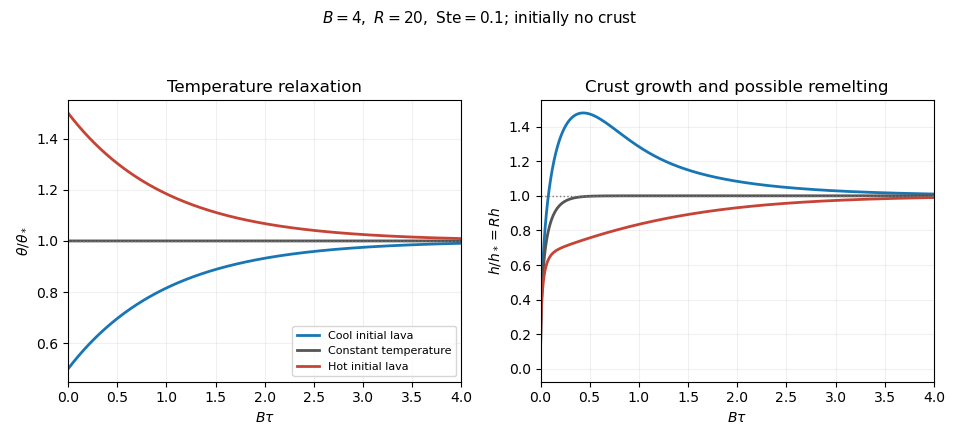

<h1 id="3/solution">Solution</h1>

↑ **Parent:** [3](../3.md)

Introduce [specific heat capacity](../../../../../specific-heat-capacity.md) $c_p$, [latent heat](../../../../../latent-heat.md) per unit mass $L_f$, and $\Delta T=T_m-T_s>0$. Write the prescribed convective [heat flux](../../../../../heat-flux-density.md) as $F=K(\overline T-T_m)$, where

$$
K=\lambda k\left(\frac{\rho_0g\alpha Q}{k\kappa\mu}\right)^{1/5},\qquad k=\rho_0c_p\kappa.
$$

There is a dimensional convention to specify: with $Q$ measured in $\mathrm{W\,kg^{-1}}$ and dimensionless $\lambda$, this printed expression makes $K$ a [heat transfer coefficient](../../../../../heat-transfer-coefficient.md) only if $\mu$ is [kinematic viscosity](../../../../../kinematic-viscosity.md). If $\mu$ denotes [dynamic viscosity](../../../../../dynamic-viscosity.md), the numerator needs $\rho_0^2g\alpha Q$ instead. The question says only “viscosity”; use the consistent kinematic interpretation, or equivalently the corrected dynamic formula. The following balances apply to either convention once $K$ has units $\mathrm{W\,m^{-2}\,K^{-1}}$.

For a thin [lava lake](../../../../../lava-lake.md) crust with a linear [temperature](../../../../../temperature.md) profile, [Fourier's law](../../../../../fourier-s-law.md) gives the outward conductive flux $k\Delta T/a$. The [Stefan condition](../../../../../stefan-condition.md) balances it against upward [thermal convection](../../../../../thermal-convection.md) and freezing, while the well-mixed liquid loses the convective flux and gains [radiogenic heating](../../../../../radiogenic-heating.md). To leading order in $a/H$ the [radiogenically heated lava-lake crust model](../../../../../radiogenically-heated-lava-lake-crust-model.md) is

$$
\boxed{\rho_0L_f\frac{da}{dt}=\frac{k\Delta T}{a}-K(\overline T-T_m),\qquad \rho_0c_pH\frac{d\overline T}{dt}=\rho_0QH-K(\overline T-T_m).}
$$

The fixed surface [temperature](../../../../../temperature.md) already incorporates [radiative cooling](../../../../../radiative-cooling.md), so no extra radiative loss is added to the interior balance. The linear conductive profile is interpreted as a [quasi-steady approximation](../../../../../quasi-steady-approximation.md), so sensible-heat storage within the crust is not evolved. Thinness alone does not establish this approximation: rapid thermal adjustment in the crust is also needed, for example a small [Stefan number](../../../../../stefan-number.md) during the initial conduction-driven growth. Replacing the liquid depth by $H-a$ and retaining the moving liquid-volume enthalpy would introduce thin-crust corrections: the requested constant-temperature branch refers to the leading model above. A transient thermal profile in a thick or newly nucleating crust would require the full [Stefan problem](../../../../../stefan-problem.md), rather than this linear-profile closure.

Using the [thermal diffusion time](../../../../../thermal-diffusion-time.md) $H^2/\kappa$, define

$$
\tau=\frac{\kappa t}{H^2},\qquad h=\frac aH,\qquad \theta=\frac{\overline T-T_m}{\Delta T},\qquad B=\frac{KH}{k},\qquad R=\frac{QH^2}{c_p\kappa\Delta T},\qquad S=\frac{c_p\Delta T}{L_f}.
$$

The three independent dimensionless parameters are the convective-conductive coefficient $B$, the heating parameter $R$, and the [Stefan number](../../../../../stefan-number.md) $S$. For positive $B,R,S$ the evolution equations become

$$
\boxed{\theta'=R-B\theta,\qquad h'=S\left(\frac1h-B\theta\right),}
$$

where prime denotes $d/d\tau$. [Temperature](../../../../../temperature.md) has the exact solution

$$
\boxed{\theta(\tau)=\theta_*+(\theta_0-\theta_*)e^{-B\tau},\qquad \theta_*=R/B.}
$$

Consequently the unique constant-temperature initial condition is

$$
\boxed{\overline T(0)=\overline T_*:=T_m+\frac{\rho_0QH}{K}.}
$$

At this [temperature](../../../../../temperature.md), the convective flux equals the column's radiogenic heat production. Starting with no crust, the [constant-temperature lava-crust growth law](../../../../../constant-temperature-lava-crust-growth-law.md) is obtained by separating $h'=S(1/h-R)$:

$$
\boxed{\tau=\frac{-Rh-\log(1-Rh)}{SR^2},\qquad 0\le h<1/R.}
$$

The crust grows towards $h_*=1/R$, or $a_*=k\Delta T/(\rho_0QH)$, where conduction carries all the radiogenic input. The logarithm makes reaching this equilibrium take infinite time. For an initial thickness $h_0>0$, subtract $[-Rh_0-\log(1-Rh_0)]/(SR^2)$ on the same side of the equilibrium; the corresponding antiderivative uses $\log|1-Rh|$ on either branch. The thin-crust description through equilibrium requires $R\gg1$.

For general initial [temperature](../../../../../temperature.md), the full early and intermediate history is specified by the exact [temperature](../../../../../temperature.md) above and one scalar [ordinary differential equation](../../../../../ordinary-differential-equation.md). A particularly convenient integral formulation for an initially bare surface is

$$
y(\tau)=h(\tau)^2,\qquad y'=2S\left[1-\left(R+B(\theta_0-\theta_*)e^{-B\tau}\right)\sqrt y\right],\qquad y(0)=0.
$$

This removes the infinite initial [derivative](../../../../../derivative.md) of $h$. The right-hand side points into $y>0$ at zero, and is decreasing in $y$ when $\theta_0\ge0$; two nonnegative solutions therefore cannot separate, which gives uniqueness. Its solution, together with the [temperature](../../../../../temperature.md) formula, determines the entire model evolution and can be computed without a phase-boundary search. The early expansion follows by substitution:

$$
\boxed{\begin{aligned}
\theta&=\theta_0+(R-B\theta_0)\tau+O(\tau^2),\\
h&=\sqrt{2S\tau}-\frac23SB\theta_0\tau+O(\tau^{3/2}).
\end{aligned}}
$$

The dimensional leading crust thickness is $a\sim\sqrt{2k\Delta T\,t/(\rho_0L_f)}$. Thus hotter liquid reduces the first correction to conductive crust growth, whereas colder liquid permits more rapid thickening.

If $\theta_0>\theta_*$, the [temperature](../../../../../temperature.md) decreases and the [instantaneous stationary lava-crust thickness](../../../../../instantaneous-stationary-lava-crust-thickness.md) $h_e(\tau)=1/[B\theta(\tau)]$ increases towards $h_*$. Starting from zero, the crust always remains below this rising curve: at a first contact $h'=0$ but $h_e'>0$, so it cannot cross from below. Hence hot-start crust grows monotonically. It also stays thinner than the constant-temperature solution: the early expansion puts it below, and at a proposed first crossing their [derivative](../../../../../derivative.md) difference is $-SB(\theta_0-\theta_*)e^{-B\tau}<0$, preventing crossing from below. If $0\le\theta_0<\theta_*$, the [temperature](../../../../../temperature.md) increases and the [instantaneous stationary lava-crust thickness](../../../../../instantaneous-stationary-lava-crust-thickness.md) decreases. The crust stays thicker than the constant-temperature solution by scalar comparison, but it may cross the decreasing $h_e$, reach a maximum and subsequently melt back towards $h_*$. Such overshoot is possible, not inevitable; the two relevant relaxation rates are $B$ and $SR^2$. The numerical plot uses $B=4$, $R=20$, $S=0.1$, so crust adjustment is faster than [temperature](../../../../../temperature.md) relaxation and the cool-start example does overshoot:

**[Figure 1](#3/image-lava-temperature-and-crust-thickness). Lava temperature and crust thickness**.

The curves use $\theta_0/\theta_*=0.5,1,1.5$ and initially $h=0$. They solve the complete reduced time-dependent equations, rather than replacing the moving stationary thickness by the actual crust. At late times, set $h=h_*+v$, $\delta=\theta_0-\theta_*$; [linearization](../../../../../linearization.md) gives $v'=-SR^2v-SB\delta e^{-B\tau}$. For $SR^2\ne B$,

$$
v=C e^{-SR^2\tau}-\frac{SB\delta}{SR^2-B}e^{-B\tau}+\text{higher-order terms}.
$$

At equal rates the forced term is $-SB\delta\,\tau e^{-B\tau}$. In particular, slow warming with $B<SR^2$ approaches equilibrium from a thicker crust, explaining the plotted remelting. These long-time expressions describe the linearized response; nonlinear corrections can have their own faster exponential rates. All predictions are restricted to $a/H\ll1$, nonnegative liquid superheat, and the assumed vigorous-convection flux law. If crust growth violates those conditions, the reduced model must be replaced rather than extrapolated to total freezing.

## ↑ Ancestors (10)

1. [3](../3.md)
2. [Paper 332](../../paper-332-split.md)
3. [Iii](../../split.md)
4. [2017](../../../split.md)
5. [Past exam of the mathematics course of the University of Cambridge](../../../../split.md)
6. [Mathematics course of the University of Cambridge](../../../../../mathematics-course-of-the-university-of-cambridge.md)
7. [Course of the University of Cambridge](../../../../../course-of-the-university-of-cambridge.md)
8. [University of Cambridge](../../../../../university-of-cambridge-split.md)
9. [List of universities](../../../../../list-of-universities.md)
10. [Codex Wiki](../../../../../split.md)
