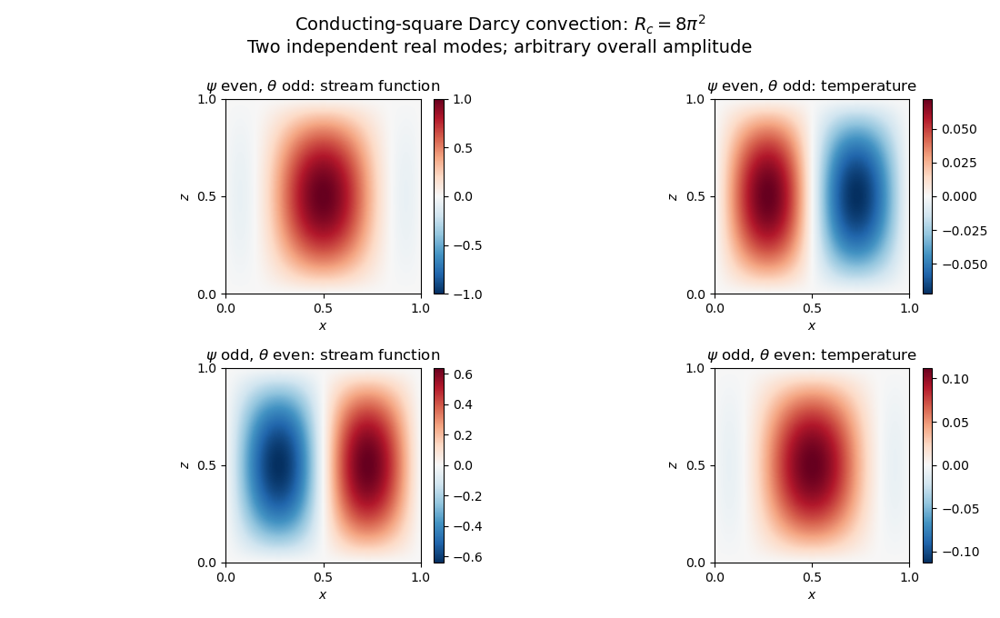

<h1 id="3/a/solution">Solution</h1>

↑ **Parent:** [A](../a.md)

For [Darcy-Bénard convection](../../../../../../darcy-benard-convection.md), the dimensionless [Darcy law](../../../../../../darcy-law.md) is $\mathbf u=-\nabla p+R\theta\mathbf e_z$, with [incompressibility](../../../../../../incompressible-flow.md) and a [heat equation](../../../../../../heat-equation.md) about $T_0=1-z$. Here $R$ is a [Darcy thermal-time Rayleigh number](../../../../../../darcy-thermal-time-rayleigh-number.md), with permeability replacing the squared-depth dependence in the fluid-layer [Rayleigh number](../../../../../../rayleigh-number.md). The stated [stream function](../../../../../../stream-function.md) convention gives $\mathbf u=(-\psi_z,0,\psi_x)$, so $w=\psi_x$. The vertical-plane [curl](../../../../../../curl.md) of [Darcy law](../../../../../../darcy-law.md) gives $\nabla^2\psi=R\theta_x$; omitting the quadratic perturbation [advection](../../../../../../advection.md) from the [heat equation](../../../../../../heat-equation.md) gives $\theta_t=\psi_x+\nabla^2\theta$.

On the impermeable connected square boundary, zero normal [velocity](../../../../../../velocity.md) makes $\psi$ constant along the boundary; choose that constant as zero. The prescribed conductive boundary [temperature](../../../../../../temperature.md) fixes $\theta=0$ on all four sides. Thus the perfect-conductor wording is interpreted through the supplied homogeneous perturbation data: the side [temperatures](../../../../../../temperature.md) retain the background vertical profile, rather than imposing a different isothermal side state.

At marginal stability put $q=\sqrt R$ and $P=\psi+iq\theta$. The two coupled equations imply

$$
\nabla^2P+iqP_x=0,\qquad P=0\text{ on the boundary}.
$$

The [gauge transformation for conducting-square Darcy onset](../../../../../../gauge-transformation-for-conducting-square-darcy-onset.md) $P=e^{-iq(x-1/2)/2}F$ removes the first derivative:

$$
\nabla^2F+\frac{q^2}{4}F=0,\qquad F=0\text{ on the boundary}.
$$

The square's [Dirichlet Laplacian eigenfunctions](../../../../../../dirichlet-laplacian-eigenfunction.md) are $\sin(m\pi x)\sin(n\pi z)$, with [eigenvalues](../../../../../../eigenvalue.md) of $-\nabla^2$ equal to $\pi^2(m^2+n^2)$, $m,n\geq1$. The first marginal value is therefore

$$
\boxed{q_c=2\sqrt2\pi,\qquad R_c=8\pi^2.}
$$

It is genuinely the first instability threshold, not just an isolated neutral value. Eliminating $\psi$ gives the [temperature](../../../../../../temperature.md) [linear operator](../../../../../../linear-operator.md) $L_R=\Delta_D+R\partial_x\Delta_D^{-1}\partial_x$, where $\Delta_D$ is the [Dirichlet realization of an elliptic operator](../../../../../../dirichlet-realization-of-an-elliptic-operator.md) for the [Laplacian](../../../../../../laplacian.md). [Integration by parts](../../../../../../integration-by-parts.md) shows the second term is [self-adjoint](../../../../../../self-adjoint-operator.md) and nonnegative, since its quadratic form is $-\langle\theta_x,\Delta_D^{-1}\theta_x\rangle\geq0$. Thus the spectrum is real, starts negative at $R=0$, and its leading [eigenvalue](../../../../../../eigenvalue.md) cannot cross into growth without a zero [eigenvalue](../../../../../../eigenvalue.md). The smallest zero value is the one found above.

Let $S=\sin\pi x\sin\pi z$, $\xi=x-1/2$ and $a=q_c/2=\sqrt2\pi$. Multiplying the lowest real $F=S$ by independent real and imaginary constants gives two real physical [eigenfunctions](../../../../../../eigenfunction.md):

$$
\boxed{\begin{aligned}(\psi_e,\theta_o)&=(S\cos(a\xi),-S\sin(a\xi)/q_c),\\(\psi_o,\theta_e)&=(S\sin(a\xi),S\cos(a\xi)/q_c).\end{aligned}}
$$

The subscripts indicate even and odd parity about $x=1/2$. Because $S$ is even in $\xi$, the first has even $\psi$ and odd $\theta$, while the second reverses those parities. They are linearly independent and satisfy all four [Dirichlet boundary conditions](../../../../../../dirichlet-boundary-condition.md). The lowest complex $F$ [eigenfunction](../../../../../../eigenfunction.md) is simple over the complex numbers, but its arbitrary complex multiplier supplies two independent real pairs; this explains the physical degeneracy.

**[Figure 1](#3/a/image-neutral-and-oscillatory-modes-in-porous-convection). Neutral and oscillatory modes in porous convection**.

## ↑ Ancestors (11)

1. [A](../a.md)
2. [3](../../3.md)
3. [Paper 337](../../../paper-337-split.md)
4. [Iii](../../../split.md)
5. [2017](../../../../split.md)
6. [Past exam of the mathematics course of the University of Cambridge](../../../../../split.md)
7. [Mathematics course of the University of Cambridge](../../../../../../mathematics-course-of-the-university-of-cambridge.md)
8. [Course of the University of Cambridge](../../../../../../course-of-the-university-of-cambridge.md)
9. [University of Cambridge](../../../../../../university-of-cambridge-split.md)
10. [List of universities](../../../../../../list-of-universities.md)
11. [Codex Wiki](../../../../../../split.md)
