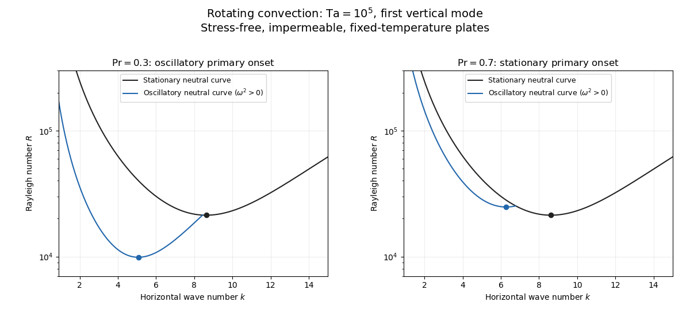

<h1 id="4/solution">Solution</h1>

↑ **Parent:** [4](../4.md)

Consider a horizontal fluid layer under the [Boussinesq approximation](../../../../../boussinesq-approximation.md) heated from below, rotating uniformly about its vertical axis. To make the linear formulas definite, take depth one, stress-free impermeable fixed-temperature plates, a horizontally infinite or sufficiently large periodic domain, and negligible centrifugal-buoyancy modifications. Rigid plates change the vertical [eigenfunctions](../../../../../eigenfunction.md) and thresholds and require their own [boundary value problem](../../../../../boundary-value-problem.md); the explicit formulas below use the free-slip model. Let $P=\nu/\kappa_T$ be the [Prandtl number](../../../../../prandtl-number.md), $\mathrm{Ta}=(2\Omega d^2/\nu)^2$ the [Taylor number](../../../../../taylor-number.md), and $R$ the [Rayleigh number](../../../../../rayleigh-number.md). Time is again measured on the [thermal diffusion time](../../../../../thermal-diffusion-time.md).

The linearized [rotating Rayleigh-Bénard convection](../../../../../rotating-rayleigh-benard-convection.md) equations about conduction are

$$
P^{-1}\partial_t\mathbf u+\sqrt{\mathrm{Ta}}\,\mathbf e_z\times\mathbf u=-\nabla p+R\theta\mathbf e_z+\Delta\mathbf u,\qquad\nabla\cdot\mathbf u=0,\qquad\partial_t\theta=w+\Delta\theta.
$$

The [Coriolis force](../../../../../coriolis-force.md) does no work on the fluid, but it couples vertical motion to vertical [vorticity](../../../../../vorticity.md) and thereby changes the balance of [buoyancy](../../../../../buoyancy.md) and viscous damping. On the plates require $w=\theta=0$ and $\partial_z u_x=\partial_z u_y=0$. Write $\zeta=(\nabla\times\mathbf u)_z$. Taking a [curl](../../../../../curl.md) and a double [curl](../../../../../curl.md) removes [pressure](../../../../../pressure.md) and gives

$$
(P^{-1}\partial_t-\Delta)\zeta=\sqrt{\mathrm{Ta}}\,w_z,\qquad (P^{-1}\partial_t-\Delta)\Delta w+\sqrt{\mathrm{Ta}}\,\zeta_z=R\Delta_h\theta.
$$

A [normal mode](../../../../../normal-mode.md) with horizontal [wavenumber](../../../../../wavenumber.md) $k>0$, vertical index $n\geq1$ and complex growth rate $s$ has $w=W\sin(n\pi z)e^{st+i\mathbf k\cdot\mathbf x}$, $\theta=\Theta\sin(n\pi z)e^{st+i\mathbf k\cdot\mathbf x}$ and $\zeta=Z\cos(n\pi z)e^{st+i\mathbf k\cdot\mathbf x}$. Put $a=k^2+n^2\pi^2$. The three equations become $a(s/P+a)W+\sqrt{\mathrm{Ta}}n\pi Z=Rk^2\Theta$, $(s/P+a)Z=\sqrt{\mathrm{Ta}}n\pi W$, and $(s+a)\Theta=W$. Their determinant gives the [rotating-convection growth-rate polynomial](../../../../../rotating-convection-growth-rate-polynomial.md)

$$
\boxed{(s+a)\left[a(s/P+a)^2+\mathrm{Ta}\,n^2\pi^2\right]-Rk^2(s/P+a)=0.}
$$

This cubic includes viscous and thermal modes as well as the convective instability. It avoids excluding a root by division by $s/P+a$. Linear stability means every root has negative real part; stationary onset has $s=0$, while [overstability](../../../../../overstability.md) has $s=\pm i\omega$ with nonzero [angular frequency](../../../../../angular-frequency.md).

Setting $s=0$ gives the [stationary neutral curve of rotating convection](../../../../../stationary-neutral-curve-of-rotating-convection.md)

$$
\boxed{R_s(k,n)=\frac{(k^2+n^2\pi^2)^3+\mathrm{Ta}\,n^2\pi^2}{k^2}.}
$$

For [oscillatory convection](../../../../../oscillatory-convection.md), set $s=i\omega$ and equate real and imaginary parts. Eliminating $R$ yields

$$
\boxed{\omega^2=P^2\left[\frac{1-P}{1+P}\frac{\mathrm{Ta}\,n^2\pi^2}{a}-a^2\right],\qquad R_o=\frac{2(1+P)a^3+2P^2\mathrm{Ta}\,n^2\pi^2/(1+P)}{k^2}.}
$$

The [oscillatory neutral curve of rotating convection](../../../../../oscillatory-neutral-curve-of-rotating-convection.md) is physically admissible only when $\omega^2>0$. Thus $P<1$ and sufficiently rapid rotation are necessary; a formal minimum with $\omega^2\leq0$ is not a [Hopf bifurcation](../../../../../hopf-bifurcation.md). Convection begins at the smaller of the stationary minimum and the admissible oscillatory minimum. The [angular frequency](../../../../../angular-frequency.md) approaches zero where a fixed-wave-number stationary and oscillatory threshold meet; that is a double-zero limit of the cubic, requiring a different slow-time reduction.

For [wavenumber selection in rotating convection](../../../../../wavenumber-selection-in-rotating-convection.md), the lowest vertical index is $n=1$. To compare indices, set $k^2=n^2\pi^2y$ at fixed $y>0$. Both neutral thresholds have a positive term proportional to $n^4$ and a rotation term independent of $n$, while the admissible [angular frequency](../../../../../angular-frequency.md) squared decreases with $n$. Their minima therefore cannot improve on $n=1$. Set $t=k^2$, $m=\pi^2$. Minimizing each neutral curve gives

$$
\boxed{(t+m)^2(2t-m)=\mathrm{Ta}\,m\quad\text{for stationary onset},\qquad (t+m)^2(2t-m)=\frac{P^2}{(1+P)^2}\mathrm{Ta}\,m\quad\text{for oscillatory onset}.}
$$

For the latter equation also check $\omega^2>0$, or minimize over the admissible set instead. Without rotation, $k_c=\pi/\sqrt2$ and $R_c=27\pi^4/4$. At rapid rotation, $k_s\sim(\mathrm{Ta}\pi^2/2)^{1/6}$ and $R_{s,c}\sim3(\mathrm{Ta}\pi^2/2)^{2/3}$: rotation narrows the horizontal [convection rolls](../../../../../convection-roll.md) and raises their threshold. In a finite box only discrete [wavenumbers](../../../../../wavenumber.md) are permitted, so the minimum must be taken over those allowed modes.

The rapid-rotation comparison has $R_{o,c}/R_{s,c}\sim2P^{4/3}/(1+P)^{1/3}$. Its equality gives $8P^4-P-1=0$, with positive root about $0.67660$. Below this value, sufficiently rapid rotation can make [oscillatory convection](../../../../../oscillatory-convection.md) the primary instability; low [Prandtl number](../../../../../prandtl-number.md) allows inertial motions to interact with the thermal field before viscosity damps them. This estimate describes the selected neutral-curve comparison in the stated free-slip asymptotic model, rather than claiming every $P<1$ has oscillatory primary onset at every rotation rate.

**[Figure 2](#4/image-neutral-curves-for-rotating-convection). Neutral curves for rotating convection**.

Linear selection does not determine the nonlinear planform or its stability. A [weakly nonlinear expansion](../../../../../weakly-nonlinear-expansion.md) with a [solvability condition](../../../../../solvability-condition.md) gives [amplitude equations](../../../../../amplitude-equation.md). A stationary [convection roll](../../../../../convection-roll.md) amplitude has the [Landau amplitude equation](../../../../../landau-amplitude-equation.md) $A_T=rA-g|A|^2A$; a supercritical branch requires $g>0$ and has $|A|^2=r/g$, whereas $g<0$ requires higher-order saturation and permits subcritical behaviour. The coefficient depends on the physical parameters and [boundary conditions](../../../../../boundary-condition.md), and should not be assumed positive merely because the linear threshold is known.

A nonzero-frequency [Hopf bifurcation](../../../../../hopf-bifurcation.md) supplies oppositely travelling [convection roll](../../../../../convection-roll.md) amplitudes $Z_+,Z_-$. At a fixed orientation, a cubic normal form is

$$
\partial_TZ_\pm=(r+i\omega_0)Z_\pm-(g|Z_\pm|^2+h|Z_\mp|^2)Z_\pm,
$$

with complex $g,h$ and the understood [symmetry](../../../../../symmetry-physics.md) exchanging propagation directions. For $r>0$ and $g_r=\operatorname{Re}g>0$, a travelling-roll branch has one nonzero amplitude, of squared modulus $r/g_r$; it is stable to the opposite travelling amplitude when $h_r=\operatorname{Re}h>g_r$. A standing-roll branch has equal squared moduli $r/(g_r+h_r)$, and is stable within this pair when $g_r>h_r$ and $g_r+h_r>0$. The imaginary parts shift [angular frequencies](../../../../../angular-frequency.md). These conditions concern amplitude perturbations in that reduced subspace; orientation and modulation modes still have to be tested. This is the competition of [travelling and standing convection rolls](../../../../../travelling-and-standing-convection-rolls.md).

Near simultaneous stationary and oscillatory thresholds, a [codimension-two bifurcation](../../../../../codimension-two-bifurcation.md) requires retaining both types of mode. After selecting an orientation and fixing a steady spatial phase, a schematic nonresonant [steady–Hopf mode interaction](../../../../../steady-hopf-mode-interaction.md) is

$$
\dot a=r_sa-g_sa^3-h_sa|z|^2,\qquad\dot z=(r_o+i\omega_0)z-g_o|z|^2z-h_oa^2z.
$$

Here $a$ is real, $z$ is the chosen complex oscillatory amplitude, $g_s,h_s$ are real, and $g_o,h_o$ may be complex. Assume $r_s>0$, $g_s>0$ for a radially stable pure steady branch, and $r_o>0$, $g_{o,r}=\operatorname{Re}(g_o)>0$ for a radially stable pure oscillatory branch. Steady [convection rolls](../../../../../convection-roll.md) suppress the oscillatory mode if $r_o-h_{o,r}r_s/g_s<0$, where $h_{o,r}=\operatorname{Re}(h_o)$; oscillatory [convection rolls](../../../../../convection-roll.md) suppress the steady mode if $r_s-h_sr_o/g_{o,r}<0$. These are transverse tests for branches whose existence and radial stability have already been checked. Mixed states have positive intensities $u=a^2$, $v=|z|^2$ solving $g_su+h_sv=r_s$, $h_{o,r}u+g_{o,r}v=r_o$. If $D=g_sg_{o,r}-h_sh_{o,r}\neq0$, then $u=(r_sg_{o,r}-h_sr_o)/D$, $v=(g_sr_o-h_{o,r}r_s)/D$. For positive $u,v$ and the positive self-saturation coefficients above, the intensity [Jacobian matrix](../../../../../jacobian-matrix.md) has negative trace and determinant $4uvD$, so the mixed state is attracting in intensities when $D>0$ and is a [saddle equilibrium](../../../../../saddle-equilibrium.md) when $D<0$; phase and other-mode perturbations remain separate tests. Depending on the cross-couplings, one obtains coexistence or competition and bistability; degeneracies or resonances require extra terms. A full travelling/standing-wave competition must retain both $Z_\pm$, not just this illustrative one-mode $z$. If the Hopf [angular frequency](../../../../../angular-frequency.md) tends to zero, averaging over fast oscillations fails and a double-zero normal form must keep the corresponding two slow variables. A crossing of global minima at distinct [wavenumbers](../../../../../wavenumber.md) is instead an interaction of distinct modes, not automatically the same double-zero problem.

Weakly nonlinear [convection rolls](../../../../../convection-roll.md) can also lose stability spatially. The [real Ginzburg–Landau equation](../../../../../real-ginzburg-landau-equation.md) $A_T=rA+\xi A_{XX}-g|A|^2A$, with $r,\xi,g>0$, has detuned [convection rolls](../../../../../convection-roll.md) with $|A|^2=(r-\xi Q^2)/g$. Linear phase modulation gives diffusion coefficient $\xi(r-3\xi Q^2)/(r-\xi Q^2)$, so the [Eckhaus instability](../../../../../eckhaus-instability.md) excludes $Q^2>r/(3\xi)$ even though [convection rolls](../../../../../convection-roll.md) exist up to $Q^2<r/\xi$. Transverse bending and mean-flow couplings impose additional restrictions in the actual rotating layer; the scalar equation is a local longitudinal example, not its complete stability theory.

Most distinctively, rotation breaks mirror [symmetry](../../../../../symmetry-physics.md) between competing [convection roll](../../../../../convection-roll.md) orientations. For two sets of [convection rolls](../../../../../convection-roll.md) at relative angle $\vartheta$, write $\dot A_2=rA_2-g_0|A_2|^2A_2-g(\vartheta)|A_1|^2A_2$ and interchange indices with $\vartheta\mapsto-\vartheta$ for the other equation. The established [convection roll](../../../../../convection-roll.md) $|A_1|^2=r/g_0$ is unstable to the new orientation when its linear growth rate $r[1-g(\vartheta)/g_0]$ is positive. The inequality need not be symmetric under $\vartheta\mapsto-\vartheta$ because the imposed rotation supplies handedness. This is the [Küppers–Lortz instability](../../../../../kuppers-lortz-instability.md): sufficiently rapid rotation can destabilize steady [convection rolls](../../../../../convection-roll.md) immediately above their stationary onset to oblique [convection rolls](../../../../../convection-roll.md) of another orientation. Successive replacements can produce time-dependent [convection roll](../../../../../convection-roll.md) switching or [heteroclinic cycles](../../../../../heteroclinic-cycle.md), instead of a stable single [convection roll](../../../../../convection-roll.md) pattern. It requires three-dimensional perturbations even when the original [convection roll](../../../../../convection-roll.md) solution is independent of its axial coordinate.

At finite [Prandtl number](../../../../../prandtl-number.md) and stress-free plates, nearly parallel [convection rolls](../../../../../convection-roll.md) can couple resonantly to a slowly damped large-scale [Eulerian mean flow](../../../../../eulerian-mean-flow.md). This [small-angle instability of rotating convection rolls](../../../../../small-angle-instability-of-rotating-convection-rolls.md) makes a regular two-roll expansion nonuniform as the angle tends to zero; one must retain the mean-flow mode. It should not be identified automatically with the finite-angle [Küppers–Lortz instability](../../../../../kuppers-lortz-instability.md) or assigned a universal threshold from a one-amplitude equation. Consequently **the onset type and selected scale follow from the admissible neutral curves, while persistent [convection roll](../../../../../convection-roll.md) patterns require a separate nonlinear and sideband stability calculation**.

## ↑ Ancestors (10)

1. [4](../4.md)
2. [Paper 337](../../paper-337-split.md)
3. [Iii](../../split.md)
4. [2017](../../../split.md)
5. [Past exam of the mathematics course of the University of Cambridge](../../../../split.md)
6. [Mathematics course of the University of Cambridge](../../../../../mathematics-course-of-the-university-of-cambridge.md)
7. [Course of the University of Cambridge](../../../../../course-of-the-university-of-cambridge.md)
8. [University of Cambridge](../../../../../university-of-cambridge-split.md)
9. [List of universities](../../../../../list-of-universities.md)
10. [Codex Wiki](../../../../../split.md)
