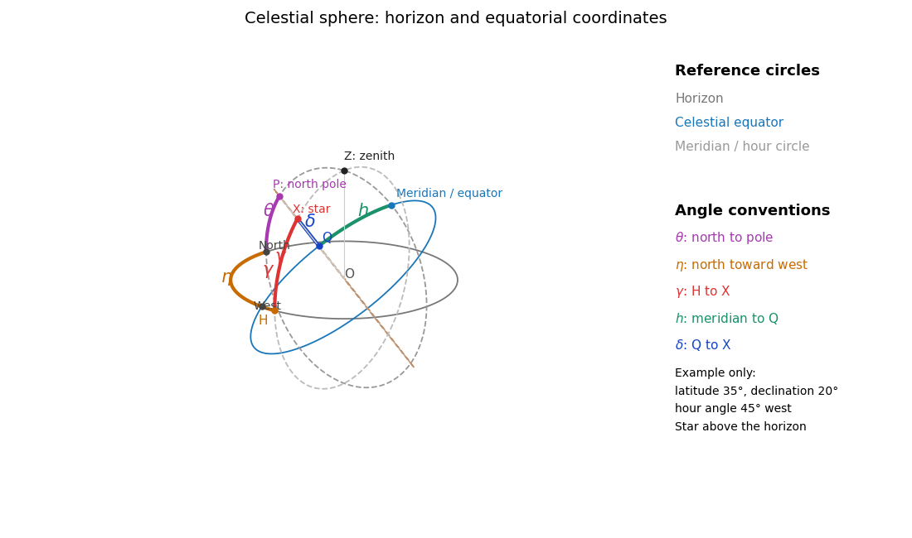
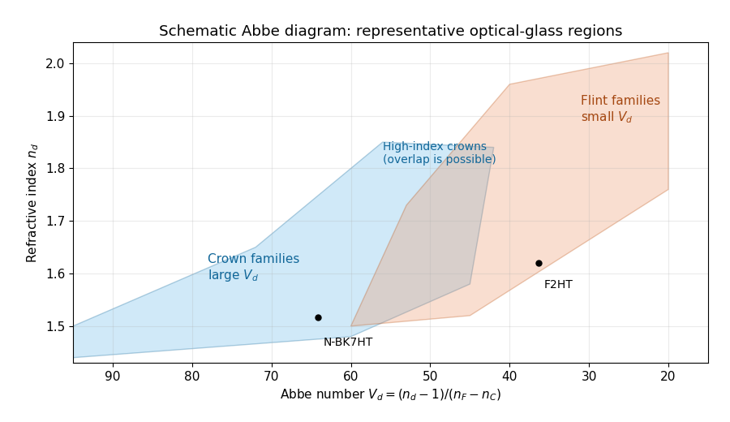

# Paper 338

↑ **Parent:** [Iii](../iii.md)

[https://www.maths.cam.ac.uk/postgrad/part-iii/files/pastpapers/2017/paper_338.pdf](https://www.maths.cam.ac.uk/postgrad/part-iii/files/pastpapers/2017/paper_338.pdf)

**Table of contents**

- [1](#1)
  - [a](#1/a)
    - [i](#1/a/i)
      - [Solution](#1/a/i/solution)
    - [ii](#1/a/ii)
      - [Solution](#1/a/ii/solution)
    - [iii](#1/a/iii)
      - [Solution](#1/a/iii/solution)
  - [b](#1/b)
    - [i](#1/b/i)
      - [Solution](#1/b/i/solution)
    - [ii](#1/b/ii)
      - [Solution](#1/b/ii/solution)
  - [c](#1/c)
    - [i](#1/c/i)
      - [Solution](#1/c/i/solution)
    - [ii](#1/c/ii)
      - [Solution](#1/c/ii/solution)
    - [iii](#1/c/iii)
      - [Solution](#1/c/iii/solution)
    - [iv](#1/c/iv)
      - [Solution](#1/c/iv/solution)
- [2](#2)
  - [a](#2/a)
    - [i](#2/a/i)
      - [Solution](#2/a/i/solution)
    - [ii](#2/a/ii)
      - [Solution](#2/a/ii/solution)
    - [iii](#2/a/iii)
      - [Solution](#2/a/iii/solution)
    - [iv](#2/a/iv)
      - [Solution](#2/a/iv/solution)
    - [v](#2/a/v)
      - [Solution](#2/a/v/solution)
  - [b](#2/b)
    - [i](#2/b/i)
      - [Solution](#2/b/i/solution)
    - [ii](#2/b/ii)
      - [Solution](#2/b/ii/solution)
  - [c](#2/c)
    - [i](#2/c/i)
      - [Solution](#2/c/i/solution)
    - [ii](#2/c/ii)
      - [Solution](#2/c/ii/solution)
- [3](#3)
  - [a](#3/a)
    - [i](#3/a/i)
      - [Solution](#3/a/i/solution)
    - [ii](#3/a/ii)
      - [Solution](#3/a/ii/solution)
    - [iii](#3/a/iii)
      - [Solution](#3/a/iii/solution)
    - [iv](#3/a/iv)
      - [Solution](#3/a/iv/solution)
  - [b](#3/b)
    - [i](#3/b/i)
      - [Solution](#3/b/i/solution)
    - [ii](#3/b/ii)
      - [Solution](#3/b/ii/solution)
  - [c](#3/c)
    - [i](#3/c/i)
      - [Solution](#3/c/i/solution)
    - [ii](#3/c/ii)
      - [Solution](#3/c/ii/solution)
    - [iii](#3/c/iii)
      - [Solution](#3/c/iii/solution)
    - [iv](#3/c/iv)
      - [Solution](#3/c/iv/solution)
    - [v](#3/c/v)
      - [Solution](#3/c/v/solution)

## 1

↑ **Parent:** [Paper 338](paper-338.md)

<h3 id="1/a">a</h3>

↑ **Parent:** [1](#1)

<h4 id="1/a/i">i</h4>

↑ **Parent:** [A](#1/a)

<h5 id="1/a/i/solution">Solution</h5>

↑ **Parent:** [I](#1/a/i)

Use [azimuth](../../../astrophysics.md#azimuth) measured from north toward west, and positive [hour angle](../../../astrophysics.md#hour-angle) westward. These conventions are forced by the signs in the coordinate formulae. In the diagram the observer is at $O$, the local vertical meets the [celestial sphere](../../../astrophysics.md#celestial-sphere) at the [zenith](../../../astrophysics.md#zenith) $Z$, and the north [celestial pole](../../../astrophysics.md#celestial-pole) is $P$. The [astronomical horizon](../../../astrophysics.md#astronomical-horizon) is perpendicular to $OZ$; the [celestial equator](../../../astrophysics.md#celestial-equator) is perpendicular to $OP$. Their intersections with the [celestial meridian](../../../astrophysics.md#celestial-meridian) give the north horizon point and the upper equatorial meridian point.

**[Figure 1](#1/a/i/image-the-celestial-sphere-with-horizon-and-equatorial-coordinates). The celestial sphere with horizon and equatorial coordinates**.

The north [celestial pole](../../../astrophysics.md#celestial-pole) has [altitude](../../../astrophysics.md#altitude) $\theta$; thus the [angle](../../../geometry-and-topology.md#angle) between $OP$ and $OZ$ is $90^\circ-\theta$. Project $X$ along its vertical [great circle](../../../geometry-and-topology.md#great-circle) onto the [astronomical horizon](../../../astrophysics.md#astronomical-horizon) at $H$: the arc $HX$ is the [altitude](../../../astrophysics.md#altitude) $\gamma$, and the westward horizon arc from north to $H$ is the [azimuth](../../../astrophysics.md#azimuth) $\eta$. Project $X$ along its hour circle onto the [celestial equator](../../../astrophysics.md#celestial-equator) at $Q$: the arc $QX$ is the [declination](../../../astrophysics.md#declination) $\delta$, and the westward equatorial arc from the upper [celestial meridian](../../../astrophysics.md#celestial-meridian) to $Q$ is the [hour angle](../../../astrophysics.md#hour-angle) $h$. Equivalently the triangle on the [celestial sphere](../../../astrophysics.md#celestial-sphere) $PZX$ has sides $PZ=90^\circ-\theta$, $PX=90^\circ-\delta$ and $ZX=90^\circ-\gamma$. **All five [angles](../../../geometry-and-topology.md#angle) refer to arcs on their specified reference circles, not arbitrary [angles](../../../geometry-and-topology.md#angle) in the projected drawing.**

<h4 id="1/a/ii">ii</h4>

↑ **Parent:** [A](#1/a)

<h5 id="1/a/ii/solution">Solution</h5>

↑ **Parent:** [Ii](#1/a/ii)

Let $\mathbf n,\mathbf w,\mathbf u$ be orthonormal [unit vectors](../../../vector-space.md#unit-vector) north, west and upward. A direction of [altitude](../../../astrophysics.md#altitude) $\gamma$ and westward [azimuth](../../../astrophysics.md#azimuth) $\eta$ is

$$
\mathbf x=\cos\gamma\cos\eta\,\mathbf n+\cos\gamma\sin\eta\,\mathbf w+\sin\gamma\,\mathbf u.
$$

The north [celestial pole](../../../astrophysics.md#celestial-pole) and the upper equatorial meridian direction are

$$
\mathbf p=\cos\theta\,\mathbf n+\sin\theta\,\mathbf u,\qquad
\mathbf e=-\sin\theta\,\mathbf n+\cos\theta\,\mathbf u.
$$

In the [equatorial coordinate system](../../../astrophysics.md#equatorial-coordinate-system), the same [unit vector](../../../vector-space.md#unit-vector) is $\mathbf x=\sin\delta\,\mathbf p+\cos\delta(\cos h\,\mathbf e+\sin h\,\mathbf w)$. Taking [dot products](../../../linear-algebra.md#dot-product) with $\mathbf p,\mathbf w,\mathbf e$ respectively gives

$$
\boxed{\begin{aligned}
\sin\delta&=\sin\gamma\sin\theta+\cos\gamma\cos\theta\cos\eta,\\
\cos\delta\sin h&=\sin\eta\cos\gamma,\\
\cos\delta\cos h&=\sin\gamma\cos\theta-\cos\gamma\sin\theta\cos\eta.
\end{aligned}}
$$

This is an [orthogonal transformation](../../../linear-algebra.md#orthogonal-transformation) between two [bases](../../../vector-space.md#basis), so it preserves the length of the direction vector. Recover $h$ from both its [sine](../../../geometry-and-topology.md#sine) and [cosine](../../../geometry-and-topology.md#cosine) to keep the correct quadrant. At the [zenith](../../../astrophysics.md#zenith), [azimuth](../../../astrophysics.md#azimuth) itself is undefined; the vector equations remain meaningful by continuity. Using the more usual eastward [azimuth](../../../astrophysics.md#azimuth) changes the sign of the second equation.

<h4 id="1/a/iii">iii</h4>

↑ **Parent:** [A](#1/a)

<h5 id="1/a/iii/solution">Solution</h5>

↑ **Parent:** [Iii](#1/a/iii)

Local [sidereal time](../../../astrophysics.md#sidereal-time) is the [right ascension](../../../astrophysics.md#right-ascension) on the upper [celestial meridian](../../../astrophysics.md#celestial-meridian). Since [right ascension](../../../astrophysics.md#right-ascension) increases eastward while [hour angle](../../../astrophysics.md#hour-angle) increases westward, their difference is

$$
\boxed{h=\mathrm{LST}-\alpha\pmod{24\ \mathrm{hours}}.}
$$

One hour of either coordinate is $15^\circ$. For a fixed stellar direction, $h$ increases at the sidereal rotation rate. Mean [sidereal time](../../../astrophysics.md#sidereal-time) should be used with mean [right ascension](../../../astrophysics.md#right-ascension), or apparent [sidereal time](../../../astrophysics.md#sidereal-time) with apparent [right ascension](../../../astrophysics.md#right-ascension), for the same reference equinox.

<h3 id="1/b">b</h3>

↑ **Parent:** [1](#1)

<h4 id="1/b/i">i</h4>

↑ **Parent:** [B](#1/b)

<h5 id="1/b/i/solution">Solution</h5>

↑ **Parent:** [I](#1/b/i)

Write $T_{\rm sid}$ for one sidereal day in minutes and $\Omega_{\rm sid}=2\pi/T_{\rm sid}$. An equatorial [star](../../../stellar-astrophysics.md#star) at an equatorial site rises along a vertical [great circle](../../../geometry-and-topology.md#great-circle), passes through the [zenith](../../../astrophysics.md#zenith), and descends on the opposite side. Its [azimuth](../../../astrophysics.md#azimuth) changes by $\pi$ at the crossing. The restricted [altitude](../../../astrophysics.md#altitude) travel prevents following it continuously by rotating over the [zenith](../../../astrophysics.md#zenith).

The maximum [azimuth](../../../astrophysics.md#azimuth) rate is $\Omega_{\rm az}=2\pi\omega$ radians per minute, so the shortest half-turn takes $\Delta t=\pi/\Omega_{\rm az}=1/(2\omega)$ minutes. During that lost-track interval the [star](../../../stellar-astrophysics.md#star) moves through

$$
\boxed{\phi_{\rm full}=\Omega_{\rm sid}\Delta t=\frac{\pi}{\omega T_{\rm sid}}\ \mathrm{radians}=\frac{180^\circ}{\omega T_{\rm sid}}.}
$$

For $T_{\rm sid}\simeq1436.07$ minutes this is approximately $0.12534^\circ/\omega$; using a 24-hour day gives $0.125^\circ/\omega$. If the quoted [zenith blind spot](../../../optics.md#zenith-blind-spot) size means the angular radius of a symmetrically placed crossing gap, it is $\phi_{\rm full}/2$, approximately $0.06267^\circ/\omega$.

This derives the ideal crossing-gap size with instantaneous acceleration and an available [altitude](../../../astrophysics.md#altitude) drive. It does not uniquely define a circular forbidden region for all nearby trajectories. For example, at an equatorial site a [star](../../../stellar-astrophysics.md#star) of small nonzero [declination](../../../astrophysics.md#declination) $\delta$ has maximum [azimuth](../../../astrophysics.md#azimuth) rate $\Omega_{\rm sid}|\cot\delta|$ at transit: its minimum offset is constrained by $|\tan\delta|\ge\Omega_{\rm sid}/\Omega_{\rm az}$. That rate contour and the half-turn crossing gap are different definitions of a [zenith blind spot](../../../optics.md#zenith-blind-spot). Actual tracking footprints also depend on acceleration and the reacquisition strategy, as discussed in [the telescope designers' tracking discussion](https://www.astro.uni.torun.pl/~kb/HandbRT32/ChapterII.htm).

<h4 id="1/b/ii">ii</h4>

↑ **Parent:** [B](#1/b)

<h5 id="1/b/ii/solution">Solution</h5>

↑ **Parent:** [Ii](#1/b/ii)

A [star](../../../stellar-astrophysics.md#star) of [declination](../../../astrophysics.md#declination) $\delta=\theta$ crosses the [zenith](../../../astrophysics.md#zenith). Its direction rotates around the [celestial pole](../../../astrophysics.md#celestial-pole) at $\Omega_{\rm sid}$, but its actual [angular velocity](../../../classical-mechanics.md#angular-velocity) on the [celestial sphere](../../../astrophysics.md#celestial-sphere) is $\Omega_{\rm sid}\cos\theta$. Consequently the small-angle crossing-gap estimate becomes

$$
\boxed{\phi_{\rm full}\simeq\frac{\pi\cos\theta}{\omega T_{\rm sid}},\qquad
\phi_{\rm radius}\simeq\frac{\pi\cos\theta}{2\omega T_{\rm sid}}.}
$$

For clarity, the factor $\cos\theta$ is the radius of the [star](../../../stellar-astrophysics.md#star)'s daily circle on a unit [celestial sphere](../../../astrophysics.md#celestial-sphere); it does not modify the sidereal [hour angle](../../../astrophysics.md#hour-angle) rate.

The estimate assumes the required slew is nearly $180^\circ$. A more exact ideal symmetric reacquisition calculation is possible. Let the endpoints have [hour angles](../../../astrophysics.md#hour-angle) $-H,+H$ and suppose $0<\theta<\pi/2$, $H$ small enough that both endpoints are above the [astronomical horizon](../../../astrophysics.md#astronomical-horizon). The horizontal direction components are $n=\sin\theta\cos\theta(1-\cos H)$ and $w=\pm\cos\theta\sin H$. Their shortest [azimuth](../../../astrophysics.md#azimuth) separation is

$$
\Delta\eta(H)=2\arctan\!\left(\frac{\cot(H/2)}{\sin\theta}\right).
$$

The minimum ideal gap satisfies $2H\Omega_{\rm az}/\Omega_{\rm sid}=\Delta\eta(H)$; its angular separation is $\phi_{\rm full}=2\arcsin(\cos\theta\sin H)$. Expanding for a fast drive gives the boxed expression. At an equatorial site $\Delta\eta=\pi$ exactly. At a geographic pole the direction with $\delta=\theta$ is stationary, so the crossing argument is inapplicable and the limit is zero. A full near-[zenith](../../../astrophysics.md#zenith) rate-limited footprint still requires specifying the trajectory and drive model.

<h3 id="1/c">c</h3>

↑ **Parent:** [1](#1)

<h4 id="1/c/i">i</h4>

↑ **Parent:** [C](#1/c)

<h5 id="1/c/i/solution">Solution</h5>

↑ **Parent:** [I](#1/c/i)

For thin contacting components, [optical powers](../../../optics.md#optical-power) add. At [wavelength](../../../wave-equation.md#wavelength) $\lambda$ the total [optical power](../../../optics.md#optical-power) is $\Phi(\lambda)=\rho_1[n_1(\lambda)-1]+\rho_2[n_2(\lambda)-1]$. An [achromatic lens](../../../optics.md#achromatic-lens) has $\Phi_F=\Phi_C$, hence

$$
\rho_1(n_{1F}-n_{1C})+\rho_2(n_{2F}-n_{2C})=0,
\qquad
\boxed{\frac{\rho_1}{\rho_2}=-\frac{n_{2F}-n_{2C}}{n_{1F}-n_{1C}}.}
$$

For normally dispersive [optical glasses](../../../optics.md#optical-glass), both index differences are positive, so the two components have opposite curvature factors and opposite [optical powers](../../../optics.md#optical-power). This uses the thin [Lensmaker's equation](../../../optics.md#lensmaker-s-equation); finite thickness and separated principal planes require a more detailed design. If the denominator vanishes, use the undivided power-balance equation rather than this ratio. Two-wavelength correction alone does not eliminate the residual [chromatic aberration](../../../optics.md#chromatic-aberration) at every intermediate [wavelength](../../../wave-equation.md#wavelength).

<h4 id="1/c/ii">ii</h4>

↑ **Parent:** [C](#1/c)

<h5 id="1/c/ii/solution">Solution</h5>

↑ **Parent:** [Ii](#1/c/ii)

At the $d$ line, the [focal lengths](../../../optics.md#focal-length) obey $1/f_{id}=(n_{id}-1)\rho_i$. Thus

$$
\frac{f_{2d}}{f_{1d}}=\frac{(n_{1d}-1)\rho_1}{(n_{2d}-1)\rho_2}
=-\frac{(n_{1d}-1)(n_{2F}-n_{2C})}{(n_{2d}-1)(n_{1F}-n_{1C})}.
$$

Rearranging gives

$$
\boxed{\frac{f_{2d}}{f_{1d}}=-\frac{(n_{2F}-n_{2C})/(n_{2d}-1)}{(n_{1F}-n_{1C})/(n_{1d}-1)}=-\frac{V_{1d}}{V_{2d}}.}
$$

The last equality uses the [Abbe number](../../../optics.md#abbe-number) definition. The minus sign signifies a converging and a diverging component, with the normal [optical glass](../../../optics.md#optical-glass) convention and nonzero finite [focal lengths](../../../optics.md#focal-length).

<h4 id="1/c/iii">iii</h4>

↑ **Parent:** [C](#1/c)

<h5 id="1/c/iii/solution">Solution</h5>

↑ **Parent:** [Iii](#1/c/iii)

Set $\Phi_i=1/f_{id}$ and $\Phi=1/f_d$. The [achromatic doublet power balance](../../../optics.md#achromatic-doublet-power-balance) gives two linear equations:

$$
\Phi_1+\Phi_2=\Phi,\qquad\frac{\Phi_1}{V_{1d}}+\frac{\Phi_2}{V_{2d}}=0.
$$

For distinct nonzero [Abbe numbers](../../../optics.md#abbe-number), solving yields $\Phi_1=\Phi V_{1d}/(V_{1d}-V_{2d})$ and $\Phi_2=-\Phi V_{2d}/(V_{1d}-V_{2d})$, and therefore

$$
\boxed{f_{1d}=f_d\frac{V_{1d}-V_{2d}}{V_{1d}},\qquad
f_{2d}=f_d\frac{V_{2d}-V_{1d}}{V_{2d}}.}
$$

Equal [Abbe numbers](../../../optics.md#abbe-number) force the total [optical power](../../../optics.md#optical-power) to vanish under the achromatic condition; they cannot give a nonzero-power thin [achromatic lens](../../../optics.md#achromatic-lens). Closely matched [Abbe numbers](../../../optics.md#abbe-number) require large opposing component powers and are generally unattractive because of the resulting sensitivity and other [optical aberrations](../../../optics.md#optical-aberration).

<h4 id="1/c/iv">iv</h4>

↑ **Parent:** [C](#1/c)

<h5 id="1/c/iv/solution">Solution</h5>

↑ **Parent:** [Iv](#1/c/iv)

$V_d$ is the [Abbe number](../../../optics.md#abbe-number), a dimensionless inverse measure of [optical dispersion](../../../optics.md#dispersion-optics). Large $V_d$ means weak dispersion. The [Abbe diagram](../../../optics.md#abbe-diagram) below spans a representative visible-light [optical glass](../../../optics.md#optical-glass) range, roughly $1.45\lesssim n_d\lesssim2.0$ and $20\lesssim V_d\lesssim95$. The shaded families are schematic, not exact catalogue boundaries; modern compositions overlap and include high-index [crown glasses](../../../optics.md#crown-glass-optics).

**[Figure 2](#1/c/iv/image-an-abbe-diagram-of-representative-optical-glasses). An Abbe diagram of representative optical glasses**.

For a usual positive objective, choose component 1 as a higher-$V_d$ [crown glass](../../../optics.md#crown-glass-optics) and component 2 as a lower-$V_d$ [flint glass](../../../optics.md#flint-glass). Then $f_{1d}>0$, $f_{2d}<0$, and $|f_{2d}|/f_{1d}=V_{1d}/V_{2d}>1$: **the [crown glass](../../../optics.md#crown-glass-optics) is converging, the [flint glass](../../../optics.md#flint-glass) diverging, and their dispersive powers cancel while leaving positive net power**. The [Abbe numbers](../../../optics.md#abbe-number) alone do not set their absolute [focal lengths](../../../optics.md#focal-length); the specified total [focal length](../../../optics.md#focal-length) does. As a representative pair, $V_{1d}=64.17$, $V_{2d}=36.37$ gives $f_{1d}\simeq0.4332f_d$, $f_{2d}\simeq-0.7644f_d$. Representative index and dispersion data are given in [SCHOTT's optical-glass data](https://www.schott.com/de-de/products/optical-glass-p1000267).

## 2

↑ **Parent:** [Paper 338](paper-338.md)

<h3 id="2/a">a</h3>

↑ **Parent:** [2](#2)

<h4 id="2/a/i">i</h4>

↑ **Parent:** [A](#2/a)

<h5 id="2/a/i/solution">Solution</h5>

↑ **Parent:** [I](#2/a/i)

The [optical telescope](../../../optics.md#optical-telescope) focuses the sky onto an [optical slit](../../../optics.md#optical-slit); the [collimator](../../../optics.md#collimator) turns the selected [light](../../../optics.md#light) into a beam incident on the reflection [diffraction grating](../../../optics.md#diffraction-grating); the [optical camera](../../../optics.md#optical-camera) images each diffracted direction onto the [photodetector](../../../optics.md#photodetector). The drawing also shows the monochromatic [optical slit](../../../optics.md#optical-slit) image for uniform [optical slit](../../../optics.md#optical-slit) illumination in the geometric, slit-limited approximation.

**[Figure 3](#2/a/i/image-reflection-grating-spectrograph-and-slit-limited-line-profile). Reflection-grating spectrograph and slit-limited line profile**.

Near the chosen [wavelength](../../../wave-equation.md#wavelength) $\lambda$, a small [wavelength](../../../wave-equation.md#wavelength) increment moves the image by $q\,\Delta\lambda$, where $q$ is the magnitude of the [linear spectral dispersion](../../../optics.md#linear-spectral-dispersion). An [optical slit](../../../optics.md#optical-slit) image of physical width $p$ therefore has an apparent spectral width $p/q$. With one [optical slit](../../../optics.md#optical-slit) width as the adopted separation criterion,

$$
\boxed{\Delta\lambda=\frac{p}{q},\qquad R=\frac{\lambda q}{p}.}
$$

Uniform illumination gives a top-hat monochromatic profile of width $p$; an unresolved stellar image need not illuminate the [optical slit](../../../optics.md#optical-slit) uniformly, so its profile follows the actual illumination convolved with the instrument response. Negligible [optical slit](../../../optics.md#optical-slit) [diffraction](../../../quantum-mechanics.md#diffraction) and [optical camera](../../../optics.md#optical-camera) [optical aberrations](../../../optics.md#optical-aberration) do not remove the finite [diffraction grating](../../../optics.md#diffraction-grating) [diffraction](../../../quantum-mechanics.md#diffraction) width. The formula is the slit-limited result when that width is small compared with $p$, rather than a universal exact line-profile criterion.

<h4 id="2/a/ii">ii</h4>

↑ **Parent:** [A](#2/a)

<h5 id="2/a/ii/solution">Solution</h5>

↑ **Parent:** [Ii](#2/a/ii)

Let $f_t$ be the [optical telescope](../../../optics.md#optical-telescope) [focal length](../../../optics.md#focal-length), $x=f_t\theta$ the physical [optical slit](../../../optics.md#optical-slit) width, $f_{\rm coll}$ the [collimator](../../../optics.md#collimator) [focal length](../../../optics.md#focal-length), and $A_{\rm coll}=Df_{\rm coll}/f_t$ the incident collimated beam [diameter](../../../topological-analysis.md#diameter). For the [grating equation](../../../optics.md#grating-equation) $m\lambda=d(\sin\alpha+\sin\beta)$, differentiation at fixed [wavelength](../../../wave-equation.md#wavelength) gives $|d\beta/d\alpha|=\cos\alpha/\cos\beta$. Thus the monochromatic [optical slit](../../../optics.md#optical-slit) image width is

$$
p=x\frac{f_{\rm cam}}{f_{\rm coll}}\frac{\cos\alpha}{\cos\beta}.
$$

The incident and emergent [optical pupil](../../../optics.md#optical-pupil) widths are $A_{\rm coll}=W\cos\alpha$ and $A_{\rm cam}=W\cos\beta$. Multiplying cancels the [anamorphic magnification of a grating](../../../optics.md#anamorphic-magnification-of-a-grating):

$$
\frac{pA_{\rm cam}}{f_{\rm cam}}=\frac{xA_{\rm coll}}{f_{\rm coll}}=\theta D,
\qquad
\boxed{L=R\theta D=\frac{RpA_{\rm cam}}{f_{\rm cam}}.}
$$

This is conservation of the [Lagrange optical invariant](../../../optics.md#lagrange-optical-invariant) in the dispersion plane. It uses paraxial [optical slit](../../../optics.md#optical-slit) [angles](../../../geometry-and-topology.md#angle), an unvignetted [optical pupil](../../../optics.md#optical-pupil) and matching full-width conventions for $\theta,p,D,A_{\rm cam}$.

<h4 id="2/a/iii">iii</h4>

↑ **Parent:** [A](#2/a)

<h5 id="2/a/iii/solution">Solution</h5>

↑ **Parent:** [Iii](#2/a/iii)

Insert the slit-limited [spectral resolving power](../../../optics.md#spectral-resolving-power) $R=\lambda q/p$ into the invariant expression:

$$
L=\frac{RpA_{\rm cam}}{f_{\rm cam}}=\frac{(\lambda q/p)pA_{\rm cam}}{f_{\rm cam}},
\qquad
\boxed{L=\frac{\lambda qA_{\rm cam}}{f_{\rm cam}}.}
$$

Here $q=|dx/d\lambda|$ is a magnitude; a signed [linear spectral dispersion](../../../optics.md#linear-spectral-dispersion) would require the corresponding absolute value. Since $q$ has units of [photodetector](../../../optics.md#photodetector) length per unit [wavelength](../../../wave-equation.md#wavelength), $L$ has units of length.

<h4 id="2/a/iv">iv</h4>

↑ **Parent:** [A](#2/a)

<h5 id="2/a/iv/solution">Solution</h5>

↑ **Parent:** [Iv](#2/a/iv)

Differentiate the [grating equation](../../../optics.md#grating-equation) with incidence fixed:

$$
\frac{d\beta}{d\lambda}=\frac{m}{d\cos\beta},\qquad
q=\frac{mf_{\rm cam}}{d\cos\beta}.
$$

The second formula is local to a spectrum centered on the [optical camera](../../../optics.md#optical-camera) [optical axis](../../../optics.md#optical-axis), where $dx=f_{\rm cam}\,d\beta$ to first order. Since the illuminated surface width $W$ projects to [optical camera](../../../optics.md#optical-camera) beam width $A_{\rm cam}=W\cos\beta$,

$$
\boxed{L=\frac{\lambda qA_{\rm cam}}{f_{\rm cam}}=\frac{Wm\lambda}{d}.}
$$

The expression takes positive [diffraction order](../../../optics.md#diffraction-order) and width magnitudes. Off-axis, a [photodetector](../../../optics.md#photodetector) mapping $x=f_{\rm cam}\tan(\beta-\beta_0)$ also has a $\sec^2(\beta-\beta_0)$ factor; the exam's compact formula uses the local paraxial mapping.

<h4 id="2/a/v">v</h4>

↑ **Parent:** [A](#2/a)

<h5 id="2/a/v/solution">Solution</h5>

↑ **Parent:** [V](#2/a/v)

Substitution of $m\lambda=d(\sin\alpha+\sin\beta)$ gives

$$
\boxed{L=W(\sin\alpha+\sin\beta).}
$$

The incident and outgoing [optical path length](../../../optics.md#optical-path-length) contributions between the two ends of the illuminated [diffraction grating](../../../optics.md#diffraction-grating) add. Their total is $W\sin\alpha+W\sin\beta$, so **$L$ is the edge-to-edge optical path difference in the selected diffracted direction**. This is a length, not a dimensionless resolving power. With $N_g=W/d$ illuminated grooves, $L=mN_g\lambda$ and the ideal [diffraction grating](../../../optics.md#diffraction-grating) [diffraction](../../../quantum-mechanics.md#diffraction)-limited [spectral resolving power](../../../optics.md#spectral-resolving-power) is $R_g=mN_g=L/\lambda$. A wide [optical slit](../../../optics.md#optical-slit) generally gives a smaller slit-limited $R$; this distinction limits how far the slit-width scaling may be extrapolated. All of these formulae assume the stated reflection-grating sign convention.

<h3 id="2/b">b</h3>

↑ **Parent:** [2](#2)

<h4 id="2/b/i">i</h4>

↑ **Parent:** [B](#2/b)

<h5 id="2/b/i/solution">Solution</h5>

↑ **Parent:** [I](#2/b/i)

The number of [spaxels](../../../optics.md#spaxel) is $M=(\beta/\theta)^2$. To obtain definite scaling exponents, keep the [spectral resolving power](../../../optics.md#spectral-resolving-power), [wavelength](../../../wave-equation.md#wavelength) interval, [diffraction grating](../../../optics.md#diffraction-grating) [angles](../../../geometry-and-topology.md#angle) and groove spacing, input [focal ratio](../../../optics.md#focal-ratio), and [photodetector](../../../optics.md#photodetector) sampling of a [spectral resolution element](../../../optics.md#spectral-resolution-element) fixed. A fixed [photodetector](../../../optics.md#photodetector) then accommodates a fixed number $M_0$ of spectra, so $N\simeq M/M_0$ (rounded up in an actual instrument). The corresponding [etendue](../../../optics.md#etendue) per [spaxel](../../../optics.md#spaxel) scales as $\theta^2$. Angular ratios are independent of whether both [angles](../../../geometry-and-topology.md#angle) are in arcseconds; optical invariant equations use radians.

Write $b$ for the collimated beam [diameter](../../../topological-analysis.md#diameter). The [diffraction grating](../../../optics.md#diffraction-grating) result $R\theta D=W(\sin\alpha+\sin\beta)$ gives $b\propto W\propto\theta$. A fixed [collimator](../../../optics.md#collimator) [focal ratio](../../../optics.md#focal-ratio) gives $f_{\rm coll}\propto b\propto\theta$. With a fixed image width $p$ in [photodetector](../../../optics.md#photodetector) [detector pixels](../../../optics.md#optical-detector-pixel), the invariant $\theta D=pA_{\rm cam}/f_{\rm cam}$ and $A_{\rm cam}\propto\theta$ instead imply $f_{\rm cam}$ is constant: the [optical camera](../../../optics.md#optical-camera) [focal ratio](../../../optics.md#focal-ratio) increases as $1/\theta$.

In a simple on-axis beam-envelope model, each [collimator](../../../optics.md#collimator) and collimated disperser space has area proportional to $b^2$ and length proportional to $b$, whereas the [optical camera](../../../optics.md#optical-camera) cone has area proportional to $b^2$ and fixed length. Hence

$$
\boxed{V_{\rm coll}\propto\theta^3,\quad V_{\rm grat}\propto\theta^3,\quad V_{\rm cam}\propto\theta^2,\quad
V_{\rm total}\simeq M(a\theta^3+b_0\theta^2).}
$$

The constants include $1/M_0$ and fixed design parameters. At fixed field size, the combined [collimator](../../../optics.md#collimator) and [diffraction grating](../../../optics.md#diffraction-grating) volumes scale as $M\theta^3\propto\theta\propto M^{-1/2}$, while the combined [optical camera](../../../optics.md#optical-camera) beam-cone volume scales as $M\theta^2\propto1$.

These are [integral-field spectrograph volume scaling](../../../optics.md#integral-field-spectrograph-volume-scaling) laws for the shrinking beam, not a claim that the whole apparatus can shrink without a floor. A [photodetector](../../../optics.md#photodetector) of fixed transverse size $d_0$ needs space for its field: an [optical camera](../../../optics.md#optical-camera) envelope interpolating between [optical pupil](../../../optics.md#optical-pupil) width $b$ and [photodetector](../../../optics.md#photodetector) width $d_0$ has volume proportional to $f_{\rm cam}(b^2+bd_0+d_0^2)$, rather than just $f_{\rm cam}b^2$. Replication then adds terms scaling as $M\theta$ and $M$, which can grow as the [spaxels](../../../optics.md#spaxel) shrink. Other field clearances and mechanical margins also change the asymptote. Without the fixed spectral/design assumptions above, the information in the question does not determine unique physical-volume exponents. The role of fixed [photodetector](../../../optics.md#photodetector) size and beam spread is discussed in [Allington-Smith's instrument scaling model](https://academic.oup.com/mnras/article/376/3/1099/1746825).

<h4 id="2/b/ii">ii</h4>

↑ **Parent:** [B](#2/b)

<h5 id="2/b/ii/solution">Solution</h5>

↑ **Parent:** [Ii](#2/b/ii)

The fundamental angular floor is the [diffraction limit of a telescope](../../../optics.md#diffraction-limit-of-a-telescope), of order $\lambda/D$. The ideal [diffraction grating](../../../optics.md#diffraction-grating) has $R_g=mW/d$, whereas its slit-limited resolving power has $R\theta D=mW\lambda/d$. Requiring $R\le R_g$ gives

$$
\boxed{\theta D\gtrsim\lambda.}
$$

The coefficient depends on the adopted line-resolution and aperture conventions. Below this scale, a narrower [spaxel](../../../optics.md#spaxel) oversamples the same spatial mode rather than creating a new independently resolved element. Equivalently a spatial optical mode occupies [etendue](../../../optics.md#etendue) of order $\lambda^2$.

There is also an engineering floor before arbitrary shrinkage: the [optical camera](../../../optics.md#optical-camera) [focal length](../../../optics.md#focal-length), [photodetector](../../../optics.md#photodetector) size and support clearances do not shrink, while the number of [photodetectors](../../../optics.md#photodetector) increases as $\theta^{-2}$. Thus the shrinking-beam model's constant combined [optical camera](../../../optics.md#optical-camera) volume is eventually overtaken by fixed per-camera overheads. For fixed brightness, smaller [spaxels](../../../optics.md#spaxel) receive fewer [photons](../../../quantum-mechanics.md#photon), so [read noise](../../../optics.md#read-noise) and [photon shot noise](../../../optics.md#photon-shot-noise) can constrain useful sampling before the formal optical floor. **[Diffraction](../../../quantum-mechanics.md#diffraction) limits independent spatial information; fixed [photodetector](../../../optics.md#photodetector) and mechanical dimensions limit practical volume reduction.**

<h3 id="2/c">c</h3>

↑ **Parent:** [2](#2)

<h4 id="2/c/i">i</h4>

↑ **Parent:** [C](#2/c)

<h5 id="2/c/i/solution">Solution</h5>

↑ **Parent:** [I](#2/c/i)

Choose [photodetector](../../../optics.md#photodetector) $x$ along increasing main [grating dispersion](../../../optics.md#grating-dispersion), and $y$ along increasing [wavelength](../../../wave-equation.md#wavelength) for the [cross-disperser](../../../optics.md#cross-disperser). The [echellogram](../../../optics.md#echellogram) shows two order traces and their intersections with the $y$ axis, which passes through the [optical camera](../../../optics.md#optical-camera) [optical axis](../../../optics.md#optical-axis).

**[Figure 4](#2/c/i/image-two-adjacent-cross-dispersed-echelle-orders). Two adjacent cross-dispersed echelle orders**.

For fixed incidence, $d\beta/d\lambda=m/(d\cos\beta)>0$, so increasing [wavelength](../../../wave-equation.md#wavelength) goes to the right along each order. The [cross-disperser](../../../optics.md#cross-disperser) also sends increasing [wavelength](../../../wave-equation.md#wavelength) upward in the chosen orientation; the traces therefore slope upward. At $x=0$, $\lambda_m=K/m>\lambda_{m+1}=K/(m+1)$, so the trace labeled $m$ lies above the trace labeled $m+1$. Reflecting either plotting axis would reverse its arrow but leave the optical content unchanged. **The cross-disperser separates orders that would overlap in the main dispersion direction.**

<h4 id="2/c/ii">ii</h4>

↑ **Parent:** [C](#2/c)

<h5 id="2/c/ii/solution">Solution</h5>

↑ **Parent:** [Ii](#2/c/ii)

Let $\beta_0$ be the direction of the [optical camera](../../../optics.md#optical-camera) [optical axis](../../../optics.md#optical-axis). The [grating equation](../../../optics.md#grating-equation) on that axis is

$$
m\lambda_m=d(\sin\alpha+\sin\beta_0)=K.
$$

The central [wavelengths](../../../wave-equation.md#wavelength) in adjacent [diffraction orders](../../../optics.md#diffraction-order) are therefore $\lambda_m=K/m$ and $\lambda_{m+1}=K/(m+1)$, with separation

$$
\boxed{S_{\rm centres}=\lambda_m-\lambda_{m+1}=\frac{K}{m(m+1)},\qquad K=d(\sin\alpha+\sin\beta_0).}
$$

$K$ is the fixed order-times-wavelength product directed onto the [optical camera](../../../optics.md#optical-camera) axis, or the optical path difference between adjacent grooves in that direction. In a [Littrow configuration](../../../optics.md#littrow-configuration), $K=2d\sin\alpha$. This adjacent-central-wavelength spacing is a conventional [free spectral range of an echelle grating](../../../optics.md#free-spectral-range-of-an-echelle-grating); at high order it is approximately $\lambda_m/m$.

There is a qualification in the wording of the printed definition. The exact interval for which order $m$ lies closest to the $y$ axis is not, in general, identical to the spacing of two adjacent order centres. For a concrete counterexample take $\beta_0=0$, $0<\alpha<\pi/2$, and a [photodetector](../../../optics.md#photodetector) mapping $x=f_{\rm cam}\tan\beta$. Equality of the distances from the axis for orders $m,m+1$ means $\beta_m=-\beta_{m+1}$, so their common boundary is $\lambda=K/(m+1/2)$. The other boundary with order $m-1$ is $K/(m-1/2)$. Consequently the literal closest-order interval has width

$$
\boxed{S_{\rm nearest}=\frac{K}{m-1/2}-\frac{K}{m+1/2}=\frac{K}{m^2-1/4},}
$$

for $m\ge2$ and accessible non-grazing orders. This differs from the printed $K/[m(m+1)]$. For a nonzero $\beta_0$, the exact boundary is determined by $\beta_m+\beta_{m+1}=2\beta_0$ and need not even have the simple half-order form. The two definitions agree to leading order $K/m^2$ when $m$ is large. Thus the printed expression is correct as an adjacent-centre convention or a high-order coverage estimate, rather than an exact consequence of the literal nearest-axis definition. Gap-free coverage should be checked using the actual [photodetector](../../../optics.md#photodetector) mapping and neighbouring order endpoints.

## 3

↑ **Parent:** [Paper 338](paper-338.md)

<h3 id="3/a">a</h3>

↑ **Parent:** [3](#3)

<h4 id="3/a/i">i</h4>

↑ **Parent:** [A](#3/a)

<h5 id="3/a/i/solution">Solution</h5>

↑ **Parent:** [I](#3/a/i)

The [optical pupil](../../../optics.md#optical-pupil) mapped onto the [deformable mirror](../../../optics.md#deformable-mirror) has actuator pitch approximately $s=D/N$. A sinusoidal [wavefront error](../../../optics.md#wavefront-error) must have at least two actuator intervals per period to avoid aliasing, by the [Nyquist–Shannon sampling theorem](../../../fourier-analysis.md#nyquist-shannon-sampling-theorem). Thus

$$
\boxed{\Lambda_{\min}\simeq2s=\frac{2D}{N}.}
$$

If the $N$ actuator centres include both endpoints of the [optical pupil](../../../optics.md#optical-pupil) [diameter](../../../topological-analysis.md#diameter), the literal pitch is $D/(N-1)$ and the corresponding expression is $2D/(N-1)$; the paper uses the customary large-$N$ pitch convention. At the exact Nyquist boundary one quadrature can be poorly sampled, and real influence functions and actuator coupling reduce useful correction near the cutoff. The result is an ideal sampling bound, not a guarantee of arbitrary correction at its endpoint.

<h4 id="3/a/ii">ii</h4>

↑ **Parent:** [A](#3/a)

<h5 id="3/a/ii/solution">Solution</h5>

↑ **Parent:** [Ii](#3/a/ii)

Write [spatial frequency](../../../fourier-analysis.md#spatial-frequency) in cycles across the [optical pupil](../../../optics.md#optical-pupil) as $u=D/\Lambda$. The previous result gives a maximum axial [spatial frequency](../../../fourier-analysis.md#spatial-frequency) $N/2$. If one counts one representative per positive-quadrant integer lattice point inside an isotropic disk $u_x^2+u_y^2\le(N/2)^2$, the continuum area estimate is

$$
\boxed{M_{\rm quadrant}\simeq\frac14\pi\left(\frac N2\right)^2=\frac{\pi N^2}{16}.}
$$

This is the geometric counting convention producing the printed formula. Lattice boundaries, the zero-frequency piston and axis points give lower-order corrections, so the formula is not an exact integer count.

The mode definition in the PDF is $D=j\Lambda/2$, hence $u=j/2$ and $j_{\max}=N$. It does not itself specify a two-dimensional lattice, its orientation, its independent [wave phase](../../../physics.md#phase-waves) components or a circular rather than square [spatial frequency](../../../fourier-analysis.md#spatial-frequency) cutoff. Full-cycle integer frequencies correspond only to the even values of $j$ in that definition. A general real [wavefront error](../../../optics.md#wavefront-error) also needs both [sine](../../../geometry-and-topology.md#sine) and [cosine](../../../geometry-and-topology.md#cosine) quadratures, and distinct oblique orientations cannot all be identified with a single positive quadrant: the [Fourier transform](../../../analysis.md#fourier-transform) of a real [wavefront](../../../optics.md#wavefront) has conjugate coefficients at $\mathbf u$ and $-\mathbf u$, rather than identifying every independent sign change of a component.

For comparison, a circular [spatial frequency](../../../fourier-analysis.md#spatial-frequency) disk has approximately $\pi N^2/4$ signed full-cycle lattice points, or $\pi N^2/8$ conjugate pairs; two real [wave phase](../../../physics.md#phase-waves) components per pair restore approximately $\pi N^2/4$ real degrees of freedom. A square [spatial frequency](../../../fourier-analysis.md#spatial-frequency) support gives a different count. The circular physical [optical pupil](../../../optics.md#optical-pupil) similarly has only about $\pi N^2/4$ illuminated actuators. **The printed $M$ is a quadrant area estimate under an extra counting convention; it is not a uniquely determined count of all independently correctable [wavefront](../../../optics.md#wavefront) modes from the stated one-dimensional mode condition.**

<h4 id="3/a/iii">iii</h4>

↑ **Parent:** [A](#3/a)

<h5 id="3/a/iii/solution">Solution</h5>

↑ **Parent:** [Iii](#3/a/iii)

The [speckle contrast of a sinusoidal wavefront error](../../../optics.md#speckle-contrast-of-a-sinusoidal-wavefront-error) gives a peak modal [wave amplitude](../../../physics.md#wave-amplitude) $h_0=(\lambda/\pi)\sqrt C$. If all $M$ residual modes have that [wave amplitude](../../../physics.md#wave-amplitude), their coefficient norm is $H_{\rm coeff}=\sqrt M\,h_0$. Substituting the printed quadrant count gives the intended expression

$$
\boxed{H_{\rm coeff}=\frac{N\lambda\sqrt C}{4\sqrt\pi}.}
$$

There is a normalization issue if this quantity is called physical spatial [root mean square](../../../analysis.md#root-mean-square) [wavefront error](../../../optics.md#wavefront-error). For $h(\mathbf r)=\sum_k h_{0k}\cos(2\pi\mathbf u_k\cdot\mathbf r/D+\psi_k)$, the actual pupil-averaged value is

$$
h_{\rm rms}^2=\sum_{k,l}h_{0k}h_{0l}\langle s_ks_l\rangle_{\rm pupil},\qquad s_k=\cos(2\pi\mathbf u_k\cdot\mathbf r/D+\psi_k).
$$

On an orthogonal full-period basis, $\langle s_k^2\rangle=1/2$ and cross terms vanish. Alternatively, independent uniform random [wave phases](../../../physics.md#phase-waves) give this result after [wave phase](../../../physics.md#phase-waves) averaging, even on a circular [optical pupil](../../../optics.md#optical-pupil). With the same $M$ and equal contrasts the physical RMS is then

$$
\boxed{\sqrt{\mathbb E_{\psi}h_{\rm rms}^2}=\sqrt{\frac M2}\,h_0=\frac{N\lambda\sqrt C}{4\sqrt{2\pi}}.}
$$

A single full-period [cosine](../../../geometry-and-topology.md#cosine) already demonstrates the issue: its RMS is $h_0/\sqrt2$, not $h_0$. On the actual circular [optical pupil](../../../optics.md#optical-pupil), any nonconstant unit-peak [cosine](../../../geometry-and-topology.md#cosine) also has mean square strictly less than one; averaging over its [wave phase](../../../physics.md#phase-waves) gives exactly $1/2$. On a finite circular [optical pupil](../../../optics.md#optical-pupil), phase-dependent mode overlaps can additionally matter. If a constant piston is removed before computing RMS, replace the mode Gram [matrix](../../../vector-space.md#matrix) by its centred [optical pupil](../../../optics.md#optical-pupil) [covariance](../../../variance.md#covariance). The printed value can be recovered as a modal coefficient norm, or by counting $2M$ orthogonal peak-amplitude quadratures in the physical RMS; neither convention is specified by the quoted mode definition. This is the distinction between [modal amplitude norm versus wavefront RMS](../../../optics.md#modal-amplitude-norm-versus-wavefront-rms), not a correction silently made to the PDF. Unequal residual contrasts require $\mathbb E_{\psi}h_{\rm rms}^2=\lambda^2\sum_k C_k/(2\pi^2)$, so one speckle's $C$ alone cannot determine the total RMS. The weak-aberration approximation also requires the total [wave phase](../../../physics.md#phase-waves) error to stay small, not merely each coefficient separately.

<h4 id="3/a/iv">iv</h4>

↑ **Parent:** [A](#3/a)

<h5 id="3/a/iv/solution">Solution</h5>

↑ **Parent:** [Iv](#3/a/iv)

An [optical pupil](../../../optics.md#optical-pupil) ripple of spatial period $\Lambda$ diffracts starlight into two sidebands displaced by $\theta\simeq\lambda/\Lambda$ along the ripple's [spatial frequency](../../../fourier-analysis.md#spatial-frequency) vector. Substituting the axial Nyquist period gives the [deformable-mirror control radius](../../../optics.md#deformable-mirror-control-radius)

$$
\boxed{\theta_{\max}=\frac{N\lambda}{2D}.}
$$

The square actuator lattice has component cutoffs $|u_x|,|u_y|\le N/2$, hence an ideal square corrected region with this half-width in each [photodetector](../../../optics.md#photodetector) direction. Its diagonal reaches $\sqrt2$ times the axial radius; an isotropic conservative restriction is the inscribed disk. Using $\lambda/D$ as the scale of a [spatial resolution element](../../../optics.md#spatial-resolution-element), the square is about $N$ elements on a side and $N^2$ in area; the disk has about $\pi N^2/4$ elements. These are angular area counts, not the quadrant coefficient count in part (ii).

A circular illuminated [optical pupil](../../../optics.md#optical-pupil) has fewer active actuator degrees of freedom than the complete square array, and influence functions alter the usable boundary. Moreover one real [wave phase](../../../physics.md#phase-waves) [deformable mirror](../../../optics.md#deformable-mirror) produces conjugately related corrections at opposite speckles: arbitrary complex-field correction of both independent [wave amplitude](../../../physics.md#wave-amplitude) and [wave phase](../../../physics.md#phase-waves) errors generally needs additional control, or a restricted half-plane. The square therefore describes ideal spatial-frequency access, rather than a guarantee that every intensity element inside it can be independently set to zero. The Fourier-domain square control region is derived in [Bordé and Traub's speckle-nulling analysis](https://arxiv.org/abs/astro-ph/0510597).

<h3 id="3/b">b</h3>

↑ **Parent:** [3](#3)

<h4 id="3/b/i">i</h4>

↑ **Parent:** [B](#3/b)

<h5 id="3/b/i/solution">Solution</h5>

↑ **Parent:** [I](#3/b/i)

Use the ideal detection convention of one collected [Electron](../../../physics.md#electron) per detected [photon](../../../quantum-mechanics.md#photon); otherwise replace [photon](../../../quantum-mechanics.md#photon) totals by detected [Electron](../../../physics.md#electron) totals using the [quantum efficiency](../../../optics.md#quantum-efficiency). Let $A$ be the summed measurement on the [star](../../../stellar-astrophysics.md#star) patch and $B'$ the independent background-only patch. After additive offsets are removed, their means are $Q+B$ and $B$. Independent [Poisson distribution](../../../discrete-probability-distribution.md#poisson-distribution) counts have [variance](../../../variance.md) equal to their mean, and a single read of $n$ [detector pixels](../../../optics.md#optical-detector-pixel) contributes $nr^2$ to each patch's [variance](../../../variance.md). Therefore

$$
\mathbb E(A-B')=Q,\qquad\operatorname{Var}(A-B')=Q+2B+2nr^2,
\qquad
\boxed{Z=\frac{Q}{\sqrt{Q+2B+2nr^2}}.}
$$

The two factors of two arise from the independently measured background and the second patch's [read noise](../../../optics.md#read-noise), not from doubling the stellar signal. The formula assumes equal background means, independent [detector pixels](../../../optics.md#optical-detector-pixel) and patch measurements, one read per patch, and negligible [dark current](../../../optics.md#dark-current-physics) or other noise. Several exposure reads or correlated [detector pixels](../../../optics.md#optical-detector-pixel) require their own [variance](../../../variance.md) and [covariance](../../../variance.md#covariance) terms.

<h4 id="3/b/ii">ii</h4>

↑ **Parent:** [B](#3/b)

<h5 id="3/b/ii/solution">Solution</h5>

↑ **Parent:** [Ii](#3/b/ii)

With constant detected rates, $Q=R_QT$, $B=R_BT$. Squaring the previous [signal-to-noise ratio in photon counting](../../../optics.md#signal-to-noise-ratio-in-photon-counting) gives

$$
R_Q^2T^2-Z^2(R_Q+2R_B)T-2nZ^2r^2=0.
$$

For $R_Q>0$, nonnegative background and target $Z>0$, choose the positive root:

$$
\boxed{T=\frac{Z^2(R_Q+2R_B)+\sqrt{Z^4(R_Q+2R_B)^2+8nR_Q^2Z^2r^2}}{2R_Q^2}.}
$$

The other root is nonpositive. With no [read noise](../../../optics.md#read-noise), this reduces to $T=Z^2(R_Q+2R_B)/R_Q^2$; in a read-dominated short exposure it approaches $Z\sqrt{2n}\,r/R_Q$. If $R_Q=0$, no positive target stellar signal-to-noise is attainable. A zero target can be assigned zero exposure, with its limiting interpretation when all noise terms also vanish. Real [quantum efficiency](../../../optics.md#quantum-efficiency) or multiple reads modifies the rates or read-variance term before solving the quadratic.

<h3 id="3/c">c</h3>

↑ **Parent:** [3](#3)

<h4 id="3/c/i">i</h4>

↑ **Parent:** [C](#3/c)

<h5 id="3/c/i/solution">Solution</h5>

↑ **Parent:** [I](#3/c/i)

Let $k=m/2$. After offset subtraction, each summed image has mean $N$ [analogue-to-digital units](../../../optics.md#analogue-to-digital-unit) per [detector pixel](../../../optics.md#optical-detector-pixel). For a constant [detector conversion gain](../../../optics.md#detector-conversion-gain) $g$ and independent [Poisson distribution](../../../discrete-probability-distribution.md#poisson-distribution) detected counts, $\operatorname{Var}(A)=\operatorname{Var}(B)=N/g$: summing $k$ independent frames adds both their means and [variances](../../../variance.md). Here $N$ is the mean of the sum, not one frame.

Write $A=N+a$, $B=N+b$. At high counts, the [delta method](../../../statistical-inference.md#delta-method) gives $A/B\simeq1+a/N-b/N$. Independence therefore gives

$$
E^2\simeq\frac{\operatorname{Var}(A)+\operatorname{Var}(B)}{N^2}=\frac{2}{gN},\qquad
\boxed{g\simeq\frac{2}{NE^2}.}
$$

Thus the formula is a high-signal [gain estimation from flat-field ratios](../../../optics.md#gain-estimation-from-flat-field-ratios), not an exact identity for a ratio of [random variables](../../../random-variable.md). A [Poisson distribution](../../../discrete-probability-distribution.md#poisson-distribution) denominator can even be zero at low counts. The exposures must be linear and unsaturated, offsets removed, and [read noise](../../../optics.md#read-noise) negligible. Being close to saturation increases the signal but does not establish linearity; clipping or charge-induced correlations biases a [variance](../../../variance.md) estimate. A large ensemble of suitable [detector pixels](../../../optics.md#optical-detector-pixel) supplies the measured [standard deviation](../../../variance.md#standard-deviation). In normal [photodetector](../../../optics.md#photodetector) terminology $g$ is collected [Electrons](../../../physics.md#electron) per [ADU](../../../optics.md#analogue-to-digital-unit), consistent with detected [photons](../../../quantum-mechanics.md#photon) here only under the stated unit-yield convention; see [the instrument gain definition](https://hst-docs.stsci.edu/wfc3dhb/chapter-5-wfc3-uvis-sources-of-error/5-1-gain-and-read-noise).

<h4 id="3/c/ii">ii</h4>

↑ **Parent:** [C](#3/c)

<h5 id="3/c/ii/solution">Solution</h5>

↑ **Parent:** [Ii](#3/c/ii)

A stable multiplicative sensitivity factor $s_i$ at [detector pixel](../../../optics.md#optical-detector-pixel) $i$ changes both means to $N_i=s_iN_0$. The noise-free ratio is still one, so [flat-field correction](../../../optics.md#flat-field-correction) is not required merely to remove that fixed pattern from the mean ratio. This is the principal advantage of using two matched flats rather than the [variance](../../../variance.md) of a single image.

However, the [photon shot noise](../../../optics.md#photon-shot-noise) is not cancelled. At high counts the conditional ratio [variance](../../../variance.md) is $2/(gN_i)$. Pooling [detector pixels](../../../optics.md#optical-detector-pixel) gives $E^2\simeq(2/g)\langle1/N_i\rangle$, where brackets denote a spatial average. If the formula uses $\overline N=\langle N_i\rangle$, it returns

$$
\boxed{g_{\rm naive}\simeq\frac{g}{\langle N_i\rangle\langle1/N_i\rangle}\le g.}
$$

The inequality follows from the [Jensen inequality](../../../real-analysis.md#jensen-s-inequality) for $1/x$ on positive signals. For small fractional response variation, the relative bias is approximately minus its squared [coefficient of variation](../../../variance.md#coefficient-of-variation). A locally nearly uniform region or a fit using [detector pixel](../../../optics.md#optical-detector-pixel)-dependent [variances](../../../variance.md) avoids this bias from mixing the [harmonic mean](../../../arithmetic.md#harmonic-mean) with the [arithmetic mean](../../../arithmetic.md#arithmetic-mean). Stable response cancellation also presumes the conversion gain itself is uniform; gain variations, offset errors or changing sensitivity do not obey that simple cancellation. **The fixed response pattern cancels in the ratio mean; unequal shot-noise levels can still bias a globally pooled gain estimate.**

<h4 id="3/c/iii">iii</h4>

↑ **Parent:** [C](#3/c)

<h5 id="3/c/iii/solution">Solution</h5>

↑ **Parent:** [Iii](#3/c/iii)

For $k=m/2$ independent reads in each sum, [read noise](../../../optics.md#read-noise) contributes $kr^2/g^2$ in squared [ADU](../../../optics.md#analogue-to-digital-unit) units. Hence

$$
\operatorname{Var}(A)=\frac Ng+\frac{kr^2}{g^2},\qquad
E^2\simeq\frac{2}{gN}+\frac{2kr^2}{g^2N^2}.
$$

Using the shot-noise-only formula therefore gives

$$
\boxed{g_{\rm naive}\simeq\frac{g}{1+kr^2/(gN)}<g\quad(r>0).}
$$

The condition for negligible contamination is $gN\gg kr^2$, equivalently a large number of collected [Electrons](../../../physics.md#electron) per individual frame compared with $r^2$. Summing more identical-level frames does not change that ratio because both $N$ and the read [variance](../../../variance.md) scale with $k$. Measure [read noise](../../../optics.md#read-noise) from paired [bias images](../../../optics.md#detector-bias-frame), or fit mean versus noise [variance](../../../variance.md) across several illumination levels: the shot-noise slope determines [detector gain](../../../optics.md#detector-conversion-gain), while the read term gives an intercept. If $r$ is known, the corrected positive solution satisfies $E^2N^2g^2-2Ng-2kr^2=0$. Offset subtraction removes the mean bias but not the read [variance](../../../variance.md). Correlated read errors need a different [covariance](../../../variance.md#covariance) calculation.

<h4 id="3/c/iv">iv</h4>

↑ **Parent:** [C](#3/c)

<h5 id="3/c/iv/solution">Solution</h5>

↑ **Parent:** [Iv](#3/c/iv)

If spatial illumination is stable between the two sums, it acts just like the sensitivity factor: the mean ratio remains one but each [detector pixel](../../../optics.md#optical-detector-pixel) has a different shot-noise [variance](../../../variance.md). A whole-image [standard deviation](../../../variance.md#standard-deviation) is disproportionately influenced by faint [detector pixels](../../../optics.md#optical-detector-pixel), so substituting a global [arithmetic mean](../../../arithmetic.md#arithmetic-mean) signal generally underestimates [detector conversion gain](../../../optics.md#detector-conversion-gain). If the illumination pattern differs between the sums, their noise-free ratio is not constant; its structure adds apparent [variance](../../../variance.md) and causes a further systematic error.

**Use locally uniform signal bins or subregions, remove offsets, mask defective or saturated [detector pixels](../../../optics.md#optical-detector-pixel), and propagate the local shot and read [variances](../../../variance.md).** In the stable-pattern case a useful alternative to pooling raw ratios is the normalized difference

$$
U_i=\frac{A_i-B_i}{\sqrt{A_i+B_i}}.
$$

At high signal and negligible [read noise](../../../optics.md#read-noise), treating the denominator at its mean gives $\operatorname{Var}(U_i)\simeq(2N_i/g)/(2N_i)=1/g$, independent of the illumination. Thus a [variance](../../../variance.md) fit or $g\simeq1/\operatorname{Var}(U)$ can use a spatially varying flat without the arithmetic/harmonic mismatch. Measured noisy denominators cause higher-order corrections, so independent or smoothed signal estimates can be preferable. Fit and subtract a genuine changing illumination pattern before noise analysis, using sufficient smoothing not to fit away the random noise. Arbitrary flat-field normalization without propagating its noise does not by itself recover the original gain.

<h4 id="3/c/v">v</h4>

↑ **Parent:** [C](#3/c)

<h5 id="3/c/v/solution">Solution</h5>

↑ **Parent:** [V](#3/c/v)

If temporal variation is spatially uniform, summing all frames in each group still gives independent [Poisson distribution](../../../discrete-probability-distribution.md#poisson-distribution) totals, but their means may now be $N_A,N_B$ with ratio $c=N_A/N_B\ne1$. At high counts and negligible [read noise](../../../optics.md#read-noise), direct propagation gives

$$
\operatorname{Var}(A/B)\simeq\frac{c^2}{g}\left(\frac1{N_A}+\frac1{N_B}\right).
$$

After dividing the ratio image by its measured mean $c$, the appropriate estimator is

$$
\boxed{g\simeq\frac{1/N_A+1/N_B}{\operatorname{Var}((A/B)/c)}.}
$$

The original formula is recovered only for $N_A=N_B=N$. Uniform brightness drift does not automatically create a spatial pattern or extra ratio scatter beyond these changed noise levels; its leading problem is unequal group normalization. Interleave the groups in [time](../../../classical-mechanics.md#time-in-physics) or pair exposures of comparable flux, measure their separate means, and propagate shot and [read noise](../../../optics.md#read-noise) when rescaling. If the spatial pattern or [photodetector](../../../optics.md#photodetector) sensitivity also evolves, the ratio develops systematic structure that must be modeled or those frames rejected. A normalization inferred from finitely many [detector pixels](../../../optics.md#optical-detector-pixel) introduces a small shared correlation, which vanishes in the large-pixel limit and can be included in a precise uncertainty analysis.

## ↑ Ancestors (8)

1. [Iii](../iii.md)
2. [2017](../../2017.md)
3. [Past exam of the mathematics course of the University of Cambridge](../../../past-exam-of-the-mathematics-course-of-the-university-of-cambridge.md)
4. [Mathematics course of the University of Cambridge](../../../university-of-cambridge.md#mathematics-course-of-the-university-of-cambridge)
5. [Course of the University of Cambridge](../../../university-of-cambridge.md#course-of-the-university-of-cambridge)
6. [University of Cambridge](../../../university-of-cambridge.md)
7. [List of universities](../../../README.md#list-of-universities)
8. [Codex Wiki](../../../README.md)
