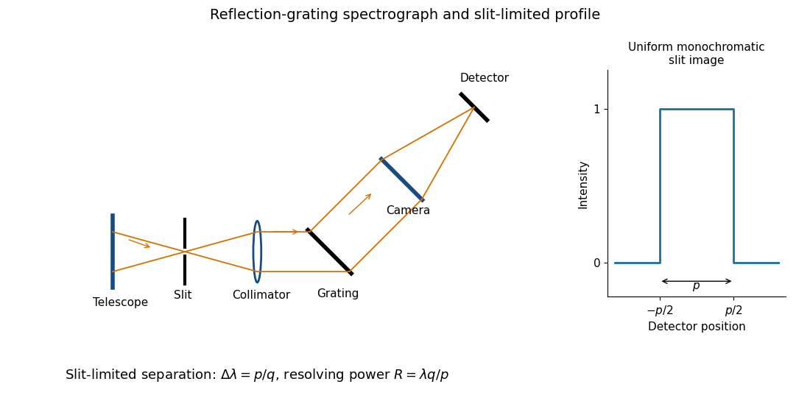

<h1 id="2/a/i/solution">Solution</h1>

↑ **Parent:** [I](../i.md)

The [optical telescope](../../../../../../../optical-telescope.md) focuses the sky onto an [optical slit](../../../../../../../optical-slit.md); the [collimator](../../../../../../../collimator.md) turns the selected [light](../../../../../../../light.md) into a beam incident on the reflection [diffraction grating](../../../../../../../diffraction-grating.md); the [optical camera](../../../../../../../optical-camera.md) images each diffracted direction onto the [photodetector](../../../../../../../photodetector.md). The drawing also shows the monochromatic [optical slit](../../../../../../../optical-slit.md) image for uniform [optical slit](../../../../../../../optical-slit.md) illumination in the geometric, slit-limited approximation.

**[Figure 3](#2/a/i/image-reflection-grating-spectrograph-and-slit-limited-line-profile). Reflection-grating spectrograph and slit-limited line profile**.

Near the chosen [wavelength](../../../../../../../wavelength.md) $\lambda$, a small [wavelength](../../../../../../../wavelength.md) increment moves the image by $q\,\Delta\lambda$, where $q$ is the magnitude of the [linear spectral dispersion](../../../../../../../linear-spectral-dispersion.md). An [optical slit](../../../../../../../optical-slit.md) image of physical width $p$ therefore has an apparent spectral width $p/q$. With one [optical slit](../../../../../../../optical-slit.md) width as the adopted separation criterion,

$$
\boxed{\Delta\lambda=\frac{p}{q},\qquad R=\frac{\lambda q}{p}.}
$$

Uniform illumination gives a top-hat monochromatic profile of width $p$; an unresolved stellar image need not illuminate the [optical slit](../../../../../../../optical-slit.md) uniformly, so its profile follows the actual illumination convolved with the instrument response. Negligible [optical slit](../../../../../../../optical-slit.md) [diffraction](../../../../../../../diffraction.md) and [optical camera](../../../../../../../optical-camera.md) [optical aberrations](../../../../../../../optical-aberration.md) do not remove the finite [diffraction grating](../../../../../../../diffraction-grating.md) [diffraction](../../../../../../../diffraction.md) width. The formula is the slit-limited result when that width is small compared with $p$, rather than a universal exact line-profile criterion.

## ↑ Ancestors (12)

1. [I](../i.md)
2. [A](../../a.md)
3. [2](../../../2.md)
4. [Paper 338](../../../../paper-338-split.md)
5. [Iii](../../../../split.md)
6. [2017](../../../../../split.md)
7. [Past exam of the mathematics course of the University of Cambridge](../../../../../../split.md)
8. [Mathematics course of the University of Cambridge](../../../../../../../mathematics-course-of-the-university-of-cambridge.md)
9. [Course of the University of Cambridge](../../../../../../../course-of-the-university-of-cambridge.md)
10. [University of Cambridge](../../../../../../../university-of-cambridge-split.md)
11. [List of universities](../../../../../../../list-of-universities.md)
12. [Codex Wiki](../../../../../../../split.md)
