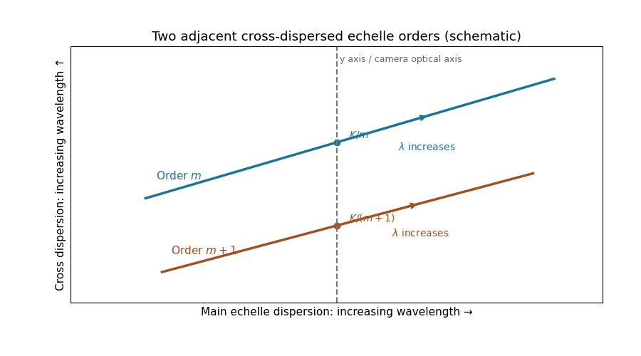

<h1 id="2/c/i/solution">Solution</h1>

↑ **Parent:** [I](../i.md)

Choose [photodetector](../../../../../../../photodetector.md) $x$ along increasing main [grating dispersion](../../../../../../../grating-dispersion.md), and $y$ along increasing [wavelength](../../../../../../../wavelength.md) for the [cross-disperser](../../../../../../../cross-disperser.md). The [echellogram](../../../../../../../echellogram.md) shows two order traces and their intersections with the $y$ axis, which passes through the [optical camera](../../../../../../../optical-camera.md) [optical axis](../../../../../../../optical-axis.md).

**[Figure 4](#2/c/i/image-two-adjacent-cross-dispersed-echelle-orders). Two adjacent cross-dispersed echelle orders**.

For fixed incidence, $d\beta/d\lambda=m/(d\cos\beta)>0$, so increasing [wavelength](../../../../../../../wavelength.md) goes to the right along each order. The [cross-disperser](../../../../../../../cross-disperser.md) also sends increasing [wavelength](../../../../../../../wavelength.md) upward in the chosen orientation; the traces therefore slope upward. At $x=0$, $\lambda_m=K/m>\lambda_{m+1}=K/(m+1)$, so the trace labeled $m$ lies above the trace labeled $m+1$. Reflecting either plotting axis would reverse its arrow but leave the optical content unchanged. **The cross-disperser separates orders that would overlap in the main dispersion direction.**

## ↑ Ancestors (12)

1. [I](../i.md)
2. [C](../../c.md)
3. [2](../../../2.md)
4. [Paper 338](../../../../paper-338-split.md)
5. [Iii](../../../../split.md)
6. [2017](../../../../../split.md)
7. [Past exam of the mathematics course of the University of Cambridge](../../../../../../split.md)
8. [Mathematics course of the University of Cambridge](../../../../../../../mathematics-course-of-the-university-of-cambridge.md)
9. [Course of the University of Cambridge](../../../../../../../course-of-the-university-of-cambridge.md)
10. [University of Cambridge](../../../../../../../university-of-cambridge-split.md)
11. [List of universities](../../../../../../../list-of-universities.md)
12. [Codex Wiki](../../../../../../../split.md)
